# 第 1 章 市场与工具全景：钱、市场、品种、基金与 A 股

> **阅读提示**：本章是全书的地基——先搞清“钱和市场怎么转”，再谈技术分析。内容包含参与者、订单撮合、点差滑点、品种与基金/A 股通识。新手建议完整读一遍；有经验可扫读 1.1–1.6 后直接进第 2 章；1.16–1.17 的基金与资产配置通识可按需查阅，不影响主线。

大多数交易教程，第一章就教你看 K 线、画趋势线。但这本书想先带你搞清楚一件更根本的事：钱和市场，到底是怎么转的。

为什么？因为技术分析里的每一条规则——“支撑会被测试”“突破要放量”“止损放在结构外”——背后都站着一个机制：真实的人，在真实的约束下，用真金白银买卖。你看到的每根 K 线，都不是随机跳动，而是订单、杠杆、流动性、时段共同作用的结果。

本章的总纲：价格不是凭空动的，它是人的行为留下的痕迹。懂了机制，你后面学的每条技术规则才“落地”；不懂机制，那些规则就只是悬空的口诀，换个场景你就不会用了。

这一章把底层机制拆开：谁在交易、交易什么、怎么下单、杠杆怎么放大风险、价格怎么形成、什么时段活跃、什么事件会引爆行情。每一节都会在后面的章节里被反复引用——当你第 5 章看到“sweep”、第 6 章算仓位、第 7 章定军规时，回到这里找“为什么”。

### 1.1 谁在交易：参与者结构 【核心】

市场价格是所有参与者博弈的合力。理解谁在场，才能理解价格为什么那样动。

| 参与者 | 目标 | 行为特征 | 对你的意义 |
| --- | --- | --- | --- |
| 散户 | 赚价差 | 在明显位置挂止损、追突破、抄底摸顶，行为可预测 | 你的止损和他们在同一批位置 |
| 机构/基金 | 大额建仓出货 | 需要对手盘，单量大，无法一次成交 | 他们的建仓/出货留下痕迹（第 5 章） |
| 做市商 | 赚点差 | 同时挂买卖单，提供流动性 | 点差的来源，插针的制造者之一 |
| 高频/算法 | 微小价差、套利 | 毫秒级，吃流动性 | 你打不过，也别在数据瞬间和它抢 |

逐个展开，你会看到每一类参与者都在做同一件事：**在对自己有利的位置，找对手盘**。

**散户**：大多数散户做三件事——把止损放在前高前低附近（因为“那里跌破就说明错了”听起来合理）、在突破时追单（因为怕错过）、在整数关口挂单（因为“1.1000 总该撑住吧”）。这三件事都极其可预测。你不是坏人，你只是普通人，而普通人的行为模式是被统计过的。后面的章节会反复用“你的止损挂在哪，别人也知道”这个事实——这不是阴谋论，这是行为统计。

**机构/基金**：一个管理 10 亿美元资金的基金要建仓 5000 万美元的头寸，不可能像你一样点一下鼠标就完成。它的每一笔大单都会把价格推向不利方向，所以必须拆成几百笔小单、花几天甚至几周慢慢吃进。这个“慢慢吃”的过程，会在图表上留下痕迹——比如横盘吸筹、反复测试某个区间（第 5 章 Wyckoff 会把它拆成可识别的步骤）。机构不是你的敌人，它是市场的“重量级选手”，而重量级选手的移动是藏不住的。

**做市商**：你看到的价格，背后是一个随时准备双向报价的机构。它同时挂买单和卖单，赚取中间的价差（点差）。风险在于：如果市场朝一个方向剧烈移动，它手里的存货会亏钱。所以做市商有强烈的动机在“过度反应”的位置出手——当价格瞬间冲高时它卖给你，价格瞬间砸低时它从你手里买。这就是为什么极端行情往往快速反转：不是“庄家故意扫你”，而是做市商在修正自己的库存风险。

**高频/算法**：毫秒级的程序化交易者，赚的是微小价差和套利，单笔利润极小但笔数极大。它们的存在让点差变小、让市场更有效，但也在数据公布瞬间制造极端的流动性波动。对日内交易者的启示很实际：不要在数据公布的那一秒和他们抢单——那一秒的价格是你无法理解的机器行为，等它走完再说。

**机构主导的真相（Al Brooks 的提醒，给“我的订单在推动市场”的错觉泼冷水）**：

- **75% 以上的交易由计算机完成**。这不是夸张——数学太完美、速度太快，其他解释都不成立。你看到的每一笔成交，对面很可能坐着一套跑了几千次回测的算法。
- **暗池（dark pool）**：机构之间可以在交易所之外私下成交大量股票，交易所里看到的成交量和价格变动，只是冰山一角。所以“怎么量这么少”不代表“没人交易”——大资金经常在你看不见的地方移动。
- **你的订单不推动市场**：即使成交记录显示“就你这笔单成交了”，推动价格变化的仍然是机构在暗池和算法上的意图。价格变动，只因为至少有一个看跌机构和一个看涨机构希望它变动——而你只是恰好同路（或挡路）。
- **每笔交易都站着机构**：你买入时，对面必须有一个机构愿意卖出，而且它必须有一个正的交易者等式（第 6.4）才肯接。这意味着：**你以为的“完美交易”，对面是一台算过账的机器**——它认为这笔交易对它有利才接的。

这条认知的实操含义：不要问“为什么价格不听我的”——价格从来不听任何个人的；要问“我的这笔交易，为什么机构愿意站在对面”。想通了这点，你就不会在数据瞬间抢单、不会期待完美信号，也更理解第 1.8 为什么说基本面事件要躲着走。

**一个关键认知**：散户的行为是可预测的。大多数人把止损放在前高前低附近、在突破时追单、在整数关口挂单。机构知道这一点——这正是第 5 章“流动性猎杀”成立的前提。你不需要成为机构，但必须理解：你挂止损的地方，也是所有人挂止损的地方。这条认知会在第 2 章（支撑阻力）、第 3 章（假突破）、第 5 章（sweep）反复出现，是整本书最重要的底层事实之一。

**为什么这反而让你更安全（不是更无力）**：知道“对面是机构”不等于“我必输”。机构是在用交易者等式做长期统计，不是盯着你一个人。你的优势恰恰在于：机构必须大规模进出（第 1.1），它的行动会在图表上留下痕迹；而你小、快、灵活，可以在机构留下的结构上搭便车（第 5 章整章讲的就是这件事）。小不是劣势，**小 + 纪律 = 搭便车的资格**。

**参与者生态的另一种分法（威科夫 2.0）**：按“入场意图”分，所有参与者只有三类：

- **对冲者（Hedgers）**：不关心价格方向，目的是减少风险敞口——航空公司买石油期货对冲燃料成本、进出口公司锁汇率。他们的交易不是“预测”，是“保险”。
- **投机者（Speculators）**：主动承担风险、押注价格方向——对冲基金、投资基金、你。他们是市场上唯一“单方向加压力”的参与者，也是唯一在推动趋势的力量。注意一个误区：不是所有机构都赚钱——大机构经常因为找不到足够大的对手盘而被迫在不利价格成交（这正是小资金的缝隙）。
- **套利者（Arbitrageurs）**：利用市场的不完全性（跨品种、跨周期、跨市场价差），让价格回归合理——他们像市场的“纠错员”，也像第 1.1 表格里的高频/算法。

这个分类的意义：**每次下单前问自己“我在扮演谁”**——如果你在对冲（怕亏才开单），说明这笔单没有依据，不做；如果你在投机，必须有自己的方向和止损；如果你试图套利，先确认你有信息或速度优势，否则你只是在赌。

**市场到底随机还是确定？两个极端都是错的**：

- **随机游走论**（有效市场假说）：价格无法预测——但事实是结构、趋势真实存在；
- **决定论**：价格全可预测——但新闻、开盘跳空一次次打脸。

罗闻全（Andrew Lo）的**适应性市场假说**（《适应性市场》，2017）是更接近现实的中间态：**市场效率不是“有或无”，而是随条件变化**——参与者非完全理性（受认知偏差影响），同一信息产生不同预期，理性与非理性可以同时存在。

**实战含义（三句话）**：

1. **高效时段躲**：数据公布瞬间、开盘头几分钟，市场非常有效——你打不过，别交易；
2. **低效时段打**：趋势明确、结构清晰的时段，市场相对无效——你的价格行为分析有优势；
3. **结论**：这解释了为什么 1.8 说数据要躲、1.7 说时段重要——你在“低效时段”交易，别在“高效时段”抢。

**扩散理论：每个参与者都有“入市时刻”（威科夫 2.0）**：1962 年罗杰斯提出的创新扩散模型被借用到市场上——一个完整的市场周期里，参与者按五类依次入场：

| 类别 | 占比 | 市场中的角色 |
| --- | --- | --- |
| 创新者 | 2.5% | 内部人/最早布局者——累积或派发的起点 |
| 早期参与者 | 13.5% | 消息灵通的交易员——跟随机构干预 |
| 早期参与人群 | 34% | 能快速识别周期开始的交易员——趋势早期入场 |
| 晚期参与人群 | 34% | 反应迟缓——趋势末段入场，成交量最大的阶段 |
| 迟缓者 | 16% | 最不知情、被情绪（贪婪/FOMO）驱动——接最后一棒 |

它和威科夫的“累积→上升→派发→下降”周期完全对应：创新者+早期参与者是累积/派发的过程，晚期人群是趋势末段的最大成交量，迟缓者接最后一棒。实战含义：**当趋势末段成交量暴涨、身边“谁都在说”某个品种时，你大概率正处于晚期人群的位置**——这不是直觉，是扩散曲线的数学位置。

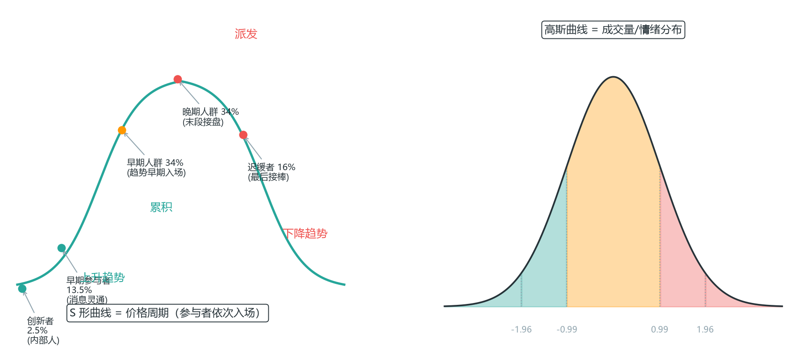

*图 1-1 扩散理论：一个完整周期里，五类参与者按 2.5%→13.5%→34%→34%→16% 依次入场*

**电子化程度：市场的“机器浓度”**：国际清算银行（BIS）的全球评估——期货 90%、股票 80%、CDS 80% 的交易电子化；公司债低（投资级 40%、高收益 25%）。美国股票流动性分散在约 88 个来源（交易所+暗池+内部化）：

- 近 **40% 的交易在交易所外进行**；
- 暗池占 16-18%（彭博估计暗池相关交易已占总量 30% 以上）。

**这对你的意义**：图表上的成交量是“冰山一角”——1.1 说的“成交量不完整”不是猜的，是结构性的：大资金越来越多地在你看不见的地方成交（呼应 1.2 外汇无真实量、1.10 期货量价真实——不同品种的“量”可信度天生不同）。

**均衡价位理论：市场的目的不是制造趋势（Tefi L01A）**：Tefi（太妃）课程对“市场是什么”给出了一个被反复验证的答案——**市场自身的目的是“找到公平价格、促成成交，使总体效用最大化”**：

- **上涨，即因原先的价格已觅不得卖家**：价格从 100 涨到 150、200、250，不是“庄家拉升”，而是“100 这个价位找不到卖家了，只好逐级向上询价，直到有人愿意成交”。下跌同理——原来的价位已觅不得买家。
- **市场很难无止境地上涨或下跌**：它总是希望待在能使总体效用最大化、即创造最多成交的价位附近——**均衡价位**。价格不断向上和向下探测，就是在“试探哪个价位能成交最多”。
- **只有不到 20% 的时刻，市场处于突破/急速运动状态**；80% 以上的时间，价格都在均衡价位附近来回震荡。这是对“价格行为为什么大部分时间无聊”的机制解释——**均衡是常态，突破是例外**。
- **市场擅长通过波动迫使交易者就范**：为了创造最多的成交，市场会用假突破、来回扫荡诱使交易者动手——“即使你不想，你也会在迷迷糊糊中被迫执行交易，去成全市场的效率”。这不是阴谋，是市场最大化成交的本能：波动本身就是它的“营销手段”。

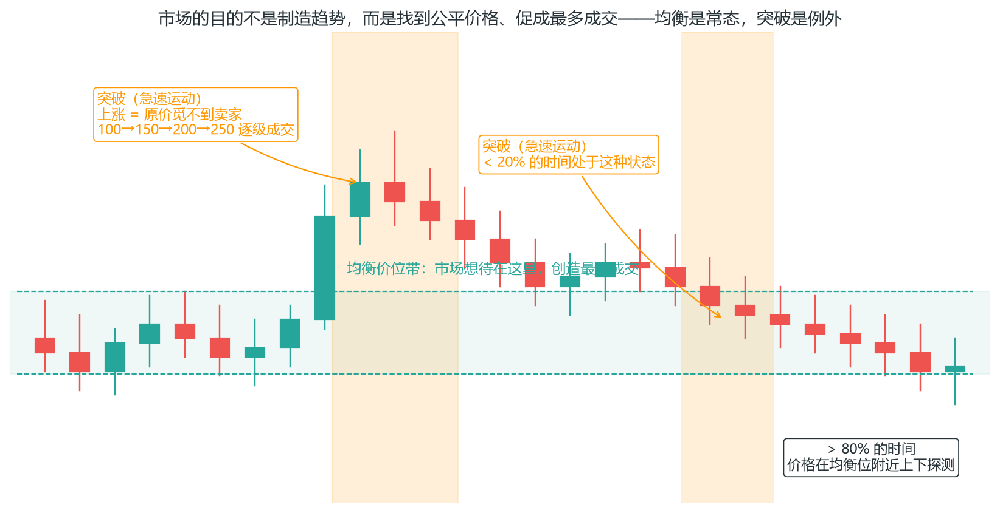

*图 1-2 均衡价位理论：价格围绕均衡位上下探测，>80% 时间在均衡附近，突破只是 <20% 的少数时刻*

这条理论的实操含义：**把“市场应该往哪走”换成“市场现在在哪个均衡位附近、离它多远”**——大多数突破都发生在价格偏离均衡位之后的回归途中（呼应 4.10 均值回归、5.4 BOS/CHoCH 的结构逻辑）。

**机构无法操纵市场（Tefi L01B）**：散户常幻想“主力在操控一切”——数据给出的答案是：**机构无法操纵市场**：

- **2010 年前后，市场 85-95% 的交易决策已由程序/机构包揽，散户只贡献 5-15% 的成交量**（比 1.1 的“75% 计算机”更激进的评估，方向一致）。散户整体年化回报约为 -2.0% 至 -3.8%。
- **最大的交易者也只是“大一点的参与者”**：传奇交易员 Tom Baldwin 一次下 1000 口合约，对价格的影响只有 1-2 个最小价位单位；ES 1 分钟 K 线通常至少有 2000 张合约成交（约 5.4 亿美元名义）——任何单一个体都只是这条河流里的一滴水。
- **Al Brooks 的名言**：“交易最重要的两个概念：一切都有数学基础；当你确信方向时，有同样聪明的人相信相反方向。”——前半句是本书第 6.4 盈亏平衡的数学基础，后半句是第 7.1 概率思维的起点。

**这条认知与 1.1 的“机构主导”不矛盾**：机构主导的是“定价过程”（谁决定价格发现），无法操纵的是“结果”（没人能让价格违背成交量与订单流）。对散户的意义反而更好——**你不需要打败机构，只需要站对位置**：机构的意图会留下痕迹（第 5 章），而“均衡价位”是你理解这些痕迹的第一张地图。

### 1.2 交易什么：品种对比 【核心】

不同品种的机制差异，直接决定你的策略和成本。同样的“价格行为方法”，在外汇、期货、加密上的执行完全是三件事。

| 品种 | 交易时间 | 杠杆 | 成交量真实性 | 特点 | Prop 考核适用 |
| --- | --- | --- | --- | --- | --- |
| 外汇 | 周一5:00~周六 5:00，近24h | 最高 (1:30~1:500) | 无统一真实量（用 tick 量近似） | 流动性最大、点差小 | 最主流（FTMO等） |
| 期货 | 各交易所，日盘+夜盘 | 中等（保证金制） | 真实 | 合约标准化、到期交割 | Topstep/Apex主流 |
| 股票/指数 CFD | 跟交易所时段 | 中等 | 部分真实 | 差价合约是衍生品 | 常见 |
| 加密货币 | 7×24无休 | 高 | 真实但分散 | 波动最大、易插针 | 少数平台 |
| 现货黄金 | 近24h | 高 | 近似 | 避险资产，与美元负相关 | 常见 |

**外汇**：全球最大的市场，日均交易量 7.5 万亿美元级别。它是场外市场（OTC），没有中心交易所，所以**没有统一的真实成交量**——你在平台看到的“成交量”是 tick 量（报价变动的次数），只是近似。这意味着依赖量价的方法（Wyckoff、订单流、Volume Profile）在外汇上只能当参考。但外汇也有它的优势：流动性最大、点差小、24 小时交易、做空自由、无涨跌停。对纯价格行为交易者，主流货币对足够干净。

**期货**：在交易所集中交易，有标准化的合约规格（每点价值固定）、真实的集中成交量、明确的结算规则。这就是为什么 prop 考核平台（Topstep/Apex）偏爱期货——风控清晰、量价真实。缺点是要处理到期换月（rollover）和保证金规则。对想做量价方法的交易者，期货是正统战场。

**股票/指数 CFD**：差价合约（CFD）是衍生品，你并不持有股票本身，只是与经纪商对赌价格。成交量部分真实（底层有交易所数据）。股票本身有 PDT 规则（美国，账户 <$25k 时 5 个交易日最多 3 次日内交易）、做空限制、财报跳空等特殊规则（详见 1.11）。

**加密货币**：7×24 无休、杠杆高、波动极大。没有涨跌停，流动性在极端行情下会瞬间蒸发，插针频繁。对新手是最不友好的品种，但也是价格行为最“纯粹”的教材（无财报、无央行、无开盘收盘，纯粹是流动性游戏）。

**现货黄金**：避险资产，与美元指数负相关，在危机事件时剧烈波动。走势相对“技术化”（受宏观驱动而非个股新闻），价格行为方法适用性好。

**两个必须记住的推论**：

1. 外汇没有统一的真实成交量——因为外汇是场外市场（OTC），没有中心化交易所。你在平台上看到的“成交量”是 tick 量（报价变动次数），只是近似。这就是为什么依赖量价的方法（Wyckoff、订单流）在期货上更正统，在外汇上只能当参考。如果你重度依赖量价，选期货；如果你做纯价格行为，两者都行。

2. prop 考核盘绝大多数是外汇或期货模拟盘。先确认你考的是哪种，因为它们的量价可靠性、时段、合约规格都不同——第 9 章会讲怎么按品种选平台。

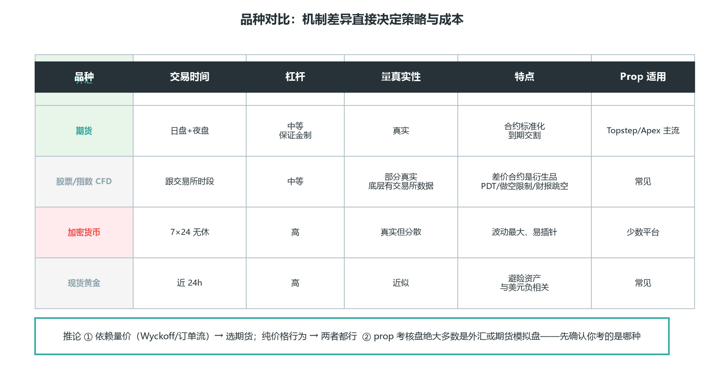

*图 1-3 品种对比：机制差异直接决定策略与成本——依赖量价选期货、纯价格行为两者都行*

### 1.3 怎么下单：订单类型 【核心】

订单是你和市场交互的唯一接口。用错订单类型，等于在错误的时机以错误的价格进场。这一节把每种订单的机制和适用场景讲透。

| 订单 | 成交方式 | 滑点 | 何时用 |
| --- | --- | --- | --- |
| 市价单 | 立即按当前最优价 | 有 | 必须马上进出场 |
| 限价单 | 到指定价或更优才成交 | 无 | 挂单入场（如 pin bar 50% 位） |
| 止损单 | 触及指定价后转市价 | 有 | 止损保护、突破触发 |
| 止损限价单 | 触及后按限价成交 | 无（但可能不成交） | 怕止损滑点太大 |
| OCO | 一个成交另一个自动取消 | — | 同时挂止盈+止损 |
| OTO | 一个成交后自动挂出另一个 | — | 分批止盈（先落袋一半，另一半挂移动止盈） |

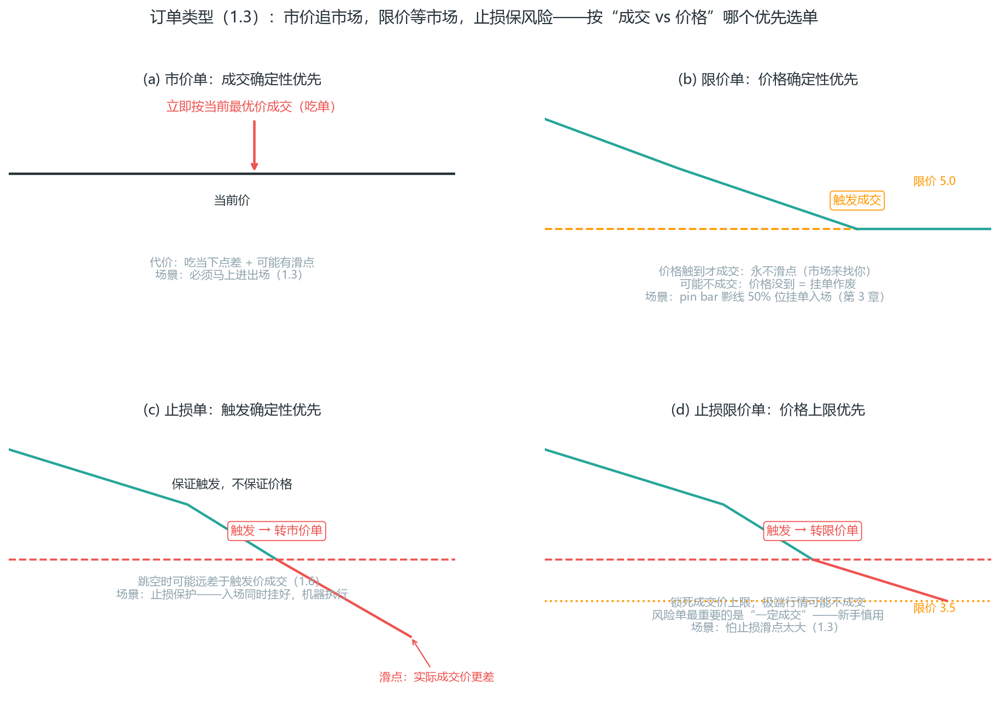

*图 1-4 四种订单触发机制：市价=立即吃单；限价=价格触到才成交（永不滑点）；止损=触发后转市价（保证成交、跳空有滑点）；止损限价=触发后转限价（锁滑点上限、极端行情可能不成交）*

图 1-4 把四种订单画在价格轴上，看它们的区别：

- **市价单 = “你去追市场”**——下单瞬间成交；
- **限价单 = “市场来找你”**——价格到位才成交，隐藏优势是永不滑点（第 3 章 pin bar 影线 50% 位挂限价单入场就靠这个）；
- **止损单 = 保证“触发”，不保证“价格”**——跳空时可能差几个 tick 成交；
- **止损限价单 = 反过来锁死价格，但不保证成交**——极端行情可能完全不成交。

**选单的核心问题只有一个**：你现在更怕什么——怕成交不了，还是怕价格太差？前者选市价/止损，后者选限价/止损限价。

**市价单**：立即以当前最优可成交价成交。优点是确定成交，缺点是你要吃当下市场的点差和可能的滑点。用在“必须马上进场/离场”的场景——比如止损保护（当然止损应该提前挂好）、或者信号确认后不想等限价。

**限价单**：挂在你指定的价格（或更优价格）才成交。它的隐藏优势是**永不滑点**——你提前把价格定好，市场来找你，而不是你去追市场。第 3 章 pin bar“影线 50% 位挂限价单”入场法就是靠这个特性：价格回到你设定的价位自动成交，成交价精确可控。缺点是可能不成交（价格没到你的位置）。

**止损单**：触发价格后转为市价单成交。它和限价单的本质区别：止损单保证“触发”，不保证“价格”——跳空时你可能以远差于触发价的价格成交（滑点）。止损单是风险管理的基石：入场的同时挂好，让机器执行，不给情绪留机会。

**止损限价单**：触发后转为限价单，锁死成交价的上限。代价是跳空时可能完全不成交——在极端行情里，你的保护单形同虚设。适合“怕滑点太大、且能接受不成交”的场景，但新手慎用：风险单最重要的是“一定成交”。

**OCO（One Cancels Other）**：同时挂止盈+止损，一个成交另一个自动取消。这是仓位管理的标准工具，prop 考核平台普遍允许（但禁止对冲锁仓，见下）。

**OTO（One Triggers Other）**：一个订单成交后，自动挂出另一个订单。最典型的用法是分批止盈（第 4.14）：挂单 A 在目标 1 卖出半仓，成交后自动挂出挂单 B——把止损移到保本、或把剩下一半挂到目标 2 继续跑。它把“落袋一半 + 让利润奔跑”从手动两步变成自动化一步，杜绝“第一目标成交后忘了管理剩余仓位”的执行漏洞。实现方式因平台而异（部分平台用 OTO，部分用“条件单”或脚本），下单前确认你的平台支持哪种写法。

**订单的 8 种用法（威科夫 2.0 的完整矩阵）**：上面 5 种订单类型只是“骨架”，真正的用法是 2（买卖）× 2（主动/被动）× 2（入场/离场）的矩阵——同一张订单，站在不同交叉点，作用完全不同：

| 订单 | 挂单位置 | 角色 | 典型用途 |
| --- | --- | --- | --- |
| 市价买入 | 当前价 | 主动 | 入场；空方止损离场（推动上涨） |
| 止损买入 | 高于当前价（触发转市价） | 主动 | 突破追单；空方止损离场（推动上涨） |
| 限价买入 | 低于当前价 | 被动 | 回调挂单入场；空方止盈（提供流动性） |
| 限价止损买入 | 触发后转限价 | 混合 | 怕滑点的回调买入 |
| 市价卖出 | 当前价 | 主动 | 入场；多方止损离场（推动下跌） |
| 止损卖出 | 低于当前价（触发转市价） | 主动 | 跌破追空；多方止损离场（推动下跌） |
| 限价卖出 | 高于当前价 | 被动 | 反弹挂单做空；多方止盈（提供流动性） |
| 限价止损卖出 | 触发后转限价 | 混合 | 怕滑点的反弹卖出 |

这张表的实战含义——**“止损离场”是推动价格的力量，“限价止盈”是承接的力量**：多方止损（市价/止损卖出）砸盘，多方止盈（限价卖出）只是等着接；空方止损（市价/止损买入）推涨，空方止盈（限价买入）只是等着接。所以每次设止损/止盈时问自己：这一刻我是“主动推价格”还是“被动等价格”？**后者才是市场愿意让你成交的原因**（呼应 8.10 的主动/被动）。

**两个实操要点**：

限价单永不滑点。这是第 3 章 pin bar“影线 50% 位挂限价单”入场法的隐藏优势——你提前把价格定好，市场来找你，而不是你去追市场。

挂单必须设时效（GTC 长期有效 / DAY 当日有效）。不设时效的挂单是过期炸弹——三天后你忘了它，它突然成交在一个你根本没在看的价位。纪律：当天计划里的单才挂，收盘前检查所有挂单。

**prop 平台红线**：考核盘允许 OCO 和挂单管理，但普遍禁止“让止损保护失效”的行为——对冲锁仓（同品种同手数多空各开一单）、马丁格尔加仓（亏损后加倍）、网格（固定间隔双向挂单）。这些行为的共同点是“把单笔风险变成无限风险”，正是考核平台最不能容忍的。下单前查清平台规则，违规直接封号，前面所有努力清零。

### 1.4 做多做空与合约规格 【核心】

**做多（Buy）**：先买入，等价格涨了再卖出——低买高卖，涨了你赚钱。这是最自然的交易方向：先持有后平仓，不需要任何特殊机制。

**做空（Sell）**：先借入卖出，再低价买回还。跌了你赚钱。外汇和 CFD 天然支持做空，不需要真的“借”——平台自动完成借贷过程，你只需要关注价格。

**做空心态坑**：人天生觉得“卖出自己没有的东西”是逆天的，做空信号出现时更容易犹豫、更容易提前平仓。这不是技术问题，是心理本能——第 7 章会专门讲。对策不是克服本能，而是把做空写进规则书：信号到了就执行，和做多一视同仁。很多新手只会做多，等于把一半的行情扔掉了。

**三个计量单位，下单前必须查清平台规格**：

- **点（Pip）**：外汇最小报价单位。多数货币对 1 pip = 0.0001（日元对 = 0.01）。比如 EURUSD 从 1.0850 到 1.0851 就是 1 个 pip。
- **点值（Pip Value）**：1 标准手（100,000 单位）每动 1 pip ≈ $10（美元计价对）。这是计算盈亏和仓位的基础。
- **合约乘数**：期货每点值多少钱，由合约决定。ES 每点 $50，NQ 每点 $20，CL 每点 $1000（详见 1.10）。

**示例**：EURUSD 从 1.0850 涨到 1.0890 = 40 pips。1 标准手盈利 = 40 × $10 = $400。

再算一笔账把“点值”的坑讲清楚：如果你做的是 EURJPY（日元对），1 pip = 0.01，点值计算方式不同；如果你做的是微型手（0.01 手），点值又缩小 100 倍。**这些数字不是常识，是仓位计算的输入（第 6 章）**。查错一个，仓位就错一个量级——把每笔交易前要查的规格写进你的交易清单（第 8 章日志模板里有这一栏）。

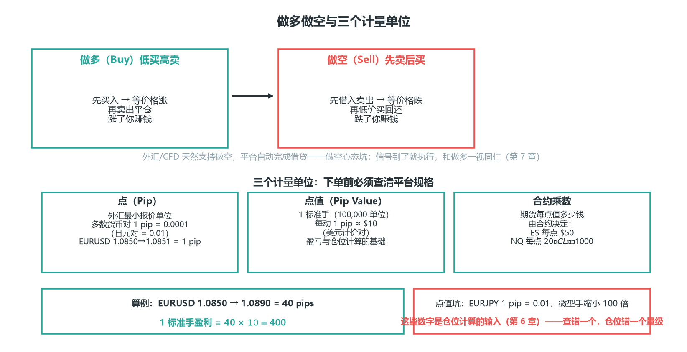

*图 1-5 做多做空与合约规格：三个计量单位是仓位计算的输入（第 6 章）——查错一个，仓位就错一个量级*

### 1.5 杠杆与保证金：爆仓的数学 【核心】

杠杆是双刃剑，而且它锋利的那面对着你。这一节把“爆仓是怎么发生的”彻底算清楚。

**保证金占用 = 合约名义价值 ÷ 杠杆**

**示例**：1 标准手 EURUSD ≈ $100,000 名义价值。1:30 杠杆下，占用保证金 ≈ $3,333。也就是说你用 $3,333 撬动了 $100,000 的头寸——价格每动 1%，你的本金就动 100% ÷ 30 ≈ 3.3%。

**强平（爆仓）机制**：当亏损把你的账户权益打到“维持保证金”以下，平台会强制平仓，不问你意见。注意这个机制的本质：**爆仓不是“亏光了”才发生，是亏到保证金比例不达标就发生**。高杠杆下，很小的反向波动就可能触发强平——这不是市场在惩罚你，是杠杆在放大你的仓位误差。

算一笔具体的账：$10,000 账户，1:100 杠杆，下 1 手 EURUSD（名义 $100,000，占保证金 $1,000）。价格反向走 100 pips（$1,000 亏损），账户权益降到 $9,000，保证金水平 = 9,000 / 1,000 = 900%，还安全。但如果价格反向走 500 pips，权益 $5,000，保证金水平 500%——部分平台在保证金水平跌破维持线（通常为初始保证金的一半）时强平：1 手的情形要反向约 9%（约 950 pips）才爆仓；可如果你按“感觉”把仓位下到 10 手（1:100 满仓，名义 $1,000,000），反向约 50 pips（≈0.5%）时保证金水平就触及维持线被强平——而你原本的止损可能就设在 0.5%（50 pips）——**止损还没触发（或刚触发就被强平），爆仓先来了**。

**杠杆的真相——这是本章最重要的一句话**：

> 杠杆不改变你的胜率，它放大的是你的仓位误差。

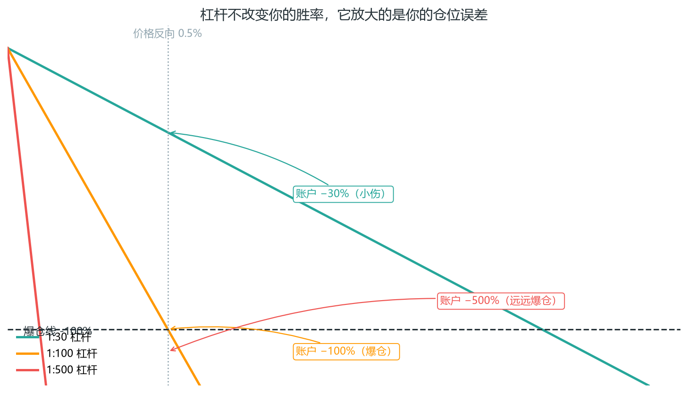

*图 1-6 杠杆放大的是仓位误差：同样的判断错误，低杠杆只是小伤，高杠杆直接爆仓*

该下 0.5 手的信号，你手一抖下了 5 手——杠杆没让你判断变差，但让同样的判断错误从“亏 0.5%”变成“亏 5%”，直接逼近爆仓线。杠杆越高，你允许的犯错空间越小。第 6 章会教你怎么用仓位公式“反推”需要的杠杆——不是平台给你多少你用多少。

**考核期建议**：用 1:30 以下的实际杠杆，别贪平台给的 1:500。平台给你高杠杆是为了让你更容易爆（你爆了对它没损失，考核费它已经收了）。需要多少杠杆，用第 6 章的仓位公式反推，多一分都不要。

### 1.6 价格是怎么形成的：买卖盘、点差、滑点、插针

理解了订单和杠杆，再看价格本身是怎么“长”出来的。

**买卖盘与点差**：任何时刻市场有两个价格——

- 卖价 Ask（你买入的价格）← 永远更高
- 买价 Bid（你卖出的价格）← 永远更低
- 点差 = Ask − Bid

点差是你每次进出的固定成本，由做市商设定。你买入用 Ask、卖出用 Bid，一买一卖之间天然亏一个点差。这就是为什么高频进出（剥头皮）对点差极其敏感——每次进出都在交“过路费”，剥头皮一天进出几十次，点差成本直接吃掉利润。

**点差宽窄由流动性决定**：伦敦时段流动性好，点差窄；亚盘流动性薄，点差宽；数据公布瞬间流动性枯竭，点差能瞬间放大数倍。一个实用的推论：**点差宽的时段，你的入场成本高**——同样的信号，在伦敦开盘做和在亚盘尾盘做，成本完全不同。

**滑点**：你下的止损单，在价格跳空时可能以更差的价格成交。这不是平台坑你，是那个价位没人接单。比如价格瞬间从 100.00 跳到 99.80，你挂在 99.95 的止损单只能在 99.80 成交——你多亏了 15 个点。滑点在跳空（周末开盘、数据瞬间）和低流动性时段高发。

**一句话记牢**：市价单和止损单会滑点，限价单不会。

**插针（Spike）**：流动性瞬间枯竭时，价格猛地冲出一个极端影线又立刻回来。加密和亚盘数据时段高发。插针是第 5 章“sweep”最容易被误认的地方——**不是每次插针都是机构扫止损，有时只是没人接单**。怎么区分？看三个维度：插针是否发生在关键位（结构位上的插针更像 sweep）、插针后是否快速收回、收回时是否放量。第 5 章会给完整的识别清单。

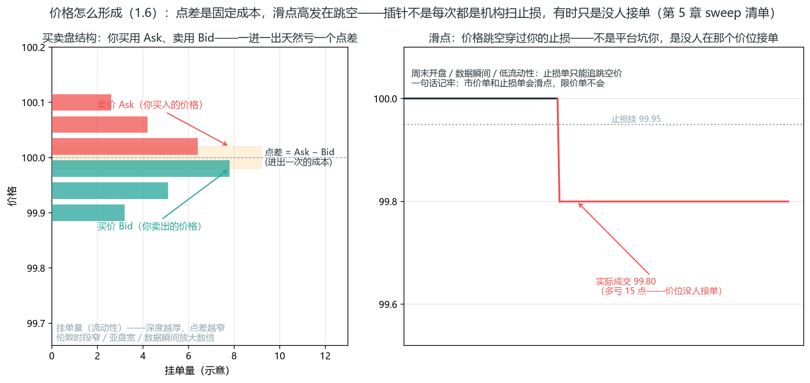

*图 1-7 价格怎么形成：左=买卖盘结构（买用 Ask、卖用 Bid，点差是进出一次的固定成本，流动性越厚点差越窄）；右=滑点——价格跳空穿过止损，挂 99.95 的止损单只能在 99.80 成交，多亏 15 点*

左图是你每笔交易的真实处境：两个价格同时存在，你买入永远成交在更高的 Ask、卖出永远成交在更低的 Bid，一进一出之间点差已经亏掉。这就是为什么 7.8 的 Brooks 清单里“剥头皮”类交易要额外警惕——进出次数越多，点差成本吃掉的利润越多。右图把“滑点只发生在跳空”画成了具体数字：止损单是跟着价格走的，价格跳空时你只能在新的价位成交。**结论一句话：成本意识要进入每笔交易的决策——选流动性好的时段、用限价单锁成本（1.6）、远离数据瞬间**。

### 1.7 什么时候交易：全球时段

外汇 24 小时可交易，但不是每个时段都值得交易。波动和流动性随时段变化巨大——你的信号质量，很大程度取决于你在哪个时段找信号。

| 时段 | 北京时间 | 特性 |
| --- | --- | --- |
| 悉尼 | 6:00-14:00 | 流动性最薄，澳元/纽元活跃 |
| 东京 | 8:00-14:30 | 日元活跃；亚盘整体波动小 |
| 伦敦 | 15:00-24:00 | 全球流动性最大，趋势启动高发 |
| 纽约 | 20:00-次日4:00 | 与伦敦重叠时段是全天最活跃 |

**伦敦-纽约重叠（北京 20:00-24:00）是黄金窗口**：流动性最好、点差最小、大行情高发。第 5 章 SMC 的 Kill Zone 指的就是这个。两个全球最大的金融中心同时开市，资金量最大，趋势最容易启动，信号也最可靠。

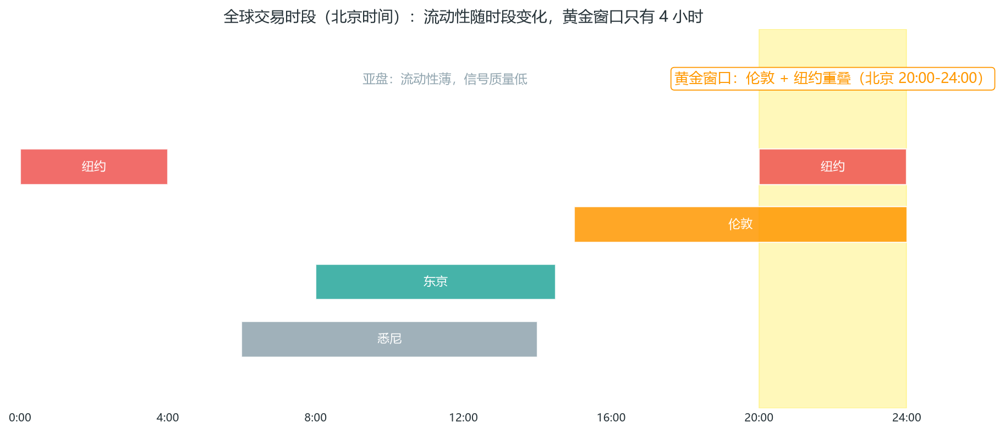

*图 1-8 全球交易时段（北京时间）：悉尼/东京/伦敦/纽约，20:00-24:00 为黄金窗口*

**冬令时（11 月-次年 3 月）所有时间 +1 小时**。美国夏令时（3 月-11 月）期间用上表时间；冬令时伦敦开盘推迟到北京 16:00，纽约开盘到北京 22:30。做外汇/期货的人必须每年调两次这个“时差表”，写进你的交易笔记。

**周末与跳空**：外汇周末休市。周五尾盘不平仓的隔周单，要承担周一开盘跳空的风险——价格可能直接跳过你的止损。你的止损单挂在 1.1000，周一开盘价格直接 1.0950，你的成交价就是 1.0950，多亏 50 点。**多数 prop 平台禁止周末持仓**，查清规则（第 9 章），周五收盘前处理干净。

**一个实用原则**：亚盘的信号质量普遍低于欧美盘。流动性薄的时候，假信号多、点差宽、滑点大。新手宁可只做伦敦和纽约时段——少做一半的时间，但做的那一半质量高得多。这也是第 8 章“过滤条件”的一种：**时段本身就是过滤器**。

**但上面的时段表是“外汇的”**。品种不同，时段分布完全不同——用真实数据验证你的品种，别照搬外汇时段表。加密市场 7×24 小时交易，看起来“没有时段”，实际上活跃度高度集中：

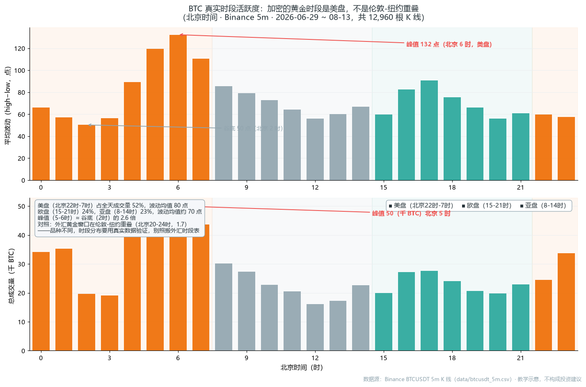

*图 1-1R 真实数据：BTC 时段活跃度——加密的黄金时段是美盘，不是伦敦-纽约重叠（数据源：Binance BTCUSDT 5m K 线）*

用 BTC 真实数据看时段分布，两个反直觉的结论：**加密的活跃高峰在美盘（北京 22 时-次日 7 时，占全天成交量 52%），而不是外汇意义上的“黄金窗口”**——因为加密的对手盘来自美国时区的科技与量化资金，美股收盘后的 22 时-次日 7 时才是主战场；**波动峰值在北京 6 时（≈谷底 2 时的 2.6 倍）**，亚盘反而有 8 时的一个小高峰。含义：做加密不要拿外汇时段表套，用你自己的历史数据按小时统计“波动 + 成交量”两个维度，画一张自己的时段分布——这就是第 8 章“过滤条件”的量化版。

### 1.8 什么在推动价格：基本面黑天鹅

技术分析管“什么时候、什么价位”，但数据事件能瞬间击穿任何技术位。你画得再漂亮的支撑，一个超预期的非农数据就能把它打穿。这一节不是教你分析基本面，是教你别被它打穿。

| 数据/事件 | 影响对象 | 时间规律 |
| --- | --- | --- |
| FOMC 利率决议 | 美元、黄金、美股（波及全球） | 每年 8 次、固定日历（美联储，约每 6 周） |
| 非农就业 | 美元、黄金、股指 | 每月第一个周五，北京 20:30 |
| CPI 通胀 | 各国货币、债券 | 月度 |
| GDP | 各国货币、债券 | 季度初值与修正 |
| 期权到期日 | 期权及标的（三巫日/四巫日波动放大） | 每月第三个周五（美股）；期货/加密另有月度与季度到期 |
| 风险情绪（战争/危机） | 避险资产：日元、黄金、美债 | 突发 |

**你不需要会分析基本面**——那是宏观交易员的事。你只需要知道有炸弹：知道它什么时候引爆，以及引爆前别站在坑里。

1. 交易前看经济日历（第 8 章工具）。把未来一周的“炸弹时间”标出来，写进你的周计划。
2. 重大数据公布前 15 分钟不开新仓（第 7 章军规第 5 条）。数据瞬间的价格行为是机器+做市商主导的，不是你的价格行为——你看不懂那一刻的 K 线。
3. 已有持仓的，数据前提前收紧止损或减仓。别赌“数据会利好我”——你在用无法分析的事件赌钱。

> **期权到期日例外**：美股每月第三个周五（triple/quadruple witching）的波动不是信息驱动的，而是到期平仓/展期驱动的——那天成交量放大、价格行为容易失真，信号质量同样下降，纪律与数据日相同。

**为什么数据能击穿技术位**：技术分析假设“市场平稳运行”，即参与者按技术逻辑行动。但数据公布瞬间，整个市场的注意力从技术面瞬间切换到基本面，大量资金在几秒内涌向同一方向——技术位在那个时刻没有任何承接力。**数据事件是技术分析的例外，把例外当常态防，才不会被黑天鹅带走**。这不是悲观，是对市场机制的正确预期。

**新闻已经在价格里（Al Brooks 的补充）**：你看到新闻时，机构通常已经知道了。大多数机构交易者在新闻发布前就了解它——它们已经在按“明天的新闻”交易了。所以：

- 电视上专家对基本面的分析，早在播出前就被价格消化。你根据新闻做出的判断，入场已经晚了一步。
- 更准确的说法是：**价格不是对新闻的反应，价格是新闻的先行指标**。你该盯的是价格行为（第 2-3 章），而不是新闻标题。
- 如果你发现“价格先动、新闻后到”，那不是巧合，是信息流的方向——机构先走，散户后知。你唯一能做的，是在价格行为上搭机构的便车，而不是在新闻上追机构的尾巴。

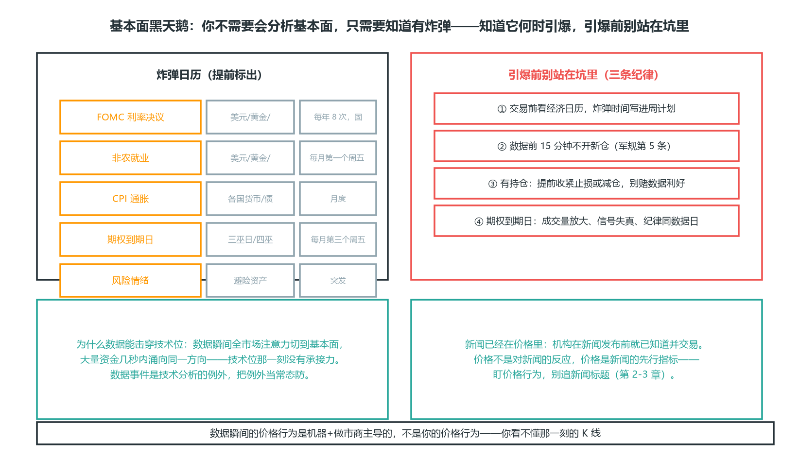

*图 1-9 基本面黑天鹅：左=炸弹日历（FOMC/非农/CPI/期权到期/风险情绪提前标出）；右=引爆前三条纪律（看日历/数据前 15 分钟不开仓/有持仓先收紧止损）；下=为什么数据能击穿技术位 + 价格是新闻的先行指标*

### 1.9 品种细节：为什么“脾气”重要

前面 1.2 给了品种概览，本节深入每个品种的“脾气”。同一套价格行为方法，放在不同品种上，执行细节完全不同：

- **止损宽度要按品种的波动率（ATR）调**，不是固定点数。EURUSD 的 50 点和 ES 的 50 点完全是两个世界——ES 一个交易日轻松波动 100+ 点，50 点的止损在 ES 上等于没设。
- **交易时段要按品种的活跃时段调**。EURUSD 看伦敦纽约，ES 看美股开盘，黄金看纽约时段，原油还要叠加 EIA 库存数据时段。
- **成本结构（点差/佣金/隔夜利息/资金费率）不同**。外汇点差是主要成本，期货有佣金，加密永续有资金费率（funding rate）——每个品种都有自己“看不见的过路费”。
- **有的品种能真实看量（期货/股票），有的不能（外汇）**。这直接决定你的方法能不能用量价确认。

**选错品种 = 用对的方法在错的战场打仗**。一个做趋势回调系统（第 4 章）的交易者，在加密上做日内止损会频繁被打——不是系统错了，是品种脾气和系统的周期、波动不匹配。选品种是系统设计的一部分（第 4 章 Van Tharp 会讲“合身”），不是随便挑一个。

### 1.10 期货：prop 考核的主战场

为什么 prop 公司偏爱期货：集中交易所、量价真实、合约标准、风控清晰。Topstep/Apex 都是期货 prop。这一节把期货的机制讲透——如果你考期货 prop，本节是必修。

**核心机制**：

- **合约规格**：每个合约有固定的乘数。如 ES（标普500 E-mini）每点 $50，NQ（纳指）每点 $20，CL（原油）每点 $1000。下单前必查。这个数字直接进第 6 章的仓位公式。
- **tick 价值**：最小变动价位。ES 每 tick = 0.25 点 = $12.5。止损距离用“多少 tick/多少点”表达时，先换算成金额。
- **到期与换月（rollover）**：期货合约有到期日，临近到期要换到下一个合约（如 ES 主连）。持仓过换月要注意价差跳变——新旧合约之间的价差可能让你的持仓瞬间“跳价”。考核期通常用主连（连续）合约，也要留意平台用的是哪个月的合约。
- **保证金**：日内保证金（较低）vs 隔夜保证金（较高）。prop 考核通常只用日内——这既是因为隔夜保证金高，也是因为隔夜跳空风险大（第 1.7 周末持仓的期货版本）。
- **量价真实**：期货有集中成交量，Wyckoff/订单流/Volume Profile 在期货上最可靠（呼应本章 1.2 与第 5 章）。

**常用品种**：

| 品种 | 代码 | 每点价值 | 特点 |
| --- | --- | --- | --- |
| 标普500 E-mini | ES | $50 | 流动性最好，日内首选 |
| 纳指 E-mini | NQ | $20 | 波动比 ES 大 |
| 道指 | YM | $5 | 波动较小 |
| 原油 | CL | $1000 | 波动大，受基本面驱动 |
| 黄金 | GC | $100 | 避险，与美元负相关 |

**对价格行为的适配**：ES/NQ 是日内价格行为的最佳标的——流动性好、结构清晰、量价真实。南桥/Thomas Wade 都做 ES（呼应附录的大 V 参考）。注意品种和波动的匹配：NQ 波动约为 ES 的两倍，同样的止损距离，NQ 上被扫的概率高得多——新手从 ES 起步更合理。

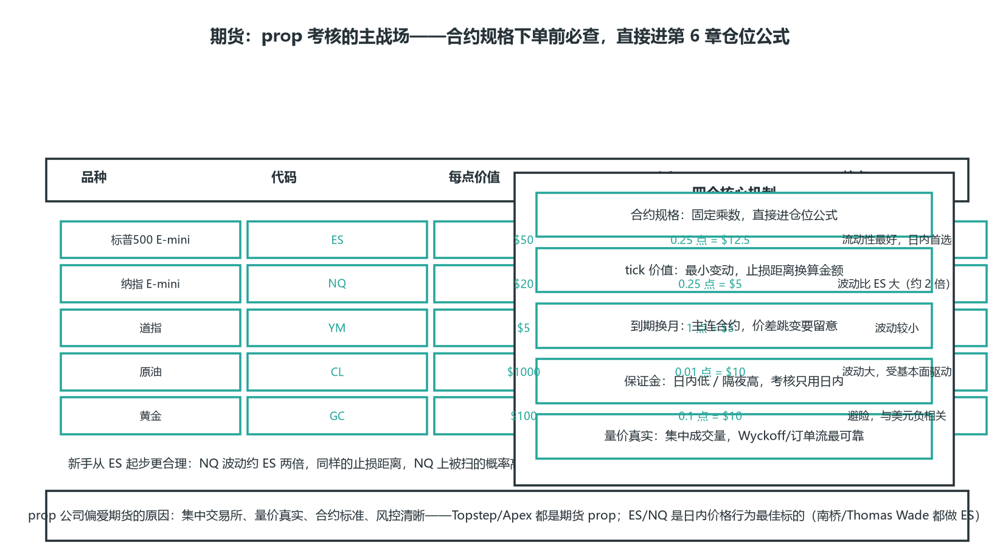

*图 1-10 期货合约规格速查：ES/NQ/YM/CL/GC 每点价值与 tick + 四个核心机制（合约规格/tick 价值/到期换月/保证金）+ 新手从 ES 起步*

### 1.11 股票：做空限制与规则

**核心机制**：

- **做空限制**：股票做空要“借券”，不是所有股票都能做空；且有"uptick rule"等限制（美国规则，价格下跌时不能追空）。外汇/期货做空更自由。如果你主要做空，股票不是好战场。
- **PDT 规则（美国）**：账户 <$25k 时，5 个交易日内最多 3 次日内交易。这是小资金日内股票交易的硬约束——想日内做股票，要么账户到 $25k，要么用现金账户/期货替代。很多新手做美股日内才发现这个规则，直接卡死交易节奏。
- **交易时段**：美东 9:30-16:00，开盘半小时和收盘前波动最大。盘前盘后流动性差、点差宽，信号不可靠。
- **缺口（gap）**：股票隔夜会跳空（第 2.7 节），因为非 24h 交易。财报、隔夜新闻都会造成缺口——你的止损单在跳空时可能以远差于预期的价格成交（第 1.6 滑点）。
- **个股 vs 指数**：个股受公司基本面/财报影响大；指数（SPY/QQQ）更“干净”，适合纯技术。财报日是最大的“炸弹”——个股持仓跨财报 = 赌新闻。

**对价格行为的适配**：指数 ETF（SPY/QQQ）适合价格行为；个股要小心财报跳空和消息驱动。做个股务必把财报日历加进你的风险检查（第 8 章日历）。

### 1.12 外汇：要点速查

（本章 1.2 已概览，这里是速查）

- 24h 交易（周一~周六），无集中交易所，OTC 市场。
- 量不真实：无统一成交量，用 tick 量近似——量价方法在外汇上只能当参考。
- 点差为主要成本，伦敦-纽约重叠时段点差最窄。
- 隔夜利息（swap）：持仓过夜有正负利息。高息货币对的多单收利息（正 swap），低息货币对的多单付利息（负 swap）。长期持有要算这笔账——它进第 6 章的“成本”项。
- 货币对分类：主流对（EURUSD/GBPUSD/USDJPY，点差小）、交叉对（EURGBP，点差大）、exotic（点差极大，别碰）。
- 对价格行为的适配：主流对流动性好、结构清晰，适合价格行为；但量价确认弱于期货。

**新手选择**：EURUSD 是公认最适合入门的货币对——点差最小、流动性最好、结构最清晰、和美股/黄金的相关性低（独立性强）。把它当你的“单一品种深耕”对象（1.15）。

### 1.13 加密货币：24/7 与高波动

**核心机制**：

- 7×24 无休：没有开盘收盘，周末也交易。但也意味着没有“休息”，且周末流动性差易插针。你没法用“收盘后复盘”的节奏——需要更强的纪律来自我管理（第 7 章流程）。
- 资金费率（funding rate）：永续合约多空之间的定期支付。做多密集时多头付费给空头，反之。这是持仓成本/收入——趋势里方向对了也许还能收钱，方向错了就要额外付费。
- 波动极大：日内 5-10% 常见，止损要放很宽，仓位要很小。同样的价格行为信号，在加密上的止损距离可能是外汇的 5 倍——第 6 章公式会自动算出更小的仓位，但很多人过不了“仓位这么小还做它干嘛”的心理关。
- 插针频繁：流动性瞬间枯竭造成极端影线（本章 1.6），sweep 信号容易被误判。关键位上的插针十有八九是 sweep，但也有不少是纯粹的流动性真空。
- 交易所分散：各所价格略有差异，量也分散。你在币安看到的量不代表全局——“全市场量价”这个概念在加密上是被拆散的。

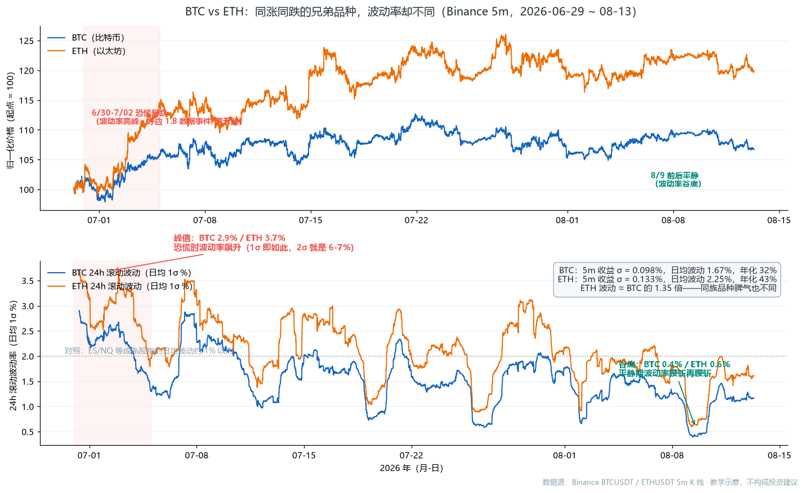

*图 1-2R 真实数据：BTC vs ETH 波动率对比（数据源：Binance BTCUSDT/ETHUSDT 5m K 线）*

上下对着读：**上图画的是“同步”**——BTC 和 ETH 归一化后几乎重合，6 月底到 8 月中旬同涨同跌（呼应 1.14 相关性：同一个加密市场，驱动因素相同）；**下图画的是“不同”**——ETH 的波动率全程高于 BTC（日均 2.25% vs 1.67%，约为 1.35 倍），而且两者一起大幅波动：6/30-7/02 恐慌时 BTC 冲到 2.9%、ETH 冲到 3.7%（1σ 就这么高，2σ 就是 6-7%——这就是上文“日内 5-10% 常见”的数据依据），8/9 平静时又一起压缩到 0.4%/0.6%（腰斩再腰斩）。对照成熟股指（日均波动通常在 1% 以内），加密的波动量级高一个数量级——**同样的信号，在加密上的止损距离可能是外汇的 5 倍，仓位要小到很多人过不了心理关**（第 6 章公式会自动算出来，但“仓位这么小还做它干嘛”的心理关得自己过）。

**对价格行为的适配**：加密结构也走价格行为，但高波动+插针让止损和仓位管理更难。新手不建议从加密开始——它不是“练手”品种，是“加难度”品种。

### 1.14 跨市场：相关性与风险叠加

**相关性（correlation）**：不同品种可能同涨同跌。这不是巧合，是它们背后有共同的驱动因素：

- EURUSD 和 GBPUSD 高度正相关（都是非美货币对美元）。
- 美元指数（DXY）和多数非美货币负相关。
- ES 和 NQ 高度正相关（都是美股指数）。
- 黄金和美元通常负相关（避险 vs 避险资金流向），但极端危机时会同涨（流动性危机时一切皆跌）。

**风险叠加陷阱**：同时做多 EURUSD + GBPUSD，以为是两笔分散的交易，实际是同一个方向押了两注——相关性让你的真实风险翻倍。你以为是“分散”，其实是“重仓”。这是组合管理最常见的认知错误。

**对策**：

- 高相关品种只选一个做，或把它们的仓位合并计算风险。做多 EURUSD 0.5% 风险 + 做多 GBPUSD 0.5% 风险 = 实际 1% 风险押在同一个“美元走弱”上。
- 用 DXY 辅助判断非美货币的整体方向。DXY 走强，非美多头整体要小心。
- 组合持仓时，算的是“组合总风险”，不是单笔风险的简单相加。第 6 章的仓位公式按单笔算，组合层面要额外做一道“相关性修正”。

把 1.14 的三块内容（相关性速查 → 风险叠加陷阱 → 三条对策）压成一张速查图：

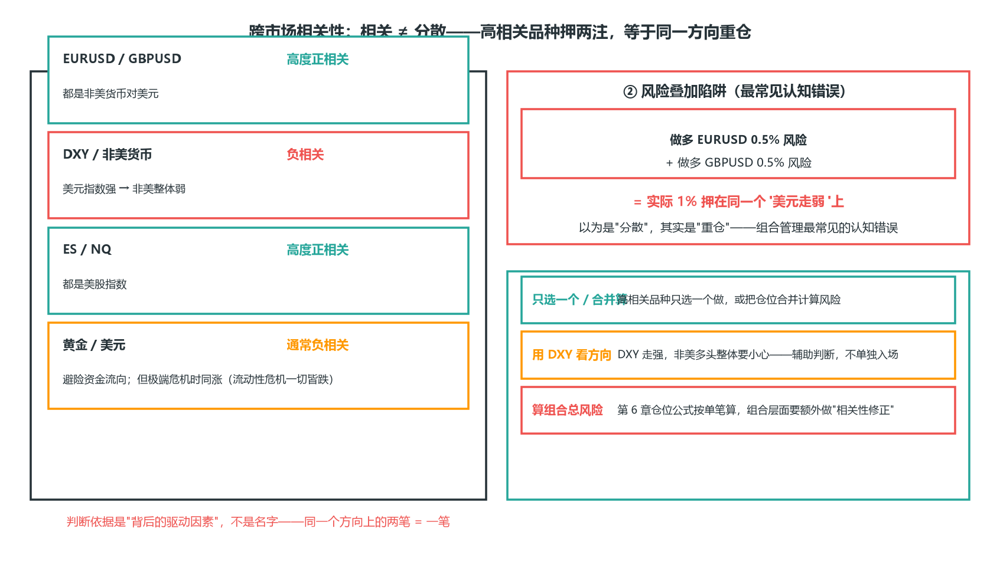

*图 1-11 跨市场相关性与风险叠加：相关 ≠ 分散——高相关品种押两注，等于同一方向重仓*

### 1.15 怎么选品种：匹配你的系统和目标

**选择框架（按优先级）**：

1. 匹配 prop 目标：考期货 prop → 练 ES/NQ；考外汇 prop → 练主流货币对。
2. 匹配交易周期：日内 → ES/NQ/主流外汇（流动性好、时段明确）；波段 → 股票指数/商品。
3. 匹配方法：依赖量价（Wyckoff/订单流）→ 期货/股票（量真实）；纯价格行为 → 外汇/期货都行。
4. 匹配波动承受：波动大（NQ/CL/加密）→ 仓位小、止损宽；波动小（YM/EURUSD）→ 仓位可稍大。

**一条实用建议**：新手先聚焦单一品种（如 ES 或 EURUSD）。单品种让你摸透它的“脾气”——什么时段活跃、波动多大、结构多清晰、假信号长什么样。大 V 们（附录）都是单品种深耕，这不是偶然：一个品种的 1000 小时，比十个品种各 100 小时有效得多。第 8 章的验证（100+ 笔回测）也必须基于单一品种——不同品种混在一起统计，期望值就算不清了。

### 1.16 A 股：规则与脾气（编者补充 · 投资通识）

本书主线是外汇/期货 + prop 考核，但作为中国读者，你的资产天然和 A 股纠缠在一起——工资、房贷、指数走势、周围人聊的股票。这一节把 A 股讲成“另一个品种”：它有自己的交易规则、成本结构和脾气，和 ES、EURUSD 一样需要先摸清再谈技术。

**A 股交易规则速查**（与期货/外汇对照）：

| 规则 | A 股 | 美股 | 期货（ES） |
| --- | --- | --- | --- |
| 当日回转 | T+1（当天买次日才能卖） | T+0 | T+0 |
| 涨跌停 | 主板 ±10%，创业板/科创板 ±20%，ST ±5% | 无 | 无 |
| 交易时段 | 9:30-11:30、13:00-15:00（北京） | 9:30-16:00（美东） | 日盘+夜盘 |
| 集合竞价 | 9:15-9:25 开盘、14:57-15:00 收盘 | 盘前盘后 | 开盘竞价 |
| 最小单位 | 100 股（1 手） | 1 股 | 1 手（合约规格固定） |
| 做空 | 融券受限、门槛高 | 借券+uptick 限制 | 自由 |
| 杠杆 | 融资最多约 1:1 | 日内 4:1 | 保证金制，灵活 |

**T+1 是 A 股和本书体系的第一个冲突点**：本书第 7 章军规说“入场即挂止损”——但 A 股当天买的仓位当天不能卖，止损单最早明天才生效。这意味着：

- 日内止损体系（第 4 章）在 A 股上无法直接执行——你看到的“日内假突破”信号，错了要等到明天才能认错。
- 信号周期必须放大：日线/周线级别的价格行为（趋势回调、区间边界）在 A 股更适用，分钟级别的方法水土不服。
- 如果你在 A 股练习本书方法，把“止损触发”理解为“次日开盘处理”，仓位要按两天的波动来算（第 6 章 ATR 止损直接给你答案）。

**成本结构——高频交易的隐形杀手**：

| 成本 | 费率 | 说明 |
| --- | --- | --- |
| 印花税 | 卖出单边 0.05% | 2023 年 8 月起减半，仍是主要成本 |
| 佣金 | 约万 2.5（双边） | 可和券商谈，网上开户一般更低 |
| 过户费 | 约 0.001%（双边） | 金额小，但买卖都有 |

算一笔账：10 万元满仓进出一次，印花税 50 元 + 佣金 50 元 + 过户费 2 元 ≈ 102 元。看起来不多，但如果一年高频进出 100 次（每次 10 万），成本就是 1 万元——年化 10% 的成本。**A 股的结构天然惩罚高频**：T+1 让你无法当日纠错，成本让你无法靠微利堆利润。这和外汇/期货的“点差+佣金”逻辑不同，它更接近“波段税”。

**A 股市场特性**：

- **散户占比高**：散户贡献约 6 成交易量（与美股机构主导相反）。这带来一个反直觉的好处：价格行为方法在 A 股同样有效（散户行为可预测，第 1.1），但也带来坏处——情绪化波动更大、题材炒作更疯。
- **政策驱动**：“政策底”“国家队”是 A 股特有的叙事，重大政策发布时技术位瞬时失效（呼应 1.8 的“数据黑天鹅”——A 股的政策就是最高等级的数据）。
- **题材轮动快**：热点板块切换以周为单位，追热点本质是追别人已布局的位置（呼应扩散理论的“晚期人群”，1.1）。
- **涨跌停是 A 股独有的形态**：一字涨停/跌停 = 无人成交，K 线只有一根横线。它既是“趋势加速”的信号，也是“流动性断层”——跌停板上你的止损单根本卖不出去（呼应 1.6 滑点的极端版本）。

**对价格行为的适配结论**：A 股走的是同一套价格行为（结构、假突破、区间边界都成立），但三个差异必须记住：**周期放大到日线以上、T+1 让止损推迟一天生效、涨跌停是流动性断层不是信号**。把它当成“波段训练场”和“配置战场”，而不是本书日内体系的直接复制。

**A 股特有打法（进阶，都是本书体系在 A 股规则下的变体）**：

- **涨跌停打法**：涨停 = 最强动量 + 无人愿意卖，是趋势的极端表达（呼应 4.10 趋势跟踪）。涨停板的两种用法：①**连板龙头**——首次涨停后的次日溢价（高开）概率，本质是“趋势回调”的日线版（4.3 的入场点换成“首板次日低开/平开”）；②**开板 = 高潮**——连续涨停后开板放量，是 4.10 说的“趋势末端衰竭”，别接飞刀。跌停是流动性断层（上面的成本/规则已说），跌停板上的“便宜”是接不住的刀。
- **T+1 约束下的策略调整**：当天买不能当天卖，所以“尾盘买、次日冲高卖”（隔日策略）是 A 股日内法的天然替代——尾盘买入看的是次日惯性，止损改为次日开盘处理（呼应上文规则表）；**禁止尾盘追高**——买完当天无法纠错，等于把纠错权交给隔夜跳空。
- **题材轮动**：热点板块以周为单位轮动（呼应 1.1 扩散理论：你看到“题材火了”时，最早的一批人已获利）。可执行的版本：主线题材回调到日线均线/前低时按 4.3 入场（顺势），而不是在题材高潮日追板（逆势）。
- **打板的数学（了解即可，新手别做）**：打板 = 在涨停价排队买入，赌次日溢价。它的胜率依赖情绪周期（连板高度），本质是“动量追涨的极端版”——胜率数据随市场情绪波动极大，且排板失败（未成交）和炸板（开板亏损）都是实亏成本。**如果你想做，先按第 8 章验证闭环跑 100 笔再说**；不想做，打板知识用来“识别顶部”就够了——全民打板日往往就是 4.10 的极速上涨末端。

**一句话**：A 股不是另一套市场，是同一套价格行为 + 三条特殊规则（T+1/涨跌停/政策驱动）的约束解——把本书的方法乘上这三条规则，就是 A 股打法。

把 1.16 的三块内容（规则速查 → 波段税成本 → 三条差异三条应对）压成一张速查图：

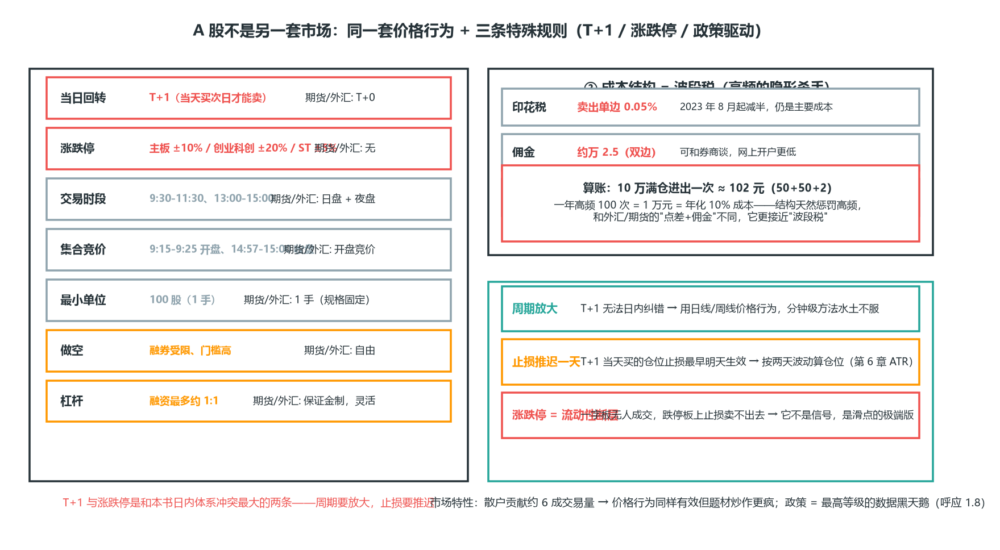

*图 1-12 A 股规则与脾气：同一套价格行为 + 三条特殊规则（T+1/涨跌停/政策驱动）的约束解——先摸清规则再谈技术*

### 1.17 基金与资产配置：不盯盘的财富底座（编者补充 · 投资通识）

**为什么一本交易手册要讲基金**：因为本书所有技术都有一个前提——你有一笔“输得起”的钱（第 6 章仓位公式、第 8 章验证标准，都是建立在“这笔钱只是资产的一部分”之上的）。如果全部身家都在交易账户里，第 7 章的概率思维就是空话：你不可能在“这笔亏损会毁掉生活”的恐惧下一致执行。

所以把财富分成两条腿：

- **交易账户（本书主线，进攻）**：小资金、高纪律、正期望值——目标是验证能力、积累经验，不是养家。
- **配置账户（本节，防守）**：指数基金为主，不盯盘、不预测——目标是长期增值、睡得着觉。

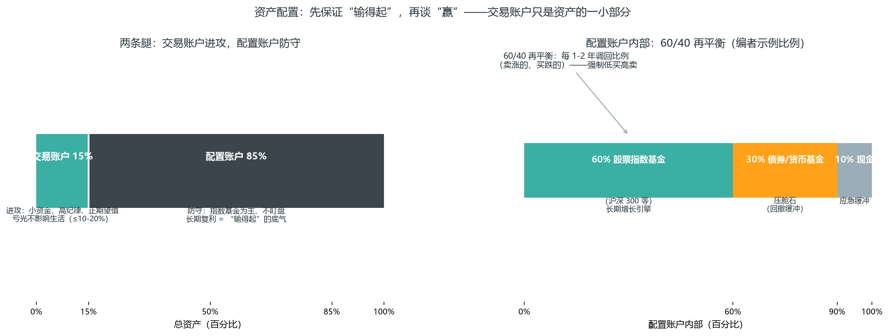

*图 1-13 资产配置两条腿：交易账户（≤10-20%）进攻 + 配置账户防守；配置账户内部 60/40 再平衡（编者示例比例）*

（左）总资产的两条腿：交易账户只占 15%（≤10-20%）——它的职责是验证能力、积累经验，亏光了不影响生活；配置账户占 85%——它负责长期复利，是“输得起”的底气。（右）配置账户内部示例：60% 股票指数基金（增长引擎）+ 30% 债券/货币基金（压舱石）+ 10% 现金（应急）；每 1-2 年做一次再平衡（卖涨的、买跌的），把比例调回 60/40——再平衡本身就是一个“强制低买高卖”的纪律。

**基金家族速查**：

| 类别 | 是什么 | 适合谁 |
| --- | --- | --- |
| 公募基金 | 公开募集，1 元起投，监管严格 | 所有人 |
| 私募基金 | 合格投资者（100 万起），运作灵活 | 高净值+能承受不透明 |
| 主动基金 | 基金经理选股，收高管理费（1.5% 左右） | 相信经理的 alpha |
| 被动基金（指数基金） | 跟踪指数，费率低（0.15%-0.5%） | 大多数人 |
| ETF | 场内交易（像股票一样买卖），费率最低、跟踪误差小 | 会开证券账户的人 |
| LOF | 场内场外都能买 | 需要灵活性时 |

**主动 vs 被动：数据站在被动一边**。长期统计（中美都是）多数主动基金跑不赢对应指数——不是经理笨，是 1.5% 的管理费 + 交易成本每年都在侵蚀复利，而指数是“零成本基准”。你不需要相信任何经理的“业绩承诺”，只需要接受一个数学事实：**20 年维度，1.5% 年费的复利杀伤 ≈ 35% 的本金差异**。被动指数基金（如沪深 300 ETF）是配置账户的默认选择。

**选基金的四个指标**（主动、被动通用）：

1. **规模**：别太小（<2 亿有清盘风险），也别迷信最大。
2. **费率**：同类型里挑最低的——这是唯一确定的差异。
3. **跟踪误差**（指数基金）：越小越好，说明“复制指数”做得好。
4. **经理任期**（主动基金）：穿越过牛熊、任期 5 年以上才值得看。

**定投：纪律优于择时**。定投的本质不是“预测低点”，而是用固定节奏买入把成本摊平——它解决的是“什么时候买”的焦虑，代价是放弃“抄底”的幻想。定投适合波动大的指数（沪深 300/标普 500），不适合债券（波动太小，摊平无意义）。记住：定投是行为约束，不是收益承诺——它保证你“一直在场”，不保证“买在底部”（呼应第 8 章：不预测，只执行）。

**资产配置入门：三句话**

1. **风险资产 vs 无风险资产**：股票/商品是风险资产（波动大、长期回报高），债券/存款/货基是无风险或低风险资产（波动小、回报低）。配置 = 按比例同时持有两者，比例决定你的波动承受力。
2. **分散化**：“鸡蛋分篮子”在资产层面依然靠相关性（呼应 1.14）——沪深 300 + 标普 500 + 债券，三者相关性低，组合波动小于任一单资产。
3. **再平衡**：每年一次，把比例机械调回目标（如股 60/债 40 变 70/30 时卖出股票补债券）。它不预测、不择时，是“高抛低吸”的纪律版本——和本书第 6 章“仓位按公式”是同一个哲学：**把决策从情绪手里拿走**。

**边界：多少钱拿去交易**。一个常用参考：交易账户 ≤ 总资产的 10-20%，且必须是闲钱（亏光不影响生活）。为什么？

- 100 万资产：20 万交易账户，单笔风险 0.5% = 1000 元——任何连亏都在可承受范围（第 6.3 连亏是必然）。
- 80 万配置账户按 60/40 再平衡，年化 6-8% 的长期收益远高于大多数交易者第一年的实盘结果。
- **交易的第一年，你的最大成本不是亏钱，是时间**——配置账户就是这段时间里“工资之外”的复利来源。

**这一节的定位**：本书其余部分教你“怎么把交易账户做精”，这一节教你“怎么让大部分身家稳着增值”。两条腿走路，第 7 章的概率思维才有着落——**交易是为了活得更好，不是为了把生活押上桌**（呼应前言立场 2：活得久比赚得快重要）。

### 本章自测（答案在本节末尾）

1. 为什么说“外汇没有统一的真实成交量”？这决定了什么？
2. 杠杆的真相是什么？
3. A 股和本书日内体系最大的冲突点是什么？怎么调整？
4. 你买入成交在哪个价（Ask/Bid）？为什么点差是“固定成本”？限价单和止损单哪个会滑点？

**答案**：① 外汇是 OTC 场外市场、没有中心交易所（1.2）——依赖量价的方法（Wyckoff/订单流）在期货上更正统，外汇上只能参考；② 杠杆不改变胜率，放大的是仓位误差（1.5）——同样的判断错误，低杠杆是小伤、高杠杆直接爆仓；③ T+1（1.16）——当天买的仓位当天不能卖，止损最早次日生效，所以信号周期要放大到日线以上、仓位按两天的波动来算；④ 买入成交在 Ask、卖出成交在 Bid（图 1-7）——一进一出天然亏一个点差，高频进出（剥头皮）对点差最敏感（1.6）；止损单会滑点（跳空时以更差价格成交），限价单永不滑点（1.3）。

### 本章小结：速查卡

**① 市场结构——谁在对面**

- 价格是参与者行为的结果：散户行为可预测，机构需要对手盘，做市商赚点差。
- 均衡价位是常态、突破是例外（<20% 时间）；机构无法操纵市场——你不需要打败机构，只需要站对位置。

**② 品种选择——先选战场**

- 品种决定方法：外汇无真实量，期货量价可靠——量价方法在期货上更正统。
- 品种脾气：期货是 prop 主战场（ES/NQ 最佳）；股票有 PDT/做空限制；外汇量不真实；加密高波动新手别碰。

**③ 订单与成本**

- 限价单不滑点，挂单要设时效；prop 平台禁止对冲/马丁。
- 点差是固定成本，滑点市价单才有，插针别全当成机构行为。

**④ 杠杆、时段与数据**

- 杠杆放大的是仓位误差，不是胜率——考核期用低杠杆。
- 伦敦-纽约重叠是黄金时段，亚盘信号质量低。
- 数据事件是技术面的黑天鹅——交易前看日历，数据前不开仓。

**⑤ 相关性**

- 相关性 = 风险叠加，高相关品种只选一个；新手单品种深耕。

**⑥ A 股与资产配置**

- A 股是“波段+配置”战场：T+1 推迟止损、涨跌停是流动性断层、成本结构惩罚高频。
- 基金与资产配置是交易的前提：交易账户 ≤ 总资产 10-20%，其余交给指数基金 + 再平衡——先保证输得起，再谈赢。

下一章进入技术分析本身：怎么从 K 线里读出多空力量。本章的每个机制——流动性、点差、时段——都会在那里再次出现，作为信号成立的底层条件。
