# 第 2 章 读懂价格行为

> **阅读提示**：本章是全书的语言课——K 线、信号棒、趋势、支撑阻力、交易区间，之后每一章的策略都是用本章的词汇写成的。建议配合图 2-1~2-14 逐图读，读到能指着一根 K 线说出“谁在赢”为止；读图时想不起某个概念，随时回本章查。

打开任何一张 K 线图，你看到的是一排红红绿绿的柱子。大多数人看到的是“涨了”“跌了”。但交易员看到的是另一样东西——一场正在进行的、多空双方的拔河。每一根 K 线，就是这场拔河里的一个回合；整张图，就是无数个回合连起来的战况。

这一章教你读懂这场拔河。不靠任何指标，只靠 K 线本身。学完之后，你看图的眼光会不一样：你不再看到“涨跌”，你开始看到谁在赢、赢得多艰难、以及哪里埋着别人的止损。

一个贯穿全章的观点先放在这里：**K 线记录的不是价格，是人**。每一次冲高回落，背后都是有人在追、有人在跑、有人被套、有人解套。读懂 K 线，本质是读懂这些人的处境。

### 2.1 一根 K 线，就是拔河的一个回合 【核心】

一根 K 线由四个价格构成：开盘、收盘、最高、最低。但别把它当四个数字，把它当一个回合的战报。

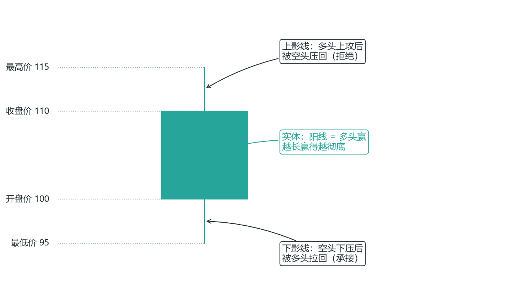

*图 2-1 一根 K 线的结构：实体与影线*

**实体**（开盘到收盘那段）：这个回合谁赢了，赢了多少。阳线=多头赢，阴线=空头赢；实体越长，赢得越彻底。

**影线**：这个回合输的一方曾经反抗到哪，又被打了回来。长上影=多头曾冲上去、被空头砸回来；长下影=空头曾砸下去、被多头拉回来。

**这是本章第一个、也是最重要的洞察**：

> 实体告诉你谁赢了，影线告诉你赢得有多艰难。

一根大阳线、几乎没有影线——多头赢得毫无悬念，这是力量。一根阳线、但拖着长长的上影线——多头虽然收在高处，但上方被狠狠打压过，这是隐患。同样是“涨”，含义完全不同。新手只看涨跌，老手看实体和影线的比例。

**还有一个容易忽略的细节**：收盘在哪一端，比涨跌本身更重要。一根 K 线收在最高点附近，说明多头把优势守到了最后一秒；收在最低点附近，说明空头全程压制。收盘价是多空“最后的表态”——它反映的是这一回合结束时，谁还站着。

把这张“战报”的读法练熟，它是后面所有形态分析的基础：锤子线（长下影）、吞没（实体关系）、内包线（范围关系）——全都建立在“实体和影线各代表什么”之上。

**信号棒、入场棒、确认棒：一次入场的三段式**（Al Brooks 体系的微观字典）：

- **信号棒（Signal Bar）**：产生交易信号的 K 线。好信号棒 = 收盘接近极点（做多收盘近高点、做空收盘近低点）+ 实体较大 + 不超过平均长度的 1.5 倍。差信号棒 = 十字星（收盘在中间）+ 上下长尾（多空犹豫不决）+ 极长实体（已过度延伸）。**信号棒本身不触发交易**——它的作用只是“发出邀请”。
- **入场棒（Entry Bar）**：实际触发入场的 K 线，必须突破信号棒的极点（做多突破信号棒高点、做空跌破信号棒低点）。强入场棒 = 大实体 + 收盘接近极点（信号被强势确认）；弱入场棒 = 小实体 + 十字星（信号被弱确认，风险增加）。
- **确认棒（Confirmation Bar）**：入场后第一根继续创新高/新低的 K 线。它是验证交易正确性的第一步：强确认棒 = 大实体继续推进；弱确认棒 = 小实体未创新高/新低，预示交易可能失败。

一次入场 = 信号棒发出邀请 → 入场棒突破触发 → 确认棒验证方向。三步缺一不可，这是后面第 3 章所有入场信号的最小骨架。

**趋势棒与反转棒**：实体大于近期平均 1.5 倍、收盘距极点不足实体 20%、几乎无影线的 K 线叫**趋势棒**（Trend Bar）——参与者一边倒，是动量的基本单位，连续 2-3 根趋势棒构成更强的趋势信号，连续 4 根以上可能形成微型通道。与当前趋势方向相反、实体同样大的叫**反转棒**（Reversal Bar）——它出现在趋势末端或关键位（支撑/阻力、趋势线、前高/低）时最可靠，出现在趋势中段时可能只是普通回调。

**组合形态字典**（常见 K 线组合，全部要放在位置里读）：

- **内包棒（IB）**：高点≤前棒高点且低点≥前棒低点，波动率收缩。单根内包棒是中性信号，**从不单独作为入场依据**；连续两根（ii）或三根（iii）意味着极度收缩——“波动率收缩后必然扩张”，突破方向由背景决定：趋势中 ii/iii 通常顺趋势突破，区间中方向不确定。
- **外包棒（OB）**：高点≥前棒高点且低点≤前棒低点，市场扩张。注意：外包棒本身只是“扩张”信号，**不是突破信号**——在铁丝网/区间中部，它只是更大的凝滞区；在强趋势或二次入场后，它可能成为高质量入场棒。
- **ioi 模式**：内包→外包→内包的三棒组合（inside-outside-inside），是经典的突破模式：第一根犹豫（收缩）→ 第二根选择方向（扩张）→ 第三根再次蓄力。交易上等第三根内包棒之后的突破触发，方向由背景决定，不能单独凭 ioi 定方向。
- **双棒反转（2BR）**：两根相邻的反向强趋势棒，第二根实体≥第一根的 50%（吞没型更强）。**2BR 的胜率只有 50-55%**，不是高概率信号，必须放在关键位置读；强趋势中第一次 2BR 经常失败。
- **微双底/微双顶（MDB/MDT）**：两根连续 K 线低点（或高点）相同或相差不到 2 个跳动——卖方（买方）在该价位两次尝试突破失败。第二根收阳（MDB）/收阴（MDT）且收盘远离极点时更可靠；多个 MDB/MDT 可以构成更大的双底/双顶。

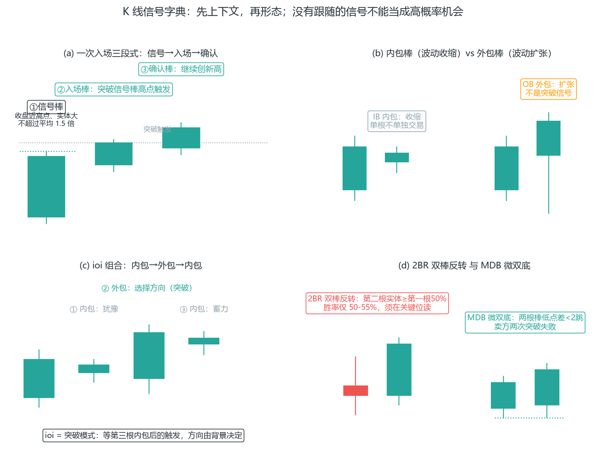

*图 2-2 K 线信号字典：信号棒→入场棒→确认棒，及内包/外包/ioi/2BR 组合*

字典的用法口诀：**先上下文，再形态；没有跟随的信号，不能当成高概率机会**。孤立信号、信号棒过长（超均值 2 倍）、十字星信号、假外包——是四个最常见的误读陷阱。

### 2.2 同样一根 K 线，位置不同，天差地别 【核心】

现在给你第二个洞察，它比第一个更值钱：

> 一根 K 线的意义，不由它自己决定，由它出现的位置决定。

想象一根长下影的锤子线。它出现在哪里？

- 出现在一段下跌之后、一个支撑位上：空头砸下去，被强力接住——这是“下方有人坚决在买”的信号，是黄金。
- 出现在一段上涨的中途、前不着村后不着店：只是正常波动里的一次抖动，是噪音。

同一根 K 线，一个位置是机会，另一个位置是陷阱。这就是为什么本书反复强调一句话：**信号必须放在位置里读**。后面第 3 章的所有入场信号，都建立在这条之上——先看位置，再看形态。形态只是“最后一道确认”，位置才是“这一单值不值得做”。

**实操含义**：每次看到一根“漂亮的 K 线”，别急着兴奋，先问三个问题——它在哪？背景是什么？这里有没有聚集着人的成本和止损？回答完这三个问题，这根 K 线的价值才浮出来。第 3 章的判定框架（背景 × 位置 × 形态）就是这三个问题的公式化。

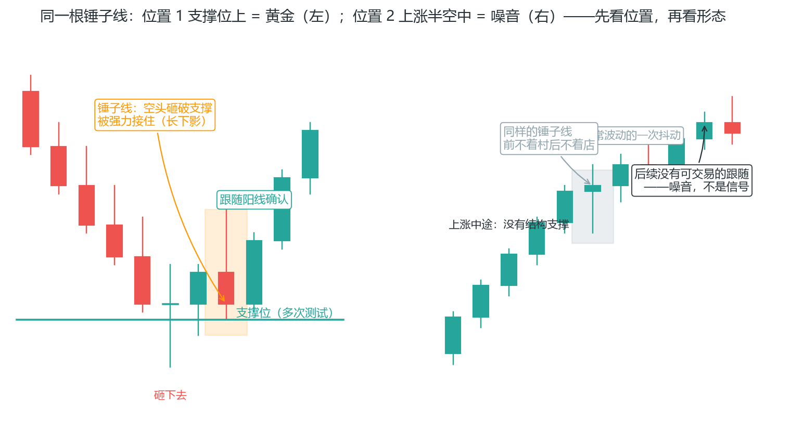

*图 2-3 同一根 K 线：位置决定价值——支撑位上是机会，半空中是陷阱；先看位置，再看形态*

左图是“位置 1”的完整剧本：价格一路下跌（五根阴线）来到一个被多次测试的支撑位（青色水平线），空头最后一次砸下去（长下影砸到 92.5，橙色高亮框）却被强力接住——支撑位附近聚集着多头的成本和空头的止损，空头在这里“砸不动”本身就是信息；随后跟随阳线确认（8 号 K 线）——这是“下方有人坚决在买”的信号，黄金。右图是“位置 2”：同一根长下影 K 线出现在上涨中途，前后没有任何结构支撑——它只是正常波动里的一次抖动，后续也没有可交易的跟随，噪音。**两张图 K 线形态几乎一样，价值一个天上一个地下**——这就是本书反复强调的“信号必须放在位置里读”：先看位置，再看形态。第 3 章的所有入场信号都建立在这条之上。

### 2.3 趋势：钱走出来的方向 【核心】

那么“位置”怎么判断？先要判断市场现在处于什么状态。市场只有三种状态：上升趋势、下降趋势、区间震荡。而判断趋势，靠的是高低点的排列。

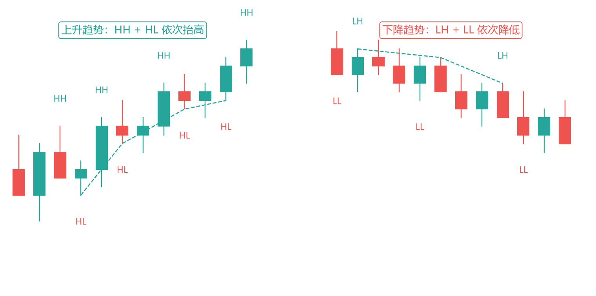

*图 2-4 趋势：HH/HL 与 LH/LL 的高低点排列*

- **上升趋势**：高点一个比一个高（HH，Higher High），低点也一个比一个高（HL，Higher Low）。一浪高过一浪。
- **下降趋势**：高点一个比一个低（LH，Lower High），低点也一个比一个低（LL，Lower Low）。一浪低过一浪。
- **区间**：高低点大致水平，价格在两条线之间来回。

**这里有个关键的认知，能帮你避开一大类错误**：

> 趋势不是你“画”出来的，是钱用真金白银“走”出来的。

很多人判断趋势靠画一条趋势线、然后主观认定“它在涨”。但真正的判据是客观的：**最近的那个低点，有没有被跌破？** 上升趋势的定义就是“低点不断抬高”，所以一旦最近一个重要低点被跌破，上升趋势在定义上就被破坏了——这不需要任何主观判断，不需要“感觉”，是纯客观的事实。

这条“跌破结构点=趋势转弱”的逻辑，是后面第 5 章 BOS/CHoCH 的雏形，也是你判断“该不该继续拿多单”的硬标准。记住它：**别跟结构争辩，结构破了就是破了**。

**实战时，每次打开图先问自己三个问题**：

1. 现在是趋势还是区间？
2. 如果是趋势，最近的那个低点（或高点）在哪？那是我的“结构生命线”。
3. 高低点清晰吗？如果参差混乱，说明市场没方向——看不清，就不做。

第三个问题最容易被忽略：不是每张图都有清晰的高低点。混乱的结构本身就是信息——它告诉你现在不是你的战场。学会说“看不清，不做”，是新手最重要的进阶之一。

**市场所有权：趋势强弱的量化识别（Ali）**：趋势不只靠高低点排列，还要看“谁拥有市场”：

- **连续 K 线 > 单根大 K 线**：一方拥有许多连续 K 线（尤其是趋势走势）是重要强势信号；单根强势 K 线通常不够，需要后续 K 线配合。
- **所有权的最强形态**：一系列连续趋势 K 线在趋势极值处收盘、且实体逐渐增大——这是“突破波动”（尖峰，Spike），市场所有权最有力的宣告（呼应 2.11 尖峰）。
- **趋势一致性 = 低波动性强市场**：一致性不只关乎趋势强度，更关乎均匀的动量——理想的顺势环境是“低波动性、强 BL/BR 单边”。注意：**趋势持续的时间越长，趋势往往越弱**（越接近尾声）。
- **限价单买不到 = 强势信号（让感觉指引你）**：每当你焦急地等待回调买入、而空头（BRs）无法通过限价单获利时——两个都是强劲多头趋势的信号，立即以市价买入。BR 无法靠限价单拿到货，说明价格必须上涨才能找到更多卖家；等回调的那份焦虑，恰恰是市场强势的证明。最坏情况：买入后立即抛售，持有——1LD 是交易区间的一部分，低位加仓、回测反弹时保本或盈利退出。

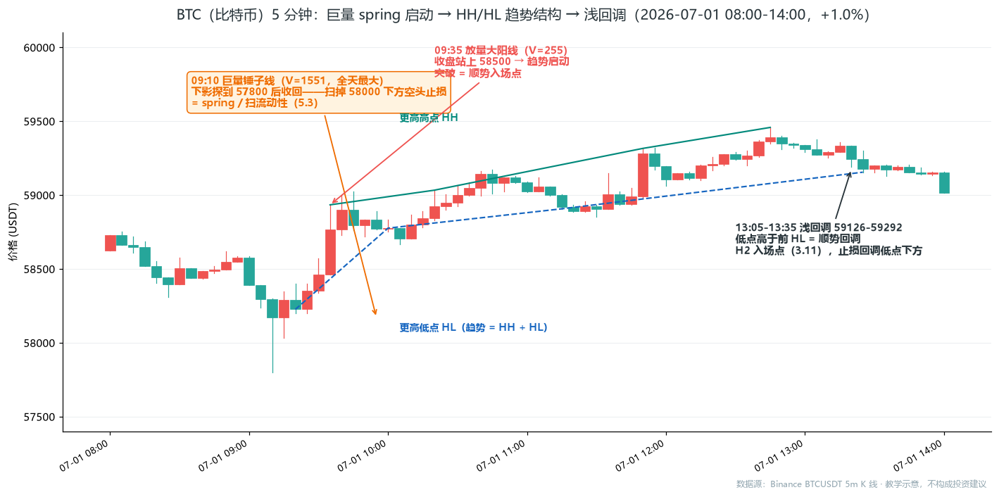

*图 2-1R 真实数据：spring 启动 → HH/HL 结构 → 浅回调（数据源：Binance BTCUSDT 5m K 线）*

对照图 2-4 的概念逐项看：① **spring 启动**：09:10 一根 K 线放出全天最大量（V=1551）并砸出约 370 点长下影（从开盘 58294 直落至最低 57800，收回后收在 58170），扫掉 58000 下方的空头止损后收回——这不是普通回调，是趋势启动前的洗盘（第 5 章的 sweep 同款逻辑）；② **HH/HL 结构**：09:35 放量突破 58500 后，四个更高高点（58933→59032→59315→59457）与四个更高低点（58225→58775→58906→59154）清晰排列——趋势 = HH + HL，不是单看 K 线方向；③ **浅回调**：13:05-13:35 回调到 59126-59292，低点高于前一个 HL——顺势回调（H2）就是入场点，止损放回调低点下方。整张图就是“定义→识别→入场”的完整演示。

### 2.4 支撑与阻力：一群人被困住的位置 【核心】

接下来是“位置”的核心——支撑和阻力。先给你一个能改变你看图方式的洞察：

> 支撑不是一条线，是一群人被套住的位置。

为什么价格在某个位置会被“接住”？不是因为那里有什么神奇的线，而是因为那里有一群人的成本和止损。

想清楚这个机制：假设价格在 100 这个位置反复被买起来。这意味着很多人在 100 附近买了。现在分两种人：

- 在 100 买了、现在赚钱的人：他们中的一些会在价格回到 100 时“再加一点”或“没买够的补买”。
- 在 100 上方买了、被套的人：他们天天盼着价格回到 100 好“解套离场”——一旦回到 100，他们会买回（或者至少不再卖）。

这两股力量加起来，就让 100 这个位置有了“承接力”。**支撑的本质，是这里聚集了一群等着行动的人**。阻力同理（一群等着卖的人）。

理解了这一点，你就明白了几条经验法则背后的“为什么”：

- **一个位置被测试的次数越多，越重要**——因为每次测试，都有更多人在这里留下成本和止损，人越聚越多。
- **支撑/阻力是一个“区域”，不是一条精确的线**——因为人的成本和止损是散布在一个区间里的，不会精确到同一个价。画支撑阻力时画“区带”而不是“一条线”。
- **角色互换**：阻力被突破后，原来“等着卖”的人变成了“踏空想追”的人，加上突破者的止损设在这下方，这个位置就从“压制”变成了“支撑”。

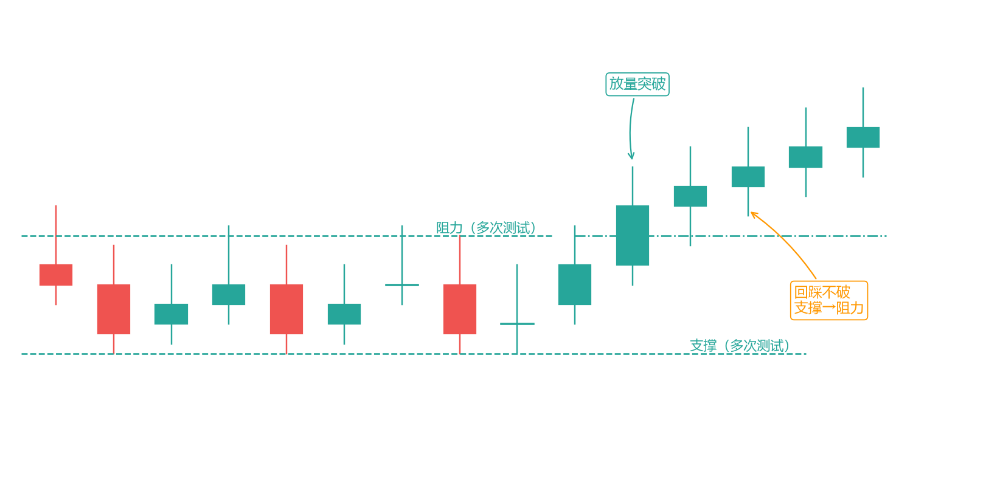

*图 2-5 支撑与阻力：多次测试与角色互换*

看图里的过程：价格多次在下方被接住（支撑），多次在上方被压回（阻力）；然后阻力被放量突破，价格回踩那个位置不破——曾经的天花板，变成了地板。这就是角色互换，是最可靠的转换规律之一。

**还有一个和后面第 5 章直接相关的伏笔**：突破者的止损，就挂在突破点下方不远处。这意味着每个关键位的下方，都聚集着一堆止损——这正是 SMC 说的“流动性池”。你现在记住“关键位下方埋着止损”这件事，第 5 章会反复用到。

**未成交的限价单是力量标志（Ali）**：价格**没有到达**某个预期限价单水平，这件事本身就是信号——说明该水平之前已有抢先入场的竞争，市场不愿意把价格送到那里。

**例**：空头想在某高位卖出却一直等不到成交，意味着上方没有足够的卖家，价格必须继续上涨——这是强势的证据。

**隐形阻力（无人买入）的完整机制**：

1. **形成**：多头在反转 K 线上方分批建仓，使他们的盈亏平衡点落在两个入场点之间（大约在回调的 50% 处）；
2. **对手行动**：空头知道这一点，提前在该价格挂限价卖单——“没有买家了”；
3. **结果**：该水平形成短暂的隐形阻力，是高概率的短线做空点；
4. **操作**：等价格涨到那里触发，别提前卖。

**同一枚硬币的两面**：与 2.3 的“限价单买不到”合起来——**成交不了的订单，暴露了力量的分布**。

### 2.5 成交量：这场拔河的燃料 【核心】

K 线告诉你价格去了哪，成交量告诉你这次移动有多少真金白银参与。**价格是因，量是验证**。没有量确认的价格移动，就像没有观众的比赛——赢了也可能是自嗨。

**四条最实用的量价规则**：

1. **放量上涨 = 健康的趋势**：涨有人真金白银地推，不是虚拉。
2. **缩量回调 = 正常的洗盘**：回调时没什么人真在卖，说明持仓者没跑，趋势大概率延续。
3. **放量却不创新高/新低 = 危险**：使了很大的劲（放量），却没打出新成果（没新高）——一方的力量在耗尽。这是趋势可能要变天的早期信号。
4. **缩量创新高 = 虚弱**：价格新高了，但没什么人跟，像是“强弩之末”。

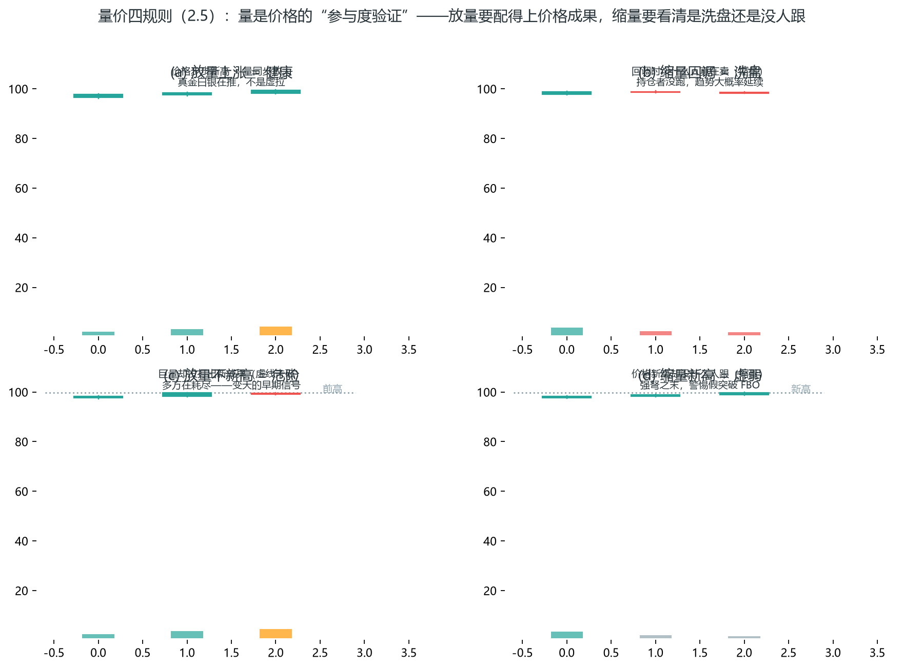

*图 2-6 量价四规则：放量上涨健康、缩量回调洗盘、放量不新高危险、缩量新高虚弱（合成示意）*

四格对照着读：① 放量上涨——每一步新高都有真实成交支撑，健康；② 缩量回调——下跌时没人真卖，是洗盘不是出货，趋势大概率延续；③ 放量不新高——使了大力气（巨量）却没破前高，多方耗尽，是趋势变天的早期信号；④ 缩量新高——突破了但没人跟，强弩之末，假突破（FBO）概率上升。**量柱颜色只是方向提示，真正要读的是“价格成果与量的匹配度”**。

**一个必须记住的限定**（第 1 章讲过，这里再强调，因为它直接影响你怎么用量价）：外汇没有统一的真实成交量（场外市场），你看到的是 tick 量近似，只能当参考；期货和股票的量是真实的，量价方法在它们身上最可靠。所以如果你重度依赖量价，优先做期货。

**量价方法的正确用法**：量不是独立的入场信号，它是“确认器”——给已经成立的技术信号加一个可信度评分。放量突破 = 真突破概率上升；缩量突破 = 假突破概率上升。第 3 章的量价三问就是把这个评分流程化。

### 2.6 实战演练：把一根锤子线，读成一次完整的入场 【核心】

前面讲的都是“零件”。现在把它们组装起来，走一遍真实的读图过程——这是本章的“代入感”环节，请跟着一步步想。

**场景**：你在看 ES（标普 500）的 4 小时图。过去几天价格一路走高，高低点依次抬高——你判断这是上升趋势（2.3）。最近价格从高点回落，正在向一个位置靠近：那个位置是上一波上涨的起点、一个前低，也就是一个支撑位（2.4）。

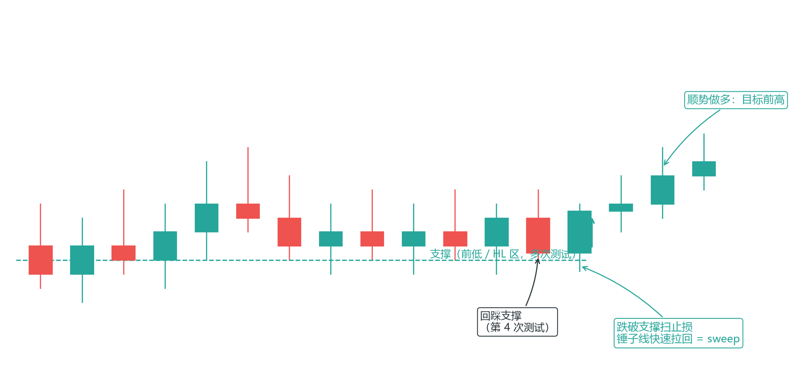

*图 2-7 实战演练：锤子线跌破支撑后快速拉回（sweep 雏形）*

现在，价格碰到了支撑位。你盯着接下来的那根 K 线，它走出来这样：

1. 开盘后，价格继续往下砸，一度跌破了支撑位——你心里一紧，难道支撑要破？
2. 但紧接着，价格被快速拉回，像踩到弹簧一样弹起来。
3. 这根 K 线收盘时，收在了高位，留下一根长长的下影线——这就是锤子线。

现在用本章学的东西解读这根锤子线：

- **看位置（2.2）**：它出现在支撑位上，不是半空中。✓ 位置对。
- **看影线（2.1）**：长下影=空头曾砸下去（甚至砸破了支撑），但被坚决地拉了回来。下方有人在坚决地买。
- **看背景（2.3）**：大方向是上升趋势，你这是顺势做多，不是逆势抄底。✓
- **看那个“跌破又拉回”（2.4 的伏笔）**：价格跌破支撑时，扫掉了支撑下方的一批止损，然后拉回——这正是后面第 5 章说的"sweep"。

四个维度全部指向同一件事：这是一个顺势的、在关键位、有确认的做多机会。

于是你做出决策（具体怎么算止损和仓位，第 4、6 章细讲，这里先建立感觉）：

- **入场**：锤子线确认后做多。
- **止损**：放在锤子线那根长下影的最低点下方——因为如果价格再跌破那里，说明“下方有人坚决在买”这个判断错了，你就该认错离场。
- **目标**：看向前方的高点（前高），那是下一个“位置”。

看到了吗？一次入场，不是“我看到一根锤子线所以买”，而是“背景是趋势 + 位置是支撑 + 形态是锤子 + 止损有明确依据”四个条件同时成立。这就是第 3 章那个公式“信号质量=背景×位置×形态”的完整样子。本章教你的所有零件，在这一刻组装成了一次真实的决策。

### 2.7 趋势线、通道与缺口 【核心】

补充三个常用工具，它们是上面核心概念的延伸：

**趋势线与通道**：连接两个以上的低点画出上升趋势线（下降趋势连高点）。趋势线本质是 HL 序列的另一种画法——趋势线跌破，往往意味着最近的 HL 也快破了，是结构转弱的早期预警。在趋势线对面画平行线就是通道，通道上沿是趋势里的止盈参考。

注意趋势线的坑：趋势线是你“主观选择”连接哪几个点画出来的，同样的图能画出三条不同的趋势线。所以把趋势线当“参考”可以，当“判据”要小心——第 2.3 的“最近低点是否被跌破”才是客观判据。**趋势线给你提前预警，结构点给你最终裁决**。

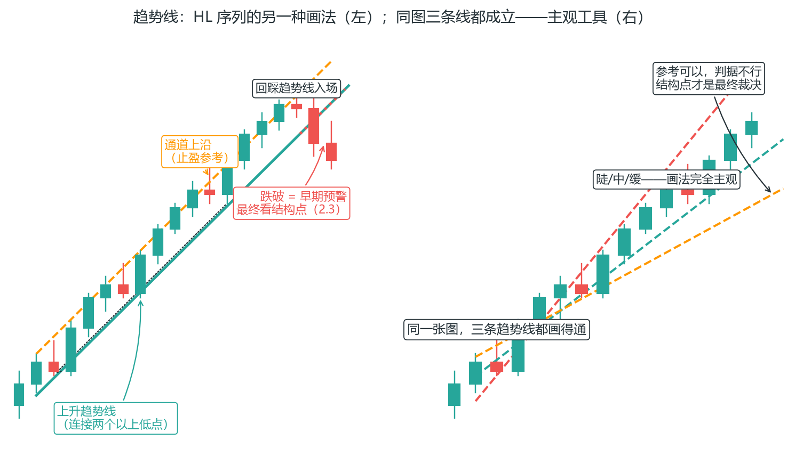

*图 2-8 趋势线与通道：趋势线是 HL 序列的另一种画法，但画法主观——结构点才是最终裁决*

左图是上升趋势线的完整用法：① **画法**——连接两个以上低点（图上三个 HL 低点连成一条线），趋势线本质就是 HL 序列的另一种画法；② **回踩入场**——价格回踩趋势线不破（图上 16 号 K 线）是顺势入场点；③ **通道**——在趋势线对面画平行线得到通道上沿，它是趋势里的止盈参考（不是强制出场位）；④ **跌破预警**——最后价格跌破趋势线，这是结构转弱的早期预警，但注意：**跌破趋势线 ≠ 立即做空**，要等结构点（最近低点跌破）确认。右图是“主观性”的直观演示：同一张价格图，陡/中/缓三条趋势线都画得通、都有人用——所以趋势线当参考可以，当判据要小心，第 2.3 的结构点才给最终裁决。

**缺口（Gap）**：相邻两根 K 线之间没有成交的空白（股票常见，因为隔夜休市；外汇只有周一开盘有）。四种：

- **普通缺口**：区间内出现，大概率回补。
- **突破缺口**：放量突破时出现，短期不回补，是强信号。
- **持续缺口**：趋势中段出现，表示行情还在加速。
- **衰竭缺口**：趋势末端出现，放量但无后续，警惕反转。

经验法则：突破缺口不回补，普通缺口必回补。考核期注意周一开盘缺口直接跳过你的止损（第 1.7 周末持仓问题）——这既是风险，也是机会：如果你知道缺口会回补，周一的跳空往往提供短期的回补交易，但别在考核期冒险（第 7 章军规）。

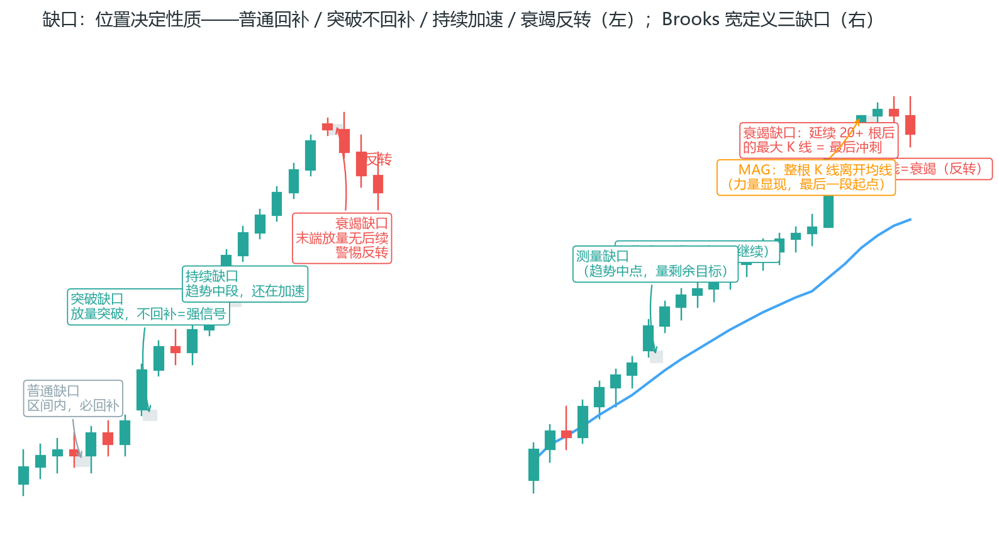

*图 2-9 缺口四类与 Brooks 三类：早期大 K 线 = 测量缺口（继续），晚期大 K 线 = 衰竭缺口（反转）——位置决定性质*

左图是四类缺口的完整剧本：横盘区间里的小跳空是**普通缺口**（大概率回补，无交易价值）；放量突破区间上沿的跳空是**突破缺口**（短期不回补，强信号）；趋势中段再跳空是**持续缺口**（行情还在加速，别下车）；趋势末端放量跳空却收出滞涨小 K 线是**衰竭缺口**（无人接盘，警惕反转）。判断口诀只有一句：**位置决定性质**——同一个“跳空”动作，出现在区间是噪音、出现在起点是信号、出现在中段是加速、出现在末段是离场提醒。右图是 Brooks 的宽定义：**收盘价与前一根高点之间的任何空隙都是缺口**——趋势中点的缺口量目标（测量缺口，配合 2.8 量度移动）、20+ 根后的最大 K 线大概率是衰竭缺口（最后冲刺）、整根 K 线离开均线是 MAG（对方力量显现的早期迹象）。

**Brooks 的缺口观（补充）**：Brooks 对缺口的定义更宽——**收盘价与前一根 K 线高点之间的任何空间都是缺口**（不需要跳空开盘，一个 tick 的空隙也算）。在这个定义下，他补充了三类在趋势中有预测力的缺口：

- **测量缺口（Measured Gap）**：趋势中段的缺口，常位于整段移动的中点——从它的位置可以量出剩余目标（配合 2.8 的量度移动）。
- **衰竭缺口（Exhaustion Gap）**：趋势延续 20+ 根 K 线之后出现的那根最大 K 线，大概率是衰竭缺口而非测量缺口——趋势末段的“最后冲刺”（呼应 2.8 的高潮）。
- **均线缺口棒（MAG）**：整根 K 线与均线之间出现空隙（K 线完全在均线上方/下方）——这是对方力量显现的早期迹象，往往是趋势最后一段的起点。

判断法则：**趋势早期的大 K 线 = 测量缺口（继续），趋势晚期的大 K 线 = 衰竭缺口（警惕反转）**。位置决定性质——又回到了 2.2 节的母题。

### 2.8 Al Brooks 把结构读“活” 【核心】

Al Brooks（前医生转职交易员，价格行为领域最系统的作者，附录有他的定位）把“读结构”推进到了极致。这里提炼四个最实用、且和本书无缝衔接的概念：

**Always-in 方向**：问自己一个问题——“如果现在强迫我必须持仓（不能空仓），我该持多还是持空？”答案就是 always-in 方向。它比“趋势还是区间”更细，问的是“当下力量偏向哪边”。只做和 always-in 方向一致的单——这其实是 2.2 节“背景”的精确化，给你一个逐 K 线更新的方向判断。

**两段式移动**：大多数趋势性移动不是一步到位，而是分两段——涨一段、回调、再涨一段。用法：第一段走完、第二段回调时是顺势入场点（呼应第 4 章趋势回调系统）；合理目标常是“第二段=第一段长度”；两段走完后趋势容易转区间或反转，别追。

真实数据看一眼（24 小时市场里这个结构每天都在发生）：

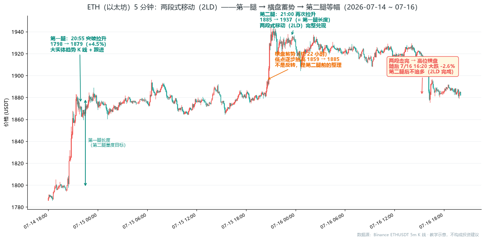

*图 2-2R 真实数据：两段式移动（数据源：Binance ETHUSDT 5m K 线）*

图里四步可复刻：① **第一腿**：7/14 20:30-21:20 大阳线连续拉升，从 1798 平台拉到 1879（+4.5%）——突破前期 1795-1800 的横盘平台，大实体趋势 K 线 + 跟进，顺势者入场；② **横盘蓄势**：随后约 22 小时（7/14 21:30 ~ 7/15 20:00）价格原地整理，低点逐步抬高 1859 → 1885——**不是反转，是第二腿前的蓄势**（时间换空间的回调），持仓者的止损可以上移到平台低点下方；③ **第二腿**：7/15 21:00 再次拉升，1885 → 1937（+2.8%，盘中最高摸到 1946）——两段式移动（2LD）完整兑现，量度移动（第一腿长度投射）给出大致目标区；④ **两腿走完后**：7/16 16:10 一根大阴线跌破 1900，跌至 1875（较 1937 高点 -3.2%）——**第二腿后不追多**。记住：**两段式移动的钱在第二腿的起点（蓄势/回调后的突破）里，不在第一腿的追高里**。

**量度移动**：把一段已发生的移动投射出去当目标（“第二段=第一段”或“区间高度投射”）。它给你一个基于结构的目标价，而不是拍脑袋，配合第 4 章的出场是很好的止盈锚点。

**高潮/衰竭**：趋势末端突然出现一根异常大、异常急的 K 线（常伴放量），像最后的冲刺——这通常是衰竭信号，追的人在这一刻冲进来，恰恰是聪明钱在出货。趋势中出现高潮 K 线，别追，该警惕反转。

这呼应 2.5 的“放量滞涨”和 2.7 的“衰竭缺口”——都是“力量用尽”的不同表现。

**Brooks 的柱计数（Bar Counting）**：用“回调是第几次”给入场点命名——顺势入场的“刻度”：

- **高 1（High 1）**：趋势中第一次回调后的买入点；做空对应**低 1（Low 1）**；
- **高 2（High 2）**：第二次回调后的买入点；做空对应**低 2**；
- **高 3（High 3）**：第三次回调（楔形、三推），往往是趋势末段的反转点（第 3 章详讲）。

**用法**：高 2 比高 1 更常见也更可靠——第一次回调后趋势常直接继续，第二次回调后进场更从容；楔形 = 高 3，常是反转信号。

**Brooks 的原话提醒**：**永远不要忽视目标——计数不清楚没关系，看到良好信号棒直接在其上方买入**。计数是辅助，信号棒质量才是入场依据。

**TBTL：一切移动的最低目标**：任何反转、突破、大波动、高潮，最低目标都是 **TBTL——10 根棒 + 两条腿（Ten Bars Two Legs）**。这是 Brooks 给“目标该看多远”的底线答案：入场后至少期待 10 根 K 线的移动、且分两条腿走完；可以更多，但少于这个就不算合格的行情。配合量度移动（第一腿长度投射），TBTL 让你不会过早止盈，也不会定一个离谱的目标。

**反转的现实概率（提前预警）**：Brooks 的统计：

- **只有 40% 的反转走得足够远**、可以波段交易；
- **只有 20% 的反转变大**、形成相反趋势；
- 也就是说，**60% 的“反转”最终是交易区间或原趋势继续**。

这不是说反转信号没用，而是提醒你：反转交易是低概率博弈，必须靠盈亏比取胜（第 6 章交易者等式）。并且**所有主要趋势反转（MTR）都是双顶/双底或它们的变体**——头肩顶 = HH MTR + LH MTR，楔形 = 双顶变体。看到“反转形态”，先想“这是哪个双顶/双底的变体”，能帮你避开大多数伪反转。

**Brooks 没有推翻本章框架，他把它磨得更细**：always-in=背景判断的精确化、两段式=入场时机、量度移动=出场目标、高潮=反转预警、柱计数=入场命名、TBTL=最低目标、反转概率=预期管理。想深入，他的三卷本是进阶字典（但极晦涩，先掌握本章再读）。

**铁丝网与无交易环境（Barbwire / TTR）**：有一种市场状态，看起来有信号、实际全是噪音——那就是铁丝网。它的量化特征：**区间宽度 ÷ 平均波段高度 < 25%**（紧凑度），或连续 ≥10 根高度重叠且宽度 < 平均波段 25%，或 ≥3 根 K 线高度重叠且至少 1 根十字星；价格绕 EMA 来回穿梭、均线平坦纠缠、ii/iii 与 ioi 频繁出现但方向不明。

铁丝网的铁律：**一旦认定为铁丝网/紧凑交易区间（TTR），大部分信号直接忽略**——单根十字星/内包棒无交易价值，外包棒只是更大的凝滞区，最危险的是“在高点上方买、低点下方卖”的普通突破（大概率假突破）。自检咒语三问：紧凑横向整理？价格来回穿梭、均线平坦纠缠？波段边界几乎重叠？三问皆答“是”，就退出战场。

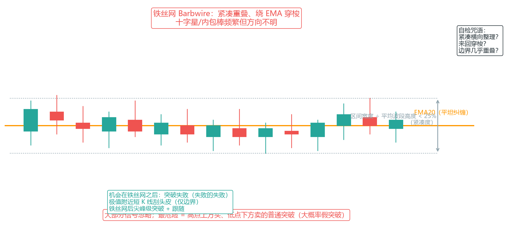

*图 2-10 铁丝网（Barbwire）：紧凑重叠、绕 EMA 穿梭——大部分信号忽略，等待突破失败或极值短 K 线*

铁丝网之后的机会不是“追突破”，而是：**突破失败（失败的失败）**、极值附近短 K 线刮头皮（仅边界非中部）、铁丝网后尖峰级突破 + 跟随。铁丝网内止损**禁止**设在边界外 1-2 跳（噪音太大，必被扫）——结构缓冲不足就放弃。

**TTR 中的 101 结构（Ali）**：TTR（无趋势区间）是一种无趋势环境，**单根外包线（101）的小动量足以影响其后 1 根柱的方向**——市场将中间柱视为小型突破，随后出现回调（PB），接着在突破方向上形成小型两腿走势；101 之后的柱通常朝相反方向运行（例如买入 101 后出现卖出失败柱），它会跟随 101 外柱的方向；双失败柱（2FT）通常沿 101 的方向运行。四种情况下 101 策略都奏效——**了解 1 号柱的方向可能与反转期方向相反，有助于避免在成功交易中被震出局**。

**20GB（均线缺口计数）**：连续约 20 根 K 线未触及 EMA，说明趋势极强、市场严重偏离均值。两个结论：第一，**无明确反转前不要逆势**交易 20GB 趋势；第二，20GB 后**首次触及 EMA 是顺势刮头皮的高胜率结构**，预期至少测试原趋势极点（配合第 4 章“20 gap bar 两种建仓方案”）。若第一次触及失败，可等第二次；**两次都失败，不再第三次强行尝试**——回到状态机重新判断是通道、区间还是反转。

### 2.9 洛氏霍克交易法：把“结构突破”变成一套完整打法 【核心】

如果说 Brooks 把结构读“活”，Joe Ross（洛氏霍克交易法创始人，20 世纪中叶的职业交易员）则把结构读“机械”——他的体系只用两个结构（1-2-3 结构和洛氏霍克结构 Rh），却配齐了从定义、入市、止损到资金管理的完整流程。它和第 2.3 节的结构突破是同一件事，但更形式化：每个点都有明确的确认条件，没有“感觉”的余地。

**1-2-3 结构：趋势的起点**

几乎每段趋势（无论大小）都始于一个 1-2-3 结构。以做多为例（低位 1-2-3）：

1. **1 点**：主要/中期低点——市场跌到无人愿意再卖的位置，空头平仓获利、多头入场，价格向上运行形成“上升臂”。
2. **2 点**：上升臂后的回调高点——短线多头获利平仓、看空者入市做空，价格回调。
3. **3 点**：回调未跌破 1 点、形成的更高低点——空头若正确，价格会跌破 1 点（结构无效）；空头若错误，新多头入场推动价格再次向上。
4. **入场**：价格向上突破 2 点——多空较量结束，多头获胜，趋势确认。

镜像即高位 1-2-3（做空）：1 点=高点，2 点=回调低点，3 点=更低高点（**3 点必须低于 1 点**），跌破 2 点入场。

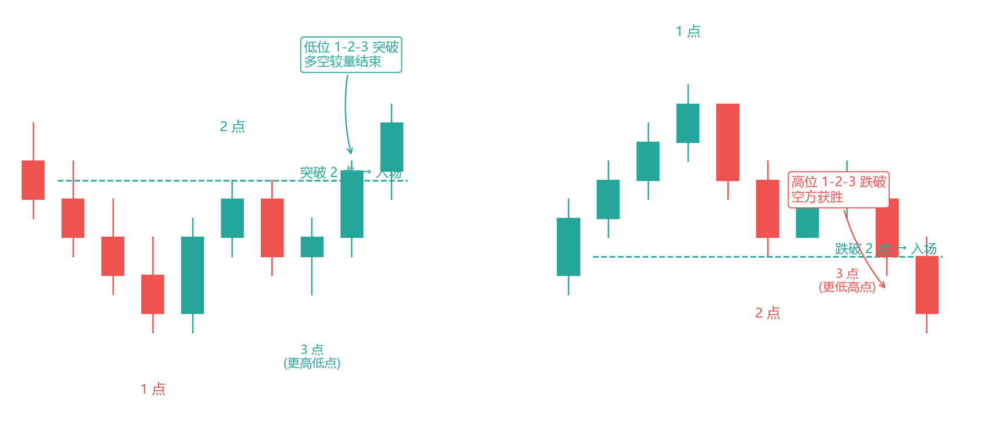

*图 2-11 洛氏 1-2-3 结构：低位做多（左）与高位做空（右），突破 2 点入场*

**结构要求（洛氏原规则）**：日线图 1-2-3 至少由 4 根 K 线组成（越多越清晰）；日内图至少 3 根——K 线太少的“结构”只是噪音。

**洛氏霍克结构（Rh）：比 2 点更早的入场点**

洛氏在研究 2 点时发现：2 点被突破后，第一根**没有创出新高**（做多）的 K 线，其低点/高点就是比“突破 2 点”更早、止损更近的入场参考——这就是洛氏霍克结构（Ross Hook）。Rh 的形成有 4 种情况：

1. 低位 1-2-3 的 2 点被突破后，第一根不创新高的 K 线（做多 Rh）；
2. 高位 1-2-3 的 2 点被突破后，第一根不创新低的 K 线（做空 Rh）；
3. 横向运行结构（停顿/整理/震荡）向上突破后，第一根不创新高的 K 线；
4. 横向运行结构向下突破后，第一根不创新低的 K 线。

**用法（奇克入市法）**：Rh 被突破时（或之前）提前入市——不必等价格创出新高/新低。价格回落到 Rh 附近时挂限价单做多（做空镜像），止损在 Rh 另一侧。这就是“在突破之前就进入市场”：2 点突破给了方向，Rh 给了更早的入场点和更近的止损。

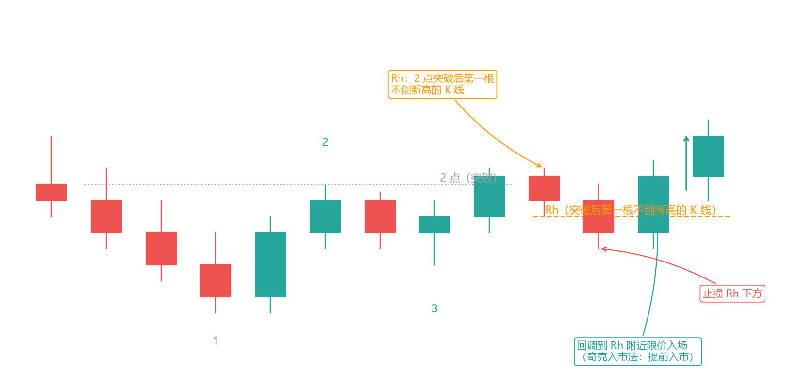

*图 2-12 洛氏霍克 Rh 与奇克入市法：回调到 Rh 附近限价入场，止损放 Rh 另一侧*

**反转洛氏霍克（RRh）**：趋势反转时形成的 Rh——上升趋势中出现向下突破、随后第一根不创新低的 K 线，是潜在的反转做空点。洛氏自己承认 RRh 更难确认、更难交易——新手先只做趋势中的 Rh。

**与本书的对照（洛氏不是另一套体系，是同一套体系的机械版）**：

| 洛氏概念 | 本书对应 |
| --- | --- |
| 1-2-3 结构 | 2.3 结构突破 + 双底/双顶变体（3.9） |
| 2 点突破入市 | 3.9 突破形态 / 4.5 系统三 |
| Rh 回调入场 | 4.3 趋势回调（回调到突破后第一个不创新高点） |
| 奇克入市法（提前入市） | 4.21 突破单模型一（H2/L2 顺大逆小） |
| 3 点=更高低点 | 2.3 的 HL（趋势健康标志） |

**诚实评价**：洛氏体系的价值是把“结构”定义成可编程规则（每个点都有硬条件），这是它的最大优点；但 1-2-3 在区间市场会反复失效（每次突破 2 点都是假突破），所以必须配合第 4 章状态机判断“趋势 vs 区间”。洛氏自己的配套方案是严格资金管理（3 手合约法，见 6.12）和止损纪律（见 6.5 与 4.16）——结构只解决“在哪进”，仓位和止损解决“活下来”，两者缺一不可。

### 2.10 逐棒检查单：把读图变成流程

以上所有内容，最终要压缩成一个“每根 K 线收盘后 10 秒内跑完”的固定流程（Al Brooks 逐棒分析检查单，PA 逐棒检查单）：

1. **分类**：这根 K 线是趋势棒、十字星、内包还是外包？
2. **角色**：它是结构棒、信号棒、入场棒还是确认棒？
3. **上下文**：现在处于趋势/通道/区间/突破后/反转尝试的哪种状态？
4. **跟随**：后续 1-2 根是否同向推进？
5. **更新计划**（不是持仓）：顺势、等二次入场、等突破测试、放弃、或不做。

六条口诀（背下来，每次看图默念）：

> 1. 先上下文，再形态。
> 2. 先信号质量，再入场计划。
> 3. 先二次入场，再评估反转诊断（逆势不下单）。
> 4. 先跟随，再确认可交易。
> 5. 先惯性，再逆势。
> 6. 看不懂，就等下一根 K 线。

**特殊结构的逐棒速查**：

- **最终旗形（趋势末端 10-20+ 棒水平整理）**：顺趋势突破后 1-2 根无跟随 → 失败 FF，勿追突破；整理区呈铁丝网 → 中部不交易（呼应 4.23）。
- **磁力位回测**：价格回到失败信号棒极点或失败入场价、接近 17t/41t 陷阱区 → 不追单，等测试结果（呼应 4.13）。
- **2BR / 外包 / 微楔形**：2BR 须双确认才作 MTR 一部分；外包线在铁丝网中不追、趋势线突破后可为入场棒；微楔形 3-4 棒按楔形处理（呼应 2.1、3.9）。
- **H1/H2 与突破**：计数规则见 3.12；突破失败/测试见 3.11；二次入场见 3.12。

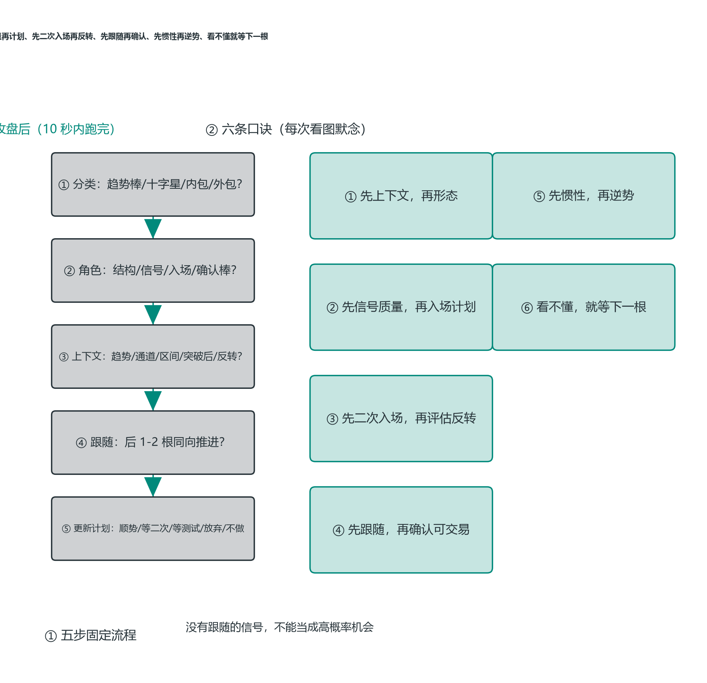

*图 2-13 逐棒检查单：每根 K 线收盘后的五步流程与六条口诀*

**收盘纪律：8 次正确才能弥补 1 次过早进场**（诊断）：K 线通常会延续收盘前几秒的走势——过早进场最多多赚 1 跳，但每天总有一两次“你以为信号会出现、实际没有”的情况，一次过早进场平均多亏约 8 跳。**需要 8 次正确运行的趋势才能对冲一次过早进场——几乎不可能**。两个常见结局：强趋势中看到“完美”反转棒提前进场，收盘前几秒价格崩盘收于低点（假反转陷阱）；或把保护止损移得太紧，收盘前被下探击穿、下一根开盘直奔目标（被挡在好交易之外）。纪律：**收盘前不动手，收盘后不移动初始止损**。

### 2.11 尖峰与高潮：趋势的引擎与末日

**尖峰（Spike）是趋势的 Leg 1**——由连续大型趋势棒构成、几乎没有回撤的快速单向运动，是买方力量短时间集中爆发的结果（PA 极速行情）。

**先理解尖峰是什么（机制总纲）**：尖峰 = 订单流失衡的集中爆发。机构的大买单需要等量的对手盘，当前价位的卖单不够 → 价格必须快速上涨去“找”卖单（呼应 5.14 机构如何推动价格）——一路上吃光挂单、触发空头止损，形成连续大实体、无重叠、创新高的 K 线。所以尖峰的每一项识别标准都在测同一件事——**卖方有没有出现**：实体大 = 买盘远超卖盘；无重叠 = 中间没有任何像样的卖出；尾线短 = 没有反击；收盘创新高 = 买方愿意为新价位付钱；紧迫感 = 买方等不及回调。而**高潮（climax）是同一枚硬币的另一面**：失衡爆发到极致后，能推动价格的买盘耗尽，最后一批追高者进场——高潮 K 线是“燃料烧完”的标志。尖峰（失衡）与高潮（耗尽）是同一个过程的两端，理解了这点，下面每条规则都能从“燃料还剩多少”推导出来。

**先拆概念：Spike ≠ Breakout ≠ Gap ≠ Climax**（四个字段不能混为一谈）：

- **尖峰**：K 线形态——连续大型趋势棒；
- **突破**：价格结构——突破前高/区间边界；
- **缺口**（opening gap）：开盘角度——大幅跳空高开；
- **高潮**（climax）：情绪与衰竭——买方极端主导后出现衰竭信号。

**尖峰 5 项识别标准**：

1. **连续大型多头趋势棒**：实体 ≥ 最近 5-10 根均值的 1.5-2 倍；至少 2-3 根紧邻出现，中间无反向棒；
2. **实体几乎无重叠**：相邻棒的开盘接近前棒收盘/最低价；
3. **方向尾线短**：上尾线 ≤ 实体长度的 20-30%；
4. **收盘持续创新高**：每棒收盘 ≥ 前棒最高价（若只能高于前棒收盘而超不过前棒高点，动能已减弱）；
5. **紧迫感**：机构急于入场、不愿等待回撤。

**持续时间分级（路由标准）**：

| 根数 | 定义 | 操作 |
| --- | --- | --- |
| 1 根 | 弱尖峰候选 | 等下一根跟随确认，**禁止追单** |
| 2 根 | 最低可路由尖峰（重叠 < 30%） | 只等回撤（SPS），**禁止追突破** |
| 3-5 根 | 标准尖峰 | 强趋势日概率高；5 根起注意衰竭 |
| 6 根+ | 高潮预警 | 监控衰竭信号——**不以根数确认高潮，以衰竭信号为准** |

**尖峰结束的标志**：第一条暂停棒（同向小实体棒）→ 禁止追单，尖峰转 ending；第一条反向回撤棒 → 尖峰确认结束，转通道/区间评估。暂停 1-2 棒后以同等力度恢复 = **二次尖峰**（通常不如第一波强）；连续三次尖峰极罕见，**第三次通常就是高潮**。

**枯竭 K 线（Exhaustion Bar）**：突破中的长趋势 K 线通常会在下一根 K 线失败，套住方向选择失策的追单者——K 线过长本身是趋势耗尽的信号；凝滞区交易日中长趋势 K 线的失败尤其常见。

**买进高潮（Buying Climax）的典型序列**：2 根以上大趋势棒 → 一根明显更大的高潮棒 → 紧跟带长上尾线的小实体拒绝棒 → 空头趋势棒确认反转。**衰竭信号三件套**——长上尾线（> 实体 50%）、小实体棒（< 近期均值 30%）、反向趋势棒：任意一个出现即触发高潮判定。

**卖出高潮（Selling Climax）与买进高潮的关键区别**：识别特征完全镜像（长下尾 > 实体 50% / 小实体 < 均值 30% / 反向棒），但后续行为不同——**卖出高潮后更倾向 V 形反转**：恐慌抛售后空头“弹尽粮绝”，反弹往往与下跌一样快、至少回撤 38.2-50%；买进高潮后通常需要更长时间的盘整。**为什么不对称（机制）**：恐慌抛售是“被迫的”——止损、追保、强平把卖单挤在同一时刻，抛售一结束，市场里短时间内没有卖盘了，而空头急着回补（浮盈在消失）——买盘 + 回补同时涌来，V 形反转。买进高潮的追高是“自愿的”：获利盘分批了结、没有强制平仓的紧迫性，所以需要盘整来慢慢消化浮盈。**反转确认关键**：反弹棒出现后的第一根反向棒是否创新低——创新低 = 尖峰延续；不创新低 = 反转概率上升（仅诊断，不逆势）。

**高潮 K 线的量化预期（突破）**：高潮 K 线（climax bar）有 70% 的概率在 1-2 根 K 线内出现回调，超过 60% 的概率至少出现一个小幅第二波段（顺原方向）；**为什么 70% 会回调（机制）**：高潮 K 线吃掉的是最后的买盘——K 线内部追高成交的人全部浮亏，下一根一开盘他们就是现成的卖压；先前入场的多头看到高潮也倾向落袋。追高者被套 + 获利盘了结，两股卖压叠加，回调几乎必然。当高潮信号棒出现在**末段行情**（趋势方向的最后 1-2 波）中时，通常导致更持久的回调甚至直接反转——与 2.11 的“第三次高潮是趋势末日”互证。所以高潮后的标准动作：**等回调（70% 会来），不追高潮**。

**抛物线通道 = 趋势的最后阶段**：回撤幅度越来越小（通道高度 50% → 20% 以下）、回撤时间越来越短（5-10 棒 → 1-2 棒）、趋势棒越来越大、FOMO 追涨——结束后通常回调整个运动的 38.2%-50%。

**发散（扩张）：趋势末期在波动形态上的签名**：与收敛/三角形（波动收缩、犹豫）相对，**发散（expansion）是波动范围逐步扩大的状态**——价格每推一波，高低点区间都比上一波大，趋势棒越来越大、回撤越来越浅。它不是独立的入场信号，而是**趋势加速并走向末期的形态签名**：扩张到极致 = 抛物线 = 高潮（上文）。读图要点：① 收敛（三角/楔形）在趋势中段是“换挡蓄力”，发散在趋势末段是“油尽灯枯”——两者方向相反；② 看到发散不要追顺势（追在最后冲刺里），按高潮处理：等回撤、等衰竭信号；③ 发散后进入区间是常态，未必直接反转（呼应 3.9：反转需 MTR 四组件确认）。

**缺口尖峰**：大幅跳空启动的尖峰。开盘 30 分钟内缺口被回补 = 缺口尖峰失败；缺口 > 日均波幅 30% = 强信号；趋势日中的缺口通常不回补。

**尖峰后的三条路径（概率排序）**：① 转通道延续（约 60%——回调 < 50%、通道倾斜向上，通道下轨做多）；② 进入区间（约 30%——顺 direction 一侧边界操作）；③ 反转（约 10%——仅诊断，不逆势）。**为什么转通道是大概率（机制）**：尖峰已经确立了方向共识和新的价位区间——失衡没有消失，只是从“爆发式”转为“匀速式”：回调时抄底者（价值型多头）和趋势跟随者接盘，形成有序的通道推进。**爆发（尖峰）→ 匀速（通道）→ 衰竭（高潮）是同一个失衡的完整生命周期**；反转需要燃料方向彻底改变，所以只有约 10%。

**连续高潮与反弹容忍度**：同向两次高潮之间通常间隔 ≥ 10 棒，中间反弹常为两条腿；第二波力度与第一波相当或更大才算连续高潮（明显更弱 = 只是反弹）；**第三次高潮常呈抛物线，是趋势最后阶段**——之后通常大幅反弹或反转，禁止追单。**为什么第三次是末日（机制）**：每次高潮都是一次燃料耗尽——但第一次高潮后趋势共识还在扩散，新的买盘会涌入；第二次靠更强的 FOMO 再次推动；到第三次时，能入场的买方几乎全部在场（场内全是浮盈持仓、没有新增量），抛物线就是“最后一波人用尽最后力气”的形状——之后没有新买家，只能向下。**尖峰后反弹容忍度三档**：强尖峰后反弹不应超过尖峰高度 50%（继续顺势）；超过 61.8% = 尖峰失败、按区间场景处理；低于 23.6% = 极强趋势（小幅反弹趋势日）。

**衰竭性高潮（EGO）的识别与确认（Ali）**：一系列买入（或卖出）高潮的末期，会出现**最大、最强壮的 K 线**——看似新突破，实为最后疯狂，随后失败反转。三个细节：① **高潮后约 10 根 K 线内不宜反向交易**（见下文交易纪律），且至少 50% 概率会测试前一个高潮高点；**为什么不能立刻反向（机制）**：高潮只是“燃料烧完”的诊断，不是“方向反转”的确认——燃料烧完后价格还可能靠惯性再冲一波（测量移动的第二腿），且 50% 概率会回头测试高潮高点。在反转结构（第一次回调 PB + 反向结构）出现前逆势入场，等于在趋势的“回光返照”里接刀。② **真正的反转确认是高潮后的第一次回调（PB）**——高潮本身只是诊断；先出现带 PB 的最终 EG、之后才是反转的情况也很常见（EGO：EG 之后还有 EGO）；③ **3 次或以上的连续高潮（CC）且仅伴随 1-2 根回调线，通常形成衰竭趋势**——直到突破缺口被回补、该供应区被标记为耗尽缺口。TR 时期最强的趋势柱形成在每条腿末端附近——那是顶部/底部的高潮（EG 而非 MG），是对交易者的警示信号：当前走势即将反转，而非新的突破柱。

**上山高潮还是新突破？（Ali）**：每次突破同时都是高潮——**当高潮不极端时，它更像新趋势而非反转**：买入短暂停顿是更高概率的交易；当买入最终结束时，**趋势延续比急剧反转更有可能**。所以遇到“看起来像高潮”的突破，先问极端程度：不极端 → 按新趋势对待；极端（长影线 + 大实体 + 无跟随）→ 按高潮对待。

**不寻常 = 高潮 = 不可持续（Ali）**：从未或很少出现的价格行为（极度异常的大实体、极端影线、惊人的速度），之前往往经历过很不寻常的走势——**越是物极必反，越要等纠正而不是匆忙上船**。日线图上：当 CH（连续更高高点）形态持续超过 1 根 K 线时，大概率会转为交易区间并开始形成 HL；一旦跌破主要 LH（导致 LL 的那个），市场不再处于上升趋势——无论它看起来多强。

**真空测试：支撑/阻力的“试金石”（Ali）**：当市场快速上涨触及阻力位后停滞，或抛售快速回落并在支撑位止跌（速度快到没有给犹豫留时间），这种“真空测试”会**提高该支撑/阻力保持有效的概率**——快速触达说明多空都认可该位置，犹豫的测试才容易被突破。

**大柱极点是磁铁（Ali）**：TRD/TTRD 中最常见的情形——**大突破柱体会在其高点（或低点）附近收盘**：市场具备足够动能突破高点，将多头困在场内、空头挡在场外；随后市场回撤并测试一路下行至趋势线下方，触发多头止损——过程中同时触发大 K 线上下方的两个磁吸位。外包线本质上是单根 K 线的交易区间突破——而多数区间突破都会失败，必须密切关注导致它们出现的价格行为（呼应 2.10 逐棒检查单）。

**交易纪律**：只做回撤入场（SPS，回撤位 38.2%-50% 或前棒低点），禁止追尖峰（SCS）；高潮后至少等 10 根棒再考虑新多；止损放大不得超过尖峰高度的 50%，超过则放弃；止损永远留 1-2 跳缓冲，不放在精确极点。

**趋势日与小幅反弹趋势日（尖峰的日线形态）**：开盘起下跌趋势日——开盘后前几根棒形成当日最高点，开盘区间 < 当日波幅 25%，跌破后价格持续下跌；约 20% 的交易日属此类（上涨镜像同理）。确认规则：**开盘低点（或高点）在第一小时内被突破 = 趋势日失败**；确立后每次反弹都是顺势入场点。**小幅反弹趋势日 = 最强趋势日类型（每月约 1-2 次）**：全天反弹幅度仅为日均波幅的 10-30%、反弹只持续 1-3 根、反弹棒约趋势棒的 30-50%——所有反弹都是顺势入场点，禁止逆势。趋势日逻辑呼应第 1.9 时段：欧美交易时段交界最易发生。

**陷阱速查**：单根大实体棒 ≠ 尖峰（须 2 根+跟随）；区间内急涨 ≠ 尖峰（须突破区间边界并持续）；通道内大棒 ≠ 新尖峰（须突破通道上轨并显著加速）；二次推动明显弱于第一次 = 只是通道行为；高潮后追涨 = 接最后一棒。

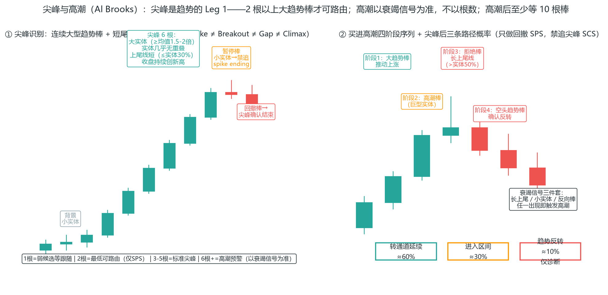

*图 2-14 尖峰识别五标准与持续时间分级（左）；买进高潮四阶段序列与尖峰后三路径概率（右）*

### 本章自测（答案在本节末尾）

1. 一根锤子线出现在上升趋势的 HL 处，另一根同样的锤子线出现在前高阻力正下方——哪根更值得关注？为什么？
2. 趋势的客观定义是什么？一段行情没有 HH/HL 有序排列，还算趋势吗？
3. 逐棒检查单（2.10）的核心价值是什么？

**答案**：① 出现在 HL 处的——同样的形态，位置不同天差地别（2.2），阻力正下方可能是逆势或半空信号；② 有序的 HH/HL 排列（2.3）——没有就不算趋势，那是区间或混沌，别用趋势系统；③ 把读图从“感觉”变成固定流程——每根 K 线收盘后按固定顺序问结构/方向/信号，这是第 7 章流程化的读图版。

### 本章小结：速查卡

**① K 线的语言——先读人，再读价**

- K 线记录的不是价格，是人：实体告诉你谁赢了，影线告诉你赢得多艰难；收盘在哪一端是多空最后的表态。
- 一次入场三段式：信号棒发出邀请 → 入场棒突破触发 → 确认棒验证方向；内包单根不交易、外包只是扩张不是突破、2BR 胜率仅 50-55%。

**② 位置决定价值——先看位置，再看形态**

- 一根 K 线的意义由位置决定：同样的锤子线，在支撑位是黄金，在半空是垃圾。
- 一次入场 = 背景 × 位置 × 形态同时成立（看 2.6 完整演练）。

**③ 趋势与结构——别跟结构争辩**

- 趋势是钱走出来的，不是画出来的：最近的重要低点被跌破，上升趋势就在定义上被破坏——别跟结构争辩。
- 柱计数（高1/高2/楔形=高3）给入场点命名；任何移动的最低目标是 TBTL（10 棒两腿）；只有 40% 的反转走得够远、20% 变成相反趋势。

**④ 支撑与阻力——一群被套的人**

- 支撑不是线，是一群被套的人：被测试越多越重要，是个区域不是精确线，突破后角色互换。
- 关键位下方埋着止损——这是第 5 章流动性池的伏笔。

**⑤ 量价与缺口**

- 量是燃料：放量突破可信，缩量突破危险；外汇量不真实，期货量可靠。
- Brooks 缺口 = 收盘价与前棒高点间的任何空间；趋势早期的大 K 线是测量缺口，晚期是衰竭缺口。

**⑥ 无交易环境与逐棒纪律**

- 铁丝网（紧凑度 <25%）是无交易环境——大部分信号忽略，等待突破失败；20GB 趋势不逆势，首次触 EMA 是顺势刮头皮机会。
- 逐棒检查单：每根 K 线收盘后跑五步（分类→角色→上下文→跟随→更新计划）；六条口诀——先上下文再形态、先信号质量再计划、先二次入场再反转、先跟随再确认、先惯性再逆势、看不懂就等下一根。

**⑦ 尖峰——趋势的引擎**

- 尖峰识别：2 根以上连续大型趋势棒、实体几乎无重叠、短尾线、收盘创新高——1 根只是候选；6 根以上进高潮预警，但高潮以衰竭信号为准（长上尾 > 实体 50% / 小实体 < 均值 30% / 反向棒）。
- 尖峰后 60% 转通道、30% 进区间、10% 反转；只做回撤不追尖峰，高潮后至少等 10 棒。
- 卖出高潮倾向 V 形反转（买进高潮需更久盘整）；反弹超 61.8% = 尖峰失败进区间、低于 23.6% = 极强趋势日；连续三次高潮是趋势末日。

下一章进入具体的入场信号：假突破、pin bar、吞没、内包线——它们都是本章“位置+形态”的具体化。
