# 第 3 章 入场信号

上一章你学会了读图——看懂谁在赢、位置在哪、哪里埋着止损。这一章解决那个最实际的问题：到底什么时候进场？

先给你一个贯穿全章的总纲，请务必记住：

> 信号不是"看到形态就进场"，而是"位置先对，形态只是最后一道确认"。

很多人学了一堆形态——锤子、吞没、早晨之星——然后满图找形态，找到就进。这是错的。形态本身不值钱，形态出现在对的位置才值钱。这一章的每个信号，你都要先问"位置对不对"，再看"形态好不好"。

### 3.1 判定框架：背景 × 位置 × 形态

所有信号，都用同一个框架判定，按优先级排：

1. **背景（大方向）**：现在是趋势还是区间？方向是哪边？——只做顺势信号。
2. **位置（关键位）**：信号是不是出现在支撑/阻力/结构点上？——半空中的信号是噪音。
3. **形态（K 线确认）**：这根 K 线长得好不好？——最后一道确认。

关键在"×"这个符号：**信号质量 = 背景 × 位置 × 形态，三者相乘，缺一个就是零**。背景错了（逆势），形态再漂亮也是零；位置不对（半空），背景再顺也是零。这就是为什么"看到一个漂亮的锤子就进场"会反复亏——你只看了三个因子里的一个。

**怎么把框架用起来**：入场前按顺序过三道闸，任何一道不过就放弃：

- 第一道（背景）：HTF 方向和我一致吗？不一致 → 放弃。
- 第二道（位置）：信号在关键位吗？（支撑/阻力/结构点/回调区）不在 → 放弃。
- 第三道（形态）：信号 K 质量合格吗？（第 3.10 的质量标准）不合格 → 放弃。

三道闸全过才入场。这个流程看起来简单，但它把"感觉"替换成了"清单"——第 7 章会讲，这是对抗情绪的唯一工程化方法。

### 3.2 假突破：最重要的单一信号

如果这一章只能留一个信号，那就是假突破。先给你一个洞察，理解它你就懂了为什么：

> 假突破之所以有效，是因为它是"别人亏钱的地方"。一批人的止损刚被扫掉，他们被迫离场，而他们的离场，恰恰成了反向行情的燃料。

看图理解这个机制：

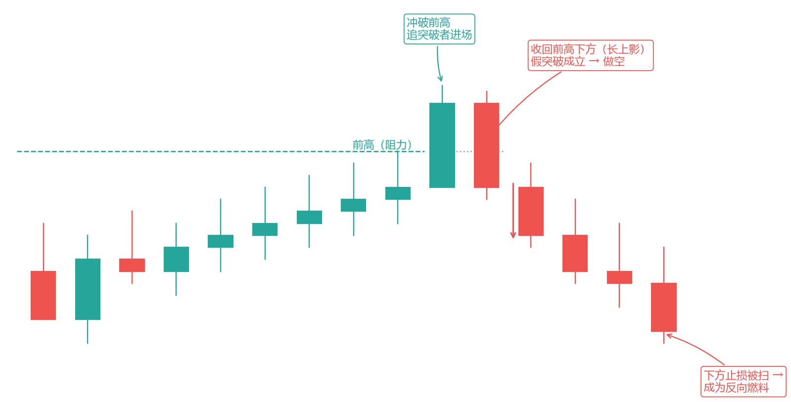

*图 3-1 假突破：冲破前高后收回，扫掉追突破者*

价格来到前高（阻力）附近。然后某根 K 线冲破了前高——这一刻，两类人被卷进来：追突破做多的人进场了，而做空的人的止损（挂在前高上方）被触发了。但注意那根 K 线：它冲高后没能站住，收盘被拉回了前高下方，留下一根长上影。

这意味着什么？冲上去的买盘没有后续，而上方等着卖的（止损盘+获利盘）把价格砸了回来。突破是假的，是"诱惑"。于是接下来，刚才追突破做多的人开始亏钱，他们的止损又成了往下走的燃料——行情反向往下走。

**用法**：在假突破的反方向入场。假突破前高→做空；假突破前低→做多。止损放在假突破的极值外（那根长影线的顶端外）。

**两个必须**：

1. **收盘确认**：盘中插破不算数，要等收盘拉回关键位内才成立。（例外：长影线+快速收回的 V 型反转，可即时判断。）
2. **配合量能**：突破时放量、收回时也放量=高质量；突破缩量=更像假突破。

**执行细节**：假突破的入场有两种——激进版（收盘确认后立即市价进）和保守版（等价格回踩关键位时挂限价进）。激进版成交确定但价格差，保守版价格好但可能不成交。固定一种，别混（第 4 章系统设计）。

**为什么它是"最重要"的信号**：因为它直接建立在"止损被扫"这个机制上，而止损聚集是市场里最确定的结构（第 2 章讲过，关键位下方埋着止损）。后面第 5 章 SMC 的核心概念"sweep（扫流动性）"，本质就是假突破换了个名字。你现在把假突破学扎实，第 5 章就水到渠成。

**真突破三条件（Brooks 规则库，PA_Agent 文件 18）**：假突破的反面是真突破。怎么在突破发生时就判别？Brooks 给三个条件，**至少前两条成立才算真突破**：

1. **跟随（Follow-through）**：突破后 1-2 根同向 K 线，收盘偏极点、回调浅。没有跟随的突破=还在怀疑。
2. **缺口**：突破时出现均线缺口、实体缺口，或与前期极点无重叠——让逆势方难以打平。
3. **强势突破棒**：大实体、短影线；十字星或长影的突破棒=假突破嫌疑。

三者不全 → 按假突破处理（wait 或准备反向）。这就是 3.11 Ali 数据的"FT 48%"的判据来源：**突破棒本身的形态 + 下一根的跟随，决定了它属于 48% 还是 52%。**

**失败的失败（Breakout Pullback）**：比假突破更高一层的结构——**突破失败了，但失败尝试本身也失败了，价格重新回到原突破方向**。剧本：价格假突破关键位 → 逆势方进场 → 价格快速收回并朝原方向推进 → 逆突破者全部被套。这是"可靠的突破回踩/二次入场"：逆突破者被套后，原方向往往加速。用法：突破失败后价格重新回到原方向时，优先按 H2/L2 或二次入场框架顺势进场（第 4.21 突破单模型一），止损放在测试低/高点外 1 跳。

**放弃 K 线（Give-up Bar，Ali 闪卡）**：假突破的最终形态——**一方彻底放弃**。它同时满足三个条件：① 之前出现过买入高潮（卖方被耗尽过一次）；② 随后出现一根异常大的看跌反转 K 线；③ 最后那个突破缺口被关闭（多头最后的防线失守）。三条齐备，多头"放弃"了这波行情，之后通常跟随**两段式下跌**（2LD）。与直觉相反，**这根"失败"的突破线可能并非完全失败**——放弃 K 线后经常先走出同方向的两条腿（第一腿强劲），只有市场没有强烈改变方向时，才可能先出现 2 根反向 K 线再反转。**放弃 K 线后的回调方式也有讲究**：回调未达放弃 K 线的高点 = 跟进概率高；回调超过放弃 K 线高点 = 快速突破概率增加（空头回补成了燃料）。记忆：**放弃 K 线 = 突破缺口被关上的那一刻，等于"一方已投降"——顺投降方向做，等它走两段**（呼应 3.11 缺口降级为 EG 的量化版）。

**支撑位下方的反转 = 更高概率（Ali 闪卡）**：市场**测试支撑位下方之后**的反转，是高概率买入信号——比在支撑位上方直接反转更可靠；如果市场**第二次**测试支撑位下方并形成第二次反转（2Rev），概率比第一次更高。逻辑：跌破支撑 = 扫掉支撑下方的止损单 = 流动性被收割，随后的反转没有止损盘的压制。用法：突破支撑假跌破后，等收盘收回支撑上方再入场，别在假跌破形成过程中抢跑。

### 3.3 Pin Bar（锤子 / 吊颈）

这是最经典的反转形态。一根 K 线，影线至少是实体的 2 倍，实体很小，缩在整根 K 线的一端。

*图 3-2 Pin Bar：锤子线（长影线 + 小实体）*

（这张图第 2 章用过，再看一遍，这次从"信号"角度读。）

**逻辑**：长下影=空头曾把价格砸下去，但被更强的买盘拉了回来——卖方进攻失败。所以锤子线（长下影）是看涨信号，吊颈线（长上影）是看跌信号。

**用法**：

- **位置**：必须出现在支撑位（锤子）或阻力位（吊颈），或趋势的回调末端。顺势的锤子 > 逆势的锤子。
- **入场**：两种——影线 50% 位置挂限价单（成交率高、止损小），或等突破影线起点后进（确认更强）。固定一种，别混。
- **止损**：影线最远端外侧。

**质量评分（满分 5，≥4 才做）**：

1. 影线≥实体 2 倍
2. 出现在关键位
3. 顺势
4. 实体收盘贴近影线起点
5. 出现在缩量回调后

这个评分表就是 3.1 框架的具体化——把"背景×位置×形态"拆成可打勾的项。每一项都是客观的，没有"感觉"的空间。

**失败案例**：下降趋势中途冒出一根锤子线，下方没有任何支撑，你逆势做多——大概率继续跌。锤子只在"位置对+方向对"时才是信号，孤立的锤子是噪音。

**影线 50% 挂单的具体操作**：假设锤子线影线范围是 100.00-101.00，实体收在 100.80。影线 50% 位 = (100.00+101.00)/2 = 100.50。在 100.50 挂限价买单，止损放 99.90（影线最低点下方），目标看前高。价格回到 100.50 自动成交——成交价精确、止损距离短、盈亏比天然好。

### 3.4 吞没形态（Engulfing）

一根 K 线的实体，完全包住前一根 K 线的实体，方向相反。

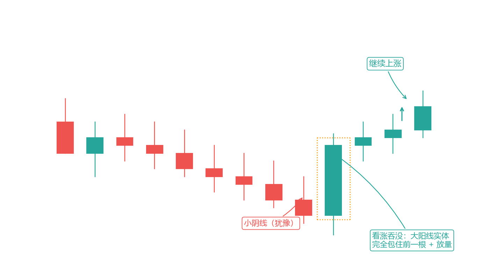

*图 3-3 看涨吞没：大阳线包住前一根小阴线*

**逻辑**：前一根还是空头在压（小阴线），下一根多头直接发力，把前一根的实体整个吞掉——力量在一根 K 线内完成了反转，而且带着速度。这种"干脆利落的反转"比锤子线更有力量感。

**用法**：吞没 + 关键位 + 顺势 = 高胜率组合。两个增强条件：

- 吞没前那根 K 线越"小"（越犹豫），反转的意义越大——因为对比越强烈。
- 吞没 K 线放量，质量显著提升——量价背离被纠正的经典形态。

**实例（看图）**：一段下跌后，价格到了支撑位，先出一根小阴线（犹豫），紧接一根大阳线完全包住它且放量——这就是看涨吞没，入场做多，止损放在吞没 K 线低点下方。

**吞没 vs 锤子的选择**：两者都是反转信号，但性格不同。锤子线给出的是"拒绝"（下方有人接），吞没给出的是"反攻"（多头主动吃掉空头阵地）。吞没的力量感更强，但要求更苛刻（实体必须完全包住前一根）——信号更少，质量更高。把两者都写进规则书，但每种信号单独统计胜率（第 8 章），不要混在一起算。

### 3.5 内包线（Inside Bar）

当前这根 K 线的最高、最低，都缩在前一根 K 线的范围之内——像被"包"在里面。

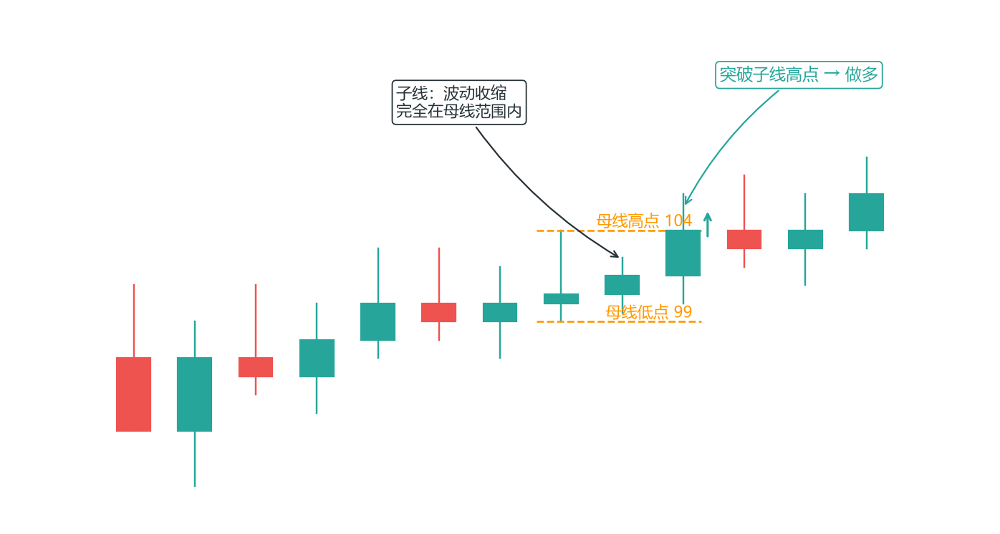

*图 3-4 内包线：波动收缩，等待突破方向*

**逻辑**：波动突然收缩=市场在犹豫、在蓄力。就像弹簧被压缩。接下来往哪突破，就是市场给出的答案。

**用法**：突破子线（内包那根）的高点做多、跌破低点做空。趋势中，只做与趋势同向的那个突破（上升趋势只挂子线高点上方的做多单），反向不追——这能过滤掉一半噪音。

**进阶玩法**：内包线先向一个方向突破、又快速收回母线内——这是"内包线假突破"，反手做，止损放假突破极值外。它就是 3.2 假突破的缩小版。

**执行细节**：内包线是"挂单触发器"的最佳载体——你不需要盯着盘等确认，直接把单挂好：上升趋势中，在子线高点上方挂限价买单（突破单），触发即成交，止损放子线低点下方。挂好单之后，它自己会执行——这是把"等待"交给市场，把"执行"交给机器（第 7 章流程化思想）。

**内包线的价值在于**：它是一个让市场替你决策的触发器——你不猜方向，等市场用突破告诉你。

**内包线的背景概率（Ali 闪卡量化）**：内包线本身没有方向，方向全在背景——三组概率直接背：

- **紧密交易区间内的内包线：失败概率 60-80%**（区间没方向，突破多半是假的，别追）；
- **强多头趋势中的 H2 回调内包线：成功概率 60%**（顺势回调的收缩是蓄力，突破更可信）；
- **大多头 K 线之后的多头内包线：70% 概率出现小两段上涨**（大棒之后的犹豫，等的是第二波）。

止损细节：内包线做突破时，止损放在**外包线（母线）高点上方 2 个跳动点**而不是子线极值——市场常先小幅刺穿再走方向（呼应 4.13 止损表）。

### 3.6 量价确认：信号的最后一道滤网

任何信号入场前，过一遍量价三问（呼应第 2.5 节）：

1. **趋势方向的移动有没有量？**（顺势信号放量跟随=加分）
2. **回调/反弹有没有量？**（缩量回调=健康；放量回调=趋势可能要变）
3. **突破关键位有没有量？**（放量突破=真；缩量突破=假突破高发）

三问全过=做；两问不过=等下一个。记住第 2 章的限定：外汇的量是 tick 近似，只能当参考；期货的量才真。

**量价三问的用法**：这不是第四个入场条件，而是给前三道闸的"评分器"——形态合格后，用量给它打个分：三问全过 = 高质量信号，可以按规则入场；一问不过 = 降级处理，等更好的位置或更明确的量；两问不过 = 放弃。这样"量"就从"模糊的感觉"变成了"可执行的规则"。

### 3.7 信号组合的胜率排序

**高胜率组合（顺势+位置+形态三合一）**：

1. 上升趋势回调到前支撑/HL 区 + 缩量 + 锤子/吞没 → 做多
2. 关键阻力假突破 + 放量收回 → 做空
3. 结构突破（HL 跌破）后的第一次回抽 + 拒绝 → 顺势入场

**低胜率组合（逆势+半空位置）**：

- 趋势中途的 pin bar 反转（逆大方向）
- 没有背景的孤立吞没
- 区间中部的任何信号

**怎么用这张表**：高胜率组合是你的"主力 setup"，做它、统计它（第 8 章）、优化它。低胜率组合是"不该做的清单"——把它写进规则书的原因，不是为了"万一可以做"，而是为了在盘中止住你的手。你不需要回避所有低胜率组合，但你必须**先知道它们是低胜率的**——大多数人是在连亏之后才意识到自己在做低胜率单。

### 3.8 蜡烛组合形态

除了单根形态，几个经典多根组合（同样原则：要有位置和背景）：

**启明星/黄昏星（三根反转）**：大阴+小实体（星）+大阳，且大阳吞没第一根实体过半→看涨；黄昏星是镜像→看跌。中间的"星"是犹豫的象征——市场在两根大 K 线之间停顿了一下，然后掉头。停顿越干净（实体越小、影线越短），反转信号越强。

**红三兵/三乌鸦**：低位三根连续阳线（每根开盘在前一根实体内、收盘接近最高）→趋势启动；三乌鸦镜像。注意高位三根大阳后警惕衰竭（第 2.8 高潮 K 线）——三兵是"启动"信号，出现在高位时可能是"最后一冲"。

**平头顶部/底部（Tweezer）**：相邻两根 K 线高点（或低点）几乎相同——同一位置被两次拒绝=支撑/阻力确认。平头是"位置"的 K 线版表达：两根 K 线都在这同一个价位被拒绝，说明那里有人持续在卖（或买）。

### 3.9 图表形态

K 线形态是微观（1-3 根），图表形态是中观（几十根）。分反转和持续两类：

**反转形态**：

- **头肩顶/底**：最经典的反转。确认=颈线跌破+放量；目标=头部高度从颈线投射。头肩的本质是"三次冲击同一区域，一次比一次弱"——第三次冲不上去，多头力竭。
- **双顶/双底（M/W）**：两次高点几乎等高，颈线是中间低点，跌破确认。第二顶若伴衰竭（缩量、长影），反转更可靠。双顶是"两次冲击同一阻力都被打回"，双底同理。**双顶熊旗细节（Ali 闪卡）**：双顶熊旗（Bear Flag Double Top）的第二高点通常与第一个高点**价格相同或更低**（而不是更高）；市场通常在跌破颈线之前**先出现一个低点**（隐含低点）——所以颈线破位等低点出现后再确认，别在低点形成前抢空。

**Brooks 的补充：所有反转都是双顶/双底的变体**。Al Brooks 把反转形态统一成一个底层结构——**主要趋势反转（MTR，Major Trend Reversal）**：市场测试趋势的极点，决定突破新高/新低还是反转。在这个框架下：

- **头肩顶 = HH MTR + LH MTR**：左肩是"更高高点 MTR"（多头没能延续），头是 LH MTR 的起点——多头没有创出新高，就是弱势多头。头肩不是独立形态，是 MTR 的拼图。
- **楔形 = 双顶/双底变体**：上升楔形（三推）在测顶，下降楔形在测底。
- **双顶/双底是每张图上出现频率最高的形态**，但很少完美——多数是"扭曲的"变体，所以交易者常给它别的名字（突破失败、最终旗形反转）。**每一个空头突破都是"未形成底部的双底"**，反过来也一样。
- **概率底色（第 2.8 已提）**：只有 40% 的反转走得够远可做波段，20% 变成相反趋势——所以反转单必须靠盈亏比取胜，目标至少用 TBTL（10 棒两腿）打底。
- **失败的 MTR 是常态**：40% 的 MTR 会快速失败、原趋势恢复——右肩上方若有强突破，大概率得到向上的测量移动和两条新腿。

**完整 MTR 的四组件（PA_Agent 文件 25）**：别把单根反转棒当成 MTR。Brooks 的"主要趋势反转"有四个硬条件，缺一不可：

1. **原趋势存在**：更高时间框架有清晰的 HH+HL 或 LL+LH 序列。
2. **趋势线/通道突破**：价格收盘突破主要趋势线或通道线（不是单根毛刺刺破）。
3. **趋势恢复失败**：突破后原趋势方未能恢复——没有强跟随、没有创新高/新低。
4. **前极点测试失败**：价格测试前高/前低但无法创出超越性新高/新低（形成双顶底或更低高点/更高低点）。

四组件齐全的完整 MTR，第一次反转尝试的成功率约 **35-40%**（多数失败变旗形或区间）；第二次反转尝试成为主要反转的概率约 **40%**——所以 Brooks 强调：**优先等待 H2/L2 或二次入场，而不是第一次信号就冲**。单根反转棒只能叫"反转尝试"（reversal attempt），不能叫 MTR。另注意：**MRV（小趋势反转）≠ MTR**——小反转多半只是回撤或进入区间，不要过早标 MTR。

**Brooks 的楔形概率**：上升楔形约 75% 概率空头突破，下降楔形约 75% 概率多头突破；水平三角形（对称）约 50/50 上下——三角形和楔形属于突破模式，不是反转模式，突破方向才是答案。另外：**头肩形态在趋势中大多是旗形而不是反转**（趋势末端 20+ 棒形成的横向区间=最终旗形，突破往往不创新高——这是反转前最后一个旗形，也是第 4.4 所说 TTR 的变体）。

**楔形回撤 vs 楔形反转：Brooks 体系最重要的区分**（PA_Agent 文件 14）。同样是楔形，"顺势中的楔形"和"趋势末端的楔形"交易含义完全相反：

| 特征 | 楔形回撤（Wedge Pullback） | 楔形反转（Wedge Reversal） |
| --- | --- | --- |
| 位置 | 趋势中段，与主趋势方向**相反**的楔形 | 趋势末端，与主趋势方向**相同**的楔形 |
| 规模 | 通常 10-20 根 K 线 | 至少 20 根 K 线 |
| 例子 | 上升趋势中的下降楔形 | 上升趋势末端的上升楔形 |
| 突破后 | 回到原趋势方向——**顺势入场机会** | 趋势反转——**反向信号** |
| 目标 | 楔形起点（前极点）、更高 | 楔形起点 + 楔形高度 MM |

判断口诀：**先定主趋势方向，楔形方向与主趋势相反=回撤（顺大势做），相同=反转（警惕见顶/底）**。K 线数辅助判断：<20 棒偏向回撤，≥20 棒偏向反转。初学者最容易犯的错是把形态名字当交易指令——"上升楔形"不自动等于做空（约 35-40% 的上升楔形向上突破、趋势延续），交易方向必须由主趋势 + 位置 + 突破质量 + 二次入场共同决定。

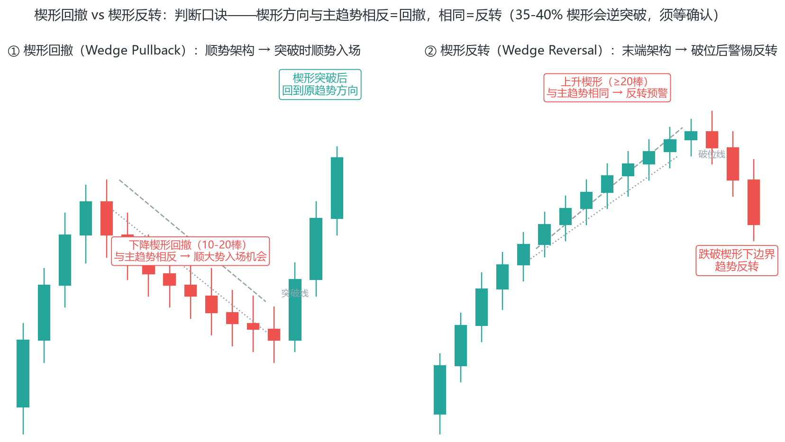

**抛物线楔形 = 高潮**：还有一种变异——楔形不是收敛而是**加速**（三推一推比一推快），这是买入/卖出高潮（Buy/Sell Climax）的几何形态：最后的疯狂买入/恐慌卖出。抛物线楔形是趋势即将结束的强烈信号，但不是立刻反转——通常先进入交易区间，之后可能反转也可能继续；突破抛物线楔形后通常有深回撤，深回撤后可能二次测试极点。**遇到抛物线楔形：禁止追原方向、禁止立刻反手——等深回撤和二次测试后的确认。**

**抛物线楔形的结构细节（Ali 闪卡补充）**：抛物线楔形是紧密通道，有时需要 20 多根 K 线才能反转；构筑完成后市场通常横盘约 10 根 K 线再决定方向。它由三次明显的推升构成（看似尖峰但与尖峰不同——内含三次推进）；**抛物线楔形顶部比底部更常见**（当日低点形态比高点形态罕见得多）。**末段耗尽判断**：若抛物线楔形的末段走势尚未耗尽（出现衰竭缺口），反转所需 K 线数可能超出常规预期——别急着数 K 线等反转。背景决定结果：HTF 处于强势多头时，抛物线楔形给多头提供逢低买入机会，反转上行通常急剧有力，之后横盘整理让市场决定趋势恢复还是回测区间。

**MTR 重置与不完美形态（Ali 闪卡）**：**强力测试可重置 MTR 计数**——买方回撤可重置买方限价单的 MTR 尝试次数；如果突破回调能将市场推至远低于既定突破回调低点之下，买方需要重新回到 EMA 再次启动反转处理。**不完美形态 = 预计还有一次推动**：不完美的 W 形态、看起来不太对劲的楔形，往往还会出现一次新的极端走势（不对称 = 不完整模式）；3 次突破失败的 BR 楔形、多重嵌套格局——都意味着主要运行模式尚未完成，别急着判定形态成立或失败。

**MTR 之后常有最终测试（Ali 闪卡）**：反转方向错误的一方决心会产生严酷考验——**当 MTR 形态完成时，大行情通常紧随一次"最终测试"之后**：价格先朝反方向冲一把（测试失败方），然后才是真正的大行情。测试失败不必着急——等待后续跟进：**趋势突破 + 失败测试 = 高概率入场**。同时注意：逆势（反趋势）交易策略常常失败并成为旗帜——逆势测试往往来势汹汹、看似反转，实则多数会在相同位置失败（呼应上文"失败的 MTR 是常态"）。

**头肩顶的另一种读法：HS = MTR = DBBLF = BOM（Ali 闪卡）**：所有头肩顶形态同时是市场顶部反转（MTR）、双底突破失败（DBBLF）与双顶突破失败（DTBRF）的形态结构，并将市场置于"突破底部"状态——**顶部呈现双底突破失败、底部呈现双顶突破失败**，颈线位同样构成反向形态结构。右肩常形成其他较小形态，有时嵌套一个较小的头肩形态。读图时四个名字是同一件事：看到头肩顶 = 看到一次失败的底部突破 = 看到 MTR。除非有良好的背景和强力设置，否则它只是 40% 的交易机会（呼应 2.8 反转概率）。

**V 顶/V 底：罕见的意外反转（Ali 闪卡）**：V 形顶部较为罕见，暗示着意外反转——常由新闻真空测试触发；在较小时间框架下顶部形态微观时间周期反转后，即使在更高时间框架上也不可见。识别细节：① **多数 V 形顶/底部属于更大形态的组成部分**（60 分钟图上的 DT、5 分钟图上的尖峰与 W 底）；② **多数 V 形顶至少包含一个微型 DT**——微型下降趋势突破前期高点后形成的 PW 顶部；③ 反转下跌超过 ATH 时，突破新高的行情通常首先向下回撤而非继续上涨；④ 高潮经过 3 个连续高潮柱后出现 3 柱 STC 或卖出高点，是最终高潮前的线索；⑤ V 形底 = 急跌与飙升：大周期图表上强劲的尖峰与通道趋势形成强力支撑/阻力位，5 分钟图上的支撑位测试后形成高潮反转。

**TRI：交易区间内部结构（Ali 闪卡）**：交易区间通常包含 3 或 4 个支腿；**区间内的突破（BO）上升或下降概率约 50%——BO 失败的概率同样约 50%，失败后转为反向回调（PB）形态**。区间顶部的突破大多失败（呼应 4.4：区间突破约 80% 失败）——所以区间内的突破不追，等失败后的反向。**三重 BO 陷阱**：TR 也可能出现 FBO——50% 概率出现 FBO、50% 概率出现 FFBO（失败的 FBO）；TRI 的 FBO 有时突然发生且市场快速走一大段距离；通常在突破前出现一个 TTR，突破迅速失败并困住早期交易者。

**首次反转是交易区间的一部分（Ali 闪卡）**：趋势反转后出现的第一波反向运动，通常只是更大交易区间的一部分——**别把首次反转当新趋势**：区间顶部的首次反转测试后，价格大概率还会再回到区间；真正的方向选择需要第二波确认（呼应 MTR 四组件齐全才诊断）。

**持续形态**：

- **三角形（对称/上升/下降）**：波动收缩，突破后常沿原趋势方向。对称三角形是"犹豫"（多空平衡），上升/下降三角形是"一方占优"（一边的波动被压住）。
- **旗形**：强势拉升后的小幅反向倾斜通道，突破后延续，目标=旗杆高度投射。旗形是趋势中的"换挡"——拉升后小幅回撤整理，然后继续。
- **楔形**：下降楔形看涨、上升楔形看跌。楔形和旗形的区别：楔形的两条边线收敛，旗形的两条边线平行。
- **杯柄（Cup & Handle，Ali 闪卡）**：杯柄是"突破回踩"形态的泛化称谓——杆状部分是包含交易区间（TR）的基底形态，市场突破该区间后形成突破尖峰；手柄是突破后的回撤：**需确保回调的最低点保持在突破点上方**（维持突破缺口 BOG 的有效性）；理想情况下回撤段的 K 线数约为突破阶段的一半，若回踩持续过长（如 20 根或更多 K 线），市场将重新进入突破前震荡状态。C&H 是宽幅震荡区间内的三角形整理形态：仅看三角形时上下突破概率均等，但位于宽震荡区间内且多头趋势持续时，尽管存在 50% 概率先出现假突破，最终向上突破的概率更大。

**通用规则**：

1. **确认要突破+放量，别在突破前猜**。形态没确认之前，它只是"潜在的形态"——过早入场是把自己交给运气。
2. **都有量度功能**（形态高度投射=最小目标）。这是最有用的部分：形态给你"最低目标"的数学依据，配合第 4 章出场。
3. **周期越大越可靠**。日线头肩比 5 分钟头肩可靠得多——周期越大，参与的参与者越多，形态越"扎实"。
4. **形态突破和假突破是一体两面**——突破站稳就跟随，突破收回就反手（呼应 3.2）。同一个突破点，两种剧本，规则写死，临场不猜。

### 3.10 信号 K 的质量：Brooks 的评判标准

第 3.1 节讲了"背景>位置>形态"，但"形态"这一项本身也有质量高低。Al Brooks 对"信号 K"（触发你入场的那根 K 线）有一套细致的质量标准——同样是一个锤子线，质量可以差很多。

**强信号 K 的特征（以做多锤子为例）**：

1. **收盘在高位**：收在整根 K 线上半部分，越接近最高点越好。
2. **实体颜色对**：做多信号最好是阳线，说明买方收盘前夺回控制。
3. **影线比例合理**：下影长（拒绝下方），但上影不能太长（上影长=上方也有抛压）。
4. **相对前一根的位置**：信号 K 低点跌破前一根、但收盘拉回——这种"假跌破+收回"特别强。

**Brooks 的精确化标准（pa_notes 的清单）**：Brooks 的课程笔记把强信号棒量化成可以逐条打勾的清单：

- **收盘远离前棒收盘**（不是贴着前棒收盘价，是明显推进了一段）；
- **上影线不超过棒长的 1/3-1/2**（做多信号的上影线要短）；
- **小或无下影线**（做多信号的下影可以存在，但不应比实体还长到"犹豫"）；
- **与前棒无太多重叠**（推进干脆，不拖泥带水）；
- **后续有强跟进**（下一根 K 线继续同方向推进——这是"事后"验证，也说明要等入场 K 确认）。

同时，**买卖压力是突破能否成功的最早征兆**：阳线内部向上推进的力度（实体占比）、连续几根 K 线的方向一致性，就是"买压/卖压"的可视化。反转若缺乏压力，大概率只是小反转（进入区间，而不是相反趋势）。

**弱信号 K**：收盘收在中间或不利端；实体太小（接近十字星，犹豫）；上下影都长（方向不明）。

**入场 K 确认**：Brooks 还区分"信号 K"和"入场 K"。信号 K 给提示，你挂单等突破；真正触发成交的那根叫入场 K。好的入场 K 应该朝你的方向走——如果入场 K 一出现就反向跌破你的入场点，是坏兆头，说明时机不对。

**接回本书**：3.3 的"质量评分"、3.4 的"前一根越小越好"，本质都是在评估信号 K 质量。Brooks 把它系统化了：位置对是前提，信号 K 质量决定这笔的"起跑线"。

**内包线与外包线（Ali 研究的补充）**：突破白皮书研究（作者 Ali Moin-Afshari，附录 C）给这两类 K 线补上了概率：

- **内包线**：区间压缩，是低时间框架上的三角形——**从内包线开始的反转/突破失败倾向高、且很快回调**。所以内包线只当"触发器"（3.5），不要当"反转确认"。
- **外包线**：波动扩张，是低时间框架上的扩散三角形——**外包线的方向偏向由突破幅度决定**：上破幅度大于下破幅度 → 看涨倾向（反之看跌）。外包 K 线不是中性的，它的"大方向"暴露了谁在主导。

### 3.11 突破的真实概率：用数据校准你的预期

突破是本书系统三的核心，但"突破后到底有多少概率继续"，多数人凭感觉。Ali Moin-Afshari 的突破白皮书用 2023 年的 E-mini 5 分钟数据给出了量化基准（他的信号经 Al Brooks 验证）：

**突破（BO）信号**：价格超过前一根 K 线高低点至少 1 tick 即算突破；"后续 K 线"（FT，follow-through）确认成败。统计结果：

- **突破获得后续 K 线的概率约 48%**——接近抛硬币。突破本身不是优势，优势在"后续处理"。
- **第二波行情概率 > 90%**：一旦第一波成立，随后出现第二波的概率超过 90%（64% 的第二波 ≥ 第一波、42% 几乎相等、仅 2% 完全没有第二波）。**所以"等待强劲第一波后交易第二波"成功率约 80%**——这是突破类交易最高概率的入场方式。
- **避开末段行情 +10% 胜率**：市场已走完两波后出现的第三、四波突破（"末段行情"），成功概率显著下降——避开它们，整体胜率可再提高约 10 个百分点。
- **MIG（微型缺口）**：第 1-2 波出现的微型缺口，97% 的概率第二波能赚钱（大亏概率 <2%）；但第 3-4 波的 MIG 有 80% 概率反转——"早期 MIG 是顺势爆发，后期 MIG 是高潮反转"。
- **扫止损**：第二波启动前约有 21% 概率先扫一次止损；第 3-4 波的结构扫止损后 80% 失败。
- **回调深度**：平均回调 3 根 K 线（最长可达 7-11 根）；58% 的回调在 0-0.5R 之间；**回调 < 0.75R 时亏损概率仅 10%**；深度回调（> 1R）后 > 90% 变成反转。
- **什么情况容易触发深度回调（Ali 闪卡 4 个特征）**：① 强波段之后出现相反信号；② 信号 K 线与前一根 K 线重叠过多（没有足够的价格空间）；③ 跟进不果断（突破后无后续 K 线配合）；④ 信号 K 线本身较小（力量不足）。四者任一出现，就把"深度回调"纳入预期——回调可能跌破突破点后再反转，别在回调开始时抢着加仓。
- **扫止损的补救边界**：第二波启动前约 21% 概率先扫一次止损。扫止损发生在结构波幅 50% 以内时，分批入场通常能挽回；超过 50% 后挽回概率最高只剩 15%——扫得越深，越别急着救。
- **IBS 效应（信号棒强度）**：结构信号棒 IBS ≥ 75 的多头结构，分批入场管理下没有亏损交易（占样本 27%）；IBS ≤ 25 的空头结构仅 6% 亏损（占样本 48%）——信号棒收盘越偏极值，结构越可靠，亏损越集中在第 3-4 波段的后期信号。
- **交易生命周期**：整个结构从信号到走完平均 8 根 K 线（5 分钟图约 40 分钟，最长可拖到 28 根）；典型节奏是回调 1-3 根 → 第二波段走 1R 幅度约 4 根 K 线——突破类交易按“半小时到一小时”规划，别指望隔夜式大行情。
- **大突破棒的反向效果**：突破 K 线特别大时，立即回调的概率显著增大；这类结构对系统整体贡献仅约 2%——大 K 线追进去不如等回调（呼应 2.11 枯竭 K 线）。

**四个筛选器（Ali 研究直接可抄）**：

1. **不采纳同方向的连续第 3 个信号**（前两个信号已兑现，第三个是末段行情）。
2. **不采纳通道中的第 3-4 波段信号**（通道末端突破失败率高）。
3. **不在 ET 10:10 之前入场**（开盘 9:30-10:05 的突破失败率 > 70%，10:10-11:55 分批入场胜率更好）。
4. **不在深度回调时入场**（回调超过 0.75R 的突破，亏损概率大增）。

加入这些筛选后，Ali 的突破系统 SQN 从 6.3 提升到 8.9，胜率从 76% 到 86%（SQN 的定义见第 8 章）——分步看：剔除第 3-4 波段先让胜率 76%→83%、SQN 6.3→7.4；再加“10:10 前不入场”才到胜率 83%→86%、SQN 7.4→8.9。每条筛选器都在实打实地过滤亏损单。**这套数据给本书系统三的启示**：突破不是"看到就追"，而是"第一波成立 → 等第二波回调 → 避开末段 → 控制时段"——这和 3.2 假突破、4.5 回踩入场是同一件事的量化版。

**突破的机制底色（Tefi 课程的补充）**：Ali 给了概率，Tefi（太妃）课程解释了"为什么"——突破的本质是一次"打破均衡"的行动：

- **严格定义**：突破（Breakout）即急速（Spike）——由穿透支撑或阻力的趋势 K 线组成。它不是影线插破，而是"穿透支撑/阻力 + 收出趋势 K 线"双条件。无多空，都希望制造朝向利己方向的突破，所以突破是多空双方行动的根本意图。
- **突破难以成功，因为要先打破均衡**：成功的突破 = 说服顺势方加入 + 逼迫逆势方放弃。逆势方总是希望造成突破失败——**若能成功让"突破失败"这件事实现，趋势反转，逆势方转为顺势方**。这就是 3.2 假突破为什么是"最重要的单一信号"的底层逻辑。
- **所有影线都是失败的突破**：突破平凡与频繁到交易者不会意识到它时刻在发生。你看到的大多数影线，都曾是一次未被察觉的突破尝试。因此最重要的技能不是"看到突破"，而是准确判别突破能否成功——基于对脉络（背景）与动能（K 线质量）的分析，"何者能胜出且后续有跟进，便跟随之"。
- **突破后的四种结果**：多头突破成功、突破回调（停顿，如双重底牛旗）、突破失败、反转（空头突破成功）——顺势力量可能只是暂时休息，突破失败也可以理解为"突破回调"。

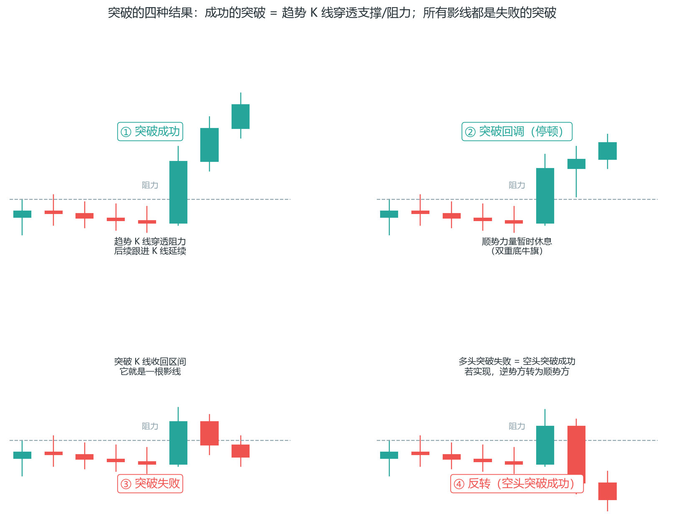

**突破后必有测试（L04A，市场对失衡的自我调节）**：突破发生、急速运动结束后，价格几乎必然折返回突破点——这就是测试。为什么必然发生？因为突破制造了失衡：

- **四批人同时陷入进退维谷**：空仓的多头（价格回落了，还敢重新做多吗？）、持仓的多头（敢继续持有、敢加仓吗？）、空仓的空头（突破可能失败，敢趁机做空吗？）、持仓的空头（有不赚不亏的机会，要跑吗？）。四批人各自决定"买还是卖"，票多的赢、票少的输——测试的结果由这四批人的共同决策产生。
- **测试决定突破能否延续**：测试成功（折返不破突破点、顺势方继续跟进）→ 行情延续；测试失败（折返过深、逆势方胜出）→ 突破失败甚至反转。所以 Ali 数据里的"回调深度"（回调 < 0.75R 亏损概率仅 10%，深度回调 > 1R 后 90% 变反转）正是测试的量化版本——**回调的深浅 = 四批人投票的结果**。
- **每次结果都不相同，市场充满不确定性**：没有固定的作法——这也解释了为什么"等第二波"（3.11 的 90% 概率）是比"追第一波"更聪明的选择：第一波是突破，第二波是测试完成后的确认。

**充分测试的量化定义（4 tick 窗口，Ali 闪卡）**：测试"充分"与否可以量化——价格达到目标后在 **-1 到 +3 tick** 之间停留 = 充分测试（测试方获得了它想要的）；**一旦超出 4 tick，测试无效**（要么失败测试、要么是新突破）。未充分测试的水平，市场通常会回头再测。**完美测试的后续**：突破点被精确测试到最小价格变动单位、且回调不超过或重叠突破点 = 完美测试，之后市场通常回调再次测试突破点（2nd Test）——如果第二次测试跌破突破点，突破买方很可能已失败（呼应上文"回调深浅 = 四批人投票"）。用法：等"充分测试"发生后再动手，别在测试进行到一半时抢跑。

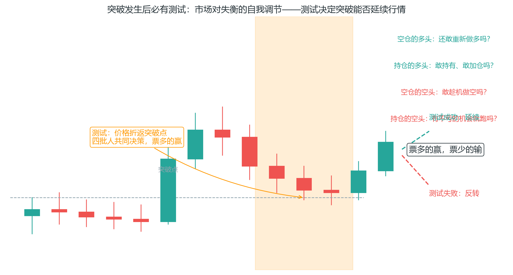

**80-20 法则：一切突破决策的总纲**（PA_Agent 文件 18）：把以上所有内容压缩成两条记忆：

> **区间中约 80% 的突破尝试失败——默认不相信突破，顺方向边界优于追突破。**
> **趋势中约 80% 的反转尝试失败——顺势突破（趋势恢复）更可信。**

这就是为什么 3.12 说"概率最低的三类（通道追单、末段突破、区间追突破）恰恰是新手最爱做的"。改变惯性需要：强突破棒 + 跟随 +（可选）缺口。三条里缺两条，默认假突破；两条以上成立，才考虑追。这张表背下来，突破类交易的方向就清晰了：**在区间里等边界反转，在趋势里等顺势回撤，别把两者搞反。**

### 3.12 十种最佳价格行为模式（概率排序）

Al Brooks 的缩写词典（附录 B）里藏着他对“哪些模式值得专门学习”的排序。本节把十种最佳模式连同概率底色一次讲清——它们是整本书信号库的“精华名单”，剩下的都是变体或噪音。

**信号线的四级可靠性排序**（市场诊断框架）：① 与交易方向**同向的趋势 K 线**（最强信号线）；② 标准反转 K 线；③ 短 K 线/内包线（需市场环境支持）；④ **反方向的十字星或趋势 K 线**（风险最大）。新手只做第一种：做多只选阳线信号棒、做空只选阴线信号棒——“在你希望的一方至少控制信号线之后进场，总是更优的选择”。

**模式一：趋势反转（约 40% 概率）**

- 两个组成部分：**TBTL（Trend Bar Then Low/Higher Low，趋势 K 后接回调低点）**——趋势 K 之后出现的一段走势（约 10 根 K 线、两段式），是反转的基础结构。
- 反转概率约 40%：不是"看到反转形态就反手"，而是"先等反转信号，不成则小亏"——约 60% 的交易是小亏损或盈亏平衡（小止损、快速止损）。
- 实战含义：反转交易是"低胜率、大盈亏比"游戏，必须用小仓位+紧凑止损，靠少数大赚覆盖多数小亏。
- 本书对应：第 2.3 结构突破 + 第 3.2 假突破的合体——TBTL 的本质是"趋势 K 后第一次失败"。

**反转的量化底色（Ali 突破白皮书 Rev+FT）**：模式一的“40% 反转概率”在白皮书里有更细的拆解——反转 K 线本身获得持续行情（FT）的概率约 33%（1306 根样本中 430 根）；一旦第二根 K 线收盘确认，即时 FT 概率升至 64%（但直接达 1R 仅 20%、2R 仅 9%，平均只走约 2.5 根 K 线）；**回调之后出现第二波段的概率接近 90%**（70% 与第一波等大、20% 是第一波的两倍）——反转交易的钱同样在第二波，不在反转那一下。**反转枢轴点**：80% 的反转枢轴点由结构 K 线 1 或其前一根形成，提前两根以上形成的大多失败；10% 的样本中 K 线 1 是内包线、未促成枢轴点，但这类结构 90% 获胜。**时间规律（与突破相反）**：开盘 9:30-10:05 的突破失败率 > 70%，但同一时段的反转结构几乎没有亏损交易（样本较小）——开盘追突破是陷阱，开盘做反转（顺势方的第一次失败）反而胜率高。

**反转确认需要几根 K 线（Ali 闪卡）**：判断"趋势已结束并反转"，具体数量取决于上下文——三档标准：**① 1 根巨大的趋势 K 线**，收盘位于极端位置；**② 2 根连续的大尺寸 K 线**，收盘价高于中点（看涨）；**③ 3 根连续的常规尺寸 K 线**，收盘价高于中点（看涨）。十字星场景例外：信号棒是十字星时，曾出现过需要 4 根连续 K 线才确认反转的案例——信号越犹豫，确认成本越高。

**二次入场与 60/40 规则（PA_Agent 文件 15）**：为什么模式一说"反转概率只有 40%"？因为**第一次反转尝试多数失败**——第一个反转信号经常被测试并失效，强趋势中尤其如此。所以 Brooks 的核心纪律是：**先等二次入场，再谈反转**。什么是二次入场？

- **趋势反转中的二次入场**：第一次反转失败 → 价格再创新高/低（或回测）→ 第二次反转信号。第二次通常更可靠（可靠性来自更多价格行为确认，不是形态名字）。
- **区间边界的二次入场**：第一次触及边界 → 回撤 → 第二次触及——第二次测试确认了该极点的有效性，反转通常更果断。
- **趋势线突破的二次入场**：趋势线第一次被突破经常失败（窄通道尤其如此），价格回到趋势线上方再突破——第二次更可能成功。
- **双顶/双底的二次入场**：第二次测试极点失败——比第一次测试更可靠。

**60/40 规则（Brooks 的结果分布统计）**：约 **60% 的交易是小盈亏**（小赚+小亏，相互抵消）；约 **20-30% 的交易产生大利润**（趋势交易）；约 **10-20% 的交易产生大亏损**（止损被打后市场反转）。真正的交易优势不在胜率，而在：**小盈亏 ≈ 0，大利润 >> 大亏损**。二次入场通过减少"小亏损"的数量改善整体盈亏比。两个误用要避开：60/40 不是"频繁交易的依据"，而是结果分布；也别忽略大趋势交易——利润主要来自少数大趋势单，不要频繁止盈。

**二次入场的时间窗口**：通常在第一信号后 6-12 根 K 线内出现（当前周期等待不超过 2 小时，即 24 根 5 分钟 K 线）；超过窗口未出现就放弃该思路。**二次入场失败后不再尝试第三次**——同一方向连败两次，说明结构判断错了，重新评估市场状态。

**二次入场价陷阱（PA_Agent 二元决策 §9.6）**：二次入场的“价格”本身也是信号——**如果二次入场价格明显优于第一次，可能是陷阱或原结构误判**。反过来，二次入场价格与第一次相同或略差，说明市场要求为更多确认支付成本，结构反而更健康。分界要清楚：边界/回撤处的计划型限价单挂更优价是正常操作（那是“等价格来找你”，不是二次入场）；H1/H2/L2 计数类二次入场若价格明显更优，优先等待或重判结构——别贪这个便宜。

**低质量信号棒的 K0 触发逻辑**（二元决策 §9.0）：当前信号棒（K1）质量低（十字星、doji、长外包棒）时不直接放弃——下一根 K 线（K0）可以“拯救”这笔：

- 顺势背景：若 K0 为顺势趋势棒且收盘突破 K1 极点（做多：收盘高于 K1 高点；做空：收盘低于 K1 低点）→ **K0 成为新的信号棒**。
- **止损与交易者方程必须以 K0 的极点为基准重算**（K0 高点上方 1 跳/低点下方 1 跳），不是沿用 K1 的极点——K0 通常更短、止损更小，方程更容易通过。
- K0 不满足条件就继续等，不强行入场；当前棒未收盘时，只能在检查单里写明 K0 触发条件，不能提前进场。

**模式二：最终旗形（Final Flag）**

- 定义：趋势末尾、突破失败后形成的最后一个旗形（第 3.9）。
- 关键统计：**最终旗形之后反转的概率约 40%**，且反转幅度常与趋势等长——它是"趋势衰竭的最后一个形态"。
- 用法：趋势已走出多段后出现旗形 → 别追突破，等旗形破位后的反向机会（配合 3.2）。
- 陷阱：最终旗形判断过早——"每一个旗形都可能成为最终旗形"，所以纪律是"只做破位确认后的反向，不做旗形内的提前单"。

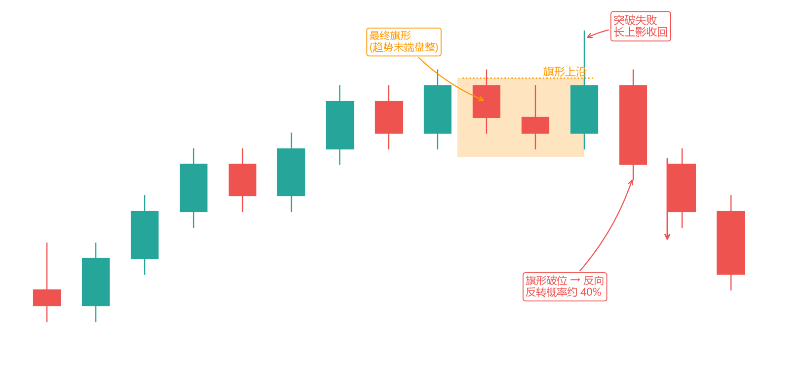

**模式三：突破（Breakout）**

- 精确定义：**趋势 K 线收盘超越支撑阻力**（实体收盘，不是影线插破）。
- 突破成功与否取决于"收盘 + 跟随"（3.11 的 FT 48%）；突破 K 的质量（大实体、放量、收盘远离）决定后续概率。
- 本书对应：系统三（4.5）的完整规则。
- Tefi 补充（L03A）：突破即急速（Spike），是"穿透支撑/阻力 + 收出趋势 K 线"的双条件；突破难以成功，须打破均衡——说服顺势方加入、逼迫逆势方放弃（详见 3.11 的机制底色）。

**模式四：高 2 / 低 2 旗形（H2/L2）**

- 高 2 = 双底变体：第一次低点（低 1）失败后形成第二个低点（低 2），第二个低点入场做多。低 2 = 双顶变体，镜像。
- 为什么有效：双底/双顶是"两次测试"——第一次测试失败方止损，第二次测试时对手盘更少。
- 本书对应：第 3.9 双底双顶 + 第 4.21 突破单模型一（H2/L2 顺大逆小）。

**H1/H2/L1/L2 计数速查（PA_Agent 文件 19）**：Brooks 的柱计数不是玄学，是精确的逐棒规则：

- **H1（High 1）**：上升趋势中第一腿回撤后，第一根突破**前一棒高点**的做多触发。**H2**：第二腿回撤后，再次突破前一棒高点。做空镜像：**L1**（第一腿反弹后跌破前一棒低点）、**L2**。
- **计数以"突破前一棒极点"的入场棒为准，不是数回撤根数**——每一腿必须能对应到具体 K 线。
- **Weak H1**：反弹至均线或结构位后突破前棒高点，但实体偏弱、上影长——除非 Always-In 方向明确 + 窄通道/微型通道 + 信号棒质量中等以上 + 入场棒有跟随，否则**等 H2**。
- **何时 H1/L1 可做**：强趋势/微型通道/紧凑通道的浅回撤（1-2 根）、Always In 方向明确、信号棒质量高、止损距离合理。
- **何时必须等 H2/L2**：MTR/主要反转后、楔形或三推后、趋势线突破后的回测、**交易区间边界第二次测试**、第一次信号棒质量弱。一句话：**弱趋势、宽通道、反转、边界交易中，H2/L2 明显优于 H1/L1。**
- **计数重置**：新 swing high/low 形成、Always In 翻转、强突破+跟随使原回撤结构失效——计数清零。
- **High3/Low3 = 楔形**：第三次同向推进若幅度递减，按楔形处理（文件 14），**不要当普通 H2 追单**；尖峰末端的 High3 警惕高潮。

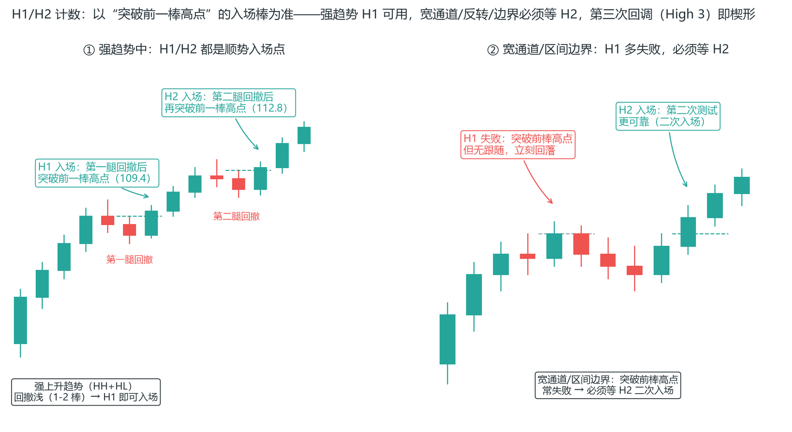

**模式五：楔形（三推）**

- 三推结构（3 次摆动）后突破趋势线的概率约 **75%**；楔形顶常有 3-5 条腿（推），腿越多越接近反转。
- 用法：楔形内不做追单（每一推都可能最后一推），等破位；破位方向与楔形倾斜方向相反（上升楔形向下破）。
- 本书对应：第 3.9 楔形 + 第 4.22 限价单模型二（P3 挂单）。

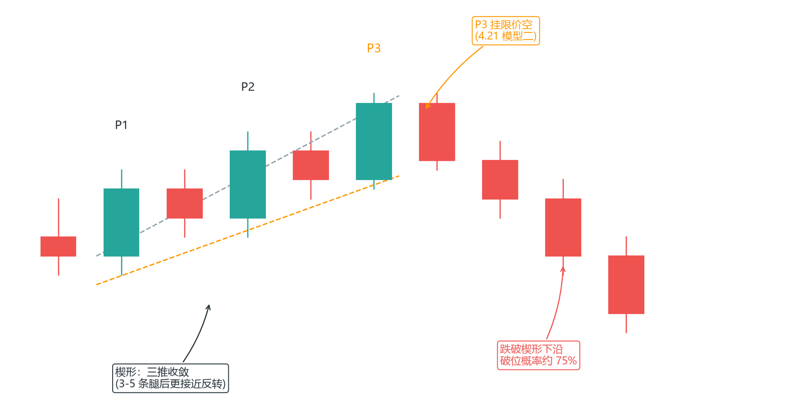

**模式六：通道（Channel）**

- 关键统计：**通道突破后延续成功的概率仅约 25%**——通道是"所有突破里最不可靠的"。
- 原因：通道内已有大量同向交易者，突破时这些获利盘集体兑现，反而压制延续。
- 用法：通道突破不做追单；通道本身是反向交易的地图（下沿买、上沿卖，见 2.7）。

**模式七：测量移动（Measured Move）**

- 定义：两段同向走势，**Leg 1 = Leg 2**（第二段长度约等于第一段）。
- 用法：Leg 1 确认后，Leg 2 的目标可以提前算——这是"目标位"的可编程估计（呼应 4.13 区间投射）。
- 变体：楔形测量移动、通道测量移动——都是"第一段长度投射第二段"。
- Tefi 补充（L10B）——等距运动的数学优势：在上升急速（Spike）之后的回调处做多，**以急速低点为止损、以原趋势极值（前高）为止盈，盈亏比约 1:1**；空头镜像（以急速低点止盈、以原趋势极值止损）。因为是上升急速，胜率偏向多头——**1.0 倍盈亏比的交易能有约 60% 胜率，是具有数学优势的选择**（期望 = 0.6×1 − 0.4×1 = 0.2，与 7.7 刮头皮的数学一致）。只要趋势强劲，在 50% 回调处取等距利润便有数学优势。
- 配套：**五大类磁体**（支撑阻力的"磁力位"，读图前先标出）：① 前波段高低点（含趋势极值、重要波段点）；② 区间的上下缘；③ 趋势线与通道线；④ 均线（EMA20）；⑤ 等距运动目标与 50% 回调。多数转折都发生在这些磁体附近。

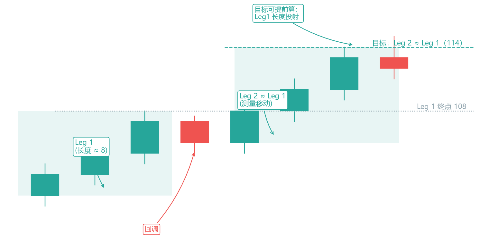

**模式八：区间反转（BLSHS）**

- 关键统计：**交易区间约 80% 的突破失败**（第 4.4 已讲）——所以区间边界的反转单（低买高卖）胜率天然高于追突破。
- 第二信号等待：区间内第一个反转信号失败后，第二个信号成功率更高（第二次测试理论，见模式四）。
- 本书对应：系统二（4.4）的完整规则。

**模式九：开盘反转（Opening Reversal）**

- 定义：开盘后 60-90 分钟内出现的反转（磁力位测试后）。
- 关键统计：开盘 9:30-10:05 的突破失败率 > 70%（3.11 的筛选器 3）——所以开盘反转是"高胜率反向"：开盘假突破 + 反转形态 = 强信号。
- 本书对应：第 1.9 时段（Kill Zones）+ 第 3.2 假突破。

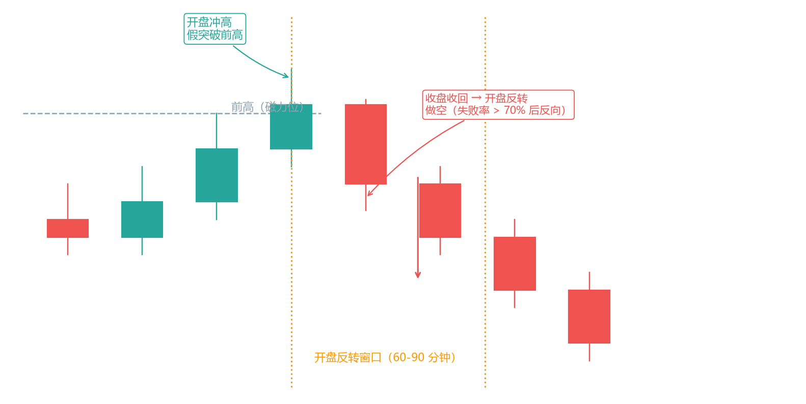

**模式十：磁力位（Magnet，BRN 附近）**

- 定义：计算机计算出的支撑阻力位（前高前低、整数关口、枢轴点），价格被"磁吸"——接近时加速、测试时停顿。
- 用法：磁力位附近不做追单（价格倾向先测试再决定）；磁力位是目标位（4.13 结构位）和入场区（第 2.4）。
- 注意：磁力位效应是"倾向"不是"保证"——价格可能被磁力位吸引测试后直接穿过（突破模式）。

**一句话记忆**：反转看 40%（趋势反转、最终旗形），突破看 48%（FT），楔形破位 75%，通道突破只有 25%，区间突破 80% 失败——**概率最低的三类（通道追单、末段突破、区间追突破）恰恰是新手最爱做的**。

### 本章小结

信号质量 = 背景 × 位置 × 形态，三者相乘，缺一个就是零。先看位置，再看形态。

假突破是最重要的信号——它建立在"止损被扫"这个最确定的机制上，是第 5 章 sweep 的前身。

pin bar/吞没/内包线，都必须在关键位上才有意义。

每个信号都要收盘确认 + 量价确认，别盘中抢跑。

信号 K 有质量高低：位置对是前提，形态质量决定起跑线；内包线是触发器不是反转确认，外包线方向看突破幅度。

突破的概率底色：FT 仅 48%，但第一波成立后第二波 > 90%——等第二波、避末段、控时段，胜率能从 76% 提到 86%。

突破的本质是打破均衡（趋势 K 线穿透支撑/阻力）；突破后必有测试——四批人共同决策、票多的赢，回调深浅就是投票结果。

真突破三条件：跟随 + 缺口 + 强势突破棒，缺两条默认假突破；失败的失败（突破失败后价格重回原方向）是高概率顺势入场。

80-20 法则：区间中 80% 突破失败、趋势中 80% 反转失败——在区间里等边界反转，在趋势里等顺势回撤。

楔形分两种：与主趋势相反的楔形是回撤（顺势入场），与主趋势相同的楔形是反转预警（≥20 棒）；抛物线楔形 = 高潮，禁追禁反手。

完整 MTR 有四组件（原趋势/趋势线突破/恢复失败/前极点测试失败），四件缺一不叫 MTR——第一次反转成功 35-40%，所以先等二次入场再谈反转。

60/40 规则：60% 小盈亏抵消、20-30% 大利润、10-20% 大亏损——优势在大利润 > 大亏损；二次入场（6-12 棒窗口内）减少小亏损，两次失败不试第三次。

H1/H2 计数以突破前一棒极点的入场棒为准：强趋势 H1 即可，宽通道/反转/边界必须等 H2；Weak H1 要实体弱+上影长；第三次回调（High 3）是楔形不是追单。

下一章把这些信号组装成完整的交易系统——光有信号还不够，你还需要止损、目标、仓位、和"什么情况下不做"。
