# 第 4 章 交易系统：入场与出场

> **阅读提示**：本章不是系统大全，而是回答一个问题：**给定市场状态（均衡/失衡），怎么从 E 和 R 推出该做什么、不该做什么？** 主线必读篇一（状态机）与篇二（出场，期望值的另一半）；篇三高级入场结构、篇四补充系统（ORB/均线趋势跟踪/配对交易）按需查阅；最后 4.29“一个交易日走一遍”把全部串起来，建议通读后再回到本篇。


上一章你有了信号——知道何时进场。但这里有个残酷的事实，先给你：

> 会看信号，不等于会交易。信号只是扳机，系统才是整把枪。

为什么？因为一笔完整的交易，远不止“进场”这一个动作。进场之后呢？止损放哪？目标看哪？下多大仓位？涨了一点要不要先跑？跌了要不要扛？这些问题，如果你没有事先写死的答案，那么每一次你都会在盘中的情绪里临时决定——而情绪里的决定，几乎都是错的。

这一章就是把“信号”升级成“系统”：一套你事先写死、可以重复执行、不依赖临场发挥的完整规则。

### 本篇导读：一章其实有四本书

这一章共 29 个小节（4.1-4.29），是全书最厚的一章（其他章平均不到它的三分之一）。为了不让你一上来就被淹没，把它分成四篇，彼此独立、可单独阅读：

| 篇 | 范围 | 解决什么 | 定位 |
| --- | --- | --- | --- |
| 篇一 系统与状态机 | 4.1-4.11 | 四个入场系统 + 状态机切换 + 仓位/目标框架 | 必读：最小系统的核心 |
| 篇二 出场：期望值的另一半 | 4.12-4.20 | 止盈、分批、保本、移动止损、完整生命周期 | 必读：期望值靠出场兑现 |
| 篇三 高级入场结构 | 4.21-4.25 | 突破单/限价单/always-in/外包/禁止清单 | 进阶：第一遍可跳过 |
| 篇四 补充系统 | 4.26-4.28 | ORB 开盘区间突破/均线趋势跟踪/配对交易 | 选学：实战后按需读 |
| 收尾串讲 | 4.29 | 一个交易日走一遍：状态机随时间切换 | 复习：概念变肌肉记忆 |

**建议**：第一遍只读篇一 + 篇二（配合第 6 章仓位公式），已经是一套完整可执行的系统；篇三是给这套系统加深度和鲁棒性的，等你觉得“信号不够用”或第二遍复习时再读；篇四是工具箱扩展——换三种“赚钱方式”的备选系统，实战 100 笔、主线验证通过后再按需选学。

## 篇一 系统与状态机（4.1-4.11）

### 4.1 信号不等于系统 【核心】

先想清楚一个区别。信号回答的是“这里能不能进”。但一笔交易要回答六个问题：

1. 现在什么状态？（背景）
2. 用什么信号进？（触发）
3. 止损放哪？（止损）
4. 目标看哪？（目标）
5. 下多大仓位？（仓位）
6. 什么情况不做？（过滤）

只解决第 2 个就下单，是赌博；六个都有确定答案，才是交易。

**系统的真正作用，不是帮你赚更多，而是帮你在情绪上头时不做蠢事**。规则写死了，盘中就不需要“思考”，只需要“执行”。思考留给冷静的盘前，执行交给机械的盘中。

这个区别怎么落地？你不需要六要素完美到“永远赚钱”——你只需要六要素具体到“没有临场决策的空间”。比如止损不能写“亏了就跑”，要写“放在 HL 下方 0.5×ATR”；过滤不能写“感觉不对就不做”，要写“数据前 15 分钟不开仓”。模糊的规则 = 给情绪留门，第 7 章的军规会反复强调这一点。

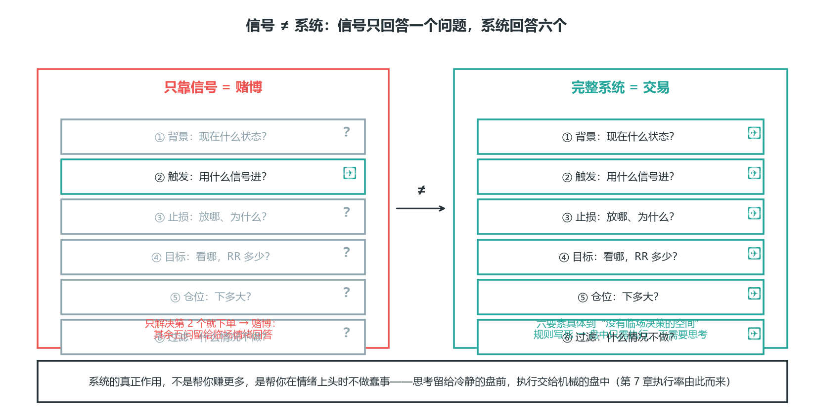

*图 4-1 信号 ≠ 系统：信号只答触发一问，系统六问全答——模糊的规则 = 给情绪留门，入场前逐条打勾*

### 4.2 一套完整系统的六要素 【核心】

假如你要把一笔交易交给一个不会思考的机器人执行，机器人需要你告诉它什么？至少六件事：背景、触发、止损、目标、仓位、过滤器。这六件事写下来，就是系统。

1. **背景判断**：当前趋势/区间，用什么结构判断——写死，不临场发挥。
2. **入场触发**：具体信号（假突破？锤子？吞没？）——写死。
3. **止损位置**：放哪、为什么。放结构外，不是固定点数（第 6 章有 ATR 法）。
4. **止盈/目标**：前高前低、风险回报比（RR = 潜在盈利 ÷ 潜在亏损；1R = 单笔止损的距离）≥2 才做（这是全书给新手的默认过滤器；4.13 的两级目标法里 TP1 下限可放宽到 1.0，但整单 RR 仍要达标，见 4.13）。
5. **仓位大小**：按风险百分比算（第 6 章）。
6. **过滤器**：什么情况不做（数据前、震荡、逆势、非活跃时段）。

**写下来才算系统**。脑子里的“感觉差不多”不是系统。把六要素写成一张清单，入场前逐条打勾——这是第 7 章执行纪律的基础；执行率的定义在第 8 章（“完全符合计划的交易占比”），而“计划”就是这张六要素清单。没有清单，就没有执行率，就没有验证，一切回到感觉。

**六要素清单模板**（写进你的规则书，每次入场前逐条打勾）：

- [ ] 背景：____（上升/下降/区间），HTF 方向 ____
- [ ] 触发：____（具体信号名）
- [ ] 止损：____（具体价位 + 依据）
- [ ] 目标：____（具体价位，RR = ____ ≥ 2）
- [ ] 仓位：____ 手（风险 ____%）
- [ ] 过滤：无数据事件 / 活跃时段 / 非连亏期

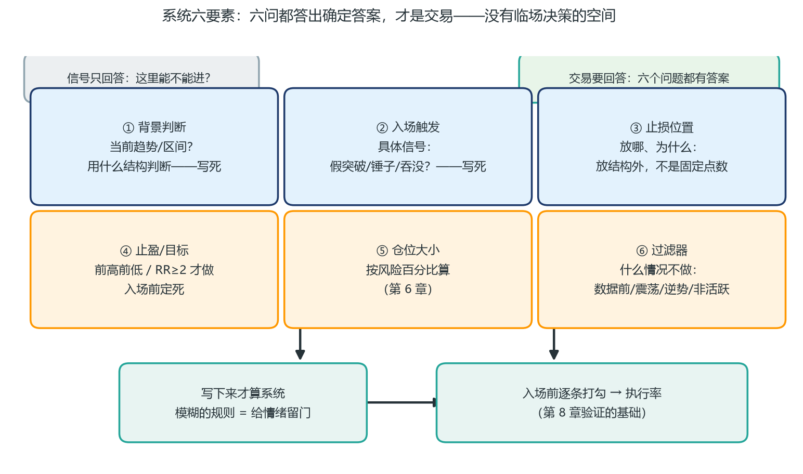

*图 4-2 系统六要素：六问都答出确定答案，才是交易——模糊的规则 = 给情绪留门，入场前逐条打勾*

### 4.3 系统一：趋势回调交易（最推荐） 【核心】

这是本书的默认系统，先给你一个洞察，理解它为什么是默认：

> 趋势回调是期望值（= 胜率×平均盈利 − 败率×平均亏损，4.12）结构最好的系统：顺势（站在惯性那边）、回调入场（止损紧凑）、目标远（盈亏比天然大于 2）。三个优势叠在一起。

**逻辑**：趋势会延续，回调是上车点。不做反转，只做顺势。


*图 4-3 趋势回调交易：入场 / 止损 / 目标*

看图理解这套系统的完整一笔：价格在上升趋势里（高低点依次抬高）。它涨到前高后开始回调，回落到一个位置——上一波上涨的起点、一个 HL 支撑区。在回调区，出现了一根锤子线（信号确认）。于是：

**规则（对照图）**：

1. **背景**：日线/4H 明确上升趋势（HH+HL 清晰）。
2. **等回调**：价格跌回最近 swing low 附近（回调到 HL 区）。
3. **信号**：回调区出现锤子/吞没/内包线突破（+量价三问）。
4. **入场**：信号确认后（图中标注的入场点）。
5. **止损**：回调低点（HL）下方——图中标注的止损位。为什么放这：如果跌破这里，说明“回调只是洗盘”这个判断错了，趋势可能真变了，你该认错。
6. **目标**：前高（HH）或 2R——图中标注的目标位。

**为什么止损紧凑是巨大的优势**：你的止损就在回调低点下方，离入场价很近，所以这笔的“风险”很小；而目标在前高，离入场价远，所以“潜在盈利”大。风险小、盈利大，盈亏比天然就好。这就是“回调入场”比“追高入场”高明的地方——追高的话，你的止损要放到很远的结构下方，盈亏比立刻变差。

**趋势初期的信号棒门槛：别嫌信号小（Brooks）**：趋势刚启动（尖峰阶段）时，**每一次小幅度回撤都是顺势入场机会——哪怕只是一根短内包线**。这个阶段不必等教科书级的锤子/吞没：在强顺势背景下，任何小幅回撤（哪怕一根短内包线）都是合格的入场信号。门槛放在"顺势 + 位置对"，不放在"形态大"；错过第一次就等第二次（高 2），别为了"更标准的信号"追涨。等趋势走完几段、回调变深（≥20 根）才改用交易区间思维（呼应 2.8 的 3 腿 20 棒）。

**回调 = 暂停：别只认锤子/吞没（Brooks，41B）**：趋势中的回调本质上只是“暂停”——在多头趋势中，它可以是空头棒、十字星、内包棒、顶部带长上影的阳线，**每一个都是更小时间框架上的回调**。所以本系统的信号清单不该只列“锤子/吞没”：任何回调表现形式 + 位置对（回调到 HL 区）都可以成为顺势入场点——这正是上文“别嫌信号小”的完整版。唯一的例外是回调过深（连续 3 根看跌 K 线，见下文 3-Bar PB 检查）：那是空头在反击，不是暂停。

**回调失效三分法**：趋势回调会失效，归根到底是“**趋势方不再能主导回调的深度和时长**”。过久（日内约超 20 根 K 线）说明卖方有足够时间重新挂单、趋势记忆在衰退；过深（超过趋势推进的 75%）说明买方已经无法守住自己的半场，重回原趋势极值的概率大幅下降；无尽回调则是又久又深、窄幅推进，等于“趋势方被慢慢磨死”。三者任一出现，把“回调”改按区间处理，别再用趋势回调系统硬接。

**三波段回撤（CPB）优先于普通单腿回调（YTC）**：同样在趋势里等回调，YTC 明确说 **3-波段回撤会产生高胜率交易**。机制：三波段回撤（A-B-C）把早期“抄反转”的人套在逆势单里，他们的止损离场恰好是趋势方的燃料；而单腿回调只是简单的获利回吐，被套订单流少。所以当图表出现“趋势推进 → 三波段回撤 → 回撤末端出现反向 PA”时，它比普通 HL 回调更值得做——识别上数清楚波次，别把两段式回调当成三段。顺势系统一因此可以加一条优先级：**CPB > 普通 PB**。

**错过趋势的补救**：趋势中途没上车时，等一根**十字星**——它意味着趋势暂停、更小级别是回调；连接十字星高低点，在十字星外侧挂突破单入场，目标至少看十字星整体的 1MM 或 2MM。这是比追当前价更稳的“中途入场法”。

**完整数字案例（把感觉变成精确）**：

- 入场 1.1090，止损 1.1065（25 pips = 1R），目标 1.1150（60 pips ≈ 2.4R）。
- 仓位怎么算见第 6 章，这里先记住：**先有止损距离，才有仓位大小**。

**真实案例：上证指数日线（2026 年 4-6 月）**——把上面的规则对到真实行情上：

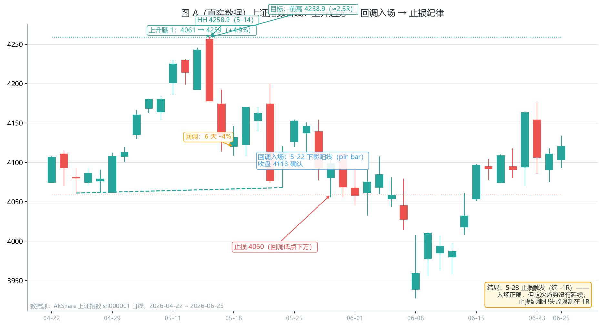

*图 4-1R 真实数据：上升趋势 → 回调入场 → 止损纪律（数据源：AkShare 上证指数 sh000001 日线）*

图里的每一步都对应前面的规则，拆开看：

1. **4061 起涨** → **4258.9 创 HH** → 上升趋势确认；
2. **6 天 -4% 回调** → 5-22 下影阳线（pin bar）在回调低点确认入场；
3. **止损放回调低点下方 4060，目标前高 4258.9**。

**注意结局**：这笔在 5-28 触发了止损（约 -1R）——趋势没有延续，但入场规则和止损纪律都是对的，失败被限制在 1R。这就是“系统对了也会亏”的样子：单笔结局随机，纪律保证随机不会失控。

**这套系统的三个常见错误**（写进你的复盘清单）：

1. 在“趋势”还没确认时（只有两三个高低点）就追回调——等结构清晰再做。
2. 回调到 HL 区但信号没出现就提前进场——等确认，别抢跑。
3. 把“HL 区”画得太宽或太窄——回调区应该基于结构（前低区域），不是拍脑袋画一条线。

**阅读导航：从这里起是系统一的进阶细节**——回调生命周期、SPB（小幅回调趋势）、3-Bar PB 等，是给系统一加鲁棒性的补充规则；第一遍读只需记各段加粗结论，执行底线就是上面六条规则 + 图 4-3。

**首次回调序列：趋势回调的“生命周期地图”（Tefi L17A）**：趋势从发起到结束，理应是顺势方动能衰退、逆势方愈发进取的进程。把各类回调按“强度 × 发生顺序”排列，就得到首次回调序列——它告诉你“现在趋势走到哪一步了”：

1. **趋势初期的回调应该弱而浅**——是为引发趋势延续的旗形；只有到了末期，回调才变得又强又深（未端旗形将导致大型趋势反转）。
2. **序列的典型推进**（上升趋势版，从左到右是趋势的衰老过程）：

   强势阳线（实体大、影线短）→ 实体变短、上影线变长 → 与前一根 K 线重叠变多 → 十字星 → 出现阴线 → **高 1（一推回调）→ 高 2（二推回调，持续 5-10 根）→ 高 3（三推/楔形回调，持续 5-15 根）** → K 线乖离均线超过 20 根后终于触及均线（**20 gap bar**）→ 开始有 K 线收盘在均线另一侧 → 整根 K 线在均线另一侧 → 市场进入宽幅区间、多空势均力敌。
3. **首次回调序列的实用价值**：任何类型回调的第一次发生即“首次回调”——**首次反转尝试倾向失败，原趋势极值倾向被测试**。所以：① 趋势初期的首次回调（高 1）是最值得交易的顺势回调（对应 4.3 系统一的入场）；② 当回调开始加深、出现高 2、高 3，说明趋势进入中晚期，回调系统的仓位与目标要相应收紧；③ 当 K 线开始收盘在均线另一侧，趋势回调系统应当停止做多，转入区间思维（4.4）。
4. **序列不保证逐一发生**：图表千万化，项目可能重叠、跳项、顺序颠倒——它是“模式化分析图表时的参照”，不是自动执行的清单。


*图 4-4 首次回调序列：趋势的生命周期 = 顺势方动能衰退、逆势方愈发进取的阶梯*

**20 gap bar（均线缺口）的两种均线建仓方案**（L17A，配合 4.10 均值回归）：

- **方案一：20 gap 触及均线入场**——K 线乖离均线超过 20 根后第一次回触均线，顺势入场，止损放该 K 线外侧。适合趋势早期（乖离是强势的证据，回调到均线是顺势方的重新上车点）。
- **方案二：收盘破均线后的区间单**——K 线收盘跌破均线后不再顺势做多，等待测试均线失败后做反向（趋势末端的均线是磁体：第一次折返通常失败、原趋势极值倾向被测试）。

**小交易区间的 7 步回调设置（Ali：可交易的回调模板）**：这 7 步不是仪式，而是一条“**买方先耗尽、卖方再重新进场**”的证据链——先确认趋势背景，再看突破失败、买方高潮、停顿、诱多，最后用看跌内包 K 线作为卖方重新掌控的信号（看跌趋势版，多头对称）：

1. 看跌趋势（背景确认）；
2. 多头突破出现但跟进差（突破失败）；
3. 出现 2 根连续多头 K 线，其中至少一根是高潮型（买方耗尽）；
4. 停顿 2 次更佳（暂停让卖方重新进场）；
5. 出现单根多头趋势 K 线（最后的诱多）；
6. 出现看跌内包 K 线（信号）；
7. 内包线低点下方入场，止损在内包线/母线高点上方。

**3-Bar PB 检查（Ali）**：回调通常 1-2 根 K 线——**一旦出现 3 根连续看跌 K 线回调，说明看涨方弱势**（正常回调不该这么深），空头会直接反向操作。顺势回调系统（本系统）看到 3-Bar PB 时：不做多，先等第二次机会或直接转向。

**南桥版回调硬过滤（信号 K 一致性与背景过滤的执行细节见 4.21 模型一）**：再加一条 4.21 没有的——**回调中出现强势反向趋势 K（大实体逆势 K 线）禁止入场**：它说明回调正在升级为反转，不是上车点。

**等待延续（Ali）**：动量仍在有利方向 + 对方出现弱信号 K 线（如十字星）= 高概率短线机会——顺势方用对方“想反转却反转不动”的犹豫 K 线进场，比追强信号更划算（呼应 3.12 信号线四级可靠性排序的第四级）。

**追赶趋势（Chasing）的三条件（Ali）**：没有早期信号、或市场多次未能反转时，可以等新趋势开始后加入——追赶入场的三个硬条件：① **两个连续的强势收盘价在 EMA 之上（做多）**或在 EMA 之下（做空）；② **K 线不能太大**；③ **入场点不能离 EMA 太远**。良好背景（完成的逆转模式或趋势恢复模式）是加分项。三条件缺一就是“追高”，不是“追赶”。

**EMA 顺势买入的停止条件（Ali）**：做多 EMA 回调的前提——**大多数 1 分钟 K 线（至少连续约 10 根）位于 1 分钟 EMA20 之上**，且多头趋势处于紧密通道中；回避弱买入信号 K 线或卖出信号 K 线；可以买入两腿回调至 EMA 以下。

**何时停止买入（三个信号，出现任一即停）**：

1. **出现 3-4 根连续强看跌 K 线**——要买入必须等买方建立强的 H2 回调 K 线；
2. **EMA 失去上升斜率、变得水平**；
3. **出现更低低点**——此时市场要么看跌趋势要么交易区间，不再处于看涨趋势。

**先理解 SPB 为什么值得专门讲（机制总纲）**：SPB（Small Pullback，小幅回调）不是“一种形态”，而是“卖方不敢动”的直接证据。强趋势里回调只有 1-2 根 K 线、幅度极小，说明三件事同时成立：① **持仓者不卖**——没有获利了结压力，趋势的浮盈没有在回调中兑现；② **空头不敢进**——逆势入场止损太近，风险收益比差到没人愿意做；③ **追高者愿意在任何微小的回调位进场**——买盘在任何价格都存在。三股力量叠加，让 SPB 趋势的“惯性”远大于普通趋势：**回调浅不是偶然，是卖方集体放弃抵抗的结果**。理解了这个机制，下面每条规则都能从“卖方为什么不敢动”推导出来——SPB 交易法的核心是“卖方不敢动时顺势多吃”，SPB 失败特征的每个维度都在测“卖方敢不敢动了”。

**SPB 趋势的确认（Ali：H1/H2 反转 K 线）**：回调度小并不意味着该价格走势属于可靠的小幅回调趋势——**可靠的小幅回调趋势需具备收于高点的 H1 回调和 H2 回调多头反转 K 线**。当某段价格走势虽呈现小幅回调，但 K 线带有突出的影线且多数未能收于高点时，该走势更可能处于交易区间内，而非小幅回调的多头趋势（SPB = Small Pullback 小幅回调：微小缺口 + 强劲收盘，见 11 章术语表）。为什么收于高点这么关键：收于高点的回调棒说明买盘在回调一结束就立刻接管，卖方连一根完整的回调 K 线都没能守住——这是“卖方不敢动”在单根 K 线上的微观证据；带长影的 K 线则说明买盘接得犹豫，趋势的一致性已经在打折。

**SPB 早期诊断三问（Ali）**：回调刚出现时，用三个问题判断它是不是 SPB：

1. **良好背景？**——趋势性的 TRD（Trading Range Day 交易区间日，4.7 详述）或 EG（衰竭缺口，4.5），随后出现大 TR（Trading Range 交易区间）；
2. **PB 是否较小？**——尽管存在许多十字星、影线和反转形态，但只要回调小、且突破后又出现其他缺口，即使反弹力度较弱，也可能是 SPB 趋势——此时突破将成为 BR 方的机会；
3. **BRs 是否通过止损获利？**——如果没有，则很可能是 SPB。

**为什么是这三个问题**：三问其实在测同一件事——“卖方是否真的不敢动”。① 没有强背景（TRD/EG）就没有趋势惯性，回调浅可能只是波动率低，不是卖方放弃；② 回调不小（哪怕形态上像 SPB），说明有真实的卖压，趋势的一致性已经打折；③ 最重要——BRs（逆势的空头）如果能靠突破止损获利，说明逆势“有肉吃”，卖方会源源不断地来，SPB 的浅回调就不可持续。三个问题都指向“卖方”这一个变量，而不是形态本身——这就是“SPB 是卖方行为的投影”的用法。

**跨时间框架验证**：5 分钟图上出现小幅回调（1 根 K 线），但更高时间框架（如 15 分钟图）上没有回撤信号——那才是 SPB。**SPB 趋势中禁止剥头皮交易**（波段波动通常无法提供足够的剥头皮操作空间）。为什么禁止剥头皮：SPB 的波动集中在趋势方向上（一波接一波的推进），回调段又浅又短——剥头皮需要的“来回波动”在 SPB 里根本不存在，做剥头皮等于在自己最没有优势的维度上和市场对赌。

**SPB 交易法（Ali）**：回调幅度小因此逆势方向的风险也小——市场不太可能大幅逆势而行；但趋势强，小幅回调是强劲的趋势形态，其持续幅度通常超乎预期，回报可能巨大。**操作**：一旦确定是 SPB 趋势就随时入场；若入场后市场立即逆势而行，请分批建仓；利用小幅回调加仓、实现平均成本上移；持有核心仓位以进行波段操作或实现测量移动目标；每次回调时增持核心仓位，并在新突破后日内了结新增合约。**为什么这套操作成立**：SPB 的风险收益结构天然不对称——逆势风险小（卖方不敢动），顺势空间大（趋势惯性在），所以“随时入场 + 分批加仓”是比“等完美回调”更优的选择：等完美回调的代价是错过，而 SPB 里每一根浅回调 K 线都是加仓点。

**SPB 失败特征（Ali）**——什么时候怀疑 SPB 趋势不行了，三个维度看：

- **时间维度**：约 20 根横盘 K 线后，更可能形成交易区间而非趋势；任何趋势中出现 3 段以上连续走势后伴随 20-30 根横盘 K 线，40% 概率发生主要趋势反转且成功（另有概率出现反转尝试，构成反向剥头皮机会）；
- **形态维度**：多头反转不强（上涨波段多次犹豫、楔形熊旗、缺口未关闭）；**小幅回调后涨趋势在初始抛售后被跟进时，通常反转向下**；
- **动能维度**：缺乏跟进——多根小型 K 线、多根内部 K 线重叠、没有或极少出现突破先前 K 线、出现形成新小型突破缺口的长影线。

**为什么这三个维度能提前报警**：SPB 的生命线是“卖方不敢动”，所以它的死法也必然是“卖方重新敢动”。时间维度：横盘 20 根 = 卖方开始在区间挂单、波动被重新定价——趋势的记忆在衰退；形态维度：反转 K 线不强力、缺口没关闭 = 买方也在犹豫，市场不再是“一边倒”了；动能维度：没有突破前 K 线的 K 线 = 买方不愿意为新价位付钱，惯性消失。看到任一维度，就说明“卖方不敢动”这个假设开始动摇，顺势单要收紧或直接离场——别等三个维度凑齐。

另注意：昨日看跌趋势仍可能影响今日价格走势。

**首次暂停小 HL（或小 FTW，Ali）**：强势突破后出现的**第一次暂停**（十字星或小型反向 K 线收盘、随后形成小幅更高低点）是可靠的高概率入场——理念是尽快加入一个强大的突破：新的强势买盘刚刚形成，市场不太可能再次深测试突破起点。**在暂停条收盘时入场**（入场早于等 H2，代价是止损略宽）；注意若前期已有多次以盈亏平衡或小幅亏损离场的机会，市场不太可能再次回测该位置——该位置已被测试得足够多次，直接进场。

**3 根连续 K 线回撤 = 趋势转变的开始（Ali）**：小型回调的牛市趋势常出 2 根 K 线的回调——3 或 4 根 K 线会增加形成紧凑交易区间或交易区间的概率（呼应上文 3-Bar PB）。部分交易者允许 1 根 K 线的回调但不接受 2 根，会在 2 根以下出场。

**为什么 3 根这么关键**：若出现三根 K 线形态，特别是至少两根 K 线收于低点附近时，随后很可能出现大幅上涨和下跌，因此至少会有两波向下走势——许多多头会在那三根 K 线形态时离场，许多空头会在高点上方设置卖出限价单，多头和空头都会在其低点下方设止损卖单。2 号 K 线是 1 号反转的跟进，3 号 K 线则是入场点的信号。

**回调、修正还是趋势反转？（基于百分比和回调势头，Ali）**：**最高 5% 是回调；超过 10% 属于修正**（反转需要至少一个双重底）；**20% 属于看跌的趋势**（反转需要底部形态的形成）。动量规则：如果修正幅度过大且过快，通常不会在未先形成通道的情况下反转上升——通道为买价水平提供构建买入压力区的机会；**动量决定修正浪是否会沿着突破方向走出 2 波或更多**。

### 4.4 系统二：区间边界交易 【核心】

**逻辑**：区间=供需平衡，边界反复被测试。在边界做反向。

**规则**：

1. **背景**：清晰横向区间（至少触边界 2 次）。
2. **入场**：价格到区间上沿+出现看跌信号（或假突破上沿）。
3. **止损**：边界外。
4. **目标**：区间中线或下沿。

**注意**：区间交易最怕区间被打破——一旦出现“强势位移突破边界”（大实体冲出去+放量），立刻放弃区间思维，因为区间已变趋势。

**区间里赚的是“边界回归”的钱，所以别贪**：到中线/边界就落袋。区间目标有限，你想吃一整段趋势，结果往往是区间突然破了、你被套。区间交易的纪律是“不贪”——它的盈利结构决定了：单笔赚不多，靠的是高胜率（= 盈利笔数 ÷ 总笔数）+ 小止损，错了马上走。**区间胜率打折**：原本约 60% 胜率的 setup 放进区间里，胜率会降到接近 50%——因为区间内多空都有合理理由，信号被“两边都成立”稀释了。所以区间内不要追高胜率信号，按边界反向操作。

**怎么判断“区间被打破”**：不是“插破边界”就是打破，而是“收盘站稳边界外 + 放量 + 大实体”三条件。插破边界又收回 = 假突破（第 3.2），那是区间交易者的朋友（反向入场信号），不是敌人。

**同类边界逆势的优先级：BOF ＞ TST（YTC）**。同样是逆着边界做，假突破后反手（BOF，Breakout Failure）和单纯测试边界（TST，Test）强度不同：BOF 套住的是刚突破的多头/空头，他们的止损离场订单流更集中、更“被迫”；TST 只套住逆势追单者，订单流弱一档。所以区间边界出现“插破又收回”时，优先做 BOF；只到边界没插破，做 TST 要降级/更小仓。这个优先级是从“谁被套、谁的止损成为燃料”推出来的，不是凭感觉。

**Ledge（平台/岩架）与磁吸效应（Ali）**：当市场在短期内对同一价格水平测试 **4 次或更多次却未能突破**，该水平就形成一个平台（Ledge）——测试点（顶部/底部）出现 3-4 个或更多时，该水平成为**磁吸位**（测试次数越多，磁吸越强，价格总被“吸”回去再测一次）。两个操作含义：① **从平台边缘（或任何长期趋势线阻力）发起的突破通常受限**——价格会很快回撤至平台区，突破前先默认它是“无燃料的尝试”（呼应 3.11 的 80-20 法则：区间里约 80% 的突破失败）；② **利用小平台提前入场**：预期平台突破时，沿预期突破方向提前入场（不必等突破发生）、预期回测平台区域再补仓——前提是其他价格行为原因支持入场（若平台下方存在支撑位，成功率更高）。**平台测试次数的量化**：3 次测试的平台功能更像双顶/双底（DT），三推平台作为支撑的可靠性较低；**至少 4 次测试才视为有效平台**。

上面两条是规则，下面用真实 K 线把“假突破 → 区间被打破”的完整剧本看一遍（失败例）：


*图 4-2R 真实数据：区间突破失败 → 下沿破位 → 加速下跌（数据源：Binance BTCUSDT 5m K 线）*

**这张图要读出三件事**：

1. **突破要确认：一根大阳冲出去 ≠ 有效突破**。20:00 突破上沿 65099、冲高 65238 的那根大阳，只满足了"大实体"——**量（V=55）没放大，随后三根 K 内跌回区间**，就是"插破边界又收回"的假突破（上文三条件缺了"收盘站稳 + 放量"）。**突破交易的入场点不是"刚突破"，而是"突破后的回踩确认"或"跌回后的反手"**（呼应 4.5 突破生命周期）。
2. **区间假突破是反向信号，不是噪音**。上沿假突破（插破又收回）恰恰说明上方卖压真实存在——区间交易者把它当"朋友"：回落后价格大概率去测下沿，20:35 跌破下沿 64959 就是第二信号（呼应 3.11 的 80-20 法则：区间里约 80% 的突破会失败）。**假突破后的正确动作：等破位方向，而不是追原突破方向。**
3. **破位后的量度与"快"**：区间高度约 140 点，破位后最低 63806（距突破高 -2.2% ≈ **区间高度的 10 倍**）——**量度目标（=区间高度）只是最小目标**，本例破位加速走出了远超 1 倍的幅度，别在"刚够 1 倍"时急着抄底；21:30 放量下杀（V=310）+ 22:40 反抽无力（到 64888 就停下） = 破位有效，反抽位是**逃命点/新空头入场点**（呼应 4.4 边界三步法：边界用于识别位置和目标，止损仍按结构失效位设置）。

**怎么把这张图变成规则**：横盘区间出现上沿假突破 → 不追突破，等跌回区间后的反应；跌破下沿 + 放量 → 顺势做空（止损放下沿上方）；反抽回区间下沿/中轴 = 逃命点/加仓点；目标先看 1 倍区间高度，破位加速则用移动止损让利润奔跑（呼应 4.15）。

**Brooks 的区间玩法（BLSHS）**：区间交易的教科书动作是 BLSHS（Buy Low Sell High Scalp，低买高卖刮头皮）：多头在区间下半部分买入、上半部分获利了结；空头反过来。下面几条是 BLSHS 的补充：

- **第二腿陷阱**：交易区间里约 80% 的突破会失败（3.11 的 80-20 法则）——特别是区间已有一段趋势后，价格在低点附近再破位（第二腿），弱势交易者在此卖出，恰恰是底部。区间里的“突破”多数是陷阱，别追。
- **Rose 的区间突破判断**：区间突破不是“数第几次触边”，而是**判断控制权在哪一边**。区间内先完成 3 次多头腿和空头腿，是为了确认多空都充分表达过；价格被控制在区间上半区，说明买方每次都能把价格推回自己一侧，控制权偏多；接下来看另一方尝试重新掌控价格是否失败——失败方就是被证伪的一方，顺势入场方向由此确定。入场挂趋势 K 线上方，止损放在逆势方失败的位置，目标可看两段上涨、区间 1MM、AB=CD 或突破腿 1MM。
- **TTR 不交易**：Brooks 把紧窄的交易区间叫 TTR（Tight Trading Range）——它是限价单市场（上下沿都在成交），趋势交易者在这里没有优势。看到 TTR，最好的操作是不操作。
- **真空效应（磁铁）**：区间顶/底附近若出现强同向 K 线（如顶部一根强牛市棒），价格常被“磁吸”穿越区间，直接冲向下一个关键位——区间边界不是墙，是磁铁。
- **Brooks 的区域划分（买卖区域的精确刻度）**：TR 的**卖出区域在 TR 上部 1/3**（空头希望在此卖出），**买入区域在 TR 下部 1/3**（多头寻求在此买入）——这是 BLSHS“上半部分/下半部分”的精确刻度：中间 1/3 是无人区，价格行为接近随机，不交易（呼应下文“任何时段的区间中间 1/3 区域都不交易”）。
- **反趋势剥头皮的回调深度门槛（Brooks）**：在区间或通道里做反趋势剥头皮，先量“回调的深度”——**回调幅度至少要是头皮目标的 2-3 倍才值得进场**（Emini 若头皮目标是 4 点，先等近期回调走出 8-12 点再考虑做空/做多；欧元兑美元想要 20 点头皮，先等 40 点反弹）。逻辑：反趋势是逆着主流方向抢短线，没有足够的反向位移做燃料，价格根本没有“回摆”的空间；回调越浅，顺势方随时可以把它吞回去。这条与 4.13“止损距离超过区间宽度 10% 就放弃”同源——都是“空间不够就不进”的量化版。

**急赴磁体：把磁吸变成入场（Tefi L15）**：上面“真空效应”告诉你磁体存在，急赴磁体（Rush to Magnet）把它变成一笔可执行的区间剥头皮——区间内出现第二推陷阱、价格即将测试区间边线（磁体）时，顺势抢进赚短小利润，四步：

1. **收线位置距区间边线足够近**（参考：剩 1/4 区间高度时考虑入场；参数可调，不是硬规则）；
2. **以止损单或市价单进场**——不是限价等待，“等回踩”常错失，因为磁体常以急速方式到达；
3. **止损于前一个波段之外或区间边线之外**；
4. **止盈于所预期急赴的磁体**——目标就是磁体本身，到了就走，不贪。

**理想要件**：① 收线位置距离磁体足够近；② 前赴磁体的动能足够流畅（连续趋势 K 线、无磨蹭）。注意：这不是 Al Brooks 明确提倡的作法（区间剥头皮的进阶变体），新手先掌握本节主流程（BLSHS + 边界三步法），熟练后再考虑；磁体被触后又磨蹭接近，是动能不佳的信号，别硬追。

**先理解区间为什么能交易（机制总纲）**：区间 = 供需在这个价位带达成平衡——上方有人愿意卖（上沿阻力）、下方有人愿意买（下沿支撑），且两边的量足以把价格按在带内。边界之所以反复有效，是第 2.4 的机制：**每次测试都让更多人在边界留下成本和止损，人越聚越多，边界越“实”**。区间交易的利润来源是“价格偏离边界后的回归”——从边界出发、朝区间内部走是大概率事件，因为边界聚集的挂单会把价格推回去。理解了这个机制，下面每条规则都能推导出来：为什么只做边界不做中间（中间没有聚集，价格行为接近随机）；为什么 80% 突破失败（边界挂单太多，突破要先消耗它们，多数消耗不完）；为什么区间密度决定玩法（密度 = 边界的可靠程度，可靠程度决定你能不能把止损放上去）。

**区间识别：先对号入座**（PA 震荡区间）——以下特征满足越多，判定置信度越高：

- **结构**：清晰上下边界（各 ≥2 次测试）；波段高点没有系统性抬高/降低；K 线重叠明显（≥50%）；价格来回穿越均线（≥3 次）。
- **K 线**：实体普遍较小、影线上下交替；外包/内包棒频繁（犹豫与收敛）；趋势棒只出现在边界附近而非持续出现。
- **时间背景**：常出现在重要数据公布前；多是长程结构窗口趋势中的停顿——**先确认大背景，别把大趋势中的小回调当区间**（呼应 4.7 判定树）。

**区间密度：先测紧凑度，再测 CV**（两个量化指标，顺序使用）：

1. **紧凑度 = 区间宽度 ÷ 平均波段幅度**：<25% = 铁丝网（不交易，等突破；其中 <15% 为极紧凑铁丝网，最高质量“不交易”信号）；25%-35% = 过渡区（只等突破，不做边界 fade）；≥35% 进入下一步。
2. **变异系数 CV = 最近 10 个波段幅度的标准差 ÷ 均值**：<0.3 = 高密度（边界清晰、波段均匀——仅顺方向一侧在边界刮头皮）；0.3-0.5 = 中等密度（降频，只做边界处最强信号）；>0.5 = 低密度（边界不可靠——只在边界等突破信号，中部不用限价单）。

**绝对规模下限（PA 笔记）**：紧凑度和 CV 都是相对度量，还差最后一道绝对门槛——**区间高度 ≥ 最小刮头皮目标的 2-3 倍，且 ≥ 平均棒高的 2-3 倍**，区间才值得交易。区间再“高密度”，如果整体太小（高度只够刮一次头皮、或只有一两根棒高），从边界到对边的空间装不下一次完整往返，止损和目标挤在一起，盈亏比又塌回 1 附近（呼应 4.13 止损距离超过区间宽度 10% 就放弃——同一个道理：空间不够就放弃）。与 4.7 的窄幅日（波幅 <10 点）互相印证：小到一定程度的市场不是“可以精细操作”，而是“空间不足，别进”。

判断优先级：**铁丝网优先于 CV**——先看紧凑度，再看 CV；低密度和铁丝网的处理优先于其他一切判断。

**铁丝网"默认不交易"的五个可交易例外**（每个都要能逐条说明才下单）：① 价格接近**清晰区间边界**（不是中部）；② **一方明显被套 + 强入场棒跟随**（被套方止损回补是燃料，呼应 4.24）；③ 铁丝网后的**尖峰级突破 + 跟随**（不是普通突破）；④ **第二次边界入场且止损很小**（第一次失败后边界被再次验证，止损空间小才值得）；⑤ 顶部/底部**短 K 线刮头皮**——仅限方向明确的一侧：direction=bearish（direction = Brooks 的方向判定，即 Always In 在哪一侧，4.23 有完整清单）时评估上边界做空、bullish 时评估下边界做多，方向中性（neutral）就 wait。五个例外都不满足，铁丝网就是不交易环境（呼应 2.8）。

**为什么密度决定一切**：铁丝网（紧凑度 <25%）为什么不能交易？因为区间窄到这种程度，从边界到对边的距离（潜在盈利）和从边界到止损的距离（潜在亏损）几乎相等，盈亏比 ≈1——而窄区间里的价格行为接近随机游走，没有统计优势，盈亏比 1 的游戏长期是亏的（点差/佣金等成本会吃掉利润）。所以铁丝网只能等突破——突破才带来“方向”信息，盈亏比才重新拉开。CV 的含义同理：高密度（波段均匀）说明边界是由大量真实成交定义的，每次测试都“实”，把止损放边界外是安全的；低密度（波段长短不一）说明边界可能只是少数异常波段的产物，测试不可靠——把止损放在一条“虚”的边界外，等于把止损交给噪音（第 5.16 雷神的原话：不了解流动性，你的止损就是流动性）。

**边界三步法**（边界是区域，不是线）：

1. **标记所有波段极点**；
2. **验证有效性**：上/下边界各 ≥2 个波段极点在此价位附近，验证越多越可靠；
3. **设定边界区域**：由多次极点、尾线刺穿和收盘反应共同定义——只用于识别位置和目标，**不用于设置止损**。

高质量边界（刮头皮首选）= 测试 ≥3 次 + 测试时价格反应明显 + 区域窄；低质量边界 = 只有 1-2 次测试 + 影线穿透边界 + 区域宽。

**突破前兆**（区间交易的高级技能）：

- **成功 4 信号**：连续 3-5 根同向趋势棒（尖峰级动能）；突破发生在区间末端（憋了很久）；均线开始跟随突破方向倾斜；突破后立即出现测试且测试成功。
- **失败 5 信号**：突破后无尖峰跟进、价格陷入犹豫；突破时出现外包棒（犹豫后反向）；突破后立即被拉回区间内部；**在区间中间位置突破**（通常不是真突破）；突破 K 线长影线小实体（动能耗尽）。
- **突破失败陷阱**：突破后立即出现反向尖峰——区间交易最常见的陷阱。正确做法：**等突破测试**——测试成功且方向与 direction 一致 → 顺势入场；测试失败 → 仅作 breakout_failure 诊断，不反手逆势。

**区间内支撑/阻力的可靠性排序**：波段极点（最高，真实成交密集区）> 均线（与波段极点重叠时可靠性大增）> 趋势线（主观画线，中等）> MM 目标（磁铁位）> 缺口（中低；缺口在边界附近时该边界意义增加）。

**时间因素：中间时段 + 中间位置 = 不交易**。低波动时段（如美盘中午 12-14 点）的区间边界反弹概率更低；任何时段的区间中间 1/3 区域都不交易——只在“边界附近 + 高波动时段”交易。

**区间止损与止盈细则**：标准止损 = 信号棒极点外 1 跳；**止损距离超过区间宽度 10% → 放弃或等更小信号**；铁丝网不用边界外止损——等突破后以突破棒极点外 1 跳。止盈 = TP1 取区间宽度 50% 附近有结构支撑的位置，TP2 取对边/MM。

**铁丝网突破后的等距移动（PA 震荡区间）**：铁丝网之后通常会有一个等距移动——突破后价格朝一个方向运动的幅度，大约等于铁丝网之前那个波段的幅度。用途：铁丝网突破后别只盯着“突破点 + 区间宽度”，先看铁丝网之前那个波段的长度——那是更直接的 MM 候选（呼应 4.13 的 MM 四类公式）。

**区间陷阱速查**：把区间小波段当趋势（前一波段的“趋势”不能预测下一波段）；在区间中间追单（止损与回报空间都极小）；把刮头皮做成波段（区间里赚的是“确定的 20%-50%”，贪波段会撞上 80% 突破失败，3.11）；低密度区间频繁交易；扩张三角形里交易。

**例外**：连续两天低波动区间 → 第三天开盘尖峰突破概率增加；**边界与均线重叠 = 高概率刮头皮位**。


*图 4-5 区间密度判定流程（左）：紧凑度分级 → CV 分级；边界质量对比（右）：高密度多次测试 vs 低密度模糊边界*

**真实案例：区间 → 假突破 → 真突破（上证指数日线，2025 年 8-11 月）**：

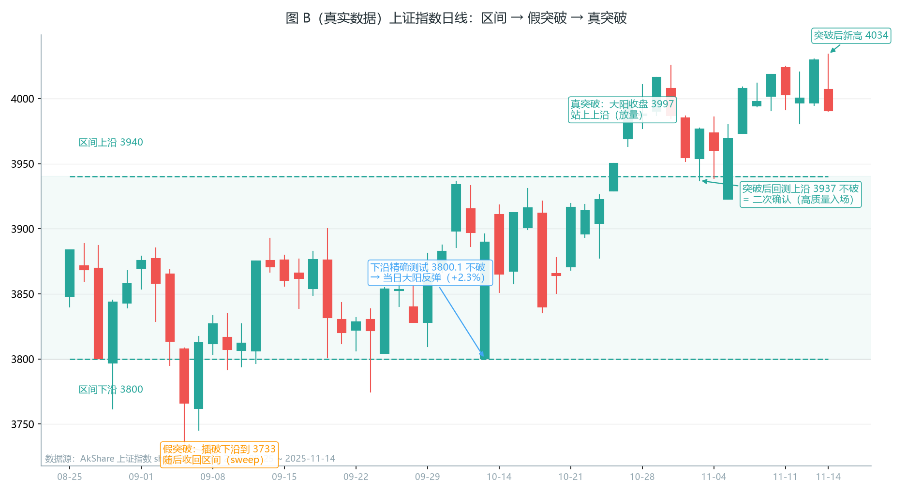

*图 4-3R 真实数据：区间 → 假突破 → 真突破（数据源：AkShare 上证指数 sh000001 日线）*

两个月里区间上下沿各被测试多次：9-04 插破下沿 3800 到 3733 后收回（假突破，3.2 的反向机会）；10-13 下沿精确测试 3800.1 不破，当日 +2.3% 大阳；10-27 大阳收盘 3997 站上上沿（真突破三条件：收盘站稳 + 放量 + 大实体）；11-03 回测上沿 3937 不破（二次确认入场点）；11-14 突破后新高 4034。这是区间系统的完整生命周期：识别 → 边界 fade → 假突破反向 → 真突破后切换趋势思维（4.5）。

**加密市场的 5 分钟版本（Binance ETHUSDT，2026-07-02）**——同一个生命周期，一天走完，节奏快几十倍：

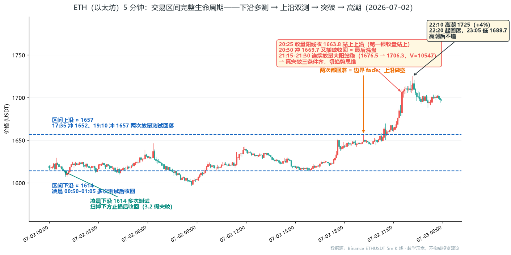

*图 4-4R 真实数据：区间 → 边界 fade → 真突破（数据源：Binance ETHUSDT 5m K 线）*

四步对应：① **边界双测**：17:35 上沿 1652、19:10 上沿 1657 两次放量测试回落，下沿 1614（凌晨多次测试）与下午回落低点 1644 一带也被反复测试——边界 fade 的机会（做空到中线/下沿落袋）；② **突破前兆**：19:55 下沿测试后低点抬高、K 线实体开始变大——突破在酝酿（4.4 的“成功 4 信号”）；③ **真突破**：20:25 放量阳线收 1663.8 站上上沿（第一根收盘站上），20:30 冲高 1669.7 又插破收回——这是突破前的最后洗盘；21:15-21:30 连续放量大阳站稳（1676.5 → 1706.3，V=10547）——真突破三条件齐，区间思维到此结束，切趋势思维；④ **高潮回落**：22:10 高潮 1725（+4%），22:20 起回落，23:05 低 1688.7——高潮后不追。三个注意：加密 5 分钟图的“边界测试”通常 2-3 次就要动手（不像日线可以等 4 次）；区间宽度 2.5% 左右（ETH 1614-1657）意味着止损距离小、盈亏比天然好；突破后**立即把止损移到突破位下方**。

### 4.5 系统三：突破交易 【核心】

**逻辑**：区间突破=供需失衡，新趋势开始。

**为什么是这套规则（机制总纲）**：突破的本质是**订单流失衡的一次性释放**。区间是买卖均衡（呼应 1.1 均衡价位理论，图 1-2）：价格在边界来回测试时，筹码在边界两侧悄悄堆积——追高的多头被套在区间上沿、抄底的空头被套在下沿，观望者在等方向信号。四条规则是同一条逻辑链：**压缩（积累弹性）→ 失衡被看见（大实体+放量）→ 确认后跟进（回踩）→ 证据失效即离场（止损）**。等待压缩是弹簧原理——波动收缩越久，边界堆积的订单越多，突破爆发力越强，没压缩就“突破”只是区间震荡本身（呼应 4.7 的“失衡燃料”）；大实体+放量是失衡的可见证据——大实体=位移方向被资金认可，放量=大量换手发生（追单者进场、逆势者认输），没有这两样只是“价格到了边界”（呼应 3.11 的 FT 48% 与四批人投票）；回踩入场买的是“确认”——回踩不回到区间内，说明边界已被市场重新定义（支撑转阻力），代价是可能错过，而错过不亏钱（第 7 章军规）；止损放区间内部=结构失效位——价格回到区间 = 突破证据被否决，这笔交易的前提不成立（呼应 4.13 统一止损表）。

**规则**：

1. **等待**：价格在区间内压缩很久（波动收缩），接近区间边界。
2. **触发**：突破+大实体确认（位移）+放量，或突破后回踩边界不再进入区间。
3. **入场**：突破瞬间，或回踩确认后（回踩入场胜率更高、止损更小，代价是可能错过）。
4. **止损**：区间内部（突破点下方）。

**核心纪律**：只做“区间外突破”，不做“区间内突破”。判断：突破 K 线实体是否完全收在区间外 + 成交量是否放大。

**突破回调策略校准**：突破回调的胜率差异，本质是“**回调在什么背景下发生**”。区间交易日里，价格回到突破点附近时，边界仍有大量反向挂单等着接，回调更容易被承接，所以策略效果更佳；趋势交易日里，回调是趋势方重新上车的机会，必须顺趋势操作。研究中平均每日约 3 次机会、胜率约 2/3，初始止损可用信号 K 线波幅的 1-2 倍，或根据背景采用测量移动止损——数字是背景机制的量化，不是独立规律。

**“区间外突破”的机制**：区间内的“突破”（插破边界又收回）只是均衡震荡的常态——区间本来就要上下试探边界，那是 4.4 的边界 fade 机会；只有实体完全收在区间外 + 放量，才说明价格真的离开均衡、进入失衡。所以同一个边界有两种操作：**站在区间外做顺势（系统三），收回区间内做反向（假突破）**——区别只在于“站没站住”（呼应 4.4 区间生命周期：真突破后切换趋势思维）。

**突破的完整过程（QuantSystems 附录，量化版流程）**：一次突破不是“突破了就算”，它是一串有分叉的事件——每根 K 线收盘后重新判断走到哪一步：

1. **突破发生**：一根新的大突破棒收盘，或一系列连续小棒形成突破。
2. **无回调 = 突破仍在进行**：价格持续同向走，突破在“创造缺口”，还没有结论。
3. **出现回调 = 突破结束（或失败）**：市场开始测试突破点——此时才真正分叉：
   - **测试成功**：突破守住，突破缺口保留并升级为**测量缺口（MG）**——预期同向第二波，缺口位置可量出目标（呼应 2.7）；
   - **测试失败**：突破失败、缺口闭合，突破缺口降级为**衰竭缺口（EG）**——反转信号（呼应 2.7 的晚期大 K 线）。
4. **失败的回调本身可成新突破**：关闭缺口的那根回调 K 线，自己可能成为新一轮突破的起点——只要它收盘站对方向，同方向至少再期待一根 K 线或横盘。

一句话记忆：**突破没有出现之前不存在突破，出现之后也只是“制造缺口 → 测试 → 缺口升级或降级”**——你等的不是突破那一下，是测试的结果（呼应 3.11 的测试=四批人投票）。

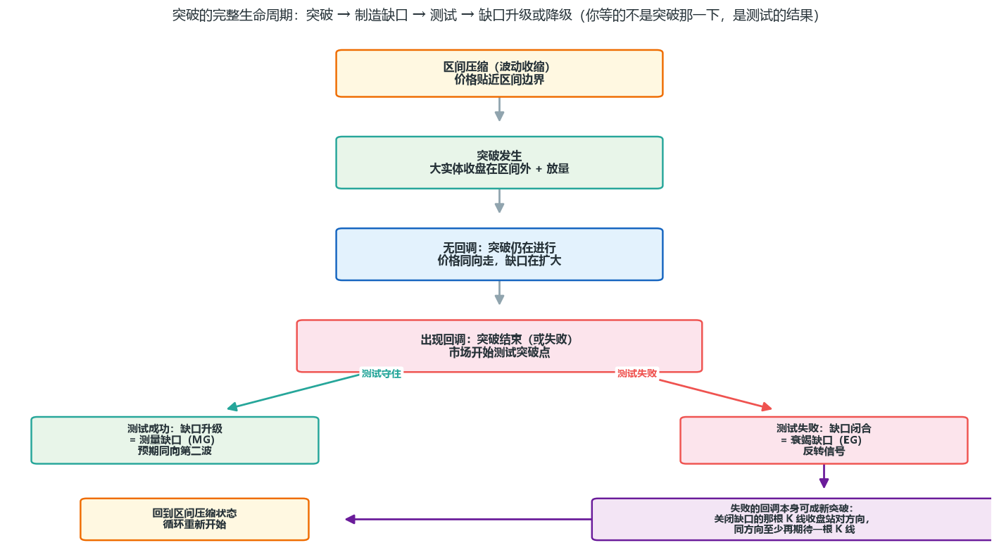

*图 4-6 突破生命周期：你等的不是突破那一下，是测试的结果——缺口升级做顺势第二波，缺口降级准备反转*

图里每个分叉都对应可执行动作：突破后无回调 → 持仓不动（突破在制造缺口）；出现回调 → 观察测试结果，不预判；测试守住 → 缺口升级为测量缺口（MG），顺同方向期待第二波；测试失败 → 缺口降级为衰竭缺口（EG），反转信号；失败的那根回调 K 线收盘站对方向 → 它自己就是新一轮突破的起点。**每一步都等收盘确认，别在插破瞬间站队**。

**突破交易最大的敌人是假突破（第 3.2 节）**。所以记住一体两面：突破站稳了就跟随（系统三），突破收回了就反手（假突破）。同一个突破，两种应对，取决于它“站没站住”。

**缺乏紧迫感的突破 = 陷阱（Ali）**：强劲突破会产生紧迫感——买方迅速跟进，测量缺口迅速变大。如果突破后在突破点附近停留很久（买方有大量时间在信号 K 线收盘后买入），紧迫感缺失会**自动降低突破的概率**：看起来会成为测量缺口的形态，实际是多头陷阱。判断口诀：**真的突破不等人，等人的是陷阱。**

**收盘价买入/卖出（COTC，Ali）**：突破入场的一种固定形态——“收盘价买入”就是等价格收出 2-3 根连续强势 K 线时在收盘价进场（收盘价卖出同理），判据三选一：① 一根大 K 线，收盘价高于左侧许多 K 线；② 2 根连续的大尺寸 K 线，收于高点附近（最好是收于高点）；③ 3 根连续的中等至常规尺寸 K 线，收于中点之上。**生命周期**：COTC 反弹通常持续 5-6 根 K 线——早期入场很重要；**4-5 根连续趋势 K 线后 COTC 不可靠**（急剧反转高风险），大多数 COTC 反弹不会超过 7 根连续 K 线；止损设在最后一个 COTC 看涨 K 线下方 3-4 个跳动点。**退出**：后期出现异常情况退出——最后 K 线变得过大则在其收盘时退出；达到重要磁力点后出现相反内包线则退出；5-6 根后部分获利。**陷阱**：K 线之间没有微缺口时 COTC 不可靠——无微缺口的“上涨”只是低时间框架上的通道（区间内的腿），达到测量移动后方向反转。

**入场方式的选择**：突破瞬间进场（激进）vs 回踩进场（保守）。激进版的优势是不错过，劣势是止损远、被假突破打脸的概率高；保守版的优势是止损近、胜率高，劣势是可能永远等不到回踩。**对新手，回踩入场更合适**——它过滤掉了大量假突破，代价只是错过，而错过不亏钱（第 7 章军规第 8 条）。

**杯柄形态的回踩段量化（Ali）**：突破-回踩-再突破的经典“杯柄”（Cup & Handle）里，**回踩段的 K 线数应为突破阶段的一半左右**——回踩太久说明上方抛压真实存在，突破方优势在被消耗；**若回踩持续过长（约 20 根 K 线或更多），市场重新进入突破前震荡状态，杯柄结构失效**。回踩段有 **50% 概率会先出现一次假突破**（插破边界又收回），但最终向上突破的概率仍然更大——**回踩段别急着否定突破，给它走完的时间**（呼应 4.5 缺口理论：测量缺口 vs 衰竭缺口要等测试结果，图 4-6）。实操：回踩不足突破阶段一半 → 结构健康，回踩入场；回踩超过 20 根 → 结构失效，按区间处理，别把区间当杯柄。

**急速行情追单的三加分项（Tefi L13）**：什么时候“追突破”值得做（而不是追高）？看三点，满足越多越值得追：

1. **跟进 K 线收盘远离突破点**——收盘离突破点越远，突破方越强，追单者越少站在被套位置（呼应 Ali 的“紧迫感”：真的突破不等人）；
2. **测试浅**——突破后的首次回撤越浅，抛压越小，回踩不深说明对方没有反抗；
3. **路径上没有显著磁体**——突破方向前方若 1 个测量移动内就有前高/前低/大整数关口/失败信号极点（磁力位，4.13），利润空间被压缩、价格容易在到达前停下；前方一马平川才值得追。

**追单的止损纪律（Tefi L13）**：无论何时入场，**止损一律放在推动起点（重要波段点）之外**——不是按入场信号 K 线，而是按“这波推动从哪开始”。急速行情波动大，按信号 K 线止损会被正常波动扫掉，按推动起点止损才给趋势留出空间。

**初始止损（iStop）的量化版（突破）**：以信号 K 线波幅为基准——信号棒相对较小时，止损距离取信号棒波幅的 2 倍（小信号棒噪声大，宽一点更稳）；信号由两根 K 线组成时，取两根合并波幅的 2 倍；信号棒远大于平均水平时，取 1 倍波幅再加几跳（大信号棒本身已含止损空间，紧贴结构即可）。与 4.13 统一止损表同一原则：止损是结构失效位，信号棒越小越要给它呼吸空间。**小型信号 K 线的止损必须更远（Ali，卡片 103）**：信号 K 线较小时，**市场经常测试小型卖出信号 K 线的高点以上（或小型买入信号 K 线的低点以下）**——止损必须至少距离信号 K 线的高点/低点 **3 个跳动点**；若信号 K 线是内包 K 线，则止损设在外包 K 线的高点上方 2 个跳动点。

**突破模式（Breakout Mode，Ali）**：市场处于突破模式时，价格走势出现连续的方向相反的刺透形态——双顶与双重底；这也构成了突破前形成的紧密交易区间的定义。**紧密交易区间（TTR）形成转折点**：该区域是交易者预期趋势可能发生反转（无论最终是否形成）的关键地带。突破模式情境可能由单根 K 线（十字星）构成，也可能持续数小时、包含 40 根及以上 K 线的紧密交易区间。**突破模式的概率并非总是 50/50——突破前的价格行为将影响突破方向的概率**：在强劲趋势中，突破模式会演变为延续形态；在极端价位与磁吸位附近，突破模式会转化为反转结构。**新高后的默认剧本（Ali）**：在突破模式里创出新高后，回调是突破者能获得的最好结果（约 60% 概率），另有约 40% 是反向突破——所以新高出现后先等回调测试，而不是市价追突破。

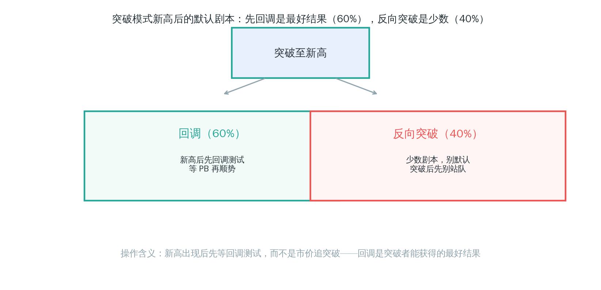

*图 4-7 突破模式新高：回调是突破者能获得的最好结果*

**突破强度评估：突破还是开盘区间？（Ali）**：评估突破的强度，要与失败突破信号 K 线的强度相比——回调的最终阶段通常是微通道；**含 4 根或更多根 K 线的微通道，其通道突破通常会在回调前持续 1-2 根 K 线**（尤其当该微通道包含 4 根或更多根 K 线时）。强劲趋势通常没有回调，因此在微通道的突破处入场是合理交易；趋势不强劲时，微通道的突破通常在一两根 K 线内就会出现失败尝试。

**突破缺口的生命周期：闭合序列（BOG，Ali）**：突破缺口（Breakout Gap）不是一次性事件——它有自己可读的闭合序列：① 突破后每次回调（PB）都在缩小缺口，但**只要缺口仍开放，突破方向就有更多动能**；② 最终回调触及突破点（BOP）把缺口减到零，但**通常不会越过它**（无重叠）——缺口完全闭合前，突破都算“测试中”；③ 如果下一条腿又创出新的突破缺口，新缺口的闭合概率更高（后创的缺口更脆弱）；④ 如果下一轮回合产生新的**大缺口**且仍保持开放，模式将升级为**高潮或新一轮突破**——这种序列通常会画出“收缩楼梯”图案；⑤ **当最后一个缺口闭合时，逆势交易者开始淡化第一个回调**——第一批被套者离场完毕，真正的反转测试才刚开始。两个精确版本：**负向测量缺口**——回调点略低于突破点、表明动能不足，回撤填补突破缺口后形成“负向测量缺口”，其预测可靠性降低但仍可能非常准确；**身体缺口**——突破形态最后一根 K 线的实体与突破 K 线实体不重叠即形成，只要实体缺口保持开放，突破延续（TRES）的概率就高于反转（TREV），尤其在回调较弱时。

**突破之后：三种结局（Ali）**：价格突破至新低（或新高）后只有三种可能——**横盘整理、反转、趋势**。别急着给突破定性，突破后的头几根 K 线决定剧本：① 若突破后出现强回抽拒绝（突破 K 线展示前期买方力量后创出新高、随后对新低形成拒绝），说明反向方把突破当回调处理，反转概率上升；② 若突破后跟随即时跟进（大实体、无犹豫），趋势概率上升；③ 突破后立刻横盘 = 正在“投票”——等测试结果再站队（呼应 3.11 的测试=四批人投票）。

**突破失败后的剧本：横盘整理而非反转（Ali）**：突破伴随良好跟进（FT）时，反向突破的概率极低——**一年仅会出现一两次单边突破后反转（Rev）并突破另一边的情况**；通常突破失败后，市场倾向于**横盘整理而非反转**，并在相反方向形成强劲趋势。所以突破失败 ≠ 反转信号，先默认横盘，只有出现明确的相反结构（如拒绝后的强势反攻）才考虑反转。

**强突破的概率底色（Brooks）**：**强空头突破，60% 的概率得到第二条下跌腿，40% 概率反转向上**（强多头突破镜像）——这是“突破后别急着反转、先给第二腿时间”的统计依据：强突破的默认剧本是“至少再走一段”，反转是少数（呼应 2.8 反转概率：只有 40% 的反转走得够远；也呼应 4.5 回踩入场：等第二腿起点，而不是抢第一根反转棒）。

**突破 60EMA：成败两种迹象（Ali：ES 日内常用）**：以 60 周期均线为目标的突破，成败在突破前就有迹可循：**失败迹象**——接近 60EMA 时出现犹豫、内部回撤、大量重叠且无明确缺口，后续回撤中价格突破回撤高点的情况值得怀疑；弱势接近突然转为强势并形成明确缺口时后续可能上涨，但**迟到的突破必须超越所有阻力位且展现出惊人强度**。**成功迹象**——清晰强劲的跳空缺口（突破前后均有明显缺口）、K 线之间几乎没有重叠、极少或没有内包线、K 线接近高点且几乎没有上影、突破后回踩（PB）疲软且令人失望——**回踩越弱，突破越可靠**。

### 4.6 系统四：微通道交易（Micro Channel） 【核心】

假如你想把“买方连续压过卖方”变成一条不用临场判断的规则，你会怎么定义？最直接的回答是：**价格沿同一方向一根接一根推进，每根 K 线都不回头（低点不重叠）**——这就是微通道。它是通道家族里最特殊、也最容易被量化的一支（Al Brooks 一脉的 Ali Moin-Afshari 把它做成了完整系统，附录 C.7）。它适合明确趋势日，基础胜率 70% 以上，但利润薄、节奏快——新手了解即可，趋势回调（系统一）仍是默认。

**定义（可编程标准）**：价格沿同一方向至少 3 根 K 线、且存在微小缺口（相邻 K 线低点不重叠）：

- 至少 1 根 K 线强势收盘（收盘接近最高/最低）；
- 上升微通道中，每根 K 线低点不低于前一根低点；
- 基础胜率 70%，最强形态可达 90%。

**10 项强度指标（每缺 1 项扣 5% 胜率）**：

1. K 线大小均匀；
2. 多数收盘在最高点附近；
3. 存在微小缺口；
4. 存在明显 tick 缺口；
5. 每根收盘高于前根最高点；
6. 每根低点高于前根低点；
7. 部分开盘 ≥ 前根收盘；
8. 部分 K 线无下影线；
9. 多数无上影线或上影很短；
10. 无十字星和反向 K 线。

**为什么是这十项（机制）**：十项指标都在测同一件事——**买方有没有“连续不断”地压过卖方**：K 线大小均匀 = 节奏稳定、没有一方突然失控；收盘接近最高 = 每波推升都没被卖回（无抛压）；微小缺口/tick 缺口 = 相邻 K 线不重叠，每根都在新区域成交（买方不回头、卖方没有低价补票的机会）；收盘高于前高 + 低点抬高 = 步步为营、逐级上攻（持仓者与追单者都在浮盈，没有套牢盘等着砸盘）；开盘 ≥ 前收盘 = 下一根直接高开（卖方连低价卖出都没等到）；无下影 = 下探立刻被买回（买方不给低价机会）；无上影 = 冲高没被卖下来（上方无抛压）；无十字星/反向 K = 没有犹豫、没有立场动摇。**每一项都是“卖方缺席”的证据——卖方缺席越久，突破后越没有对手盘，对称第二腿越容易走完全程**（呼应 4.5 的追单三加分项：测试浅 = 对方没有反抗）。所以“每缺 1 项扣 5%”的扣分制不是玄学，是“卖方出现的证据越多，对称第二波的概率越低”。

**10+2：两个附加因子**（QuantSystems 概率估算）：10 项之外再问两件事——**① 距离**：价格移动了合理的大距离；**② 时间**：突破波段超过 3 根 K 线。两者都满足，强度再上一个台阶。

**概率估算表（对称第二波）**：以上 10+2 项不是感觉，是扣分制——每缺 1 项扣 5%；**末段行情（第 3 波以后）再扣 10-20%**；逆市场制度（regime）扣 10-20%；突破波段少于 4 根扣 5%；距离强加 5-10%；时间足加 5-10%。非对称第二波：所有扣减减半，距离与制度权重更高。原则是“Good is Good Enough”：找到大概率出第二波的结构就够了，不用微分析到极致。

**执行门槛（Ali 原文）**：10 项强度指标**满足约 70% 特征即可交易**，不必追求满分；例外是“2 大 1 小”的不均匀 K 线组合，可视作 **80% 强度**。别把“每缺 1 项扣 5%”理解成必须全过——它是强度排序，不是入场硬闸。

**非对称第二段剥头皮**：非对称第二段能剥头皮，是因为**它不需要等完整对称结构，只需要“大间距突破 + 至少 2 根优质 K 线”证明失衡仍在**——大间距说明第一段走得远，优质 K 线说明方向被资金确认。由于这段行情快，持仓 1-3 根 K 线、分批建仓是必要的；顺趋势剥头皮利润约典型 K 线波幅的 75%，逆趋势约一半——利润差本身就在提示你：逆势剥头皮只能用更小仓位。

**入场**：第 2 根 K 线收盘时市价入场（或在其收盘价下方 2-4 个最小价位挂限价单）；三根 K 线构成完整信号——第一根预警、第二根确认、第三根跟进。

**止损（双止损体系）**：初始止损 iStop = 突破 K 线低点下方 1 个最小价位；实际止损 aStop = 回撤 K 线低点下方 1 个最小价位（若无回撤，用第一腿 K 线低点）。入场后价格应先朝预期方向移动，而非先触及止损。

**BQ 点（Breakout Quit，Ali）——微通道的终止条件**：微通道的严格定义里有一条可编程的终止规则——**当价格突破前一个低点（多头）/前一个高点（空头）下方 1 个单位（BO = 1 tick below prior low）时，微通道宣告结束**；这个“前低/前高 1 单位”的位置就叫 **BQ 点**。它同时是微通道里**最可能失败的位置**：价格跌破前低 1 tick 的突破，失败概率最高（假突破高发），因为它扫掉的是离突破点最近的一批止损单。实战含义：① **持仓中**，BQ 点就是移动止损的自然位置——价格触及 BQ 没跌破，通道还活着；跌破 1 单位，通道结束，按下方出场规则处理；② **想做趋势恢复单**，BQ 点就是挂单位置——在 BQ 点押注突破失败买回（呼应 4.5 突破失败二次入场）。

**微通道突破的四种结局（Ali）**：突破发生后只可能是四种结果之一——① **突破成功**（继续沿突破方向运行，至少形成可交易的第二腿）；② **突破失败 → 趋势恢复**（小幅突破后恢复原趋势方向）；③ **恢复失败 → BOPB**（形成突破后的回撤，二次入场机会）；④ **演变为交易区间**（横盘整理）。把“突破”换成“反转”，四种结局完全对称（反转成功/反转失败→趋势恢复/恢复失败→二次反转/演变为区间）。交易含义：突破那一刻别急着站队——先问“现在是四种结局里的哪一种”，用收盘确认区分，对应 4.5 的突破生命周期。

**目标**：基于实际风险 aRisk 争取 2 倍回报（基于初始风险 iRisk 争取 > 0.5 倍）——这正是第 6 章“实际风险”概念的应用：止损很快收紧到 aStop，真正的风险远小于名义风险。

**高概率时的盈亏比例外（Ali）**：手册整体要求 RR ≥ 2，但微通道资料给了一个有边界的例外——**当胜率超过 90% 时，可接受小于 1:1 的回报比**。这不是推翻 RR 纪律，而是数学上的必然：期望 = 胜率×盈利 − 败率×亏损，90% 胜率下即使盈利略小于亏损，期望仍可为正。边界条件：只在确认强度极高（10 项指标基本齐全、背景明确）的微通道里用；不能因为“感觉会赢”就把这个例外套到普通低胜率信号上。

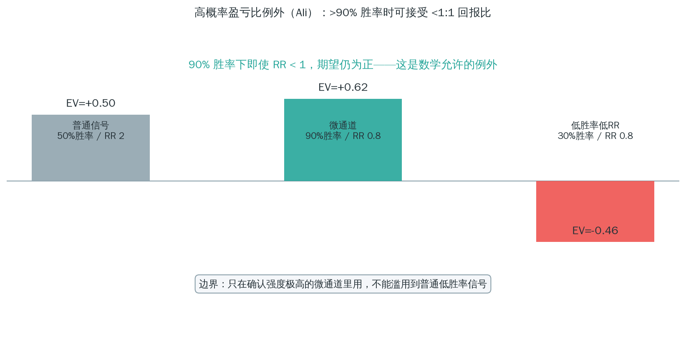

*图 4-8 高概率盈亏比例外：数学允许，但边界很严*

**出场**：

- 出现加速大 K 线（大阳/大阴）且已有浮盈 → 收盘市价平仓（利润最大化）；
- 出现十字星/反向 K 线/长反向影线 → 减仓（最小化策略：多头在空头反转 K 线下方 1 单位退出）；
- 微通道超过 6-7 根 K 线 → 概率转向回撤而非延续（12-19 根无回撤是低概率极端）。

**决策要点**：震荡日只做 1-2 根 K 线的刮头皮，趋势日可期待与微通道等长的第二腿；完全基于当前图表量化特征决策，不参考更高时间框架——这是它与其他系统最大的不同：它快到来不及看 HTF。

**宽窄通道的默认规则与对手方诊断（Brooks，43A/44C）**：① **无法分辨宽窄时，就把它当窄通道交易**——窄通道只做顺势，方向错了代价小；宽通道回调幅度大、可双向，紧凑通道做空很难赚钱（大多数回调不够大）。② 判断通道强弱的金标准是“对手方能不能赚钱”：**如果空头无法卖出赚钱，多头趋势就是强劲的，空头就不该开始卖出**（镜像同理）——通道里“谁赚不到钱”，谁就该停止操作（呼应 4.23 逆 Always In）。③ 紧密通道的回调通常在下跌 33%-50% 后反转向上——限价单空头很难赚钱，每次反转下跌多头都买入。

**让“感觉”指引你（Ali，卡片 116）**：当你看到 BRs（空头）**无法通过限价单赚钱**、而你自己正焦急地等待回调买入时——这两个信号同时出现 = **强劲多头趋势的证据，立即以市价买入**。逻辑：BR 无法通过限价单获利，意味着价格必须继续上涨才能找到更多卖家——你等不到的回调，恰恰说明没有回调可等。最坏情况：市价买入后市场立即抛售，也先持有——因为 1LD 只是交易区间的一部分，在低位补仓、在回测反弹时以保本或小利退出。BR 需要一个 DT 或 MTR 才能反转强劲反弹，因此第一次向下反转通常走不远，之后会再次向上测试。

**紧缩空头通道里的多头反弹 = 空头旗（Brooks，44A）**：紧缩空头通道中出现一段 5-10 棒的多头通道，**几乎总是一个空头旗**——市场会出现空头突破。但如果回调无休止地增长（10、20/30 棒），多头突破空头通道的可能性变小；若真的又出现一轮强劲的多头突破，市场就变成了多头市场。所以空头通道里的反弹别急着翻多：先看它是不是空头旗，再看它有没有“无尽回调”到改变结构（呼应 3.12 最终旗形）。

**通道市场统计（Ali）**：市场始终在某种通道中移动——倾斜的交易区间就是通道。**突破多头通道上方和跌破通道下方的失败率达 75%**；通道随着成熟而减弱，后期加速（突破）是低概率事件：多头通道上方的多头突破概率约 25%。若看跌方在强劲的多头波段中获利（波段强劲到足以形成 2 波段），其后的回调通常会弱得多。**价格行为在通道末期突然变强，通常意味着行情终结（衰竭性高潮），为反转交易创造了条件**。顺势信号柱在紧密通道中通常较弱；逆势信号柱在紧密通道中通常较强，但多数会失败。**只要微缺口保持开放，趋势方向就存在动能**——仅在靠近趋势线的趋势方向入场。

**弱势通道可能持续很长时间（Ali）**：弱势多头、广泛多头通道伴随深度回调的持续时间可能远超想象。**当通道出现 4 或 5 次推动时，反转突破的概率升至接近 40%（基线为 25% 比 75%）**；到第 5 或第 6 次推动，可能在看涨通道上方形成多头突破——反转概率进一步升至 60%：60% 概率开启交易区间（反转）、40% 概率沿通道方向突破。一旦发现多个卖出高潮在主要支撑位受阻，接下来几根 K 线只考虑做多，并寻求两个横盘转上涨波段的机会。低成交日不影响弱通道突破：成交量减半仍可能突破至历史高点上方。

**尖峰与弱通道（Ali）**：弱势通道（阻力位下方）有 66% 反转概率——通道急速上行时多头突破成功率仅 25%；通道疲软且呈现小幅回调趋势时，多头成功率降至 33%；看跌突破和两段式下跌（2LD）的概率更高，达 66%；若通道过窄或呈现楔形，成功率最差。熊市通道镜像：弱通道中突破概率五五开；通道陡峭向下时成功看跌突破概率仅 25%；通道几乎走平且主要呈现交易区间形态时，行为更像区间而非通道。

**窄幅通道：仅沿通道方向交易（Ali）**：紧密通道属于大时间周期的突破——仅在通道方向上进行交易。以下特征出现得越多，交易在紧密通道方向上的成功概率就越高：① 回调持续 1-3 根 K 线；② 回调幅度小于最小波动幅度的 2.3 倍；③ 回调幅度小于平均 K 线柱的 2 倍；④ **使用止损入场的逆势交易大多会亏损，即使卖出信号 K 线很强劲时也是如此**；⑤ 多数回调仅回撤前一波段的 1/3 至 1/2；⑥ 突破点与回调点之间的缺口，分批建仓策略无效。

**微通道长度统计（Ali）**：多数微通道约 12-15 根 K 线；少数情况可持续 16-20 根；持续 21-25 根或更多的通道较为罕见。**约 20 根 K 线后，多头趋势中开始向看跌的一方倾斜（反之亦然）**——呼应上文出场规则：超过 6-7 根 K 线概率转向回撤而非延续。

**更高时间框架的基准（Ali）**：60 分钟图上的微通道通常持续约 **6-9 根 K 线**，持续 19 根非常罕见；月线连续超过 5 根 K 线的微通道后常出现约 100 点修正，周线 6 根连续看涨 K 线几年一遇。别把 5 分钟图的 12-15 根统计外推到 H1/周线——时间框架越大，通道越早进入低概率区，看到 H1 上 10 根以上无回调通道时已经接近极端，应提前减仓或停止追单，而不是机械套用 5 分钟长度。

**为什么小级别棒数多、大级别棒数少（机制）**：微通道的本质是“同一股失衡能维持多久”。5 分钟级别里，失衡可以由连续的小单维持——每根 K 线的成交量小，燃料消耗慢，所以能走出 12-15 根；H1 级别里，推动一根 K 线需要大得多的资金，同样的失衡燃料烧得更快，所以 6-9 根就接近极限。这不是“两个市场不一样”，而是**同一个失衡在不同计量单位下的寿命不同**：K 线周期越大，每根消耗的燃料越多。理解了这一点，你就不会死记“12-15”或“6-9”，而是会问：当前周期上，这股失衡已经消耗了多少根？

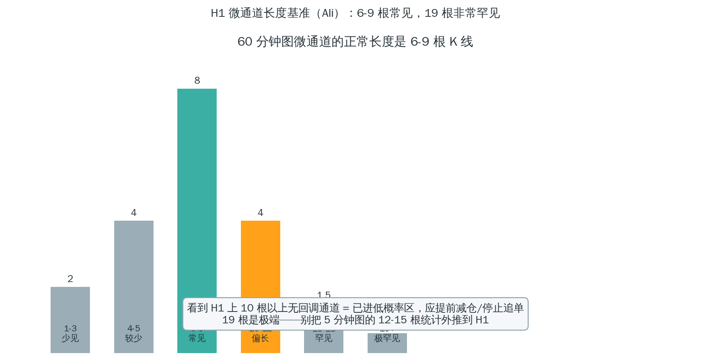

*图 4-9 H1 微通道长度基准：6-9 根常见，19 根是极端*

**微通道成熟后的大回调（Ali：60% 概率 150-200%）**：当通道结构足够成熟时，回顾自通道阶段开始以来途中的**最大回调幅度**——**60% 的概率会出现一次大型回调，规模比通道中最大的回调还大 150-200%（有时更大）**；只有 40% 的概率市场沿通道方向直接运行至收盘。这个统计回答了一个具体问题：“微通道已经走了一段，现在还能不能追？”——**通道越成熟（长度越长、推动次数越多），越接近那 60% 的大回调**，末端追单的风险就越高（呼应 4.6 出场规则：加速大 K 线/接近 20 根 K 线要离场；也呼应“约 20 根后向看跌倾斜”）。实操：微通道早期（<6-7 根）顺通道追，成熟期（>12 根）停止追单、等待大回调后再进，或把回调幅度预设为“通道内最大回调的 1.5-2 倍”来管理止损目标。

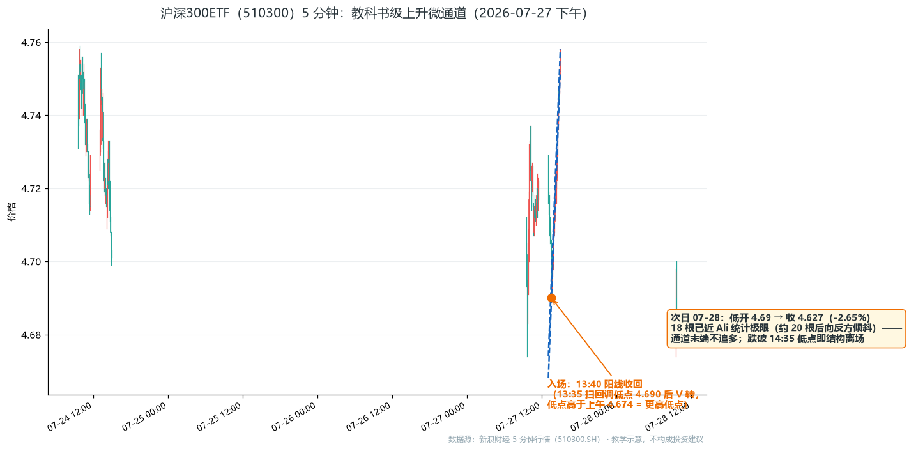

*图 4-5R 真实数据：18 根上升微通道 → 次日反转（510300 沪深300ETF，5 分钟，2026-07-27 ~ 07-28）*

这张图把入场、双止损、长度统计和出场四条规则连成一次完整交易：**7-27 下午 13:35 扫掉回调低点 4.690 的止损（高于上午低点 4.674 = 更高低点，属于顺势回调），13:40 阳线收回时入场**；随后 18 根微通道低点逐根抬高，收 4.753（+1.3%）——恰好落在“12-15 根常见、16-20 根少数”的统计区间上沿；**次日 07-28 低开 4.69 直接反转，收 4.627（-2.65%）**——18 根已逼近“约 20 根后向看跌倾斜”的临界点，通道末端追多就是接盘。正确的动作链：2R 目标 + 双止损（初始 iStop 在 13:35 低点下方，实际 aStop 随 14:35 低点上移），**跌破 14:35 低点 4.729 即结构离场**——你不需要预测次日反转，规则会在反转发生时让你离场。

**尖峰与通道（Spike & Channel，Ali）**：趋势出现长钉（突破缺口）表明市场正进入明确的趋势方向——**长钉形态越强劲，后续以通道形式跟进（趋势性交易区间）的概率越高，且通道延伸更远的可能性越大**；长钉出现后立即发生回调。**通道突破在趋势方向出现的情况较为罕见（仅 25% 概率）**：通道通常会反转，市场会测试通道的起点，形成双底/牛旗形态；随后市场在试图形成交易区间时，会朝趋势方向至少反转 25%。通常会有一次回调至通道的 50% 位置，随后市场进入横盘，并决定测试整个通道起点或恢复趋势。

**尖峰与高潮（Spike & Climax，Ali）**：尖峰和顶点是尖峰和通道的一种变体——连续的高潮形态通常伴随着更深的回调，往往回到第二个高潮的底部；这是一个没有明显抛物线楔形的抛物线高潮。**在尖峰与高潮形态中，顺序通常是颠倒的：先出现通道，然后小幅回调，接着产生尖峰**——通道起到尖峰的作用，而该尖峰通常仅为一根 K 线起到通道的作用（所以也叫“尖峰与通道：巅对决战例”）。尖峰通常是对阻力位和趋势反转的真空测试，或开启深度回调。当形态较小时（如 1-5 号形态），高潮和回调可能出现在同一根 K 线上。日线图形成高潮时，5 分钟图通常处于强劲趋势中。

**尖峰的定义（Ali）**：当当前 K 线跌破前一 K 线的低点时，前一波即成为多头尖峰，反之则为看跌尖峰。**任何尖峰都是高潮**：向上尖峰是反转下跌的设置，向下尖峰是反转上涨的设置；尖峰可以是单根 K 线。连续高潮不可持续——市场必须先向相反方向修正，才能继续沿原方向运行。

**买入/卖出压力（Ali）**：B/S 压力是累积的——随着更多 K 线出现，压力会继续累积，直至另一方被压倒而放弃。**缺口在 5 分钟图上极为罕见，是强烈 B/S 压力的信号**。前期卖出高潮上方始终存在卖方压力；前期买入高潮下方始终存在买方支撑。**买入压力的微妙迹象**：连续的几根小 K 线，但每根低点都高于前低、且多数高点持平或高于前高——这是发生在更高时间周期的突破。当强劲看涨突破后出现微通道时，市场很可能处于小幅回调的看涨趋势中；首次反转将是小幅反转（MRV），突破缺口有超 60% 概率将保持开放。

**紧迫性（Urgency，Ali）**：紧迫感是力量的象征——交易者通过激进地买入或卖出（不等回调）表明他们对市场走向的信念，紧迫感在价格图表上留下独特足迹。**当出现紧迫感和跟进动作时，大量被套牢的交易者会逆势操作首个回调，使其成为高概率交易**（呼应 4.5：真的突破不等人，等人的是陷阱）。

**K 线计数重置与隐含回调（Ali）**：**一次新的突破会重置 K 线计数**——如果波段强劲但突破呈现更低高点，仍可重置计数。**隐含回调**：一个未突破的看跌 K 线（低于前一根 K 线的低点，但出现看跌的 K 线实体）表明处于较低时间框架的回调中。多头微通道中的隐含回调：没有看跌 K 线但有 H1 回调（回调形态在 1 分钟图上，所以隐含的回调在 5 分钟图上）。

**窄幅通道：首次加速通常幅度较小（Ali）**：窄幅通道比突破走势更弱，交易策略需相应调整——**首次加速通常幅度较小**，1R 通常是次要目标；TC（窄幅通道）通常在成为 BR 趋势前先转为 TR（交易区间），因此 BL（突破腿）有充足时间以较低止损概率退出。操作区别：在突破行情中，交易者在前高点上方买入、在新高点强势收盘时买入；在趋势延续阶段，他们在突破前高位卖出锁定利润，随后等待回踩时再次买入；当波动区间较大时，在前高上方 1 至数个点处获利了结。

**矫正腿 ≈ 图案一半（Ali：时间管理）**：修正量通常约为图案尺寸的一半——例如图案由 48 根 K 线构成时，预计调整阶段将持续约 24 根 K 线。时间管理同理：如果一轮持续两小时的上行行情在触及阻力位后转跌，那么这轮下跌很可能持续 1 至 2 小时——**接下来至少一小时，只考虑做空**。观察呈现清晰形态的最高时间周期，以它作为回调持续时间的参考基准。

**楼梯形态：宽幅通道趋势结构（Ali）**：楼梯交易日是 TTRD 的变体，要求至少出现三个交易区间——当日波动度较大，但呈现明确的高低点趋势走势；几乎每个突破点之后都会出现回调测试（PB），因此连续波动之间存在部分重叠。**收缩楼梯**：若每次突破幅度都比前次小，则形成收缩楼梯模式——这是动能减弱的信号，可能引发更大级别的反转（呼应 4.5：收缩楼梯通常对应 BOG 闭合序列的升级）。低概率事件顶部：突破 W 底失败后出现的顶部。

**熊市通道卖出技巧（Ali）**：当市场处于 BR 通道（弱 BR 趋势）且在 EMA 上方反复测试时，有三种主要卖出方式：① 在 BR 趋势线下方卖出（尤其是在 EMA 附近）；② 强势卖出 K 线收于 EMA 附近时卖出；③ 在较高的点上卖出（等待反弹至更强位置再空）。

### 4.7 状态机与多时间框架 【核心】

三个系统不是三选一，而是**状态机**——市场状态决定用哪个系统。更深一层看，市场只有两种定价方式：**均衡定价（区间）和失衡定价（趋势）**。区间里价格靠边界回归赚钱，趋势里价格靠回调延续赚钱；状态机不是给行情贴标签，而是先判断“现在市场用哪种方式定价”，再选对应的系统（系统四微通道只是趋势日内部更快的失衡玩法）。


*图 4-10 状态机：结构判定 → 选择系统*

**YTC 三层读图法（Lance Beggs）**：多时间框架可以进一步分成三个角色——**更高时间框架（HTF）定结构**（方向与关键位）、**交易时间框架（TF）定交易区域**（只在有效区域等信号）、**执行时间框架定入场信号**。它和 5.7 的三周期命名是同一件事：先知道“大方向允不允许”，再知道“在哪里等”，最后才看“哪根 K 线触发”。YTC 的增量是强调“交易区域”——不要在每个位置都开单，只在 HTF 结构允许、TF 区域明确的交集里交易。类似思路还有 Chris Capre 的 Advanced Price Action：要求日线/4H/1H 的“冲动-修正”结构同向共振才入场，并把交易管理看得比入场更重要。

**多周期怎么选：因数 5（YTC）**：高/低时间框架之间常用 **×5/÷5** 选配——5 分钟配 30/5/1，15 分钟配 75/15/3（近似 1H/15m/3m），3 分钟配 15/3/1。为什么是 5？周期差距太小（如 15/8/1）信息重复、噪音叠加，差距太大（如 日线/1m）又失去“同一结构在不同尺度上的确认”意义。因数 5 不是魔法，是让三层各自覆盖“方向、区域、扳机”的最小信息差。盘中只盯三层，不要为了“更全”把时间框架越加越多——多周期是过滤，不是信息过载。

每根 K 线收盘后重估状态，结构变了就换系统，不恋战。

**阅读导航**：本节有大量日结构统计数字（时间结构、隔日概率等），属于进阶弹药库——第一遍只需记住加粗结论、状态判定树（见后文）和“先判状态再选系统”这一句话，其余细节实盘遇到对应结构时再回来查。

**日结构分布（突破统计）**：约 65% 的交易日是趋势性交易区间日（TTRD）——趋势波段 + 区间震荡的组合，属于“区间主导”口径；纯趋势日只有 10-15%，小幅回调趋势日约 5%；约 85% 的交易日约一半时间处于某种交易区间内。这解释了为什么“区间”是状态机的默认状态：大多数日子、大多数时间都在区间里，趋势是稀缺品——看到趋势日（如 2.11 的趋势日形态）才切换趋势系统，平时默认区间逻辑。**子类型（QuantSystems）**：TTRD 再细分，是因为“区间主导”内部仍有不同性质——**TRI TRD（三角区间日）**的区间边界在收敛，突破往往更晚；**ET TTRD（扩张三角趋势区间日）**的区间在扩张，突破往往更情绪化。研究中也按 VIX 分三档 0-15/15-30/>30 分组统计，因为不同波动环境下的同一种日结构，信号胜率可能差很多。

**小幅回撤趋势日定量特征（极速上涨）**：最强趋势日类型，一个月可能只出现 1-2 次——当天回撤幅度仅为日均波幅的 10%-30%，回调棒明显小于趋势棒（约 30%-50%），回调时间 1-3 根 K 线，恢复后继续创新高；所有回撤都是好的入场点。

**为什么大部分时间在区间里（机制总纲）**：市场是双边拍卖——价格在均衡价位附近时，买盘卖盘都能成交，没有人有动力推动价格；趋势需要持续的订单流失衡（信息冲击、机构建仓、止损连锁），而失衡一旦被消化（订单成交完），价格就回到均衡附近重新积累。这直接呼应 1.1 的均衡价位理论（图 1-2）：**均衡是常态，失衡是例外**。所以下面的所有规则都共享同一个底层判断——**先问“今天有没有燃料推动单边”，再决定用哪套系统**。

**用“stop 进场的一方能不能赚钱”客观判趋势/震荡（Z说）**：趋势与区间的判定可以落到一个可观察的问题——**用止损单（stop）进场的那一方，到底能不能赚到钱**。强趋势日：顺势方用 stop 追进（突破新高/新低才成交），回调不深、很快继续获利；逆势方用 stop 抄底/摸顶则频繁被扫。弱趋势/阶梯日：逆势方用 stop 也能赚到钱，说明回调足够深，给反向单留出了利润空间——这种“谁都能赚钱”的状态不是强趋势，是拉锯。到了区间：顺势 stop 追突破和逆势 stop 接边界都很难赚，因为价格来回扫。这个判据和上面 Ali 的“逆势能获利 = 区间日”是同一件事：**趋势的本质是“只有顺着它的人能赚钱”，当逆势者也能获利时，趋势已经名存实亡**。

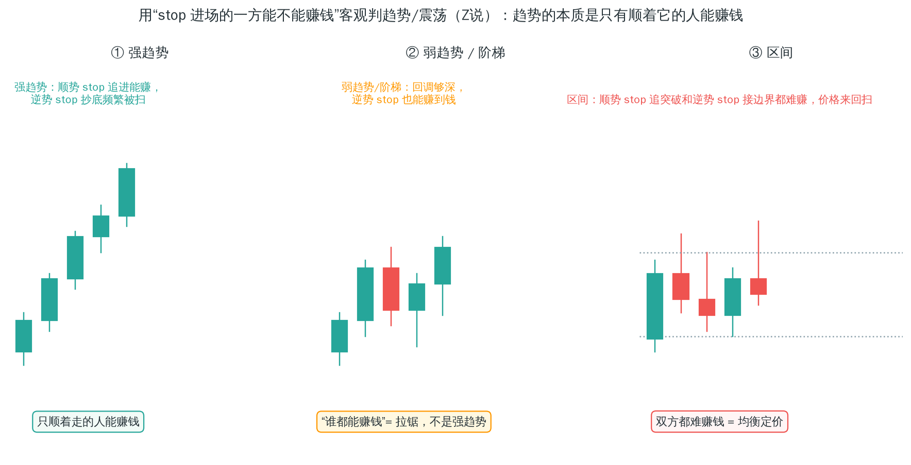

*图 4-11 用 stop 赚钱判趋势/震荡：谁都能赚钱 = 拉锯，不是强趋势*

**交易区间日（TRD）的识别（Ali）**：84% 的交易日至少存在几个小时的交易区间；其中约 65% 的交易日从开盘到收盘都以区间/区间主导为主（与上面的 TTRD 口径重叠，不是另一类互斥日型）。五个提高“今日是区间日”预期概率的条件：① 反弹后出现深度回调；② 更高时间周期（HTF）正在测试关键位；③ 过去多数交易日都是区间日且 HTF 也处于区间；④ 处于 HTF 趋势末期；⑤ HTF 出现高潮行情之后。开盘出现带长影线的重叠 K 线（开盘即区间价格行为）直接提示区间日。**第六个信号（Ali）**：多头在均线下方逆势操作强劲看跌 K 线仍能获利时，该交易日极可能演变为区间日——真正趋势日里逆势者无法赚钱，逆势操作能获利 = 多空拉锯而非单边。**为什么是这五个条件（机制）**：五个条件测的是同一件事——**今天有没有足够的失衡燃料推动单边**：反弹后深度回调 = 上方卖压已被验证、燃料被消耗；HTF 测试关键位 = 大周期多空正在拉锯、谁都没占到便宜；过去是区间日且 HTF 也区间 = 市场本身就处在均衡态；HTF 趋势末期 = 趋势燃料接近耗尽；HTF 高潮之后 = 最后的失衡已经释放完。燃料不足的日子，突破没有后续买家/卖家接盘，自然走不远——这就是区间日。TRD 的结构：多数交易区间日和 TTRD 包含 3 个主要波段，每个波段可细分为更小的子波段；**一旦某个波段突破前一波段的极值，价格反转回突破另一端的可能性很小（只有 10-20% 的概率）**——区间日里突破方向一旦确立，默认走完该波段、别急着反向（呼应 4.13 区间高度翻测）；**区间/通道突破 75% 的时间在 1-5 根 K 线内失败**（Ali）——突破后 1-5 根内无良好跟进 = 突破已失败，别幻想它稍后补涨；市场通常先形成低点交易区间（LTR），测试上方往往失败并在尾盘形成第二段下跌（2LD）；日 K 线实体小、反转多、突破走不远就被拉回区间内。**区间波段的时间尺度（Ali，卡片 204）**：第一段（开盘区间）通常持续约 1 小时然后反转，后续的交易区间波段持续约 2-3 小时后反转——每一段通常是对先前支撑/阻力位或突破点的测试，触及或超出这些水平时反转；波段运行过久后，别因反向小型信号 K 线贸然入场。**波段数上限（Ali）**：区间内波段通常不超过 3 个主要走势段，一旦第 3 段出现，突破即将发生——停止逆势操作。

**趋势中的波段 vs 区间中的浪段（Ali，卡片 195）**：

| 维度 | 趋势中的波段 | 区间中的浪段 |
|---|---|---|
| 波段数 | 通常至少两个或更多 | 通常只有两浪 |
| 回撤深度 | 价格回撤不会跌破突破点 | 第二浪开始前往往先跌破前期低点 |
| 缺口 | 多数突破缺口保持未回补 | 多数突破缺口会被回补 |
| K 线形态 | 多根 K 线收于高点，少影线或无影线 | 大量十字星和小型 K 线，明显长影线 |
| 动能 | 第一浪通常比第二浪（通道阶段）动能更高 | 第二浪动能更弱，看似突破却失败后反转 |
| 交易方式 | 回撤太浅，无法在趋势浪中剥头皮 | 众多反转形态让交易者有利可图地剥头皮 |

**反转超出 HOD/LOD 的区间日结构（Ali，卡片 241-243）**：一种特殊的区间日结构——市场从**高于当日高点（HOD）和低于当日低点（LOD）的位置反转**，随着当日行情推进确立新的 HOD 和 LOD，最终形成大型扩张三角形；出现概率约 10%。区间内的双顶/双底形态可能引发重大反转。操作含义：价格超出 HOD/LOD 又迅速反转回来时，不要追突破——这是区间日的"扫边界"行为，等新的极值确立后沿反向操作。

**TTRD 的定量特征**：开盘区间约为近期交易日区间的 **1/3~1/2**，开盘区间持续约 **3 小时**，区间可能缩减至日均波动范围的一半——**这种缺乏紧迫感正是 TTRD 的特征**；开盘区间/交易区间的磁吸效应会阻止突破走势延伸过远，且区间意味着市场终将回测区间低点（尽管可能保持趋势性上涨）——当市场回撤强劲走势时，首个目标总是早前的逆势入场点。TTRD 大多呈现两段式波动（每段又嵌套两段式），一小时后出现突破、随后形成另一个交易区间；若出现多次突破和区间，通常最好将该日视为强势趋势日、只做顺势交易。**大多数 TTRD 出现 2-3 次日内波动，单日 4 次及以上实属罕见**；当出现收盘价买入/卖出结构且深度回撤至前次收盘价买入/卖出 K 线区域时，最可能在尾盘形成当日高点和低点并构成扩张三角形——此类交易日概率约 20%。

**区间日交易法（一切都颠倒，Ali）**：交易区间日充满失望——突破失败、看似强劲的走势出现糟糕的跟进。所以一切反转：**区间日法则：上涨即向下信号、下跌即向上信号**（涨到区间上部就是卖点、跌到下部就是买点——所有买卖理由都锚定区间结构而非形态）；**在支撑位下方买入、在阻力位上方卖出**；在底部附近买入看跌大 K 线的收盘价、在顶部附近卖出大型多头 K 线的收盘价（强势 K 线出现在极点 = 竭而非突破）；**只使用限价单**；市场出现强劲突破但跟进不佳时，它仍处于交易区间；若出现强劲突破且伴随良好跟进（FT），当日行情特征可能改变——留意并切换系统。分批建仓在区间日非常宽容。**尾盘获利回吐预警（Ali，卡片 185）**：日内结构呈区间日/趋势性交易区间日特征、却出现许多强劲看跌 K 线而价格仍在上涨时，临近收盘出现大规模获利回吐卖盘的概率较高——上涨途中反向 K 线密集 = 多头借机出货，别在尾盘追多。**5-6 tick 支撑法则**：区间日内市场下行时，每个卖出信号 K 线下方 5-6 个跳动点都是支撑位——空头在此获利了结、多头在此建仓；分批在这些位置买入，目标 1 点利润。**两段式确认（Ali，卡片 208）**：买入低点时确保市场已形成两段下跌、卖在高点时确保已形成两段上涨——两段走完才说明波段动能衰竭，第一段后的“低点”常常还有第二腿。

**突破的磁石效应（Ali，卡片 214）**：交易区间日中，突破形成的高低点具有磁石效应——尤其在小交易区间日中，突破通常会被**完全测试至极限位**：趋势线破位后，市场会测试多头突破的低点下方区域（反之亦然）；低价买入时，应预期能低于前一个多头波段的低点买入；高价卖出时，应预期能高于前一个空头波段的高点卖出。**若某一方无法朝其方向突破极限位，则表明该方实力更强**——例如空头未能在一系列高点上方卖出，说明市场由多头主导（反之亦然）。

**楔形顶后的反转幅度（Ali，卡片 234）**：当价格仅差 2 个跳动点未能测试阻力位、但触及卖出高潮后完成楔形顶部形态时，**有 70% 的概率反转不会跌破当日低点**——因此可在支撑位附近寻找买入机会进行剥头皮及潜在波段交易（镜像：楔形底后 70% 概率反转不会突破当日高点，可在阻力位附近寻找卖出机会）。

**为什么一切都颠倒（机制总纲）**：区间日 = 供需平衡日，任何方向都缺乏新燃料。强势 K 线出现在极点 = 该方向动能已经耗尽（最后一波冲锋），追进去的人全被套、止损堆在边界外——价格于是总被拉回边界再出发。所以你在区间日做的每件事都是趋势日的镜像：趋势日等突破确认、区间日在边界反向；趋势日追强势 K 线的顺势方向、区间日在强势 K 线的收盘价反向（强势 K 线是竭不是破）；趋势日市价单追单、区间日只挂限价单（市价单会吃掉流动性，在平衡市里等于主动送钱）。**5-6 tick 支撑法则的机制**：每波小下跌都产生一批刚开空的空头，他们会在成本下方 5-6 个跳动点获利了结（买回）——他们的回补就是现成的买盘，这就是支撑；因为大家都知道这一点，支撑会自我实现。

**新高后横盘向下、新低后横盘向上（Ali，卡片 218）**：交易区间日中，在**新高后买入的概率较低、在新低后卖出的概率较低**——交易者倾向于反其道而行之，押注当天行情由多次失败的突破构成；通常而言，市场在创出新高点后横盘向下、在创出新低点后横盘向上。

**困难交易区间日（Ali，卡片 247）**：有些日子市场因制造难以交易的形态而臭名昭著，七个特征：① 大 K 线 = 风险巨大——高概率形态失败、低概率形态反而奏效；② 信号 K 线疲软或无信号导致行情波动，本应失败却需要二次进场信号；③ 后续走势不佳；④ 基于单波段的测量移动目标，双波段未能触及（区间日边缘收缩）；⑤ 大量买入和卖出的真空区困住交易者；⑥ 频繁的小幅反转导致跟进失败；⑦ 支撑位/阻力位（及平台）经多次测试，伴随假突破。遇到此类日子：降低仓位、减少交易频率，把主要利润留给容易交易的日子。

**窄幅交易日（Ali）**：日内波幅小于 10 点即小行情日（小于 5 点十分罕见）。窄幅日内，市场突破某个位置 5 个最小价位时总会发生回撤；突破后未能加速则通常走不远；突破发生的时段越早，达到测量移动目标的概率越高；日内波幅可能扩大至开盘区间的两倍左右然后横盘整理。**开盘区间小于 5 点时，突破概率高达 90-95%**——这是“18 根 K 线区间”规则的例外，此时突破很可能发生（往往在尾盘时段，突破后测试一个清晰的磁吸位）。

**开盘区间的时间结构（Ali：东部时间）**：日内的关键决策点几乎全部集中在上半天。**为什么决策点集中在上半天（机制总纲）**：开盘是全市场参与者最齐的时刻——隔夜消息要消化、机构要建立当日头寸、日内交易者要进场，头两个小时的极值因此是“全市场共识”的产物，可信度最高；过了上午，机构交易台陆续收工、成交量萎缩，能推动新极值的资金变少。所以“新极值概率递减”不是玄学，是**早盘共识 + 午后乏力**的必然结果。先记三条硬数字：

- **第 7 根 K 线（约 10:05）**：50% 的交易日，当日高点或低点已在第 7 根收盘前出现；
- **第 12 根 K 线（约 10:30，第一小时末）**：80% 的交易日，当日高点（HOD）或当日低点（LOD）已在此前形成；
- **第 18 根 K 线（约 11:00）**：90% 的交易日，当日高点/低点已在第 18 根收盘时形成——**第 18 根之后出现的任何新极点，都只会降低再创新极值的概率**：第 18 根后出现新当日高点，则 90% 概率当日低点保持为当日低点（当天不太可能再走出相反方向的突破行情）；
- **趋势日的例外**：趋势日的趋势极值通常出现在当天晚些时候——第 18 根前已见极值是区间日的特征，趋势日反之。

**首小时强劲走势后的横盘（Ali，卡片 202）**：多数交易日中，首小时的强劲走势（上涨或下跌）会导致后续数小时出现横盘价格行为；当趋势趋于成熟或接近阻力位时，出现横盘的可能性更大——首小时强势 ≠ 全天单边，先预期横盘，出现再次放量突破再升级预期。

再记四条时间规律：**14:00-14:30 下午停顿**（有时是陷阱）；**15:30 收盘价买入/卖出反弹**（如果开始的话通常持续到收盘）；**14:30（第 60 根 K 线）反转陷阱**——Emini 常在下午 2:30 尝试反转但失败后继续原趋势（有时反转尝试一直达到 50% 回调水平然后失败），下午 2:30 之后看到反转信号先默认是陷阱；**4 点波动法则**——90% 的交易日某个时段至少出现一次 4 点波动（通常来自一个好的止损入场设置），如果当天还没有出现过 4 点波动、而你看到一个合理设置，很可能就是 4 点波动的开始（波动率越压缩，越要盯着）。**第 54 根 K 线陷阱（Ali，卡片 239）**：当市场处于长期趋势（如看跌趋势）时，**第 54 根 K 线（约 14:00）附近常现陷阱**——看似终结跌势的强势反向波段实为诱多陷阱，趋势随后继续；长期趋势中的第 54 根附近出现“反转信号”先默认是陷阱（与 2:30 反转陷阱同一逻辑：趋势尾声的假反转）。**尾盘更高的低点 → 次日早盘反弹（Ali，卡片 245）**：有时更高的低点（HL）在尾盘形成，市场通常会在**次日的早盘时段反弹**——尾盘新确立的更高低点是隔夜多头的参照，次日早盘大概率延续该方向的反弹。

**收盘价买入/卖出：3:30 启动、3:45 裁决（Ali，E-mini 收盘 15:00 CT）**：收盘价买入/收盘价卖出（Close Buy/Close Sell）是日内最后一类高概率交易——它常启动于**收盘前 30 分钟（3:30 左右）出现强劲突破**，然后持续到收盘。两条判定规则：① **若市场在 3:45（收盘前 15 分钟）仍处于交易区间或紧密交易区间，则不太可能形成收盘价买入/卖出市场**——更可能延续区间至收盘，此时逆势操作支撑/阻力位的突破并分批入场是可靠策略；② **收盘价买入/卖出必须 3:30 左右启动，启动过早反而危险**——若上涨启动太早，多头会凭借最后几根强势 K 线获利了结、且次日之前不再买入，买方力竭导致深度回调或反转（“过早的收盘价买入常失败”）。对 24h 市场（BTC/加密）的映射：把“收盘”换成你的结算/交割时点（如币安 USDT 交割日、或你定义的日收盘 08:00 北京时间），同一逻辑成立——**尾盘启动太早的突破大多只是抢跑**。同样适用于收盘价买/卖与当日早些时候主导趋势相反的情形：它常是趋势耗尽后区间里的最后一冲（呼应 4.10 趋势末端的反转结构）。

**晚突破 = 失败突破（Late BO = FBO，Ali）**：在交易区间日，开盘区间后期的突破往往成为失败突破；跌破第 18 根 K 线形成的开盘区间同样如此。**为什么晚突破易失败（机制）**：这个边界被整个早盘反复测试过，挂在边界外的止损早已被消耗，突破方向没有新失衡支撑；且临近收盘机构收工、跟进资金不足——所以晚突破是“无燃料的尝试”。**晚突破必须强劲才可信**——三条件：① 强劲突破 K 线收于高点（看跌则收于低点）；② 强劲跟进 K 线；③ 出现微型缺口。若属低概率事件更佳（至少预期突破方向上出现两段走势）。若区间持续 20 根或更多 K 线，市场重回突破模式（约 50% 向上或向下）。

**开盘价磁吸（中间三分之一法则）**：当日开盘价位于当日价格范围中间三分之一时，60-70% 概率当天晚些时候被测试（Ali 卡片：OOD 位于日内波动区间中段，60-70% 会被测试）；**为什么开盘价是磁铁（机制）**：开盘价是全市场最多人的参考点——大量成交发生在开盘附近、止损和保本单挂在那里、隔夜方向的参与者以它为盈亏基准，价格离开越远，回补的理由越强；而且开盘价是“公开信息”，谁都知道它在哪，人越多、磁力越强。TTRD 结构下，晚盘突破可能完全回撤至开盘价进行测试（随后趋势恢复、反转或交易区间，反转概率最低）。**收盘测试开盘价决定日 K 线形态**：下午看跌波段触及开盘价后反弹 → 收盘通常接近或高于开盘价；下午看跌波段跌破开盘价 → 反弹难以持续，市场最终在收盘时形成紧密交易区间、收于开盘价附近。HOD/LOD 由测量移动突破开盘价时，市场通常在下午 2:00-2:30 左右测试回开盘价——可能成为一轮波动的起点，也可能只是提供方向支撑/阻力。

**开盘第一根 K 线（Bar 1）**：若 K 线 1 为趋势 K 线，构成顺势交易机会；若失败（尤其出现反向趋势 K 线），构成相反方向机会；若是交易区间 K 线，则区间日/趋势性区间日概率更高。**75% 概率 K 线 1 会反转**（仅 25% 延续——开盘冲动往往是假动作）。**K 线 1 的极点统计（Ali）**：约 20% 的交易日，当日高点或当日低点就是第 1 根 K 线本身；若 K 线 1 是强劲趋势 K 线且无影线或影线很小，这个概率升到 30%——开盘第一根就是当日极值，是趋势日的特征；反过来也意味着：**第一根 K 线若强势收在极值，往往不是追单信号而是反转信号**（呼应 75% 反转）。把三个统计连起来看：第 1 根 20-30% → 第 12 根 80% → 第 18 根 90%——**当日极值大概率在前半天定型**，午后追新极值是低概率行为。**99% 的交易日日 K 线都有反向影线（Ali，卡片 300）**：超过 99% 的交易日，日 K 线都存在反向影线——看涨 K 线带下影线、看跌 K 线上带上影线（反向方挣扎的痕迹）。推论（与 Bar 1 直接相关）：**当 K 线 1 是无下影线的突破 K 线时，市场必须先测试其低点下方才能继续走高**（看跌交易日则相反：无上影线的突破 K 线 1 意味着市场必须先测试其高点上方才能继续下跌）——无反向影线的突破 = 开盘方向未经反向验证，测试反向极值是行情继续的前提。两张跳空高开实图对照：K 线 1 带多头下影线（符合规则）→ 交易者信任突破、在回调时加仓 → 趋势性多头日；K 线 1 多头刺穿低点（违反规则）→ 交易者因市场极可能测试前低而不敢追高 → 假突破、看跌反转日。

**昨日收盘方式决定今日开盘倾向（Brooks）**：隔夜背景会"继承"到开盘——看昨日最后一根 K 线是高潮还是趋势棒，决定今天前两小时的默认倾向：

- **昨日以买入高潮收盘**：今日 50% 概率开盘延续 1-2 小时买进，75% 概率横盘至下跌（无论开盘直接横盘还是 1-2 小时后反转），早期反转概率仅 25%——买入高潮后别急着追多，默认今天是"延续-然后回落"的剧本；
- **昨日以卖出高潮收盘**：镜像——50% 概率开盘延续 1-2 小时卖盘，75% 概率横盘至向上交易，早期反转概率 25%。

**日线图背景决定今日类型（Brooks，48C）**：交易 5 分钟图前先看日线图——① **日线多数日都是十字星/反转、尤其处于 TTR 时**：今日是区间日的可能性很高，预期强劲趋势会反转，且**大概率在最后 2 小时测试日内开盘价**（TTR 日线的开盘价是磁力位）；② **日线多数日是多头趋势棒**：今日出现早期低点的概率高（日线趋势棒的下影线往往由 5 分钟图上开盘失败的空头突破造成——开盘时多头先测试空头、相信能套牢空头，从而制造一天早期低点）；③ **日线多数日为空头趋势棒**：镜像——今日出现早期高点的概率更高（日线图上影线通常由 5 分钟图开盘的失败多头突破造成）。

开盘前先问"昨天怎么收的盘"，**昨日连续卖出高潮 → 今日区间日（Ali，卡片 228）**：昨日出现仅伴随 1.5 根回调 K 线的 3 次以上连续卖出高潮（大型看跌趋势 K 线收于低点）时，今日出现大量交易区间价格行为的概率高——无论最终趋势向上还是向下；若今日区间日/趋势性区间日结构成立，合理预期（60% 概率）市场将向下测试回当日开盘价。

**开盘连续 3-4 个卖出高潮 → 准备开盘反转（Brooks，49A）**：开盘时段若连续出现三四个卖出高潮（大型看跌 K 线接连收于低点、几乎无回调），就必须考虑**开盘反转的可能**——连续卖出高潮=抛物线楔形下跌（下方空间被恐慌抛售耗尽），随后反转上涨的概率大。操作上别追空，把“连续卖出高潮后的第一次强劲反弹”当作开盘反转入场；若反弹在紧密通道中连续上行 5-10 根 K 线，则抛物线楔形反转成立（呼应 3.9 楔形）。

再决定今天前两小时是顺势做还是等反转（呼应 2.11 高潮、4.7 日结构）。

**连续 4-5 根同向 K 线法则**：市场在开盘时很少出现连续 5 根同向 K 线；每出现一根，下一根延续同方向的概率就下降；连续 4 根后，第 5 根出现反向 K 线的概率极高。**为什么（机制）**：每一根同向 K 线都在制造两类“反向筹码”——新被套的亏损盘（等待反弹解套）和先入场的获利盘（随时了结），而推动继续同向的新资金是有限的；K 线越连续，积累的反向筹码越多、剩余燃料越少，延续概率自然递减。若上涨波段出现回调（尾部）和内包 K 线，高潮特征减弱——第 6 根出现无效回调的概率增加。**开盘强劲跳空有 75% 概率跟进至测量移动目标且至少包含两个阶段**；开盘波动失效后，通常在早盘确立当日高点/低点（50% 概率形成趋势，50% 概率反转）。

**60 分钟 EMA 走平**：60 分钟 EMA 走平增加区间日/TTRD 概率而非延续趋势；价格相对 60 分钟 EMA 的位置影响进一步走势——走平的 EMA 是区间的磁吸线，向上倾斜的 EMA 全天都是支撑。

**外包日与临近外包日**：外包日（Outside Day）是 TTRD 结构——市场突破昨日高点后反转下行并试图突破昨日低点（昨日通常是区间日或 TTRD）；**突破昨日低点下方的波动点数通常与突破昨日高点上方相同（对称性）**；**为什么对称（机制）**：突破两侧的是同一批参与者、同一个情绪周期——先是多头情绪推破昨日高点，然后同一批人转向空头情绪推破昨日低点，动能大致相当，所以两侧突破深度相近。若这波抛售呈现底部形态，跌破昨日低点可能失败并引发反转上行。**序列必须正确**：先是突破昨日高点，之后从略高于昨日低点的位置反转上行——这才是可交易的临近外包日；若序列颠倒（先突破低点再反转），是支撑阻力双重反转而非外包日。

**跳空日的方向限制**：大幅向下跳空开盘（远低于昨日低点）后，当日高点超过昨日高点或大幅高于昨日高点的概率通常较低；向下跳空开盘增加当日低点在尾盘形成的概率（市场通常先形成楔形、随后从阻力位回落）；若昨日是低波动日而今日是强劲趋势日，概率将改变。**大幅向上跳空开盘的方向限制（Ali，卡片 312）**：镜像——大幅向上跳空高开后，市场上行空间通常受限，往往需先横向盘整、再下探均线；若无法反弹且跳空缺口仍未回补，下一目标位是**测试大缺口的 50% 回调价位**。**开盘出现四根大型看跌 K 线会显著降低看涨反弹概率**——当日更可能演变为交易区间日或看跌趋势日。

**ORV 开盘反转（Ali）**：开盘区间（OR）很少正好一小时——它指首个有效摆动开始前的时间段（可能 15 分钟到 2 小时），趋势启动时该区间即告结束；若初始走势反转并开启反向趋势，就形成 ORV 形态。**首个摆动入场点通常是当天最佳交易**，往往来自反转。**为什么（机制）**：开盘方向的失败 = 开盘冲动被全市场拒绝——反方向是“被验证过的真实方向”，而且入场位在区间边界、止损紧凑；更重要的是，反转越早，越接近“全市场共识刚形成”的时刻，跟随者越多、动能越足，晚到的反转已经混入噪音。正常情况下开盘区间应在 EMA 处反转；当反转点远高于/远低于均线时，表明另一方力量强劲，会限制反转后的波动。开盘区间突破需伴随大趋势 K 线，否则更可能形成交易区间。**ORV 后 70% 概率出现两波与反转方向同向的走势**（大趋势 K 线图上更可靠）。

**ORV 的测量移动（MM Up）**：若市场强烈反转 ORV 并突破看跌腿的顶部，初始目标是测量移动向上；途中遇到的任何阻力位（尤其市场关注它时）都是获利了结目标。若反转没有强于开盘区间波段，则看跌波段顶部（当日高点）就是获利了结目标。

**收盘价买入后深度回调（ORV 变体）**：当急速波动（Spike）失败且市场测试其低点时，两种可能结果——看跌突破与测量移动下行，或价格寻获支撑随后形成多头通道。寻找强势迹象：楔形反转后出现更高低点和更高高点、回调幅度逐渐缩小且未跌破突破点、回调守住 50% 回撤位、看跌方无法形成连续强势看跌 K 线。

**弱势开盘区间突破**：跌破前摆动点的突破幅度较小（如仅 2 个最小单位低于前摆动高点），突破力度不足以确认强度——回调可能很深，当日具有 TTRD 特征；ORV 缺乏大趋势 K 线时尤其如此。从开盘区间低点开始的下跌段未能触及均线 → 市场通常会回调后再尝试下行；多头剥头皮者在均线和前低买入、分批进场。

**2nd FBO（第二次失败突破）**：当支撑或阻力测试失败时，开盘区间波动有更高的成功概率——第二次失败后的反向是 ORV 的可靠触发器。

**开盘缺口：大缺口的定义与概率（Ali）**：跳空缺口意味着该 K 线收盘时与前一根 K 线不重叠，缺口会增加任一方向趋势的概率。**大缺口 = 过去 5 天内最大的缺口，或大于约一半的日均波幅**。大缺口开盘的概率底色：50% 沿缺口方向形成通道（背景好、K 线 1 和 2 强劲时可达 70%），30% 反转形成反向趋势，20% 交易区间；**高概率微通道资料：超 65% 的大缺口首小时延续缺口方向，87% 的大幅缺口日最终演变为交易区间日**——延续是短期惯性，日结构仍是区间主导，两个数字并不矛盾。**唯一关键因素是市场如何应对这种相对极端的走势——接受还是拒绝**；**为什么只能靠“接受/拒绝”裁决（机制）**：缺口 = 隔夜的信息失衡，还没经过双边交易的检验——它可能反映真实的新信息（接受：顺着缺口走），也可能是过度反应（拒绝：回补缺口）。两种都可能对，只有开盘后的价格行为能裁决：头几根 K 线的尺寸、方向及趋势 K 线数量，就是市场投出的票。交易日最初几根 K 线的尺寸、方向及趋势 K 线数量往往显露接下来趋势日的方向。

**市场接受缺口（TIB 最强形态）**（TIB = Trend In from the Beginning，开盘即成趋势）：K 线 1 为大型趋势 K 线收于高点，K 线 2（更大的趋势 K 线）收于高点，随后 3 根跟进看涨 K 线收盘价高于中点——在第二、三根收盘价买入，最小两个上涨波段。失败条件：K 线 1 后无跟进（十字星/内包线）、第 2 根 K 线反转第 1 根、深度回调至 K 线 1 低点下方、开盘缺口太大。**市场拒绝缺口**：通常先回调至 EMA，两段式回调确立趋势（可能耗时一小时或更久，有时三至四段）；市场开盘时往往先反向测试、随后反转形成持续整日趋势。**交易区间响应**：未形成突破模式接受/拒绝缺口而是形成窄幅区间 → 日结构通常演变为 TRD/TTRD；较罕见的是突破伴随跟进开启趋势——突破前通常出现强势迹象信号，使交易者能在突破前入场。

**跳空日的结构规则**：大多数大幅跳空日的前 5-10 根 K 线呈现交易区间行为——若大幅跳空开盘后跟进方向不明，应假设处于交易区间，低买高卖剥头皮直到明确方向确立。缺口方向的两段式跟进（有时形成 3-4 段走势，构成双顶/双重底或楔形后反转）；逆缺口方向的两段式回调同样如此。**逆缺口方向两段式回调后突破失败 = 延长反转**（有时是小回调通道），属于失败的开盘区间突破类型。趋势开始前通常会有两段逆势波段（主要走势开始前有三波段逆势走势）。

**岛形顶/底（Island）**：若缺口反转前一日也是缺口开盘（跳空开盘日之后次日出现反向巨口），形成岛形顶/底——它在更高时间周期图上引发更大趋势；此时前一日通常为交易区间日 = 突破模式。**岛形顶/底的功能与五日大缺口相同**。

**大缺口位于波段的哪个位置决定结果**：波段中部——最终结果取决于走势强度，通常形成 TRD（HTF 上的回调），较少演变成趋势日、尖峰通道（SC）或宽通道（方向与 HTF 一致），次日可能趋势恢复（TRES）或反转（Rev），若次日反向巨口则转变为岛形；**波段末端（趋势末期）**——衰竭概率增大，可能发生 ORV 后反转；**自高潮底部**——大概率强势反转、TIB 概率较高。

**开盘巨缺强势反转**：第一根 K 线必须强势收于高点，第二根必须强势收于高点——若 K 线 2 比 K 线 1 大，全天强劲趋势概率极高；若更小，更可能仅出现 2LU（Two Legs Up 两段上涨；镜像 2LD = 两段下跌，见 2.8）。1LU 后的紧密交易区间通常测试 EMA，然后出现 2LU；突破后的紧密交易区间增加仅出现 2LU 的概率及尾盘横盘价格行为的概率。5 分钟图上强劲看跌反转 K 线完全位于前一 K 线上方，是最强反转形态（通常连续上涨数根）。

**反转日（Reversal Day，Ali）**：反转日 = 开盘区间设置突破后的反转——突破达到测量移动目标后开始回调至突破点，常重新跌破进入开盘区间；若向开盘区间的强势反转最终在区间另一端收盘，当日成为反转日；若反转未能在开盘区间另一端收盘，演变为 TTRD 或 TRD。**多数反转日会演变成某种趋势性交易区间日**——极少出现反转方向上完整通道的交易日。若初期抛售至当日低点的幅度较小，反转日大幅反弹概率更高；初始抛售较小时日间结构更遵循 ORV 模式而非反转日模式。大涨大跌 = 横盘交易区间价格行为；同等强度的多头/空头波段限制上行和下行空间。

**从昨日低点下方的反转（1/2 FBO）**：从昨日低点下方（或昨日低点下方第 1、2 根失败突破柱——两者属于相同形态）的反转，需要强劲的信号 K 线和良好的后续动能（连续 3 根平均多头 K 线收于高点）；**反转波段必须突破开盘区间才有机会形成趋势日**。三次多头反转尝试均未形成强势走势 → 判定小幅反转，增加看跌概率。示例信号：看涨反转未能维持在开盘区间上方转为 2LT；看涨突破小幅回调看跌通道上方失败——这是针对两段式下跌的高概率交易。

**暴跌与飙升高潮反转**：强劲单根看跌 K 线突破开盘区间遭遇重大失败，出人意料出现强劲看涨反转 K 线——大幅抛售使强劲看涨趋势难以实现，而强劲看跌趋势也不再可能，**TTRD 成为最可能的结果**。

**趋势恢复日（Trend Resumption Day，Ali）**：交易日最初一小时左右呈现强劲趋势，随后进入交易区间（常持续数小时，让交易者误以为收盘前行将清淡），趋势在最后 1-2 小时内恢复。**第二波段的幅度通常与第一波段相同**。持久的交易区间通常非常紧密。当日尾盘常出现试图反转趋势的突破，但这通常是陷阱——市场随后反转向相反方向突破直至收盘；区间异常紧密时陷阱出现可能性更高。对之前未入场的交易者，通常存在突破回调入场机会。看跌趋势恢复日：看跌突破力度强（所有 K 线收于低点、K 线之间重叠很少、大型突破缺口 BOG）增加测量移动向下概率、降低二次顶（2LT）概率。

**紧密交易区间（TTR）系列（Ali）**：

- **小型双顶/三重顶**：紧密区间内形成明显小型双顶时，约 50% 概率出现两段下跌波；若第一段下跌波段可信，60% 概率出现可交易的第二段下跌波段。波段幅度可能较小且完全包含在紧密区间内，导致巨大的突破。突破区间后的小型双顶更容易形成大突破，尤其出现在大型顶部形态（如失败缺口楔形顶）后形成的紧密区间。小型三重顶同理。
- **TTR 内做空的量化条件（Ali，卡片 522）**：TTR 至少需要 **10 根柱线，20 根以上更佳**；若 TTR 内出现小幅双顶（DT）做空，**两个顶部之间至少间隔 5 根柱线**；卖出信号柱必须是优质信号柱——**收盘价位于或不超过下影线上方 1 个最小价位单位**（收盘紧贴低点 = 空方掌控）。若买方机构持续在价格柱下方限价买入、不愿追高，市场不会进入真正的趋势交易区间——情绪较前阶段大幅减弱时，别把 TTR 内的反弹当趋势。
- **TTR 内的小型 H2 做多需宽止损（Ali）**：TTR 中的 H2 形态需要设置**较宽止损**——TTR 属于交易区间，即便在强劲趋势中形成，突破单也常会先触发突破点上方止损、再回测突破棒低点；若 H2 形态迫使你在接近 TTR 顶部的高位买入，通常更适合在其低点下方挂限价单进场。若 H2 呈现长上影线短实体（尤其 H1、H2、20 号形态），在强劲趋势中几乎总是低点下方挂限价单更好。
- **TTR 内内包 K 线的突破失败率 60-80%（Ali，卡片 49）**：紧密交易区间内出现内包 K 线时，其突破多数失败——**失败概率高达 60%-80%**，直到一方获得带良好跟进的突破为止。背景决定成败：强多头趋势中、多头 K 线在 EMA 附近高点收盘时作为 H2 回调出现的内包 K 线，成功概率约 60%；一根巨大的多头 K 线之后的多头内包 K 线，至少 70% 概率出现一个小型两段上涨；内包看跌 K 线收于低点（两段陷阱之后）约 60% 概率买卖双方同时存在于上下方。**操作含义**：TTR 内看到内包 K 线别急着顺势突破——默认它是 60-80% 失败率的低概率区间，等突破后回测突破点再评估（呼应 4.5 突破失败回踩）。
- **延长紧密区间 = 中性市场**：当早盘多头走势升至某个阻力值时（多头市场更常见），初始多头走势延伸幅度越大，当日稍晚从紧密区间大幅突破的可能性越低。**上行空间通常有限、下行风险更大**——多头突破通常走不远、空头突破可能走得更远；紧密区间主导一切，直到强劲突破改变当日走势特征。当日内前 10 根 K 线呈此形态时，很可能迎来平静的一天。若当日为内包日，突破到达前一日外包日某个极端价位的概率更高。
- **重要报告/新闻前**：预期在已知时间发布且将产生重大影响时，市场通常转为中性并形成突破模式（扩张三角形结构）。
- **惯性**：紧密交易区间的惯性会阻碍区间扩张；下午 3:00-3:30 期间市场试图突破，但多数情况下难以走远。
- **紧 TR 可能是 MTR（Brooks，40E）**：趋势中横盘 10 根或更多 K 线形成的紧张交易区间，可能是主要趋势反转的前奏——多头趋势可能恢复并走高，也可能反转下跌。TTR 的“机会”恰恰来自这种双向可能性：别在紧 TR 里赌方向，等突破后的裁决（呼应 2.8 铁丝网不交易）。
- **空头趋势后期的紧 TR = 最后的空头旗（Brooks，34B）**：空头趋势后期出现的紧密交易区间，通常会成为**最后的空头旗**——趋势衰竭的最后整理，之后不是最后一跌就是反转（呼应 3.12 最终旗形：别在旗形内做提前单）。
- **TTR 突破后的次日反转（Brooks）**：如果今天向下突破 TTR，突破很可能失败，**明天将会反弹——多头在明天寻找 2 天反转**（十字星 = 一天反转）。机制：TTR 是“憋着的区间”，突破的燃料在区间内部已被消耗，惯性不足；突破失败的次日，反向方（被套的追突破者 + 获利回补方）主导反弹，形成 2 天反转的结构（呼应上文“明日价格行为统计：区间日重演、昨日止损冲击回调”）。操作含义：TTR 向下突破当天别追空到底，次日的反弹是有背景的——等反弹走出 2 天反转结构再评估。
 **风险**：持续出现的紧密区间造就中性市场——多数情况下长紧密区间会限制突破的延伸空间（除夕夜极端案例是例外：平静交易日突然转为强劲趋势）。

**BTC/STC 收盘价买入/卖出（Ali：尾盘趋势系统；此处 BTC/STC = Buy/Sell The Close，与 7.3 里 Brooks 的通道测试术语 BTC/STC 同名不同物）**：交易日期结束时只有两种市场——交易区间（限价单市场）或趋势。**为什么尾盘自成一套（机制总纲）**：收盘前，隔夜持仓的决策浮出水面——想在收盘前建仓的人必须现在买/卖，这种“必须成交”的紧迫性是尾盘独有的失衡燃料；而日内该走的波段早已走完，剩下参与者的目标高度一致（持仓过夜 vs 清仓离场），所以尾盘容易走出干净的单边——这就是为什么 BTC/STC 要求突破伴随明显紧迫性，且要与日内主趋势相反（方向相反才有对手盘）。**BTC/STC 市场常启动于下午 3:30 左右**（出现强劲突破，突破伴随明显的紧迫性才可靠）；若市场在下午 3:45 仍处于交易区间或紧密交易区间，则不太可能形成收盘价买入/卖出市场，更可能延续区间走势直至收盘。**过早的收盘价买入常失败**：若上涨启动过早，多头会凭借最后几根强势 K 线获利了结、次日之前不再买入——买方消失导致深度回调或反转（典型背景：HTF 交易区间、均线走平，新闻驱动的强劲反弹过早启动）。**硬性条件**：收盘价买入与当日早些时候的主要趋势方向相反（否则没有对手盘）；日线结构为 TTRD 或强劲趋势耗尽后形成的交易区间；**BTC/STC 需包含 4 根或以上 K 线**；**77 号 K 线规则**——反转信号 K 线必须在 77 号 K 线（约 15:50）前形成，若 77 号 K 线即为信号 K 线则宜放弃该笔交易；BTC/STC 最好尽早开始（下午 3:30 前），计划在第 76 根 K 线前平掉。**BTC/STC 结束时，常常在反方向设置高概率剥头皮交易**：收盘价买入的反弹达到高潮时（形成对当日开盘价、日均线的抛物线），预期出现 2LU，但抛物线楔形需先修正；长期趋势末段的强势通常是衰竭缺口，会形成 FF 反转。若 BTC 突破失败：市场迅速移动到支撑位或阻力位——**逆势操作强支撑/阻力位的突破并分批入场是可靠策略**。从深度抛售中反弹突破历史高点通常不会大幅超越历史高点；市场以抛物线式创出历史新高很常见，但之后往往横盘后向下。**收盘价买入的深度回调陷阱（Ali，407）**：收盘价买入后若出现深度回调，多数情况下市场仍会回升为被困多头解套——首次回调通常测试**最后高点收盘价**（让最终收盘价买入者保本或小额亏损离场）或 **50% 回调位**（让分批建仓者保本离场）；**深度回调会延迟并延长上行测试**——深度回调中别割肉离场，也别把深度回调误当趋势反转。

**收盘价买入/卖出的管理细则（Ali，卡片 84/91）**：一旦出现 **4-5 根连续的趋势 K 线**，收盘价买入反弹或收盘价卖出抛售就**不可靠**——存在急剧反转的高风险。具体管理规则：**在 5 根收盘价买入 K 线后退出或部分获利**；大多数收盘价买入反弹不会持续超过 **7 根连续 K 线**；止损设在最后一个收盘价买入看涨 K 线下方 **3-4 个跳动点**；异常情况退出——反弹后期最后一根 K 线变得过大，则在其收盘时退出；若反弹达到重要磁力点后出现相反的 K 线，或直接在磁力点获利了结，则退出；看到 2 根连续的多头小 K 线（FF）或未触及止损的十字星、随后突然出现一根大多头 K 线（衰竭缺口）时退出。

**动量反弹与急剧抛售（Ali）**：动量交易者只要势头存在就买入并持仓做波段，势头减弱时迅速抛售离场——所以动量行情的回落是“价值型多头逢低买入、动量多头快速退出”的合力，回调启动后可能迅速演变为反向突破。**连续买入高潮至少 3 次（4-6 次更佳）通常导致回调：至少十根 K 线和两波段，或交易区间**。通常 1 次反转是小幅反转，随后出现更大反转或主要趋势反转；若反转强劲，可能使市场反转至始终做空持仓、进入强劲的相反趋势。**抛物线顶部**：当推升次数超过 4 次、尤其当 K 线大于平均水平时，修正可能迅速开始并下跌多点；涨势越极端，反转前对主要趋势反转结构的需求就越小。背景决定一切：小形态位于 3 天交易区间顶部时可能已属 MTR；巨大看涨趋势顶部的反转幅度较小（但小幅反转可能非常大），行情更可能先向上测试、再出现主要趋势反转。**高动量牛市日**：低概率事件（约每 6-12 个月出现一次），是 SPB 趋势的一种形态——市场在趋势末期出现多个强劲买入高潮却未能回调，反而突破前买入高潮高点；多数 K 线波动迅速、收接近高点、成交量高于平均，回调很小或不存在；**当市场出现不合逻辑的行为时，通常将持续强化该行为**。

**明日价格行为统计（Ali：隔日概率地图）**：**为什么昨天决定今天（机制总纲）**：市场有记忆——昨天的结构决定了今天参与者带着什么预期进场：昨天的套牢盘今天找机会解套（在成本位附近卖出）、昨天的获利盘找机会了结（回落即出）、昨天的趋势惯性延续到开盘（未完成的波段继续走）、昨天的区间边界变成今天的参考位。所以下面的隔日概率统计不是玄学，是**未完成交易的延续**——昨天留下的挂单、止损和情绪，今天都要被处理。逐条看：

- **昨日强势趋势日**：50% 概率开盘出现 1 小时延续性卖盘；75% 概率在第二小时结束前开启持续 2 小时的交易区间；只有 25% 的概率再现前日那样的强劲趋势日。开盘时段有 50% 概率尝试趋势反转——若反转启动，昨日高点将成为多头目标值。
- **止损冲击回调**：通常会突破重要趋势线，价格突破趋势线后冲向新极端（形成更高高点/更低低点测试）——促使在次日首小时寻找反向交易机会。
- **弱势外盘下跌（收于中间位）**：今日形成内包日的概率增加。**强劲外盘下跌**：大幅抛售日通常伴随糟糕的跟进，次日往往成为多头日（抛售是技术性而非基本面因素）；昨日强劲反转上行时很可能出现二次探底，今日不太可能跌破昨日低点。**强劲外盘上涨（收盘逼近高点）**：昨日出现多次买入高潮却未深度回调，增加了今日横盘整理两小时再转向下的概率，上行空间有限。
- **大区间反转日后的小区间日（Ali）**：在多数为抛售行情的大区间日后，**次日通常为小区间日**，且小区间日常演变成内包日（Inside Day）。结构细节：大区间日低点的反弹通常始于看跌日尾声或隔夜时段（也常始于内包日早盘）；标的抵抗突破、全天维持窄幅区间波动；市场虽然想再次向下测试，但可能需要向上修正两波段才够得着。操作含义：**只要价格维持在看跌波段高点下方，空方就会逢高卖出**；小幅波动日中，每当市场向上/向下突破某个位置 5 个最小价位时就会发生回撤——所以小区间日做突破单大多被拉回，优先做边界反向（呼应 4.10 均值回归模式）。
- **昨日区间日重演**：昨日是交易区间日，今日也很可能同样是区间日；若日线图也处于区间或紧密区间则概率更高。
- **昨日 2-3 次买入高潮（多头通道中）**：今日有较高概率突破多头通道下方并测试通道底部（该处存在磁吸效应则概率更高）；首小时内主要趋势反转的成功率比典型 MTR 更高，首小时上行空间通常有限。
- **通道 3 天修正**：小幅回调通道通常不会持续超过 3 天——市场已处于看涨通道 2 天时今日可能出现回调；若继续通道，通常形成顶部，当日成为反转日或 TTRD。
- **通道反转**：昨日小幅回调多头通道通常会回调下行今日（开盘至少 50% 概率尝试多头陷阱反转，但 6-7 号 K 线失败）；宽幅看跌通道通常会反转向上今日（失败于 16-17 号 K 线）；昨日出现 2-3 个双顶熊旗且各自引发看跌波段时，今日高概率突破看跌通道上方，下跌空间通常在第一个小时。
- **二次测试**：大涨（2 个上涨波段）或大跌（2 个下跌波段）后，市场通常会在接下来几天回测。
- **历史新高日（ATH，37 个样本统计）**：创新高后 6% 概率抛售至收盘；27% 概率收盘价买入（多出现在创新高后的深度回调之后）；中性/交易区间收盘约 50-60%；38% 回调至支撑信号后反弹；约半数交易日收于前历史高点附近。**历史新高出现在市场周期的哪个阶段（趋势早期 vs 末期）是判断今日日结构的关键**——趋势早期尾盘上涨可能性大、末期尾盘抛售可能性大。
- **深度回调后的趋势恢复**：强势反转通常伴随深度回调，回调完成后反向开启长期通道——这是“深度回调→趋势恢复”的标准剧本（呼应 2.11 高潮 K 线的 70% 回调规律）。

**特征转变 COC（Change of Character，Ali）**：市场特征从“趋势方主导”切换为“另一方主导”的转折点。**意外 K 线**（60 分钟 K 线的最后 5 分钟 K 线仅在收盘前 2 分钟启动、迅速收于 60 分钟 K 线高点）往往是特征转变的起点。**强力卖出信号失效 = 低概率事件**：当强劲信号 K 线（如大力度的卖出高潮）被迅速收复，其剧烈程度更高——这种“信号失败”本身就是特征转变的证据：趋势强时卖出高潮很可能会回调，但往往先走一根 K 线；82 号 K 线是次要卖出的信号（整数关口的二次卖出高潮）；好的收盘价买入测试前高会改变市场的特征。**突破需要两根 K 线确认**：一根强势突破 K 线后至少跟随一根小幅跟进 K 线，盈利目标基于失败楔形高度计算的测量移动。**放弃突破 K 线**：止损被打掉后（突破失败），另一方往往迅速平仓——不要在第一根失败 K 线上追反向，等确认。

**最常见的亏损，不是系统不好，而是用错了系统**：区间里用趋势思维（反复追突破被假突破打脸），趋势里用区间思维（“涨这么多该回调了”去逆势摸顶）。先判断状态，再选系统。

**怎么判断状态（客观化）**：把“感觉在涨”替换成“结构事实”——最近两个高点、两个低点的排列。HH+HL = 上升；LH+LL = 下降；两者皆否 = 区间。这套客观判据每根 K 线收盘后跑一遍，5 秒钟，不依赖任何感觉。状态判断的客观化是状态机可执行的前提。

**状态判定树：区间与通道的唯一入口**（诊断）：HH+HL/LH+LL 只是第一步。完整的判定树分三步，每一步都有硬条件——它专门解决“通道 vs 区间”这个最模糊的边界：

1. **第一步：有没有有序波段序列？** 有 HH+HL（至少 2 组、结构连贯）→ 看涨通道候选；有 LL+LH → 看跌通道候选；无（序列缺失/被打断/仅 1 组）→ 区间态。
2. **第二步（通道态）：波段序列 ≥ 3 组且可画出平行趋势线？** 是 → 按最近回撤深度分类（<30% 窄通道、30-50% 常规通道、50-78.6% 宽通道，见 4.22）；否（仅 2 组或线画不稳）→ **trending_tr（趋势型交易区间）**——宽通道的退化形式：有方向偏好但结构不足，策略框架相同、顺势置信度更低。
3. **第三步（区间态）：有没有清晰上下边界（各 ≥ 2 次测试）？** 有 → 普通交易区间（trading_range）；方向完全丧失、EMA 纠缠 → **极端区间（extreme_tr）**——任意入场期望值为负，不做。

三条硬规则：① **HH+HL 结构本身不足以否定区间属性**——宽通道常是倾斜的交易区间，策略框架共享；② 边界模糊时按“3 组 + 可画线”裁决，**不得仅凭“有方向偏好”把 2 组结构升级为宽通道**；③ **只要最新波段出现 LL（上涨通道中）或 HH（下跌通道中），立即重新评估是否已转区间**。另外，状态转换期要降级处理：转换风险高时，优先等二次入场/突破回踩/边界信号，弱信号直接放弃，目标更保守。


*图 4-12 状态判定树：波段序列→通道/区间二分→回撤深度分类——通道与区间的唯一入口*

**状态转换规则与重叠区裁决**（诊断）：转换期（两种状态之间）三条执行规则——① **交易频率减半**；② 转换确认后再调整策略，不要提前猜测方向；③ 信号不明确就维持当前策略直到清晰。**尖峰 vs 微型通道（2-10 根重叠区）**：同时满足尖峰最低标准（2 根+连续趋势棒、重叠 < 30%）→ 优先判定尖峰（一律禁 SCS，SCS = Spike Counter-trend Scalp 逆尖峰刮头皮，见附录 A）；仅紧凑推进但未达标，或尖峰已结束进入极短整理 → 微型通道。禁止同一窗口双标。

**多时间框架（MTF）——一个信号要过三个时间级别**：

1. **HTF（日线）定方向**：只做与日线趋势同向的信号。
2. **MTF（4H/1H）定位置**：找到关键位（HL/HH、支撑阻力、OB/FVG——OB = Order Block 订单块、FVG = Fair Value Gap 公允价值缺口，第 5 章详述）。
3. **LTF（15m/5m）定执行**：在小级别等信号入场，止损紧凑。

**错误示范**：日线下跌趋势里，1H 出现看涨吞没就做多——这是逆 HTF 方向。HTF 方向不对，LTF 信号作废。**MTF 的本质：大周期定方向，小周期优化入场价**。

**MTF 的具体流程**（写进规则书）：开盘前先在日线定方向（只写“多/空/观望”三个字），然后在 4H/1H 画关键位，最后在 15m/5m 等信号。三层各自独立判断，三层同向才动手。任何一层反向，这一单就不做——不是“信号不好”，是“三层不同向”，就这么简单。

**长程背景 vs 近期结构冲突时，近期为主**（诊断场景 5/6）：MTF 讲的是“跨周期同向”，但**同一周期内**长程窗口与近期方向冲突时，裁决规则是：**以近期结构为交易主方向，长程背景写入风险提示**。例：日线背景看跌，但本周期刚走出多头尖峰——**禁止因长程看跌而在近期多头尖峰中做空**（反过来同理）。长程背景的作用是风险警示和位置参考，不是直接否决近期结构——近期结构才是当前价格的推动力。这与上文“HTF 方向不对，LTF 信号作废”不冲突：前者是不同周期之间的方向裁决，后者是同一周期内的时间尺度冲突。

### 4.8 斐波那契回撤 【核心】

广泛使用的测量工具，与回调入场天然融合。

**画法**：上升趋势里，连接一波行情的起点（近期低点）和终点（近期高点），自动生成回撤位：38.2%、50%、61.8%。

**与系统一融合**：回调的 HL 区，经常恰好落在 50%-61.8% 回撤位。HL 支撑区 + 61.8% 回撤重叠 = 高质量入场区（confluence，多因素汇聚）。重叠因素越多，位置越可靠。

**斐波那契扩展作目标**：127.2%、161.8% 扩展位可作止盈目标。

**诚实评价**：斐波那契背后没有物理定律，它的有效性很大程度来自自我实现——但“自我实现”不是贬义，而是真实的订单聚集机制：太多人盯着 61.8%，把限价单、止损单、目标单都锚定在那里，价格接近时就会触发真实的买卖盘。它之所以能一直用，正因为它是被广泛使用的共识位；把它当“汇聚因素”用，别当独立入场理由。

**confluence（汇聚）的概念是本节真正的收获**：入场位叠的因素越多——结构点 + 斐波那契 + 前高前低 + 整数关口 + OB/FVG——位置越可能引发反应。机制是：每个因素都代表**一批独立人群的订单/止损/心理价位**，重叠不是“线变多了所以更准”，而是多批不同来源的挂单聚集在同一价格区，价格到那里时面对的对手盘更多、反应更自然。但注意：汇聚是“加分项”，不是“必要条件”。一个结构清晰的 HL 区，即使没有斐波那契重叠，也完全值得做。别为了凑 confluence 把入场条件堆到几乎不出现。

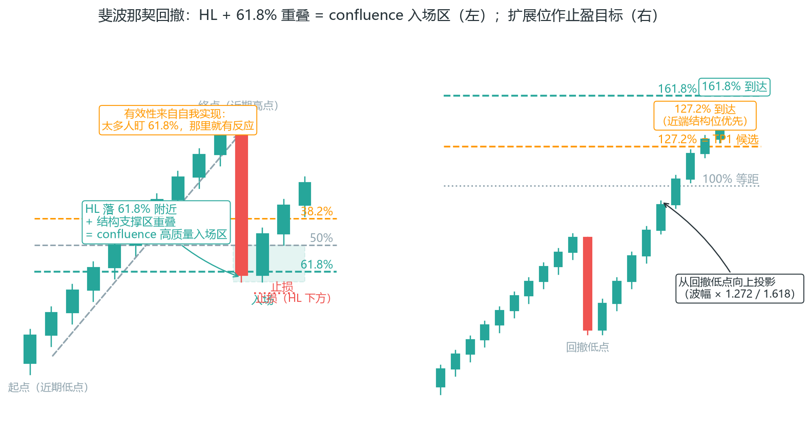

*图 4-13 斐波那契回撤：HL + 61.8% 重叠 = confluence 入场区；扩展位 = TP 候选（它没有物理定律，有效性来自自我实现）*

左图是“画法 → 入场”的完整流程：① **画法**——上升趋势里连接近期低点（起点）到近期高点（终点），自动生成 38.2%、50%、61.8% 三条回撤线；② **confluence 入场**——回调走出的 HL 恰好落在 61.8% 回撤位附近，与下方结构支撑区（阴影）重叠——这就是本书说的“多因素汇聚”：结构点（2.3）+ 斐波那契 + 前低，三个因素叠在同一个价格区，入场质量最高；③ **止损**——放 HL 低点下方，与 4.1 的规则一致；④ **诚实评价**——斐波那契背后没有物理定律，它的有效性很大程度来自自我实现：太多人盯着 61.8%，那里就有了反应——把它当汇聚因素用，别当独立入场理由。右图是扩展用法：从回撤低点向上投影波幅的 127.2%、161.8% 得到两个候选止盈目标（近端结构位优先作 TP1）；100% 等距（原波幅）是基础目标。

### 4.9 海龟交易法则：系统化趋势跟踪的鼻祖 【核心】

海龟实验（Richard Dennis，1983）证明了交易可以完全规则化、可以教会。它的规则至今是趋势跟踪系统的范本。

**核心规则（原版简化）**：

1. **入场**：价格突破 20 日最高价→做多（跌破 20 日最低→做空）。
2. **止损**：2×ATR。
3. **加仓**：每上涨 0.5×ATR 加 1 个单位，最多 4 个单位。
4. **离场**：价格跌破 10 日最低价→平仓。

**这些数字背后的机制**：20 日突破是“让趋势先走一段”的过滤器——只有价格创出 20 日新高，才说明买方已经持续压过卖方，而不是一天的随机波动；10 日离场比入场窗口短，是为了“让利润奔跑、但别让利润全部回吐”——趋势还在就给足空间，一旦短周期结构转弱就走人。2×ATR 止损不是拍脑袋：ATR 是正常噪音的尺度，止损太窄会被噪音扫掉、太宽则单笔风险失控；2 倍是“容纳正常噪音、仍能及时认错”的经验平衡。0.5×ATR 加仓的本质是**按波动率等风险加仓**——每多持有一个单位，就用 0.5×ATR 的推进来证明趋势还活着，而不是用固定价格距离（不同品种波动不同，固定距离会扭曲风险）。

**仓位管理（海龟最有价值的贡献）**：

```
1 个单位 = 账户 1% 风险 ÷ (2×ATR×每点价值)
```

即仓位大小由波动率（ATR）决定：波动越大，仓位越小。这个思想已融入第 6 章的 ATR 止损。

**金字塔加仓**：只在盈利时加仓，每次加仓有独立止损，整体止损跟随上移。这是“让利润奔跑”的正确打开方式——不是一单扛到底，而是让赢利的仓位变大。

**考核期注意**：金字塔加仓激进，不适合考核期（违背第 7 章“不加仓”军规）。学它的仓位管理和趋势跟踪哲学，别照搬加仓动作。

**海龟的意义**：它证明了“截断亏损、让利润奔跑”可以完全规则化——这是本书所有系统的思想鼻祖。海龟的规则全是客观数字（20 日、2×ATR、0.5×ATR），没有任何主观判断——这是“写死规则”的极致示范，也是它 40 年后仍然被研究的原因。

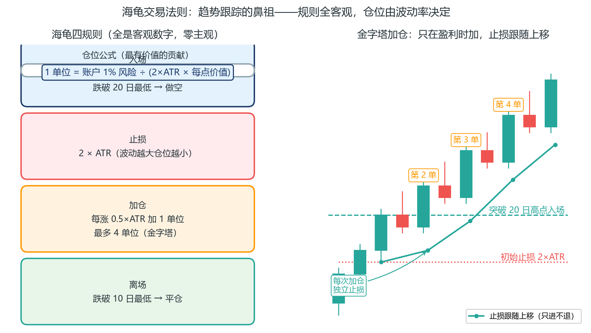

*图 4-14 海龟交易法则：规则全是客观数字、零主观判断；仓位由波动率决定——这是“写死规则”的极致示范，也是趋势跟踪系统的范本*

### 4.10 市场的两种模式：趋势跟踪 vs 均值回归 【核心】

剥开所有流派，市场其实只在两种模式间交替：趋势和区间。为什么只有两种？因为赚钱只有两种方式——**要么赌“动了还会继续动”（趋势跟踪），要么赌“动过头了会回去”（均值回归）**。没有第三种，因为任何一笔交易要么顺着惯性、要么逆着惯性。

- **趋势跟踪**：假设趋势延续——回调买入、让利润奔跑。系统一就是它。
- **均值回归**：假设价格回归均值——超卖买、超买卖、边界反向。系统二就是它。

第 4.7 的状态机，本质就是在这两种模式间切换：趋势市用趋势跟踪，区间市用均值回归。

**最常见的两种死法，都是模式用错**：

- 区间里用趋势跟踪 → 反复追突破被假突破打脸，来回被绞。
- 趋势里用均值回归 → “跌这么多该反弹了”去接飞刀，被趋势碾过。

**一个有用的辅助过滤器（均线学派的精华）**：用 200 周期均线当多空分界线——价格在 200 均线上方只做多，下方只做空。它不给你入场信号，只帮你过滤方向，减少逆势单。

**均值回归学派（布林带/RSI）和均线学派真正有用的就是上面这两点**——模式匹配和方向过滤。至于具体指标参数，是次要的。别把精力花在调 RSI 是 30 还是 25 上。指标是工具不是圣杯——布林带告诉你“现在偏离均值”（均值回归触发器），200 均线告诉你“大方向”（方向过滤器），仅此而已。

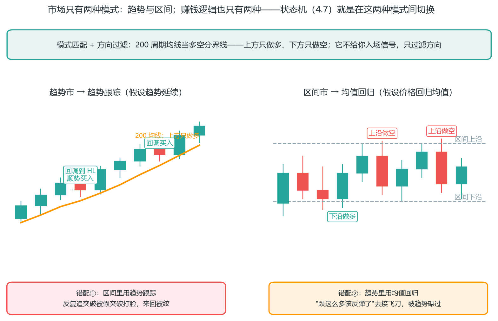

*图 4-15 市场的两种模式：最常见的两种死法都是模式用错——区间里用趋势跟踪被假突破打脸，趋势里用均值回归去接飞刀；模式匹配 + 方向过滤，指标参数是次要的*

### 4.11 Van Tharp 的系统开发框架：系统要“合身” 【核心】

第 4.1-4.10 给了你具体的系统，但 Van Tharp 在《通向财务自由之路》里提出了一个更上位的观点：

> 没有“最好”的系统，只有“适合你”的系统。系统开发不是找一个圣杯，而是设计一套和你的心理、目标、生活节奏匹配的规则。

**Van Tharp 的系统开发逻辑**：

1. **先定义你自己**：你能承受多大资金回撤（账户从高点回落的幅度，区别于价格回调）？你每天能盯盘多久？你要的是稳定小赚还是偶尔大赚？你的心理弱点是什么（第 7 章）？这些决定了什么系统“合身”。
   - 例：你白天上班只能晚上看盘 → 日内系统不适合你，波段系统才合身。
   - 例：你心理上扛不住连续亏损 → 你需要高胜率系统（哪怕盈亏比低），而不是低胜率高盈亏比系统。
2. **再设计期望值**：在“合身”的约束下，设计一个正期望值的系统（第 2-5 章的方法）。
3. **最后配仓位**：用仓位管理（第 6 章）把期望值变成稳定的资金曲线。Van Tharp 强调，仓位是系统的一部分，不是事后补的。

**这个框架的深意**：很多人到处找“最强系统”，但再强的系统，如果你执行不了（因为不合身），对你就是零。

> 一个你能一致执行的 70 分系统，远好于一个你执行不了的 95 分系统。系统的上限，是你执行它的下限。

**实践**：选系统时问自己三个问题——①我的时间精力匹配这个周期吗？②我的心理承受得住这个胜率和回撤吗？③我能一致执行它 100 笔不变形吗？三个都“是”，才是你的系统。系统为你服务，不是你为系统服务。

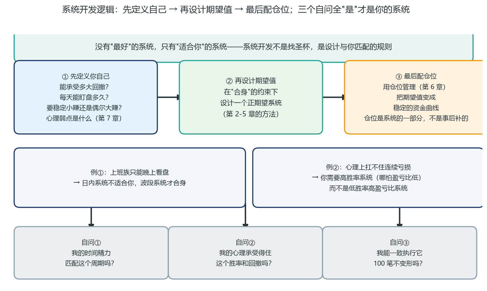

*图 4-16 Van Tharp 系统开发框架：没有“最好”的系统，只有“适合你”的系统——一个你能一致执行的 70 分系统，远好于一个你执行不了的 95 分系统；系统的上限，是你执行它的下限*

## 篇二 出场：期望值的另一半（4.12-4.20）

### 4.12 出场：期望值的另一半 【核心】

进场之后怎么办？入场只决定你上不上车，出场决定你最终赚多少、以及赚到的能不能留住。大多数人花 90% 精力研究入场，10% 都不到研究出场——这是反的。

> 一笔交易的期望值 = 胜率 × 平均盈利 − 败率 × 平均亏损。入场决定胜率的下限，出场决定平均盈利的上限。

同样的入场信号，不同的出场方式，长期期望值能差一倍。

**出场要回答三个问题**：

1. **错了怎么办**——止损（本章六要素和第 6 章已讲，入场时就定死）。
2. **对了怎么办**——止盈目标。
3. **对了之后怎么扩大**——移动止损与分批。

第 1 个在入场前就解决了。本节讲第 2、3 个。

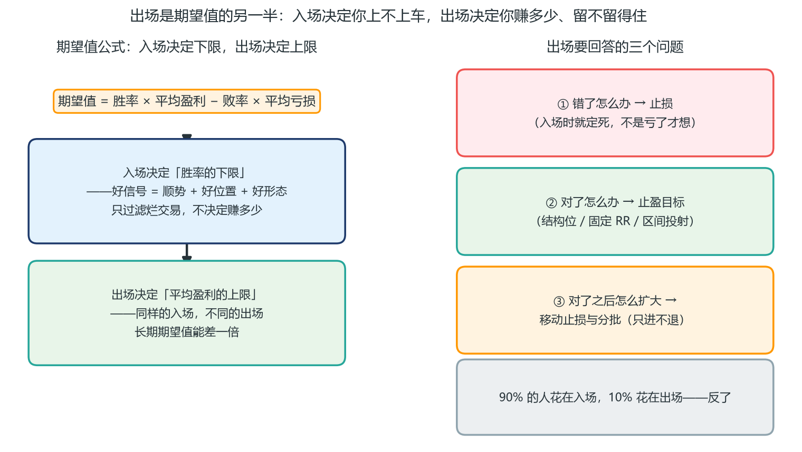

*图 4-17 出场：期望值的另一半——90% 的人研究入场，10% 研究出场，这是反的；出场要回答三个问题：错了（止损）、对了（止盈目标）、对了之后怎么扩大（移动止损与分批）*

### 4.13 止盈目标怎么定 【核心】

**三个常用锚点，按优先级**：

1. **结构位**：前高/前低、流动性池（BSL/SSL = Buy Side/Sell Side Liquidity 买方/卖方流动性，第 5 章详述）。价格倾向于去扫下一个流动性池——这是最自然的目标。
2. **固定 RR**：2R 或 3R。简单粗暴，适合新手，因为它不依赖你对行情的进一步判断。
3. **区间投射**：突破交易用区间高度投射（本章系统三）。

**原则**：目标必须在入场前定好，且 RR ≥ 2。入场后再找目标=让贪婪临时定价。

**洛氏三步目标止盈**：洛氏的三步目标本质上是在**分批处理“回本、小利、大利润”三个不同阶段**——先抵补成本，是因为交易成本是确定要付的，先把它赚回来才能让后续头寸“无成本奔跑”；小盈利目标用平均波动幅度或点数（如 S&P500 5 分钟 Rh 突破常取 50 点），是因为市场波动本身给出了“至少能走到哪”的底线；最终目标用追踪止损，是因为真正的利润来自趋势延伸而不是预设点位。三步对应 4.14 的分批止盈：先回本，再落袋，最后奔跑。

**关于 RR 门槛的两个数字（先说清，免得后面对不上）**：本节前面和 4.2 说的"RR ≥ 2"是全书给新手的默认过滤器——一个目标、一次止盈，RR 不到 2 不做。下文的两级目标法（TP1/TP2）是 Brooks 体系的精细版，其中"TP1 的 RR ≥ 1.0"只是**半仓（TP1 部分）的下限**，条件是剩余仓位拿住 TP2 结构目标，两部分合计的整单期望 RR 仍要达到 ≥ 2 的水准。两个口径的关系：单目标制 → RR≥2 硬过滤；两级目标制 → TP1≥1.0 且 TP2 必须能补足到整单 ≥2。新手先用单目标制的 RR≥2，熟练后再用两级制。

**结构位 vs 固定 RR 的选择**：结构位目标更“聪明”（它基于市场会去的地方），但需要你会画结构（第 2、5 章）；固定 RR 更机械（永远 2R 走人），胜在不用判断。折中方案：先定结构位目标，如果结构位距离不足 2R，则这笔不做——把“RR≥2”当过滤器，而不是目标本身。

**2R 目标是最低限度，不是天花板（Brooks，34B）**：以 2 倍实际风险设目标总有数学依据，**但市场可能完全忽视你的 2R 目标位——这时你也应该忽视它**，寻求更大的目标：只要市场仍处于总在场内方向（always-in 不变、前提有效），就继续持有，用测量移动目标、趋势线、前高前低作为下一层参考。**最低限度很少是最佳选择**——2R 是止损的补偿线，不是强制离场线（呼应 4.15 移动止损：前提不变就让利润奔跑；2.8 量度移动）。

**四类 Measured Move：把“目标”变成公式**（PA-23）：上文的“区间投射”只是第一类。Brooks 体系把结构目标展开成四类可计算的测量移动（MM）——每种都有自己的公式和概率底色，目标不是感觉出来的，是算出来的：

1. **区间高度翻测（约 60% 到达）**：区间上沿/下沿各被测试至少 2 次后，突破点对侧的目标 ≈ **突破点 ± 区间高度 H**（H = 上沿 − 下沿）。这是系统三（4.5）的量化目标：区间压缩越久、H 越大，翻测目标越值得做。注意 80% 的区间突破尝试失败（3.11 的 80-20 法则）——只有“尖峰级突破 + 跟随”才追，普通突破默认等测试或失败的失败。
2. **通道宽度翻测**：平行通道突破通道线后，目标 ≈ **突破点 ± 通道宽度 W**（上轨 − 下轨）。上涨通道向下破下轨时参考通道高度向下翻测——但上涨通道在长周期上常是空头旗形，向下 MM 的风险要写进风险清单。
3. **楔形高度翻测**：楔形起点到极点的垂直距离 = 楔形高 H，突破楔形对侧边界后目标 ≈ **突破点 ± H**（反转方向投影）。楔形回撤（10-20 棒）与楔形反转（≥20 棒）的 MM 方向相反——先定架构（第 3.9），再算目标。
4. **尖峰 leg 翻测（70%+）**：尖峰/强趋势腿的起点到终点距离 L，回撤后再延续的目标 ≈ **回撤低点（做多）或反弹高点（做空）+ L**。强趋势 leg 延续到达 MM 或更远的概率约 70%+，是四类里最可靠的一类。但尖峰后约 60% 恢复通道、30% 进区间——尖峰末端禁止追单。TP2 扩展：第一目标取等距 100%，**第二目标可取 138.2%/161.8% 候选**（极速行情策略）；仍以近端结构位为 TP1。

**测算法（Tefi）——AB=CD 与推动计数**：除上述四类外，Tefi 常用 **AB=CD 等距**：从 A 到 B 的推动距离，等距投射到 C 点之后得到 D 目标；它与“自回调中轴测量等距运动”结果相同。用法：先数推动（1 轮趋势常含 2-4 个顺向波段，1 个波段常含 2-4 段顺向推动；用阴阳交替断点、出现回调 K 线、连接显著高低点分段），再在 D 位附近找结构止盈。推动外观越均匀（间距、内含 K 线数、振幅接近），越容易被量化机构识别；越偏离标准型，目标可靠性越低。

**尖峰后十字星 = 深回调预警（Ali）**：如果尖峰之后的后续 K 线是一根十字星，随后的回调可能变得**很深、持续时间较长、或两者兼具**——十字星说明尖峰动能已耗尽、买卖双方重新平衡，顺势单别急着在尖峰末端追单，等回调结构（两段回撤或明确反转信号）出现（呼应 2.11 高潮 K 线、4.22 尖峰后两段回撤）。


*图 4-18 四类 Measured Move：区间高度/通道宽度/楔形高度/尖峰腿，等距投射目标*

**TP1 / TP2 两级目标：结构优先，R 倍兜底**（PA-17）：Brooks 的出场不是“一个目标”，而是两级——它同时解决“该在哪止盈”和“这笔值不值得做”：

- **TP1（主目标/保守目标）**：最近且有效的**结构位**，按优先级取：① 反向结构边界（区间近对边、通道近端、前显著 swing 高低点）；② 磁力位（失败信号极点、失败入场价，见下文）；③ 固定 R 倍数（≥1R，仅当上面都没有合理结构位时的兜底）。
- **TP2（延伸目标）**：更远的**结构目标**：① MM 投影（四类公式之一）；② 反向结构边界远端（区间/通道对边、MM 后的下一层 swing）；③ EMA20/整数关口只作次级参考，不能单独当 TP2。

**两级目标的四条纪律**：

1. **定价顺序写死**：先定 entry → TP1（结构）→ TP2（更远结构）→ 结构止损。目标与止损都在入场前定死，入场后不再改。
2. **几何硬规则**：做多 stop < entry < TP1 < TP2；做空 TP2 < TP1 < entry < stop。顺序错乱说明哪个价位定错了。
3. **RR 只用 TP1 算**：盈亏比 = (TP1 − entry) ÷ (entry − stop) ≥ 1.0（注意：这是半仓的 TP1 下限；加上 TP2 部分，整单期望 RR 仍须达到本节开头说的 ≥2 水准——TP2 补不足，就按 RR 不达标处理）。RR > 1.5 时说明 TP1 有余量，可以向外扩止损到更可靠的结构位，但以 TP1 仍 ≥ 1.0、整单仍 ≥2 为界；RR < 1.0 时收紧止损或调整入场，**禁止向外扩止损凑数**，仍不达标就放弃这笔。
4. **TP2 不参与盈亏比**——它是“锦上添花”，不是交易成立的依据。把 TP2 当依据算 RR，会让你接受本来不该做的交易（这是出场最常犯的错）。

按市场状态调两级距离：区间/趋势震荡期 TP1 取近（边界、结构位）、TP2 取区间翻测或 MM；通道/尖峰顺势 TP1 取近端结构位、TP2 用 MM 投影。

**磁力位：失败信号留下的磁场**（PA-22）：为什么价格总爱回到某个价位？因为那里留下了“未完成的交易”——止损单、失败者的入场单、被套者的割肉单。

- **磁力位清单**：失败多头信号棒的高点、失败空头信号棒的低点、失败交易的入场价、入场棒高低点、保护性止损集中区、突破点与突破缺口边缘。**趋势中失败的逆势信号极点，常直接成为顺势目标**（可作 TP1）；多次失败信号会形成后续区间边界。
- **被套交易者（Trapped Traders）**：突破方向上的交易者被迫止损离场，会加速价格反向或测试磁力位——判断方向前先问“哪一方被套”。
- **跳数陷阱（17t/41t/5t/9t）**：Brooks 观察到止损单入场者常在目标前数个跳动被扫损，形成反转：

| 缩写 | 含义 |
| --- | --- |
| 5t | 距 1 点目标差 1 跳被套 |
| 9t | 距 2 点目标差 1 跳 |
| 17t | 距 4 点目标差 1 跳 |
| 41t | 距 10 点目标差 1 跳 |

入场/止损不要紧贴“整数目标前一跳”的磁力区；**接近磁力位时胜率下降、方向概率趋近 50-50**——磁力位附近不做追单，等测试结果。
- **平台磁吸（Ledge，Ali）**：价格在短期内对某一水平测试 **4 次或更多次**却未能突破，该水平即成为平台磁吸位——**顶部数量越多，磁吸效应越强**；3 次测试只能算双顶/双底（DT），不能算有效平台，可靠性更低。平台磁吸的操作含义：① 从平台边缘发起的突破（BO）通常受限、很快回弹至平台（平台假突破 FBO 常见）——平台突破后预期回测平台区域，反向突破先于平台突破发生时其失败概率更高；② 平台突破后的回撤若不跌破突破点，是顺势入场机会；③ 小型平台通常当天突破高点并跌破低点，而若突破发生较晚（如昨日形成的平台），次日极有可能向上测试突破位直至超过其高点；④ 结构定义：至少连续三根 K 线价格相同（位于最高点或最低点），平台后接更低高点即构成三角形形态。**价格大概率会在数小时或数天内回落支撑位**——把平台当“一定会被再测试”的磁体来管理目标与回补。
- **失效条件**：入场后跌破多头入场棒低点（或升破空头入场棒高点）= 信号失败；价格快速回到失败信号另一侧 = 重新评估市场状态。失效判断必须引用具体 K 线，不是笼统的“跌破支撑”。

**统一止损设置：结构失效位，不是固定跳数**（PA 二元决策）：目标定了，止损必须配套。Brooks 体系的止损只有一条标准——**结构失效位**：

- **统一原则**：止损永远基于结构失效位，不基于固定跳数。固定跳数（如“边界外 1-3 跳”）只用作风险过滤器——判断“止损是否过大而应放弃”，不是止损本身的设置依据。
- **口径对账**：本章各系统的止损写法是同一条原则在不同场景的落地——4.1 的“HL 下方 0.5×ATR”是举例（结构外 + 波动率缓冲），4.3 的“回调低点（HL）下方”是趋势回调场景的结构失效位，下表的“信号棒极点外 1 跳”是通用写法。当信号棒就是构成结构极点的那根 K 线时，两者是同一个位置；差别只在“信号棒不在极点时，以结构极点为准”。
- **通用规则**：止损 = 信号棒极点外 1 跳（做多：信号棒低点下方 1 跳；做空：信号棒高点上方 1 跳）。资金管理阈值（8 跳动/信号棒 60% 高度）只辅助判断“过大”，不得替代结构止损。

**各市场状态的止损位置与过滤器**：

| 状态 | 止损设置位置 | 过滤器（超过则考虑放弃） |
| --- | --- | --- |
| 尖峰回撤（SPS 入场，SPS = Spike Pullback Setup 尖峰回撤入场，见 2.11） | 回撤极点外 1 跳 | 止损 > 尖峰高度 50% |
| 普通趋势/通道顺势 | 信号棒极点外 1 跳 | 止损 > 通道宽度 40% 或 > 2 倍 ATR |
| 普通区间边界 | 信号棒极点外 1 跳，边界作结构参考 | 止损 > 区间宽度 10% |
| 宽通道（边界噪声大） | 信号棒极点外 1 跳；边界刺穿频繁时扩至波段极点外 1 跳 | 止损 > 通道宽度 50% |
| 铁丝网（Barbwire） | 不做，或等突破后以突破棒极点外 1 跳止损 | 边界外 1-2 跳无效，最少 3-5 跳缓冲才考虑 |

**小型信号 K 线的止损距离（Ali）**：信号棒越小，止损必须越远——市场经常测试小型卖出信号 K 线的高点以上（或小型买入信号 K 线的低点以下）再走方向：**止损必须至少距离信号 K 线极点 3 个跳动点**；信号棒是内包线时，止损放在**外包线（母线）极点上方 2 个跳动点**（呼应 3.5 内包线止损）。别因为信号小就把止损放得更近——小信号恰恰需要给它呼吸空间。

**区间内有两个合理止损点时，取较高的那个（Brooks）**：当市场处于交易区间、有两个彼此接近的合理止损点（做空为例：信号棒高点上方 1 跳 vs 区间上沿上方）时，**通常使用较高的止损点更好——因为市场通常会超过较低的止损点，但往往到不了较高的止损点**。取高止损的同时，按第 6 章以损定仓、把仓位相应缩小。

**尾盘交易区间内必须用最宽的止损（Brooks）**：如果在一天结束时的交易区间内用止损，**必须使用最宽的止损——市场几乎总是会先触发附近的止损再走方向**，紧止损等于白送。配合"尾盘只找突破和交易区间、不找通道"使用（呼应 4.7 收盘价买入/卖出）。

**止损过大五条件**（任一成立即放弃或等更小信号）：① 止损 > 止盈目标距离（盈亏比 < 1:1）；② 止损 > 通道宽度 40%（通道态）；③ 止损 > 区间宽度 10%（区间态）；④ 止损 > 2 倍 ATR；⑤ 信号棒过长导致结构止损过大——等更小信号，**不为了进场而扩大止损**。

**交易者方程（Traders' Equation，QuantSystems 权威公式）**：止损、目标之外，决策的第三个变量是概率。公式只有一条——**收益 × 盈利概率 > 风险 × 亏损概率**（Reward × Prob(Profit) > Risk × Prob(Loss)），三个推论直接可执行：

1. **概率的范围**：大多数时间单笔概率在 40-60% 之间，强突破时可达 70%+——概率不追求 90%，60% 已经是好交易。
2. **高概率与低风险不可兼得**：高概率交易（≥ 60%）不可能同时是低风险（即亏损 < 盈利）；低风险交易（≤ 40%）不可能同时是高概率——想要正方程，低概率交易必须靠高回报（2:1 以上）来补偿。
3. **方程不过关就放弃**：算出三价后代入方程，不成立直接放弃这笔（4.25 口诀 9 的执行细则）——方程是“这笔值不值得做”的最后一道闸门。

**RR 适配三规则**（4.13 两级目标纪律 3 的完整版）：

1. **RR > 1.5**：保持 TP1/TP2 不变，可以向外扩止损到更可靠的结构失效位，**但扩到 TP1 的 RR 降至约 1.5 就停**——这里说的 RR 是 TP1 半仓口径，不是单目标制的整单 RR≥2；扩完后仍须满足“整单期望 RR ≥ 2”。
2. **RR < 1.0**：收紧止损至更近的结构失效位，或调整入场价；**禁止向外扩止损**（只会进一步压低 RR）；仍无法 ≥ 1.0 就放弃这笔。
3. **禁止缩小 TP1 凑 RR**：TP1 是结构目标、有磁力效应，不是调节变量。尖峰场景附加：扩止损上限 = 尖峰高度 50%，超过则放弃。

**突破单挂位规则**（二元决策 §11.4）：做多突破单挂在信号棒或有效突破依据 K 线高点上方 1 跳，做空挂在低点下方 1 跳；**禁止挂在 K 线实体中部、影线中部、EMA 附近、当前价附近或任意折中位置**。

**恐慌性行情中的止损执行（PA 极速下跌）**：恐慌尖峰里价格可能在止损位附近剧烈波动，市价止损触发时滑点巨大——两个应对：① **限价止损（Stop Limit，触发后转限价）**避免大滑点，代价是可能不被成交；② 或主动放宽止损 + 缩小头寸（保持总风险不变），让止损位远离噪音区。恐慌行情中“精确极点外 1 跳”这类紧止损几乎必被扫，先想好滑点预算再挂单。无法明确依据 K 线时，评估是否改挂结构支撑/阻力/通道边界/EMA 处的限价单。

### 4.14 分批止盈：兼顾落袋与奔跑 【核心】

全仓持有到目标，中途回撤会很难受；全仓在 1R 就跑，又吃不到趋势。分批是折中：

**标准方案**：

1. **到 1R**：平掉 50% 仓位，同时把剩余仓位的止损移到入场价（保本）。
2. **剩余 50%**：让利润跑向最终目标（结构位/流动性池）。

这笔交易的结果从此只有三种：小赚（保本出场）、中赚（1R 部分）、大赚（剩余部分到目标）。不再有“赚了又还回去”的亏损——**这是分批最大的心理价值**。

**代价**：如果行情直接冲到底，你少赚了一半。接受这个代价——你要的是稳定的期望值曲线，不是单笔最大化。

**Brooks 的默认止盈档（不确定行情强弱时的备选）**：1R 平 50% 是"标准档"；Brooks 另给了一个"不确定怎么处理时"的默认档——**到 2 倍初始风险平一半，到 3 倍初始风险再平 25%，剩余仓位做波段、跟踪止损，收盘前退出**（这套默认计划在 7.7 也出现过，两处一致：它是 Brooks 的通用出场默认值）。两档的关系：标准档更保守（1R 就落袋一半，适合新手/震荡市），Brooks 档更激进（2R 才减半，适合趋势日）；行情强弱判断不了时，按 Brooks 档执行，别临时改。

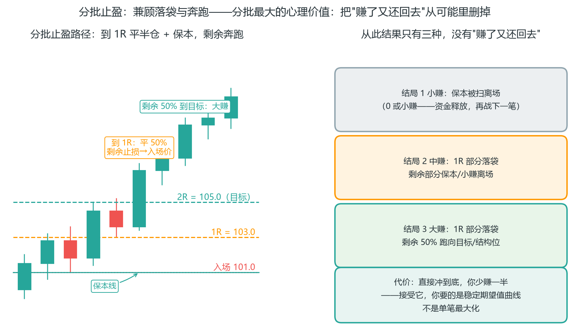

*图 4-19 分批止盈：从可能里删掉“赚了又还回去”——这是分批最大的心理价值；代价是直接冲到底时少赚一半，接受它*

### 4.15 移动止损：让利润奔跑的机制 【核心】

剩余仓位怎么跟？两种主流方式：

**结构移动法（推荐）**：上升趋势里，每出现一个新的 HL（更高的低点），就把止损移到该 HL 下方。价格不跌破结构，你就一直拿着；跌破结构，说明趋势可能结束，止损离场。

**ATR 移动法**：止损保持在价格后方 k×ATR（k 取 1.5-2），随价格推进。适合不想盯结构的人，但容易被正常回调扫掉。

**通道宽度节奏法**（Brooks 通道策略）：通道趋势中，止损移动有量化节奏——初始止损按信号棒法设置；**价格向有利方向移动超过 1 倍通道宽度后，止损移至盈亏平衡点**；此后**每推进 0.5 倍通道宽度，止损移动一次**。窄通道中跟踪更积极（每次移动幅度小、跟得紧），宽通道中给更多空间。通道越接近尾声，越不要放松跟踪——真空效应（4.22）常让末期行情走完最后一段加速。

**关键纪律**：移动止损只能朝有利方向移，永不后退。后退=给亏损重新开门。

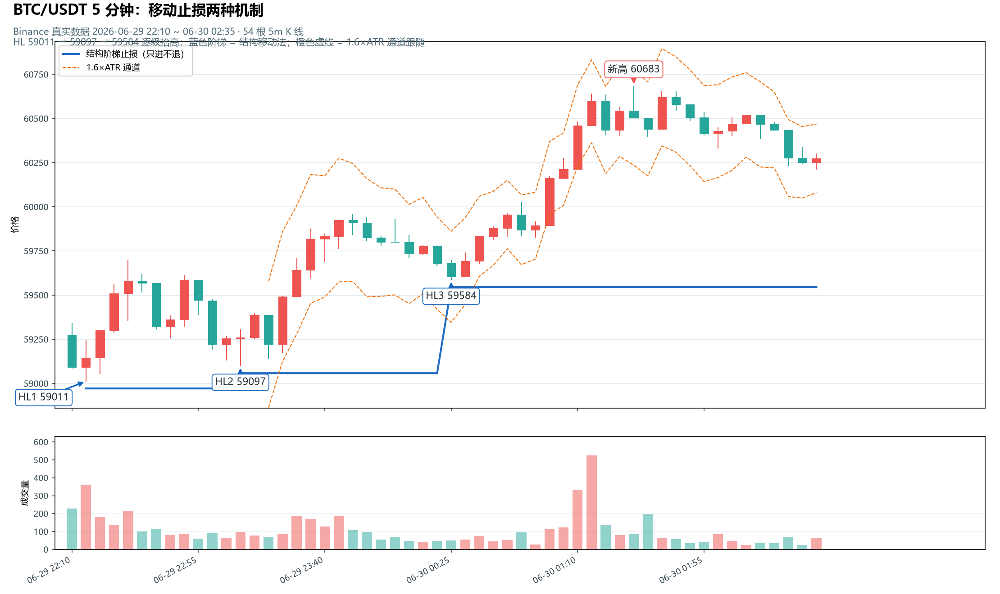

*图 4-6R 真实数据：移动止损机制（数据源：Binance BTCUSDT 5m，2026-06-29 22:10 ~ 06-30 02:35）：结构法用 HL 确认时机，ATR 法用通道跟随——两条线都只朝有利方向走*

看图上两条止损线：蓝色阶梯每出现一个新 HL 就抬一级（22:15 的 HL1 59011 → 23:10 的 HL2 59097 → 00:25 的 HL3 59584，每个 HL 下方 40 点）——价格不破结构就一直拿着，01:30 新高 60683，趋势的钱吃满；橙色虚线是 1.6×ATR 通道，随价格推进自动跟随——注意 23:10 前后的正常回调插破了通道下沿：**这就是 ATR 法的代价，省心但要承受被正常波动扫掉的风险**。**选哪种不关键，关键是不后退**：任何把止损往回移的动作，都是在给亏损重新开门。

**移动止损的执行细节**：止损移动的时机是“新结构确认”（新 HL 收盘确认后），不是“价格刚创新高”（那还不一定是 HL）。过早移动会被回踩扫掉，过晚移动会回吐利润——确认新 HL 的标准和第 2.3 判断结构的标准一致：收盘高于前低。

**入场价被测试两次则退出（Ali）**：市场在触发新信号后，通常先运行到盈亏平衡点止损、然后恢复趋势——所以**允许盈亏平衡点价格被测试一次，但不能两次**：第二次测试入场价时退出（2PB 开始），因为二次入场信号转变为相反趋势的概率更高。例：做多后价格回踩你的入场价一次 → 继续持有；第二次再踩到入场价 → 平仓或反手。执行上：若市场在你退出后恢复，可重新入场（新信号，不是旧仓位）。

**第二入场点（2E）与第二腿（2LT）（Ali）**：

**二次入场点 2E（Second Entry）**：2E 比首次入场（1E）胜率更高、持仓更久：首次入场通常是短线交易，二次入场是波段交易（或更大的短线）；2E 可能比 1E 形成于同一价位（双顶/双底），也可能更高或更低——由于是二次失败突破，其反转概率更高。执行细则：① **1 号入场必须触发后失效**，2 号入场点必须设置在比 1 号更有利的价格；② 入场前至少 3-4 根连续 K 线趋势（2 根可接受）；③ 选择 2 号入场点，有超过 60% 概率至少触及 1 号入场点；④ 重要磁体处的信号更可靠；⑤ 1 号入场信号 K 线必须强劲。原则：**逆势动量强劲时不要入场，确定好二次加仓位置，等形态确立后把它当作首次入场**；市场动量越弱越可采用首次入场（反转所需动能小）。

**第二腿 2LT（Second Leg Trap）**：TRD/TTRD 中的第二腿往往比第一腿更强——但注意：**2LT 看起来是新的，实际上是两段式陷阱**，通常小幅突破后反转形成失败突破。识别条件：① 交易区间内的 2LT 需要一根强劲的信号 K 线；② 至少需要一个小波段；③ 卖出信号 K 线后的跟进很重要（连续看跌 K 线 = 2LT，K 线反转 = 旗形）。**2LT 向磁吸位的波动必须迅速、高潮迭起且情绪化，否则很可能只是突破**——缺乏这种动能的 2LT 不可靠；当市场维持在某支撑/阻力下方时，2LT 反转概率更高。区间内双腿形态有 80% 概率演变成失败突破并快速反转——若微通道本身是区间内的双腿形态，沿微通道方向的首次回踩失败率极高。

**2LT 持仓管理**：强势 2LT 本质是收盘价买入/卖出的变体，且所有 2LT 本质上都是 FBO——出现**强烈反转 K 线立即退出**；若随后出现三根同向反向 K 线且至少一根强烈，也应退出。别把 2LT 当趋势单硬拿，它的利润来源是“陷阱反向”的快速段。

**交易情境决定订单类型**：顺势方向交易优先用限价单而非止损单；预期突破行情时**不要逆势挂限价单**——应等突破失败信号出现后，用止损单或市价入场；若使用限价单，应等亏损方放弃离场时用盈亏平衡点退出；仅在支撑位下方逆势操作、且前期存在多头力量迹象时才逆势（反之亦然）；仅当市场特征转变且有明确证据支持时才进行逆势操作。

### 4.16 保本时机：别移太早 【核心】

把止损移到入场价（保本）是好事，但移太早是常见错误：价格刚到 1R 就保本，一个正常回调就把你扫出去，然后行情奔目标而去。

**经验法则**：

- 至少到 1R 再保本（配合分批）。
- 如果波动大（ATR 高），等到 1.5R。
- 保本后接受“被扫个保本”——这不亏钱，只是少赚，比“赚了还回去”好得多。

**为什么保本“被扫”不是坏事**：保本单被扫 = 你这笔 0 成本离场 + 你的资金被释放可以再战。它证明了“保本”机制在工作——你消灭了亏损的可能。情绪上，被扫保本比止损离场舒服得多，这正是保本的心理学价值。

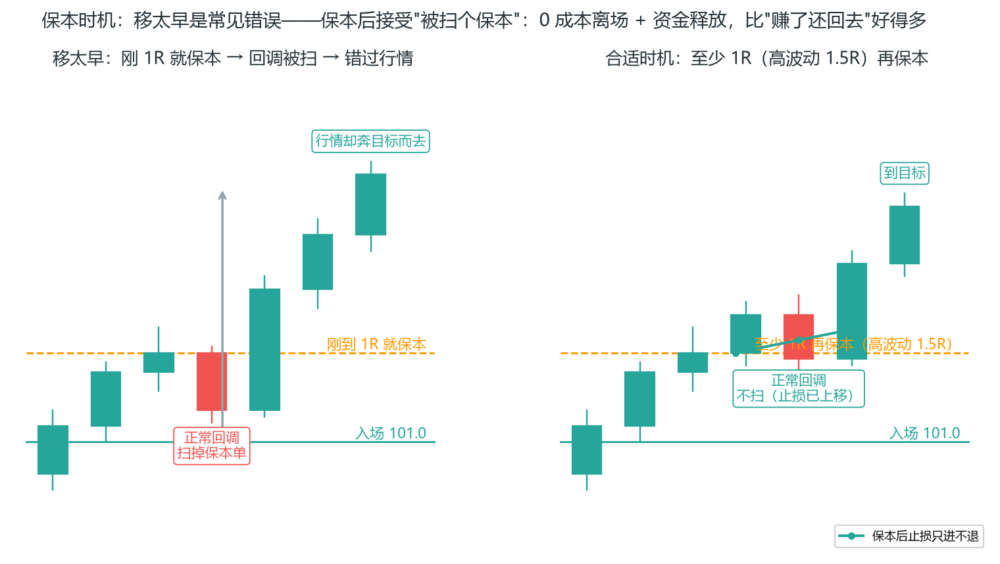

*图 4-20 保本时机：别移太早——保本后接受“被扫个保本”：0 成本离场 + 资金释放，比“赚了还回去”好得多*

### 4.17 时间止损：不动也是风险 【核心】

入场后，如果价格长时间不动（既不触发止损也不向目标走），说明你的入场逻辑可能没兑现。

**规则示例**：入场后 5-8 根 K 线（按你的交易周期）仍在入场价附近徘徊 → 主动离场或减半仓。（PA 资料口径为 5-10 根——本质相同：**限价单入场可多给 1-2 根容差，追突破单用更紧的窗口**；窄通道中的限价单尤其适用时间止损。）

**理由**：持仓占用保证金、承受隔夜利息和突发风险，却没有换来预期的移动。**时间也是成本**。这条对考核期尤其重要——资金效率低会拖长达标时间（第 9 章达标数学）。

**时间止损的另一种形式——信号失效**：入场逻辑成立的前提（如“回调到 HL”）已经变化（价格又走出了新结构），即使价格没到止损，这笔的“为什么”已经不存在了——主动离场。别等价格来打你的止损，等逻辑失效就该走。

**逆向动量分档退出（Ali）——不等止损，先动手**：持有多头时，一旦逆向动量按“档位”升级，就该主动退出，别等价格来打止损（空头镜像）：① **1 根极大逆向 K 线**（如大阴线）——最强警告，直接退出或至少减半；② **连续 2 根强势逆向收盘 K 线**（E-mini 约 20-21 点规模）——逆势方开始持续压制，退出；③ **连续 3 根中等逆向收盘 K 线**（约 63-65 点规模）——动量已确认反转，必须退出；④ **连续 4 根小幅逆向收盘 K 线**——阴跌不止，离场。逻辑：止损是最后防线，不是第一反应——**在止损被触及之前，逆向动量分级就是“提前止损”**；档位越高越接近止损位，主动退出比被动扫损少亏（呼应 4.18 结局 A“破结构止损离场”与 6.10 动能转换快速减仓）。

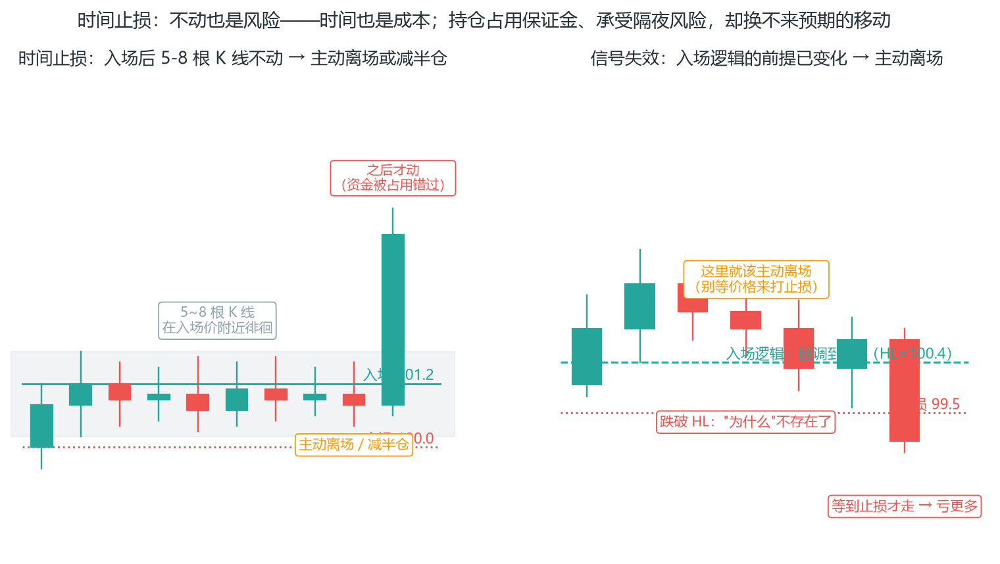

*图 4-21 时间止损：不动也是风险——时间也是成本，持仓占用保证金、承受隔夜风险，却换不来预期的移动；对考核期尤其重要（资金效率拖长达标时间）*

### 4.18 一笔交易的完整生命周期 【核心】

把入场到出场串起来（以做多趋势回调为例）：

- **入场前**：背景✓ 位置✓ 信号✓ → 算好止损/目标/仓位（本章六要素+第 6 章）
- **入场**：信号确认，挂单成交，止损单同时挂好
- **到 1R**：平 50%，剩余止损移到入场价（保本）
- **推进中**：每出新 HL，止损上移（结构移动法）
- **结局 A**：跌破结构 → 剩余仓位止损离场（锁定部分利润）
- **结局 B**：到达流动性池/目标 → 全部止盈
- **例外**：8 根 K 线不动 → 时间止损，主动离场

**注意整个生命周期里“决策”只发生两次**：入场前（计划）和到 1R 时（分批）。其余全是机械执行——这就是“思考留给冷静时刻，执行交给机械盘中”的完整示范。

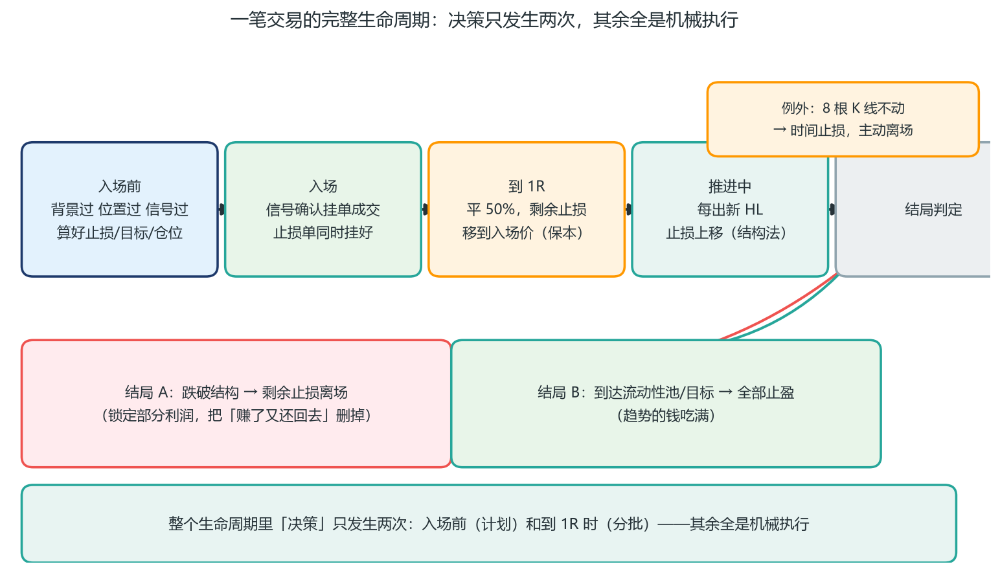

*图 4-22 一笔交易的完整生命周期：决策只发生两次（入场前计划、到 1R 时分批），其余全是机械执行——把“赚了又还回去”从可能里删掉*

### 4.19 完整案例：一笔交易从入场到出场 【核心】

用一个带数字的全流程，串起所有出场规则（做多，趋势回调）：

1. **入场**：4H 上升趋势，1H 回调到 HL 区+锤子。入场 1.1090，止损 1.1065（25 pips=1R），目标 1.1150（60 pips≈2.4R），下 2 手。
2. **到 1R（1.1115）**：平掉 1 手（分批止盈），剩余 1 手止损移到入场价 1.1090（保本）。
3. **价格新高、出现新 HL（1.1120）**：止损上移到 1.1120 下方（结构移动）。
4. **继续到 1.1145、新 HL（1.1135）**：止损上移到 1.1135 下方。
5. **结局 A**：价格到目标 1.1150 → 平剩余仓位。总盈利 ≈ 前半仓 25 pips（1R 落袋）+ 后半仓 60 pips。
6. **结局 B**：价格未到目标，回调跌破 1.1135 → 剩余仓位止损离场（锁定 45 pips）。总盈利 ≈ 前半仓 25 pips（1R 落袋）+ 后半仓 45 pips。

**关键**：从第 2 步起，这笔交易已经不可能亏——最差结果是保本或小赚。这就是分批+保本的价值：**把“赚了又还回去”从可能里删掉**。

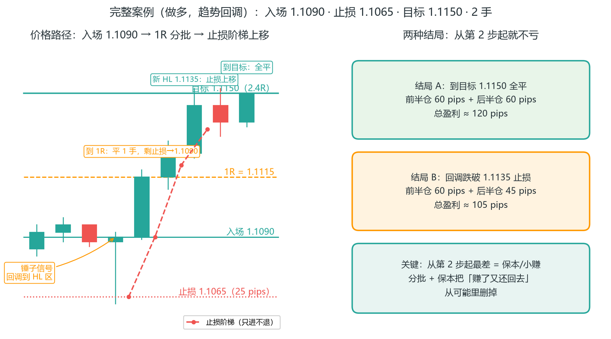

*图 4-23 完整案例：从第 2 步起这笔交易已经不可能亏——分批 + 保本把“赚了又还回去”从可能里删掉；最差结果是保本或小赚*

### 4.20 不同市场状态下的出场调整 【核心】

出场策略不是一刀切，按市场状态调：

- **趋势明确：让利润奔跑，用结构移动止损，不轻易止盈**。机制：趋势状态里盈利分布是右偏的——少数大趋势贡献大部分利润，过早止盈等于把右尾截掉，整套系统的期望值立刻下降。移动止损不是“怕回吐”，而是在“保护已实现利润”和“让右尾展开”之间取平衡：只有新结构确认才上移，不用主观目标提前下车（系统一思维）。
- **区间震荡：边界止盈，不贪**。机制：区间是均值回归市场，价格在上下边界之间来回，盈利分布有界；越接近边界，反向回归的概率越高，继续持有的边际期望为负。所以目标不是“猜一个数”，而是区间的物理边界——到中线/边界就落袋（系统二思维）。
- **高波动（ATR 大）：放宽止损、减小仓位，目标可放大**。机制：ATR 是“正常噪音”的尺度。波动大时，同样距离的止损更容易被噪音扫掉，所以止损要按 ATR 成比例放宽；同时第 6 章的仓位公式会让仓位反比缩小——单笔风险金额不变、每 1R 的距离变大，仓位自然变小。目标也可以放大，因为波动大意味着潜在的位移空间大。
- **低波动（ATR 小）：收紧目标，注意时间止损**。机制：波动小意味着价格在单位时间里走不远；若还按高波动时的距离设目标，可能等到天荒地老也不触发。这时要么收紧目标（匹配当前可实现的位移），要么设时间止损——机会成本是真实的成本：资金被困在不动行情里，就错过了其他地方的机会。
- **数据公布前：收紧止损或减仓**。机制：数据瞬间不是“正常市场”，而是价格行为短暂失真的例外（第 1.8）：点差扩大、流动性抽走、止损可能被跳过。持仓的风险分布不是回测里的分布，主动降敞口等于把“未知跳空”的尾部风险先切掉。

**核心**：入场决定胜率下限，出场按市场状态调整，才能把盈利上限最大化。

**出场工具的另一个维度：期权（进阶，学完第 10 章再看）**：篇二所有出场方法都用一个工具管理风险——**价格**（止损单、移动止损）。期权给了你同一种需求的“合约版”：

- **保护性 Put = 时间版止损**：止损单会在震荡里被扫掉，Put 保险只要不行权仓位还能继续拿（10.6 用途一）——适合“趋势还想拿，但怕黑天鹅”的持仓；代价是保费。
- **垂直价差 = 下单即物理锁死最大亏损**：买入时就把最大亏损和最大盈利都封顶，比裸持仓更确定（10.6 用途三）——适合小资金表达方向。

一句话：**出场用价格管理风险，期权用合约管理风险**。两者不冲突——第 10 章学完后回来对比，你会发现期权只是给“锁最坏情况、让利润奔跑”这两个目标各多了一种实现方式。

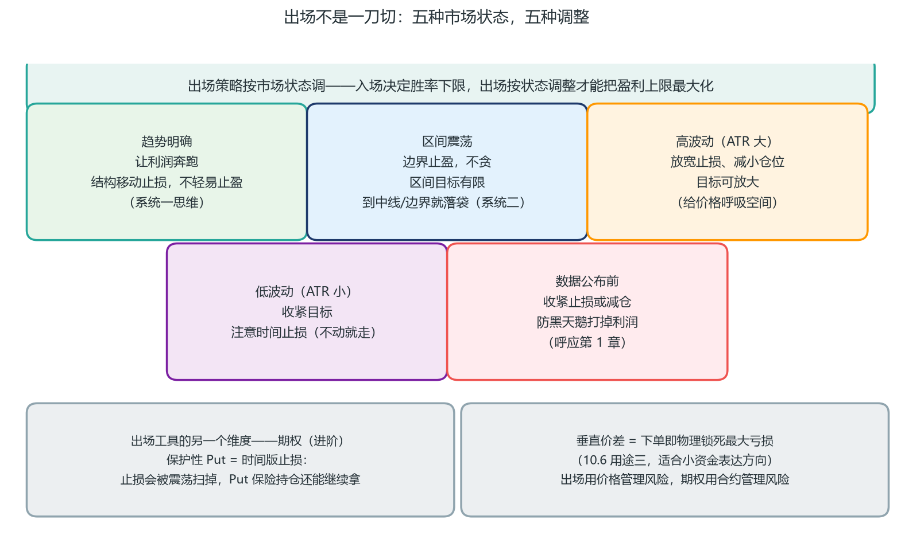

*图 4-24 出场按市场状态调整：入场决定胜率下限，出场按状态调整才能把盈利上限最大化——趋势用价格管理风险，期权（进阶）用合约管理风险*

## 篇三 高级入场结构（4.21-4.25）

### 4.21 突破单三模型（实战课）

前面系统三讲了突破交易的通用规则。这里把“突破单”拆成三种具体模型，每种都有明确的触发条件和过滤条件——实战课把它浓缩为三句话：**顺大逆小、二次确认、结构反转**（本节核心规则来自南桥《5 分钟价格行为策略》公开 PPT，2025-12）。

**模型一：趋势回调突破单（H2/L2，顺大逆小）**

适用：强趋势 + 窄通道或强突破后的首次回调。

- 大方向明确（HTF 趋势向上/向下），回调属于逆势段。
- 只在两种情况下做：突破很强（大实体+放量）或通道很窄（微通道，见 4.6）。
- **逆市回调必须“两段式”**（A-B-C 回调）：一段就结束的回调是 V 反而不是回调，突破延续的概率低。
- **信号 K 必须与建仓方向一致**：做多用阳线确认（H2 用阳线低点入场），做空用阴线确认（L2 用阴线高点入场）。
- 入场：信号 K 极值外侧 1 tick；止损：信号 K 极值外侧 1 tick（紧凑止损）。

**模型二：二次突破确认单（失败的失败）**

适用：第一次突破失败（假突破，见 3.2）后，市场第二次尝试突破。

- 突破 K 必须**实体突破**（收盘超越关键位），影线插破不算。
- 确认窗口：**3 根 K 线内必须完成二次突破**，否则结构退化、放弃这笔。
- 入场：第二次突破 K 的极值外 1 tick。
- 逻辑：第一次失败已经洗掉弱手，第二次突破时对手盘更少、成功率更高。这是第 3.2“假突破”的顺势版本——假突破后别反向，先看第二次尝试。


*图 4-25 二次突破确认：第一次突破失败洗掉弱手，3 根 K 线内二次突破，实体收盘入场*

**模型三：关键位结构反转突破单**

适用：关键位（双顶双底、高2低2、楔形、头肩顶底、OB/IB，见 3.9）处的结构反转。

- 先有结构反转（CHoCH，见 5.4），再有突破确认。
- 入场：突破关键位的极值外 1 tick。
- 这是“反转 + 突破”的组合单：结构反转只给方向，突破确认给入场。

**三个模型的共同纪律**：只做与 HTF 方向一致的突破；突破 K 必须有实体位移（收盘远离关键位）；不做“插破即追”。

**关键位形态深化：三角形四类与双顶底（PA-27/28）**：模型三说“双顶双底、楔形、头肩”是反转关键位，Brooks 体系把它们再拆细一层：

**三角形的本质是交易区间中的特殊收敛**，四类：

| 类型 | 结构 | 偏向 | 规则 |
| --- | --- | --- | --- |
| 上升三角形 | 上边界水平（阻力）+ 下边界抬高（HL） | 向上突破略高 | 须跟随确认；1-2 次触顶/下轨不清晰则无效 |
| 下降三角形 | 下边界水平（支撑）+ 上边界降低（LH） | 向下突破略高 | 下轨多次刺穿未收稳则无效 |
| 对称三角形 | 上边界下降 + 下边界上升，双向收敛 | 不确定 | **禁止提前赌方向**；等收盘突破 + 跟随；目标 = 三角形最大宽度 MM |
| 扩张三角形 | 边界向外扩散，波动加大 | — | **不交易**，仅观察（波动扩张=方向不明） |

三角形的交易规则与区间一致：**80% 的突破尝试失败，普通突破不追**（3.11 的 80-20 法则）；边界入场优先第二次触边 + 反转信号棒（且与 direction 一致）；突破须尖峰级或强趋势棒 + 跟随、或“失败的失败”后二次入场——禁止追第一根突破棒；目标 = 三角形高度 MM（第 4.13 的 MM 公式一：区间高度翻测）。三角形与楔形的区别：三角形的边常水平或单向下倾、三推非必须；楔形两边同向倾斜、必须三推。

**双顶/双底（DT/DB）**：价格两次测试相近高点/低点，第二次未能创新高/新低后反转。三个有效条件：① 两次极点价位接近（允许小幅刺破，收盘不确认新高/新低）；② 第二次测试后出现反向趋势棒或明确信号棒；③ 中间有清晰回撤（颈线区域可识别）。**三种无效情形**：第二次大幅创新高/新低（只是趋势延续）、铁丝网/区间中部小波动的“假双顶”、仅单根长上影无第二次结构化测试。

**二次测试优先（双顶底的灵魂）**：第一次触顶/底可能是正常回撤——**不追、不下单**；第二次触顶/底失败才确认极点（反转*可能*发生）；突破颈线后的回撤是 Brooks 的二次入场背景（呼应 3.12 模式四 H2/L2）。失效条件：第二次极点被收盘突破。双顶底常是 MTR 的“前极点测试失败”环节（第 3.9 四组件之四）——仅有双顶形态而无趋势线突破，只是反转尝试，不是 MTR。

### 4.22 限价单四模型：把入场价定在“等你的地方”

突破单是追市场，限价单是等市场。限价单的优势是入场价精确、永不滑点（第 1.3），代价是可能不成交（错过不亏钱，第 7 章军规第 8 条）。四种模型：

**模型一：区间前高前低限价反转（固定 1:1）**

- 窄区间：前高挂限价做空 / 前低挂限价做多，固定 1:1 盈亏比，止损在边界外。
- 宽区间：止损必须宽，所以**必须配强制退出**（时间止损或到 1R 强制平仓）——否则宽止损 × 1:1 目标，盈亏比失衡。
- **ATR 分级硬规则（南桥）**：窄区间 = 区间高度 < ATR 的 3 倍 → 固定 1:1，简单止损；宽区间 = 高度明显大于 ATR 3 倍（区间内已有 2-3 次单边推动）→ 用宽止损，但必须配**强制退出机制：突破 K + 跟随 K，跟随 K 极值外 1 tick 突破止损**。区间高度用 ATR 量化（6.5），“窄/宽”不再靠感觉。


*图 4-26 区间限价单：前高挂限价空 / 前低挂限价多，固定 1:1，等市场来找你*

**模型二：宽通道 point 3 限价反转**

- 通道内价格走出 P1→P2→P3 三段推演（三推结构，见 3.9 楔形）。
- 在 P3 位置提前挂限价单做反转。
- 这是把“楔形三推”做成挂单：P1/P2 确认后，P3 的位置可以提前算出，价格到 P3 自动成交。
- **P3 的定义（南桥）**：基于通道前两个高低点（P1、P2）推演出的“第三次关键测试位”——P3 是提前挂单的核心入场点，不是事后画线。**止损（南桥）**：实体突破通道线 + 跟随 K → 跟随 K 极值外 1 tick 突破止损。

**模型三：趋势 50% 回调限价顺势**

- 强趋势中的回调，回落到趋势段的 50%（第 4.8 斐波那契）。
- 回调必须两段式，或**连续 3 根逆势 K 线内结束**（超过 3 根说明回调在扩展，不是上车点）。
- 在 50% 位挂限价顺势单，止损在回调低点外。
- **概率底色（Brooks）**：强趋势的 50% 回撤位是"中性盈亏比 + 高概率"——多头趋势中回调小于 50% 概率偏多、跌破中点概率降至 50% 左右；**空头趋势中在 50% 回撤位挂空单，触及上方止损之前，至少有 60% 概率先测试前低**。这就是"50% 回调限价顺势"值得做的统计依据：入场位天然在"测试前低"路径上，止损离得远也不怕被立即打。
- **南桥的禁止与退出**：禁止“单段连续 3 根反向趋势 K”（那已不是回调而是反转，视为趋势反转信号）；成交后若触发 K 为强反向趋势 K 且收盘破 50% 位 → 极值外 1 tick 止损；或成交后恰好形成连续 3 根逆势 K → 该 K 线极值外 1 tick 止损。

**模型四：真突破后回踩限价顺势（trapped 对手盘）**

- 前提：突破 K 必须强势实体（收盘 ≥ 实体 50% 处），且跟随 K 延续（第 3.11 突破概率）。
- 真突破后，追突破被套的人（trapped 多头/空头）会在回踩时割肉离场——回踩入场就是接他们的对手盘，方向与他们相反。
- 回踩到突破位附近挂限价顺势单。
- 注意：突破后直接延续不回踩 = 错过，接受它——回踩单是“可遇不可求”，不是“必做”。
- **南桥的禁止条件**：突破 K 或跟随 K 若出现十字星、弱实体或明显犹豫形态，即使价格短暂越过关键位也禁止使用本模型——能量已在犹豫中释放，"trapped"的前提不成立。

**限价单通用纪律**：挂单价 = 信号位极值或结构位；挂单必须设时效（第 1.3）；到价没成交不追（追 = 又变回突破单）。

**未成交限价单 = 力量的标志（Ali）**：价格**没碰到**你挂的限价单就掉头走了——别以为错过，这恰恰是力量的证据：说明在你挂单的那个价位**之前**，已经有人抢先买入/卖出（限价单排队），价格到不了你那儿。所以"挂单没成交"不是"运气差"，是"有更强的对手先到了"。例外一条：**突破后价格快速回到原结构内（突破失败）**——这时"没成交"要重新解读，低点下方测试通常有良好背景。判断口诀：普通回调没成交 = 力量；突破失败后没成交 = 结构变了，重新评估。

**未成交限价单的另一种处理：前提仍有效就转市价（Ali，卡片 99）**：挂单没成交时，先观察入场 K 线的形成过程、根据整体情况判断入场是否仍然有效——如果**交易前提仍然成立、且有足够空间达到磁力位**（至少够做一次短线），**将限价单转换为市价单**，最好在 **15-20 秒内**做出决定；拖太久，前提可能已经变了。注意与“到价没成交不追”的区别：那条纪律针对盲目追价；本条要求先重新评估前提、且限定 15-20 秒内决断——前提不成立就坚决放弃（呼应 1.3 挂单时效）。


**通道量化分类：先测回撤，再定打法**（PA-13）：4.22 模型二提到“宽通道”，Brooks 体系的通道不是凭感觉分的——**主分类键是“最近一波回撤占前一波推进的百分比”**，斜率和视觉宽度只作辅助描述。为什么放在 4.22？因为限价单四模型里很多入场位落在通道边界/回调位——先分清通道类型，才知道该用哪个模型、挂在哪一侧：

| 特征 | 窄/紧凑通道 | 常规通道 | 宽通道/台阶 |
| --- | --- | --- | --- |
| 主判定：最近回撤 | < 30% | 30%-50% | 50%-78.6% |
| 斜率（辅助） | 大，常 > 45° | 适中 | 小，常 < 30° |
| K 线重叠 | 几乎无 | 中等 | 较多（锯齿形） |
| 趋势棒比例 | > 65% | 约 50% | 30-50% |
| 交易方向 | 只做顺势 | 只做顺势 | 仅顺主方向；**禁止通道对侧逆势刮头皮** |
| 突破特征 | 第一个逆势突破通常失败 | 等回撤/测试 | 几乎每次突破后都有测试 |
| 长程结构对应 | 尖峰（Spike） | 通道期 | 倾斜交易区间 |

**三类通道的对应打法**：

- **窄通道**：连续趋势棒、几乎无回撤，持续 5-20 根，本质是尖峰阶段。回撤极少可能等不到——最佳入场是**突破趋势线后迅速回到通道内**（突破失败入场）；**第一个逆势突破通常失败**，不要在第一次突破时逆势。
- **常规通道**：波段清晰、顺势仍占优。只做顺势，禁止通道边界逆势刮头皮。
- **宽通道（台阶）**：多空都有力量但一方略占优，可持续数十到上百根。打法 = 顺势优先 + 突破测试：**几乎每次突破后都会回来测试突破点**——测试成功（回测突破点后继续原方向）= 顺势入场机会；测试失败（回测后反向突破）= 反转背景。上升台阶中每个回撤都是买入机会、下降台阶每个反弹都是卖出机会；**台阶幅度相等时趋势最健康**。

**宽通道的回调深度分水岭（Brooks，12A）**：宽幅空头通道里，**只要回调幅度低于前期抛售高度的 2/3，市场都更可能继续走低；一旦回调达到 2/3，走低还是走高的概率变成一半一半**——2/3（≈66.7%，介于 61.8% 与 78.6% 之间）就是宽通道多空力量的分水岭：回调不到 2/3 = 空方仍占优，反弹就是卖出机会（把“回调到 2/3 处仍未突破”当作继续持有/加仓的依据）；回调吃掉 2/3 = 抛压被消化、空头优势消耗殆尽，别再依赖通道方向——按区间或反转处理（多头通道镜像；呼应 4.8 斐波那契 61.8% 与本节宽通道 50-78.6% 分类）。

**微型通道（常见 2-10 根）**（此处 2-10 根是常见段长的经验范围；判定的可编程标准以 4.6 为准：至少 3 根同向 K 线且相邻低点不重叠）：窄通道的极端形式，几乎无回撤，多数 K 线高低点沿同方向推进。它最重要的交易特征：**突破通常失败**——突破失败后价格回到通道内沿原方向继续，所以“等微型通道突破失败再顺势入场”是高概率交易。但注意：微型通道出现在趋势末端时可能是高潮（突破后趋势反转），出现在趋势中段才可顺势。

**台阶的两种变形 = 动能仪表盘**：

- **收缩台阶**（每个后续突破幅度 < 前一个）：动能衰退的信号，最后一个台阶可能是陷阱——看似趋势延续但动能不足。**不追最后一推**，顺势方案降级。**量化（PA 下跌通道）**：收缩台阶结束后的向上突破概率约从 50% 提升至 **65%**（至少三段台阶递减才确认；最后一轮下推最弱，容易形成空头陷阱 Bear Trap）——动能背离是唯一信号：价格创新低、每次下推力度却在减弱。
- **加速台阶**（后续突破幅度 > 前一个）：可能突然加速突破趋势通道，形成买入/卖出高潮——警惕“最后的加速”。

**通道转换信号**：窄→宽（出现大反向 K、回撤触及趋势线、重叠增多）= 趋势减速；宽→窄（回撤变小、K 线实体变大、连续趋势棒）= 趋势加速；宽→区间（价格在通道线间来回震荡）= 趋势结束，切换区间策略。通道线是主观的——不同画法可能得出不同结论，回撤百分比才是客观判据。


*图 4-27 通道量化分类：窄/宽/微型——先测回撤百分比，再定打法；微型通道突破必失败，是顺势入场机会*

**通道的深层身份：上涨通道 = 空头旗形**（PA 上涨通道）——这是 Brooks 体系最重要的通道认知之一：

- 通道的本质是**倾斜的交易区间**（Inclining Trading Range）：通道不是纯粹的强势趋势，而是多空双方在倾斜边界内反复博弈的结果。
- 为什么是空头旗形：通道的上行斜率消耗多头动能；每次新高后的回撤表明空头在逐步积累；上边界的多次触及给空头提供了明确的止损参考。
- 实际含义：**大多数向上突破通道线的尝试会失败**（时间窗：**多数向上突破在 5 根 K 线内失败**——突破后 5 根内跌回通道 = 假突破，别追；若回撤很小且迅速恢复上涨，才是有效突破）；最终向下突破趋势线的概率更高；通道持续时间越长，向下突破概率越大。
- 交易含义：不在通道上边界追多；顺势做多只在回撤到趋势线/EMA20 附近（H1/H2）；时刻警惕通道突然向下突破——**仅作反转诊断，逆势不下单**（呼应 4.23 逆 Always In）。
- 镜像：下跌通道 = 多头旗形——同样的逻辑，方向相反。

**通道线四种画法：画法随通道阶段演进**（避免主观性）：

1. **平行线法**（首选，通道候选期）：趋势线平移过最近的波段高点，简单直观。3 个以上高点偏离平行线超过 10% → 切换方法二。
2. **波段点法**（中期/扩张时）：独立连接相邻两个波段高点，不要求与趋势线严格平行。波段高点 ≥5 个时 → 切换方法三。
3. **最佳拟合线法**（成熟期）：使线两侧的高点数量与偏离程度均衡，消除单点偏差，通道边界最稳健。
4. **趋势线平行投影法**（异常刺穿时）：以距趋势线最远的波段高点为基准做平行线，避免单根超大棒把通道线拉偏。

原则：不要为了让通道“看起来更好”而调整趋势线；用多种画法交叉验证，选择最能解释历史价格的那条。

**趋势线重画规则**：价格刺穿（Poke）趋势线后迅速收回 → 重画（经过新低点）；重画后的线通常更水平 = 动能衰减；**连续两次重画 = 高概率即将突破**。注意：刺穿 ≠ 突破——短暂跌破后迅速收回只是刺穿，收盘价突破且后续 K 线确认才是有效突破；窄通道中第一个突破几乎总是失败。

**通道演变五阶段**（通道的生命周期路径，图 4-28）：

1. **窄通道/尖峰**：连续大阳线几乎不回调，趋势最强——只顺势买进，第一个逆势突破几乎必定失败。
2. **通道扩展**：回撤幅度增大、通道变宽——仍只做顺势；上边界逆势仅作诊断。
3. **宽通道/台阶**：斜率进一步减小、波段回撤明显、多空更均衡——突破测试后顺势入场。
4. **收缩台阶**：波段幅度逐级缩小、上推力减弱——**收缩台阶 = 动能衰退，通道即将结束的警告**；不追最后一推。
5. **交易区间**：趋势线被突破，进入横盘区间——按区间方法操作，市场常回调至通道起点附近（缺口测试）。

**趋势的结束方式**：“大部分趋势以趋势轨道线突破而结束”（Al Brooks）——趋势末期警惕轨道线穿越（价格超越通道边界）+ 高潮走势；**高潮后的第一次回撤可能是趋势恢复，也可能是反转的开始**——不预判，等趋势线突破 + 前极点测试失败的双重确认（呼应 3.9 MTR 四组件）。

**通道持续时间陷阱**：通道通常比预期的长——“通道太长了该破了”是最危险的主观判断；通道越长只说明向下突破概率越高，**时间上无法预判**。

**通道突破后的规则（无论方向）**：

- **第一个突破尝试通常失败**：顺势突破不追，等回撤至突破点附近再评估（突破测试，呼应 4.21 模型）；回撤极小且迅速恢复 = 有效突破。
- **突破失败（假突破）= 通道延续信号而非通道结束**：价格回到通道内后，评估顺主趋势的二次入场——例：向下假突破通道下沿失败后，顺势做多（Low 2 背景）。
- **假通道陷阱**：2 组 HH+HL 可能只是大区间内的反弹——先查长程窗口（呼应 4.7 状态判定树：≥3 组且可画稳定线才确认通道）。

**真空效应（Vacuum Effect）：通道边界突破为何比预期更猛烈**（PA 通道策略）：价格接近通道边界时，边界两侧的持仓者开始“抢先平仓”——接近上边界时，空头担心突破止损，平仓 = 买入，反而加速价格冲向趋势线；接近下边界时，多头平仓 = 卖出，加速价格冲向通道线。**边界的突破往往比预期更猛烈，这正是“真空”的含义**——突破前最后一段加速不是新趋势力量，而是对手方平仓的推力。两条推论：

- **通道线附近的加速运动不要追**：在通道线附近看到加速下跌（或加速上涨），可能是陷阱——先问“这是新趋势的推进，还是真空效应把价格吸到了边界？”等测试结果再动手。
- **通道后期追顺势要降级**：通道持续越久，追单者越接近“趋势明明要结束了还在做空/做多”——最大亏损往往发生在通道末期追顺势（配合 4.25 禁止清单）。

**通道内的执行细则**（PA 通道策略）：

- **窄通道**：优先限价单（前一棒低点附近），假突破多时不追止损单；结构止损 = 最近波段低点或信号棒极点外 1 跳动；TP1 = 通道线附近，TP2 = 通道高度 MM。
- **宽通道**：H1/H2 均线回撤买进（H2 在宽通道中比 H1 更常见）；突破后等回撤确认再入场；通道顶双顶/MTR 仅诊断。
- **微型通道**：第一个回撤（第 3-5 棒）是顺势买点；向下假突破失败后顺势买进；连续 3 棒以上无回撤 ≈ 尖峰——尖峰后常有两段回撤（第一段至中点、第二段至起点），等第二段回撤胜率更高。
- **止损检查**：止损距离超过通道宽度的 1.5 倍 → 放弃这笔交易。
- **均线纪律**：EMA20 是通道内的动态支撑——回撤至均线且出现合格信号棒才评估入场，不因“每根低点都像机会”而过度交易。


*图 4-28 通道演变五阶段（左）：尖峰→扩展→台阶→收缩→区间；通道线四种画法（右）：平行线/波段点/最佳拟合/平行投影*

**提前入场不放大仓位（YTC）**。用更低时间框架提前入场，目的是用更小的美元风险进入同一笔交易——更近的入场 → 更小的止损距离 → 同样的手数下 R 变小、盈亏比变好。所以提前入场时**保持仓位不变**，不要因为“入场更好了”就顺手加仓；一旦加仓，入场优势就被仓位赌掉了。这条把 4.22 的价格优势和第 6 章仓位公式接在一起：**价格优势用来改善 R，不是用来放大赌注**。

**LWP/LRP 夹逼法（YTC）：把“还能不能追”变成两个价格**。限价单最怕的不是不成交，而是“挂得太远等不到，挂得太近又追价”。YTC 给出两个可计算的价格，把入场区夹在中间：**LWP（Last Winning Point，最后一个还能赢的点）**——超过它，这笔的盈亏比已经不合格；**LRP（Last Retracement Point，最迟回撤点）**——超过它，行情已经不是“回撤”而是“推进”。入场区 = 止损与 LWP/LRP 中较近的一个之间；价格到了这个区间就挂单，过了这个区间就放弃。它本质是把“被套者离场点”和“R:R 反推的最迟入场点”合成一道硬闸：**不是你觉得该买，而是价格还在数学上允许你买。**

### 4.23 always-in 强突破行情：四招短线打法

always in（始终在场）是 Brooks 判断“当前走势方向”的方法——强突破行情里，每根 K 线收盘后都要问：现在还是不是多头/空头主导？四招打法：

**先理解为什么每根 K 线都要问“现在谁主导”（机制总纲）**：强突破行情里，顺势方的优势来自逆势方的失败——每次逆势尝试（逆 1、逆 2……）失败，都在向全市场确认一次“反方向的资金不愿意在这个价位停留”，趋势的筹码结构更干净。always-in 把“感觉涨得凶”换成“每根 K 线收盘后的客观投票”：**AIL/AIS 清单测的是同一件事——逆势方有没有成功过**——多数 K 线收在 EMA 上方 = 卖方从未夺回控制权；回撤浅 = 卖方一出现就被买回；空头反转信号连续失败 = 卖方连一次像样的反击都没有。回答完这个问题，四招才有意义：它们全是“等逆势方失败后，顺强者方向”的具体动作。

**Always In 的判定清单（AIL/AIS，PA-20）**——先确认方向，再谈打法：

- **AIL（Always In Long）倾向**：近端多数 K 线收在 EMA20 上方；回撤浅；空头反转信号连续失败；多头趋势棒有跟随、更高低点；下跌尝试被快速买回。
- **AIS（Always In Short）倾向**：近端多数收在 EMA 下方；反弹浅；多头反转连续失败；空头趋势棒有跟随、更低高点。
- **AIL/AIS 翻转算法**：同方向连续趋势柱 + 至少一根实体像样的 K 线 + 收盘位于中点之上/之下时，翻转为 AIL/AIS；一根大趋势柱 COH/COL 也可触发翻转。别把“倾向”当永久标签——每根 K 线收盘后重新判定。
- **交易含义**：AIL 中的首个做空反转、AIS 中的首个做多反转——**逆势反转仅作诊断，不下单**；顺 Always In 方向，信号不完美也可评估回撤入场（H1/H2）；宽通道中禁止逆势，仅顺 Always In 一侧。

四招打法：

1. **逆 1 失败**：强突破后第一次逆势尝试（逆 1）失败 → 在跟随 K 的低点挂多单（等低 1 的确认），做多回调延续。
2. **第三根未遂**：第二根逆势 K 线收盘时反手建仓；第三根仍未遂（没有反转）→ 反转 80% 失败，**只用前两次机会**，第三次别追（三推失败后延续概率大增，见 3.9 楔形）。**为什么第三次别追（机制）**：前两次逆势失败已经把“逆势方不行”确认了两遍，第三次再失败时顺势延续的确定性最高——但最佳入场点已经过去两次，第三次追单的盈亏比最差：价格离 EMA/前低更远、止损更宽，确定性换不来性价比。


*图 4-29 always-in 打法：只用前两次机会，第三次别追——三推失败后延续概率大增*

3. **均线回补 EMA20**：强趋势中第一次回补到 EMA20 → 挂限价顺势单。只做第一次回补——第二次回补说明趋势动能衰减。**为什么第二次回补动能衰减（机制）**：第一次回补是趋势的“第一次喘息”——EMA 附近的买盘（价值型多头 + 趋势跟随者）重新上车，动能恢复；第二次回补说明价格连守住 EMA 上方都做不到了，趋势方需要更深的价格才能吸引买盘——动能已经衰减。

**20GB（二十根均线缺口棒）**：连续约 20 根 K 线**未触及** EMA20 = 趋势极强，但均值回归风险上升。三条纪律：

- **无明确反转前不逆势交易 20GB 趋势**——但 20GB 本身不代表趋势结束，别提前判死。
- **第一次触 EMA = 高胜率顺势刮头皮**：预期至少测试原趋势极点，须信号棒 + 小止损 + 盈亏比校验。**为什么第一次触 EMA 胜率高（机制）**：20 根 K 线不触均线 = 极端失衡——趋势方一路碾压，所有想上车的人都被迫追高；第一次回触 EMA 给了在场外观望的买盘第一个“合理价格”，他们的进场买盘（配合空头回补）会把价格推回原趋势极点——这是“憋了很久的买盘集中释放”。
- **两次失败规则**：第一次 20GB 结构失败可等第二次；**两次都失败不再第三次强行尝试**，重新判定市场状态（通道/区间/反转）。

**首次回调序列（已在 4.3 展开）**：趋势初期的回调弱而浅、末期强而深，完整生命周期见 4.3 的“首次回调序列”。这里只补两个均线缺口形态：

- **20 均线缺口（20GapBar）**：价格乖离均线超 20 根 K 线留下的缺口——实际操作中**乖离 20-30 根最理想**（避免过大的结构）。入场于同侧高/低 1，止损于重要波段点（a1）外，止盈于原趋势极值（b1）。
- **第一均线缺口（1st MA Gap）**：价格**首次**穿透到均线对侧、又穿回后留下的缺口——通常出现在 20 均线缺口之后，是第二次机会；胜率较低，可搭配更好的盈亏比（更接近原极值、止损更近）。

框架一句话：**首次回调 = 失败的反转 = 顺势的机会**（呼应 4.23 逆 1 失败、4.3 系统一的回调入场）。

**2HM 形态（2 小时以上远离 EMA）**（诊断）：20GB 的兄弟形态——价格持续 2 小时以上远离 EMA20 = 超强趋势；**2HM 后第一次触碰 EMA 几乎永远会产生趋势中结构并导致新极值**（顺势刮头皮的高价值位，呼应 20GB 第一次回触）。**强度自检两规则**：① 最长的趋势 K 线如果是逆趋势的，反而说明趋势很强——逆势结构看起来总是比顺势更好，专引诱你反手；② 未出现连续两根 K 线收盘于 EMA 另一侧 = 趋势仍然很强。

**均线缺口棒（gap_bar）**：整根 K 线的高/低点在 EMA 另一侧（与均线之间有空隙）——不是开盘跳空。第一根 gap_bar 常意味回撤已够深，**大概率测试原趋势极点**。

4. **顺势突破 scalp**：趋势 K 线收盘 ≥ 实体 50% → 顺势刮头皮，止损在极值外侧，快进快出（配合 4.6 微通道出场）。

**逆 Always In 的双确认（只监测，不构成下单依据）**：若要*考虑*反转监测，须同时满足：① 趋势线/通道有效突破（收盘确认）；② 前极点测试失败（或 MTR 组件齐全）；③ **优先等 H2/L2 或二次入场，不用 H1**。满足三条也仅作 watch_points 监测——真正的反转单要等反转信号本身出现。

**核心认知**：always-in 的思维是“站在强者的队列里”——强突破后逆势方每失败一次，顺势方的优势就大一分。四招的本质都是：**等逆势方失败，然后顺着强者的方向进出**。

**最终旗形（Final Flag）：趋势末端的最后一面旗**（PA-24）：主趋势末端的水平/近水平整理区（通常 10-20+ 根，波动收缩，常含十字星、内包棒、小实体，常靠近 MM 目标或前高/前低）。它和 3.12 模式二的“最终旗形”是同一件事——这里是它更精细的识别规则：

- **FF 突破经常失败并反转**——这是 Brooks 的核心概率之一：**禁止单纯因“旗形突破”追顺势**。
- **失败 FF = 高价值反转 setup**：价格尝试突破 FF 边界（顺原趋势方向）但快速回到旗形内——突破棒 1-2 根无跟随、只越边界数跳即反转、或下一根为反向趋势棒/内包。失败突破后做反向（FFES）。
- **FF vs 普通旗形**：

| 特征 | 普通旗形（趋势中回撤） | 最终旗形（趋势末端） |
| --- | --- | --- |
| 位置 | 趋势早/中期 | 趋势晚期、近 MM/极值 |
| 突破倾向 | 顺势延续常见 | 突破失败反转常见 |
| 架构 | 顺势架构 | 末端架构，警惕反转 |
| 计数 | H2/L2 顺势 | 不宜盲目 H1 追突破 |

- **尖峰旗形（Spike Flag）≠ 最终旗形（FF）**（PA pattern 枚举）：尖峰中的第一次整理（1-2 根暂停/小旗形）称为尖峰旗形——它是尖峰内唯一的顺势回调结构，**顺向突破允许**（属 SPS 变体，可顺势评估入场）；FF 则是趋势末端的整理，**禁止追顺势**。判断口诀：**位置决定身份**——整理区出现在尖峰刚起步时 = 尖峰旗形，顺向可做；出现在趋势已走多段、近 MM/极值时 = 最终旗形，只等破位反向（呼应 3.12 模式二的“每个旗形都可能成为最终旗形”）。

- FF 常是 MTR 的**末端旗形阶段**——单根 FF 失败不等于 MTR 完成，升级 MTR 须四组件齐全（第 3.9）。


*图 4-30 20GB 与最终旗形：二十根不触均线=趋势极强（第一次回触顺势刮头皮）；趋势末端旗形突破常失败——失败 FF 是高价值反转*

### 4.24 外包 K 线（Outside Bar）的实战用法

外包 K 的含义是“先失败再吞没”：第一根 K 线的极值，被第二根 K 线完全吞没（外包线，见 2.1）。实战用法五条：

- **先失败再吞没 = 反转信号**：第一根 K 线失败的一方是弱者，吞没它的一方是强者。
- **顺失败方向**：交易方向 = 第一根 K 线的失败方向（失败方止损，强方接盘）。
- **关键位置**：外包 K 出现在关键位（支撑阻力/前高前低/OB）更有效——位置赋予形态意义（第 2.2）。
- **收盘市价进场**：确认吞没后收盘市价进场——外包 K 实体大，限价容易错过，市价入场成本可控。
- **止损**：外包 K 极值外侧（通常较小，盈亏比好）。

**外包 K 与 3.4 吞没的区别**：吞没只要求第二根 K 包住第一根实体，外包 K 要求包住**整根（含影线）**——更严格，出现更少，但信号更强。两者用法相同：位置优先，形态其次。

**外包线的三个特殊场景**（诊断）：① 强趋势中的外包线更像趋势 K 线而非凝滞区——通常会引发两次进攻；② 趋势线突破/轨道线穿越后的强势反转中，外包线若构成二次进场，是极佳的进场 K 线；③ **内-外-内形态**：外包线后紧跟内含线，按内含线的突破方向进场。

**方向偏向：突破幅度比较法（突破）**：外包线的看涨/看跌倾向不取决于 K 线方向，而取决于两端突破幅度的比较——**前棒高点之上的突破幅度 > 前棒低点之下的突破幅度 = 看涨**（说明低点下方有买家，价格回踩有支撑）；反之看跌（高点上方有卖家）。仅凭这个方向偏向做短线，胜率可达 83%；更妙的是**失败信号的二次交易**：外包线信号失败后，价格回踩被套点位时反向操作（如信号做空被套，回踩时做多，即“反杀”被套者），胜率超过 85%——被套方止损回补正是反向燃料（呼应 3.2 假突破）。另外，外包线的高点/低点在反转后常角色互换：突破后的阻力变支撑、支撑变阻力，回踩这些位置时被套方回补推动价格再次上行。

**外包 K 五变体**：外包 K 的“五变体”不是五种新形态，而是把“**K 线方向 vs 突破倾向是否一致**”组合出来，用来判断该信哪一边——当 K 线方向（阳/阴）与突破倾向一致时，信号颜色为绿，顺势交易；不一致时为橙，说明 K 线表面方向可能只是噪音，要反向思考；任意无/品红代表没有明确倾向。实操含义：**顺应外包 K 更大突破方向交易**；外包 K 处于交易区间时，预期深度回调至信号 K 线区间以获取更佳入场，信号失效后其入场价转为支撑/阻力。

**外包 K 线的真实数据验证（一成一败）**——BTC 5 分钟，2026-06-30 / 07-30：

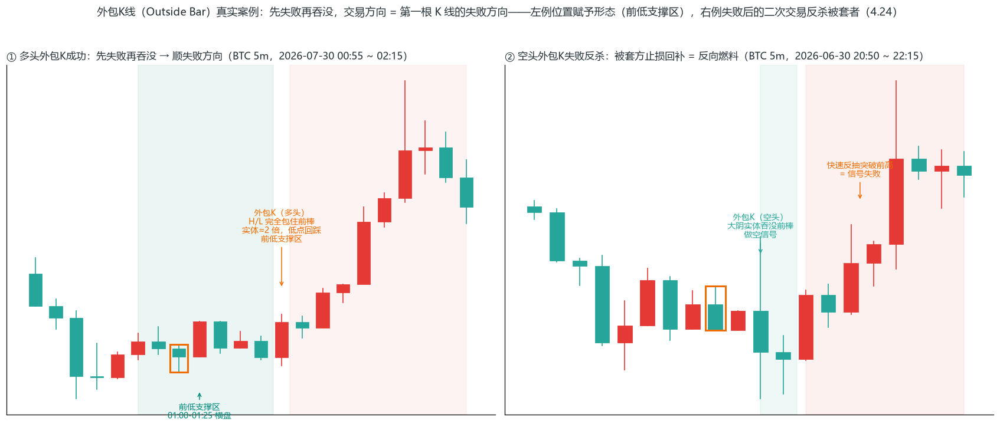

*图 4-7R 真实数据：外包K线一成一败（数据源：Binance BTCUSDT 5m K 线）*

**这张图要读出三件事**：

1. **外包 K 的“位置”比“形态”重要（左例）**：07-30 01:30 那根多头外包 K，高点只比前棒高 70 美元、低点正好踩在 01:00-01:25 横盘区的低点上——**位置给了它意义**（2.2）：前低支撑区 + 吞没失败空头 = 顺失败方向做多，后续 +1.2% 就是这句话的兑现。
2. **外包 K 失败后，反杀被套者（右例）**：06-30 21:30 大阴外包 K 做空，结果 22:00 前快速反抽突破前高——做空的被套了。4.24 说“外包线信号失败后，价格回踩被套点位时反向操作，胜率超 85%”，这里就是现实版：被套空头止损回补 = 买盘燃料，价格被推到 59277。**失败信号不是结束，是反向入场提示**（呼应 3.2 假突破）。
3. **外包 K 的实体越大、反向越坚决**：左例实体 ≈ 前棒 2 倍（先失败再吞没成立），右例实体是前棒的 4 倍多（做空信号更“坚定”）——但 4.24 的突破幅度比较法早就提醒：**方向偏向不取决于 K 线方向，取决于两端突破幅度的比较**。右例高点上方突破幅度 < 低点下方突破幅度？不——它上破 58762 后量能不足（无跟随），最终被反杀。单根外包 K 的“坚定”要等跟随确认，别在收盘那一刻就全仓。

### 4.25 决策执行口诀与禁止清单

把全书纪律压缩成两页纸：10 条执行口诀 + 一份“直接放弃”清单（PA 二元决策 §14/§15）。遇到清单里任何一条，停止交易或放弃当前信号：

**执行口诀 10 条**：

1. 看不懂，等。极端混乱，等。
2. 尖峰中只顺势——禁止 SCS、禁止追高潮。
3. 通道/区间只顺 direction——禁止逆势、禁止双边刮头皮。
4. 宽通道不追突破，仅顺主方向边界/回撤。
5. 区间中仅顺 direction 一侧；方向中性（neutral）则等。
6. 反转/MTR 只诊断不下单。
7. 楔形回撤可顺势；末端楔形/三推/楔形反转：禁止追顺势、禁止逆势下单。
8. 信号必须等收盘。
9. 止损和交易者方程不过关，直接放弃。
10. 二次入场失败后不再第三次。

**为什么是这 10 条（机制分组）**：① 第 1、6、8 条都指向同一个数学事实——**在信息不足、反转未确认、K 线未收盘时下单，等于在单笔期望不达标时强行开仓**；等待不是错过，是把“看不懂”和“没确认”的负期望交易挡在门外。② 第 2-5、7 条都是“顺 direction”的纪律——尖峰、通道、区间、楔形各有明确的统计偏向：尖峰里逆势做反转的成功率只有约 35-40%，通道/区间逆势等于逆着大多数参与者的方向，末端楔形追顺势等于接最后一棒；所以禁止的不是某个形态，而是“逆着当前主导力量”这个行为。③ 第 9、10 条是期望值硬闸——止损和交易者方程不过关，这笔的数学期望就是负的；二次入场已经失败，第三次是基于“连亏后该我了”的赌徒谬误，不是新信息。

**禁止行为清单**（出现任一项即停止或放弃当前信号）：

- 未识别周期位置就交易；数据不足仍下单；极端交易区间中交易。
- 尖峰中做反转；买进/卖出高潮后追原方向（含 SCS、市价追尖峰）。
- 区间中追普通突破；在区间中部入场。
- 宽通道中追突破；常规/宽通道中做任何逆势（含边界刮头皮、MTR 反手、双顶底反手）。
- 在 Always In Long 中做空、Always In Short 中做多；下单方向与 direction/Always In 不一致。
- 用长外包棒两端突破直接入场。
- 二次入场价明显优于第一次仍强做；二次入场失败后仍尝试第三次。
- 信号棒过长/止损距离过大仍强做；交易者方程不通过仍下单。
- 为“更好看”扭曲结构止损凑方程；止损后立即反手；连续两笔止损后仍不重新评估市场。
- 同结构位反手冷却（PA）：新 entry 与上一轮止损位相差 ≤3 跳，且 3 根已收盘 K 线内禁止反向新方案——给被扫后的情绪一个物理冷却期。

**Ali 的二元决策树（OBDT，可选执行系统）**：如果想进一步把“每根 K 线收盘后做什么”机械化，可以用 Ali 的 OBDT——**三棵独立决策树分别对应 Flat（空仓）、Holding Long、Holding Short**；第一层用均线判断当前多空环境；实际交易树深度通常不超过 4 层；每根新 K 线收盘时重置决策流程；无法决策时返回 WAIT，而不是硬做。它和 4.7 的状态判定树是同一思路，差别在 OBDT 连“持仓中怎么管理”也一起写成树。

**一句话记忆**：决策 = 门控 + 方程——方向不明先等（门控），三价定死再算盈亏比（方程）；止损永远挂在结构失效位外 1 跳，不是挂在你希望的地方。

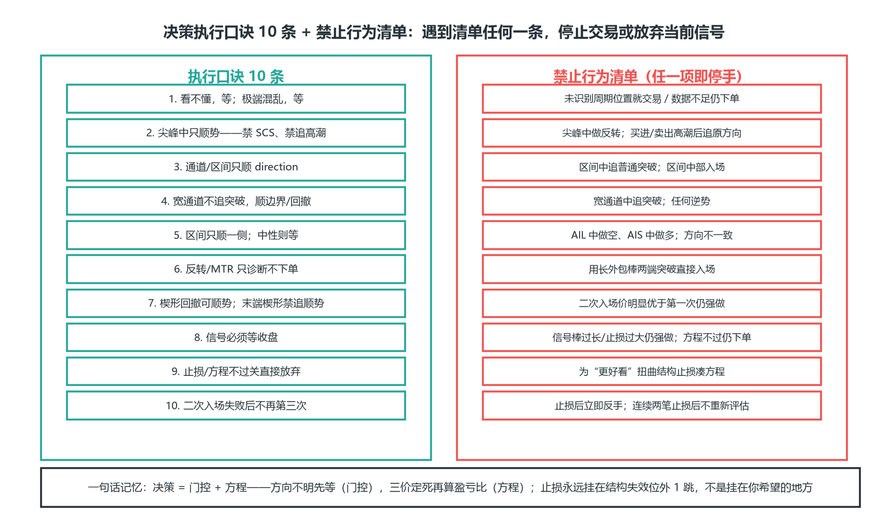

*图 4-31 决策执行口诀与禁止清单：左=10 条执行口诀（看不懂等/尖峰只顺势/通道只顺 direction/MTR 只诊断不下单/信号等收盘…）；右=禁止行为清单（任一项即停手，写进规则书不是“万一可以做”，是盘中止手）*

## 篇四 补充系统（4.26-4.28）：ORB、均线趋势跟踪、配对交易

篇四给你三个“换一种赚钱方式”的系统：ORB 赚开盘的秩序、均线趋势跟踪赚长趋势、配对交易赚相对价格。它们不是主线的替代，是工具箱的扩展——每一套都要用第 8 章的验证流程独立验证，验证不过就不上真钱。

### 4.26 ORB（开盘区间突破）：一天最重要的头 15 分钟

**定义**：开盘后 N 分钟（常见 5/15/30 分钟，ES 最常用首 15 分钟或首小时）的高低点围成的区间 = 开盘区间（Opening Range）。价格突破区间边界 → 顺着突破方向进场。

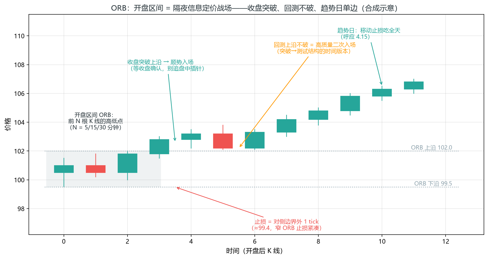

*图 4-32 ORB：开盘区间（灰框）→ 收盘突破上沿 → 回测不破 → 移动止损吃全天（合成示意）*

（灰框）开盘头 N 根 K 线的高低点围出 ORB；突破要等 K 线收盘确认（别追盘中插针）；突破后的第一次回测不破上沿 = 高质量二次入场；止损 = 对侧边界外 1 tick——窄 ORB 的止损天然紧凑，盈亏比好。

**为什么有效**：开盘区间是“隔夜信息定价”的战场——隔夜积累的订单、机构的第一批意图都在开盘头几分钟展开。突破 = 一方认输：趋势日里，ORB 突破后经常走出一整天的单边。这和第 1.7 说的“开盘时段波动大”是同一件事的两个侧面。

**规则（六要素版，呼应 4.2）**：

- **背景**：只用第 4.7 状态机过滤——只做通道/趋势状态，区间/铁丝网日不做（呼应第 7.1：区间突破 80% 失败，ORB 只赚趋势日的突破）。
- **触发**：收盘突破 ORB 边界（等 K 线收盘确认，别追盘中插针——呼应第 3 章假突破）。
- **止损**：ORB 对侧边界外 1 tick（窄 ORB 时止损紧凑，盈亏比天然好）。
- **目标**：1R 起步；趋势日用移动止损吃全天（呼应 4.15）。
- **仓位**：第 6.2 公式照用。
- **过滤器**：ORB 越窄越有效——窄区间 = 双方僵持后单边认输；宽 ORB 的突破往往只是震荡（呼应 4.4 区间）。

**三个关键变体**：

1. **突破后回测**：突破后第一次回测 ORB 边界（不破）是高质量二次入场——这是“突破→测试”结构的时间版本（呼应 4.5 突破系统与 Ali 二次入场）。
2. **假突破即反向**：突破后 1-2 根 K 线收回区间 = 反向信号（呼应 Ali 陷阱清单第 ① 条：Fast & Big BO 后出现双形态概率高）。
3. **时段限定**：ORB 逻辑只属于开盘——盘中任意时段的“区间突破”没有隔夜信息定价的含义，别硬套。

**开盘起趋势日（ORB 变体）**：约 20% 的交易日属开盘起趋势日——开盘后前 3-6 根 K 线形成当天低点/高点，开盘区间小于当天区间的 25%；突破后价格朝突破方向持续运动；若开盘高点/低点在第一个小时内被反向突破，趋势日宣告失败；确立后每次回调都是入场点。

**与系统三（4.5）的关系**：ORB 是突破系统在“时间维度”的特化——突破系统选位置，ORB 选时间。两者规则同源（突破→回测→目标），可以共享一套出场（篇二）。

**诚实评价**：ORB 胜率受“趋势日比例”限制（约 30-50% 的日子至少有一段可交易的趋势行情——这里是宽口径，含趋势恢复日与趋势性区间日；4.7 的“纯趋势日只有 10-15%”是严格口径，两者不矛盾），所以它的第一过滤器永远是状态机；但它结构极简、规则全客观（时间+价格），是第 8 章验证的绝佳入门系统。

### 4.27 均线趋势跟踪：把“方向感”变成规则（编者补充 · 策略通识）

**均线的本质**：均线（MA/EMA）不是“神秘指标”，是平均成本线——EMA(20) ≈ 最近 20 根 K 线的平均成交位置。价格在均线上方 = 最近的平均买家赚钱，这就是趋势方向的另一种表达（呼应 2.3 趋势定义与第 4.7 direction）。

**三种用法（按纪律强度排序）**：

1. **方向过滤（最强）**：价格在均线上方只做多、下方只做空。均线当“法官”，不当“扳机”——方向交给均线，入场交给价格行为（锤子/吞没/假突破，第 3 章）。这是本书推荐的主用法：**均线定方向，结构定入场**。
2. **回踩入场**：趋势中价格回踩均线（20/50 EMA）且结构支持（HL/趋势回调）→ 入场。均线是“动态支撑/阻力”——它是大量市场参与者的成本线，回踩常引发反应（呼应 4.3 系统一：回调到均线+结构双重汇聚）。
3. **交叉系统（全规则化）**：快慢均线交叉（20/50 或 50/200）定多空，配 ATR 止损（呼应 4.9 海龟的波动率仓位）。

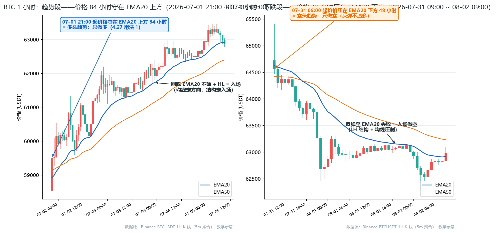

*图 4-8R 真实数据：均线定方向——回踩不破入场，反弹失败入场（数据源：Binance BTCUSDT 1H K 线）*

左图是趋势段：07-01 21:00 起价格连续 84 小时守在 EMA20 上方（蓝线）——用法 1 直接生效：只做多，任何回调的终点都是做多机会；图上圈出的回踩点（低点触到 EMA20 不破且形成 HL）就是“均线定方向 + 结构定入场”的标准入场。右图是下跌段：07-31 起价格 48 小时压在 EMA20 下方，反弹到 EMA20 失败（LH）就是做空入场。两个真实对照：① **周期越大均线越干净**——同一套 EMA20 在 1 小时图上 45 天日均穿越约 3 次，在 5 分钟图上日均 37 次（快均线在震荡日全是假信号，必须配 4.7 状态机过滤）；② **方向过滤是第一用法**——两张图里均线都没有给出“精确入场点”，方向被均线定死、入场交给结构，这就是“均线当法官、不当扳机”。

**均线趋势跟踪的数学**：趋势跟踪的代价是低胜率——典型 35-45%——靠盈亏比赢：胜率 40% + 平均盈亏比 1:2.5 = 正期望（用第 6.4 的交易者方程自己算一遍）。**连续 5-6 笔小止损是这类系统的正常呼吸**（呼应 6.3 连亏是必然），不能扛单、不能手痒抄底。

**与本书价格行为的融合（本节真正的收获）**：均线系统单独用会“震荡市反复打脸”（第 4 章 20GB 就是均线失效的场景），价格行为单独用缺“方向锚”。两者组合：**均线做过滤器滤掉逆势信号，价格行为做扳机选入场点**——用趋势的“确定性”过滤，用结构的“精确性”入场。

**诚实评价**：慢均线（周线/日线 50-200）适合波段和资产配置级别的仓位（呼应 1.17：定投+再平衡本质就是“机械的均值回归”，而均线趋势是它的方向版）；快均线（15m/1H）在震荡日全是假信号，必须配状态机过滤器（4.7）。

### 4.28 配对交易：市场中性的均值回归（编者补充 · 策略通识）

**定义**：同时做多一个品种、做空另一个高度相关的品种，赚“相对价差”回归的收益。经典例子：做多 ES / 做空 NQ（两个指数高度正相关，第 1.14），或同板块两只股票。

**为什么“中性”**：同时多空，大盘涨跌的方向风险被抵消——收益只取决于“相对价格”。普通均值回归要猜方向（逆势，危险，呼应 4.10），配对交易不需要猜：**贵的一腿做空、便宜的一腿做多，价差回归即盈利**。

**逻辑**：两个高度相关标的（相关性 >0.8）的价差长期围绕均值波动。价差极端偏离（如 >2 倍标准差）→ 反向开仓；价差回归均值 → 平仓。

**步骤（量化版）**：

1. **找配对**：相关性 >0.8 且价差“均值回归”（协整检验，第 8 章 Python 可算——不会算就先用肉眼验证价差长期不脱钩）。
2. **建仓**：价差偏离 >2 倍标准差（Z-score >2）时反向开仓（贵的空、便宜的买）。
3. **出场**：价差回归均值（Z-score 回 0）平仓——目标在开仓时就定死。
4. **止损**：价差继续偏离（|Z-score| >3，无论方向）或“结构性脱钩”（两标的基本面关系改变）——止损，不扛。

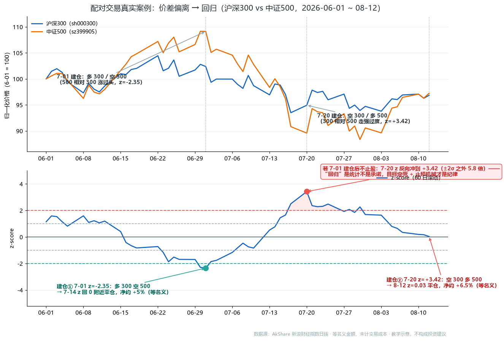

*图 4-9R 真实数据：价差偏离 → 回归的两轮完整循环（数据源：AkShare 新浪财经指数日线）*

**把四步对到真实行情**：上图是 2026 年 6-8 月沪深 300 与中证 500 的归一化价格（6-01 = 100），下图是它们对数价差的 60 日滚动 z-score——**z 越过 ±2 开仓、回到 0 平仓**：

- **第一轮（7-01 建仓）**：z = -2.35（500 相对 300 涨过头）→ 多 300 空 500。7-14 z 回 0 附近平仓：500 从 9029 跌到 8276（-8.3%）的空头盈利覆盖 300 的 -3.3%，净约 +5%（等名义）。
- **第二轮（7-20 建仓）**：z = +3.42 反向开仓（空 300 多 500）→ 8-12 z = 0.03 平仓，净约 +6.5%。**两次信号方向相反、都盈利——赚的是相对价差的钱，不是大盘涨跌的钱**（同期上证指数约 -3%）。
- **诚实提醒**：两笔都兑现 ≠ 配对交易稳赚。样本太小（样本量 = 交易笔数，太少结果不可信，第 8 章），这只能让你看到“长什么样”。真正的风险看下一张图。

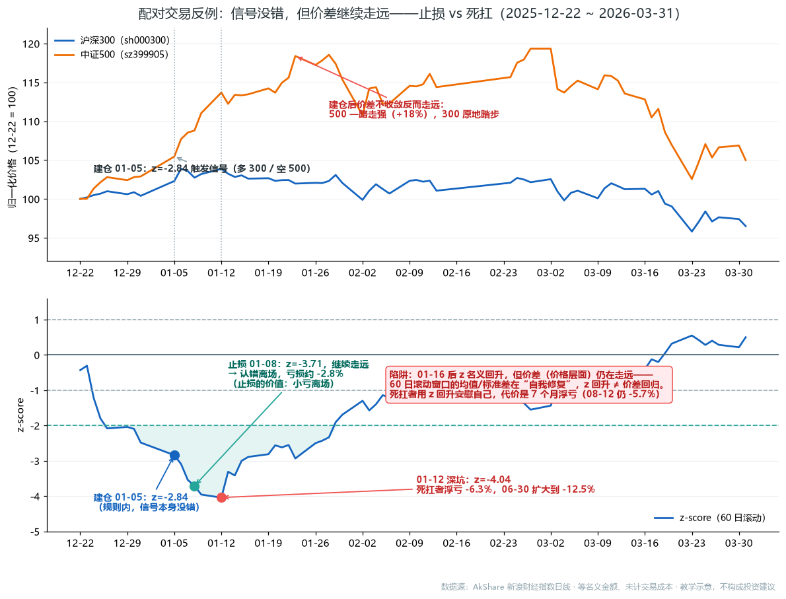

*图 4-10R 真实数据：信号没错但价差继续走远——止损 vs 死扛（数据源：AkShare 新浪财经指数日线）*

**同一对标的的反面**：2025 年底到 2026 年初，中证 500 一路走强（500 涨 18%、300 原地踏步），价差持续走远：

- **01-05 z = -2.84 触发建仓**（多 300 空 500）——信号完全在规则内，没错。
- **但价差不回归**：01-08 z = -3.71、01-12 深坑 z = -4.04——按止损规则（|z|>3 继续偏离）01-08 离场，亏损约 -2.8%，是一次“规则内的正常止损”。
- **死扛的代价**：浮亏 01-12 已达 -6.3%、06-30 扩大到 -12.5%，扛到 08-12 仍 -5.7%——7 个月资金占用 + 心态消耗，只等来一个“统计上终将回归”。
- **滚动 z 的陷阱（图中红框）**：01-16 后 z 名义回升（-4.04 → -2.5），看起来“快回归了”——但这是 60 日滚动窗口均值/标准差“自我修复”造成的**名义回升**，价格层面的价差仍在走远（500 继续涨）。**用 z 回升安慰自己 = 死扛的开始**。

**结论（配对交易的纪律）**：目标定死（z 回 0 就平，第一轮平在 +5% 而不是等“回归到极致”）；止损机械（|z|>3 或建仓后继续走远 1σ 就认错）；不信“这次不一样”，也不信“总会回归”——**回归是统计期望，止损才是单笔的现实**。

**与本书的对照**：

- 它是第 4.10“均值回归”的中性化版本，也是第 1.14 相关性的应用——相关性既是风险（同向持仓=重仓），也是机会（配对交易的原料）。
- 出场思想与篇二一致：目标定死、分批、止损机械。
- 资金门槛：两腿同时占用保证金（约翻倍），利润薄（价差回归幅度有限）——**适合资金量大、想降低回撤的进阶者，新手知道它存在即可**。

**诚实评价**：配对交易最怕“价差结构性漂移”——两个标的的“相关性”是统计事实，不是承诺；一旦基本面脱钩（如行业政策变化），价差不回归，反而成为双倍亏损。它的低回撤是“统计上”的，不是“保证”的。

### 4.29 实战串讲：一个交易日走一遍

前面的内容都是“零件”：状态机（4.7）、四个系统（4.3-4.6）、出场（篇二）。这一节把它们组装起来——用一个完整的 ES 交易日，把“状态机随时切换系统”的过程从头走一遍。目标是：让你在真实盘前知道“每个时刻该做什么”。

**盘前（美东 8:30-9:30，北京 21:30-22:30）**

- 查经济日历（第 8.5）：今天 10:30 有 ISM 数据——**10:30 前后 15 分钟不开新仓**（军规第 5 条，第 7.6），写进今天的计划。
- 定 HTF 方向（4.7）：日线上升趋势、4H 也是上升——今天的方向偏好：只做多或中性（区间里逆 HTF 的方向不做）。
- 画关键位：昨天高低点、日线前高前低、整数关口（第 2 章支撑阻力）。
- 结果：盘前 5 分钟，计划纸上只有三行——方向：偏多；禁区：10:30 数据前后；关键位：几个价格。

**9:30 开盘：只观察，不交易**

- 开盘 15 分钟不追单：等 ORB 区间成形（4.26），同时看开盘的尖峰性质——这是“隔夜信息定价”，先让它走完（呼应 1.7 开盘波动大）。

**9:45 第一次状态判定（4.7 判定树）**

- 5 分钟图：HH/HL 有序排列、通道可画线、无铁丝网 → **状态 = 上升通道**。
- 对应策略：趋势回调（系统一，4.3）——顺势、回调入场、止损紧凑。

**10:00 第一笔：趋势回调（系统一）**

- 触发：价格回调到 20 EMA + 前一个 HL + 锤子收盘确认（3.3）——三重汇聚（4.8 confluence）。
- 三价定死（4.2 六要素）：入场 = 锤子收盘价；止损 = HL 低点下方 1 tick；目标 = 前高（TP1，1R 附近）+ 4.13 的 MM 扩展（TP2）。
- 仓位：第 6.2 公式——止损距离 6 点、账户 5 万、风险 0.5%（$250）→ 手数算好就挂单。
- 执行：挂限价单入场（1.3），同时挂好止损。

**10:15-10:30 数据前的处理**

- 价格走到 1R：按 4.14 平半仓、止损移到入场价（保本，4.16）。
- 10:30 ISM 数据：数据前 15 分钟不开新仓——剩余半仓收紧止损，不赌数据方向（1.8）。
- 数据出来：价格快速下探，扫掉剩余半仓（保本位出场，小亏/平保）。**不追空**——HTF 方向还是多头，数据脉冲不是你的交易（1.8：数据是技术面的例外）。

**10:30 状态转换：通道 → 区间（4.7 切换规则）**

- 通道线被跌破、价格开始两边界来回测试——判定树更新：**状态 = 区间**。
- 策略切换：系统一（趋势回调）停用，系统二（区间边界，4.4）启用。**状态变了就换，不恋战**——这是状态机存在的意义。
- 注意：区间方向偏好仍受 HTF 限制——日线上升，只做区间下边界附近的多（顺 direction 一侧），上边界的空单放弃。

**11:00 第二笔：区间边界（系统二）**

- 触发：价格触及区间下边界 + 吞没收盘确认（3.4）+ 边界与日线前高支撑重叠（confluence）。
- 三价定死：入场 = 吞没收盘价；止损 = 边界下方（超区间宽度 10% 的止损直接放弃，4.4）；目标 = 区间上边界（TP1），到 1R 平半仓、保本（4.14/4.16）。
- 结果：价格一路推到上边界——剩余仓位在 TP1 全部了结。**两笔都是盈利，靠的是状态切换及时 + 方向偏好一致**。

**12:00 第三笔机会：不做**

- 上边界出现假突破（插破收回）——教科书式的反向信号（3.2 假突破）。
- 但这是逆 HTF 的区间空单（日线上升）——**放弃**（4.7 direction：HTF 方向不对，LTF 信号作废）。
- 记入日志：“看到信号，放弃执行”——**放弃也是决策**，复盘时一样要记录理由（8.3）。

**14:30 尾盘：Bar 60 陷阱时段**

- 美东约 14:30（第 60 根 5 分钟 K 线附近）市场常设反转陷阱（7.1 Ali 陷阱第 12 条）——**14:30 后不开新仓**。
- 15:50 前检查所有挂单：清掉未成交的，收盘后不留挂单（1.3 挂单时效）。

**收盘后 16:00：复盘（8.3/8.8）**

- 日志三行：第一笔（+1R 平半仓、剩余平保）＝好交易；第二笔（+2R）＝好交易；第三笔（放弃）＝好决策。
- 执行率自查（8.7）：计划内的两笔交易全部按规则执行，三次放弃（数据脉冲不追、逆 HTF 不做、尾盘陷阱不碰）都有明确依据 → 执行率 100%。
- 今日总结：状态机切换 1 次（通道→区间），两笔都是“顺 HTF + 六要素齐全”，放弃的三次都有明确规则依据。

**这个日子的启示（比任何单笔案例都重要）**：

1. **一天的核心不是“做了几笔”，是“每个时刻用哪套系统”**——盘前定方向、开盘等结构、数据前让路、状态变了换系统、尾盘收手。
2. **放弃的三次和交易的两笔一样值钱**：数据脉冲不追、逆 HTF 不做、尾盘陷阱不碰——军规（7.6）和禁止清单（4.25）的作用是让“不做”也有依据。
3. **状态机是活的**：通道→区间的转换可能一天发生多次（甚至往返），每次转换都重新执行 4.7 判定树，不预设、不恋战。
4. **把今天复制 100 次，就是第 8 章验证的数据**——第 8 章要求 100+ 笔日志，就是 100 个这样的日子。

**真实交易日对照：BTC 5 分钟（2026-06-29）**——上面 ES 是文字剧本，下面这张 BTC 真实图表是同一套突破生命周期在 24 小时市场的实拍：

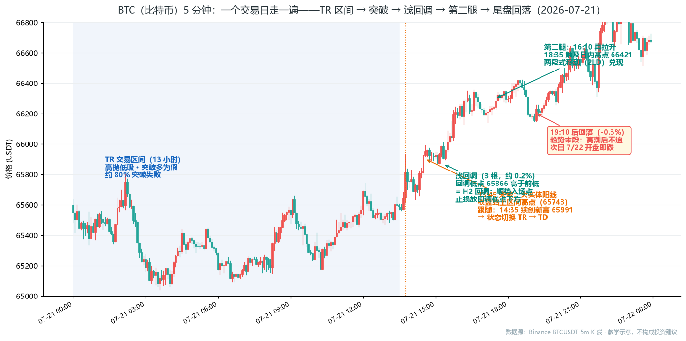

*图 4-11R 真实数据：突破生命周期（数据源：Binance BTCUSDT 5m K 线）*

对照着读五幕：① **区间**：08:40-11:00 价格在 58900-59700 之间来回，上沿 59700/59588 被测试两次——默认区间逻辑（4.7：85% 的时间在区间里）；② **突破**：11:05 放量阳线（V=232）突破前高，11:25 冲高 60233（突破后新高）——突破发生，切系统一；③ **回踩守住**：11:35 回踩 59878 不破上沿——突破测试成功，顺势入场点，止损放回踩低点下方；④ **深回调（失败）**：13:10 59392 跌回区间内部——这次测试失败，突破进入假突破模式（呼应 3.2），持仓者被扫止损，但**别反手**：它可能是新一轮突破的起点；⑤ **第二腿**：14:15 反转再上 60346 新高——失败的回调本身成了新突破。**每一步都等收盘确认**：你在 11:25 突破时追入，13:10 会被扫；等 11:35 回踩确认再入，才有资格吃第二腿。加密 24 小时市场没有 9:30 开盘，但有同样的突破节奏：区间磨人时忍、突破时切、回踩时进、失败时走。

### 本章自测（答案在本节末尾）

1. 状态机判定出“上升通道”，你应该用哪套系统？判定变成“区间”后呢？
2. 区间被真正突破的判据是什么？“插破边界又收回”算什么？
3. 一笔交易的六要素是什么？为什么目标必须在入场前定死？
4. ORB 突破的两个先决条件是什么？突破后 1-2 根 K 线收回区间算什么？
5. 配对交易为什么“市场中性”？Z-score 的 >2 / 回 0 / >3 分别对应什么动作？
6. 分批止盈和移动止损的规则是什么？保本为什么不能移太早？

**答案**：① 系统一趋势回调（4.3）；状态变了就换——区间用系统二区间边界（4.4/4.7），不恋战；② 收盘站稳边界外 + 放量 + 大实体三条件（4.4）——插破收回是假突破（3.2），是区间交易者的反向入场机会；③ 背景/触发/止损/目标/仓位/过滤器（4.2）——出场是期望值的另一半（4.12），临场定目标等于把决策交给情绪；④ 状态机确认趋势日 + 收盘确认突破（4.26，窄 ORB 更佳）——收回区间是假突破，反向信号；⑤ 同时多空抵消大盘方向风险，只赚相对价差回归（4.28）——>2 倍标准差反向开仓（贵的空、便宜的买）、回归均值（Z 回 0）平仓、>3 或结构性脱钩止损；⑥ TP1 近端结构位（RR≥1.0）先落袋一部分，剩余仓位挂移动止损（只进不退）让利润奔跑（4.14/4.15）——保本别移太早（4.16）：回撤到成本区时保本单最容易被打掉，等于把正常回撤当成风险，把一笔对的交易做成错。

### 本章小结：速查卡

**① 系统选择（状态机）——先判定，再选枪**

| 状态判定 | 用哪套系统 | 一句话原理 |
| --- | --- | --- |
| 上升/下降通道（≥3 组有序波段 + 可画线） | 系统一 趋势回调 | 顺势 + 止损紧凑 + 目标远，期望值结构最好，默认选择 |
| 区间（边界各 ≥2 次测试） | 系统二 区间边界 | 顺 HTF 方向只做一侧；区间破了就切换 |
| 通道/区间突破（收盘站稳 + 放量 + 大实体） | 系统三 突破 | 真突破后切趋势思维，只做突破后的回踩 |
| 趋势日微通道（3 根同向 K 线 + 微小缺口） | 系统四 微通道 | 短线顺势，基础胜率 70%，10 项强度指标每缺 1 项扣 5%，超 6-7 根 K 线警惕回撤 |

- 状态判定三步：有无有序波段序列 → 通道（按回撤分窄/常规/宽）还是 trending_tr（仅 2 组）→ 区间；最新波段出 LL（涨）/HH（跌）立即重估；状态转换期降级处理。
- **结构变了就换，不恋战——最常见的亏损是用错系统。** 三个系统是状态机，MTF 大周期定方向、小周期定入场；HTF 方向不对，LTF 信号作废。

**② 六要素与目标定价——写死才算系统**

- 六要素：背景/触发/止损/目标/仓位/过滤器。决策是门控 + 方程：看不懂就等（门控），三价定死再算盈亏比（方程）。
- 定价顺序 entry → TP1 → TP2 → stop；几何顺序 stop < entry < TP1 < TP2。TP1 近端结构位（RR≥1.0 只用它算），TP2 远端 MM（必填、不参与盈亏比）。
- Measured Move 四类公式：区间高度翻测（约 60%）、通道宽度、楔形高度、尖峰 leg（约 70%+）——目标是算出来的，不是感觉出来的。
- 止损永远在结构失效位外 1 跳，固定跳数只是“过大”过滤器；口诀十条 + 禁止清单，触犯任何一条就放弃。

**③ 出场——期望值的另一半**

- 目标入场前定死；分批止盈 + 移动止损只进不退；保本别太早；不动也是风险。
- 磁力位 = 失败信号留下的磁场：失败信号极点/入场价/止损集中区——趋势中失败的逆势信号极点常是顺势目标；接近磁力位胜率趋近 50-50，17t/41t 陷阱区附近不设止损不追单。

**④ 通道——量化分类后再动手**

| 回撤 | 类型 | 打法 |
| --- | --- | --- |
| <30% | 窄通道 | 只做顺势，第一个逆势突破通常失败 |
| 30-50% | 常规通道 | 正常交易 |
| 50-78.6% | 宽通道 | 突破后必有测试 |
| 微型通道 2-10 棒 | — | 突破必失败——等突破失败顺势入场 |

- 通道身份：上涨通道 = 空头旗形（上边界是空头建仓区），大多数向上突破失败，通道越久向下突破概率越高；下跌通道反之。
- 生命周期五阶段：尖峰 → 扩展 → 台阶 → 收缩（动能衰退）→ 区间；收缩台阶 = 动能衰退、加速台阶 = 高潮前兆；第一个突破尝试必失败，假突破 = 通道延续信号。
- 止损超通道宽度 1.5 倍放弃交易；画线四方法随阶段演进（平行线→波段点→最佳拟合→平行投影），趋势线连续两次重画 = 即将突破。

**⑤ 区间——先量化再动手**

- 紧凑度 = 区间宽度/平均波段幅度：<25% 铁丝网不交易、25-35% 过渡只等突破、≥35% 再看 CV——高密度（<0.3）才在边界顺方向刮头皮。
- 边界是区域不是线（各 ≥2 极点验证）；突破前兆看尖峰级别与测试；突破失败陷阱 = 突破后立即反向尖峰——只等测试不追突破。
- 中间时段 + 中间位置 = 不交易；止损超区间宽度 10% 放弃；边界与均线重叠 = 高概率刮头皮位。
- 三角形：上升/下降三角形有方向偏向，对称三角形禁止赌方向，扩张三角形不交易；双顶底靠二次测试确认（第一次触边不追，第二次失败才确认极点，突破颈线后的回撤是二次入场背景）。

**⑥ 方向过滤——Always In / 首次回调 / 最终旗形**

- Always In：AIL/AIS 先定方向再谈打法，逆 Always In 的首个反转仅诊断；20GB（二十根不触均线）= 趋势极强但均值回归风险上升——第一次回触 EMA 顺势刮头皮，两次失败不再第三次。
- 首次回调序列是趋势的生命周期地图：初期回调弱而浅（高1最值得做），末期回调强而深（高3/破均线后停做顺势）——首次反转尝试倾向失败，原趋势极值倾向被测试。
- 最终旗形 = 趋势末端的最后一面旗：突破常失败并反转，禁止盲目追顺势；失败 FF（突破无跟随）是高价值反转 setup，但升级 MTR 仍须四组件齐全。

**核心一句**：会看信号≠会交易——信号只是扳机，系统才是整把枪（它让你在情绪上头时不做蠢事）；没有最好的系统，只有合身的系统——系统的上限是你执行它的下限。

**篇四补充系统**（主线验证后再按需选）：ORB 赚开盘秩序（只做趋势日，窄区间最有效）；均线趋势跟踪胜率 35-45% 靠盈亏比赢（均线过滤 + 结构入场）；配对交易赚相对价差（中性对冲、资金门槛高）。

下一章讲 SMC——它给这套系统提供了一个“机构视角”的补充框架，核心是流动性池和 sweep。
