# 第 4 章 交易系统：入场与出场


上一章你有了信号——知道何时进场。但这里有个残酷的事实，先给你：

> 会看信号，不等于会交易。信号只是扳机，系统才是整把枪。

为什么？因为一笔完整的交易，远不止"进场"这一个动作。进场之后呢？止损放哪？目标看哪？下多大仓位？涨了一点要不要先跑？跌了要不要扛？这些问题，如果你没有事先写死的答案，那么每一次你都会在盘中的情绪里临时决定——而情绪里的决定，几乎都是错的。

这一章就是把"信号"升级成"系统"：一套你事先写死、可以重复执行、不依赖临场发挥的完整规则。

### 本篇导读：一章其实有三本书

这一章共 25 个小节，是全书最厚的一章（其他章平均不到它的三分之一）。为了不让你一上来就被淹没，把它分成三篇，彼此独立、可单独阅读：

| 篇 | 范围 | 解决什么 | 定位 |
| --- | --- | --- | --- |
| 篇一 系统与状态机 | 4.0-4.10 | 四个入场系统 + 状态机切换 + 仓位/目标框架 | 必读：最小系统的核心 |
| 篇二 出场：期望值的另一半 | 4.11-4.19 | 止盈、分批、保本、移动止损、完整生命周期 | 必读：期望值靠出场兑现 |
| 篇三 高级入场结构 | 4.20-4.24 | 突破单/限价单/always-in/外包/禁止清单 | 进阶：第一遍可跳过 |

**建议**：第一遍只读篇一 + 篇二（配合第 6 章仓位公式），已经是一套完整可执行的系统；篇三是给这套系统加深度和鲁棒性的，等你觉得"信号不够用"或第二遍复习时再读。

## 篇一 系统与状态机（4.0-4.10）

### 4.0 信号不等于系统

先想清楚一个区别。信号回答的是"这里能不能进"。但一笔交易要回答六个问题：

1. 现在什么状态？（背景）
2. 用什么信号进？（触发）
3. 止损放哪？（止损）
4. 目标看哪？（目标）
5. 下多大仓位？（仓位）
6. 什么情况不做？（过滤）

只解决第 2 个就下单，是赌博；六个都有确定答案，才是交易。

**系统的真正作用，不是帮你赚更多，而是帮你在情绪上头时不做蠢事**。规则写死了，盘中就不需要"思考"，只需要"执行"。思考留给冷静的盘前，执行交给机械的盘中。

这个区别怎么落地？你不需要六要素完美到"永远赚钱"——你只需要六要素具体到"没有临场决策的空间"。比如止损不能写"亏了就跑"，要写"放在 HL 下方 0.5×ATR"；过滤不能写"感觉不对就不做"，要写"数据前 15 分钟不开仓"。模糊的规则 = 给情绪留门，第 7 章的军规会反复强调这一点。

### 4.1 一套完整系统的六要素

1. **背景判断**：当前趋势/区间，用什么结构判断——写死，不临场发挥。
2. **入场触发**：具体信号（假突破？锤子？吞没？）——写死。
3. **止损位置**：放哪、为什么。放结构外，不是固定点数（第 6 章有 ATR 法）。
4. **止盈/目标**：前高前低、风险回报比（RR）≥2 才做。
5. **仓位大小**：按风险百分比算（第 6 章）。
6. **过滤器**：什么情况不做（数据前、震荡、逆势、非活跃时段）。

**写下来才算系统**。脑子里的"感觉差不多"不是系统。把六要素写成一张清单，入场前逐条打勾——这是第 7 章"执行率"的基础。执行率的定义（第 8 章）就是"完全符合计划的交易占比"，而"计划"就是这张六要素清单。没有清单，就没有执行率，就没有验证，一切回到感觉。

**六要素清单模板**（写进你的规则书，每次入场前逐条打勾）：

- [ ] 背景：____（上升/下降/区间），HTF 方向 ____
- [ ] 触发：____（具体信号名）
- [ ] 止损：____（具体价位 + 依据）
- [ ] 目标：____（具体价位，RR = ____ ≥ 2）
- [ ] 仓位：____ 手（风险 ____%）
- [ ] 过滤：无数据事件 / 活跃时段 / 非连亏期

### 4.2 系统一：趋势回调交易（最推荐）

这是本书的默认系统，先给你一个洞察，理解它为什么是默认：

> 趋势回调是期望值结构最好的系统：顺势（站在惯性那边）、回调入场（止损紧凑）、目标远（盈亏比天然大于 2）。三个优势叠在一起。

**逻辑**：趋势会延续，回调是上车点。不做反转，只做顺势。

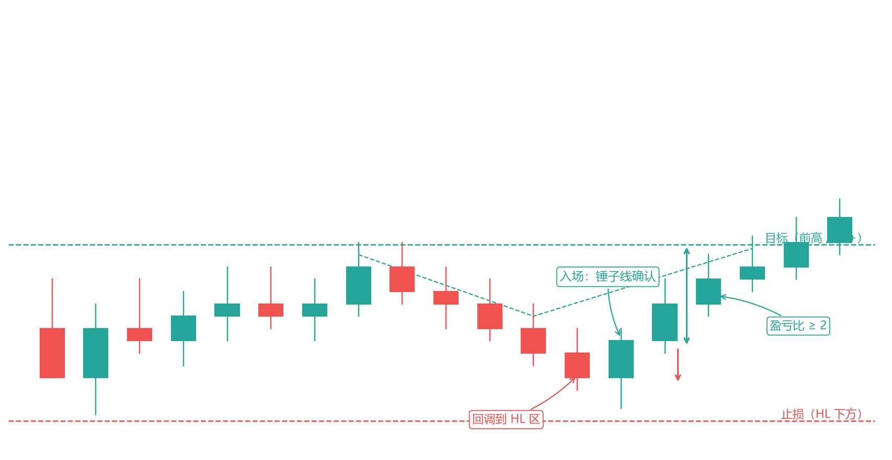

*图 4-1 趋势回调交易：入场 / 止损 / 目标*

看图理解这套系统的完整一笔：价格在上升趋势里（高低点依次抬高）。它涨到前高后开始回调，回落到一个位置——上一波上涨的起点、一个 HL 支撑区。在回调区，出现了一根锤子线（信号确认）。于是：

**规则（对照图）**：

1. **背景**：日线/4H 明确上升趋势（HH+HL 清晰）。
2. **等回调**：价格跌回最近 swing low 附近（回调到 HL 区）。
3. **信号**：回调区出现锤子/吞没/内包线突破（+量价三问）。
4. **入场**：信号确认后（图中标注的入场点）。
5. **止损**：回调低点（HL）下方——图中标注的止损位。为什么放这：如果跌破这里，说明"回调只是洗盘"这个判断错了，趋势可能真变了，你该认错。
6. **目标**：前高（HH）或 2R——图中标注的目标位。

**为什么止损紧凑是巨大的优势**：你的止损就在回调低点下方，离入场价很近，所以这笔的"风险"很小；而目标在前高，离入场价远，所以"潜在盈利"大。风险小、盈利大，盈亏比天然就好。这就是"回调入场"比"追高入场"高明的地方——追高的话，你的止损要放到很远的结构下方，盈亏比立刻变差。

**完整数字案例（把感觉变成精确）**：

- 入场 1.1090，止损 1.1065（25 pips = 1R），目标 1.1150（60 pips ≈ 2.4R）。
- 仓位怎么算见第 6 章，这里先记住：**先有止损距离，才有仓位大小**。

**这套系统的三个常见错误**（写进你的复盘清单）：

1. 在"趋势"还没确认时（只有两三个高低点）就追回调——等结构清晰再做。
2. 回调到 HL 区但信号没出现就提前进场——等确认，别抢跑。
3. 把"HL 区"画得太宽或太窄——回调区应该基于结构（前低区域），不是拍脑袋画一条线。

**首次回调序列：趋势回调的"生命周期地图"（Tefi L17A）**：趋势从发起到结束，理应是顺势方动能衰退、逆势方愈发进取的进程。把各类回调按"强度 × 发生顺序"排列，就得到首次回调序列——它告诉你"现在趋势走到哪一步了"：

1. **趋势初期的回调应该弱而浅**——是为引发趋势延续的旗形；只有到了末期，回调才变得又强又深（未端旗形将导致大型趋势反转）。
2. **序列的典型推进**（上升趋势版）：强势阳线（实体大、影线短）→ 实体变短、上影线变长 → 与前一根 K 线重叠变多 → 十字星 → 出现阴线 → **高 1（一推回调）→ 高 2（二推回调，持续 5-10 根）→ 高 3（三推/楔形回调，持续 5-15 根）** → K 线乖离均线超过 20 根后终于触及均线（**20 gap bar**）→ 开始有 K 线收盘在均线另一侧 → 整根 K 线在均线另一侧 → 市场进入宽幅区间、多空势均力敌。
3. **首次回调序列的实用价值**：任何类型回调的第一次发生即"首次回调"——**首次反转尝试倾向失败，原趋势极值倾向被测试**。所以：① 趋势初期的首次回调（高 1）是最值得交易的顺势回调（对应 4.2 系统一的入场）；② 当回调开始加深、出现高 2、高 3，说明趋势进入中晚期，回调系统的仓位与目标要相应收紧；③ 当 K 线开始收盘在均线另一侧，趋势回调系统应当停止做多，转入区间思维（4.3）。
4. **序列不保证逐一发生**：图表千万化，项目可能重叠、跳项、顺序颠倒——它是"模式化分析图表时的参照"，不是自动执行的清单。

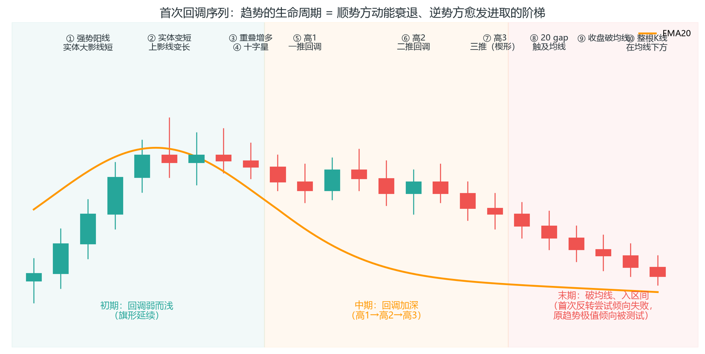

**20 gap bar（均线缺口）的两种均线建仓方案**（L17A 补充，配合 4.9 均值回归）：

- **方案一：20 gap 触及均线入场**——K 线乖离均线超过 20 根后第一次回触均线，顺势入场，止损放该 K 线外侧。适合趋势早期（乖离是强势的证据，回调到均线是顺势方的重新上车点）。
- **方案二：收盘破均线后的区间单**——K 线收盘跌破均线后不再顺势做多，等待测试均线失败后做反向（趋势末端的均线是磁体：第一次折返通常失败、原趋势极值倾向被测试）。

**小交易区间的 7 步回调设置（Ali 闪卡，可交易的回调模板）**：当趋势回调发生在小交易区间背景时，入场按 7 步走（看跌趋势版，多头对称）：① 看跌趋势（背景确认）；② 多头突破出现但跟进差（突破失败）；③ 出现 2 根连续多头 K 线，其中至少一根是高潮型（买方耗尽）；④ 停顿 2 次更佳（暂停让卖方重新进场）；⑤ 出现单根多头趋势 K 线（最后的诱多）；⑥ 出现看跌内包 K 线（信号）；⑦ 内包线低点下方入场，止损在内包线/母线高点上方。

**3-Bar PB 检查（Ali 闪卡）**：回调通常 1-2 根 K 线——**一旦出现 3 根连续看跌 K 线回调，说明看涨方弱势**（正常回调不该这么深），空头会直接反向操作。顺势回调系统（本系统）看到 3-Bar PB 时：不做多，先等第二次机会或直接转向。

**等待延续（Ali 闪卡）**：动量仍在有利方向 + 对方出现弱信号 K 线（如十字星）= 高概率短线机会——顺势方用对方"想反转却反转不动"的犹豫 K 线进场，比追强信号更划算（呼应 3.11 信号线四级可靠性排序的第四级）。

**追赶趋势（Chasing）的三条件（Ali 闪卡）**：没有早期信号、或市场多次未能反转时，可以等新趋势开始后加入——追赶入场的三个硬条件：① **两个连续的强势收盘价在 EMA 之上（做多）**或在 EMA 之下（做空）；② **K 线不能太大**；③ **入场点不能离 EMA 太远**。良好背景（完成的逆转模式或趋势恢复模式）是加分项。三条件缺一就是"追高"，不是"追赶"。

**EMA 顺势买入的停止条件（Ali 闪卡）**：做多 EMA 回调的前提——**大多数 1 分钟 K 线（至少连续约 10 根）位于 1 分钟 EMA20 之上**，且多头趋势处于紧密通道中；回避弱买入信号 K 线或卖出信号 K 线；可以买入两腿回调至 EMA 以下。**何时停止买入**：① 出现 3-4 根连续强看跌 K 线（要买入必须等买方建立强的 H2 回调 K 线）；② EMA 失去上升斜率、变得水平；③ 出现更低低点——此时市场要么看跌趋势要么交易区间，不再处于看涨趋势。

**SPB 趋势的确认（Ali 闪卡，H1/H2 反转 K 线）**：回调度小并不意味着该价格走势属于可靠的小幅回调趋势——**可靠的小幅回调趋势需具备收于高点的 H1 回调和 H2 回调多头反转 K 线**。当某段价格走势虽呈现小幅回调，但 K 线带有突出的影线且多数未能收于高点时，该走势更可能处于交易区间内，而非小幅回调的多头趋势（SPB = Small Pullback 小幅回调：微小缺口 + 强劲收盘，见 11 章术语表）。

**SPB 早期诊断三问（Ali 闪卡）**：回调刚出现时判断它是不是 SPB：① **良好背景**——趋势性的 TRD 或 EG，随后出现大 TR；② **PB 是否较小**？尽管存在许多十字星、影线和反转形态，但只要回调小、且突破后又出现其他缺口，即使反弹力度较弱，也可能是 SPB 趋势——此时突破将成为 BR 方的机会；③ **BRs 是否通过止损获利**？如果没有，则很可能是 SPB。**跨时间框架验证**：5 分钟图上出现小幅回调（1 根 K 线），但更高时间框架（如 15 分钟图）上没有回撤信号——那才是 SPB；SPB 趋势中禁止剥头皮交易（波段波动通常无法提供足够的剥头皮操作空间）。

**SPB 交易法（Ali 闪卡）**：回调幅度小因此逆势方向的风险也小——市场不太可能大幅逆势而行；但趋势强，小幅回调是强劲的趋势形态，其持续幅度通常超乎预期，回报可能巨大。**操作**：一旦确定是 SPB 趋势就随时入场；若入场后市场立即逆势而行，请分批建仓；利用小幅回调加仓、实现平均成本上移；持有核心仓位以进行波段操作或实现测量移动目标；每次回调时增持核心仓位，并在新突破后日内了结新增合约。

**SPB 失败特征（Ali 闪卡）**：在约 20 根横盘 K 线后，更可能形成交易区间而非趋势；任何趋势中出现 3 段或以上连续走势后伴随 20-30 根横盘 K 线，40% 概率发生主要趋势反转且成功（另有概率出现反转尝试，构成反向剥头皮机会）；多头反转不强（上涨波段多次犹豫、楔形熊旗、缺口未关闭）；**小幅回调后涨趋势在初始抛售后被跟进时，通常反转向下**；缺乏跟进/动能——多根小型 K 线、多根内部 K 线重叠、没有或极少出现突破先前 K 线、出现形成新小型突破缺口的长影线。昨日看跌趋势仍可能影响今日价格走势。

**首次暂停小 HL（或小 FTW，Ali 闪卡）**：强势突破后出现的**第一次暂停**（十字星或小型反向 K 线收盘、随后形成小幅更高低点）是可靠的高概率入场——理念是尽快加入一个强大的突破：新的强势买盘刚刚形成，市场不太可能再次深测试突破起点。**在暂停条收盘时入场**（入场早于等 H2，代价是止损略宽）；注意若前期已有多次以盈亏平衡或小幅亏损离场的机会，市场不太可能再次回测该位置——该位置已被测试得足够多次，直接进场。

**3 根连续 K 线回撤 = 趋势转变的开始（Ali 闪卡）**：小型回调的牛市趋势常出 2 根 K 线的回调——3 或 4 根 K 线会增加形成紧凑交易区间或交易区间的概率（呼应上文 3-Bar PB）。部分交易者允许 1 根 K 线的回调但不接受 2 根，会在 2 根以下出场。**若出现三根 K 线形态，特别是至少两根 K 线收于低点附近时，随后很可能出现大幅上涨和下跌，因此至少会有两波向下走势**：许多多头会在那三根 K 线形态时离场，许多空头会在高点上方设置卖出限价单，多头和空头都会在其低点下方设止损卖单。2 号 K 线是 1 号反转的跟进，3 号 K 线则是入场点的信号。

**回调、修正还是趋势反转？（基于百分比和回调势头，Ali 闪卡）**：**最高 5% 是回调；超过 10% 属于修正**（反转需要至少一个双重底）；**20% 属于看跌的趋势**（反转需要底部形态的形成）。动量规则：如果修正幅度过大且过快，通常不会在未先形成通道的情况下反转上升——通道为买价水平提供构建买入压力区的机会；**动量决定修正浪是否会沿着突破方向走出 2 波或更多**。

### 4.3 系统二：区间边界交易

**逻辑**：区间=供需平衡，边界反复被测试。在边界做反向。

**规则**：

1. **背景**：清晰横向区间（至少触边界 2 次）。
2. **入场**：价格到区间上沿+出现看跌信号（或假突破上沿）。
3. **止损**：边界外。
4. **目标**：区间中线或下沿。

**注意**：区间交易最怕区间被打破——一旦出现"强势位移突破边界"（大实体冲出去+放量），立刻放弃区间思维，因为区间已变趋势。

**区间里赚的是"边界回归"的钱，所以别贪**：到中线/边界就落袋。区间目标有限，你想吃一整段趋势，结果往往是区间突然破了、你被套。区间交易的纪律是"不贪"——它的盈利结构决定了：单笔赚不多，靠的是高胜率+小止损，错了马上走。

**怎么判断"区间被打破"**：不是"插破边界"就是打破，而是"收盘站稳边界外 + 放量 + 大实体"三条件。插破边界又收回 = 假突破（第 3.1），那是区间交易者的朋友（反向入场信号），不是敌人。

**Brooks 的区间玩法（BLSHS）**：区间交易的教科书动作是 BLSHS（Buy Low Sell High Scalp，低买高卖刮头皮）：多头在区间下半部分买入、上半部分获利了结；空头反过来。三个补充：

- **第二腿陷阱**：交易区间里约 80% 的突破会失败——特别是区间已有一段趋势后，价格在低点附近再破位（第二腿），弱势交易者在此卖出，恰恰是底部。区间里的"突破"多数是陷阱，别追。
- **TTR 不交易**：Brooks 把紧窄的交易区间叫 TTR（Tight Trading Range）——它是限价单市场（上下沿都在成交），趋势交易者在这里没有优势。看到 TTR，最好的操作是不操作。
- **真空效应（磁铁）**：区间顶/底附近若出现强同向 K 线（如顶部一根强牛市棒），价格常被“磁吸”穿越区间，直接冲向下一个关键位——区间边界不是墙，是磁铁。

**区间识别：先对号入座**（PA_Agent 震荡区间分析识别）——以下特征满足越多，判定置信度越高：

- **结构**：清晰上下边界（各 ≥2 次测试）；波段高点没有系统性抬高/降低；K 线重叠明显（≥50%）；价格来回穿越均线（≥3 次）。
- **K 线**：实体普遍较小、影线上下交替；外包/内包棒频繁（犹豫与收敛）；趋势棒只出现在边界附近而非持续出现。
- **时间背景**：常出现在重要数据公布前；多是长程结构窗口趋势中的停顿——**先确认大背景，别把大趋势中的小回调当区间**（呼应 4.6 判定树）。

**区间密度：先测紧凑度，再测 CV**（两个量化指标，顺序使用）：

1. **紧凑度 = 区间宽度 ÷ 平均波段幅度**：<25% = Barbwire（不交易，等突破）；25%-35% = 过渡区（只等突破，不做边界 fade）；≥35% 进入下一步。
2. **变异系数 CV = 最近 10 个波段幅度的标准差 ÷ 均值**：<0.3 = 高密度（边界清晰、波段均匀——仅顺方向一侧在边界刮头皮）；0.3-0.5 = 中等密度（降频，只做边界处最强信号）；>0.5 = 低密度（边界不可靠——只在边界等突破信号，中部不用限价单）。

判断优先级：**Barbwire 优先于 CV**——先看紧凑度，再看 CV；低密度和 Barbwire 的处理优先于其他一切判断。

**边界三步法**（边界是区域，不是线）：

1. **标记所有波段极点**；
2. **验证有效性**：上/下边界各 ≥2 个波段极点在此价位附近，验证越多越可靠；
3. **设定边界区域**：由多次极点、尾线刺穿和收盘反应共同定义——只用于识别位置和目标，**不用于设置止损**。

高质量边界（刮头皮首选）= 测试 ≥3 次 + 测试时价格反应明显 + 区域窄；低质量边界 = 只有 1-2 次测试 + 影线穿透边界 + 区域宽。

**突破前兆**（区间交易的高级技能）：

- **成功 4 信号**：连续 3-5 根同向趋势棒（尖峰级动能）；突破发生在区间末端（憋了很久）；均线开始跟随突破方向倾斜；突破后立即出现测试且测试成功。
- **失败 5 信号**：突破后无尖峰跟进、价格陷入犹豫；突破时出现外包棒（犹豫后反向）；突破后立即被拉回区间内部；**在区间中间位置突破**（通常不是真突破）；突破 K 线长影线小实体（动能耗尽）。
- **突破失败陷阱**：突破后立即出现反向尖峰——区间交易最常见的陷阱。正确做法：**等突破测试**——测试成功且方向与 direction 一致 → 顺势入场；测试失败 → 仅作 breakout_failure 诊断，不反手逆势。

**区间内支撑/阻力的可靠性排序**：波段极点（最高，真实成交密集区）> 均线（与波段极点重叠时可靠性大增）> 趋势线（主观画线，中等）> MM 目标（磁铁位）> 缺口（中低；缺口在边界附近时该边界意义增加）。

**时间因素：中间时段 + 中间位置 = 不交易**。低波动时段（如美盘中午 12-14 点）的区间边界反弹概率更低；任何时段的区间中间 1/3 区域都不交易——只在“边界附近 + 高波动时段”交易。

**区间止损与止盈细则**：标准止损 = 信号棒极点外 1 跳；**止损距离超过区间宽度 10% → 放弃或等更小信号**；Barbwire 不用边界外止损——等突破后以突破棒极点外 1 跳。止盈 = TP1 取区间宽度 50% 附近有结构支撑的位置，TP2 取对边/MM。

**区间陷阱速查**：把区间小波段当趋势（前一波段的“趋势”不能预测下一波段）；在区间中间追单（止损与回报空间都极小）；把刮头皮做成波段（区间里赚的是“确定的 20%-50%”，贪波段会撞上 80% 突破失败）；低密度区间频繁交易；扩张三角形里交易。

**例外**：连续两天低波动区间 → 第三天开盘尖峰突破概率增加；**边界与均线重叠 = 高概率刮头皮位**。

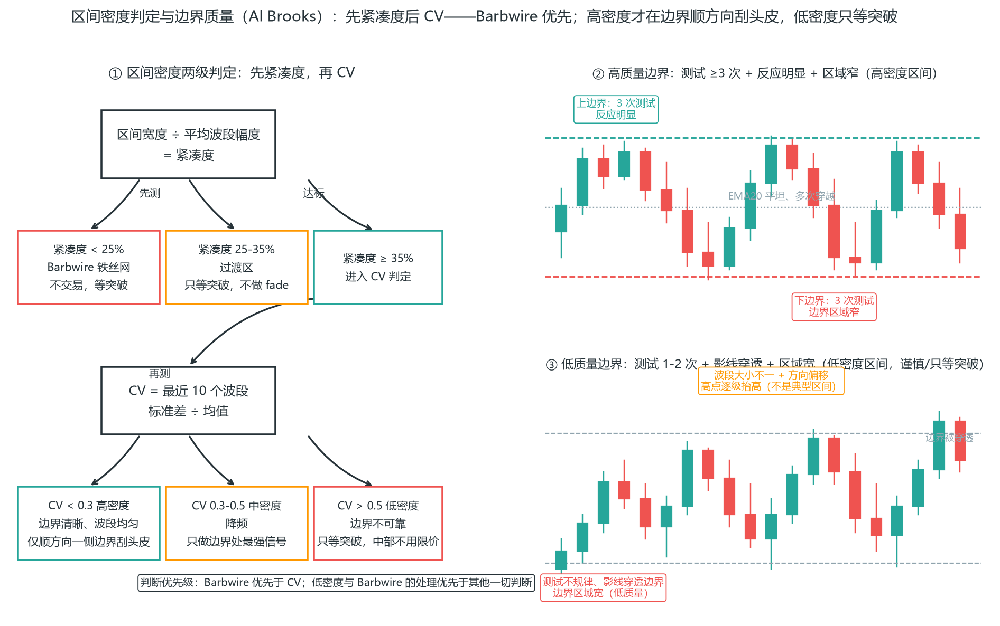

### 4.4 系统三：突破交易

**逻辑**：区间突破=供需失衡，新趋势开始。

**规则**：

1. **等待**：价格在区间内压缩很久（波动收缩），接近区间边界。
2. **触发**：突破+大实体确认（位移）+放量，或突破后回踩边界不再进入区间。
3. **入场**：突破瞬间，或回踩确认后（回踩入场胜率更高、止损更小，代价是可能错过）。
4. **止损**：区间内部（突破点下方）。

**核心纪律**：只做"区间外突破"，不做"区间内突破"。判断：突破 K 线实体是否完全收在区间外 + 成交量是否放大。

**突破的完整过程（QuantSystems 附录，量化版流程）**：一次突破不是“突破了就算”，它是一串有分叉的事件——每根 K 线收盘后重新判断走到哪一步：

1. **突破发生**：一根新的大突破棒收盘，或一系列连续小棒形成突破。
2. **无回调 = 突破仍在进行**：价格持续同向走，突破在“创造缺口”，还没有结论。
3. **出现回调 = 突破结束（或失败）**：市场开始测试突破点——此时才真正分叉：
   - **测试成功**：突破守住，突破缺口保留并升级为**测量缺口（MG）**——预期同向第二波，缺口位置可量出目标（呼应 2.7）；
   - **测试失败**：突破失败、缺口闭合，突破缺口降级为**衰竭缺口（EG）**——反转信号（呼应 2.7 的晚期大 K 线）。
4. **失败的回调本身可成新突破**：关闭缺口的那根回调 K 线，自己可能成为新一轮突破的起点——只要它收盘站对方向，同方向至少再期待一根 K 线或横盘。

一句话记忆：**突破没有出现之前不存在突破，出现之后也只是“制造缺口 → 测试 → 缺口升级或降级”**——你等的不是突破那一下，是测试的结果（呼应 3.10 的测试=四批人投票）。

**突破交易最大的敌人是假突破（第 3.1 节）**。所以记住一体两面：突破站稳了就跟随（系统三），突破收回了就反手（假突破）。同一个突破，两种应对，取决于它"站没站住"。

**缺乏紧迫感的突破 = 陷阱（Ali 闪卡）**：强劲突破会产生紧迫感——买方迅速跟进，测量缺口迅速变大。如果突破后在突破点附近停留很久（买方有大量时间在信号 K 线收盘后买入），紧迫感缺失会**自动降低突破的概率**：看起来会成为测量缺口的形态，实际是多头陷阱。判断口诀：**真的突破不等人，等人的是陷阱。**

**收盘价买入/卖出（COTC，Ali 闪卡）**：突破入场的一种固定形态——"收盘价买入"就是等价格收出 2-3 根连续强势 K 线时在收盘价进场（收盘价卖出同理），判据三选一：① 一根大 K 线，收盘价高于左侧许多 K 线；② 2 根连续的大尺寸 K 线，收于高点附近（最好是收于高点）；③ 3 根连续的中等至常规尺寸 K 线，收于中点之上。**生命周期**：COTC 反弹通常持续 5-6 根 K 线——早期入场很重要；**4-5 根连续趋势 K 线后 COTC 不可靠**（急剧反转高风险），大多数 COTC 反弹不会超过 7 根连续 K 线；止损设在最后一个 COTC 看涨 K 线下方 3-4 个跳动点。**退出**：后期出现异常情况退出——最后 K 线变得过大则在其收盘时退出；达到重要磁力点后出现相反内包线则退出；5-6 根后部分获利。**陷阱**：K 线之间没有微缺口时 COTC 不可靠——无微缺口的"上涨"只是低时间框架上的通道（区间内的腿），达到测量移动后方向反转。

**入场方式的选择**：突破瞬间进场（激进）vs 回踩进场（保守）。激进版的优势是不错过，劣势是止损远、被假突破打脸的概率高；保守版的优势是止损近、胜率高，劣势是可能永远等不到回踩。**对新手，回踩入场更合适**——它过滤掉了大量假突破，代价只是错过，而错过不亏钱（第 7 章军规第 8 条）。

**初始止损（iStop）的量化版（Ali 突破白皮书）**：以信号 K 线波幅为基准——信号棒相对较小时，止损距离取信号棒波幅的 2 倍（小信号棒噪声大，宽一点更稳）；信号由两根 K 线组成时，取两根合并波幅的 2 倍；信号棒远大于平均水平时，取 1 倍波幅再加几跳（大信号棒本身已含止损空间，紧贴结构即可）。与 4.12 统一止损表同一原则：止损是结构失效位，信号棒越小越要给它呼吸空间。

**突破模式（Breakout Mode，Ali 闪卡）**：市场处于突破模式时，价格走势出现连续的方向相反的刺透形态——双顶与双重底；这也构成了突破前形成的紧密交易区间的定义。**紧密交易区间（TTR）形成转折点**：该区域是交易者预期趋势可能发生反转（无论最终是否形成）的关键地带。突破模式情境可能由单根 K 线（十字星）构成，也可能持续数小时、包含 40 根及以上 K 线的紧密交易区间。**突破模式的概率并非总是 50/50——突破前的价格行为将影响突破方向的概率**：在强劲趋势中，突破模式会演变为延续形态；在极端价位与磁吸位附近，突破模式会转化为反转结构。

**突破强度评估：突破还是开盘区间？（Ali 闪卡）**：评估突破的强度，要与失败突破信号 K 线的强度相比——回调的最终阶段通常是微通道；**含 4 根或更多根 K 线的微通道，其通道突破通常会在回调前持续 1-2 根 K 线**（尤其当该微通道包含 4 根或更多根 K 线时）。强劲趋势通常没有回调，因此在微通道的突破处入场是合理交易；趋势不强劲时，微通道的突破通常在一两根 K 线内就会出现失败尝试。

**突破缺口的生命周期：闭合序列（BOG，Ali 闪卡）**：突破缺口（Breakout Gap）不是一次性事件——它有自己可读的闭合序列：① 突破后每次回调（PB）都在缩小缺口，但**只要缺口仍开放，突破方向就有更多动能**；② 最终回调触及突破点（BOP）把缺口减到零，但**通常不会越过它**（无重叠）——缺口完全闭合前，突破都算"测试中"；③ 如果下一条腿又创出新的突破缺口，新缺口的闭合概率更高（后创的缺口更脆弱）；④ 如果下一轮回合产生新的**大缺口**且仍保持开放，模式将升级为**高潮或新一轮突破**——这种序列通常会画出"收缩楼梯"图案；⑤ **当最后一个缺口闭合时，逆势交易者开始淡化第一个回调**——第一批被套者离场完毕，真正的反转测试才刚开始。两个精确版本：**负向测量缺口**——回调点略低于突破点、表明动能不足，回撤填补突破缺口后形成"负向测量缺口"，其预测可靠性降低但仍可能非常准确；**身体缺口**——突破形态最后一根 K 线的实体与突破 K 线实体不重叠即形成，只要实体缺口保持开放，突破延续（TRES）的概率就高于反转（TREV），尤其在回调较弱时。

**突破之后：三种结局（Ali 闪卡）**：价格突破至新低（或新高）后只有三种可能——**横盘整理、反转、趋势**。别急着给突破定性，突破后的头几根 K 线决定剧本：① 若突破后出现强回抽拒绝（突破 K 线展示前期买方力量后创出新高、随后对新低形成拒绝），说明反向方把突破当回调处理，反转概率上升；② 若突破后跟随即时跟进（大实体、无犹豫），趋势概率上升；③ 突破后立刻横盘 = 正在"投票"——等测试结果再站队（呼应 3.10 的测试=四批人投票）。

**突破 60EMA：成败两种迹象（Ali 闪卡，ES 日内常用）**：以 60 周期均线为目标的突破，成败在突破前就有迹可循：**失败迹象**——接近 60EMA 时出现犹豫、内部回撤、大量重叠且无明确缺口，后续回撤中价格突破回撤高点的情况值得怀疑；弱势接近突然转为强势并形成明确缺口时后续可能上涨，但**迟到的突破必须超越所有阻力位且展现出惊人强度**。**成功迹象**——清晰强劲的跳空缺口（突破前后均有明显缺口）、K 线之间几乎没有重叠、极少或没有内包线、K 线接近高点且几乎没有上影、突破后回踩（PB）疲软且令人失望——**回踩越弱，突破越可靠**。

### 4.5 系统四：微通道交易（Micro Channel）

微通道是通道家族里最特殊、也最容易被量化的一支（Al Brooks 一脉的 Ali Moin-Afshari 把它做成了完整系统，附录 C.7）。它适合明确趋势日，基础胜率 70% 以上，但利润薄、节奏快——新手了解即可，趋势回调（系统一）仍是默认。

**定义（可编程标准）**：价格沿同一方向至少 3 根 K 线、且存在微小缺口（相邻 K 线低点不重叠）：

- 至少 1 根 K 线强势收盘（收盘接近最高/最低）；
- 上升微通道中，每根 K 线低点不低于前一根低点；
- 基础胜率 70%，最强形态可达 90%。

**10 项强度指标（每缺 1 项扣 5% 胜率）**：

1. K 线大小均匀；
2. 多数收盘在最高点附近；
3. 存在微小缺口；
4. 存在明显 tick 缺口；
5. 每根收盘高于前根最高点；
6. 每根低点高于前根低点；
7. 部分开盘 ≥ 前根收盘；
8. 部分 K 线无下影线；
9. 多数无上影线或上影很短；
10. 无十字星和反向 K 线。

**10+2：两个附加因子**（QuantSystems 概率估算）：10 项之外再问两件事——**① 距离**：价格移动了合理的大距离；**② 时间**：突破波段超过 3 根 K 线。两者都满足，强度再上一个台阶。

**概率估算表（对称第二波）**：以上 10+2 项不是感觉，是扣分制——每缺 1 项扣 5%；**末段行情（第 3 波以后）再扣 10-20%**；逆市场制度（regime）扣 10-20%；突破波段少于 4 根扣 5%；距离强加 5-10%；时间足加 5-10%。非对称第二波：所有扣减减半，距离与制度权重更高。原则是“Good is Good Enough”：找到大概率出第二波的结构就够了，不用微分析到极致。

**入场**：第 2 根 K 线收盘时市价入场（或在其收盘价下方 2-4 个最小价位挂限价单）；三根 K 线构成完整信号——第一根预警、第二根确认、第三根跟进。

**止损（双止损体系）**：初始止损 iStop = 突破 K 线低点下方 1 个最小价位；实际止损 aStop = 回撤 K 线低点下方 1 个最小价位（若无回撤，用第一腿 K 线低点）。入场后价格应先朝预期方向移动，而非先触及止损。

**目标**：基于实际风险 aRisk 争取 2 倍回报（基于初始风险 iRisk 争取 > 0.5 倍）——这正是第 6 章"实际风险"概念的应用：止损很快收紧到 aStop，真正的风险远小于名义风险。

**出场**：

- 出现加速大 K 线（大阳/大阴）且已有浮盈 → 收盘市价平仓（利润最大化）；
- 出现十字星/反向 K 线/长反向影线 → 减仓（最小化策略：多头在空头反转 K 线下方 1 单位退出）；
- 微通道超过 6-7 根 K 线 → 概率转向回撤而非延续（12-19 根无回撤是低概率极端）。

**决策要点**：震荡日只做 1-2 根 K 线的刮头皮，趋势日可期待与微通道等长的第二腿；完全基于当前图表量化特征决策，不参考更高时间框架——这是它与其他系统最大的不同：它快到来不及看 HTF。

**通道市场统计（Ali 闪卡）**：市场始终在某种通道中移动——倾斜的交易区间就是通道。**突破多头通道上方和跌破通道下方的失败率达 75%**；通道随着成熟而减弱，后期加速（突破）是低概率事件：多头通道上方的多头突破概率约 25%。若看跌方在强劲的多头波段中获利（波段强劲到足以形成 2 波段），其后的回调通常会弱得多。**价格行为在通道末期突然变强，通常意味着行情终结（衰竭性高潮），为反转交易创造了条件**。顺势信号柱在紧密通道中通常较弱；逆势信号柱在紧密通道中通常较强，但多数会失败。**只要微缺口保持开放，趋势方向就存在动能**——仅在靠近趋势线的趋势方向入场。

**弱势通道可能持续很长时间（Ali 闪卡）**：弱势多头、广泛多头通道伴随深度回调的持续时间可能远超想象。**当通道出现 4 或 5 次推动时，反转突破的概率接近 40% 比 60%（而非 25% 比 75%）**；第 5 或第 6 次推动可能在看涨通道上方形成多头突破——60% 概率开启交易区间（反转）、40% 概率沿通道方向突破。一旦发现多个卖出高潮在主要支撑位受阻，接下来几根 K 线只考虑做多，并寻求两个横盘转上涨波段的机会。低成交日不影响弱通道突破：成交量减半仍可能突破至历史高点上方。

**尖峰与弱通道（Ali 闪卡）**：弱势通道（阻力位下方）有 66% 反转概率——通道急速上行时多头突破成功率仅 25%；通道疲软且呈现小幅回调趋势时，多头成功率降至 33%；看跌突破和两段式下跌（2LD）的概率更高，达 66%；若通道过窄或呈现楔形，成功率最差。熊市通道镜像：弱通道中突破概率五五开；通道陡峭向下时成功看跌突破概率仅 25%；通道几乎走平且主要呈现交易区间形态时，行为更像区间而非通道。

**窄幅通道：仅沿通道方向交易（Ali 闪卡）**：紧密通道属于大时间周期的突破——仅在通道方向上进行交易。以下特征出现得越多，交易在紧密通道方向上的成功概率就越高：① 回调持续 1-3 根 K 线；② 回调幅度小于最小波动幅度的 2.3 倍；③ 回调幅度小于平均 K 线柱的 2 倍；④ **使用止损入场的逆势交易大多会亏损，即使卖出信号 K 线很强劲时也是如此**；⑤ 多数回调仅回撤前一波段的 1/3 至 1/2；⑥ 突破点与回调点之间的缺口，分批建仓策略无效。

**微通道长度统计（Ali 闪卡）**：多数微通道约 12-15 根 K 线；少数情况可持续 16-20 根；持续 21-25 根或更多的通道较为罕见。**约 20 根 K 线后，多头趋势中开始向看跌的一方倾斜（反之亦然）**——呼应 4.5 出场规则：超过 6-7 根 K 线概率转向回撤而非延续。

**尖峰与通道（Spike & Channel，Ali 闪卡）**：趋势出现长钉（突破缺口）表明市场正进入明确的趋势方向——**长钉形态越强劲，后续以通道形式跟进（趋势性交易区间）的概率越高，且通道延伸更远的可能性越大**；长钉出现后立即发生回调。**通道突破在趋势方向出现的情况较为罕见（仅 25% 概率）**：通道通常会反转，市场会测试通道的起点，形成双底/牛旗形态；随后市场在试图形成交易区间时，会朝趋势方向至少反转 25%。通常会有一次回调至通道的 50% 位置，随后市场进入横盘，并决定测试整个通道起点或恢复趋势。

**尖峰与高潮（Spike & Climax，Ali 闪卡）**：尖峰和顶点是尖峰和通道的一种变体——连续的高潮形态通常伴随着更深的回调，往往回到第二个高潮的底部；这是一个没有明显抛物线楔形的抛物线高潮。**在尖峰与高潮形态中，顺序通常是颠倒的：先出现通道，然后小幅回调，接着产生尖峰**——通道起到尖峰的作用，而该尖峰通常仅为一根 K 线起到通道的作用（所以也叫"尖峰与通道：巅对决战例"）。尖峰通常是对阻力位和趋势反转的真空测试，或开启深度回调。当形态较小时（如 1-5 号形态），高潮和回调可能出现在同一根 K 线上。日线图形成高潮时，5 分钟图通常处于强劲趋势中。

**尖峰的定义（Ali 闪卡）**：当当前 K 线跌破前一 K 线的低点时，前一波即成为多头尖峰，反之则为看跌尖峰。**任何尖峰都是高潮**：向上尖峰是反转下跌的设置，向下尖峰是反转上涨的设置；尖峰可以是单根 K 线。连续高潮不可持续——市场必须先向相反方向修正，才能继续沿原方向运行。

**买入/卖出压力（Ali 闪卡）**：B/S 压力是累积的——随着更多 K 线出现，压力会继续累积，直至另一方被压倒而放弃。**缺口在 5 分钟图上极为罕见，是强烈 B/S 压力的信号**。前期卖出高潮上方始终存在卖方压力；前期买入高潮下方始终存在买方支撑。**买入压力的微妙迹象**：连续的几根小 K 线，但每根低点都高于前低、且多数高点持平或高于前高——这是发生在更高时间周期的突破。当强劲看涨突破后出现微通道时，市场很可能处于小幅回调的看涨趋势中；首次反转将是小幅反转（MRV），突破缺口有超 60% 概率将保持开放。

**紧迫性（Urgency，Ali 闪卡）**：紧迫感是力量的象征——交易者通过激进地买入或卖出（不等回调）表明他们对市场走向的信念，紧迫感在价格图表上留下独特足迹。**当出现紧迫感和跟进动作时，大量被套牢的交易者会逆势操作首个回调，使其成为高概率交易**（呼应 4.4：真的突破不等人，等人的是陷阱）。

**K 线计数重置与隐含回调（Ali 闪卡）**：**一次新的突破会重置 K 线计数**——如果波段强劲但突破呈现更低高点，仍可重置计数。**隐含回调**：一个未突破的看跌 K 线（低于前一根 K 线的低点，但出现看跌的 K 线实体）表明处于较低时间框架的回调中。多头微通道中的隐含回调：没有看跌 K 线但有 H1 回调（回调形态在 1 分钟图上，所以隐含的回调在 5 分钟图上）。

**窄幅通道：首次加速通常幅度较小（Ali 闪卡）**：窄幅通道比突破走势更弱，交易策略需相应调整——**首次加速通常幅度较小**，1R 通常是次要目标；TC（窄幅通道）通常在成为 BR 趋势前先转为 TR（交易区间），因此 BL（突破腿）有充足时间以较低止损概率退出。操作区别：在突破行情中，交易者在前高点上方买入、在新高点强势收盘时买入；在趋势延续阶段，他们在突破前高位卖出锁定利润，随后等待回踩时再次买入；当波动区间较大时，在前高上方 1 至数个点处获利了结。

**矫正腿 ≈ 图案一半（Ali 闪卡，时间管理）**：修正量通常约为图案尺寸的一半——例如图案由 48 根 K 线构成时，预计调整阶段将持续约 24 根 K 线。时间管理同理：如果一轮持续两小时的上行行情在触及阻力位后转跌，那么这轮下跌很可能持续 1 至 2 小时——**接下来至少一小时，只考虑做空**。观察呈现清晰形态的最高时间周期，以它作为回调持续时间的参考基准。

**楼梯形态：宽幅通道趋势结构（Ali 闪卡）**：楼梯交易日是 TTRD 的变体，要求至少出现三个交易区间——当日波动度较大，但呈现明确的高低点趋势走势；几乎每个突破点之后都会出现回调测试（PB），因此连续波动之间存在部分重叠。**收缩楼梯**：若每次突破幅度都比前次小，则形成收缩楼梯模式——这是动能减弱的信号，可能引发更大级别的反转（呼应 4.4：收缩楼梯通常对应 BOG 闭合序列的升级）。低概率事件顶部：突破 W 底失败后出现的顶部。

**熊市通道卖出技巧（Ali 闪卡）**：当市场处于 BR 通道（弱 BR 趋势）且在 EMA 上方反复测试时，有三种主要卖出方式：① 在 BR 趋势线下方卖出（尤其是在 EMA 附近）；② 强势卖出 K 线收于 EMA 附近时卖出；③ 在较高的点上卖出（等待反弹至更强位置再空）。

### 4.6 状态机与多时间框架

三个系统不是三选一，而是**状态机**——市场状态决定用哪个系统（系统四微通道是趋势日内部的快枪，其余时段仍由前三者主导）：

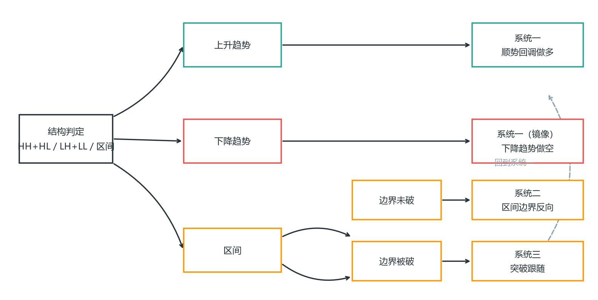

每根 K 线收盘后重估状态，结构变了就换系统，不恋战。

**日结构分布（Ali 突破白皮书统计）**：约 65% 的交易日是趋势性交易区间日（TTRD）——趋势波段 + 区间震荡的组合；纯趋势日只有 10-15%，小幅回调趋势日约 5%；约 85% 的交易日约一半时间处于某种交易区间内。这解释了为什么“区间”是状态机的默认状态：大多数日子、大多数时间都在区间里，趋势是稀缺品——看到趋势日（如 2.11 的趋势日形态）才切换趋势系统，平时默认区间逻辑。

**交易区间日（TRD）的识别（Ali 闪卡第 2 部分）**：84% 的交易日至少存在几个小时的交易区间，超过 65% 的交易日从开盘到收盘都是交易区间日。五个提高“今日是区间日”预期概率的条件：① 反弹后出现深度回调；② 更高时间周期（HTF）正在测试关键位；③ 过去多数交易日都是区间日且 HTF 也处于区间；④ 处于 HTF 趋势末期；⑤ HTF 出现高潮行情之后。开盘出现带长影线的重叠 K 线（开盘即区间价格行为）直接提示区间日。TRD 的结构：多数交易区间日和 TTRD 包含 3 个主要波段，每个波段可细分为更小的子波段；市场通常先形成低点交易区间（LTR），测试上方往往失败并在尾盘形成第二段下跌（2LD）；日 K 线实体小、反转多、突破走不远就被拉回区间内。

**区间日交易法（一切都颠倒，Ali 闪卡）**：交易区间日充满失望——突破失败、看似强劲的走势出现糟糕的跟进。所以一切反转：**在支撑位下方买入、在阻力位上方卖出**；在底部附近买入看跌大 K 线的收盘价、在顶部附近卖出大型多头 K 线的收盘价（强势 K 线出现在极点 = 竭而非突破）；**只使用限价单**；市场出现强劲突破但跟进不佳时，它仍处于交易区间；若出现强劲突破且伴随良好跟进（FT），当日行情特征可能改变——留意并切换系统。分批建仓在区间日非常宽容。**5-6 tick 支撑法则**：区间日内市场下行时，每个卖出信号 K 线下方 5-6 个跳动点都是支撑位——空头在此获利了结、多头在此建仓；分批在这些位置买入，目标 1 点利润。

**窄幅交易日（Ali 闪卡）**：日内波幅小于 10 点即小行情日（小于 5 点十分罕见）。窄幅日内，市场突破某个位置 5 个最小价位时总会发生回撤；突破后未能加速则通常走不远；突破发生的时段越早，达到测量移动目标的概率越高；日内波幅可能扩大至开盘区间的两倍左右然后横盘整理。**开盘区间小于 5 点时，突破概率高达 90-95%**——这是“18 根 K 线区间”规则的例外，此时突破很可能发生（往往在尾盘时段，突破后测试一个清晰的磁吸位）。

**开盘区间的时间结构（Ali 闪卡，东部时间）**：日内的关键决策点几乎全部集中在上半天，先记三条硬数字：

- **第 12 根 K 线（约 10:30）**：80% 的交易日，当日高点（HOD）或当日低点（LOD）已在此前形成；
- **第 18 根 K 线（约 11:00）**：90% 的交易日，当日高点/低点已在第 18 根收盘时形成——**第 18 根之后出现的任何新极点，都只会降低再创新极值的概率**：第 18 根后出现新当日高点，则 90% 概率当日低点保持为当日低点（当天不太可能再走出相反方向的突破行情）；
- **趋势日的例外**：趋势日的趋势极值通常出现在当天晚些时候——第 18 根前已见极值是区间日的特征，趋势日反之。

再记四条时间规律：**14:00-14:30 下午停顿**（有时是陷阱）；**15:30 收盘价买入/卖出反弹**（如果开始的话通常持续到收盘）；**14:30（第 60 根 K 线）反转陷阱**——Emini 常在下午 2:30 尝试反转但失败后继续原趋势（有时反转尝试一直达到 50% 回调水平然后失败），下午 2:30 之后看到反转信号先默认是陷阱；**4 点波动法则**——90% 的交易日某个时段至少出现一次 4 点波动（通常来自一个好的止损入场设置），如果当天还没有出现过 4 点波动、而你看到一个合理设置，很可能就是 4 点波动的开始（波动率越压缩，越要盯着）。

**晚突破 = 失败突破（Late BO = FBO，Ali 闪卡）**：在交易区间日，开盘区间后期的突破往往成为失败突破；跌破第 18 根 K 线形成的开盘区间同样如此。**晚突破必须强劲才可信**——三条件：① 强劲突破 K 线收于高点（看跌则收于低点）；② 强劲跟进 K 线；③ 出现微型缺口。若属低概率事件更佳（至少预期突破方向上出现两段走势）。若区间持续 20 根或更多 K 线，市场重回突破模式（约 50% 向上或向下）。

**开盘价磁吸（中间三分之一法则）**：当日开盘价位于当日价格范围中间三分之一时，60% 概率当天晚些时候被测试；TTRD 结构下，晚盘突破可能完全回撤至开盘价进行测试（随后趋势恢复、反转或交易区间，反转概率最低）。**收盘测试开盘价决定日 K 线形态**：下午看跌波段触及开盘价后反弹 → 收盘通常接近或高于开盘价；下午看跌波段跌破开盘价 → 反弹难以持续，市场最终在收盘时形成紧密交易区间、收于开盘价附近。HOD/LOD 由测量移动突破开盘价时，市场通常在下午 2:00-2:30 左右测试回开盘价——可能成为一轮波动的起点，也可能只是提供方向支撑/阻力。

**开盘第一根 K 线（Bar 1）**：若 K 线 1 为趋势 K 线，构成顺势交易机会；若失败（尤其出现反向趋势 K 线），构成相反方向机会；若是交易区间 K 线，则区间日/趋势性区间日概率更高。**75% 概率 K 线 1 会反转**（仅 25% 延续——开盘冲动往往是假动作）。

**连续 4-5 根同向 K 线法则**：市场在开盘时很少出现连续 5 根同向 K 线；每出现一根，下一根延续同方向的概率就下降；连续 4 根后，第 5 根出现反向 K 线的概率极高。若上涨波段出现回调（尾部）和内包 K 线，高潮特征减弱——第 6 根出现无效回调的概率增加。**开盘强劲跳空有 75% 概率跟进至测量移动目标且至少包含两个阶段**；开盘波动失效后，通常在早盘确立当日高点/低点（50% 概率形成趋势，50% 概率反转）。

**60 分钟 EMA 走平**：60 分钟 EMA 走平增加区间日/TTRD 概率而非延续趋势；价格相对 60 分钟 EMA 的位置影响进一步走势——走平的 EMA 是区间的磁吸线，向上倾斜的 EMA 全天都是支撑。

**外包日与临近外包日**：外包日（Outside Day）是 TTRD 结构——市场突破昨日高点后反转下行并试图突破昨日低点（昨日通常是区间日或 TTRD）；**突破昨日低点下方的波动点数通常与突破昨日高点上方相同（对称性）**；若这波抛售呈现底部形态，跌破昨日低点可能失败并引发反转上行。**序列必须正确**：先是突破昨日高点，之后从略高于昨日低点的位置反转上行——这才是可交易的临近外包日；若序列颠倒（先突破低点再反转），是支撑阻力双重反转而非外包日。

**跳空日的方向限制**：大幅向下跳空开盘（远低于昨日低点）后，当日高点超过昨日高点或大幅高于昨日高点的概率通常较低；向下跳空开盘增加当日低点在尾盘形成的概率（市场通常先形成楔形、随后从阻力位回落）；若昨日是低波动日而今日是强劲趋势日，概率将改变。

**ORV 开盘反转（Ali 闪卡）**：开盘区间（OR）很少正好一小时——它指首个有效摆动开始前的时间段（可能 15 分钟到 2 小时），趋势启动时该区间即告结束；若初始走势反转并开启反向趋势，就形成 ORV 形态。**首个摆动入场点通常是当天最佳交易**，往往来自反转。正常情况下开盘区间应在 EMA 处反转；当反转点远高于/远低于均线时，表明另一方力量强劲，会限制反转后的波动。开盘区间突破需伴随大趋势 K 线，否则更可能形成交易区间。**ORV 后 70% 概率出现两波与反转方向同向的走势**（大趋势 K 线图上更可靠）。

**ORV 的测量移动（MM Up）**：若市场强烈反转 ORV 并突破看跌腿的顶部，初始目标是测量移动向上；途中遇到的任何阻力位（尤其市场关注它时）都是获利了结目标。若反转没有强于开盘区间波段，则看跌波段顶部（当日高点）就是获利了结目标。

**收盘价买入后深度回调（ORV 变体）**：当急速波动（Spike）失败且市场测试其低点时，两种可能结果——看跌突破与测量移动下行，或价格寻获支撑随后形成多头通道。寻找强势迹象：楔形反转后出现更高低点和更高高点、回调幅度逐渐缩小且未跌破突破点、回调守住 50% 回撤位、看跌方无法形成连续强势看跌 K 线。

**弱势开盘区间突破**：跌破前摆动点的突破幅度较小（如仅 2 个最小单位低于前摆动高点），突破力度不足以确认强度——回调可能很深，当日具有 TTRD 特征；ORV 缺乏大趋势 K 线时尤其如此。从开盘区间低点开始的下跌段未能触及均线 → 市场通常会回调后再尝试下行；多头剥头皮者在均线和前低买入、分批进场。

**2nd FBO（第二次失败突破）**：当支撑或阻力测试失败时，开盘区间波动有更高的成功概率——第二次失败后的反向是 ORV 的可靠触发器。

**开盘缺口：大缺口的定义与概率（Ali 闪卡）**：跳空缺口意味着该 K 线收盘时与前一根 K 线不重叠，缺口会增加任一方向趋势的概率。**大缺口 = 过去 5 天内最大的缺口，或大于约一半的日均波幅**。大缺口开盘的概率底色：50% 沿缺口方向形成通道（背景好、K 线 1 和 2 强劲时可达 70%），30% 反转形成反向趋势，20% 交易区间。**唯一关键因素是市场如何应对这种相对极端的走势——接受还是拒绝**；交易日最初几根 K 线的尺寸、方向及趋势 K 线数量往往显露接下来趋势日的方向。

**市场接受缺口（TIB 最强形态）**：K 线 1 为大型趋势 K 线收于高点，K 线 2（更大的趋势 K 线）收于高点，随后 3 根跟进看涨 K 线收盘价高于中点——在第二、三根收盘价买入，最小两个上涨波段。失败条件：K 线 1 后无跟进（十字星/内包线）、第 2 根 K 线反转第 1 根、深度回调至 K 线 1 低点下方、开盘缺口太大。**市场拒绝缺口**：通常先回调至 EMA，两段式回调确立趋势（可能耗时一小时或更久，有时三至四段）；市场开盘时往往先反向测试、随后反转形成持续整日趋势。**交易区间响应**：未形成突破模式接受/拒绝缺口而是形成窄幅区间 → 日结构通常演变为 TRD/TTRD；较罕见的是突破伴随跟进开启趋势——突破前通常出现强势迹象信号，使交易者能在突破前入场。

**跳空日的结构规则**：大多数大幅跳空日的前 5-10 根 K 线呈现交易区间行为——若大幅跳空开盘后跟进方向不明，应假设处于交易区间，低买高卖剥头皮直到明确方向确立。缺口方向的两段式跟进（有时形成 3-4 段走势，构成双顶/双重底或楔形后反转）；逆缺口方向的两段式回调同样如此。**逆缺口方向两段式回调后突破失败 = 延长反转**（有时是小回调通道），属于失败的开盘区间突破类型。趋势开始前通常会有两段逆势波段（主要走势开始前有三波段逆势走势）。

**岛形顶/底（Island）**：若缺口反转前一日也是缺口开盘（跳空开盘日之后次日出现反向巨口），形成岛形顶/底——它在更高时间周期图上引发更大趋势；此时前一日通常为交易区间日 = 突破模式。**岛形顶/底的功能与五日大缺口相同**。

**大缺口位于波段的哪个位置决定结果**：波段中部——最终结果取决于走势强度，通常形成 TRD（HTF 上的回调），较少演变成趋势日、尖峰通道（SC）或宽通道（方向与 HTF 一致），次日可能趋势恢复（TRES）或反转（Rev），若次日反向巨口则转变为岛形；**波段末端（趋势末期）**——衰竭概率增大，可能发生 ORV 后反转；**自高潮底部**——大概率强势反转、TIB 概率较高。

**开盘巨缺强势反转**：第一根 K 线必须强势收于高点，第二根必须强势收于高点——若 K 线 2 比 K 线 1 大，全天强劲趋势概率极高；若更小，更可能仅出现 2LU。1LU 后的紧密交易区间通常测试 EMA，然后出现 2LU；突破后的紧密交易区间增加仅出现 2LU 的概率及尾盘横盘价格行为的概率。5 分钟图上强劲看跌反转 K 线完全位于前一 K 线上方，是最强反转形态（通常连续上涨数根）。

**反转日（Reversal Day，Ali 闪卡）**：反转日 = 开盘区间设置突破后的反转——突破达到测量移动目标后开始回调至突破点，常重新跌破进入开盘区间；若向开盘区间的强势反转最终在区间另一端收盘，当日成为反转日；若反转未能在开盘区间另一端收盘，演变为 TTRD 或 TRD。**多数反转日会演变成某种趋势性交易区间日**——极少出现反转方向上完整通道的交易日。若初期抛售至当日低点的幅度较小，反转日大幅反弹概率更高；初始抛售较小时日间结构更遵循 ORV 模式而非反转日模式。大涨大跌 = 横盘交易区间价格行为；同等强度的多头/空头波段限制上行和下行空间。

**从昨日低点下方的反转（1/2 FBO）**：从昨日低点下方（或昨日低点下方第 1、2 根失败突破柱——两者属于相同形态）的反转，需要强劲的信号 K 线和良好的后续动能（连续 3 根平均多头 K 线收于高点）；**反转波段必须突破开盘区间才有机会形成趋势日**。三次多头反转尝试均未形成强势走势 → 判定小幅反转，增加看跌概率。示例信号：看涨反转未能维持在开盘区间上方转为 2LT；看涨突破小幅回调看跌通道上方失败——这是针对两段式下跌的高概率交易。

**暴跌与飙升高潮反转**：强劲单根看跌 K 线突破开盘区间遭遇重大失败，出人意料出现强劲看涨反转 K 线——大幅抛售使强劲看涨趋势难以实现，而强劲看跌趋势也不再可能，**TTRD 成为最可能的结果**。

**趋势恢复日（Trend Resumption Day，Ali 闪卡）**：交易日最初一小时左右呈现强劲趋势，随后进入交易区间（常持续数小时，让交易者误以为收盘前行将清淡），趋势在最后 1-2 小时内恢复。**第二波段的幅度通常与第一波段相同**。持久的交易区间通常非常紧密。当日尾盘常出现试图反转趋势的突破，但这通常是陷阱——市场随后反转向相反方向突破直至收盘；区间异常紧密时陷阱出现可能性更高。对之前未入场的交易者，通常存在突破回调入场机会。看跌趋势恢复日：看跌突破力度强（所有 K 线收于低点、K 线之间重叠很少、大型突破缺口 BOG）增加测量移动向下概率、降低二次顶（2LT）概率。

**紧密交易区间（TTR）系列（Ali 闪卡）**：

- **小型双顶/三重顶**：紧密区间内形成明显小型双顶时，约 50% 概率出现两段下跌波；若第一段下跌波段可信，60% 概率出现可交易的第二段下跌波段。波段幅度可能较小且完全包含在紧密区间内，导致巨大的突破。突破区间后的小型双顶更容易形成大突破，尤其出现在大型顶部形态（如失败缺口楔形顶）后形成的紧密区间。小型三重顶同理。
- **延长紧密区间 = 中性市场**：当早盘多头走势升至某个阻力值时（多头市场更常见），初始多头走势延伸幅度越大，当日稍晚从紧密区间大幅突破的可能性越低。**上行空间通常有限、下行风险更大**——多头突破通常走不远、空头突破可能走得更远；紧密区间主导一切，直到强劲突破改变当日走势特征。当日内前 10 根 K 线呈此形态时，很可能迎来平静的一天。若当日为内包日，突破到达前一日外包日某个极端价位的概率更高。
- **重要报告/新闻前**：预期在已知时间发布且将产生重大影响时，市场通常转为中性并形成突破模式（扩张三角形结构）。
- **惯性**：紧密交易区间的惯性会阻碍区间扩张；下午 3:00-3:30 期间市场试图突破，但多数情况下难以走远。
 **风险**：持续出现的紧密区间造就中性市场——多数情况下长紧密区间会限制突破的延伸空间（除夕夜极端案例是例外：平静交易日突然转为强劲趋势）。

**BTC/STC 收盘价买入/卖出（Ali 闪卡，尾盘趋势系统）**：交易日期结束时只有两种市场——交易区间（限价单市场）或趋势。**BTC/STC 市场常启动于下午 3:30 左右**（出现强劲突破，突破伴随明显的紧迫性才可靠）；若市场在下午 3:45 仍处于交易区间或紧密交易区间，则不太可能形成收盘价买入/卖出市场，更可能延续区间走势直至收盘。**过早的收盘价买入常失败**：若上涨启动过早，多头会凭借最后几根强势 K 线获利了结、次日之前不再买入——买方消失导致深度回调或反转（典型背景：HTF 交易区间、均线走平，新闻驱动的强劲反弹过早启动）。**硬性条件**：收盘价买入与当日早些时候的主要趋势方向相反（否则没有对手盘）；日线结构为 TTRD 或强劲趋势耗尽后形成的交易区间；**BTC/STC 需包含 4 根或以上 K 线**；**77 号 K 线规则**——反转信号 K 线必须在 77 号 K 线（约 15:50）前形成，若 77 号 K 线即为信号 K 线则宜放弃该笔交易；BTC/STC 最好尽早开始（下午 3:30 前），计划在第 76 根 K 线前平掉。**BTC/STC 结束时，常常在反方向设置高概率剥头皮交易**：收盘价买入的反弹达到高潮时（形成对当日开盘价、日均线的抛物线），预期出现 2LU，但抛物线楔形需先修正；长期趋势末段的强势通常是衰竭缺口，会形成 FF 反转。若 BTC 突破失败：市场迅速移动到支撑位或阻力位——**逆势操作强支撑/阻力位的突破并分批入场是可靠策略**。从深度抛售中反弹突破历史高点通常不会大幅超越历史高点；市场以抛物线式创出历史新高很常见，但之后往往横盘后向下。

**动量反弹与急剧抛售（Ali 闪卡）**：动量交易者只要势头存在就买入并持仓做波段，势头减弱时迅速抛售离场——所以动量行情的回落是"价值型多头逢低买入、动量多头快速退出"的合力，回调启动后可能迅速演变为反向突破。**连续买入高潮至少 3 次（4-6 次更佳）通常导致回调：至少十根 K 线和两波段，或交易区间**。通常 1 次反转是小幅反转，随后出现更大反转或主要趋势反转；若反转强劲，可能使市场反转至始终做空持仓、进入强劲的相反趋势。**抛物线顶部**：当推升次数超过 4 次、尤其当 K 线大于平均水平时，修正可能迅速开始并下跌多点；涨势越极端，反转前对主要趋势反转结构的需求就越小。背景决定一切：小形态位于 3 天交易区间顶部时可能已属 MTR；巨大看涨趋势顶部的反转幅度较小（但小幅反转可能非常大），行情更可能先向上测试、再出现主要趋势反转。**高动量牛市日**：低概率事件（约每 6-12 个月出现一次），是 SPB 趋势的一种形态——市场在趋势末期出现多个强劲买入高潮却未能回调，反而突破前买入高潮高点；多数 K 线波动迅速、收接近高点、成交量高于平均，回调很小或不存在；**当市场出现不合逻辑的行为时，通常将持续强化该行为**。

**明日价格行为统计（Ali 闪卡，隔日概率地图）**：

- **昨日强势趋势日**：50% 概率开盘出现 1 小时延续性卖盘；75% 概率在第二小时结束前开启持续 2 小时的交易区间；只有 25% 的概率再现前日那样的强劲趋势日。开盘时段有 50% 概率尝试趋势反转——若反转启动，昨日高点将成为多头目标值。
- **止损冲击回调**：通常会突破重要趋势线，价格突破趋势线后冲向新极端（形成更高高点/更低低点测试）——促使在次日首小时寻找反向交易机会。
- **弱势外盘下跌（收于中间位）**：今日形成内包日的概率增加。**强劲外盘下跌**：大幅抛售日通常伴随糟糕的跟进，次日往往成为多头日（抛售是技术性而非基本面因素）；昨日强劲反转上行时很可能出现二次探底，今日不太可能跌破昨日低点。**强劲外盘上涨（收盘逼近高点）**：昨日出现多次买入高潮却未深度回调，增加了今日横盘整理两小时再转向下的概率，上行空间有限。
- **昨日区间日重演**：昨日是交易区间日，今日也很可能同样是区间日；若日线图也处于区间或紧密区间则概率更高。
- **昨日 2-3 次买入高潮（多头通道中）**：今日有较高概率突破多头通道下方并测试通道底部（该处存在磁吸效应则概率更高）；首小时内主要趋势反转的成功率比典型 MTR 更高，首小时上行空间通常有限。
- **通道 3 天修正**：小幅回调通道通常不会持续超过 3 天——市场已处于看涨通道 2 天时今日可能出现回调；若继续通道，通常形成顶部，当日成为反转日或 TTRD。
- **通道反转**：昨日小幅回调多头通道通常会回调下行今日（开盘至少 50% 概率尝试多头陷阱反转，但 6-7 号 K 线失败）；宽幅看跌通道通常会反转向上今日（失败于 16-17 号 K 线）；昨日出现 2-3 个双顶熊旗且各自引发看跌波段时，今日高概率突破看跌通道上方，下跌空间通常在第一个小时。
- **二次测试**：大涨（2 个上涨波段）或大跌（2 个下跌波段）后，市场通常会在接下来几天回测。
- **历史新高日（ATH，37 个样本统计）**：创新高后 6% 概率抛售至收盘；27% 概率收盘价买入（多出现在创新高后的深度回调之后）；中性/交易区间收盘约 50-60%；38% 回调至支撑信号后反弹；约半数交易日收于前历史高点附近。**历史新高出现在市场周期的哪个阶段（趋势早期 vs 末期）是判断今日日结构的关键**——趋势早期尾盘上涨可能性大、末期尾盘抛售可能性大。
- **深度回调后的趋势恢复**：强势反转通常伴随深度回调，回调完成后反向开启长期通道——这是"深度回调→趋势恢复"的标准剧本（呼应 2.11 高潮 K 线的 70% 回调规律）。

**特征转变 COC（Change of Character，Ali 闪卡）**：市场特征从"趋势方主导"切换为"另一方主导"的转折点。**意外 K 线**（60 分钟 K 线的最后 5 分钟 K 线仅在收盘前 2 分钟启动、迅速收于 60 分钟 K 线高点）往往是特征转变的起点。**强力卖出信号失效 = 低概率事件**：当强劲信号 K 线（如大力度的卖出高潮）被迅速收复，其剧烈程度更高——这种"信号失败"本身就是特征转变的证据：趋势强时卖出高潮很可能会回调，但往往先走一根 K 线；82 号 K 线是次要卖出的信号（整数关口的二次卖出高潮）；好的收盘价买入测试前高会改变市场的特征。**突破需要两根 K 线确认**：一根强势突破 K 线后至少跟随一根小幅跟进 K 线，盈利目标基于失败楔形高度计算的测量移动。**放弃突破 K 线**：止损被打掉后（突破失败），另一方往往迅速平仓——不要在第一根失败 K 线上追反向，等确认。

**最常见的亏损，不是系统不好，而是用错了系统**：区间里用趋势思维（反复追突破被假突破打脸），趋势里用区间思维（“涨这么多该回调了”去逆势摸顶）。先判断状态，再选系统。

**怎么判断状态（客观化）**：把“感觉在涨”替换成“结构事实”——最近两个高点、两个低点的排列。HH+HL = 上升；LH+LL = 下降；两者皆否 = 区间。这套客观判据每根 K 线收盘后跑一遍，5 秒钟，不依赖任何感觉。状态判断的客观化是状态机可执行的前提。

**状态判定树：区间与通道的唯一入口**（PA_Agent 市场诊断框架）：HH+HL/LH+LL 只是第一步。完整的判定树分三步，每一步都有硬条件——它专门解决“通道 vs 区间”这个最模糊的边界：

1. **第一步：有没有有序波段序列？** 有 HH+HL（至少 2 组、结构连贯）→ 看涨通道候选；有 LL+LH → 看跌通道候选；无（序列缺失/被打断/仅 1 组）→ 区间态。
2. **第二步（通道态）：波段序列 ≥ 3 组且可画出平行趋势线？** 是 → 按最近回撤深度分类（<30% 窄通道、30-50% 常规通道、50-78.6% 宽通道，见 4.21）；否（仅 2 组或线画不稳）→ **trending_tr（趋势型交易区间）**——宽通道的退化形式：有方向偏好但结构不足，策略框架相同、顺势置信度更低。
3. **第三步（区间态）：有没有清晰上下边界（各 ≥ 2 次测试）？** 有 → 普通交易区间（trading_range）；方向完全丧失、EMA 纠缠 → **极端区间（extreme_tr）**——任意入场期望值为负，不做。

三条硬规则：① **HH+HL 结构本身不足以否定区间属性**——宽通道常是倾斜的交易区间，策略框架共享；② 边界模糊时按“3 组 + 可画线”裁决，**不得仅凭“有方向偏好”把 2 组结构升级为宽通道**；③ **只要最新波段出现 LL（上涨通道中）或 HH（下跌通道中），立即重新评估是否已转区间**。另外，状态转换期要降级处理：转换风险高时，优先等二次入场/突破回踩/边界信号，弱信号直接放弃，目标更保守。

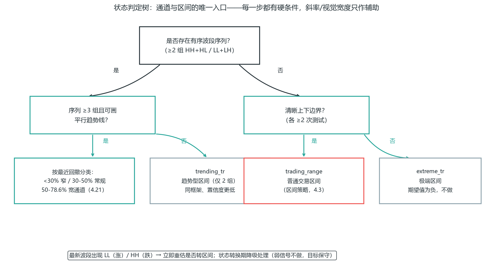

**状态转换规则与重叠区裁决**（市场诊断框架）：转换期（两种状态之间）三条执行规则——① **交易频率减半**；② 转换确认后再调整策略，不要提前猜测方向；③ 信号不明确就维持当前策略直到清晰。**尖峰 vs 微型通道（2-10 根重叠区）**：同时满足尖峰最低标准（2 根+连续趋势棒、重叠 < 30%）→ 优先判定尖峰（一律禁 SCS）；仅紧凑推进但未达标，或尖峰已结束进入极短整理 → 微型通道。禁止同一窗口双标。

**多时间框架（MTF）——一个信号要过三个时间级别**：

1. **HTF（日线）定方向**：只做与日线趋势同向的信号。
2. **MTF（4H/1H）定位置**：找到关键位（HL/HH、支撑阻力、OB/FVG）。
3. **LTF（15m/5m）定执行**：在小级别等信号入场，止损紧凑。

**错误示范**：日线下跌趋势里，1H 出现看涨吞没就做多——这是逆 HTF 方向。HTF 方向不对，LTF 信号作废。**MTF 的本质：大周期定方向，小周期优化入场价**。

**MTF 的具体流程**（写进规则书）：开盘前先在日线定方向（只写"多/空/观望"三个字），然后在 4H/1H 画关键位，最后在 15m/5m 等信号。三层各自独立判断，三层同向才动手。任何一层反向，这一单就不做——不是"信号不好"，是"三层不同向"，就这么简单。

**长程背景 vs 近期结构冲突时，近期为主**（PA_Agent 市场诊断框架场景 5/6）：MTF 讲的是“跨周期同向”，但**同一周期内**长程窗口与近期方向冲突时，裁决规则是：**以近期结构为交易主方向，长程背景写入风险提示**。例：日线背景看跌，但本周期刚走出多头尖峰——**禁止因长程看跌而在近期多头尖峰中做空**（反过来同理）。长程背景的作用是风险警示和位置参考，不是直接否决近期结构——近期结构才是当前价格的推动力。这与上文“HTF 方向不对，LTF 信号作废”不冲突：前者是不同周期之间的方向裁决，后者是同一周期内的时间尺度冲突。

### 4.7 斐波那契回撤

广泛使用的测量工具，与回调入场天然融合。

**画法**：上升趋势里，连接一波行情的起点（近期低点）和终点（近期高点），自动生成回撤位：38.2%、50%、61.8%。

**与系统一融合**：回调的 HL 区，经常恰好落在 50%-61.8% 回撤位。HL 支撑区 + 61.8% 回撤重叠 = 高质量入场区（confluence，多因素汇聚）。重叠因素越多，位置越可靠。

**斐波那契扩展作目标**：127.2%、161.8% 扩展位可作止盈目标。

**诚实评价**：斐波那契背后没有物理定律，它的有效性很大程度来自自我实现——太多人盯着 61.8%，那里就有了反应。把它当"汇聚因素"用，别当独立入场理由。

**confluence（汇聚）的概念是本节真正的收获**：入场位叠的因素越多——结构点 + 斐波那契 + 前高前低 + 整数关口 + OB/FVG——位置越可能引发反应。但注意：汇聚是"加分项"，不是"必要条件"。一个结构清晰的 HL 区，即使没有斐波那契重叠，也完全值得做。别为了凑 confluence 把入场条件堆到几乎不出现。

### 4.8 海龟交易法则：系统化趋势跟踪的鼻祖

海龟实验（Richard Dennis，1983）证明了交易可以完全规则化、可以教会。它的规则至今是趋势跟踪系统的范本。

**核心规则（原版简化）**：

1. **入场**：价格突破 20 日最高价→做多（跌破 20 日最低→做空）。
2. **止损**：2×ATR。
3. **加仓**：每上涨 0.5×ATR 加 1 个单位，最多 4 个单位。
4. **离场**：价格跌破 10 日最低价→平仓。

**仓位管理（海龟最有价值的贡献）**：

```
1 个单位 = 账户 1% 风险 ÷ (2×ATR×每点价值)
```

即仓位大小由波动率（ATR）决定：波动越大，仓位越小。这个思想已融入第 6 章的 ATR 止损。

**金字塔加仓**：只在盈利时加仓，每次加仓有独立止损，整体止损跟随上移。这是"让利润奔跑"的正确打开方式——不是一单扛到底，而是让赢利的仓位变大。

**考核期注意**：金字塔加仓激进，不适合考核期（违背第 7 章"不加仓"军规）。学它的仓位管理和趋势跟踪哲学，别照搬加仓动作。

**海龟的意义**：它证明了"截断亏损、让利润奔跑"可以完全规则化——这是本书所有系统的思想鼻祖。海龟的规则全是客观数字（20 日、2×ATR、0.5×ATR），没有任何主观判断——这是"写死规则"的极致示范，也是它 40 年后仍然被研究的原因。

### 4.9 市场的两种模式：趋势跟踪 vs 均值回归

剥开所有流派，市场其实只在两种模式间交替：趋势和区间。对应的赚钱逻辑也只有两种：

- **趋势跟踪**：假设趋势延续——回调买入、让利润奔跑。系统一就是它。
- **均值回归**：假设价格回归均值——超卖买、超买卖、边界反向。系统二就是它。

第 4.6 的状态机，本质就是在这两种模式间切换：趋势市用趋势跟踪，区间市用均值回归。

**最常见的两种死法，都是模式用错**：

- 区间里用趋势跟踪 → 反复追突破被假突破打脸，来回被绞。
- 趋势里用均值回归 → "跌这么多该反弹了"去接飞刀，被趋势碾过。

**一个有用的辅助过滤器（均线学派的精华）**：用 200 周期均线当多空分界线——价格在 200 均线上方只做多，下方只做空。它不给你入场信号，只帮你过滤方向，减少逆势单。

**均值回归学派（布林带/RSI）和均线学派真正有用的就是上面这两点**——模式匹配和方向过滤。至于具体指标参数，是次要的。别把精力花在调 RSI 是 30 还是 25 上。指标是工具不是圣杯——布林带告诉你"现在偏离均值"（均值回归触发器），200 均线告诉你"大方向"（方向过滤器），仅此而已。

### 4.10 Van Tharp 的系统开发框架：系统要"合身"

第 4.0-4.9 给了你具体的系统，但 Van Tharp 在《通向财务自由之路》里提出了一个更上位的观点：

> 没有"最好"的系统，只有"适合你"的系统。系统开发不是找一个圣杯，而是设计一套和你的心理、目标、生活节奏匹配的规则。

**Van Tharp 的系统开发逻辑**：

1. **先定义你自己**：你能承受多大回撤？你每天能盯盘多久？你要的是稳定小赚还是偶尔大赚？你的心理弱点是什么（第 7 章）？这些决定了什么系统"合身"。
   - 例：你白天上班只能晚上看盘 → 日内系统不适合你，波段系统才合身。
   - 例：你心理上扛不住连续亏损 → 你需要高胜率系统（哪怕盈亏比低），而不是低胜率高盈亏比系统。
2. **再设计期望值**：在"合身"的约束下，设计一个正期望值的系统（第 2-5 章的方法）。
3. **最后配仓位**：用仓位管理（第 6 章）把期望值变成稳定的资金曲线。Van Tharp 强调，仓位是系统的一部分，不是事后补的。

**这个框架的深意**：很多人到处找"最强系统"，但再强的系统，如果你执行不了（因为不合身），对你就是零。

> 一个你能一致执行的 70 分系统，远好于一个你执行不了的 95 分系统。系统的上限，是你执行它的下限。

**实践**：选系统时问自己三个问题——①我的时间精力匹配这个周期吗？②我的心理承受得住这个胜率和回撤吗？③我能一致执行它 100 笔不变形吗？三个都"是"，才是你的系统。系统为你服务，不是你为系统服务。

## 篇二 出场：期望值的另一半（4.11-4.19）

### 4.11 出场：期望值的另一半

进场之后怎么办？入场只决定你上不上车，出场决定你最终赚多少、以及赚到的能不能留住。大多数人花 90% 精力研究入场，10% 都不到研究出场——这是反的。

> 一笔交易的期望值 = 胜率 × 平均盈利 − 败率 × 平均亏损。入场决定胜率的下限，出场决定平均盈利的上限。

同样的入场信号，不同的出场方式，长期期望值能差一倍。

**出场要回答三个问题**：

1. **错了怎么办**——止损（本章六要素和第 6 章已讲，入场时就定死）。
2. **对了怎么办**——止盈目标。
3. **对了之后怎么扩大**——移动止损与分批。

第 1 个在入场前就解决了。本节讲第 2、3 个。

### 4.12 止盈目标怎么定

**三个常用锚点，按优先级**：

1. **结构位**：前高/前低、流动性池（BSL/SSL）。价格倾向于去扫下一个流动性池——这是最自然的目标。
2. **固定 RR**：2R 或 3R。简单粗暴，适合新手，因为它不依赖你对行情的进一步判断。
3. **区间投射**：突破交易用区间高度投射（本章系统三）。

**原则**：目标必须在入场前定好，且 RR ≥ 2。入场后再找目标=让贪婪临时定价。

**结构位 vs 固定 RR 的选择**：结构位目标更“聪明”（它基于市场会去的地方），但需要你会画结构（第 2、5 章）；固定 RR 更机械（永远 2R 走人），胜在不用判断。折中方案：先定结构位目标，如果结构位距离不足 2R，则这笔不做——把“RR≥2”当过滤器，而不是目标本身。

**四类 Measured Move：把“目标”变成公式**（PA_Agent 文件 23）：上文的“区间投射”只是第一类。Brooks 体系把结构目标展开成四类可计算的测量移动（MM）——每种都有自己的公式和概率底色，目标不是感觉出来的，是算出来的：

1. **区间高度翻测（约 60% 到达）**：区间上沿/下沿各被测试至少 2 次后，突破点对侧的目标 ≈ **突破点 ± 区间高度 H**（H = 上沿 − 下沿）。这是系统三（4.4）的量化目标：区间压缩越久、H 越大，翻测目标越值得做。注意 80% 的区间突破尝试失败——只有“尖峰级突破 + 跟随”才追，普通突破默认等测试或失败的失败。
2. **通道宽度翻测**：平行通道突破通道线后，目标 ≈ **突破点 ± 通道宽度 W**（上轨 − 下轨）。上涨通道向下破下轨时参考通道高度向下翻测——但上涨通道在长周期上常是空头旗形，向下 MM 的风险要写进风险清单。
3. **楔形高度翻测**：楔形起点到极点的垂直距离 = 楔形高 H，突破楔形对侧边界后目标 ≈ **突破点 ± H**（反转方向投影）。楔形回撤（10-20 棒）与楔形反转（≥20 棒）的 MM 方向相反——先定架构（第 3.8），再算目标。
4. **尖峰 leg 翻测（70%+）**：尖峰/强趋势腿的起点到终点距离 L，回撤后再延续的目标 ≈ **回撤低点（做多）或反弹高点（做空）+ L**。强趋势 leg 延续到达 MM 或更远的概率约 70%+，是四类里最可靠的一类。但尖峰后约 60% 恢复通道、30% 进区间——尖峰末端禁止追单。TP2 扩展：第一目标取等距 100%，**第二目标可取 138.2%/161.8% 候选**（极速行情策略）；仍以近端结构位为 TP1。

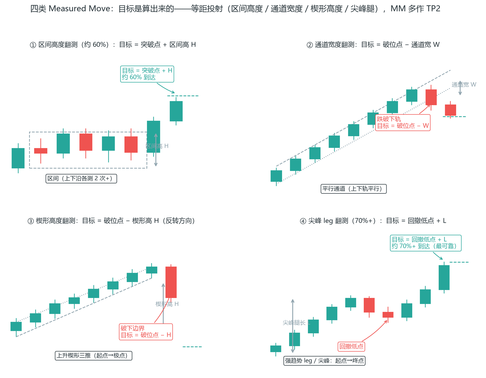

**TP1 / TP2 两级目标：结构优先，R 倍兜底**（PA_Agent 文件 17）：Brooks 的出场不是“一个目标”，而是两级——它同时解决“该在哪止盈”和“这笔值不值得做”：

- **TP1（主目标/保守目标）**：最近且有效的**结构位**，按优先级取：① 反向结构边界（区间近对边、通道近端、前显著 swing 高低点）；② 磁力位（失败信号极点、失败入场价，见下文）；③ 固定 R 倍数（≥1R，仅当上面都没有合理结构位时的兜底）。
- **TP2（延伸目标）**：更远的**结构目标**：① MM 投影（四类公式之一）；② 反向结构边界远端（区间/通道对边、MM 后的下一层 swing）；③ EMA20/整数关口只作次级参考，不能单独当 TP2。

**两级目标的四条纪律**：

1. **定价顺序写死**：先定 entry → TP1（结构）→ TP2（更远结构）→ 结构止损。目标与止损都在入场前定死，入场后不再改。
2. **几何硬规则**：做多 stop < entry < TP1 < TP2；做空 TP2 < TP1 < entry < stop。顺序错乱说明哪个价位定错了。
3. **RR 只用 TP1 算**：盈亏比 = (TP1 − entry) ÷ (entry − stop) ≥ 1.0。RR > 1.5 时保持 TP 不变、向外扩止损；RR < 1.0 时收紧止损或调整入场，**禁止向外扩止损凑数**，仍不达标就放弃这笔。
4. **TP2 不参与盈亏比**——它是“锦上添花”，不是交易成立的依据。把 TP2 当依据算 RR，会让你接受本来不该做的交易（这是出场最常犯的错）。

按市场状态调两级距离：区间/趋势震荡期 TP1 取近（边界、结构位）、TP2 取区间翻测或 MM；通道/尖峰顺势 TP1 取近端结构位、TP2 用 MM 投影。

**磁力位：失败信号留下的磁场**（PA_Agent 文件 22）：为什么价格总爱回到某个价位？因为那里留下了“未完成的交易”——止损单、失败者的入场单、被套者的割肉单。

- **磁力位清单**：失败多头信号棒的高点、失败空头信号棒的低点、失败交易的入场价、入场棒高低点、保护性止损集中区、突破点与突破缺口边缘。**趋势中失败的逆势信号极点，常直接成为顺势目标**（可作 TP1）；多次失败信号会形成后续区间边界。
- **被套交易者（Trapped Traders）**：突破方向上的交易者被迫止损离场，会加速价格反向或测试磁力位——判断方向前先问“哪一方被套”。
- **跳数陷阱（17t/41t/5t/9t）**：Brooks 观察到止损单入场者常在目标前数个跳动被扫损，形成反转：

| 缩写 | 含义 |
| --- | --- |
| 5t | 距 1 点目标差 1 跳被套 |
| 9t | 距 2 点目标差 1 跳 |
| 17t | 距 4 点目标差 1 跳 |
| 41t | 距 10 点目标差 1 跳 |

入场/止损不要紧贴"整数目标前一跳"的磁力区；**接近磁力位时胜率下降、方向概率趋近 50-50**——磁力位附近不做追单，等测试结果。
- **平台磁吸（Ledge，Ali 闪卡）**：价格在短期内对某一水平测试 **4 次或更多次**却未能突破，该水平即成为平台磁吸位——**顶部数量越多，磁吸效应越强**；3 次测试只能算双顶/双底（DT），不能算有效平台，可靠性更低。平台磁吸的操作含义：① 从平台边缘发起的突破（BO）通常受限、很快回弹至平台（平台假突破 FBO 常见）——平台突破后预期回测平台区域，反向突破先于平台突破发生时其失败概率更高；② 平台突破后的回撤若不跌破突破点，是顺势入场机会；③ 小型平台通常当天突破高点并跌破低点，而若突破发生较晚（如昨日形成的平台），次日极有可能向上测试突破位直至超过其高点；④ 结构定义：至少连续三根 K 线价格相同（位于最高点或最低点），平台后接更低高点即构成三角形形态。**价格大概率会在数小时或数天内回落支撑位**——把平台当"一定会被再测试"的磁体来管理目标与回补。
- **失效条件**：入场后跌破多头入场棒低点（或升破空头入场棒高点）= 信号失败；价格快速回到失败信号另一侧 = 重新评估市场状态。失效判断必须引用具体 K 线，不是笼统的"跌破支撑"。

**统一止损设置：结构失效位，不是固定跳数**（PA_Agent 二元决策）：目标定了，止损必须配套。Brooks 体系的止损只有一条标准——**结构失效位**：

- **统一原则**：止损永远基于结构失效位，不基于固定跳数。固定跳数（如“边界外 1-3 跳”）只用作风险过滤器——判断“止损是否过大而应放弃”，不是止损本身的设置依据。
- **通用规则**：止损 = 信号棒极点外 1 跳（做多：信号棒低点下方 1 跳；做空：信号棒高点上方 1 跳）。资金管理阈值（8 跳动/信号棒 60% 高度）只辅助判断“过大”，不得替代结构止损。

**各市场状态的止损位置与过滤器**：

| 状态 | 止损设置位置 | 过滤器（超过则考虑放弃） |
| --- | --- | --- |
| 尖峰回撤（SPS 入场） | 回撤极点外 1 跳 | 止损 > 尖峰高度 50% |
| 普通趋势/通道顺势 | 信号棒极点外 1 跳 | 止损 > 通道宽度 40% 或 > 2 倍 ATR |
| 普通区间边界 | 信号棒极点外 1 跳，边界作结构参考 | 止损 > 区间宽度 10% |
| 宽通道（边界噪声大） | 信号棒极点外 1 跳；边界刺穿频繁时扩至波段极点外 1 跳 | 止损 > 通道宽度 50% |
| 铁丝网/Barbwire | 不做，或等突破后以突破棒极点外 1 跳止损 | 边界外 1-2 跳无效，最少 3-5 跳缓冲才考虑 |

**小型信号 K 线的止损距离（Ali 闪卡）**：信号棒越小，止损必须越远——市场经常测试小型卖出信号 K 线的高点以上（或小型买入信号 K 线的低点以下）再走方向：**止损必须至少距离信号 K 线极点 3 个跳动点**；信号棒是内包线时，止损放在**外包线（母线）极点上方 2 个跳动点**（呼应 3.4 内包线止损）。别因为信号小就把止损放得更近——小信号恰恰需要给它呼吸空间。

**止损过大五条件**（任一成立即放弃或等更小信号）：① 止损 > 止盈目标距离（盈亏比 < 1:1）；② 止损 > 通道宽度 40%（通道态）；③ 止损 > 区间宽度 10%（区间态）；④ 止损 > 2 倍 ATR；⑤ 信号棒过长导致结构止损过大——等更小信号，**不为了进场而扩大止损**。

**交易者方程（Traders' Equation，QuantSystems 权威公式）**：止损、目标之外，决策的第三个变量是概率。公式只有一条——**收益 × 盈利概率 > 风险 × 亏损概率**（Reward × Prob(Profit) > Risk × Prob(Loss)），三个推论直接可执行：

1. **概率的范围**：大多数时间单笔概率在 40-60% 之间，强突破时可达 70%+——概率不追求 90%，60% 已经是好交易。
2. **高概率与低风险不可兼得**：高概率交易（≥ 60%）不可能同时是低风险（即亏损 < 盈利）；低风险交易（≤ 40%）不可能同时是高概率——想要正方程，低概率交易必须靠高回报（2:1 以上）来补偿。
3. **方程不过关就放弃**：算出三价后代入方程，不成立直接放弃这笔（4.24 口诀 9 的执行细则）——方程是“这笔值不值得做”的最后一道闸门。

**RR 适配三规则**（4.12 两级目标纪律 3 的完整版）：

1. **RR > 1.5**：保持 TP1/TP2 不变，向外扩止损（至结构允许的最宽失效位），直到 RR ≤ 1.5。
2. **RR < 1.0**：收紧止损至更近的结构失效位，或调整入场价；**禁止向外扩止损**（只会进一步压低 RR）；仍无法 ≥ 1.0 就放弃这笔。
3. **禁止缩小 TP1 凑 RR**：TP1 是结构目标、有磁力效应，不是调节变量。尖峰场景附加：扩止损上限 = 尖峰高度 50%，超过则放弃。

**突破单挂位规则**（二元决策 §11.4）：做多突破单挂在信号棒或有效突破依据 K 线高点上方 1 跳，做空挂在低点下方 1 跳；**禁止挂在 K 线实体中部、影线中部、EMA 附近、当前价附近或任意折中位置**。无法明确依据 K 线时，评估是否改挂结构支撑/阻力/通道边界/EMA 处的限价单。

### 4.13 分批止盈：兼顾落袋与奔跑

全仓持有到目标，中途回撤会很难受；全仓在 1R 就跑，又吃不到趋势。分批是折中：

**标准方案**：

1. **到 1R**：平掉 50% 仓位，同时把剩余仓位的止损移到入场价（保本）。
2. **剩余 50%**：让利润跑向最终目标（结构位/流动性池）。

这笔交易的结果从此只有三种：小赚（保本出场）、中赚（1R 部分）、大赚（剩余部分到目标）。不再有"赚了又还回去"的亏损——**这是分批最大的心理价值**。

**代价**：如果行情直接冲到底，你少赚了一半。接受这个代价——你要的是稳定的期望值曲线，不是单笔最大化。

### 4.14 移动止损：让利润奔跑的机制

剩余仓位怎么跟？两种主流方式：

**结构移动法（推荐）**：上升趋势里，每出现一个新的 HL（更高的低点），就把止损移到该 HL 下方。价格不跌破结构，你就一直拿着；跌破结构，说明趋势可能结束，止损离场。

**ATR 移动法**：止损保持在价格后方 k×ATR（k 取 1.5-2），随价格推进。适合不想盯结构的人，但容易被正常回调扫掉。

**通道宽度节奏法**（Brooks 通道策略）：通道趋势中，止损移动有量化节奏——初始止损按信号棒法设置；**价格向有利方向移动超过 1 倍通道宽度后，止损移至盈亏平衡点**；此后**每推进 0.5 倍通道宽度，止损移动一次**。窄通道中跟踪更积极（每次移动幅度小、跟得紧），宽通道中给更多空间。通道越接近尾声，越不要放松跟踪——真空效应（4.21）常让末期行情走完最后一段加速。

**关键纪律**：移动止损只能朝有利方向移，永不后退。后退=给亏损重新开门。

**移动止损的执行细节**：止损移动的时机是"新结构确认"（新 HL 收盘确认后），不是"价格刚创新高"（那还不一定是 HL）。过早移动会被回踩扫掉，过晚移动会回吐利润——确认新 HL 的标准和第 2.3 判断结构的标准一致：收盘高于前低。

**入场价被测试两次则退出（Ali 闪卡）**：市场在触发新信号后，通常先运行到盈亏平衡点止损、然后恢复趋势——所以**允许盈亏平衡点价格被测试一次，但不能两次**：第二次测试入场价时退出（2PB 开始），因为二次入场信号转变为相反趋势的概率更高。例：做多后价格回踩你的入场价一次 → 继续持有；第二次再踩到入场价 → 平仓或反手。执行上：若市场在你退出后恢复，可重新入场（新信号，不是旧仓位）。

**第二入场点（2E）与第二腿（2LT）（Ali 闪卡第 2 部分）**：

**二次入场点 2E（Second Entry）**：2E 比首次入场（1E）胜率更高、持仓更久：首次入场通常是短线交易，二次入场是波段交易（或更大的短线）；2E 可能比 1E 形成于同一价位（双顶/双底），也可能更高或更低——由于是二次失败突破，其反转概率更高。执行细则：① **1 号入场必须触发后失效**，2 号入场点必须设置在比 1 号更有利的价格；② 入场前至少 3-4 根连续 K 线趋势（2 根可接受）；③ 选择 2 号入场点，有超过 60% 概率至少触及 1 号入场点；④ 重要磁体处的信号更可靠；⑤ 1 号入场信号 K 线必须强劲。原则：**逆势动量强劲时不要入场，确定好二次加仓位置，等形态确立后把它当作首次入场**；市场动量越弱越可采用首次入场（反转所需动能小）。

**第二腿 2LT（Second Leg Trap）**：TRD/TTRD 中的第二腿往往比第一腿更强——但注意：**2LT 看起来是新的，实际上是两段式陷阱**，通常小幅突破后反转形成失败突破。识别条件：① 交易区间内的 2LT 需要一根强劲的信号 K 线；② 至少需要一个小波段；③ 卖出信号 K 线后的跟进很重要（连续看跌 K 线 = 2LT，K 线反转 = 旗形）。**2LT 向磁吸位的波动必须迅速、高潮迭起且情绪化，否则很可能只是突破**——缺乏这种动能的 2LT 不可靠；当市场维持在某支撑/阻力下方时，2LT 反转概率更高。区间内双腿形态有 80% 概率演变成失败突破并快速反转——若微通道本身是区间内的双腿形态，沿微通道方向的首次回踩失败率极高。

**交易情境决定订单类型**：顺势方向交易优先用限价单而非止损单；预期突破行情时**不要逆势挂限价单**——应等突破失败信号出现后，用止损单或市价入场；若使用限价单，应等亏损方放弃离场时用盈亏平衡点退出；仅在支撑位下方逆势操作、且前期存在多头力量迹象时才逆势（反之亦然）；仅当市场特征转变且有明确证据支持时才进行逆势操作。

### 4.15 保本时机：别移太早

把止损移到入场价（保本）是好事，但移太早是常见错误：价格刚到 1R 就保本，一个正常回调就把你扫出去，然后行情奔目标而去。

**经验法则**：

- 至少到 1R 再保本（配合分批）。
- 如果波动大（ATR 高），等到 1.5R。
- 保本后接受"被扫个保本"——这不亏钱，只是少赚，比"赚了还回去"好得多。

**为什么保本"被扫"不是坏事**：保本单被扫 = 你这笔 0 成本离场 + 你的资金被释放可以再战。它证明了"保本"机制在工作——你消灭了亏损的可能。情绪上，被扫保本比止损离场舒服得多，这正是保本的心理学价值。

### 4.16 时间止损：不动也是风险

入场后，如果价格长时间不动（既不触发止损也不向目标走），说明你的入场逻辑可能没兑现。

**规则示例**：入场后 5-8 根 K 线（按你的交易周期）仍在入场价附近徘徊 → 主动离场或减半仓。

**理由**：持仓占用保证金、承受隔夜利息和突发风险，却没有换来预期的移动。**时间也是成本**。这条对考核期尤其重要——资金效率低会拖长达标时间（第 9 章达标数学）。

**时间止损的另一种形式——信号失效**：入场逻辑成立的前提（如"回调到 HL"）已经变化（价格又走出了新结构），即使价格没到止损，这笔的"为什么"已经不存在了——主动离场。别等价格来打你的止损，等逻辑失效就该走。

### 4.17 一笔交易的完整生命周期

把入场到出场串起来（以做多趋势回调为例）：

- **入场前**：背景✓ 位置✓ 信号✓ → 算好止损/目标/仓位（本章六要素+第 6 章）
- **入场**：信号确认，挂单成交，止损单同时挂好
- **到 1R**：平 50%，剩余止损移到入场价（保本）
- **推进中**：每出新 HL，止损上移（结构移动法）
- **结局 A**：跌破结构 → 剩余仓位止损离场（锁定部分利润）
- **结局 B**：到达流动性池/目标 → 全部止盈
- **例外**：8 根 K 线不动 → 时间止损，主动离场

**注意整个生命周期里"决策"只发生两次**：入场前（计划）和到 1R 时（分批）。其余全是机械执行——这就是"思考留给冷静时刻，执行交给机械盘中"的完整示范。

### 4.18 完整案例：一笔交易从入场到出场

用一个带数字的全流程，串起所有出场规则（做多，趋势回调）：

1. **入场**：4H 上升趋势，1H 回调到 HL 区+锤子。入场 1.1090，止损 1.1065（25 pips=1R），目标 1.1150（60 pips≈2.4R），下 2 手。
2. **到 1R（1.1115）**：平掉 1 手（分批止盈），剩余 1 手止损移到入场价 1.1090（保本）。
3. **价格新高、出现新 HL（1.1120）**：止损上移到 1.1120 下方（结构移动）。
4. **继续到 1.1145、新 HL（1.1135）**：止损上移到 1.1135 下方。
5. **结局 A**：价格到目标 1.1150 → 平剩余仓位。总盈利 ≈ 前半仓 60 pips + 后半仓 60 pips。
6. **结局 B**：价格未到目标，回调跌破 1.1135 → 剩余仓位止损离场（锁定 45 pips）。总盈利 ≈ 前半仓 60 pips + 后半仓 45 pips。

**关键**：从第 2 步起，这笔交易已经不可能亏——最差结果是保本或小赚。这就是分批+保本的价值：**把"赚了又还回去"从可能里删掉**。

### 4.19 不同市场状态下的出场调整

出场策略不是一刀切，按市场状态调：

- **趋势明确**：让利润奔跑，用结构移动止损，不轻易止盈（系统一思维）。
- **区间震荡**：边界止盈，不贪——区间目标有限，到中线/边界就落袋（系统二思维）。
- **高波动（ATR 大）**：放宽止损、减小仓位，目标可放大。
- **低波动（ATR 小）**：收紧目标，注意时间止损（不动就走）。
- **数据公布前**：收紧止损或减仓，防黑天鹅打掉利润（呼应第 1 章）。

**核心**：入场决定胜率下限，出场按市场状态调整，才能把盈利上限最大化。

## 篇三 高级入场结构（4.20-4.24）

### 4.20 突破单三模型（实战课）

前面系统三讲了突破交易的通用规则。这里把"突破单"拆成三种具体模型，每种都有明确的触发条件和过滤条件——实战课把它浓缩为三句话：**顺大逆小、二次确认、结构反转**。

**模型一：趋势回调突破单（H2/L2，顺大逆小）**

适用：强趋势 + 窄通道或强突破后的首次回调。

- 大方向明确（HTF 趋势向上/向下），回调属于逆势段。
- 只在两种情况下做：突破很强（大实体+放量）或通道很窄（微通道，见 4.5）。
- **逆市回调必须"两段式"**（A-B-C 回调）：一段就结束的回调是 V 反而不是回调，突破延续的概率低。
- **信号 K 必须与建仓方向一致**：做多用阳线确认（H2 用阳线低点入场），做空用阴线确认（L2 用阴线高点入场）。
- 入场：信号 K 极值外侧 1 tick；止损：信号 K 极值外侧 1 tick（紧凑止损）。

**模型二：二次突破确认单（失败的失败）**

适用：第一次突破失败（假突破，见 3.1）后，市场第二次尝试突破。

- 突破 K 必须**实体突破**（收盘超越关键位），影线插破不算。
- 确认窗口：**3 根 K 线内必须完成二次突破**，否则结构退化、放弃这笔。
- 入场：第二次突破 K 的极值外 1 tick。
- 逻辑：第一次失败已经洗掉弱手，第二次突破时对手盘更少、成功率更高。这是第 3.1"假突破"的顺势版本——假突破后别反向，先看第二次尝试。

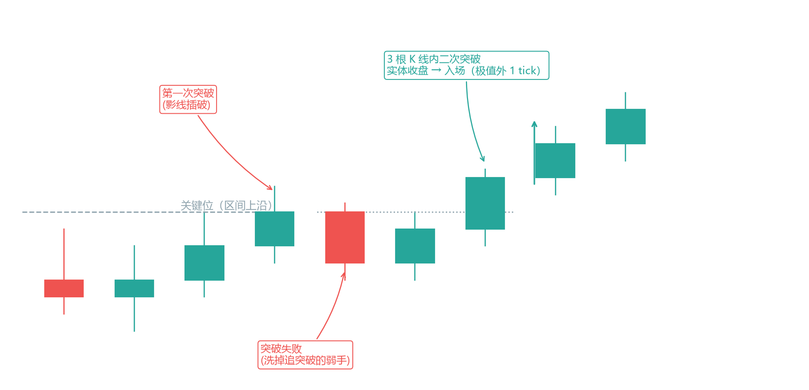

**模型三：关键位结构反转突破单**

适用：关键位（双顶双底、高2低2、楔形、头肩顶底、OB/IB，见 3.8）处的结构反转。

- 先有结构反转（CHoCH，见 5.4），再有突破确认。
- 入场：突破关键位的极值外 1 tick。
- 这是"反转 + 突破"的组合单：结构反转只给方向，突破确认给入场。

**三个模型的共同纪律**：只做与 HTF 方向一致的突破；突破 K 必须有实体位移（收盘远离关键位）；不做“插破即追”。

**关键位形态深化：三角形四类与双顶底（PA_Agent 文件 27/28）**：模型三说“双顶双底、楔形、头肩”是反转关键位，Brooks 体系把它们再拆细一层：

**三角形的本质是交易区间中的特殊收敛**，四类：

| 类型 | 结构 | 偏向 | 规则 |
| --- | --- | --- | --- |
| 上升三角形 | 上边界水平（阻力）+ 下边界抬高（HL） | 向上突破略高 | 须跟随确认；1-2 次触顶/下轨不清晰则无效 |
| 下降三角形 | 下边界水平（支撑）+ 上边界降低（LH） | 向下突破略高 | 下轨多次刺穿未收稳则无效 |
| 对称三角形 | 上边界下降 + 下边界上升，双向收敛 | 不确定 | **禁止提前赌方向**；等收盘突破 + 跟随；目标 = 三角形最大宽度 MM |
| 扩张三角形 | 边界向外扩散，波动加大 | — | **不交易**，仅观察（波动扩张=方向不明） |

三角形的交易规则与区间一致：**80% 的突破尝试失败，普通突破不追**；边界入场优先第二次触边 + 反转信号棒（且与 direction 一致）；突破须尖峰级或强趋势棒 + 跟随、或“失败的失败”后二次入场——禁止追第一根突破棒；目标 = 三角形高度 MM（第 4.12 的 MM 公式一：区间高度翻测）。三角形与楔形的区别：三角形的边常水平或单向下倾、三推非必须；楔形两边同向倾斜、必须三推。

**双顶/双底（DT/DB）**：价格两次测试相近高点/低点，第二次未能创新高/新低后反转。三个有效条件：① 两次极点价位接近（允许小幅刺破，收盘不确认新高/新低）；② 第二次测试后出现反向趋势棒或明确信号棒；③ 中间有清晰回撤（颈线区域可识别）。**三种无效情形**：第二次大幅创新高/新低（只是趋势延续）、铁丝网/区间中部小波动的“假双顶”、仅单根长上影无第二次结构化测试。

**二次测试优先（双顶底的灵魂）**：第一次触顶/底可能是正常回撤——**不追、不下单**；第二次触顶/底失败才确认极点（反转*可能*发生）；突破颈线后的回撤是 Brooks 的二次入场背景（呼应 3.11 模式四 H2/L2）。失效条件：第二次极点被收盘突破。双顶底常是 MTR 的“前极点测试失败”环节（第 3.8 四组件之四）——仅有双顶形态而无趋势线突破，只是反转尝试，不是 MTR。

### 4.21 限价单四模型：把入场价定在"等你的地方"

突破单是追市场，限价单是等市场。限价单的优势是入场价精确、永不滑点（第 1.3），代价是可能不成交（错过不亏钱，第 7 章军规第 8 条）。四种模型：

**模型一：区间前高前低限价反转（固定 1:1）**

- 窄区间：前高挂限价做空 / 前低挂限价做多，固定 1:1 盈亏比，止损在边界外。
- 宽区间：止损必须宽，所以**必须配强制退出**（时间止损或到 1R 强制平仓）——否则宽止损 × 1:1 目标，盈亏比失衡。

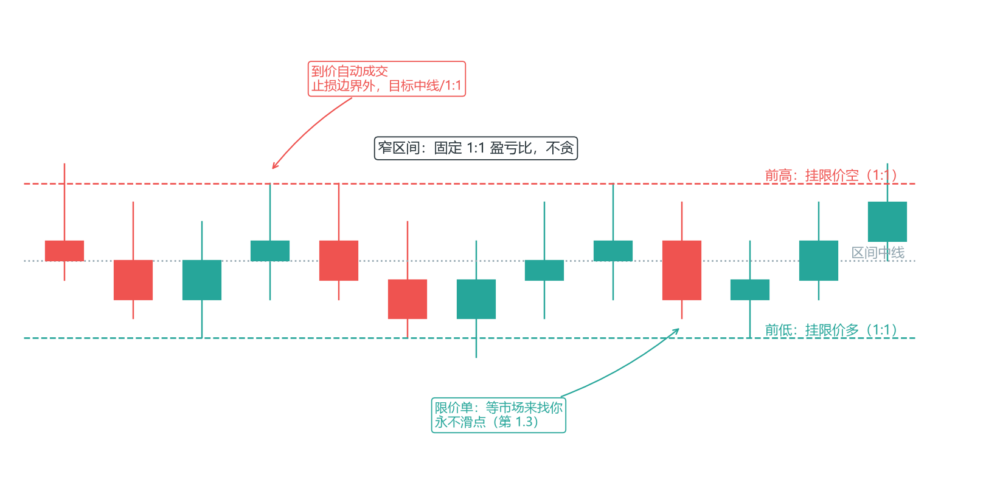

**模型二：宽通道 point 3 限价反转**

- 通道内价格走出 P1→P2→P3 三段推演（三推结构，见 3.8 楔形）。
- 在 P3 位置提前挂限价单做反转。
- 这是把"楔形三推"做成挂单：P1/P2 确认后，P3 的位置可以提前算出，价格到 P3 自动成交。

**模型三：趋势 50% 回调限价顺势**

- 强趋势中的回调，回落到趋势段的 50%（第 4.7 斐波那契）。
- 回调必须两段式，或**连续 3 根逆势 K 线内结束**（超过 3 根说明回调在扩展，不是上车点）。
- 在 50% 位挂限价顺势单，止损在回调低点外。

**模型四：真突破后回踩限价顺势（trapped 对手盘）**

- 前提：突破 K 必须强势实体（收盘 ≥ 实体 50% 处），且跟随 K 延续（第 3.10 突破概率）。
- 真突破后，追突破被套的人（trapped 多头/空头）会在回踩时割肉离场——回踩入场就是接他们的对手盘，方向与他们相反。
- 回踩到突破位附近挂限价顺势单。
- 注意：突破后直接延续不回踩 = 错过，接受它——回踩单是"可遇不可求"，不是"必做"。

**限价单通用纪律**：挂单价 = 信号位极值或结构位；挂单必须设时效（第 1.3）；到价没成交不追（追 = 又变回突破单）。

**通道量化分类：先测回撤，再定打法**（PA_Agent 文件 13）：4.21 模型二提到“宽通道”，Brooks 体系的通道不是凭感觉分的——**主分类键是“最近一波回撤占前一波推进的百分比”**，斜率和视觉宽度只作辅助描述：

| 特征 | 窄/紧凑通道 | 常规通道 | 宽通道/台阶 |
| --- | --- | --- | --- |
| 主判定：最近回撤 | < 30% | 30%-50% | 50%-78.6% |
| 斜率（辅助） | 大，常 > 45° | 适中 | 小，常 < 30° |
| K 线重叠 | 几乎无 | 中等 | 较多（锯齿形） |
| 趋势棒比例 | > 65% | 约 50% | 30-50% |
| 交易方向 | 只做顺势 | 只做顺势 | 仅顺主方向；**禁止通道对侧逆势刮头皮** |
| 突破特征 | 第一个逆势突破通常失败 | 等回撤/测试 | 几乎每次突破后都有测试 |
| 长程结构对应 | 尖峰（Spike） | 通道期 | 倾斜交易区间 |

**三类通道的对应打法**：

- **窄通道**：连续趋势棒、几乎无回撤，持续 5-20 根，本质是尖峰阶段。回撤极少可能等不到——最佳入场是**突破趋势线后迅速回到通道内**（突破失败入场）；**第一个逆势突破通常失败**，不要在第一次突破时逆势。
- **常规通道**：波段清晰、顺势仍占优。只做顺势，禁止通道边界逆势刮头皮。
- **宽通道（台阶）**：多空都有力量但一方略占优，可持续数十到上百根。打法 = 顺势优先 + 突破测试：**几乎每次突破后都会回来测试突破点**——测试成功（回测突破点后继续原方向）= 顺势入场机会；测试失败（回测后反向突破）= 反转背景。上升台阶中每个回撤都是买入机会、下降台阶每个反弹都是卖出机会；**台阶幅度相等时趋势最健康**。

**微型通道（2-10 棒）**：窄通道的极端形式，几乎无回撤，多数 K 线高低点沿同方向推进。它最重要的交易特征：**突破通常失败**——突破失败后价格回到通道内沿原方向继续，所以“等微型通道突破失败再顺势入场”是高概率交易。但注意：微型通道出现在趋势末端时可能是高潮（突破后趋势反转），出现在趋势中段才可顺势。

**台阶的两种变形 = 动能仪表盘**：

- **收缩台阶**（每个后续突破幅度 < 前一个）：动能衰退的信号，最后一个台阶可能是陷阱——看似趋势延续但动能不足。**不追最后一推**，顺势方案降级。
- **加速台阶**（后续突破幅度 > 前一个）：可能突然加速突破趋势通道，形成买入/卖出高潮——警惕“最后的加速”。

**通道转换信号**：窄→宽（出现大反向 K、回撤触及趋势线、重叠增多）= 趋势减速；宽→窄（回撤变小、K 线实体变大、连续趋势棒）= 趋势加速；宽→区间（价格在通道线间来回震荡）= 趋势结束，切换区间策略。通道线是主观的——不同画法可能得出不同结论，回撤百分比才是客观判据。

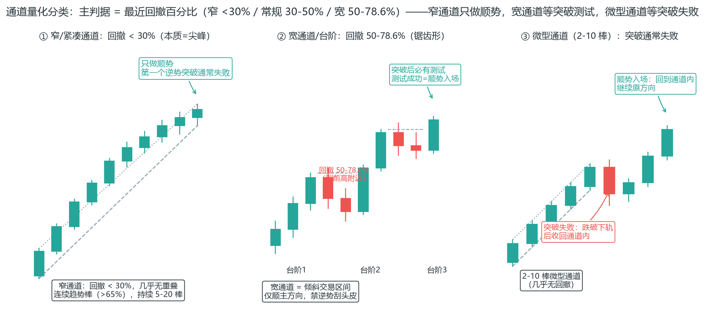

**通道的深层身份：上涨通道 = 空头旗形**（PA_Agent 上涨通道分析识别）——这是 Brooks 体系最重要的通道认知之一：

- 通道的本质是**倾斜的交易区间**（Inclining Trading Range）：通道不是纯粹的强势趋势，而是多空双方在倾斜边界内反复博弈的结果。
- 为什么是空头旗形：通道的上行斜率消耗多头动能；每次新高后的回撤表明空头在逐步积累；上边界的多次触及给空头提供了明确的止损参考。
- 实际含义：**大多数向上突破通道线的尝试会失败；最终向下突破趋势线的概率更高；通道持续时间越长，向下突破概率越大**。
- 交易含义：不在通道上边界追多；顺势做多只在回撤到趋势线/EMA20 附近（H1/H2）；时刻警惕通道突然向下突破——**仅作反转诊断，逆势不下单**（呼应 4.22 逆 Always In）。
- 镜像：下跌通道 = 多头旗形——同样的逻辑，方向相反。

**通道线四种画法：画法随通道阶段演进**（避免主观性）：

1. **平行线法**（首选，通道候选期）：趋势线平移过最近的波段高点，简单直观。3 个以上高点偏离平行线超过 10% → 切换方法二。
2. **波段点法**（中期/扩张时）：独立连接相邻两个波段高点，不要求与趋势线严格平行。波段高点 ≥5 个时 → 切换方法三。
3. **最佳拟合线法**（成熟期）：使线两侧的高点数量与偏离程度均衡，消除单点偏差，通道边界最稳健。
4. **趋势线平行投影法**（异常刺穿时）：以距趋势线最远的波段高点为基准做平行线，避免单根超大棒把通道线拉偏。

原则：不要为了让通道“看起来更好”而调整趋势线；用多种画法交叉验证，选择最能解释历史价格的那条。

**趋势线重画规则**：价格刺穿（Poke）趋势线后迅速收回 → 重画（经过新低点）；重画后的线通常更水平 = 动能衰减；**连续两次重画 = 高概率即将突破**。注意：刺穿 ≠ 突破——短暂跌破后迅速收回只是刺穿，收盘价突破且后续 K 线确认才是有效突破；窄通道中第一个突破几乎总是失败。

**通道演变五阶段**（通道的生命周期路径，图 4-10）：

1. **窄通道/尖峰**：连续大阳线几乎不回调，趋势最强——只顺势买进，第一个逆势突破几乎必定失败。
2. **通道扩展**：回撤幅度增大、通道变宽——仍只做顺势；上边界逆势仅作诊断。
3. **宽通道/台阶**：斜率进一步减小、波段回撤明显、多空更均衡——突破测试后顺势入场。
4. **收缩台阶**：波段幅度逐级缩小、上推力减弱——**收缩台阶 = 动能衰退，通道即将结束的警告**；不追最后一推。
5. **交易区间**：趋势线被突破，进入横盘区间——按区间方法操作，市场常回调至通道起点附近（缺口测试）。

**趋势的结束方式**：“大部分趋势以趋势轨道线突破而结束”（Al Brooks）——趋势末期警惕轨道线穿越（价格超越通道边界）+ 高潮走势；**高潮后的第一次回撤可能是趋势恢复，也可能是反转的开始**——不预判，等趋势线突破 + 前极点测试失败的双重确认（呼应 3.8 MTR 四组件）。

**通道持续时间陷阱**：通道通常比预期的长——“通道太长了该破了”是最危险的主观判断；通道越长只说明向下突破概率越高，**时间上无法预判**。

**通道突破后的规则（无论方向）**：

- **第一个突破尝试通常失败**：顺势突破不追，等回撤至突破点附近再评估（突破测试，呼应 4.20 模型）；回撤极小且迅速恢复 = 有效突破。
- **突破失败（假突破）= 通道延续信号而非通道结束**：价格回到通道内后，评估顺主趋势的二次入场——例：向下假突破通道下沿失败后，顺势做多（Low 2 背景）。
- **假通道陷阱**：2 组 HH+HL 可能只是大区间内的反弹——先查长程窗口（呼应 4.6 状态判定树：≥3 组且可画稳定线才确认通道）。

**真空效应（Vacuum Effect）：通道边界突破为何比预期更猛烈**（PA_Agent 通道交易策略）：价格接近通道边界时，边界两侧的持仓者开始“抢先平仓”——接近上边界时，空头担心突破止损，平仓 = 买入，反而加速价格冲向趋势线；接近下边界时，多头平仓 = 卖出，加速价格冲向通道线。**边界的突破往往比预期更猛烈，这正是“真空”的含义**——突破前最后一段加速不是新趋势力量，而是对手方平仓的推力。两条推论：

- **通道线附近的加速运动不要追**：在通道线附近看到加速下跌（或加速上涨），可能是陷阱——先问“这是新趋势的推进，还是真空效应把价格吸到了边界？”等测试结果再动手。
- **通道后期追顺势要降级**：通道持续越久，追单者越接近“趋势明明要结束了还在做空/做多”——最大亏损往往发生在通道末期追顺势（配合 4.24 禁止清单）。

**通道内的执行细则**（PA_Agent 通道交易策略）：

- **窄通道**：优先限价单（前一棒低点附近），假突破多时不追止损单；结构止损 = 最近波段低点或信号棒极点外 1 跳动；TP1 = 通道线附近，TP2 = 通道高度 MM。
- **宽通道**：H1/H2 均线回撤买进（H2 在宽通道中比 H1 更常见）；突破后等回撤确认再入场；通道顶双顶/MTR 仅诊断。
- **微型通道**：第一个回撤（第 3-5 棒）是顺势买点；向下假突破失败后顺势买进；连续 3 棒以上无回撤 ≈ 尖峰——尖峰后常有两段回撤（第一段至中点、第二段至起点），等第二段回撤胜率更高。
- **止损检查**：止损距离超过通道宽度的 1.5 倍 → 放弃这笔交易。
- **均线纪律**：EMA20 是通道内的动态支撑——回撤至均线且出现合格信号棒才评估入场，不因“每根低点都像机会”而过度交易。

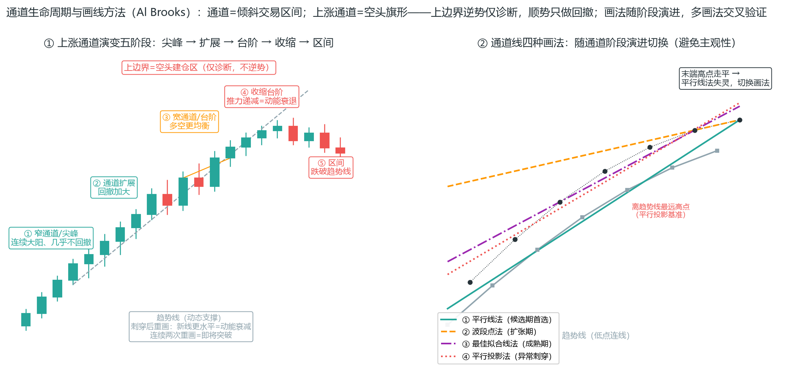

### 4.22 always-in 强突破行情：四招短线打法

always in（始终在场）是 Brooks 判断“当前走势方向”的方法——强突破行情里，每根 K 线收盘后都要问：现在还是不是多头/空头主导？四招打法：

**Always In 的判定清单（AIL/AIS，PA_Agent 文件 20）**——先确认方向，再谈打法：

- **AIL（Always In Long）倾向**：近端多数 K 线收在 EMA20 上方；回撤浅；空头反转信号连续失败；多头趋势棒有跟随、更高低点；下跌尝试被快速买回。
- **AIS（Always In Short）倾向**：近端多数收在 EMA 下方；反弹浅；多头反转连续失败；空头趋势棒有跟随、更低高点。
- **交易含义**：AIL 中的首个做空反转、AIS 中的首个做多反转——**逆势反转仅作诊断，不下单**；顺 Always In 方向，信号不完美也可评估回撤入场（H1/H2）；宽通道中禁止逆势，仅顺 Always In 一侧。

四招打法：

1. **逆 1 失败**：强突破后第一次逆势尝试（逆 1）失败 → 在跟随 K 的低点挂多单（等低 1 的确认），做多回调延续。
2. **第三根未遂**：第二根逆势 K 线收盘时反手建仓；第三根仍未遂（没有反转）→ 反转 80% 失败，**只用前两次机会**，第三次别追（三推失败后延续概率大增，见 3.8 楔形）。

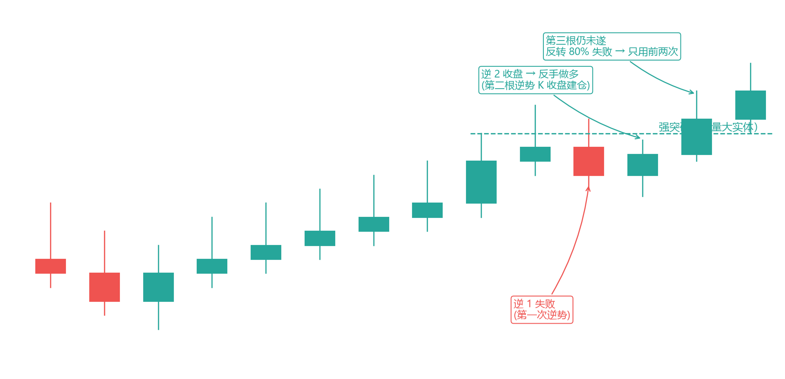
3. **均线回补 EMA20**：强趋势中第一次回补到 EMA20 → 挂限价顺势单。只做第一次回补——第二次回补说明趋势动能衰减。

**20GB（二十根均线缺口棒，文件 20）**：连续约 20 根 K 线**未触及** EMA20 = 趋势极强，但均值回归风险上升。三条纪律：

- **无明确反转前不逆势交易 20GB 趋势**——但 20GB 本身不代表趋势结束，别提前判死。
- **第一次触 EMA = 高胜率顺势刮头皮**：预期至少测试原趋势极点，须信号棒 + 小止损 + 盈亏比校验。
- **两次失败规则**：第一次 20GB 结构失败可等第二次；**两次都失败不再第三次强行尝试**，重新判定市场状态（通道/区间/反转）。

**2HM 形态（2 小时以上远离 EMA）**（市场诊断框架）：20GB 的兄弟形态——价格持续 2 小时以上远离 EMA20 = 超强趋势；**2HM 后第一次触碰 EMA 几乎永远会产生趋势中结构并导致新极值**（顺势刮头皮的高价值位，呼应 20GB 第一次回触）。**强度自检两规则**：① 最长的趋势 K 线如果是逆趋势的，反而说明趋势很强——逆势结构看起来总是比顺势更好，专引诱你反手；② 未出现连续两根 K 线收盘于 EMA 另一侧 = 趋势仍然很强。

**均线缺口棒（gap_bar）**：整根 K 线的高/低点在 EMA 另一侧（与均线之间有空隙）——不是开盘跳空。第一根 gap_bar 常意味回撤已够深，**大概率测试原趋势极点**。

4. **顺势突破 scalp**：趋势 K 线收盘 ≥ 实体 50% → 顺势刮头皮，止损在极值外侧，快进快出（配合 4.5 微通道出场）。

**逆 Always In 的双确认（只监测，不构成下单依据）**：若要*考虑*反转监测，须同时满足：① 趋势线/通道有效突破（收盘确认）；② 前极点测试失败（或 MTR 组件齐全）；③ **优先等 H2/L2 或二次入场，不用 H1**。满足三条也仅作 watch_points 监测——真正的反转单要等反转信号本身出现。

**核心认知**：always-in 的思维是“站在强者的队列里”——强突破后逆势方每失败一次，顺势方的优势就大一分。四招的本质都是：**等逆势方失败，然后顺着强者的方向进出**。

**最终旗形（Final Flag）：趋势末端的最后一面旗**（PA_Agent 文件 24）：主趋势末端的水平/近水平整理区（通常 10-20+ 根，波动收缩，常含十字星、内包棒、小实体，常靠近 MM 目标或前高/前低）。它和 3.11 模式二的“最终旗形”是同一件事——这里是它更精细的识别规则：

- **FF 突破经常失败并反转**——这是 Brooks 的核心概率之一：**禁止单纯因“旗形突破”追顺势**。
- **失败 FF = 高价值反转 setup**：价格尝试突破 FF 边界（顺原趋势方向）但快速回到旗形内——突破棒 1-2 根无跟随、只越边界数跳即反转、或下一根为反向趋势棒/内包。失败突破后做反向（FFES）。
- **FF vs 普通旗形**：

| 特征 | 普通旗形（趋势中回撤） | 最终旗形（趋势末端） |
| --- | --- | --- |
| 位置 | 趋势早/中期 | 趋势晚期、近 MM/极值 |
| 突破倾向 | 顺势延续常见 | 突破失败反转常见 |
| 架构 | 顺势架构 | 末端架构，警惕反转 |
| 计数 | H2/L2 顺势 | 不宜盲目 H1 追突破 |

- FF 常是 MTR 的**末端旗形阶段**——单根 FF 失败不等于 MTR 完成，升级 MTR 须四组件齐全（第 3.8）。

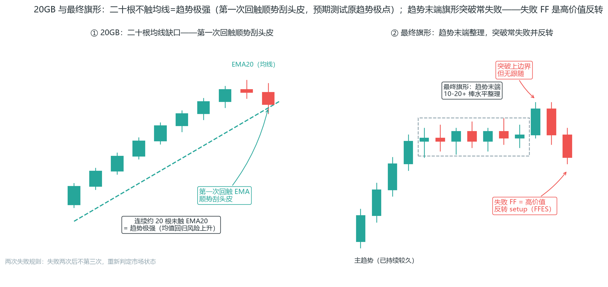

### 4.23 外包 K 线（Outside Bar）的实战用法

外包 K 的含义是"先失败再吞没"：第一根 K 线的极值，被第二根 K 线完全吞没（外包线，见 2.1）。实战用法五条：

- **先失败再吞没 = 反转信号**：第一根 K 线失败的一方是弱者，吞没它的一方是强者。
- **顺失败方向**：交易方向 = 第一根 K 线的失败方向（失败方止损，强方接盘）。
- **关键位置**：外包 K 出现在关键位（支撑阻力/前高前低/OB）更有效——位置赋予形态意义（第 2.2）。
- **收盘市价进场**：确认吞没后收盘市价进场——外包 K 实体大，限价容易错过，市价入场成本可控。
- **止损**：外包 K 极值外侧（通常较小，盈亏比好）。

**外包 K 与 3.3 吞没的区别**：吞没只要求第二根 K 包住第一根实体，外包 K 要求包住**整根（含影线）**——更严格，出现更少，但信号更强。两者用法相同：位置优先，形态其次。

**外包线的三个特殊场景**（市场诊断框架）：① 强趋势中的外包线更像趋势 K 线而非凝滞区——通常会引发两次进攻；② 趋势线突破/轨道线穿越后的强势反转中，外包线若构成二次进场，是极佳的进场 K 线；③ **内-外-内形态**：外包线后紧跟内含线，按内含线的突破方向进场。

**方向偏向：突破幅度比较法（Ali 突破白皮书）**：外包线的看涨/看跌倾向不取决于 K 线方向，而取决于两端突破幅度的比较——**前棒高点之上的突破幅度 > 前棒低点之下的突破幅度 = 看涨**（说明低点下方有买家，价格回踩有支撑）；反之看跌（高点上方有卖家）。仅凭这个方向偏向做短线，胜率可达 83%；更妙的是**失败信号的二次交易**：外包线信号失败后，价格回踩被套点位时反向操作（如信号做空被套，回踩时做多，即“反杀”被套者），胜率超过 85%——被套方止损回补正是反向燃料（呼应 3.1 假突破）。另外，外包线的高点/低点在反转后常角色互换：突破后的阻力变支撑、支撑变阻力，回踩这些位置时被套方回补推动价格再次上行。

### 4.24 决策执行口诀与禁止清单

把全书纪律压缩成两页纸：10 条执行口诀 + 一份“直接放弃”清单（PA_Agent 二元决策 §14/§15）。遇到清单里任何一条，停止交易或放弃当前信号：

**执行口诀 10 条**：

1. 看不懂，等。极端混乱，等。
2. 尖峰中只顺势——禁止 SCS、禁止追高潮。
3. 通道/区间只顺 direction——禁止逆势、禁止双边刮头皮。
4. 宽通道不追突破，仅顺主方向边界/回撤。
5. 区间中仅顺 direction 一侧；方向中性（neutral）则等。
6. 反转/MTR 只诊断不下单。
7. 楔形回撤可顺势；末端楔形/三推/楔形反转：禁止追顺势、禁止逆势下单。
8. 信号必须等收盘。
9. 止损和交易者方程不过关，直接放弃。
10. 二次入场失败后不再第三次。

**禁止行为清单**（出现任一项即停止或放弃当前信号）：

- 未识别周期位置就交易；数据不足仍下单；极端交易区间中交易。
- 尖峰中做反转；买进/卖出高潮后追原方向（含 SCS、市价追尖峰）。
- 区间中追普通突破；在区间中部入场。
- 宽通道中追突破；常规/宽通道中做任何逆势（含边界刮头皮、MTR 反手、双顶底反手）。
- 在 Always In Long 中做空、Always In Short 中做多；下单方向与 direction/Always In 不一致。
- 用长外包棒两端突破直接入场。
- 二次入场价明显优于第一次仍强做；二次入场失败后仍尝试第三次。
- 信号棒过长/止损距离过大仍强做；交易者方程不通过仍下单。
- 为“更好看”扭曲结构止损凑方程；止损后立即反手；连续两笔止损后仍不重新评估市场。

**一句话记忆**：决策 = 门控 + 方程——方向不明先等（门控），三价定死再算盈亏比（方程）；止损永远挂在结构失效位外 1 跳，不是挂在你希望的地方。

### 本章小结

会看信号≠会交易：信号只是扳机，系统才是整把枪。系统的作用是让你在情绪上头时不做蠢事。

六要素写死才算系统：背景/触发/止损/目标/仓位/过滤器。

系统一（趋势回调）期望值结构最好：顺势+止损紧凑+目标远，是默认选择。

系统二做区间反向，系统三做突破——区间破了就切换。

三个系统是状态机：结构变了就换，不恋战；最常见的亏损是用错系统。

状态判定树三步走：有无有序波段序列 → 通道（≥3 组+可画线，按回撤分窄/常规/宽）还是 trending_tr（仅 2 组）→ 区间（边界各 ≥2 次测试）——最新波段出 LL（涨）/HH（跌）立即重估；状态转换期降级处理。

系统四（微通道）是趋势日的短线利器：3 根同向 K 线 + 微小缺口定义，基础胜率 70%，10 项强度指标每缺 1 项扣 5%，超 6-7 根 K 线警惕回撤。

MTF：大周期定方向，小周期定入场。HTF 方向不对，LTF 信号作废。

没有最好的系统，只有合身的系统：系统的上限是你执行它的下限。

出场是期望值的另一半：目标入场前定死；分批止盈+移动止损只进不退；保本别太早；不动也是风险。

Measured Move 四类公式：区间高度翻测（约 60%）、通道宽度、楔形高度、尖峰 leg（约 70%+）——目标是算出来的，不是感觉出来的。

目标分两级：TP1 是近端结构位（RR≥1.0 只用它算），TP2 是远端 MM（必填但不参与盈亏比）；定价顺序 entry→TP1→TP2→stop，几何顺序 stop<entry<TP1<TP2。

磁力位 = 失败信号留下的磁场：失败信号极点/入场价/止损集中区——趋势中失败的逆势信号极点常是顺势目标；接近磁力位胜率趋近 50-50，17t/41t 陷阱区附近不设止损不追单。

通道量化分类以回撤百分比为主判据：窄 <30%（只做顺势、第一个逆势突破通常失败）、常规 30-50%、宽 50-78.6%（突破后必有测试）；微型通道 2-10 棒突破必失败——等突破失败顺势入场；收缩台阶=动能衰退、加速台阶=高潮前兆。

通道的深层身份：上涨通道=空头旗形（下跌通道=多头旗形）——上边界是空头建仓区，大多数向上突破失败，通道越久向下突破概率越高；画线四方法随阶段演进（平行线→波段点→最佳拟合→平行投影），趋势线连续两次重画=即将突破；生命周期五阶段：尖峰→扩展→台阶→收缩（动能衰退）→区间；第一个突破尝试必失败，假突破=通道延续信号；止损超通道宽度 1.5 倍放弃交易。

区间交易先量化再动手：紧凑度 = 区间宽度/平均波段幅度——<25% Barbwire 不交易、25-35% 过渡只等突破、≥35% 再看 CV——高密度（<0.3）才在边界顺方向刮头皮；边界是区域不是线（各 ≥2 极点验证）；突破前兆看尖峰级别与测试，突破失败陷阱 = 突破后立即反向尖峰——只等测试不追突破；中间时段 + 中间位置 = 不交易；止损超区间宽度 10% 放弃；边界与均线重叠 = 高概率刮头皮位。

三角形是区间里的特殊收敛：上升/下降三角形有方向偏向，对称三角形禁止赌方向，扩张三角形不交易；双顶底靠二次测试确认——第一次触边不追，第二次失败才确认极点，突破颈线后的回撤是二次入场背景。

Always In 是方向过滤器：AIL/AIS 先定方向再谈打法，逆 Always In 的首个反转仅诊断；20GB（二十根不触均线）= 趋势极强但均值回归风险上升——第一次回触 EMA 顺势刮头皮，两次失败不再第三次。

最终旗形 = 趋势末端的最后一面旗：突破常失败并反转，禁止盲目追顺势；失败 FF（突破无跟随）是高价值反转 setup，但升级 MTR 仍须四组件齐全。

首次回调序列是趋势的生命周期地图：初期回调弱而浅（高1最值得做），末期回调强而深（高3/破均线后停做顺势）——首次反转尝试倾向失败，原趋势极值倾向被测试。

决策是门控 + 方程：看不懂就等（门控），三价定死再算盈亏比（方程）——止损永远在结构失效位外 1 跳，固定跳数只是“过大”过滤器；口诀十条 + 禁止清单，触犯任何一条就放弃。

下一章讲 SMC——它给这套系统提供了一个"机构视角"的补充框架，核心是流动性池和 sweep。
