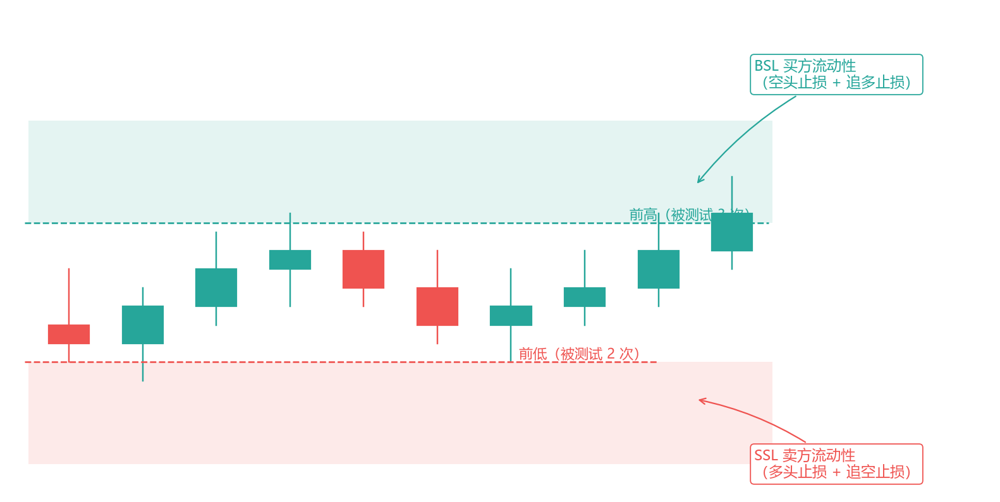
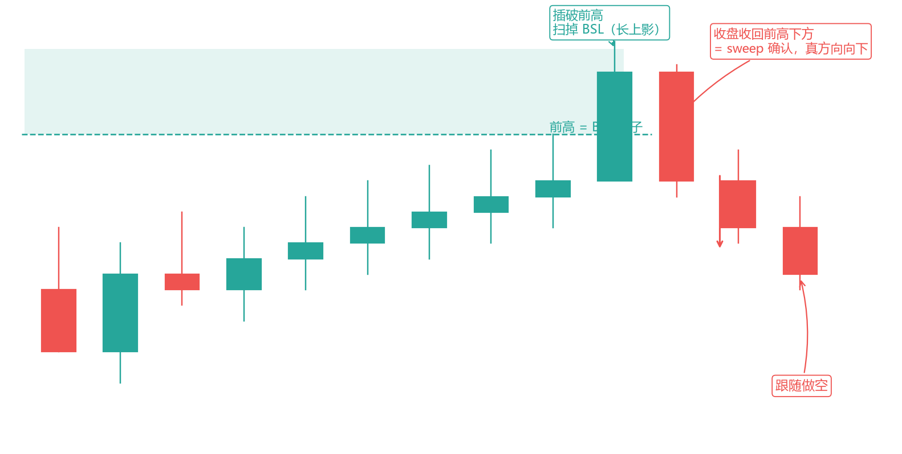
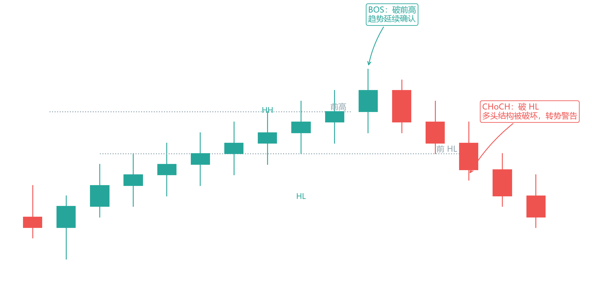
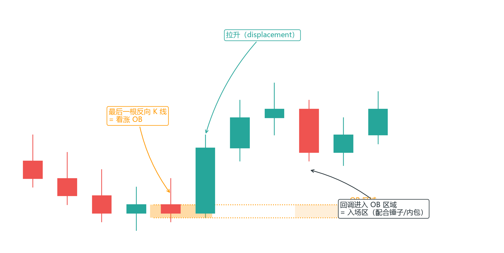
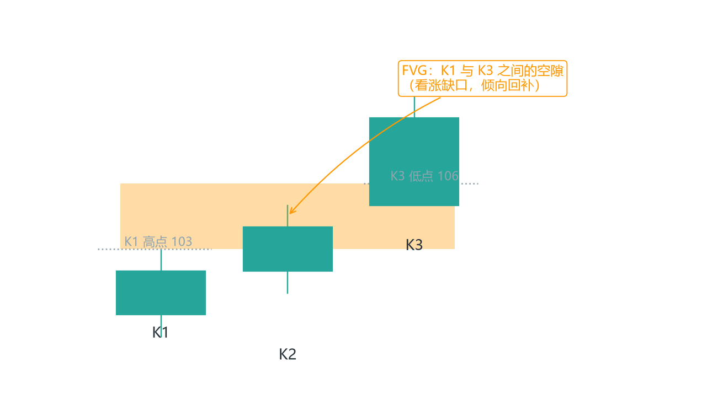
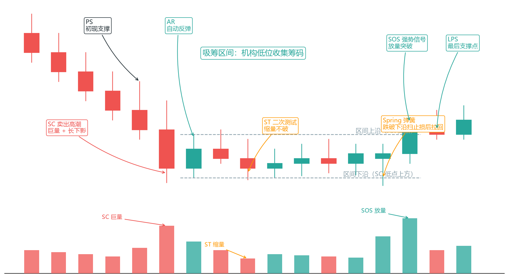
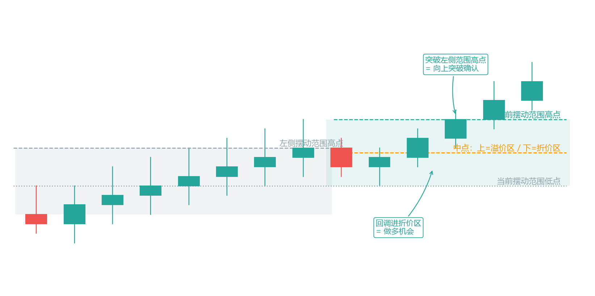
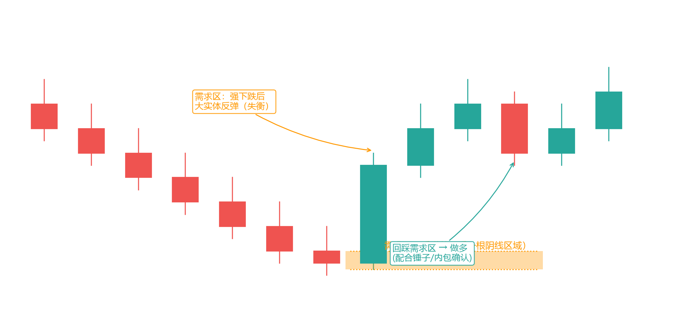
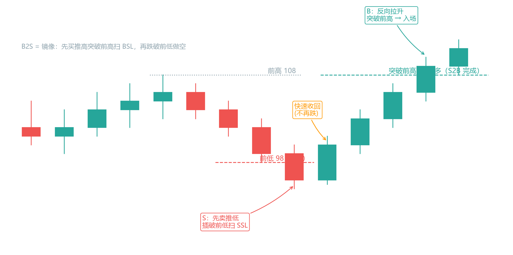
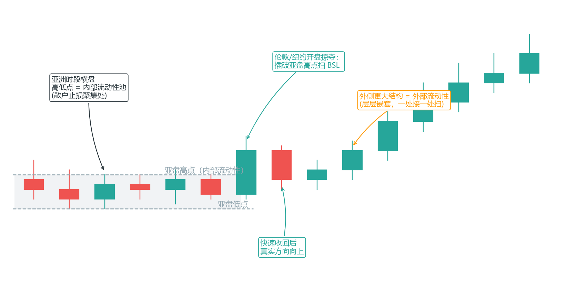

# 第 5 章 聪明钱概念（SMC）


本章解决一个问题：SMC 到底是什么，哪些部分真正有用，哪些是叙事包装。学 SMC 学的是纪律框架，不是神秘学。

先给结论，后面逐条展开：**SMC 是对价格行为的"机构视角"重述**。假突破=sweep，吞没=displacement，支撑阻力=流动性池。框架是新的，市场逻辑没变。它真正的价值在于提供了一套"等 sweep、不追突破"的可执行纪律——用它给纪律，别用它给信仰。

### 5.1 核心世界观

SMC 的叙事是这样的：

- 市场参与者分两类：机构（聪明钱）和散户。
- 散户行为可预测：在明显位置挂止损、追突破、在关键位抄底摸顶（呼应第 1 章）。
- 机构需要"对手盘"才能建仓/出货——所以会故意把价格推向止损密集区，扫掉止损，拿到流动性，然后反向走。
- 因此：止损密集的地方就是机构的目标；"扫完止损后"的方向，才是机构的真实方向。

**区分实证与叙事——这是本章最重要的批判视角**：

- **实证部分**：挂单和止损确实聚集在整数关口、前高前低附近。这是真实的市场微观结构，可观察、可验证。
- **叙事部分**："机构故意猎杀散户"无法验证——你无法证明那根插针是某个机构蓄意为之，还是单纯的流动性枯竭。

所以正确的态度是：借用 SMC 的决策框架（等 sweep、不追突破、在流动性池附近警惕），但不必相信它的阴谋论叙事。**框架帮你少亏，叙事只会让你觉得自己看穿了市场**——后者是危险的自负。

这条批判视角为什么重要：SMC 圈子里最流行的心态就是"看穿主力"的优越感——而优越感会放大仓位、无视止损。记住：你用 SMC 是为了更机械地执行，不是为了更聪明地"看穿"。

### 5.2 流动性池（Liquidity Pool）

**定义**：大量止损/限价单聚集的区域。两类：

- **买方流动性（BSL）**：前高上方——空头止损 + 追多散户的止损。
- **卖方流动性（SSL）**：前低下方——多头止损 + 追空散户的止损。

```
前高 ───────────  上方 = BSL（空头止损池）
  ╱╲╱    ╲╱      ╲
前低 ───────────  下方 = SSL（多头止损池）
```



**画法**：把图上所有明显的 swing high/low 连成横线，每根线上方/下方就是流动性池。SMC 的入场策略几乎全围绕"扫池子"展开。

**怎么找肥池子（池子越肥，扫完行情越大）**：

1. 被测试 ≥3 次的高/低点。
2. 日线/4H 级别的极值。
3. 整数关口（如 1.1000）。

**池子的质量 = 触过次数 × 停留时间 × 周期级别**。三者越高，止损越密集，被扫的概率越高、扫完后的行情越大。

**具体怎么操作**：打开图，先找被测试 3 次以上的水平位——那是"已验证的池子"；再找日线/4H 的显著极值——那是"大池子"；最后叠加整数关口。每个池子用横线标出来，旁边写上是 BSL 还是 SSL。这张"池子地图"就是你当天的作战图（第 5.7 完整流程会用它）。

### 5.3 扫流动性（Sweep / Stop Hunt）

**定义**：价格短暂插破流动性池（前高/前低），把止损吃掉，然后迅速反向。这就是第 3 章假突破的 SMC 叫法。

```
      ╱│╲    ← 插破前高扫BSL（长上影）
─────╱─│─╲──────  前高
    ╱  │  ╲
      ╱   │   ╲    ← 快速收回下行 = 真方向向下
```



**SMC 入场核心规则：不要在扫流动性之前入场，要等 sweep 发生之后再跟随真实方向**。这条纪律能帮你避开绝大多数追突破被套的情况。

**sweep 识别清单（全中才做）**：

- [ ] 插破的是被测试过多次的关键位（肥池子）
- [ ] 插破后快速收回（收盘回池内，或长影线）
- [ ] 收回时放量
- [ ] 与高时间框架方向一致

**识别要点**：

- sweep 的 K 线通常带长影线（被打回）或快速收回（位移）。
- 收盘回到池子以内 = sweep 有效；收盘站稳池外 = 真突破，方向变了，别反向。
- 假突破 + 反向大实体 + 放量 = 最高质量的 sweep 信号。

**为什么"收盘回到池内"是关键**：插破只是一瞬间的流动性测试，收盘位置才是市场对这次测试的"裁决"。收盘收在池外 = 空头（或多头）赢了这个回合，结构变了；收盘收在池内 = 突破失败，原来的结构完好，sweep 成立。所以永远等收盘确认，别在插破瞬间就反向进场（第 3.2 的收盘确认在 SMC 里同样成立）。

### 5.4 市场结构转换（BOS / CHoCH）

这两个是第 2 章"结构突破"的 SMC 术语：

- **BOS（Break of Structure，结构破坏）**：趋势同向突破。上升趋势中价格突破前高 = 趋势延续确认。
- **CHoCH（Change of Character，性质变化）**：趋势反向破坏。上升趋势中价格跌破前一个 HL = 多头结构被破坏，可能转势。

```
        ●BOS(破前高,延续)
   ╱ ╲●    ╲╱ ╲    ●●    ●
  ╱   ╲╱ ╲        ╲  ╱ ╲
                    ●CHoCH(破HL,转势警告)
```



**用法**：

- **BOS = 趋势健康**，继续做顺势回调（系统一）。
- **CHoCH = 旧结构破了**，等新结构形成，别急着逆势抄底。
- **严格定义（SMC 派）**：CHoCH 必须由强位移 K 线确认，普通跌破不算。

**流派差异提示**：不同 SMC 教学对 CHoCH 定义有分歧——有的要求"先出现一个反向 BOS 再确认 CHoCH"，有的只要跌破前 HL 就算。选一种写进你的规则书，别混着用。**术语不统一是 SMC 圈的常态，你要的是自己规则的一致性，不是和别人争论定义**。

**CHoCH 之后做什么（实操）**：CHoCH 出现 ≠ 立刻反向做单。它是"警告"，不是"入场信号"。正确流程：CHoCH 出现 → 停止做旧方向的单 → 等新方向的结构（第一个反向 BOS）形成 → 在新结构上做顺势回调。急着在 CHoCH 那一刻反向入场，等于在趋势翻转的第一个瞬间抄底摸顶——胜率极低。

### 5.5 订单块（Order Block, OB）

**定义**：机构建仓留下的"痕迹"——趋势启动前，最后一根反向 K 线。SMC 认为机构在那里下了大量订单，价格回踩会再获支撑/阻力。

**识别方法（上升趋势为例）**：

1. 找到一段强拉升（位移）之前的最后一根阴线（反向 K 线）。
2. 这根阴线就是看涨订单块。
3. 价格回调到订单块区域 → 入场做多。

```
        ╱   拉升(displacement)
       ╱┌─┐╱    ← 最后一根阴线 = 看涨OB
      │ │╱
      └─┘╱    ← 回调到这里 = 入场区
```



**注意事项**：

- OB 是"区域"不是"线"，取整根 K 线范围。
- 只做"未使用过的"OB（没被完全穿过消耗掉）。
- OB 失效条件：价格进入 OB 区域但没反应、直接穿过——此时 OB 被"消耗"，不再是入场依据。
- OB 有效性排序：日线 > 4H > 1H。

**实例**：4H 上升趋势，一段大阳线拉升前有一根小阴线（101.0-101.5）。后续价格拉升到 105，回调到 101.3 进入那根小阴线区域并出现锤子 → 做多，止损 100.8（OB 下沿外），目标 105 前高。

**诚实的评价**：OB 与普通"支撑阻力区"高度重合。它是否真代表机构行为没有证据，但作为"关键位入场"的规则是可用的。别因为叫"订单块"就觉得它比支撑位高级——本质是同一类东西。

### 5.6 公允价值缺口（FVG / 失衡）

**定义**：三根 K 线之间留下的价格缝隙——第一根和第三根之间没有重叠的部分（看涨 FVG：K1 高点 < K3 低点）。SMC 解释为"机构急于建仓留下的缺口"，价格倾向回补。

```
K1高 ─────────▒▒▒▒▒▒   ← 缺口(FVG)：K1与K3间的空隙
K3低 ─────────
K1   K2   K3
```



**用法**：

- **入场**：价格回撤进入 FVG = 潜在入场区（配合 OB/sweep 更佳）。
- **目标**：上方结构/前高。
- **常见组合**：sweep + 进入 FVG + OB 三者重叠 = "高质量入场区"。
- **方向性**：FVG 分看涨/看跌，只做与交易方向一致的 FVG。

**识别步骤（上升趋势的看涨 FVG 为例）**：找到一根大阳线（K3）——它之前的 K1 和它之间如果有价格空隙（K1 的高点低于 K3 的低点），这个空隙就是 FVG。空隙的上下沿就是回补的参考区。识别不难，难的是只做"顺势 + 结构内"的 FVG——半空中的 FVG 只是噪音。

**诚实的评价**：FVG 本质是"加速段后的首次回调位"，和价格行为的"支撑阻力区域"是同一种东西换了名字。可以用它做规则，但别迷信名字。

### 5.7 完整 SMC 交易流程（走一遍）

**背景**：日线上升趋势，4H 出现 CHoCH 警告，我们在 1H 等做多机会。

1. **画结构**：标出所有 swing high/low，画出流动性池（前高上方 BSL、前低下方 SSL），标出最近的看涨 OB 和 FVG。
2. **等 sweep**：价格下跌，插破前低（SSL）——扫掉多头止损。观察：是否快速收回（收盘回池内）？影线长不长？量放大没？→ 是：sweep 确认，准备做多。
3. **找入场区**：sweep 后价格拉回，进入 FVG/OB 区域，在小级别（15m）找锤子/内包线做最后确认。
4. **执行**：入场 = OB 区域 + 小级别确认；止损 = sweep 低点下方（SSL 之外）；目标 = 前高（BSL 池子）或 2R。
5. **管理**：到 1R 后移止损到入场价（保本），让利润跑向 BSL。

**关键认知**：这套流程就是第 4 章"趋势回调系统"的 SMC 翻译版——趋势回调 + 假突破确认 + 关键位入场 + 结构止损。语言不同，数学一样。如果你已经掌握了第 3、4 章，SMC 给你的增量主要是"等 sweep"这条纪律和一套术语，不是全新的方法。

**流程的每个步骤都对应本书的既有概念**（对照表）：

| SMC 步骤 | 本质 | 本书对应 |
| --- | --- | --- |
| 画流动性池 | 找止损密集区 | 第 2.4 支撑阻力 |
| 等 sweep | 等假突破确认 | 第 3.2 假突破 |
| FVG/OB 入场区 | 关键位回调 | 第 4.3 趋势回调 |
| 止损 SSL 外 | 结构外止损 | 第 4.2 六要素 |
| 目标 BSL | 前高目标 | 第 4.13 结构位目标 |

### 5.8 Kill Zones（时段）

SMC 认为机构只在特定时段活跃（ICT 定义）。北京时间（美东夏令时，北京=UTC+8）：

- **伦敦时段**：14:00-17:00（伦敦 8:00 开盘 = 北京 15:00 夏令时 / 16:00 冬令时）。
- **纽约时段**：19:00-22:00（纽约 9:30 开盘 = 北京 21:30 夏令时 / 22:30 冬令时）。
- 亚盘（北京 6:00-14:00）：流动性薄，多为噪音；东京时段 8:00-9:00 的"修正段"除外。

冬令时（11 月-次年 3 月）所有时间 +1 小时。

这与第 1 章的时段结论一致：伦敦-纽约重叠是黄金窗口。**规则优先于时段**——有信号哪个时段都能做，没信号在 Kill Zone 里也别硬做。时段是加分项，不是入场理由。

**Kill Zone 的正确用法**：不是"只在 Kill Zone 做单"（那是把时段当圣杯），而是"在 Kill Zone 里出现的信号优先级更高、可以放宽一点质量门槛（比如评分 4 即可）；非 Kill Zone 的信号要更严格（评分必须满分）"。时段是信号质量评分的加权项，不是开关。

### 5.9 验证心态：防事后叙事

**SMC 最大的问题是事后叙事**：行情走完，你总能找到一个"OB+FVG+sweep"的解释，看起来头头是道——但那是马后炮，不是预测。

**防呆三招**：

1. **入场前记录**：把画好的池子/OB/FVG 截图存下来。事后解释不算数，只有入场前的判断才算。
2. **统计验证**：连续记录 30-50 次"sweep 后反向"的案例，算真实胜率和平均 R。低于 40% 胜率 + RR<2 的规则直接弃用。
3. **对照验证**：同一位置用"普通支撑阻力+假突破"的旧规则回测——如果结果差不多，说明 SMC 语言没给你增量，你用的是价格行为本身。

**为什么"入场前截图"是防呆第一招**：事后复盘时，大脑会自动把"当时的判断"重写成"正确的判断"（记忆重构）。入场前的截图 + 入场理由（写下来），是唯一能对抗这种重构的证据。第 8 章日志模板里的"截图链接"字段就是干这个的。

### 5.10 Wyckoff：SMC 的正统源头

SMC 的"聪明钱"不是 ICT 发明的，源头是理查德·威科夫（Richard Wyckoff，1873-1934）——20 世纪初的华尔街传奇。他的方法比 SMC 早了近一百年，而且更成体系。

**三大定律**：

1. **供求定律**：价格方向由供需力量对比决定。
2. **因果定律**：任何趋势都有"因"（吸筹/派发阶段），有因才有果——横盘吸筹越久，后续趋势越大。
3. **努力与结果定律**：成交量（努力）应与价格变化（结果）匹配；放量却不创新高/新低 = 一方力量耗尽。这是第 2 章量价规则的源头。

**Composite Man（合成操盘手）**：把所有机构当成一个"大庄家"。他的行为循环：低位吸筹（把散户吓出去）→ 拉升 → 高位派发（把散户骗进来）→ 打压。SMC 的"聪明钱"就是这个概念的转世。

**吸筹阶段（下跌后低位收集筹码）**：



*图 5-6 Wyckoff 吸筹结构：PS→SC→AR→ST→Spring→SOS→LPS*

**吸筹图里每个事件在发生什么**（这是 Wyckoff 最精华的部分，把"机构吸筹"拆成可识别的步骤）：

- **PS（初现支撑）**：下跌趋势中第一次出现像样的买盘，跌势放缓。还不是底，只是"有资金开始接了"。
- **SC（卖出高潮）**：恐慌性抛售，大阴线+巨量，散户割肉、机构接货。这是吸筹的"主菜"——机构在恐慌里大量买入。
- **AR（自动反弹）**：卖压耗尽后自然反弹，划出区间上沿。
- **ST（二次测试）**：价格回落到 SC 附近再测一次，但量更小、跌不动——确认卖压枯竭。
- **Spring（弹簧）**：跌破区间下沿（扫掉最后的止损），又快速拉回——最后的"洗盘"，也是最经典的入场点（= 第 5.3 的 sweep）。
- **SOS（强势信号）**：放量大涨突破区间，确认机构吸筹完成、要拉升了。
- **LPS（最后支撑点）**：突破后的回踩，是相对安全的追入点。

**读懂这张图的意义**：它把"底部"从一个"点"变成一个"过程"。新手想找"最低点"抄底，Wyckoff 告诉你底部是一个机构吸筹的区间，你要做的是识别这个过程、在 Spring 或 LPS 介入，而不是猜最低点。

**派发是吸筹的镜像**：PSY（初现供应）→ BC（买入高潮）→ AR（自动反弹）→ ST（二次测试）→ UT（上冲回落）→ SOW（弱势信号）跌破区间。

**两个关键信号**：

- **Spring（弹簧）**：跌破支撑区扫掉多头止损后快速反转——就是第 5.3 节 sweep 的原型。
- **Upthrust（上冲回落）**：突破阻力区扫掉空头止损后跌回——派发陷阱。

**为什么值得知道**：读 Wyckoff 原著（公版免费，见附录）你会发现，SMC 的每个概念都有出处。它帮你把 SMC 从"神秘学"还原成"一百年前就被总结过的市场机制"——止损聚集与猎杀，Wyckoff 早就看明白了。

**Wyckoff 在实战中的用法**：不需要等完整的 7 步走完才动手。实战中最重要的两个识别点：SC（恐慌高潮，观察巨量）和 Spring（扫损拉回，第 5.3 的 sweep 清单直接套用）。中间的过程（AR/ST）是用来"确认阶段"的，不是每次都会标准走完——当结构不完整时，按第 2.3 的客观结构判据处理，别强行套 Wyckoff 剧本。

### 5.11 供需区（Supply/Demand）：给强势运动的起点标价

**Seiden 基础定义**：Sam Seiden 的供需区学派，与 SMC 的 OB 是近亲——很多人认为 OB 就是供需区的换皮。

**定义**：一段强势运动的起点——强势拉升前的"基地"（一小簇 K 线）是需求区，强势下跌前的基地是供给区。

**四种结构**：

- Rally-Base-Drop（涨-基-跌）→ 供给区
- Drop-Base-Rally（跌-基-涨）→ 需求区
- Rally-Base-Rally / Drop-Base-Drop（持续型）

**画法**：取基地小 K 线的范围作为区域。

**与 OB 的关系**：OB（强位移前最后一根反向 K 线）本质就是一种需求/供给区。不同学派，同一实质——都是"强势运动起源的关键位"。

**用法规则**：新鲜区（未被触碰过）最有效。被碰过一次后，那里的挂单被消耗，有效性下降——呼应 OB 的"只做未使用过的"。

### 5.12 Volume Profile：量在哪里

Volume Profile（成交量分布）把成交量按价格轴画成横向直方图——区别于传统的纵向成交量（按时间）。Market Profile 同源。

**三个概念**：

- **POC（Point of Control）**：成交量最大的价位——市场的"重心"，是磁铁也是支撑阻力。
- **Value Area（VA）**：包含 70% 成交量的价格区间（VAH 上沿 / VAL 下沿）。价格倾向留在 VA 内；离开 VA = 可能出趋势。
- **HVN/LVN**：高成交量节点 = 支撑阻力（成交多，价格走得慢）；低成交量节点 = 快速通过区（成交少，价格跑得快）。

**与 Wyckoff/SMC 融合**：

- 吸筹/派发的过程，就是成交量在某价位区间堆积（形成 HVN）的过程。
- sweep 后快速穿过 LVN = 机构快速移动。
- POC 可作目标或止损参考。

**工具**：TradingView 有 Volume Profile 指标（完整版付费，免费版有替代）。在期货/股票（真实量）上最有用，外汇用 tick 量近似。

**实战用法（三句话）**：①入场前看 POC 在哪——它常与支撑/阻力/OB 重叠，是 confluence 的天然加分项；②价格在 VA 内时按区间思维（系统二），突破 VA 外时按趋势思维（系统一/三）；③LVN 快速通过区不要挂单等回踩——价格不会在那里停留，等它穿过 LVN 到下一个 HVN 再评估。

### 5.13 摆动范围（Swing Range）：把结构变成"地图"

雷神订单流流派（国内 SMC 教学中结构最严谨的一支）把"最近的趋势结构"机械化为两个摆动范围——这是它对本书第 2.3 趋势定义的可执行化。学它的意义：把"感觉在涨"彻底替换成"当前摆动范围对左侧摆动范围是向上还是向下突破"。

**定义**：

- **摆动高点/低点（Swing High/Low）**：两侧各至少 1 根 K 线都低于/高于它的转折点（与第 2 章一致，要求 ≥3 根 K 线组成更稳）。
- **摆动范围（Swing Range）**：一个摆动高点到下一个摆动低点（或反之）之间的区间，是"当前交易范围"。
- **摆动趋势（Swing Trend）**：当前摆动范围相对左侧摆动范围的突破方向。向上突破 → 摆动趋势向上；向下突破 → 摆动趋势向下。

**机械定义摆动范围的两个硬条件**（防止随手画框）：

1. **必须存在结构突破**：价格突破了左侧摆动范围的高/低点。
2. **必须存在分形结构反转**：突破后回调，出现反向的分形（中间 K 线高于/低于两侧 K 线的 3 根组合）确认。

两个条件都满足，才把新范围标记为"当前摆动范围"；只满足一个，继续等。

**实操**：图上标出最近的两个摆动范围——左侧（已走完）和右侧（当前）。看当前范围对左侧是向上还是向下突破，这就是你当天的订单流方向。价格在摆动范围内做任何行为（上下穿插）都不改变趋势；一旦反向突破当前摆动范围的结构低点（需结合反转结构确认），摆动趋势反转。



**与本书系统的对照**：摆动范围 = 第 2.3 的高低点排列的可视化；摆动趋势 = 状态机（第 4.7）的"结构判定"。雷神流派的增量是"两个范围"的取法——只看最近的两个，不看更早的，避免把老结构当成当前地图。

### 5.14 溢价与折价（Premium / Discount）："贵不贵"是交易决策的一半

SMC 里常被忽视但决定"这笔要不要执行"的概念。

**定义**：以当前摆动范围的中点为界：

- 上半区 = **溢价区（Premium）**：价格偏贵。
- 下半区 = **折价区（Discount）**：价格偏便宜。
- 中点 = **价值平衡点**：公允价。

**用法**（与摆动趋势组合）：

- 摆动趋势向上突破 → 等价格**回调进入折价区**再预期反转做多——"回调到位"的标准不是某个均线，而是进入折价区。
- 摆动趋势向下突破 → 等价格**反弹进入溢价区**再预期反转做空。

**为什么不追**：机构在低点买入（便宜），在高点卖出（贵）。你在溢价区追多、折价区追空，等于在机构准备离场的位置接盘。等价格回到折价区/溢价区，才是"价格交付"完成、机构愿意再交易的位置。

**注意**：价格没有进入溢价/折价区就发生次级结构反转也属正常——未平衡的价格会在未来得到平衡。折价区不是"必涨"，是"概率占优"，仍需配合信号 K（第 3.10）和 sweep 确认。

**与第 4 章斐波那契的对照**：折价区 ≈ 0.5-0.618 回撤带的 SMC 版本。两个工具常重叠：摆动范围中点（50%）+ 61.8% 回撤 + OB/FVG = 高质量 confluence（第 4.8）。

**雷神的高质量筛选三特征**：雷神流派对"高质量供需区"的量化特征——它把"基地"的筛选标准写得更死：

**形成机制**：当价格在某水平下方交易时突然涌入大量买单（或上方涌入大量卖单），价格快速离开——这个"离开前的区域"就是需求区/供给区。本质：**供需失衡的起点**。

**机构如何推动价格**（理解为什么大阳线有意义）：机构要成交大买单，需要等量的卖单。当前价位卖单不够 → 价格必须上涨去"找"卖单，直到订单全部成交——图表上的表现就是大实体阳线或连续阳线。反之大阴线同理。所以：**大实体 K 线 = 流动性不足的证明 = 机构订单的痕迹**。

**高概率供需区三特征**（雷神原版）：

1. **强劲的失衡力度**：突破结构后留下流动性失衡未填补（FVG/LV），价格大概率回来填补。
2. **离开时是强劲动量**：离开区的 K 线必须是大实体/连续同向 K 线（重叠小 K 线离开 = 没有失衡 = 放弃该区）；返回时动量应与离开时相反（返回时同样强劲 = 该区可能被击穿 = 放弃）。
3. **未被缓解**：离当前最近且未被完全触及消耗的区优先。价格每次触及供需区都在撮合订单、消耗市价单和挂单。

**有效性前置条件**：必须产生结构突破。大实体 K 线 + 突破前期结构高/低点，该区才有效；不能突破 = 存在量价分歧 = 放弃。

**与 OB 的关系**（第 5.5）：订单块 = 广义上的供需区——强突破前最后一根反向 K 线的高低点区域。雷神原话："订单块可以是广义上的供需区，因为价格信息在任何时间周期都是相同的，不同周期只是改变蜡烛的外观和数量。"同一实质，两个流派名字。



### 5.15 机构订单块与 S2B/B2S：从"识别"到"理解意图"

S2B（Sell to Buy）和 B2S（Buy to Sell）是 SMC 对"为什么先反向插针再启动"的机制解释：

- **S2B（卖出再做多）**：机构想建多仓之前，先卖出推低价格、突破前低支撑，制造下跌假象——把空头止损和多头追空单变成自己的对手盘（流动性），完成大量买单匹配后，价格向上启动。
- **B2S（买入再做空）**：镜像——先买入拉高突破前高，收割多头止损后向下启动。

**为什么机构能"套牢"自己还能赚**：S2B 中机构率先卖出的订单会浮亏（成本被套），但机构资本雄厚，可以通过后续获利卖出回收成本，然后在初次入场成本附近再次交易，开启新一轮趋势。这就是"扫完止损后的方向才是真方向"的完整机制。

**交易清单里的位置**：识别出 S2B/B2S 后，配合第 5.3 的 sweep 清单使用：

- [ ] 突破前低/前高（插针）
- [ ] 快速收回并收盘回结构内
- [ ] 收回时放量
- [ ] 与 HTF 摆动趋势一致
- [ ] 附近有 OB/供需区/FVG 可作为入场区

**诚实的评价**：S2B/B2S 同样是"事后叙事"重灾区（第 5.9）——行情走完总能找到一个"机构先洗再拉"的解释。它的实用价值在于提醒你：**反向插针后的第一次反向确认，比插针本身更值得交易**。这个规则可以独立于叙事成立。



### 5.16 流动性诱导与内外流动性：读懂"陷阱"的布局

**流动性诱导（Liquidity Inducement）**：机构在回收成本前建立的、用于误导急切入场者的流动性池。识别它 = 识别"哪里是陷阱"。两类最常见：

1. **亚洲时段横盘高低点**（外汇专有）：亚盘（北京 6:00-14:00）横盘的高低点积累的流动性，是为伦敦/纽约开盘准备的——开盘后常先掠夺亚盘高低点（突破后反向运行）。识别前提：亚盘确实有累积流动性的行为（多次测试），没有累积行为的高低点不是有效池子。
2. **零售技术诱导**：传统技术分析里人人都在画的位置——趋势线、通道线、支撑阻力、等高点/等低点、突破回踩——这些位置积累了海量挂单，正是机构收割的对象。"为什么多单损了反手做空也亏"：你反手的位置，依然是所有人都在挂单的位置。

**内外流动性（Internal / External Liquidity）**：以当前摆动范围为界：

- **外部流动性**：摆动范围之外的流动性（前高上方 BSL、前低下方 SSL——第 5.2）。摆动趋势突破的目的就是捕获外部流动性。
- **内部流动性**：摆动范围之内的流动性——回调阶段不断突破左侧分形结构点，是在获取内部流动性（也为减轻机构对冲成本）。
- 内外流动性**层层嵌套**：大范围里有小范围，每个范围的突破都在捕获某个级别的流动性。

**实操**：从大周期开始自上而下定位——当前价格在获取外部还是内部流动性？获取外部流动性（扫前高/前低）后，倾向于转为获取内部流动性（回调扫次级结构点）。心中带着"当前在扫哪层池子"的图景，就不会把内部扫损误判成趋势反转。



**雷神原话（值得抄在规则书扉页）**："交易时如果不了解流动性，那么你的止损就是流动性。"——你的止损单就是别人的目标池子；了解流动性，你的止损至少是结构外、有依据的（第 4.2 六要素）。

### 本章小结

SMC 是价格行为的换皮：假突破=sweep，支撑阻力=流动性池，结构突破=BOS/CHoCH。

流动性池+sweep 是核心，OB 和 FVG 是关键位的包装。

区分实证（止损确实聚集）和叙事（机构故意猎杀）——借框架，别信阴谋论。

SMC 真正的增量是"等 sweep、不追突破"这条纪律。

防事后叙事：入场前记录、统计验证、对照验证。

下一章回到所有方法的共同约束：仓位与风险。再好的信号，仓位错了照样出局。
