# 第 6 章 仓位与风险

> **阅读提示**：本章是“活命数学”——期望值、凯利公式、破产概率、复利、40-60 规则与风险预算制。6.1–6.4 必读，公式不必背，用表格查；6.13 多策略资金分配是组合层视角，配置型读者可重点关注。


先给你一个可能颠覆认知的观点，它是本章的总纲：

> 决定你长期结果的，不是你的入场信号，而是你的仓位管理。入场决定你“摸到什么牌的概率”，仓位决定“摸到烂牌时你还活不活得下来”。

很多人把 90% 的精力花在找“更好的入场信号”上，以为那就是圣杯。但真相是：同样的系统，不同的仓位策略，结果天差地别——一个正期望值的系统，配上激进的仓位，照样爆仓；一个平平的系统，配上保守的仓位，能稳定存活。

这一章讲的就是这个“真正的圣杯”：怎么下注，才能活得久。全章没有玄学，只有公式、算例和可以直接抄进规则书的数字。

**为什么风险优先**

回本是不对称的，先看这张表，它会改变你对亏损的看法：

| 亏损比例 | 回本所需盈利 |
| --- | --- |
| 5% | 5.3% |
| 10% | 11.1% |
| 20% | 25.0% |
| 33% | 50.0% |
| 50% | 100% |

看懂了吗？**亏得越深，回本越难，而且是加速变难**。亏 5% 只要赚 5.3% 就回来，但亏 50% 要赚 100% 才回本——你得把亏掉的那半座山，整个再爬一遍。

这个表的数学本质：亏损是乘性的，不是加性的。账户 100 亏 20% 变 80，回 20 要涨 25%；再亏 20% 变 64，回 16 要涨 25%……每一次亏损都在抬高“回本所需的涨幅”。**控制回撤，就是控制你未来要爬的坡**。

这就是为什么风险控制是下单前的第一件事，不是赚完钱才想的事。考核期尤其如此——约束你的不是“能赚多少”，而是“能亏几次”。

### 6.1 考核规则决定仓位 【核心】

考核账户的真实约束，不是“你能赚多少”，而是“你能亏几次”。算给你看：

- 日回撤 5% + 单笔风险 0.5% → 一天最多错 10 次才碰线
- 日回撤 5% + 单笔风险 2% → 错 2-3 次就爆
- 总回撤 8% + 单笔风险 0.5% → 连续错 16 次才出局

**结论**：考核期单笔风险 ≤ 0.5%（保守派用 0.25%）。这不是“赚得慢”，这是“活得久”——只要活到趋势来，利润自然到。

把“能亏几次”这个数字再往深算一步：日回撤 5% 的考核账户，单笔风险 0.5% 意味着你一天有 10 次“犯错预算”。看起来很多？但注意：**交易日里连续亏 3-4 次是家常便饭**（第 6.3 会算给你看）。如果单笔 2%，一天错 3 次就直接碰线出局——你甚至来不及等到下午的行情。0.5% 的意义不是“少赚一点”，是“把出局概率压到可以忽略”。

**大多数考核失败，不是因为不会赚钱，而是某一天情绪上头重仓，把几周的努力一笔亏掉**。记住：重仓不是加速达标，是加速出局。

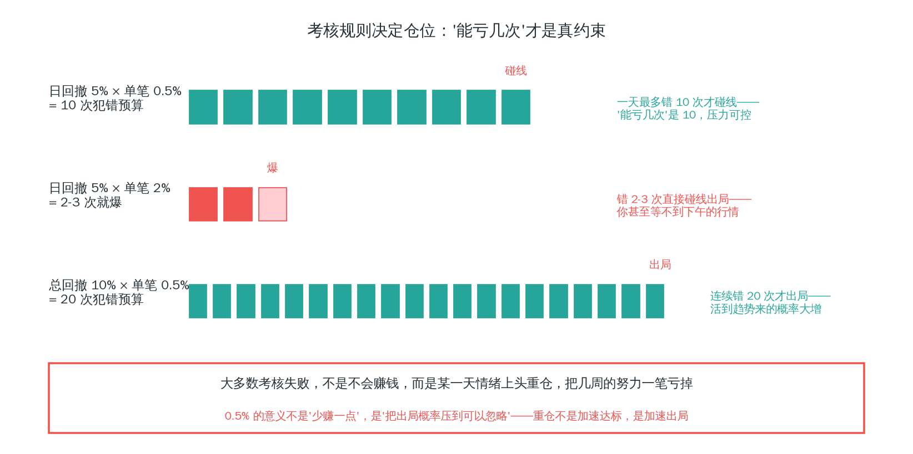

*图 6-1 犯错预算：单笔风险决定“能亏几次”——0.5% 是“活得久”，2% 是“加速出局”*

### 6.2 固定分数仓位公式 【核心】

仓位怎么算？核心公式：

```
风险金额 = 账户权益 × 单笔风险%
每 1 手止损亏损 = 止损距离(点) × 每点价值
手数 = 风险金额 ÷ 每 1 手止损亏损（向下取整）
```

每点价值由合约规格决定（第 1 章 1.4），下单前查清写进笔记。

**走三个例子，把公式用熟**：

**例一（外汇 EURUSD）**：$100,000 账户，风险 0.5% = $500。入场 1.1000，止损 1.0950（50 点）。每点 $1/手 → 每手止损亏损 = 50 × $1 = $50 → 手数 = $500 ÷ $50 = 10 手。

**例二（黄金 XAUUSD）**：1 手 = 100 盎司，价格每动 $1 = 每手 $100。入场 2000，止损 1995（$5 = 每手 $500）。风险 $500 → 手数 = $500 ÷ $500 = 1 手。

**例三（指数 NAS100）**：每点价值按平台规格（如 $2/点/手）。入场 15000，止损 14950（50 点），每点 $2/手 → 每手止损亏损 = 50 × $2 = $100 → 手数 = $500 ÷ $100 = 5 手。

**两个铁律**：

1. **这个数字入场前就算好，入场后不动**。临场改仓位 = 情绪接管。
2. **风险金额用当前权益，不是初始权益**。亏了之后仓位自动变小——这是“活得久”的数学基础。

**注意这个公式的逻辑**：先有止损距离，才有仓位大小。止损越宽，仓位越小；止损越紧，仓位越大。仓位不是拍脑袋定的，是被止损“反推”出来的。

**止损距离与仓位是跷跷板（Al Brooks 的算例）**：Al Brooks 讲头寸规模时给过一个非常直观的比例，以 20 点风险为基准：

| 止损距离 | 仓位 |
| --- | --- |
| 20 点 | 满仓 |
| 40 点 | **半仓** |
| 80 点 | **四分之一仓** |

理由很直接：止损距离是“每单位头寸的风险”，距离翻倍，想保持同样的总风险，只能把头寸减半。这个比例就是上面公式的图形化表达。它同时回答了一个常见困惑：“为什么专业交易者用宽止损？”——不是让你更冒险，而是让你用更小的仓位去**换“前提兑现的时间”**（6.5 会展开）。

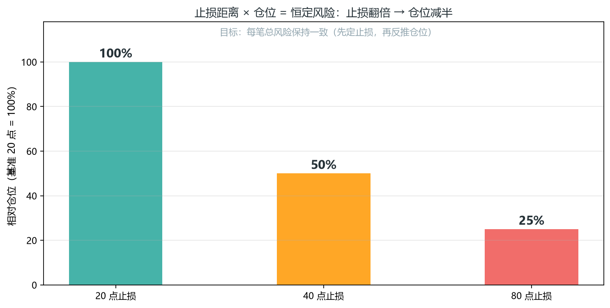

*图 6-2 止损距离 × 仓位 = 恒定风险：止损翻倍，仓位减半*

再补充一个新手最容易搞错的点：**手数向下取整，不要四舍五入**。公式算出 5.6 手，你就下 5 手——0.6 手的误差虽然小，但每次都在“超额冒险”，连亏时误差会叠加。宁可仓位小一点，别让实际风险超过计划风险。

### 6.3 连亏是必然，不是意外 【核心】

很多人对连亏没有心理准备，一连亏就慌、就改规则。先给你算清楚：

40% 胜率的系统，连亏 5 笔的概率 = 0.6⁵ ≈ 7.8%，连亏 8 笔 ≈ 1.7%。单看一次不大，但在 100 笔的周期里，几乎必然出现至少一段 5 连亏。

**连亏不是系统坏了，是概率的正常样子**。连亏时怀疑系统、临场改仓位，是最常见的死法。正确的预期是：连亏一定会来，问题是你的仓位能不能扛过去。

把概率再展开一点：100 笔里出现“至少一次 5 连亏”的概率约 = 1 − (1 − 0.078)^(100−4) ≈ 99.9%——**几乎必然**。如果你对连亏没有预期，第一次 5 连亏就会让你放弃一个本来正期望值的系统（第 7 章概率思维）。如果你有预期，5 连亏只是“又来了”，按计划继续。

这就是 0.5% 风险的深层原因：它保证了无论摸到多少颗亏损的弹珠，你都不会出局。只要不出局，概率迟早兑现。

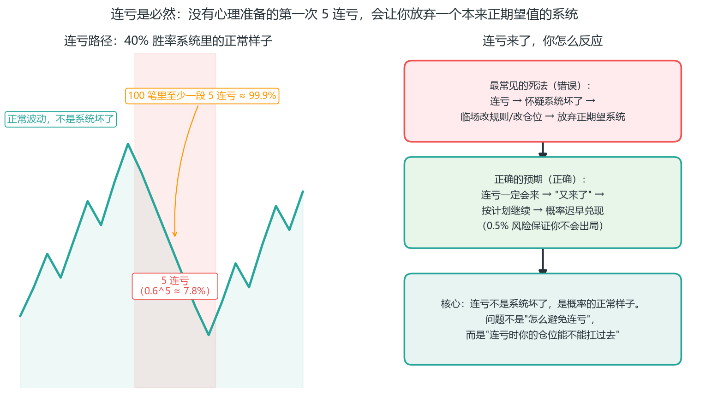

*图 6-3 连亏是必然：问题不是“怎么避免连亏”，而是“连亏时你的仓位能不能扛过去”——0.5% 风险保证你不会出局，概率迟早兑现*

上面是纸上的概率，真实数据长什么样？用一套真实回测看（EMA20/50 趋势跟踪，BTC 1H，2026-07-02 ~ 08-10，82 笔）：胜率 40%，**最大连亏 6 笔**——和纸上算的“100 笔里几乎必然出现 5 连亏”完全对上。而且这套系统**验证不合格**（总 R −7.83，见 8.2 的图 8-1R）。但注意下面这张图：同样是这 82 笔交易，风险 0.5% 时最大回撤只有 −5.6%，1% 时 −11%，账户都活着；风险放大到 20%，回撤 −93.7%，几乎爆仓。

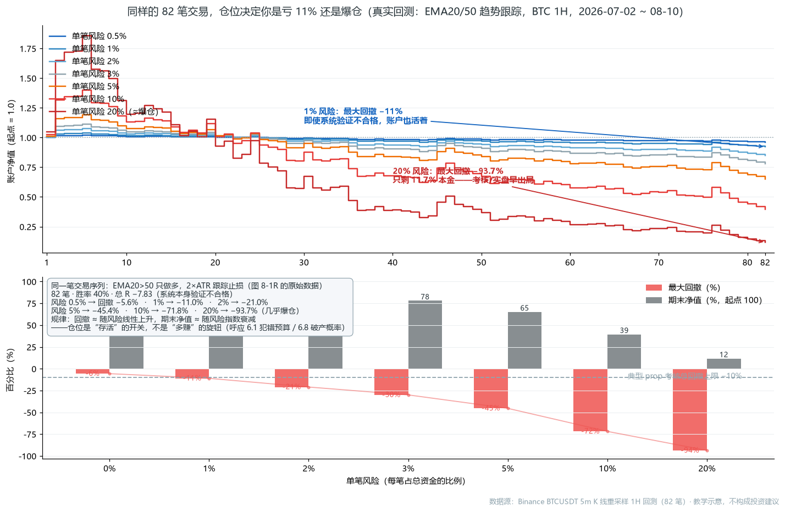

*图 6-1R 真实数据：仓位是“存活”的开关，不是“多赚”的旋钮——同一笔交易序列（82 笔，总 R −7.83，验证不合格），风险 1% 亏 11%，风险 20% 亏 94%；回撤随风险近似线性、期末净值随风险指数衰减，这正是 6.1 犯错预算与 6.8 破产概率的实证*

### 6.4 期望值与盈亏平衡 【核心】

你的系统到底行不行，不靠感觉，靠期望值：

```
期望值 = 胜率 × 平均盈利 − (1−胜率) × 平均亏损
```

**算两个例子**：

- 胜率 40%，盈亏比 2.5 → 期望值 = 0.4×2.5 − 0.6×1 = 0.4（正）
- 胜率 60%，盈亏比 0.8 → 期望值 = 0.6×0.8 − 0.4×1 = 0.08（勉强正）

注意第二个：胜率高达 60%，但因为盈亏比低，期望值几乎为零。这引出关键结论：

**宁可胜率低、盈亏比高**。RR=2 只需 33% 胜率就能打平。这就是为什么所有系统都强调“截断亏损、让利润奔跑”——它直接提高期望值。

**盈亏平衡胜率表（目标 RR 下最少需要的胜率）**：

| 风险回报比 RR | 需要的最低胜率 |
| --- | --- |
| 1:1 | > 50% |
| 1.5:1 | > 40% |
| 2:1 | > 33.3% |
| 3:1 | > 25% |

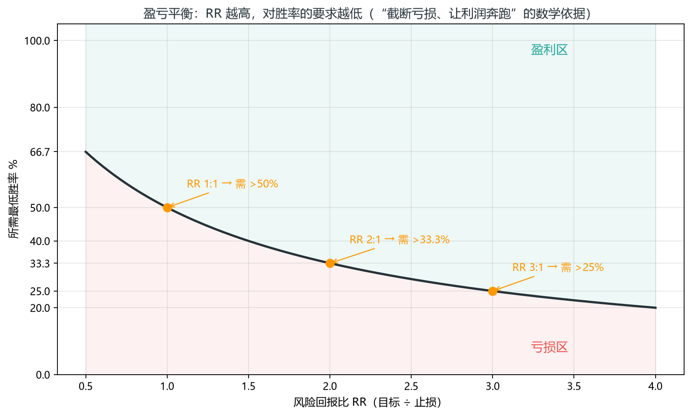

*图 6-4 盈亏平衡胜率曲线：RR 越高，所需最低胜率越低*

**怎么用交易日志算期望值**：积累 100 笔后，统计 ①胜率 = 盈利笔数 ÷ 总笔数 ②平均盈利 = 总盈利 ÷ 盈利笔数 ③平均亏损 = 总亏损 ÷ 亏损笔数，代入公式。期望值为负 → 系统不行，回炉；为正但 < 0.2R → 勉强，需优化。

**样本量要求**：50 笔以下毫无统计意义——连亏 5 笔在 40% 胜率系统里很正常。至少 100 笔模拟交易再下结论，且要覆盖趋势和震荡两种行情。只用“最近赚钱的一段”算期望值，是确认偏差（第 7.2 节）。

**Brooks 的交易者等式——同一件事的另一副面孔**：Al Brooks 把期望值写成对等的形式：

```
奖励 × 盈利概率 > 风险 × 亏损概率
```

关键在于：**风险和奖励由你设定（入场价、止损、目标都是你定的），只有概率是市场给的**。系统设计，本质就是在“自己可控的两个变量”和“市场给的一个变量”之间配平。

**三个变量不可能同时占优**：任何交易都不可能“高概率 + 大回报 + 小风险”三者兼得——如果存在，机构就会站到对面（零和游戏），让它迅速消失。想提高概率，就得接受更大的风险或更小的回报（6.7 凯利公式也是同一逻辑）。

Brooks 给大多数交易者的建议：**放弃高概率幻想，追求“至少 2 倍风险回报”**——在 40% 胜率下这已经数学上盈利（下面就是依据）。

**40-60 规则：为什么 2 倍回报是数学底线**：Brooks 的“40-60 规则”来自一个统计观察：

- 任何图表上约 **90% 的 K 线，其下一笔交易赚钱的概率落在 40%-60%**（“不确定的海洋”）；
- 只有约 **10% 的 K 线处于强势突破**，概率可达 70% 以上——但代价是止损远、风险大。

这条规则的量化样本（Ali，E-mini 5 分钟统计）：连“突破”这种最热门的结构，突破后获得后续 K 线（FT）的概率也只有约 48%（3.11）——正好落在 40-60 区间里。最热门的信号都接近抛硬币，其余普通 K 线就更别指望确定性。

**数学推导（把 90% 的普通场景代入交易者等式）**：就算只有 40% 胜率，只要每笔赚 2 倍风险、亏 1 倍风险：

```
期望值 = 0.4 × 2 − 0.6 × 1 = +0.2R（为正）
```

**结论**：这就是“波段交易（回报 ≥ 2 倍风险）应该是每个交易者的基础”的数学依据——它把 90% 的普通行情变成了有利的战场。

**高概率（70-90% 胜率）为什么不首选**：只出现在少数位置（如区间顶/底附近的刮头皮），代价是回报几乎不超过风险——靠笔数堆积利润，新手做不了。

**R 倍数：Van Tharp 把一切统一成 R（6.4 延伸）**

Van Tharp 在《通向财务自由之路》里提出了一个极其有力的统一语言：R 倍数。它把“期望值”和“仓位”这两件事焊在了一起。

**R 就是你入场时愿意承受的风险**（入场价到止损价的距离，换算成金额）。每笔交易的结果，都用“几个 R”表达：

- 止损离场 = −1R（你亏了 1 个初始风险）
- 赚到 2 倍止损距离 = +2R
- 保本出场 = 0R

于是你的系统不再是“胜率 40%、盈亏比 2”这种抽象描述，而是一个 R 倍数的分布：这笔 −1R、那笔 +2.4R、又一笔 −1R、再一笔 +3R……

**“弹珠袋”类比**：Van Tharp 有个著名比喻——你的交易系统就像一个袋子，里面装满弹珠，每颗代表一个可能的 R 结果。大多数弹珠是 −1R（亏损），少数是 +2R、+3R（盈利）。每次交易，就是从袋子里摸一颗弹珠。你无法控制这次摸到哪颗（单笔随机），但你能控制两件事：

1. **袋子里弹珠的比例**——系统的期望值（第 2-5 章在优化这个）。
2. **每次摸弹珠你押多少**——仓位（本章在讲这个）。

**Van Tharp 最著名的论断：仓位管理才是“圣杯”**。大多数人以为圣杯是“更好的入场信号”，但 Van Tharp 指出：同样的系统，不同的仓位策略，结果天差地别。一个正期望值的系统，配上激进的仓位，照样爆仓；一个平平的系统，配上保守的仓位，能稳定存活。入场决定你“摸到什么弹珠的概率”，但仓位决定“摸到坏弹珠时你还活不活得下来”——而活下来，是概率兑现的前提。

这解释了本书反复强调 0.5% 风险的深层原因：不是它“赚得慢”，而是它保证了无论摸到多少颗 −1R 弹珠，你都不会出局。只要不出局，袋子里那些 +2R、+3R 的弹珠，迟早会被你摸到。

**实践**：把交易日志（第 8 章）里每笔结果都记成 R 倍数，然后看你的 R 分布——平均 R 是多少（这就是以 R 计的期望值）？最大连亏几个 R？这个分布配合 0.5% 单笔风险，就是你的完整风险画像。

**Z 分数：给策略打“健康分”**：Van Tharp 从 R 分布延伸出一个量化指标——Z 分数（Z-Score），衡量“你的盈利是否显著偏离随机”。

**直觉**：把实际盈利笔数与“纯随机假设下应有的盈利笔数”之差，除以随机波动的标准差：

- **Z > 2**：盈利显著偏离随机（有真优势）；
- **Z 介于 2-5**：大多数盈利交易者的区间；
- **最佳系统约 5**；
- **Z < 2**：成绩很可能只是运气。

**Z 分数与破产风险直接相关**：Z 越高，破产概率越小。它和期望值互为补充：期望值回答“赚多少”，Z 分数回答“是真的还是运气”——第 8 章复盘时两个一起看。

### 6.5 ATR 止损与波动率（进阶）

固定点数止损的毛病：同样的 50 点，在低波动期是“大止损”，在高波动期可能连噪音都装不下。按波动率定位止损更稳：

```
ATR(14) = 最近 14 根 K 线的平均真实波幅
止损距离 = k × ATR（日内系统 1.0-1.5×ATR；波段系统 1.5-2×ATR）
```

**真实波幅（TR）的定义**：单根 K 线的真实波幅取三者最大——①当根最高−最低；②当根最高−昨收绝对值；③当根最低−昨收绝对值。ATR 就是最近 14 根的 TR 平均值。它衡量的不是“涨跌”，是“这个品种最近每天到底折腾多大”。

**用法**：结构止损（HL 下方）与 ATR 止损取较大者——保证止损在结构外，又不被噪音扫掉。仓位公式里的“止损距离”随之调整。

**波动率警钟——止损被扫时，先诊断是哪种问题**：

- 止损距离 = 2×ATR 还常被扫 → 入场时机太早（还没到关键位），改入场。
- 止损小到 < 0.5×ATR → 止损太紧，会被正常波动吃掉，放宽或改入场。

两个信号都指向改入场，不是无脑改止损。**止损被扫的归因原则**：先检查止损距离是否匹配波动率（ATR 诊断），再检查入场位置是否真的在关键位（结构诊断）——两个都合格还常被扫，才轮到怀疑信号质量。顺序不能反：大多数人第一反应是“换信号”，结果换了个更差的。

**实际风险：“完美止损位”才是你的真成本**：

**定义**：名义风险 = 入场价到挂单止损的距离；**实际风险 = 你距离完美止损位（结构真正失效的位置，如强腿底部、信号棒下方）有多远**。

**为什么它才是真成本**：挂单止损比完美止损位远 → 实际风险大于名义风险 → 交易者等式变差（你实际赌的比你以为的多）。

**两条操作规则**：

1. **目标按实际风险定**：以实际风险的 2 倍作为盈利目标——因为实际风险才是市场真正让你付出的代价。这解释了为什么“2R 止盈”总伴随着“止损放结构外”：结构外止损 ≈ 完美止损位，2R 目标才有数学依据；
2. **概率越低，回报要求越高**：高概率交易取 1 倍实际风险即可，低概率交易追求 2 倍——概率越低，越需要回报补偿（回到 6.4 的交易者等式）。

**宽止损的用途是“给前提时间”，不是“扛单”**：

**窄 vs 宽的本质区别**：窄止损损失小但频繁被打；宽止损次数少但每笔损失大。Brooks 的观点不是宽止损“更好”，而是它**买来了时间**——让一笔前提正确的交易有足够时间走出来。

**宽止损 ≠ 死扛，三条铁律**：

1. **前提失效，主动退**：入场逻辑（前提）失效时，要在止损被触及之前主动退出，不是等价格来打你（呼应 4.17 信号失效）；
2. **保本不是入场后立刻移**：入场后立刻移到盈亏平衡的止损没有数学基础——它把一个本来有 2 倍回报潜力的交易过早变成“0 风险”，而 0 风险 = 0 期望值。保本应该在“至少 1R”之后（第 4.16），而不是入场后立刻；
3. **被扫 ≠ 做错**：反直觉统计——止损被击中约 50% 的概率是陷阱（市场专门扫掉止损后反转）。单看“被扫”不能证明你做错，要结合前提是否仍有效来判断。

**把波动率画出来看**：下面是同一段真实行情（BTC/USDT 5 分钟，Binance 数据）叠加 1.5×ATR 通道，顶部紫色窗格是 ATR(14) 仪表盘本身：

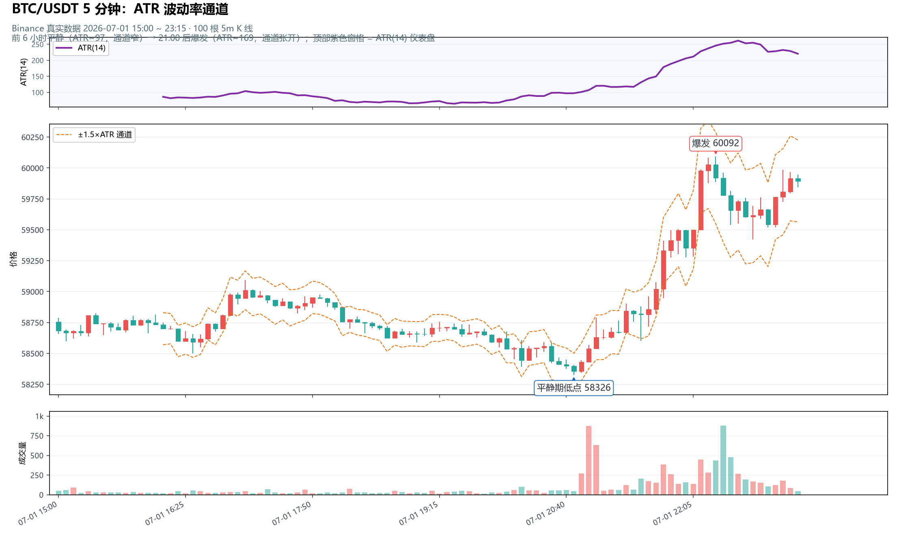

*图 6-2R 真实数据：ATR 波动率通道（数据源：Binance BTCUSDT 5m，2026-07-01 15:00 ~ 23:15，100 根）：通道宽度 = 波动率本身*

看图的三个要点：① **通道宽度在变**——15:00 到 20:45 的六个小时里通道明显收窄（ATR 只有 ~97，低波动期），21:00 之后通道骤然张开（ATR 升到 ~169，高波动期）；② **固定 50 点止损在不同位置的“真实含义”不同**——收窄时 50 点是通道的几倍宽（大止损，正常回调扫不掉你，但也说明你承受的波动风险大）；张开时 50 点可能只有通道的一半（小止损，一根正常波动 K 线就扫掉你）；③ **紫色 ATR 线是通道的“仪表盘”**——20:45 前它趴在地板上横着走，21:00 后它直线拉升，说明市场开始折腾，先别急着收紧止损；等它掉头向下说明市场重新安静，才可以收紧。回到本节开头的问题：止损该用多少点？不是固定的 50，是 k×ATR——因为 50 点本身没有意义，有意义的是“它等于几个 ATR”。

### 6.6 成本：点差、滑点与隔夜利息

这些是期望值的隐形扣减项：

- **点差/佣金**：每次进出场成本 = 点差 × 2（一进一出）。对低胜率高盈亏比系统影响小，对剥头皮是毁灭性的——这也是 prop 平台常把考核盘点差做差的原因（考核费收完了，你频繁交易它赚点差，双赢的是平台）。
- **滑点**：突破单和市价单在流动性差时段滑点大。限价单永不滑点——这是 pin bar 50% 位挂单法的隐藏优势（第 3.3 节）。
- **隔夜利息（swap）**：外汇持仓过夜有正负利息，考核期尽量避免“为持仓而持仓”。

**成本要算进期望值**：真实期望值 = 理论期望值 − 每笔平均成本。

算一笔账：假设每笔点差成本 1.5 pips（约 0.1R），一年做 300 笔，总成本 = 30R。如果你的系统年化期望值是 60R，成本就吃掉了 50%。**成本不是小事，它决定你的系统是真正还是勉强正**。第 8 章回测时必须扣掉成本，否则你验证的是一个不存在的系统。

### 6.7 凯利公式：为什么不能满仓凯利

凯利公式给出“理论最优”仓位：

```
f* = (b×p − q) / b
b = 盈亏比，p = 胜率，q = 1−p
```

**示例**：胜率 40%、盈亏比 2 → f* = (2×0.4 − 0.6)/2 = 10%。

看着很美，但实际没人用满凯利，三个原因：

1. **输入不准**：凯利假设你精确知道胜率和盈亏比。但你用 100 笔回测估计的值误差很大，输入不准，凯利仓位就错。
2. **波动巨大**：满凯利回撤极深，腰斩是常态，心态扛不住。
3. **破产风险**：高估胜率 + 满凯利 = 可能真的归零。

**实践用半凯利或四分之一凯利（f/2 或 f/4）**：大幅降低波动，保留大部分增长。凯利的数学性质：仓位在最优值的 1/4 到 1/2 之间时，增长率的损失很小，但回撤大幅缩小——“用 20% 的波动换 80% 的增长”。

而本书的 0.5% 风险远低于任何凯利值——因为考核期要的是生存，不是增长。**凯利的意义是告诉你仓位的“理论上限”，而你要做的是远离这个上限**。

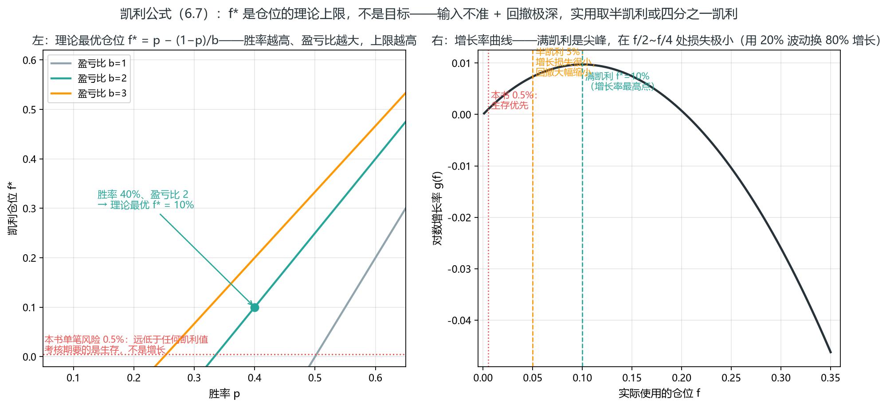

*图 6-5 凯利公式：左=f* 随胜率变化曲线族（盈亏比 1/2/3），40% 胜率 + 盈亏比 2 对应 f*=10%；右=对数增长率曲线，满凯利是尖峰，半凯利（5%）损失极小但波动大幅缩小*

左图三条线把“为什么没人用满凯利”画清楚了：盈亏比 2 时 40% 胜率对应的最优仓位只有 10%，且 f* 对胜率极度敏感——胜率从 40% 高估到 45%，f* 就从 10% 跳到 17.5%，输入误差被放大近一倍。右图则给出实践答案：增长率曲线在最优值附近是“缓坡”，从满凯利 10% 降到半凯利 5%，增长率几乎不掉，波动却减半——这就是“用 20% 的波动换 80% 的增长”的图形表达。

### 6.8 破产概率（Risk of Ruin）

破产概率 = 账户跌到爆仓线（考核总回撤线）的概率。它直观回答“我会不会死”。

**影响因素（每个都直接改变“允许连亏几次”）**：

- **胜率**：胜率越低，连亏越深，破产概率越高；
- **盈亏比**：盈亏比越高，一次盈利抵掉的亏损越多，恢复越快；
- **单笔风险**：0.5% vs 2%——直接决定允许连亏几次（见下面对比）；
- **爆仓线深度**：总回撤线 10% vs 5%，允许的连续亏损次数差一倍。

**对比**：

- 单笔风险 0.5%，总回撤线 10% → 允许连亏 20 次，破产概率趋近于零。
- 单笔风险 2%，总回撤线 10% → 只允许连亏 5 次，破产概率高。

**小仓位的本质，是把破产概率压到趋近于零**。连亏无法避免（6.3），但你可以让连亏“不致命”。

把这两个数字再读一遍：0.5% 风险 + 10% 回撤线 = 你有 20 次犯错预算；2% 风险 + 10% 回撤线 = 只有 5 次。40% 胜率系统在 100 笔里几乎必有一段 5 连亏——2% 风险的人，**平均每个“正常连亏”就有一次爆仓**；0.5% 风险的人，要 4 段 5 连亏连续叠加（概率极低）才出局。这就是“风险百分比”和“存活率”之间的指数关系：风险减半，存活率呈数量级提升。

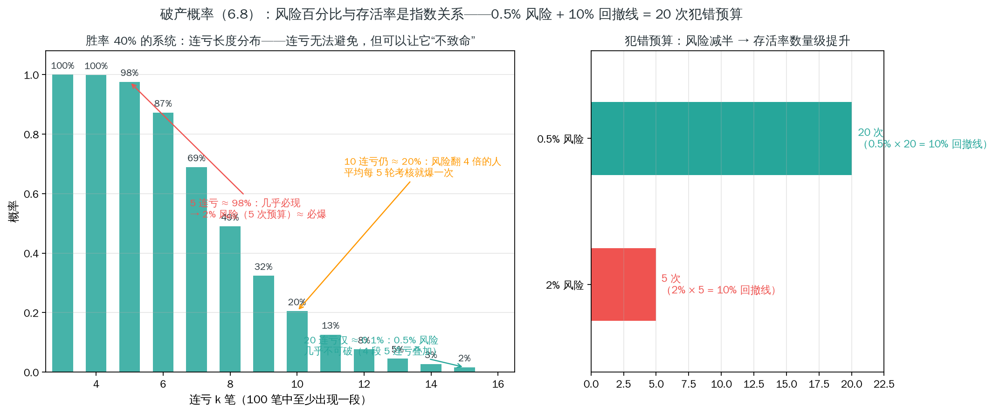

*图 6-6 破产概率：左=100 笔内至少出现一段 k 连亏的概率（40% 胜率）——5 连亏约 100%、10 连亏约 42%、20 连亏趋近于零；右=犯错预算对比，2% 风险只有 5 次，0.5% 风险有 20 次*

左图是“连亏必现”的量化证明：40% 胜率的系统做 100 笔，出现至少一段 5 连亏的概率几乎就是 100%——连亏不是“运气差”，是数学必然。但同一张图也给出出路：20 连亏的概率趋近于零，而 0.5% 风险正好允许 20 次连亏（10% 回撤线 ÷ 0.5%）。右图把两套方案并排：2% 风险的人 5 次就出局，0.5% 风险的人可以错 20 次——风险减半一次，存活率提高一个数量级。

### 6.9 复利与规模化

**复利**：权益增长后，同样的风险百分比对应的绝对金额变大。$100k 账户风险 0.5% = $500；涨到 $120k 后，风险 0.5% = $600。仓位自动随权益变大——这是“活得久”的红利，系统正确时权益滚雪球。

**注意**：保持风险百分比不变，不要手动加大风险。复利的引擎是“权益增长”，不是“你变大胆”。很多人赚了一波之后手动加风险——等于把复利引擎换成赌场老虎机。

**考核期不建议复利**：考核有固定目标，复利放大波动和不确定性，用固定风险稳定推进（第 9 章）更可靠。

**规模化**：从小账户到大账户，方法完全一样，只是绝对金额不同。别因为账户变大就改规则——规则是规模无关的。但有一个例外要警惕：账户变大后，同样的风险百分比绝对金额变大，**情绪压力也会变大**——$500 和 $5,000 的风险，心理重量完全不同。规模化之前，先确认你的执行在小金额下已经稳定（第 8 章门槛）。

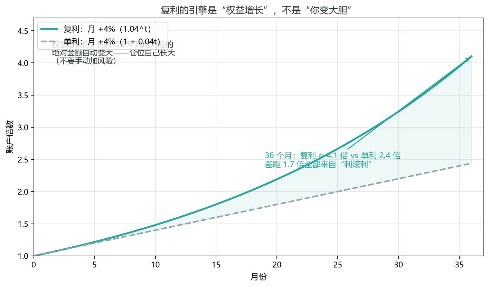

*图 6-7 复利 vs 单利：月收益 4%（年化约 60%）持续 36 个月——复利滚到约 4.1 倍，单利只有 2.4 倍，差距全在“利滚利”*

36 个月里复利曲线越到后面越陡——前半段它和单利几乎重合，真正的差距在后 12 个月集中兑现。这就是“活得久”的复利红利：系统期望值为正时，你不需要任何额外操作，权益自己滚雪球；而手动加大风险（单利式激进）恰恰破坏了这条曲线的起点。**复利的前提是 6.8 的存活率，先保证不爆仓，再让时间站在你这边**。

### 6.10 加仓：新手不宜，盈利才加

加仓是把双刃剑——用得好，它让利润奔跑（第 4 章海龟）；用得差，它是爆仓的加速器。Al Brooks 给加仓画了三条边界：

1. **新手不做**：加仓要求你能精确判断“前提仍然有效”，这是多年功底。新手加仓几乎总做错——最常见的错法是把“反转”当“回调”，在亏损头寸上越加越多（这正是第 7 章承诺升级的变体）。
2. **只加 1-2 次，且要有完整计划**：加几次、间隔多少、每次多大、什么时候退出——计划外的加仓叫摊平。Brooks 的原话：增加亏损头寸的前提是“前提有效 + 小头寸”，其余情况一律不加。
3. **浮亏不加，盈利才加**：加仓只发生在“突破继续、趋势确认”时——此时加仓并上移止损（跟踪止损保护已实现利润）。浮亏加仓（摊平）的数学是灾难：它把“小亏止损”变成“大亏套牢”，把概率游戏变成赌命。

**为什么盈利加仓在数学上成立**：浮亏加仓降低平均成本，但前提是“价格回来”——而价格不回来才是常态；盈利加仓恰恰相反：它在“趋势已被验证”之后才加大暴露，用已实现利润做缓冲。海龟的“每 0.5×ATR 加一单位、最多 4 个单位”就是盈利加仓的经典模板（第 4.9）。

**考核期结论**：完全不加仓（军规第 7 条）。考核账户的目标是活下来，加仓放大单笔波动。等你实盘稳定盈利后，再把“盈利加仓”写进规则书（次数、间隔、大小、退出四要素缺一不可）。

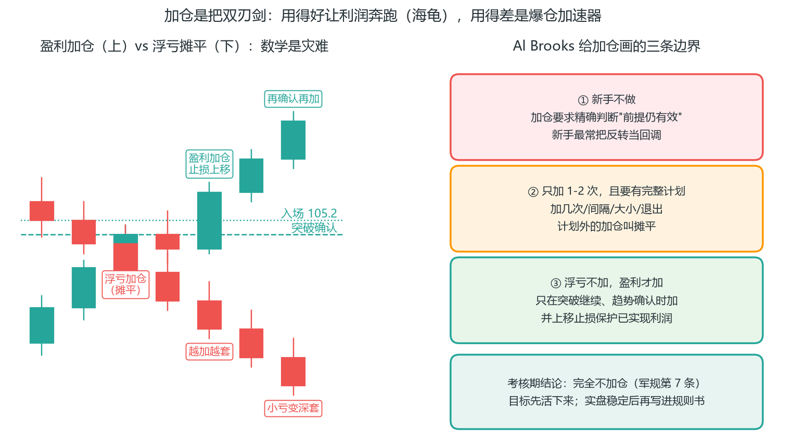

*图 6-8 加仓是把双刃剑：用得好让利润奔跑（海龟 4.9），用得差是爆仓加速器——考核期完全不加仓，实盘稳定后再写进规则书*

### 6.11 “我不在乎”的头寸规模：心理的仓位解

第 7 章会讲“需要确定性”是交易心理的根源，但心理问题往往有仓位解。Al Brooks 建议交易“**我不在乎**”的尺寸——**仓位小到“亏了也不影响你心情”**。

为什么有效？因为执行变形的根源是“这笔亏了会很痛”：怕痛 → 提前止盈；怕痛 → 止损犹豫；怕痛 → 报复加仓。当仓位小到“我不在乎”，这些情绪的燃料就消失了——你能更频繁地做“正确的事”（执行规则），而**执行一致本身就是最大的优势来源**。这不是“赚得少”，这是“先保证做得对”。Brooks 的原话精神：**如果你感到焦虑，先找原因——是不是仓位太大，或者在做逆势单**。焦虑是信号，不是性格缺陷。

一个具体建议：把你的常规仓位再减 50%-75% 作为“训练仓”——模拟期和考核前期尤其如此，等执行率稳定（第 8.7 门槛）再逐步放大。记住 6.9 的话：放大的是权益，不是胆量。

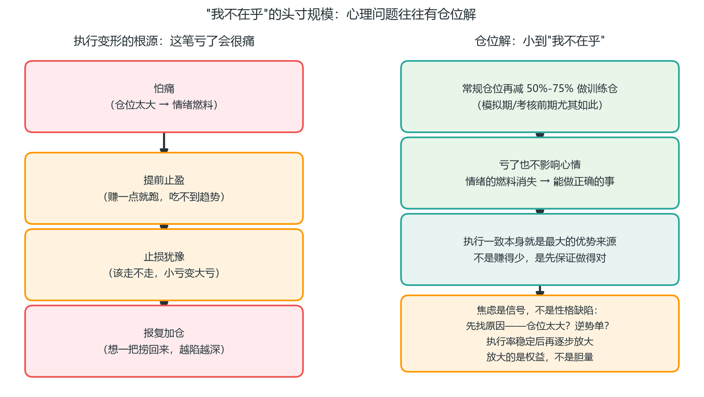

*图 6-9 “我不在乎”的头寸规模：焦虑是信号不是性格缺陷——先找原因（仓位太大？逆势单？）；执行率稳定后再逐步放大，放大的是权益不是胆量*

### 6.12 洛氏 3 手合约法：分批止盈的“成本先回”版

Joe Ross（第 2.9 洛氏霍克交易法）的仓位管理和他的结构一样机械——**每次入场固定 3 手合约，每手承担一个明确任务**：

1. **第 1 手：抵费用**——尽快获利平仓，抵补佣金和交易费（有时产生很小盈利）。
2. **第 2 手：赚成本**——浮盈抵补直接成本后平仓，获得与成本等额的盈利（对直接成本 100% 回报）。
3. **第 3 手：奔跑**——止损尽快移到盈亏平衡点（入市价），用跟踪止损跟随趋势，**绝不允许损失超出盈亏平衡点**。

洛氏对结果的预期非常坦率：**10 次交易里，7-8 次第 3 手在盈亏平衡点离场，只有 2-3 次获得巨大回报**——但正是这 2-3 次大回报，让整个系统期望值为正。

**与本书 4.14 分批止盈的对照**：两者同源——都先落袋一部分（洛氏是 1/3+1/3，本书是 1/2）、都用“保本”锁定剩余风险、都让最后一手奔跑。区别在“保本时机”：本书建议至少到 1R 再保本（4.16），洛氏要求“尽快”把第 3 手止损移到盈亏平衡——更激进，适合他自己的紧凑止损结构（Rh 入场），对本书读者，**以 4.16 为准**：信号质量高可提前，一般等到 1R。

**洛氏的硬纪律（可抄）**：

- **入市后没有立即（或很短时间内）开始盈利 → 退出**。入场逻辑错了，成本就是等来的。这是“时间止损”（4.17）的洛氏版，且比 4.17 的 5-8 根 K 线更严。
- **最小 2 手起步**：只能交易 1 手合约 = 把所有鸡蛋放一个篮子——每一笔都要同时负担“回本+盈利”双重任务，心态必然变形。洛氏直言“1 手的成功者很少，和赌博无异”。**对本书读者的现实翻译**：如果你只能用最小单位交易，那就把目标设为“先活下来练执行”，别期待单笔暴富。
- **视每笔交易为“一系列事件之一”，不是“全部直到终结”**：一笔做错马上撤，下一笔还在——交易是序列游戏（呼应第 7.1 概率思维）。

**考核期适用性**：3 手合约法是“多单位分仓”的一种，与 6.10 的“考核期不加仓”并不冲突——它不是加仓，而是入场时就规划好的分批出场。若平台允许，可以把 6.2 算出的仓位拆成 1:1:2 三份执行（保本到位的第三份再奔跑）；不允许多单的话，用 4.14 的单单分批（50%+50%）即可，思想相同。

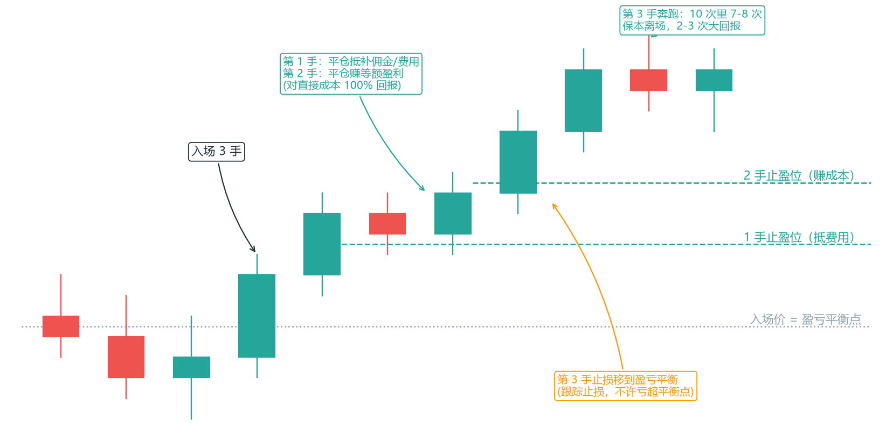

*图 6-10 洛氏 3 手合约：第 1 手抵费用、第 2 手赚成本、第 3 手保本后奔跑*

### 6.13 多策略资金分配：组合层的风险预算（进阶）

前面的仓位公式（6.2）解决“单笔下多少”。当你同时运行多个系统（4.3 趋势回调、4.4 区间、4.6 微通道、4.26 ORB…）时，出现新问题：**每笔 0.5% 风险，同时开三笔是不是 1.5%？**

答案：不是简单相加。组合层的原则有三条：

**1. 总风险预算封顶**：所有持仓的名义风险之和 ≤ 账户的 1.5-2%（考核期建议 ≤1.5%）。每笔 0.5% 是单笔上限，不是自动授权——同时挂 4 个单，总敞口超了就要砍。

**2. 相关性修正（呼应 1.14）**：同方向、高相关的持仓合并计算风险。做多 EURUSD + 做多 GBPUSD = 一笔“美元走弱”仓位，风险按 1% 算，不是两个 0.5%。用 DXY 或品种相关性表（第 8 章工具）在开盘前把“实际敞口”算清楚。

**3. 策略间对冲是免费的分散**：不同逻辑的系统天然互补——趋势系统（4.3/4.27）做多时，均值回归系统（4.4/4.28）往往在做空或空仓。两者同时持仓时，组合波动小于单策略，这是多策略最大的价值：**不是多赚钱，是平滑回撤**（呼应 6.3 连亏）。

**分配公式（风险预算制）**：

```
策略风险预算 = 总预算 × 策略权重
策略内单笔仓位 = 策略预算 ÷ 计划同时持仓笔数（按 6.2 公式换算手数）
```

**实例**：$50,000 账户，总预算 1.5% = $750。

| 策略 | 权重 | 预算 | 单笔 0.5% 默认 | 可同时持仓 |
| --- | --- | --- | --- | --- |
| 趋势回调（4.3） | 40% | $300 | $250 | 1 笔（或 2 笔×$125） |
| 区间边界（4.4） | 30% | $225 | $250 | 0-1 笔（单笔降为 $225） |
| 微通道（4.6） | 30% | $225 | $250 | 0-1 笔（单笔降为 $225） |

注意单笔“默认 0.5%”在预算制下可能被压小——这是对的：**预算制保护的正是“多个系统同时给信号”的极端日子**（趋势日往往三个系统同向触发）。

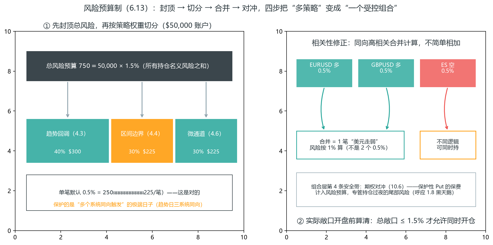

*图 6-11 风险预算制：总预算 $750 → 按策略权重切分（40/30/30）；同向高相关持仓合并计算；期权对冲是组合层第 4 条安全带（编者示意）*

（左）$50,000 账户先把总风险封顶（1.5% = $750），再按策略权重切分——趋势回调 $300、区间边界 $225、微通道 $225；单笔默认 0.5%（$250）在预算制下可能被压小到 $225，这是对的：预算制保护的正是一天内多个系统同时给信号的极端日子。（右）相关性修正：EURUSD 多 + GBPUSD 多合并为一笔“美元走弱”（风险按 1% 算，不是两个 0.5%），ES 空是不同逻辑可同时持；最后期权对冲（保护性 Put）作为组合层第 4 条安全带，保费计入预算（呼应 1.8 黑天鹅与 1.14 相关性）。

**与凯利公式的关系（呼应 6.7）**：多策略组合的总凯利分数 < 各策略凯利分数之和（相关性不为零）。保守做法：组合实际总风险 ≤ 0.5 × 总凯利分数——凯利告诉你上限，预算制告诉你怎么分。

**考核期 vs 通过后**：考核期坚持双红线——单笔 ≤0.5% 且总敞口 ≤1.5%；多策略分配是考核通过、账户进入稳定期后的管理工具。呼应 1.17：账户之间的配置（交易/配置账户）是最大的“多策略”，本节的预算制是它的账户内版本。

**组合层的第 4 个工具：期权对冲（进阶，学完第 10 章再看）**：6.13 的三条原则管“策略之间的钱”，期权对冲管“黑天鹅那一天的敞口”——保护性 Put（10.6 用途一）是组合里唯一的“负相关资产”：标的暴跌时它大涨，用一小笔保费抵消持仓的大幅回撤（呼应 1.8 黑天鹅与 1.14 相关性）。

- **保费计入风险预算**：买 Put 花的权利金就是这笔对冲的“名义风险”，从策略预算里扣，不能另开预算；
- **只对冲你有观点的大仓位**：浮盈趋势单（4.15 移动止损的仓位）才是对冲对象，短线小仓位不值得付保费；
- **与预算制分工**：预算制管理“多策略同向触发”的日常极端，期权对冲管理“持仓过夜的尾部风险”——两者是组合层的两条安全带（10.7 已把期权放回全书坐标）。

### 本章自测（答案在本节末尾）

1. 账户 1 万、止损距离 20 点、点值 $10/点、单笔风险 0.5%——仓位是多少手？
2. 为什么说“亏 50% 要赚 100% 才回本”？它直接推导出什么纪律？
3. 40% 胜率系统连亏 5 笔的概率大约多少？连亏时你应该做什么？
4. 同时开三笔各 0.5% 风险的单（EURUSD 多 + GBPUSD 多 + ES 空），总风险怎么算？为什么？
5. 胜率 40%、盈亏比 2，凯利公式的 f* 是多少？为什么实际只用半凯利或四分之一凯利？
6. 单笔风险 0.5% vs 2%（总回撤线都是 10%），犯错预算各多少次？这解释了哪条存活率规律？

**答案**：① 单笔风险 = 1 万 × 0.5% = $50，仓位 = $50 ÷ （20 点 × $10） = 0.25 手（6.2 公式）；② 回本不对称（6.1）——控制回撤优先于盈利，单笔风险 0.5% 就是为它服务的；③ 约 7.8%（图 7-2）——100 笔内几乎必然出现，连亏是正常分布不是系统坏了（6.3），继续按公式执行，不加仓不报复；④ 不是简单相加——先总风险封顶（名义风险 ≤ 账户 1.5-2%），同向高相关持仓（EURUSD+GBPUSD 本质是同一笔“美元走弱”）合并计算，不同逻辑的策略（趋势+均值回归）天然对冲才允许同时持（6.13）；⑤ f* = (2×0.4 − 0.6) ÷ 2 = 10%（图 6-5）——但满凯利输入不准即错、回撤极深，半凯利（5%）增长率几乎不掉而波动减半，考核期用 0.5% 更是远低于任何凯利值（6.7）；⑥ 0.5% → 10% ÷ 0.5% = 20 次；2% → 10% ÷ 2% = 5 次（图 6-6）——40% 胜率系统 100 笔里几乎必现一段 5 连亏，2% 风险的人平均每个“正常连亏”就爆仓一次，0.5% 风险的人要 4 段 5 连亏连续叠加才出局（概率极低）：风险减半，存活率呈数量级提升（6.8）。

### 本章小结：速查卡

**① 仓位才是圣杯**

- 决定长期结果的不是入场信号，是仓位管理——仓位才是真正的圣杯（Van Tharp）。
- 回本不对称：亏 50% 要赚 100% 回本——控制回撤优先于盈利。
- 考核期单笔风险 ≤0.5%：约束你的是“能亏几次”，重仓 = 加速出局。

**② 数字背下来**

- 连亏是必然：40% 胜率 100 笔里几乎必有 5 连亏，小仓位让你扛得过去。
- 宁可低胜率、高盈亏比：RR=2 只需 33% 胜率；交易者等式：奖励×胜率 > 风险×败率——90% 的行情概率在 40-60%，2 倍回报让它们数学上有利。
- 凯利只用半凯利以下；成本要扣进期望值。
- 止损距离与仓位是跷跷板：止损翻倍，仓位减半（20/40/80 点 → 满仓/半仓/四分之一仓）。

**③ 公式与流程**

- 仓位公式：先有止损距离，才有仓位大小；入场前算好，入场后不动。
- R 倍数 + 弹珠袋：系统是一袋弹珠，你控制每次押多少。
- 实际风险才是真成本：目标按“完美止损位”的 2 倍定；宽止损买的是前提兑现的时间，前提失效主动退出；入场即移盈亏平衡没有数学基础；止损被扫约 50% 是陷阱。

**④ 加仓与心态**

- 加仓：新手不宜、盈利才加、只加 1-2 次且要有计划；考核期完全不加。
- “我不在乎”的仓位是心理的仓位解——焦虑时先查仓位，再查方向。

下一章讲执行与心态——再好的系统和仓位，执行变形了也是零。
