# 第 7 章 执行与心态

> **阅读提示**：本章解决“怎么把正确的事重复做”——连亏连赚、三时刻流程、情绪与决策疲劳。建议读两遍：第一遍建立认知，实盘/考核前再读一遍，当检查单用。

本章解决一个问题：怎么对抗自己的人性弱点。系统给你正期望值，但执行变形了，一切归零。对策不是“我要冷静”，是流程化。

**为什么心态是最后的瓶颈**

方法（第 2-5 章）、仓位（第 6 章）、工具（第 8 章）都解决之后，唯一不可控的变量是你自己。

一个残酷的观察：**大多数考核失败的人，不是方法不行，而是执行变形**——重仓、报复、追单、扛单。这些都不是“技术问题”，是“人在真金白银压力下的本能反应”。

关键在于：**心态问题只在真钱下暴露**。模拟盘里你能完美执行，因为没有真实损失触发恐惧和贪婪。这就是为什么模拟→实盘的过渡是最大的一道坎。

所以本章不给“心灵鸡汤”，给一套工程化方法：**不靠意志力对抗人性，靠流程和规则把情绪的操作空间压缩到最小**。意志力是消耗品，流程不是。

### 7.1 概率思维 【核心】

Mark Douglas《交易心理分析》的核心，浓缩成三条：

1. **任何单笔交易都可能亏，哪怕信号完美**。你控制的是期望值，不是单笔结果。
2. **连续 5 笔亏损不是“系统坏了”，是正常分布**。40% 胜率系统连亏 5 笔概率不低（第 6 章算过）。用数据说话，别用情绪裁决。
3. **拒绝报复交易**。“这次一定要赚回来”是所有爆仓的起点。

**为什么“概率思维”这么难——Mark Douglas 的诊断**：Mark Douglas 在《Trading in the Zone》（中译《交易心理分析》）里给出了交易心理学最深刻的诊断。

他说，绝大多数人带着一个致命的心理习惯进入市场：**需要确定性**。

人在生活的大多数场景里靠“确定”活着——你确定太阳会升起、努力会有回报、按下开关灯会亮。这种“我需要知道接下来会发生什么”的本能，在日常生活中是生存优势。但市场恰恰是一个没有确定性的地方。当你带着“需要确定”的本能，进入一个“本质不确定”的环境，冲突就产生了：

- 你需要确定这笔会赚 → 但市场不给确定 → 你焦虑、犹豫、提前离场。
- 你无法接受这笔会亏 → 但亏损是必然的 → 你扛单、报复、崩溃。

**Douglas 的核心论断：交易的心理问题，不来自市场，而来自“你需要确定”与“市场不确定”之间的错配**。市场是中性的，它不知道也不在乎你的存在；你的痛苦来自你对行情的解读，而不是行情本身。

**解药：五个基本事实**。Douglas 给出的解法，是把下面五个事实内化到本能层面（不是“知道”，是“真的相信”）：

1. **任何事都可能发生**。再完美的信号，也可能因为一个你看不到的参与者、一条突发消息而失败。
2. **你不需要知道接下来会发生什么，也能赚钱**。这是最反直觉的一条。赚钱靠的是概率优势的重复，不是对单笔的预知。
3. **对任何定义了优势的系统，盈亏的分布是随机的**。即使系统长期胜率 60%，具体哪笔赢哪笔亏是随机散布的——你完全可能先连亏 5 笔。
4. **所谓“优势”，只是某件事发生的概率比另一件事高一点**。优势不是确定性，是概率的倾斜。
5. **市场里的每一刻都是独一无二的**。别让上一笔的情绪污染这一笔的判断。

当你真正内化这五条，奇妙的事发生：你不再需要每笔都对。亏损不再威胁你的信念（它本就在预期内），也不再威胁你的账户（仓位管理让它可控）。于是你能一致地执行——这正是第 8 章“执行率”的心理基础。

**利润也是不均匀的：80/20 定律**。除了单笔随机，利润的分布同样反直觉——多数正 R 来自少数交易：某几类 setup、某几个交易日贡献了大部分利润，其余交易只是“陪跑”（第 8.9 的 setup 归因就是它的实证：一类 setup 可能贡献 70%+ 利润，另一类看着热闹却是净亏损）。接受这个事实，你才不会在普通亏损笔上怀疑系统，也不会把时间浪费在“看起来活跃”的 setup 上。

**“新趋势比旧趋势更能代表现状”（Brooks）**：长程大背景与新近结构冲突时，最常见的错误是给新趋势贴一个“逆大格局的劣质信号”标签然后否决它——比如大背景空头（AIS）但近期刚走出多头尖峰。Brooks 的裁决原则很直白：**“新趋势比旧有趋势更能代表当前的现状”**。近期尖峰代表“市场现在正在做的事”，优先作交易方向；旧背景只降级为风险提示（上方阻力可能更实、关键价位更小心），不否决近期方向。市场惯性方向已经切换，“市场会继续做它刚刚在做的事”（呼应 4.7 状态机：每根 K 线收盘后重估状态，不恋战的也包括“不恋旧背景”）。这条原则防的是另一类“需要确定性”：用旧格局给自己一个“不用面对新方向”的理由。

**“区域”（The Zone）**：Douglas 把这种状态叫“区域”——你不再恐惧、犹豫、自我破坏，因为你彻底接受了交易是概率游戏。在“区域”里，执行规则不需要意志力——它变成自然反应。

这不是玄学，是前面所有章节的心理汇总：

- 第 6 章的仓位管理，让“单笔亏损可控”成为事实，你才敢真的接受“任何事都可能发生”。
- 第 8 章的验证，让你“真的相信”系统有优势，而不是将信将疑。
- 本章的流程化，把执行从“情绪时刻”移到“冷静时刻”。

**当仓位、验证、流程都到位，概率思维才不是口号，而是你能真正进入的状态**。这就是为什么心态章放在仓位和验证之后——没有它们兜底，“接受不确定性”只是一句空话。

**心理成熟的三个阶段**：

1. **结果导向（新手）**：用单笔盈亏判断对错。赚了觉得自己是天才，亏了觉得系统骗人。
2. **规则导向（进阶）**：开始按规则执行，但还盯着每笔结果，情绪随盈亏起伏。
3. **概率导向（成熟）**：关注“是否一致执行了正期望值系统”，单笔结果不再牵动情绪。看的是 100 笔的分布，不是这一笔。

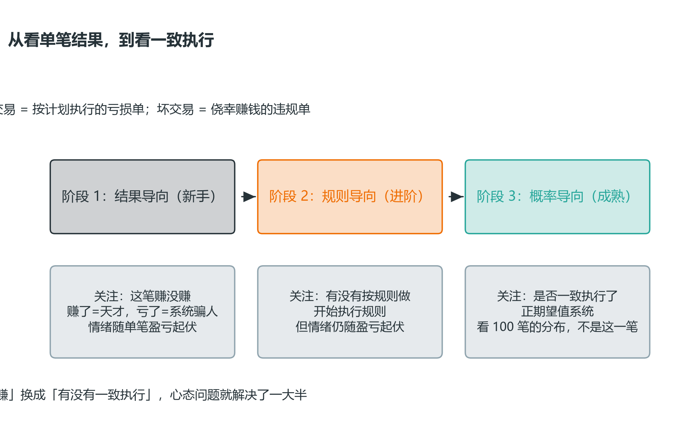

*图 7-1 心理成熟三阶段：结果导向 → 规则导向 → 概率导向，评价标准从“赚没赚”换成“有没有一致执行”*

**好交易 / 坏交易的重新定义——这是观念的分水岭**：

- 一笔按计划执行的亏损单 = 好交易（你做了对的事，亏损是概率的一部分）。
- 一笔侥幸赚钱的违规单 = 坏交易（它强化了你的坏习惯，下次会亏更多）。

评价标准从“赚没赚”换成“有没有一致执行”，心态问题就解决了一大半。

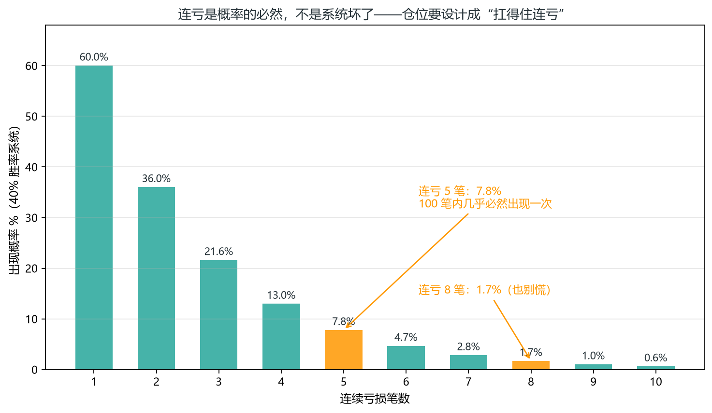

*图 7-2 连亏概率分布：40% 胜率系统连亏 5 笔概率 7.8%，100 笔内几乎必然出现*

**四种核心思维（Brooks/PA）**——把价格行为体系的思维方式浓缩成四条，与 Douglas 的概率思维互补：

1. **频谱思维**：市场状态是连续频谱（尖峰 → 通道 → 宽通道 → 区间 → 极端区间），不是二元的“趋势/区间”——每根 K 线收盘后都问“现在处于频谱何处”（呼应 4.7 判定树、2.10 逐棒检查单第 ③ 步）。
2. **概率思维**：趋势中多数反转失败；区间中多数突破失败——两个方向的“多数”决定了顺势与等测试的操作底色。
3. **惯性思维**：默认趋势延续；**反转必须同时满足“趋势线突破 + 极点测试失败”**（呼应 3.9 楔形反转、4.23）。
4. **嵌套思维**：长程结构窗口定方向偏好，即时信号窗口定入场——冲突时以近期为准，长程只作风险提示（呼应 4.7 的 MTF）。

**关键概率锚点速查表**（Brooks 体系）——这些数字是“默认延续”的数量支撑。**整张表只要求记住 3 个 ★**，其余是参考数据，用到再翻：

| 情境 | 概率 | 操作含义 |
| --- | --- | --- |
| ★ 区间突破 | 约 80% 失败 | 突破不追，等测试 |
| ★ 一般反转尝试 | 约 80% 失败变旗形 | 逆势反转仅诊断 |
| ★ 90% 的 K 线，下一笔胜率在 40-60% | 只有 10% 的 K 线强势突破 | 盈亏比 ≥ 2 是数学底线（40-60 规则，第 6.4） |
| 完整 MTR（主要趋势反转，四组件齐全，定义见 3.9） | 成功率仅 35-40% | 即使齐全也只诊断、不下单 |
| 尖峰之后 | 60% 转通道 / 30% 进区间 / 10% 反转 | 优先做回撤顺势 |
| 区间有效突破 | 约 60% 可达 MM | MM 作 TP2 候选 |
| 强趋势 leg 顺势延续 | 约 70%+ 可达 MM | 顺势目标可靠 |
| 反转 K 线变波段 | 仅 40% 走得够远，20% 形成反向趋势 | 反转单必须靠盈亏比取胜 |
| H2/L2 vs H1/L1 | H2/L2 更优 | 顺势回撤场景优先 H2 |

**概率锚点的元规则（Brooks）**：对**大多数普通 K 线和一般信号**，无论你多么相信市场会做什么反应，**在 40% 的情况下它都会做出完全相反的反应**——这条“元概率”给整张速查表兜底：任何一条锚点（80% 突破失败、40% 反转成功）都不是“一定会发生”，而是“多数时候如此”；正因为有 40% 的相反情况，每一笔都必须挂止损、用盈亏比而不是确信度取胜（呼应 6.4 期望值、7.6 军规——第 1 条把风险锁在 0.5%，止损单是它的执行载体）。**确信度越高，越要提醒自己：还有 40% 你错。**

**60% 就是上限（Brooks）**：对**大多数普通 K 线和一般信号**，单笔交易的确定性很少超过 60%——“永远不会超过 60% 的确定性，不要被 40% 的赔率所麻痹，60% 就是能得到最好的”。这不与少数强结构矛盾：强趋势/强突破（如 4.6 微通道最强形态）可到 70-90% 胜率，但这类 K 线只占少数，且仍要靠止损和盈亏比兜住剩下的失败概率——不存在“这次特别有把握所以可以不设防”的交易；看懂 60% 上限，就不会在信号稍强时把仓位加到超出计划。

**陷阱总表（Brooks 9 条 + Ali 条目融合，按“陷阱发生在哪个环节”分四组；B=Brooks，A=Ali）**：

所有陷阱的共同机制只有一个：**被套者的止损/限价单成为反向燃料**——有人追进去、被套住、被迫离场，他们的离场又推动价格反向。下面四组只是这个机制发生在突破、反转、背景、信号棒四个不同环节的具体样子。

**总规律（Ali，卡片 577）**：每当某件事看起来好得令人难以置信、明显到每个人都想进场时，它很可能不是真的——TRD 中的大多数突破尝试/设置都是陷阱。反过来也有可乘之机：当买方线和卖方线都被困住时，无论进还是出，下一个信号通常至少对剥头皮有好处。

**① 突破与追单——信号触发瞬间**：

- **区间追普通突破**（B）——区间内突破十有八九是假，别追。
- **快速大突破**（A，Fast & Big BO）——市场以意想不到的方式快速移动时，突破方向出现双形态的概率很高，别追第一波。
- **单柱意外突破**（A）——温和突破仍具意外柱特征，高概率买入信号失效时会捕获多头。
- **TRI 三重 BO**（A）——TR 的 FBO 有时突然发生且市场快速走一大段（呼应 3.9 TRI）。
- **初始 BO 半数失败**（A）——初始突破大约 50% 的时间失败并困住早期交易者；TRI 的突破需要 FT（跟进）才能成真（呼应 3.9 TRI）。
- **单柱突破未获跟进**（A，One-Bar BO）——一根未能获得跟进的大 Bar 突破、长影收于端点附近，会困住交易者，且通常以第二条腿的形式出现。
- **趋势末端大柱线**（A）——趋势或突破的最后阶段突然出现大柱线，是耗尽（EG）与不可持续的抛物线移动，会困住趋势交易者并迅速反转（反转幅度可与形成一样剧烈）。
- **Bar 60 陷阱**（A）——每日陷阱时段约下午 1 点至 2:30（对应第 42 至 60 根 K 线），美东约 14:30 附近市场常设下反转陷阱（呼应 4.7 的 14:30 反转陷阱）。
- **末端三推/楔形反转时追顺势**（B）——应 wait，仅诊断。

**② 反转与失效——信号失败时**：

- **尖峰中做反转**（B）——尖峰无结构，反转是猜。
- **单 K 线当反转**（B）——单根 K 线不构成反转证据。
- **惊喜柱**（A，Surprise Bar）——低概率事件总让交易者陷入困境，预计第一根 PB 后出现同方向第二腿。
- **高概率信号失效**（A）——失败的高概率形态通常在触发后随即失效；技术上失败的买入信号棒跌破自身低点 = 反向卖出信号。
- **未触发止损的失败设置**（A）——一个漂亮的（反转）设置，不触发止损入场就失败，正是陷阱渴望的早期限价单交易者。
- **失败信号 = 反向机会**（A）——设置失败时，通常为反方向创建极好设置。
- **失败的陷阱是力量的象征**（A）——陷阱触发失败说明被套方力量强，反向信号可靠。

**③ 结构与时机——背景判断**：

- **忽略嵌套窗口**（B）——只看当前周期，看不见大背景里的反转。
- **任何逆势入场**（B）——逆 always-in 方向，先赢后输。
- **高潮后追原方向**（B）——高潮 K 线是衰竭，不是加速。
- **极端区间强行交易**（B）——铁丝网里找信号，全是噪音。
- **二次入场陷阱**（A）——市场允许二次入场者以比首次更好的价格进场时，极可能形成陷阱（迟入场者需要更严格的入场条件）。
- **TTR 顶/底买卖设置**（A）——靠近 TTR 顶部的买入设置、靠近 TTR 底部的卖出设置通常是陷阱（TTR 顶底是自然的反转磁力位）。
- **较低时间框架收盘陷阱**（A）——5 分钟柱线的最后 1 分钟或 60 分钟柱线的最后 5 分钟，常发生戏剧性走势来改变更高时间框架柱线的外观，从而诱捕交易者。

**④ 信号质量——信号棒本身**：

- **止损贴噪音**（B）——止损放在正常波动内，必被打。
- **不规则图案**（A）——信号柱/形态看起来不对劲，说明反向力量较强，失败概率更高。
- **信号条异常**（A）——趋势日/低成交量窄幅日里信号条常显得疲软或反常强劲，是买卖双方争夺控制权所致。
- **1-Tick 失败**（A）——未能达到利润目标（如 5TF）是可靠迹象，表明市场要走另一条路。
- **STF 剥头皮陷阱**（A，Scalp Trap Failure）——剥头皮设置在达到足以让头皮获利之前反转，困住那些头皮，并且通常反方向具有突破（例如 ES 中的 5、9 和 17 Tick 失败）。

**陷阱自检三问（Ali）**：谁被套牢了？LIM 订单在哪里成交？市场是否给了被套交易者保本退出的机会？——回答不了这三问，先别交易反转。

例外：尖峰级突破区间可评估顺主方向回踩；微型通道第一次突破失败后顺主方向入场。

### 7.2 行为金融：人会犯的七个错误 【核心】

这些不是“心态不好”，是人类大脑的出厂设置（有实验依据）。每个给出自诊断信号和对策。

**1. 损失厌恶（Kahneman & Tversky, 1979）**：亏 $100 的痛苦 ≈ 赚 $200 的快乐。

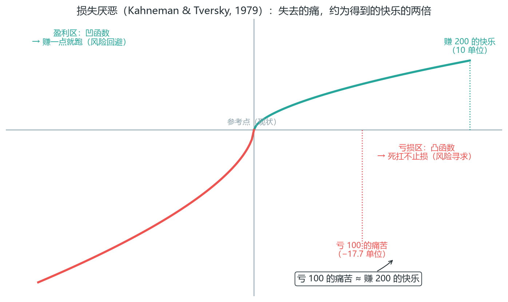

*图 7-3 损失厌恶价值函数：亏损区凸而陡（死扛不止损），盈利区凹而缓（赚一点就跑）*

- 场景：浮亏 2R 还想着“再等等就回来了”，扛到爆仓。
- 自诊断：你迟迟不止损，心里在“祈祷”而不是“判断”。
- 对策：入场即挂止损单，让机器执行，不给临场反悔机会。

**价值函数怎么解释处置效应**：同一张图也解释了 7.2 的处置效应——盈利区是凹的（赚 100 的快乐增量 < 赚 50 的快乐增量的两倍），所以“落袋为安”在心理上很爽；亏损区是凸的（亏得越多，边际痛苦增量越小），所以“再扛扛”在心理上越来越容易。**你的大脑不是在保护账户，是在逃避情绪**——止损单的作用就是把决策从“感觉”手里夺回来。

**2. 处置效应（Shefrin & Statman, 1985）**：盈利单卖太早、亏损单拿太久——为了“不承认错了”。

- 场景：赚 1R 赶紧落袋，亏 3R 死扛。
- 自诊断：你的平均盈利 < 平均亏损（盈亏比倒挂）。
- 对策：用第 4 章分批止盈+移动止损，机械地让利润奔跑，不靠主观。

图 7-3 画的是处置效应的心理机制，这一张给它配上真实数据的镜像——同一批 82 笔真实回测（与图 8-1R 同一序列，见 8.2）里，机械规则系统是怎么处理持仓时长的。

*图 7-1R 真实数据：规则系统的持仓时长——赢单平均 8.4h vs 亏单 4.3h（≈2 倍），处置效应的镜像（数据源：Binance BTCUSDT 5m K 线重采样 1H 逐笔回测记录）*

**这张图要读出三件事**：

1. **规则系统没有处置效应，持仓时长就是证据**——赢单平均持仓 8.4h ≈ 亏单 4.3h 的 2 倍：机械出场（分批止盈+移动止损）把"让利润奔跑"变成了持仓时长的事实；处置效应（赚 1R 就跑、亏 3R 死扛）是它的镜像——方向完全相反。
2. **差距在尾部，不在大多数**——中位数都是 2h（82 笔里 60 笔在 5h 内快进快出），赢单均值是靠 3 笔长持仓（103h/38h/23h）拉起来的：+2.85R 大单拿了 4 天 = 赢单总利润的 21%，前 3 大赢单 = 45%——利润是少数"拿得住"的交易给的（呼应 7.1 利润不均匀 / 8.9 setup 归因）。
3. **这是你的自诊断镜子**——7.2 说处置效应的自诊断是"平均盈利 < 平均亏损（盈亏比倒挂）"：真实系统平均赢 +0.41R / 平均亏 −0.44R（0.94 倍，系统本身期望为负）；如果你自己的日志里"赢单持仓时长 < 亏单持仓时长"，就是处置效应在偷你的盈亏比——入场即挂止损（军规第 1 条：0.5% 风险 + 止损单执行）、盈利后用移动止损推保护（军规第 6 条），是唯一对抗办法（呼应 7.6 军规第 1/6 条）。

**3. 近因偏差**：连亏觉得“该我赢了”（赌徒谬误），连赚觉得“悟了”（过度自信）。

- 场景：连亏后加倍仓位想一把回本。
- 自诊断：你的仓位随最近的盈亏变化（而不是按公式）。
- 对策：仓位永远按第 6 章公式算，与最近结果无关。

**4. 确认偏差**：只找支持自己方向的证据。

- 场景：做多后只盯着看涨的 OB，无视已跌破的 HL。
- 自诊断：入场后你画的线比入场前多。
- 对策：入场前写下理由和失效条件，复盘时对照；SMC 叙事最容易在这里骗你。

**5. FOMO（错失恐惧）**：行情大涨追高，位置最差、止损最大。

- 场景：看到大阳线怕错过，追在最高点。
- 自诊断：你入场时信号已经走完了大半。
- 对策：错过就错过（军规第 8 条），市场永远有下一个机会。

**6. 锚定**：被入场价困住——“回到成本价就走”，而不是看结构。

- 场景：该止损时想着“等回本再走”。
- 自诊断：你的出场依据是“我的成本”，不是“市场结构”。
- 对策：出场只看结构和目标，忘掉成本价。

**7. 承诺升级**：亏损后加仓摊平，把“止损单”变成“加仓单”。

- 场景：亏了不甘心，越跌越买。
- 自诊断：你在亏损仓位上加钱。
- 对策：军规第 7 条：不浮亏加仓。加仓只在盈利时（海龟式，第 4 章），且考核期完全不加。

**总对策：不是“我要冷静”，是流程化**——止损挂好、计划外不做、每笔写理由。把决策从“情绪时刻”移到“冷静时刻”。

上面七个错误是抽象机制，这张图把它们放到一个真实下跌日里——**每个错误都有一个位置，提前知道“我会在哪一步犯错”，就能提前把对策挂在那里**：

*图 7-2R 真实数据：心态错误的地图——一个真实下跌日里，七个错误的位置（数据源：Binance BTCUSDT 5m K 线）*

读法：跟着 07-13 这一天走一遍（前收 64176，日高 64425，日低 62101，收 62618，-2.43%）——① **08:15 放量冲高 64425**：接近前高 64464，放量上攻“看起来要突破”——FOMO（错误 5）在这里追多；② **08:40 放量下杀 63568**：突破失败确认，止损信号已经出现——损失厌恶（错误 1）让你“再等等就回来了”，把 -1.3% 的小亏扛成大亏；③ **09:00-14:00 阴跌 700 点**：确认偏差（错误 4）让你只找支撑证据，无视步步走低的高点；④ **15:30 反抽 63207 无力**：锚定（错误 6）“回到成本价 64425 就走”——反抽不到成本价，继续扛；处置效应（错误 2）让你割在反抽高点而不是破位点；⑤ **20:45 跌破前低**：近因偏差（错误 3）“跌这么多该反弹了”抄底；⑥ **21:40 越跌越买摊平**：承诺升级（错误 7），一路跌一路加，仓位在最低点附近最重；⑦ **22:15 恐慌最低 62101**：较日高 -3.6%——要么割肉在最低点，要么扛到第二天继续折磨。

**这张图要读出三件事**：

1. **错误不是“心态差”，是有位置的**——FOMO 出现在放量冲高（08:15）、损失厌恶+确认偏差出现在破位后的阴跌（09:00-14:00）、锚定+处置效应出现在反抽（15:30）、近因偏差出现在“跌了很多”（20:45）、承诺升级出现在恐慌段（21:40）——每个错误对应行情的一个阶段；提前知道“我会在哪一步犯错”= 提前把对策挂在那里（入场即挂止损、只做计划内信号、错过不追、浮亏不加仓，呼应 7.6 军规第 1/4/7/8 条）。
2. **一天可以犯完七个错误，账户从 64425 扛到 62101（-3.6%）**——追高 → 破位不走 → 阴跌找支撑 → 等回本 → 抄底 → 摊平 → 恐慌割肉是一条完整的自毁链；正确动作只有一个：**08:40 破位确认就走（-1.3%）**，后面所有波动都是噪音（呼应 7.1 概率思维 / 6.5 止损不是对错裁判）。
3. **这张图是自诊断**——读图时标出“我在哪一步会犯错”（比如“我肯定会在 08:15 追高”），那就是你的规则书必须写死的点；对照 7.2 七个错误的对策：止损挂好、计划外不做、每笔写理由——流程化不是消灭情绪，是让情绪没有操作空间。

**怎么把这张图变成规则**：破位确认（收盘跌破放量冲高起点/前低）→ 无条件离场，不抄底不摊平；恐慌高潮（V 达到常态 10 倍以上、保守下限 8 倍；实盘案例常见 20-30 倍 + 长下影 + 收回）才是反向信号（呼应 2-4R），但那是新交易，不是解套的借口。

### 7.3 交易流程：三个时刻 【核心】

把交易拆成三个时刻，每个时刻做固定的事——仪式化压缩情绪的操作空间。

**开盘前（冷静时刻，做计划）**：

1. 查经济日历，标出今天的数据炸弹（第 1 章）。
2. 画出今天的结构：HTF 方向、关键位、流动性池。
3. 写下今天的计划：做什么品种、什么 setup、风险预算多少。
4. 确认状态：睡眠/情绪不好 → 今天降低风险预算或不交易。

**开盘统计：先知道今天大概率是什么日子（Al Brooks 的参考）**：开盘前建立预期，但不预测——用统计给今天的“剧本”：

- **约 50% 的开盘强势走势会反转**（开盘 1-2 小时的趋势，有半数走不完一天）；
- **约 80% 的交易日至少出现一次小反转（5-10 棒），50% 出现一次大反转**——所以开盘方向被打破是常态，不是意外；
- **当天高低点**：约 50% 在第 7 根 5 分钟棒（开盘约 35 分钟）之前已经出现，第一小时末约 80%，18 棒约 90%（同 4.7 的 50% → 80% → 90% 链条）；
- **约 90% 的交易日，第一段波段交易在前 90 分钟（18 根 5 分钟棒）内开始**——但其中约 50% 会失败，随后走出相反的波段（呼应上一条“50% 开盘走势反转”：开盘方向往往只是第一段波段的试探，前 90 分钟“开波”不等于“成波”）；
- 开盘区间需要 5-20 根棒才明朗——开盘 20 分钟内画的“区间”不算数。

把这些数字写进规则书的效果：开盘冲高时你不会追（因为 50% 会反转）；开盘方向被打破时你不会慌（因为 80% 都会发生）。**统计不是预测，是让情绪对“常见剧本”脱敏**。

**盘中（执行时刻，只执行）**：

1. 按 checklist 逐条打勾再入场（第 4 章六要素）。
2. 不看浮动盈亏，只看“是否符合计划”。
3. 连亏 2 笔 → 强制休息（军规第 2 条）。
4. 不临场改止损、改仓位、改目标。

**时段策略（Brooks 的日内时钟）**：不同时段，市场的“性格”不同，计划也随之调整：

- **开盘（前 1-2 小时）**：波动最大、突破失败率最高（第 3.11 的数据：9:30-10:05 突破失败 > 70%）。主要做开盘反转/趋势确认，不做追突破。
- **日中**：趋势日的主要交易时段（10:10 之后分批入场胜率更好）；震荡日则是区间刮头皮（BLSHS）的时段。
- **日终**：寻找“突破或交易区间”，而不是通道；Brooks 的统计，尾盘反复反转主导，**最后 1-2 小时不交易完全可以**。若要做日内最后一段，BTC/STC（Brooks 术语：Breakout Test of Channel / Successful Test of Channel，通道突破测试——注意与 4.7 里 Ali 的“BTC/STC 收盘价买入/卖出系统”是同名不同物）类 setup 的最佳开始时间是美东 12:00-12:35；日线图上的支撑阻力是尾盘的“磁力位”——价格常被吸向它们。
- **收盘前的 TTR**：尾盘形成的紧窄区间是限价单市场，别在里面追突破。

**盘中执行的三个细节（Ali）**：盘中真正要防的不是“不会看盘”，而是“把决策从规则拉回情绪”。下面三条分别对应三种情绪入口——信号不完整、价格比你预期快、走势让你惊讶：

- **不完整的信号 = 不做（IOS）**：买入设置有效但还需要更多 K 线，而最后一根 K 线始终没出现（如等 3 根连续看涨 K 线，结果出现两个连续十字星）——不要买。等三根 K 线完整出现，在概率较高时晚些进入。
- **完美的信号 K 线后，改用限价单**：完美的信号 K 线后通常跟进表现不佳——市价追单容易触发“止损单进场就反转”（STF，Stop Trap Failure，止损陷阱；注意与 7.1 的 STF“Scalp Trap Failure，剥头皮陷阱”同名不同物）。考虑在信号 K 线极点下方/上方用限价单入场（价格来找你，而不是你去追它）。
- **感到惊讶就撤单**：如果对 K 线的大小、速度和力度感到惊讶——撤出你的订单；已入场则立即点击反向或快速平仓。惊讶 = 市场正在做你没预期的事，别在惊讶中持仓。

**收盘后（复盘时刻，做记录）**：

1. 记录每笔交易（含心理状态，见 7.5）。
2. 统计今天的执行率。
3. 只深入复盘一笔（最典型的对/错单），不贪多。

**为什么有效**：所有重大决策（计划、复盘）都在冷静时刻做，盘中只剩执行。情绪最容易捣乱的“盘中时刻”，被规则框死了。

**三个时刻的边界要物理化**：计划写在纸上/文档里（不是脑子里）；盘中不打开新闻和社交软件；复盘用固定模板（第 8 章）。边界越硬，情绪越没有操作空间。很多人失败不是因为计划不对，而是“计划在脑子里”——脑子里的计划，情绪一上来就删了。

**三个时刻的总览**：

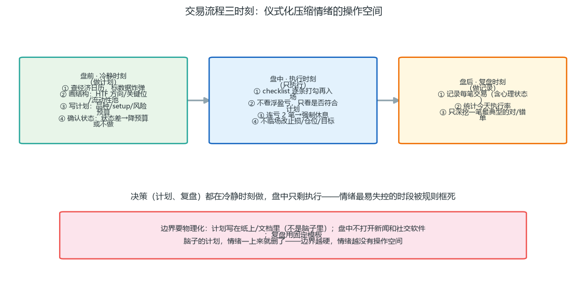

*图 7-4 三时刻流程：重决策在冷静时刻完成，盘中只剩执行——情绪最活跃的时段被规则占满*

看图理解这套设计的本质：**三个时刻的功能不同，节奏不同**——盘前是“慢”（写计划、查日历，越细越好）；盘中是“快”（照单执行，越机械越好）；盘后是“深”（只复盘一笔，挖透心理）。为什么中间要“物理化”边界？因为人脑的切换成本很高：盘中突然开始思考“今天到底该不该做”，思考本身就会带来情绪；把决策提前做完，盘中就只剩“勾选-执行-记录”的机械动作，情绪没有入口。

### 7.4 连亏与连赚：两个危险时刻 【核心】

**连亏期（必然到来，第 6 章算过概率）**：

- 首先确认：这是系统的正常连亏，还是市场结构变了？
- 判断方法：连亏的单是否都符合计划？如果都符合，是正常连亏；如果你开始违规，是执行问题。
- 正常连亏的应对：不改系统、可以降风险预算、可以暂停一天复盘。最忌“改规则”和“加倍”。
- 危险信号：你开始怀疑系统、想换方法、想加仓回本——这些念头出现时，强制停手。

**“最可能连亏多少次”——先给自己一个预期表（1000 笔样本）**：连亏不是“会不会来”的问题，是“最长会到几连亏”的问题。用马尔可夫链精确算过（胜率 = 单笔盈利概率，1 − 胜率 = 单笔亏损概率）：

| 系统胜率 | 单笔亏损概率 | 最可能的最长连亏（50% 概率会突破） | 极端最长连亏（10% 概率会突破） | 1000 笔内出现 ≥5 连亏 |
| --- | --- | --- | --- | --- |
| 25%（低胜率高盈亏比） | 75% | 约 20-21 次 | 约 27 次以上 | 几乎必然 |
| 40%（波段典型） | 60% | 约 12-13 次 | 约 16-17 次 | 几乎必然 |
| 50% | 50% | 约 9-10 次 | 约 12-13 次 | 几乎必然 |
| 60% | 40% | 约 8 次 | 约 9-10 次 | 几乎必然 |

读法：一个 40% 胜率的系统，跑 1000 笔，**最长的一串连亏大概率（50%）会到 12-13 笔**，偶尔（10%）到 16-17 笔——这不是系统坏了，是随机分布的必然。所以：① 别用“5 连亏”当系统崩溃的判据，它只是起点；② 仓位公式（第 6.2）必须能扛住“最可能连亏”，否则你会在概率兑现之前出局；③ 如果你第 8 笔连亏就怀疑系统，说明你对自己的系统缺乏概率预期——把这张表抄进规则书。

**连赚期（比连亏更危险）**：

- 连赚会催生过度自信和仓位膨胀——“我悟了”“可以下大点了”。
- 应对：维持原仓位、原风险，不因连赚加码。连赚是概率的馈赠，不是你变强了。
- 危险信号：你开始做计划外的单、觉得规则“太保守”——这时最该警惕。

**一句话**：连亏考验你的纪律，连赚考验你的清醒。两者都会过去，别让任何一个改变你的规则。

**连亏期的一个实操细节**：如果连续亏损让你开始“想证明自己”，主动降风险预算（比如 0.5% → 0.25%）而不是彻底离场——保持执行，但缩小伤害。完全离场会破坏节奏感，缩量继续则既保护账户又保持手感。等心态平复，恢复原风险。**注意与军规第 2 条的分工，两者不矛盾**：军规 2 管“当天”（当天连亏 2 笔 → 当天收工，不给第 3 笔报复的机会）；这里管“连亏跨天的那几天”（次日起按降低后的预算继续）。顺序是：先收工，明天再缩量继续。

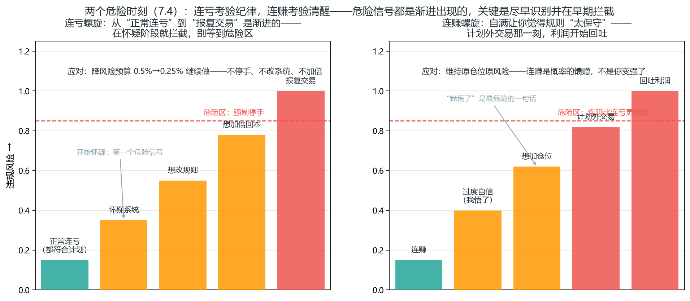

*图 7-5 两个危险时刻：左=连亏螺旋（正常连亏→怀疑系统→想改规则→想加倍回本→报复交易），违规风险逐级升级，危险区强制停手；右=连赚螺旋（连赚→过度自信→想加仓位→计划外交易→回吐利润）——应对都在底部：降预算、维持原仓位*

两个螺旋的共同点：**危险信号是渐进出现的，没有一个交易日是“突然失控”的**。连亏时你在“怀疑系统”阶段就该拦截（第 6 章的数学已经告诉你连亏必现，不需要怀疑）；连赚时“我悟了”这个念头本身就是最危险的一句话——它是概率的馈赠，不是能力的提升。把这张图贴在屏幕边：只要发现自己滑到第二、三格，就回到底部应对框执行。**拦截得越早，动作越轻**。

**上面的概率表不是吓唬人——真实回测长这样**。用图 8-1R 那 82 笔真实记录（40% 胜率）数一遍连亏段：最长 6 连亏（第 77-82 笔）、≥3 连亏出现了 8 段——而理论预期是多少？40% 胜率跑 82 笔，≥3 连亏段的期望是 7.0 段，真实数据精确落在上面；最长连亏 ≥6 的概率是 80.5%——**6 连亏不是系统坏了，是 40% 胜率下 82 笔样本里大概率会出现的正常分布**。

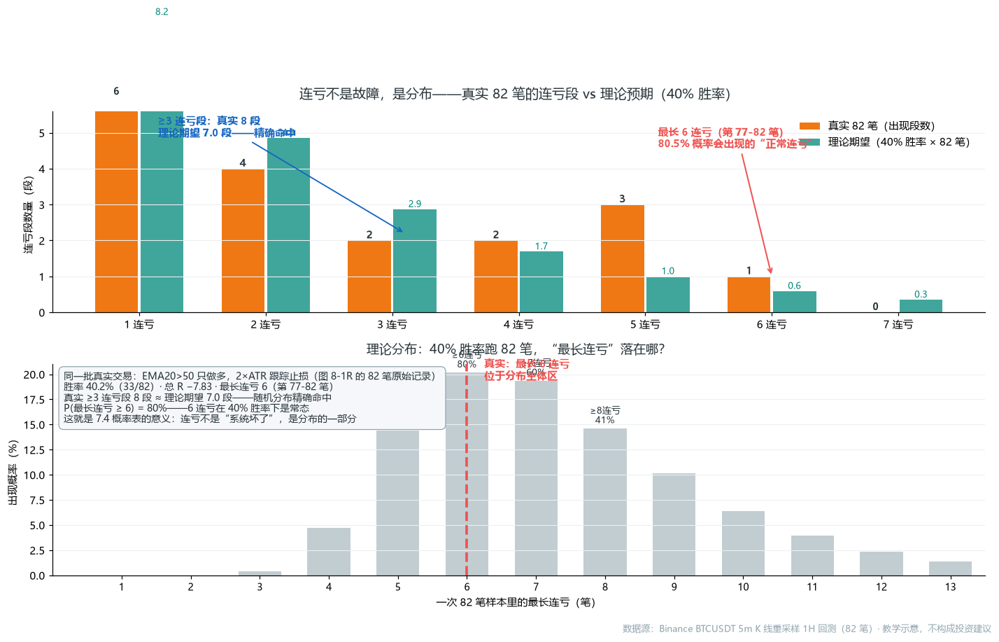

*图 7-3R 真实数据：连亏不是故障，是分布——理论期望（青）与真实出现段数（橙）逐段对齐；最长 6 连亏（第 77-82 笔）位于 40% 胜率 82 笔样本的分布主体（P≥6=80.5%）*

**这张图教你三件事**（都是 7.4 概率表的真实数据版）：
- **连亏段的数量也服从分布**：82 笔里 ≥3 连亏出现 8 段 ≈ 理论期望 7 段——不是"运气差"，是随机序列的固有结构。40% 胜率下你就是要隔三差五吃一段连亏。
- **别用"5 连亏"当系统崩溃的判据**：P(最长连亏≥5)=94.9%，几乎必然出现；P(≥6)=80.5%。如果你在第 5-6 连亏时怀疑系统、想改规则，等于在"概率必然兑现的时刻"否定自己——这正是 7.4 说的最危险反应。
- **连亏的应对在图上就写好了**：不改系统、降风险预算、复盘是否符合计划（7.5 日志）——而不是"加倍回本"。

**为什么不是"加倍回本"？算给你看**：上面三件事里最反人性的就是"连亏时不加倍"——连亏 3 笔后"这次必须赚回来"几乎是本能。下面这张图用同一批 82 笔真实交易，把四种资金管理规则放在同一条 R 序列上跑：固定 0.5% 风险（纪律），以及每连亏 1 笔风险 ×1.5 / ×2 / ×3（报复，赢一笔就归位）——结果天差地别：

*图 7-4R 真实数据：报复交易的数学——同一批 82 笔交易，连亏后加倍 vs 固定风险（数据源：Binance BTCUSDT 5m K 线重采样 1H 逐笔回测记录）*

这张图要读出三件事：

- **（①）纪律的底线价值：不合格系统在纪律下也活着**。82 笔总 R −7.83（这套系统验证不合格，图 6-2R 讲过），但固定 0.5% 风险跑完全程只亏 −3.9%、最大回撤 −5.6%——考核线 −10% 都没碰到。纪律不能把负期望变正，它保证的是**负期望系统你也亏不垮，还有机会换系统**（呼应 9 章"先活着再谈验证"）。
- **（②）报复把"连亏"（概率）变成"出局"（结果）**。连亏 ×1.5 就把回撤推到 −9.0% 贴考核线；×2 期末 −11.9%、回撤 −16.4%——考核已爆；×3 期末 −40.4%、回撤 −41.5%——账户腰斩。四条曲线的 R 序列完全相同，唯一的变量是"连亏后你做了什么"。**问题从来不是连亏本身（P≥6=80.5% 必现），是你对连亏的反应**。
- **（③）最危险的是第 5-6 连亏，恰好是报复最疯狂的时刻**。看下面板：×2 策略在最长 6 连亏（第 77-82 笔）时风险从 0.5% 翻到 16%（32 倍）——**在概率最必然的时刻自我了断**。纪律者熬过同样的 6 连亏只回撤 −5.6% 继续玩；报复者在同一段直接出局。所以军规第 2 条"连亏 2 笔收工"防的就是这个：**决策质量在连亏后断崖式下降，收工不是认输，是阻止第 3 笔的报复**（呼应 7.6；应对动作仍是 7.4 那句：确认系统没坏 + 按原风险继续或降预算，而不是加倍）。

### 7.5 交易日志：心理维度 【核心】

第 8 章的交易日志记录“做了什么”，这里补充记录“当时状态”——因为执行变形的根源是心理。

**每笔额外记录**：

- 入场前情绪：平静 / 急切 / 犹豫 / 怕错过？
- 是否犹豫：犹豫了还做，说明信号不够确定。
- 盘中冲动：有没有想提前止盈/移止损/加仓的冲动？做了没有？
- 结果后的情绪：亏了想报复吗？赚了想加码吗？

**每周回看心理记录，找你的高危模式**：

- 是不是总在连亏后急切入场？
- 是不是总在某个时段（如尾盘）冲动？
- 是不是总对某类信号（如突破）过度自信？

**找到高危模式，才能针对性设防**。日志不只是记交易，是给你自己画像。

**心理日志的具体格式**（扩充第 8 章日志模板的“心理状态”列）：入场前情绪用“平静/急切/犹豫/FOMO”四选一；盘中冲动记“有/无 + 是否执行”；结果后情绪记一句话。每周复盘时，把同类情绪出现的次数统计出来——你会发现自己的“高危场景”（比如“连亏后 30 分钟内开的下一个单，违规率 80%”），然后用规则堵住它（比如“连亏后强制休息 1 小时”）。

**真实数据的日志长什么样**：下面这张图是图 8-1R 那 82 笔真实逐笔记录的“日志视图”——每一根柱子就是日志表格里的一行（第 8.3 模板的结果 R 列），累计曲线就是“结果 R”列一行一行加起来。它把 7.2-7.4 讲的心理学放在真实数据上：

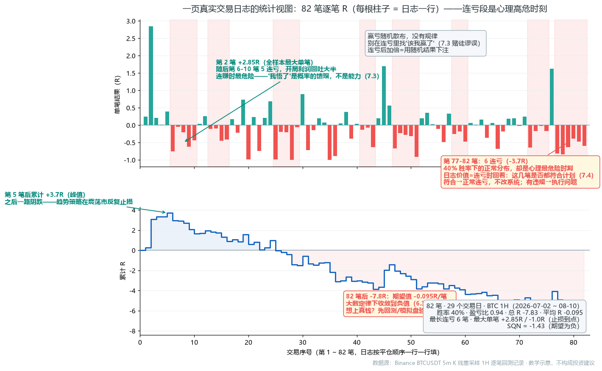
*图 7-5R 真实数据：一页真实交易日志的统计视图——逐笔 R 与累计 R，连亏段高亮（数据源：Binance BTCUSDT 5m K 线重采样 1H 逐笔回测记录）*

**这张图要读出的三件事**（都是 7.5 心理日志要防的东西）：

1. **连亏段是真实存在的，而且不止一次**。82 笔里出现 8 段 ≥3 连亏，最长 6 连亏（第 77-82 笔）——40% 胜率下这完全正常（7.4 概率表），但心理上每一段都像“系统坏了”。**日志的价值就是连亏时能回去看：这几笔是否都符合计划？**符合 → 正常连亏，不改系统（7.4）；有违规 → 执行问题，堵流程。
2. **赢亏是随机散布的，别在连亏里找规律**。看柱子：大赢（第 2 笔 +2.85R）之后，第 6-10 笔出现 5 连亏，把开局利润回吐大半——“连亏这么久该我赢了”是赌徒谬误（7.4），“我悟了”是概率的馈赠（7.4）。日志的心理列让你在“急切/报复”出现时立刻识别，而不是让它变成下一笔的仓位。
3. **统计结论从整张表来，不是从最近 10 行来**。82 笔算出期望值 −0.095R/笔、SQN −1.4（8.9 公式）——如果你只看最后 6 连亏那几行，会得出“系统完蛋”；只看开头 5 笔，会得出“悟了”。**日志的统计用法（8.3）就是对抗这两种近因偏差**：用 100 笔说话，不用情绪裁决。

**和第 8 章的分工**：第 8.3 的日志记录“做了什么”（前 9 列计划 + 后 5 列结果），7.5 的心理日志记录“当时状态”（4 列情绪）——这张真实图的柱子是“做了什么”的汇总，而“当时状态”的列会告诉你：连亏段里你到底是在按计划执行，还是在报复。

### 7.6 考核期十条军规 【核心】

1. **单笔风险 ≤ 0.5%**——20 次连续犯错才碰到总回撤线 10%，给“人一定会犯错”留预算。
2. **每日最多 2-3 笔，连亏 2 笔当天收工**——连亏 2 笔后第三笔的决策质量断崖式下降（第 7.2），此时再交易的不是系统，是报复。
3. **当天权益回撤到 3% 立即停手（留 2% 缓冲）**——日回撤线 5% 是峰值重置，留 2% 缓冲意味着即使停手后行情继续反向，当天也不会碰线。
4. **只做计划清单里的信号，其他一律不做**——计划外信号的胜率/盈亏比没有经过验证，等于把“正期望系统”换成“随机下注”；清单的过滤价值就在“把没验证的关在门外”。
5. **数据公布前后 15 分钟不开新仓**——数据瞬间点差扩大、流动性抽走、止损可能被跳过，价格行为短暂失真（第 1.8），持仓风险分布不再是回测里的分布。
6. **持仓目标到 1R 至少移止损保本**——1R 是“这笔已经赚回风险”的确认点，移保本后最差结果是 0，把“赚了又还回去”从可能里删掉（第 4.18）。
7. **不浮亏加仓、不摊平、不锁仓**——浮亏加仓让风险随亏损放大：亏 1R 后加一倍，下一笔的反向波动就从吃 1R 变成吃 2R、3R，单笔风险不再受 0.5% 约束，破产概率随杠杆非线性上升。
8. **错过信号就错过，追单=计划外单**——追单发生在情绪高点，入场价更差、止损更远、盈亏比被破坏，而且它不在计划里，无法归因复盘（第 8.3）。
9. **每天复盘 15 分钟，记录执行率**——没有记录就没有执行率（8.3），没有执行率就分不清“系统问题”和“执行问题”；复盘是验证闭环的最后一环。
10. **考核期=训练期：目标是“活下来+执行一致”，不是“快点达标”**——考核通过本质上是一次次一致执行后的统计结果，急于达标会跳过第 1、2 条的预算，把概率游戏变成赌命。

**这十条不是建议，是硬约束**。每条对应一种真实的死法：第 1、3 条防单笔/单日爆仓，第 2、8 条防情绪化过度交易，第 5 条防数据黑天鹅，第 7 条防承诺升级，第 10 条是总纲。

**军规的执行细节**：把它们抄在一张纸上放桌面，入场前逐条核对；违规一次，当天强制收工（不管盈亏）。第 3 条“3% 停手”的数字不是随便定的——考核有两条线（6.1）：日回撤线 5%（当日权益峰值重置）与总回撤线 10%（考核起点累计），取先触发者；第 3 条的 3% 是针对日回撤线 5% 留 2% 缓冲，意味着即使停手后行情反转，当天也不会碰线；而第 1 条的 0.5% 单笔风险（20 次犯错预算）保的是总回撤线 10%。第 2 条“连亏 2 笔收工”防的是报复交易——第 7.2 讲过的心理学：连亏 2 笔后，第三笔的决策质量断崖式下降。

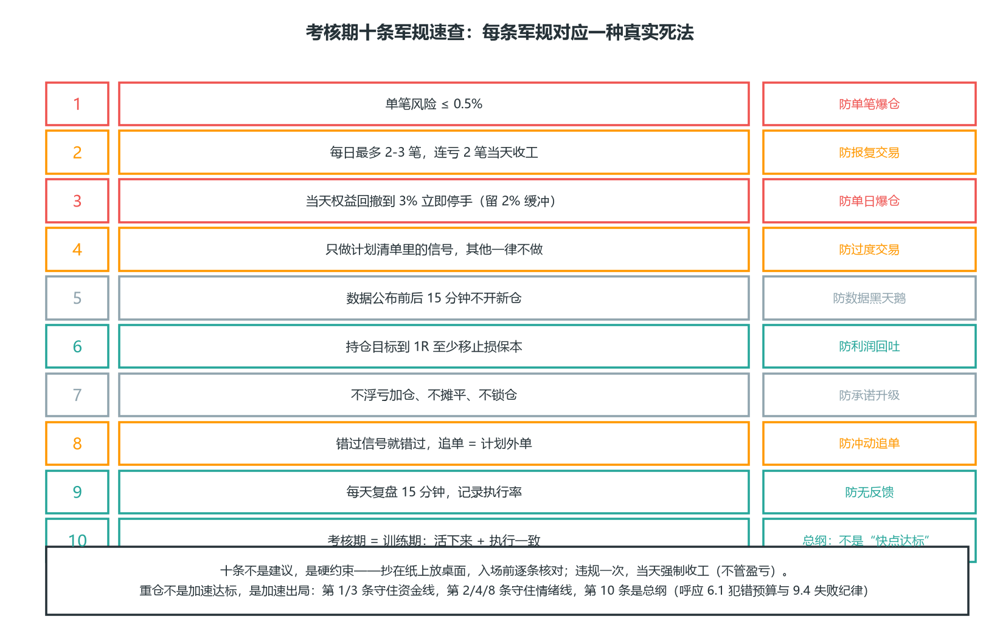

*图 7-6 考核期十条军规速查：每条军规对应一种真实死法——资金线（红）、情绪线（橙）、黑天鹅/承诺升级（灰）、利润与反馈（青）、总纲（绿）*

### 7.7 波段 vs 刮头皮：先想清楚你是哪种交易者

Al Brooks 把交易者分成两种，混用是亏损的一大来源：

- **波段（Swing）**：回报 ≥ 2 倍风险，持有 20+ 根 K 线，最低目标 TBTL（10 棒两腿，第 2.8）。
- **刮头皮（Scalp）**：极高概率的微薄利润，1-2 根 K 线内了结。

**为什么不存在“高胜率 + 高盈亏比”（Tefi L12 的数学）**：对手都是精明的，没有人愿意做“低胜率又低盈亏比”的一方——**你占据盈亏比优势，对应的胜率应当低落；你占据胜率优势，对应的盈亏比应当偏低**。于是市场上只有两种可交易的组合：

- 波段：约 **2.0 倍盈亏比 × 40% 胜率**，期望 = 2×0.4 − 1×0.6 = 0.2；
- 刮头皮：约 **1.0 倍盈亏比 × 60% 胜率**，期望 = 1×0.6 − 1×0.4 = 0.2。

两者期望值相同——“低胜率、高盈亏比”者与“高胜率、低盈亏比”者时常相互成交，谁都不吃亏。**一旦你发现某笔交易“胜率又高、盈亏比又大”，先警惕：你大概率漏算了什么**（成本、滑点、或逆势）。

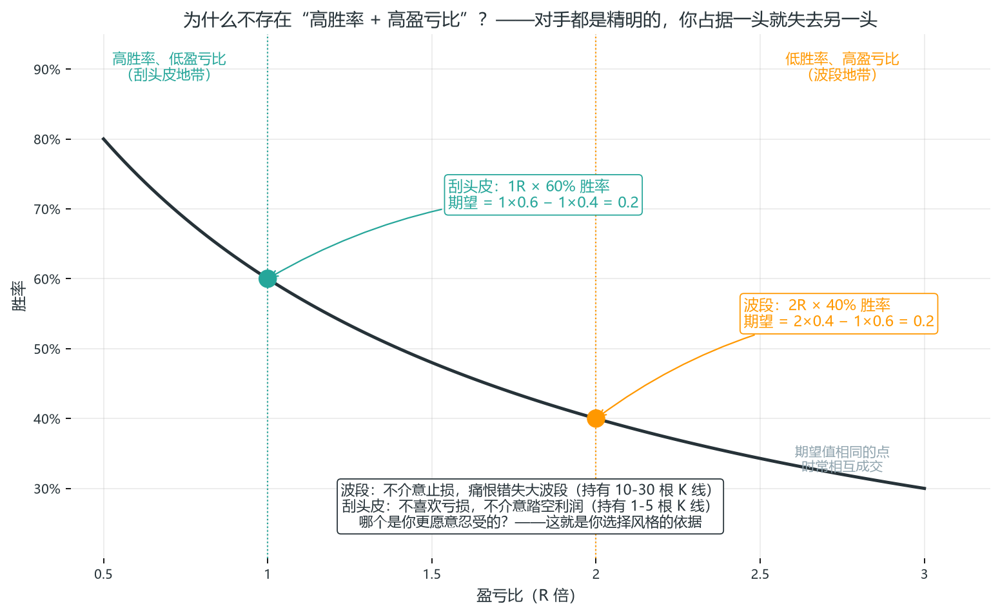

*图 7-7 波段 vs 刮头皮：期望值相同的权衡——1R×60% 与 2R×40% 都能赚钱，选哪种取决于你的个性*

**选择判据：哪个痛苦你更愿意忍受**：

- **波段交易者的核心追求是盈亏比**——为了提升盈亏比，不介意常常止损，愿意在盈利前忍受浮亏与利润回吐，偏向价值交易者（追求划算的大场价）。持仓 10-30 根 K 线。
- **刮头皮交易者的核心追求是胜率**——为了保全胜率，不介意踏空后续利润，不喜欢一波三折的持仓体验，偏向动能交易者（还能走我就赚一点）。持仓通常只有 1-5 根 K 线。
- 问自己：**“常常止损”和“踏空利润”，哪个让你更难受？** 波段交易者不介意止损、痛恨错失大波段；刮头皮交易者不喜欢亏损、不介意踏空利润——你必须把个性与操作协调起来，两种风格混用（以波段目标入场、却用刮头皮方式管理）是亏损的最大来源之一。

三条铁律：

1. **两种模式必须一致**：以波段目标入场，却用刮头皮方式管理（赚一点就跑、回调就慌）→ 必然亏损。入场前就决定“这笔是波段还是刮头皮”，管理方式随之锁定。
2. **禁止“刮头皮转波段”**：刮头皮入场后不涨反跌，微薄利润消失还接受越来越大的亏损——这是把刮头皮单硬扛成波段单，是新手最贵的错误。反方向“波段转刮头皮”是允许的：波段前提变化时（如第二次回到入场价 → 进入区间思维），及时了结。
3. **新手不适合刮头皮**：刮头皮需要 60%+ 概率和极快的执行，交易成本占比高（第 6.6）。Brooks 的原话精神：大多数交易者的图表每小时不应超过 20 根棒——频繁操作本身就是亏损信号。5 分钟图是良好起点。

**Brooks 的默认出场计划**（不知道目标时用它）：**2R 减半仓 → 3R 再减 25% → 剩余用跟踪止损做波段 → 收盘前全部了结**。这套默认计划写进规则书，消灭“不知道怎么办”时的临时决策。

**三条执行细则（Ali 突破研究）**：三条分别解决刮头皮的入场前筛选、入场后管理、方向判断：
1. **剥头皮前先量波动**：波动幅度必须 ≥ 最小获利空间的 3 倍，不足则放弃刮头皮；特别注意小幅回调趋势（SPB）这类低波动结构，别在高波动预期里进低波动仓位。
2. **5 分钟入场，1 分钟管理**：入场后用 1 分钟图做退出决策——连续 3-4 根 1 分钟 K 线收于极值（多头阶段收于低点、空头阶段收于高点），该阶段接近尾声，准备减仓或了结。
3. **外包 K 线的方向偏斜**：比较上一根 K 线高点之上的突破距离与低点之下的突破距离——上方更大 → 低点下方有买家（偏多）；下方更大 → 高点上方有卖家（偏空）。仅凭这一条方向偏斜做短线，Ali 的样本胜率约 83%；若方向与上一笔失败信号的二次交易一致（呼应 4.24），此类交易的胜率超过 85%。

**刮头皮者的止损宽度（Brooks，31D/44D）**：**太紧的止损点会降低赚钱的概率**——刮头皮者需要的是高概率，通常这意味着需要**更宽的止损点**（如果能扩大规模，还能进一步提高概率）。专业刮头皮者使用**波段止损并扩大规模**：第一次入场在盈亏平衡出场、第二次入场赚头皮利润。别以为刮头皮 = 紧止损——紧止损正是刮头皮者亏损的头号原因（呼应 6.5 止损太紧 < 0.5×ATR 的诊断、4.13 小型信号 K 线止损距离）。

**止损被触及后的应对（Brooks）**：**任何止损被触及时，约有 50% 的几率是陷阱**——市场打掉你的止损后反转（≈ 50% 机会原趋势恢复）。所以：① **被止损 ≠ 前提失效**——先问“入场前提还在不在”：前提仍在，就在反转时再次入场（止损被触及可以为反转创建第二个入场点，第二次信号通常更强）；② 前提失效才认输离场，不要让“止损被击中”本身改变判断（呼应 6.5 前提失效主动退）；③ 止损被击中本身可以创造一个突破——观察打止损后的第一根 K 线是否顺势跟进，把“扫损后的走势”当成新的信号源。

### 7.8 新手最常见的错误：因错误而输（Brooks 清单）

Brooks 课程最后一章“因错误而输”的清单，几乎每条都对应本书一条军规：

1. **过度交易**：没有优势的时段也做（军规第 4 条）。
2. **追突破**：在强势突破顶部买入、底部卖出（军规第 8 条）。
3. **把正常回调当反转**：趋势中的回调被误判为反转，逆势进场——先问“这是回调还是反转”（第 3.9 的 MTR 概率：即使四组件齐全成功率也只有 35-40%，而所有反转尝试里最终走出反向趋势的只有约 20%，见 2.8）。
4. **与趋势作对**：逆势摸顶抄底（第 4.10 模式匹配）。
5. **扛单**：止损不挂或手动取消（军规第 1 条：0.5% 风险 + 止损单执行）。
6. **报复交易**：亏损后加倍想一把赚回（军规第 2 条）。
7. **过早止盈**：1 根 K 线赚 1 点就跑，赢了小钱错过波段（7.7 的模式一致性）。
8. **没有计划**：临时起意入场（第 7.3 三时刻）。

用法：把这张清单贴在你的复盘表顶部，每天收盘后对照一遍——**你不需要记住所有正确做法，只需要确认今天没犯清单上的错**。

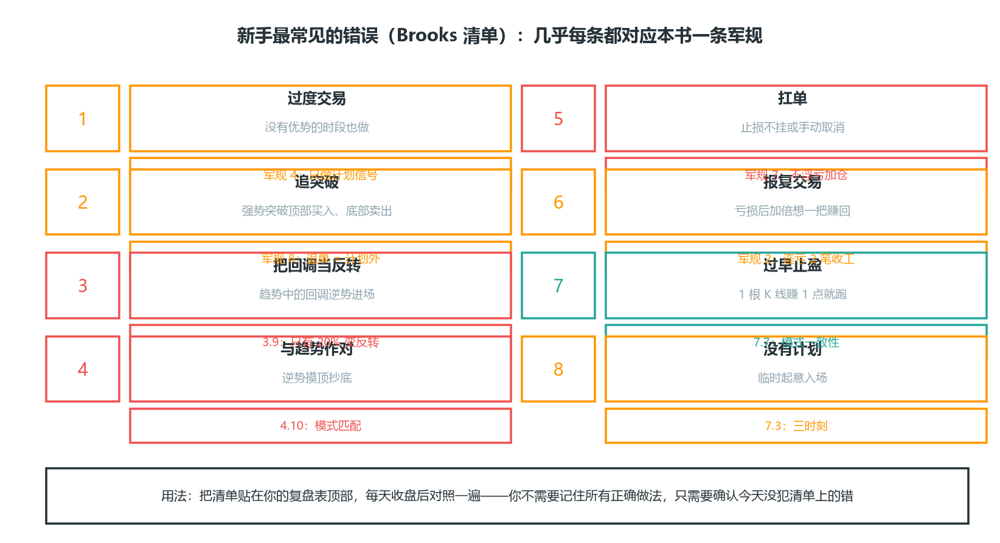

*图 7-8 Brooks 清单“因错误而输”：8 种错误 × 对应军规/章节——几乎每条错误都有一条军规在防它，复盘只需确认“今天没犯清单上的错”*

### 7.9 洛氏交易哲学：目标导向的自我管理

Joe Ross（第 2.9）的仓位是机械的（6.12 的 3 手合约法），心态观也一样直白——三句话就能说完，但每一句都值得抄进规则书：

**1. “学会痛恨亏损，勉强可以接受盈亏平衡，热爱盈利”**：

这句话和我们熟悉的“拥抱亏损”教导完全相反，但洛氏的落点不同——他不是让你怕亏（那是第 7.2 的损失厌恶），而是让你对亏损**零容忍地执行纪律**：亏损可以发生（概率上必然），但绝不允许“超计划亏损”发生。他的原话逻辑：**热爱亏损的交易者，在潜意识里希望亏损，于是他们的交易就会亏损**——这是目标导向的心理学：大脑是“目标寻求式”的，“我要盈利”调动积极的一面，“我不要亏损”调动防守的一面。

对本书读者的翻译：别学“把亏损当朋友”的鸡汤，学“把亏损当流程成本”的冷静——每一笔止损都是计划内支出，痛恨的是“计划外亏损”（扛单、报复、超仓）。这与 7.1 概率思维、7.4 连亏纪律完全一致：**止损是被预算的，不是被感觉的**。

**2. “你只能掌控自己，不可能掌控市场”**（转述马克·道格拉斯《自律的交易者》）：

大部分交易者失败的原因，是试图控制市场——而屏幕上的价格根本不理你的控制。能控制的只有三样：入场时机（等你）、仓位大小（你定）、止损位置（你挂）。**把“控制欲”从行情转移到自己**：不能控制涨跌，但能控制“这笔亏多少”。洛氏原话的狠劲：面对屏幕时你无法控制环境，需要的是完全不同的解决问题的方法。

**3. “交易是一项事业”（他的另一本书名）**：

事业 = 有流程、有账本、有长期目标——不是“一把梭哈”的赌局。具体化：每笔交易都是“一系列事件之一”（6.12 已引），今天做错一笔不改变明天继续执行；目标不是“这笔赚多少”而是“这个月的流程执行率”（第 8.7）。洛氏还坚持多市场多周期（他不做单一品种的专职日内）——你可以不认同他的品种观，但他的理由值得记住：**专职盯一个品种的日内图，人很快会疲惫；疲惫是执行力的隐形杀手**（呼应 7.3 的盘后休息）。

**三句话合一**：目标导向（要盈利而非怕亏损）+ 控制自己（而非市场）+ 事业心态（而非赌局）——这是洛氏用几十年交易时间总结的“自我管理”，和本章开头的结论一致：心态不是性格，是管理。

### 7.10 以交易为志业：决策树与精通阶梯（Tefi L20）

Tefi 课程最后一课把“职业化”落成两个可执行的工具——决策树和精通阶梯。

**工具一：把规则写成决策树（Decision Tree）**：交易的流程是“输入 → 处理 → 输出”：交易者接收视觉化资料（图表），进行处理，输出为具体决策。如果有一条清晰的决策树作为指引，一切就能有条不紊、不假思索：

- **写决策树的步骤**：从根节点开始逐层问“是/否”——例如：突破后有同色跟进 K 线吗？（是 → 顺势方案；否 → 回到磁体等待）→ 信号 K 是否抵达磁体？（是 → 布置；否 → 观察或跳过）→ 布置后立即成交还是进入回调？（前者 → 追踪；后者 → 按回调方案处理）。
- **为什么必须写出来**：迫使自己梳理各个节点与分支，**会探照出你原本没想清楚的部分**，有助于内化规则。如果对写规则没有头绪，说明对知识不熟悉、图表阅读量太低——回炉学习，而不是硬编。
- **Type A/B/C 追踪**：把交易记录分类标记（如 Type A = 信号正巧抵达磁体即成交、Type B = 布置后未进回调、Type C = 布置后旋即成交但走势不如预期），追踪各类别的数据表现——**表现不佳的类别，移出规则，不再参与**。这是“用数据淘汰规则”的职业化做法（呼应第 8 章的执行率统计）。
- **自由裁量的位置**：基于规则 ≠ 完全机械。规则之上可以留裁量空间（例如视第一推与回调的动能决定是否调整止损/止盈），但前提是“规则骨架已完整”——先有树，再谈枝叶。

**工具二：精通阶梯（Mastery Ladder）**：从新手到精通，技能层级是清晰的：

Newbie（新手）→ Beginner（初学）→ Apprentice（学徒）→ Intermediate（中级）→ Proficient（熟练，Rule-based 基于规则）→ Advanced（高阶，Rule-based Discretionary 基于规则的自由裁量）→ Expert（专家，Discretionary 自由裁量）→ Mastery（精通，Intuitive 直觉）

- 大多数人停留在“Rule-based”之前就放弃了；**能从“基于规则”走到“基于规则的自由裁量”，已是前 5% 的交易者**；“直觉”是规则内化到不需要思考的结果，不是天赋。
- 对照定位：本书第 4 章给规则（Rule-based），第 7 章给流程（执行），第 8 章给验证（数据反馈）——这套书的目标是把你送到“Proficient → Advanced”，再往上靠的是笔数积累（第 8.7 的 100+ 笔）和复盘质量。
- 职业化的每日动作：持续做“事后读图”（找出图表中能对应课程内容的所有信息），直到能对任何图表进行不倚靠外部协助的、细致的逐根 K 线解析；出现单次或系统性错误时，调用已学的知识自行排除。

**为什么要“以交易为志业”**：Tefi 借韦伯《以学术为志业》的命题提醒：如果永远受制于概率，要如何真正感到确定与踏实？答案是把交易当作一项需要长期打磨的志业，而不是赢一把就走的机会——**“大概一个人能将寂寞与繁华看作没有两样，才能耐寂寞而不热衷，感繁华而不没落。”**（清代文人张岱语）翻译成交易语言：连亏时不慌（寂寞），连赚时不飘（繁华）——第 7.4 的连亏/连赚纪律，最终要上升到这个境界。

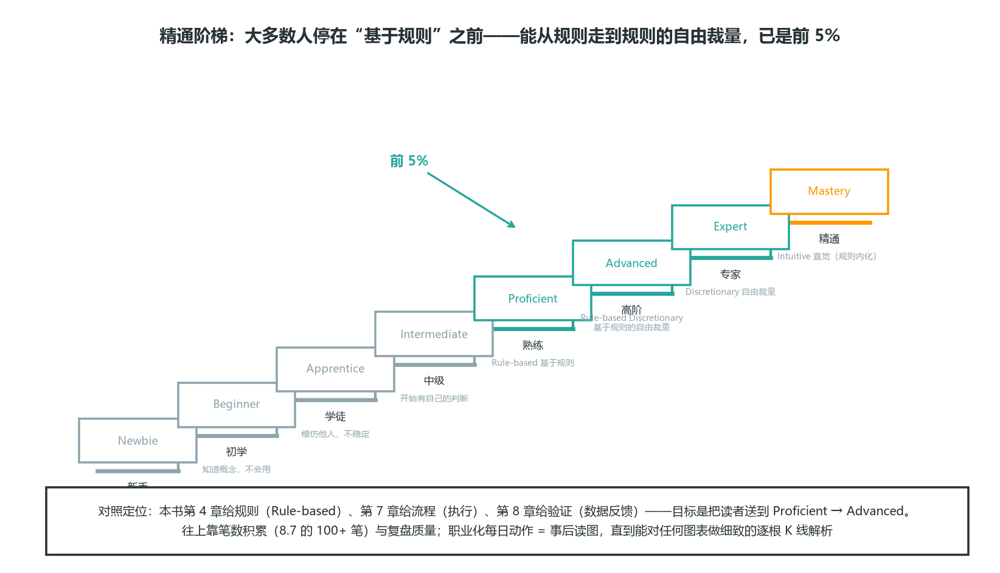

*图 7-9 精通阶梯：Newbie → Beginner → Apprentice → Intermediate → Proficient（基于规则）→ Advanced（基于规则的自由裁量）→ Expert（自由裁量）→ Mastery（直觉）——大多数人停在“基于规则”之前，能从规则走到规则的自由裁量已是前 5%*

### 本章自测（答案在本节末尾）

1. 一笔按计划执行的亏损单，是好交易还是坏交易？评价标准是什么？
2. 三大必记概率锚点（7.1 速查表的三个 ★）是什么？
3. 止损单的真正作用是什么？为什么说“入场即挂止损”是心态对策而不是技术动作？
4. 连亏和连赚分别考验什么？正确的应对分别是什么？

**答案**：① 好交易（7.1）——评价标准是“是否一致执行了正期望值系统”，不是单笔盈亏；② 区间突破约 80% 失败；一般反转尝试约 80% 失败变旗形；90% 的 K 线下一笔胜率在 40-60%（盈亏比 ≥2 是数学底线）；③ 把决策从“感觉”手里夺回来（7.2 损失厌恶/处置效应）——人在浮亏时大脑会祈祷而不是判断，止损单让机器替你做决定；④ 连亏考验纪律（会不会报复、改规则）、连赚考验清醒（会不会加仓、飘）——连亏：不改系统、可降风险预算（0.5%→0.25%，7.4）；连赚：维持原仓位不放大；共同点：都不改变规则（7.4）。

### 本章小结：速查卡

**① 心态是最后的瓶颈**

- 心态是最后的瓶颈——方法、仓位都对了，输给自己就全白搭。
- 心理成熟三阶段：结果导向 → 规则导向 → 概率导向。好交易 = 按计划执行，不论盈亏。

**② 四种核心思维 + 概率锚点**

- 四种核心思维：频谱（状态是连续频谱非二元）、概率（趋势中多数反转失败、区间中多数突破失败）、惯性（默认延续，反转须趋势线突破 + 极点测试失败）、嵌套（大周期定方向、小周期定入场）。
- 概率锚点：区间突破约 80% 失败、反转尝试约 80% 变旗形、完整 MTR 仅 35-40%（只诊断不下单）、尖峰后 60/30/10——末端三推/楔形反转时追顺势是最隐蔽的陷阱，应 wait。

**③ 流程与纪律**

- 交易流程三时刻：开盘前做计划、盘中只执行、收盘后复盘。
- 连亏考验纪律，连赚考验清醒——两者都别改变规则。
- 日志加记心理状态，给自己画高危画像；十条军规是硬约束。

**④ 七个行为偏差**

- 七个行为偏差各有自诊断信号 + 对策，核心是把决策从情绪时刻移到冷静时刻。

**⑤ 风格与职业化**

- 波段与刮头皮必须一致：禁止“刮头皮转波段”；默认出场计划 2R 减半、3R 再减 25%、剩余跟踪止损。
- 风格选择看“哪个痛苦更能忍”：波段 2R×40% 与刮头皮 1R×60% 期望相同——没有“高胜率+高盈亏比”，对手都是精明的。
- 以交易为志业：把规则写成决策树（探照没想清楚的部分），用 Type A/B/C 追踪淘汰弱规则；沿精通阶梯从“基于规则”走向“基于规则的自由裁量”。

**⑥ 新手八大错误**

- 新手八大错误（过度交易/追突破/回调当反转/逆势/扛单/报复/过早止盈/无计划）——复盘时对照清单。

下一章是闭环：用什么工具，以及怎么验证系统真的有效——验证通过才配上真钱。
