# 第 8 章 工具与验证

> **阅读提示**：本章是“科学方法”章——复盘流水线、统计口径、回测陷阱、订单流三件套（Volume Profile 见 5.12，本章仅交叉引用）。8.8 复盘体系是闭环入口，先按它跑起来；8.1 是图表工具清单，按需选用；8.6–8.7 的验证方法决定你敢不敢上真钱。


本章解决一个问题：用什么工具，以及怎么验证你的系统真的有效。前面七章给你方法，这一章给你闭环——验证通过，才配上真钱。

### 8.1 图表与分析 【核心】

| 工具 | 用途 | 费用 |
| --- | --- | --- |
| TradingView | 图表主力：多时间框架、画图工具、社区 SMC 指标 | 免费版够用 |
| MT5 / MT4 | 外汇行情终端+挂单管理，prop 考核盘主流操作端 | 免费 |
| cTrader | 更现代的外汇终端，订单流/深度视图更强 | 免费 |
| 手机端 | TradingView App（随时盯盘+提醒） | 免费 |

**TradingView 用法**：用“多图表布局”同时开日线/4H/1H/15m（对齐时间），把第 4 章的 MTF 流程直接可视化；给关键位加水平线提醒（价格到达时推送）。

**MT5 用法**：prop 考核盘（FTMO 等）大多用 MT5 作为操作端——挂单、止损、出金都在这里。功能上用两个就够：图表画线（结构标记）+ 订单面板（挂单管理）。别折腾 EA（自动交易程序）——考核期用 EA 属于灰色地带，且你还没验证过系统，手动执行才是训练目的。

**cTrader 用法**：如果你的平台支持，cTrader 的 DOM（深度市场）视图能看到挂单分布——对做期货/外汇订单流的交易者有用。新手可以先不用。

**工具配置清单（半小时搞定）**：

1. TradingView 存一个“多图表布局”：日线 + 4H + 1H + 15m 四屏对齐。
2. 把常用的关键位画法存成模板（水平线 + 区域高亮）。
3. 手机装 TradingView App，开关键位价格提醒。
4. MT5 里把每个品种的合约规格（点值、保证金）抄进笔记（第 6 章仓位公式的输入）。

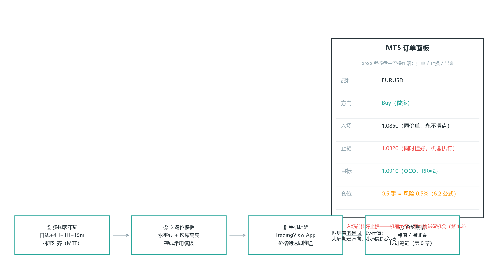

*图 8-1 图表工作区：四屏 MTF 布局＋关键位提醒＋MT5 订单面板——大周期定方向，小周期找入场*

### 8.2 回测与数据 【核心】

**TradingView Pine Script 策略回测**：把规则写成脚本（如“4H HH+HL 结构 + 1H 回调锤子”），跑 5 年历史数据看胜率/最大回撤。不会写脚本可先用指标筛选器入门。

**免费历史数据**：

- Yahoo Finance（股票/指数日线 CSV）
- Alpha Vantage（免费 API，外汇/股票分钟级，额度够个人用）
- FRED（美联储官方宏观数据）
- investing.com（外汇/黄金历史 CSV）

**Python 生态**：pandas + backtrader/vectorbt 回测。能力够后再上，别本末倒置——先有可验证的规则，再谈工具。

**QuantConnect**：云回测平台，免费额度，数据全（偏量化路线）。

**手动回测流程（不会写代码也能回测，最推荐新手用）**：

1. 打开 TradingView，选品种和周期（如 4H）。
2. 用“K 线回放（Bar Replay）”功能，把图切到过去某个时点。
3. 逐根 K 线播放，按你规则书（第 4 章）判断：这根是否满足入场条件？
4. 满足就记下入场价/止损/目标，再往后放看结果。
5. 每笔填进日志模板（8.3）。
6. 积累 100 笔后，算胜率、盈亏比、期望值（= 胜率×平均盈利 − 败率×平均亏损，第 6 章）、最大回撤。

**手动回测要点**：

- 回放天然防“看未来”，避免前视偏差（look-ahead，用了未来尚未形成的数据）；这与 8.3 日志防的“事后偏差”（hindsight，知道结果后倒推）是两种偏差——回放把前视挡在门外，这是它比“翻历史图”可靠的原因。
- 严格按规则：别因为“感觉这单能成”就放宽条件。
- 计入成本：每笔扣掉点差/佣金。
- 手动回测慢（100 笔可能要几天），但最扎实——你在亲自走决策流程，不是看软件吐的数字。

**手动回测的常见陷阱**（写进你的回测规则书）：

1. 用“后视镜”画支撑阻力——回放时只允许用“当时已经形成”的结构。
2. 跳过难做的单——“这笔太勉强了”= 你已经默认做了选择，要记下来为什么放弃。
3. 忘记扣成本——第 6.6 说过，成本不扣，验证的就是假系统。
4. 只在“好做”的行情段回测——必须覆盖趋势和震荡两种行情，否则你验证的只是半个市场。

**回测方法论的进阶（Ali 突破白皮书的做法，直接可抄）**：

- **按日结构分组统计**：把样本日分类再算概率——约 84% 的交易日至少几小时处于区间（宽口径，4.7），其中约 65% 可归为趋势性交易区间日（TTRD，趋势波段 + 区间震荡的组合），纯趋势/通道日 10-15%、小回调趋势日约 5%；**约 85% 的交易日有一半时间处于区间**（呼应 4.7 状态机：日结构分布）。分开统计后你才知道“我的系统到底在哪种日子赚钱”。注意 84% 和 65% 不是互斥分类，而是“有区间成分”和“区间主导/TTRD”两个不同口径。
- **按波动率状况分组**：用 VIX 把样本分成高/中/低波动三组，各取 100 个样本分别回测——系统在高波动日的表现和低波动日可能是两套故事。
- **IBS（内部 K 线强度）指标**：IBS = （收盘 − 最低） ÷ （最高 − 最低），衡量一根 K 线收盘在波幅中的位置。回测筛选可先用较宽阈值（看涨 ≥ 69 / 看跌 ≤ 31，十字星约 45-55%），但**结构信号棒采用 3.11 的更严格阈值：看涨 ≥ 75 / 看跌 ≤ 25**——不要混用；正式规则书里写死一组即可。
- **可编程信号定义（QuantSystems 研究口径）**：双 K 突破要求“至少一根 K 线幅度 >10 根 K 线均幅”；大突破 >2×10ATR；反转第二根需收盘超越；高潮需 CXfactor×1.6；研究中 `_BullRevIBS=51/_BearRevIBS=49`、FT 筛选=-1。注意：**51/49 是白皮书里“反转类信号”的筛选口径，与上面的 75/25、69/31 不是同一信号的三个版本**——不同信号类型用不同阈值。回测时把这些写死，能避免“人工看形态”造成的回测失真。
- **回看期稳健性测试**：改变回看参数（如 7-12 根 K 线），结果不应剧烈变化——小改参数成绩大变 = 过拟合，不是优势。
- **容错资本**：回测结果至少打八折再当真实预期（第 8.6 已有），并且要为“回测没见过的行情”预留容错——市场结构会变，你的系统不能只对历史最优。

**一次真实的回测长什么样**：上面说的不是空话，用真实数据跑一遍给你看。下面这张图是一个再简单不过的趋势策略——EMA20/50 交叉，在 BTC 1 小时线上跑了 40 天（82 笔）：

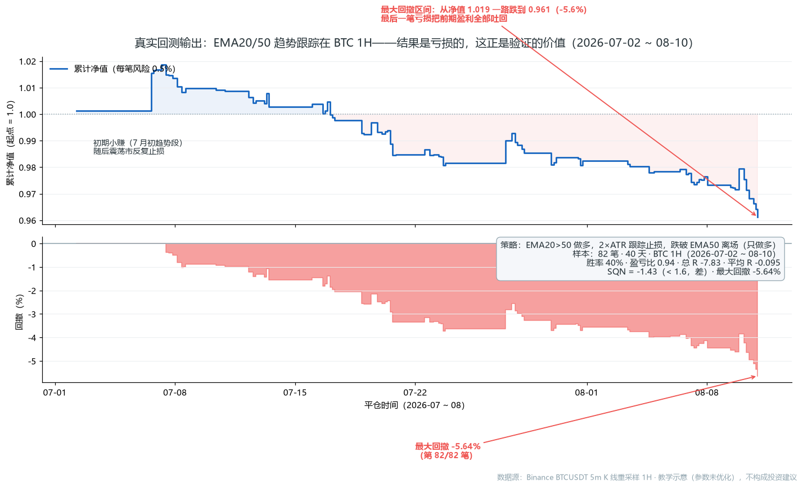
*图 8-1R 真实数据：EMA20/50 趋势跟踪在 BTC 1H 的回测输出（数据源：Binance BTCUSDT 5m K 线重采样 1H）*

**看这张图要读出的四件事**（这才是回测的正确打开方式）：

1. **它没赚钱——这恰恰是回测的价值**。82 笔、总 R −7.8，如果直接上真钱，你的模拟盘/考核盘就是这样一路阴跌。回测的意义不是“证明我的系统很厉害”，是“在我押真钱之前告诉我系统行不行”（呼应 8.7 验证闭环）。
2. **数字会告诉你为什么不行**。胜率 40.2% 不算低（第 4.27 讲过均线趋势跟踪胜率就 35-45%），但盈亏比只有 0.94——赢的时候平均赚 0.41R，输的时候平均亏 0.44R，**赚的没亏的多**。趋势跟踪的盈利模式是“胜率不高但赚大钱”，这个系统赚不到大钱，所以期望值为负。
3. **SQN −1.42 < 1.6，直接判死刑**（SQN = √N × 平均 R ÷ R 标准差，定义与分级见 8.9——<1.6 属"差"档）。期望值均值 −0.095R 配 0.60R 的标准差——信号里的优势还没跑赢噪声。按 8.9 的标准，SQN < 1.6 就该回去改规则（换参数、加过滤器、换入场），而不是调仓位硬扛。
4. **回撤曲线告诉你风险在哪**。最大回撤 −5.64% 在 40 天里出现多次，如果你用 0.5% 风险，模拟盘最多也就回撤 5.6%——看着“可控”，但这是建立在期望值为负上的：**你承受了全部回撤，却没有正期望来还**。期望值为负时，控制回撤只是延迟亏光。

**这一节真实图的教学结论**：回测输出不是“成绩单”，是“体检报告”。体检发现指标异常，正确的反应是去治病（改规则），不是安慰自己“多跑几笔就正常了”。第 8.9 的 setup 归因就是“治病”的流程——把每一笔分类到信号，看哪类信号在拖后腿，砍掉它，再回测，直到 SQN 过线。

**还有个更隐蔽的坑：样本量幻觉**。上面这张图是 82 笔的全貌，但回测是逐笔展开的——如果你只回测了前 20 笔，会看到什么？累计 +0.58R，平均 +0.03R/笔，**看起来像正期望值**；如果只看前 5 笔，更是 +3.72R（+0.74R/笔），“这系统要发财”。实际上这套系统到第 25 笔才转负，82 笔后是 −7.83R（−0.10R/笔）。**结论随样本量翻转**——20 笔时的“正期望”是运气不是验证。

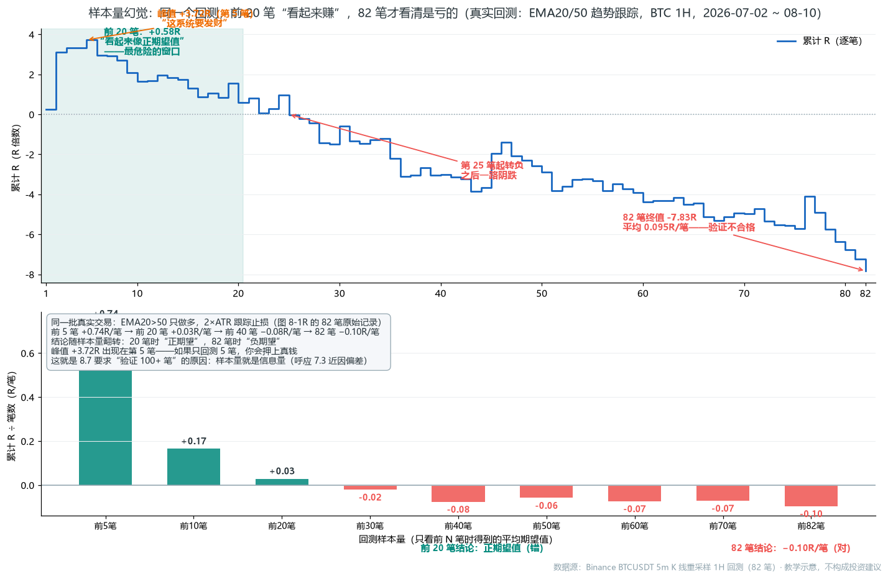

*图 8-2R 真实数据：样本量就是信息量——回测少于 30 笔时看到的“正期望值”是噪音；这就是 8.7 要求验证 100+ 笔的原因（数据源：同图 8-1R 的 82 笔真实记录）*

**这张图回答一个关键问题**：为什么验证门槛是“100+ 笔”而不是“10 笔、20 笔”？因为结论的稳定性随样本量增长——前 20 笔的平均 R 是 +0.03，第 40 笔变 −0.08，82 笔收敛到 −0.10；在收敛之前，任何“正期望值”都可能是前几笔大赢的残留（这里就是第 2 笔 +2.85R 那笔赢单撑起来的）。所以回测结果要看的不是“目前赚了多少”，而是“这个数还会不会变”——用 100 笔以上的样本，让运气成分摊薄（呼应 8.7 / 7.3 近因偏差）。

### 8.3 交易日志与复盘 【核心】

**表格模板（每笔一行）**：日期 | 品种 | 方向 | 入场 | 止损 | 目标 | 结果(R) | 是否按计划 | 复盘备注 | 截图链接。

**Notion / Excel**：建“交易日志”表 + 每周透视统计（胜率、盈亏比、执行率）——第 6 章的期望值就从这个表算。

**Myfxbook（免费）**：绑定 MT 账户自动统计曲线、回撤、盈亏比。

**规则书**：把第 4 章六要素和第 7 章军规写成一页纸放桌面，入场前逐条打勾。

**完整日志字段模板（建议列）**：

| 字段 | 说明 |
| --- | --- |
| 日期/时间 | 入场时间（含时段） |
| 品种 | 如 EURUSD、ES |
| 方向 | 做多/做空 |
| 背景 | 趋势/区间，HTF 方向 |
| 信号 | 假突破/pin bar/吞没等 |
| 入场价 |  |
| 止损价 | 及距离（点/R） |
| 目标价 | 及 RR |
| 仓位 | 手数 + 风险% |
| 截图链接 | 入场前的图（入场前截好） |
| 结果(R) | 盈亏，以 R 计 |
| 是否按计划 | 是/否（执行率核心） |
| 心理状态 | 平静/急切/FOMO（第 7.5） |
| 复盘备注 | 哪里对、哪里错 |

**前 10 列在入场前填（计划，含入场前截图链接），后 4 列在平仓后填（结果与反思）**。先填计划、后填结果——这是防事后偏差的关键：入场前的判断和截图被固定下来，复盘时才能客观对照。

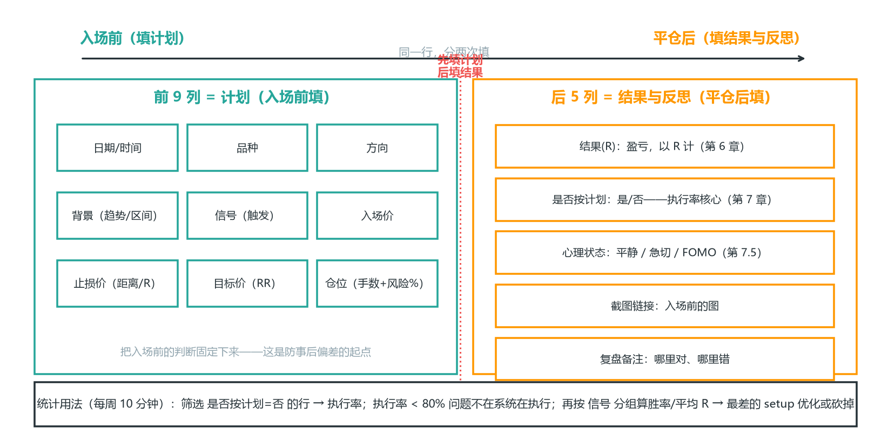

*图 8-2 日志字段两阶段：前 10 列计划（入场前，含截图）／后 4 列结果（平仓后）——先计划后结果，执行率从“是否按计划”列筛出来*

**日志的统计用法（每周一次，10 分钟）**：筛选出“是否按计划 = 是”的行，数一下比例——这就是执行率（计划内单 ÷ 总单）。执行率 < 80% 说明问题不在系统，在执行（第 7 章）。再按“信号”分组算各 setup 的胜率和平均 R——表现最差的 setup 要么优化要么砍掉（月复盘时决定）。

### 8.4 模拟盘 【核心】

**TradingView Paper Trading（免费）**：虚拟资金，图表和实盘一致。

**prop 考核盘本身**：考核阶段就是模拟盘——训练期就用它当战场，不另外找模拟盘。

**标准（最低三关）**：100+ 笔模拟记录、期望值为正、执行率 > 80% 再买下一次考核；**完整六关见 8.7（还要求 SQN>2、最大回撤可控、规则书写死）**——这里先记最低门槛，正式上真钱按 8.7 全过。

**模拟盘的两个陷阱**：① 模拟盘没有真实资金压力，心理状态失真——所以模拟期最重要的统计不是盈亏，是执行率（执行习惯可迁移，盈亏感受不可迁移）；② 模拟盘容易“想证明自己”而重仓——规则不变，0.5% 风险在模拟期一样执行，否则你训练的是错误习惯。

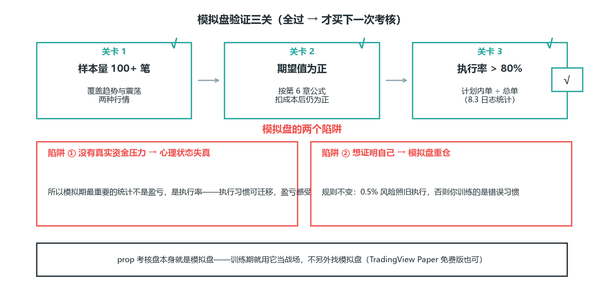

*图 8-3 模拟盘验证三关与两陷阱：三关全过才买下一次考核；模拟期最重要的统计是执行率，不是盈亏*

### 8.5 信息与日历 【核心】

**ForexFactory 经济日历**（forexfactory.com/calendar，免费）：全球数据事件权威日历，高/中/低影响分级。

**investing.com 日历**（中文）：界面友好，直接看北京时间。

**央行利率决议日程**：美联储（约每 6 周）、欧央行、日央行——把“炸弹时间”标进周计划（呼应第 1 章 1.8）。

**VIX 指数**（TradingView 搜 VIX）：市场恐慌温度计，VIX 飙升时降低仓位。

**日历的用法不是“预测数据”**，是“规避数据”：每周日把下一周的所有高影响事件标进计划，数据前后 15 分钟不开新仓（军规第 5 条），已有持仓提前收紧止损。你不需要知道数据结果，只需要知道“那一刻别站在坑里”。

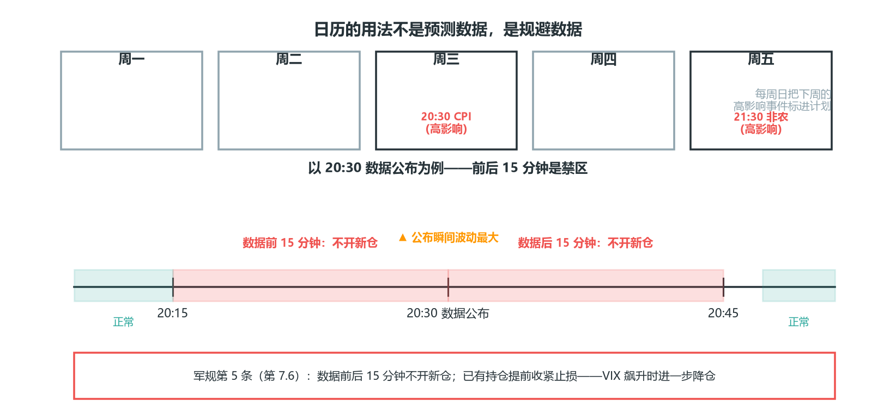

*图 8-4 日历规避：数据前后 15 分钟不开新仓——不需要知道数据结果，只需要知道那一刻别站在坑里*

### 8.6 防坑清单 【核心】

- 任何“免费信号群/跟单/自动交易软件”都是钓鱼——工具只用来分析，不把账户 API 交给第三方。
- 数据源交叉验证：一个数据异常时换源核对（Yahoo/Alpha Vantage/investing 互查）。
- 回测结果别全信：注意前视偏差（用了未来数据）、滑点未计入——回测期望值至少打八折再当真实预期。
- 警惕“幸存者偏差”：你看到的晒单都是活下来的，爆仓的不会发帖。

**防坑的底层逻辑**：交易行业的“免费午餐”全都是收费的——免费信号群收的是你的跟单（接盘），免费软件收的是你的数据（API 泄露），“保证收益”的收的是你的本金。你的工具链只需要上面列的那些正经工具，任何“额外赠送”都要警惕。

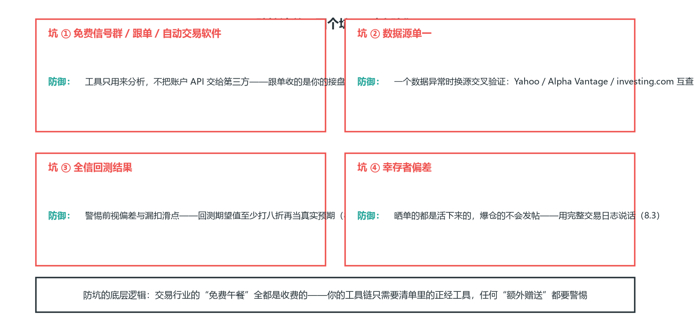

*图 8-5 防坑清单：四坑四防——工具链只需要正经工具，任何“额外赠送”都要警惕*

### 8.7 上真钱的门槛：验证闭环 【核心】

这是全书的收口。把前面的要求汇总成一个明确的门槛——**全部满足才上真钱（或买下一次考核）**：

1. **样本量**：模拟盘 100+ 笔，覆盖趋势和震荡两种行情。
2. **期望值为正**：按第 6 章公式算，且扣掉成本后仍为正。
3. **SQN > 2**：按 8.9 的公式算——是“盈利可能来自优势”的量化参考，但不是唯一证明：高 SQN 也可能来自过拟合或样本选择，仍需配合样本外/前推验证和稳定的交易逻辑。
4. **执行率 > 80%**：绝大多数交易完全符合计划。
5. **最大回撤可控**：模拟期最大回撤 < 考核总回撤限制的一半。
6. **规则书写死**：六要素+军规成文，入场前逐条打勾。

任何一条不满足，就还在训练期。**验证不是为了走流程，是为了在你拿真金白银冒险之前，让数据先替你冒一次险**。

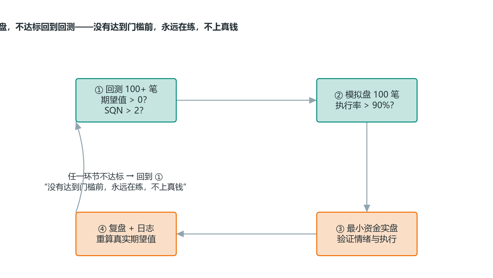

*图 8-6 验证闭环：回测→模拟盘→小资金实盘→复盘，不达标回到回测*

**上面是流程，下面用真实数据把"验证为什么必须严格"实证一遍**——把图 8-1R 的策略族（EMA 均线趋势跟踪，BTC 1H，2026-07-02 ~ 08-10 同一段行情）换成参数扫描：快线 {5,10,15,20,25,30,40,50} × 慢线 {50,75,100,150,200}，40 组参数逐组回测（其中一组因样本过少/未产生足够交易在排序图中剔除，故下左显示 39 组）：


*图 8-3R 真实数据：40 组 EMA 参数全部亏损——平均每笔 R 全为负（−0.85 ~ −0.22），参数只改变"亏多少"，改变不了"亏"（数据源：同图 8-1R 的 BTC 1H 数据段）*

**这张图要读出三件事**：

1. **换参数救不了负期望策略**——39 组有效参数全部亏损（最差 40/50 = −12.7R，最不差 5/100 = −4.6R），平均每笔 R 也全部为负。图 8-1R 的 20/50（−6.6R）只是这片"亏损高原"上普通的一点。震荡市跑趋势跟踪，怎么调参数都是亏——8.7 验证的第一步不是"调参调到回测变正"，而是先问**策略和行情是否匹配**（第 4 章系统设计，第 1.9 品种脾气）。
2. **最不差 vs 最差 = 亏多亏少，不是赚亏**——−4.6R 和 −12.7R 差距看着不小，但每组只有 9~41 笔（中位 15 笔，远低于 100+ 门槛）。在小样本里挑"最优参数" = 在噪音里找规律（呼应 8-2R 样本量幻觉：样本不足时连"正期望值"都可能看错，这里样本不足时连"最不差参数"都不可信）。
3. **样本越足越诚实**——41 笔的 5/50 亏 −12.6R，9 笔的 40/200 只显示 −6.1R。不是 40/200 更好，是它还没亏够笔数。这正是 8.7 要求 100+ 笔的原因：**让"亏多少"在足够大的样本里现出原形，而不是靠参数微调自欺**。

**口径说明：为什么扫描里 20/50 是 −6.6R，图 8-1R 却是 −7.83R？** 图 8-1R 的 82 笔是逐笔模拟完整出场管理（4.13 两级目标/保本/移动止损）后手动记录的；参数扫描为了机械可复现，统一用固定 2R 止盈/1R 止损简化出场，且每组样本只有 9~41 笔——出场口径不同、样本量也不同，数字自然不同，但"负期望"的结论一致：换参数救不了它。

### 8.8 复盘体系：日/周/月 【核心】

验证不是一次性的，是持续的。三层复盘节奏：

**日复盘（15 分钟）**：

- 记录每笔交易（含心理状态）。
- 算今天的执行率。
- 只深入复盘一笔典型单（对或错），不贪多。

**周复盘（1 小时）**：

- 统计本周胜率、盈亏比、期望值、执行率。
- 对比上周：执行率有没有下降？有没有计划外交易？
- 看权益曲线：回撤是否接近警戒线？
- 问一个问题：这周的盈亏，是系统带来的，还是运气/情绪带来的？

**月复盘（半天）**：

- 用更大样本（累计 100+ 笔）重算期望值。
- 审视系统：某个 setup 是否持续亏损？要不要砍掉？
- 审视自己：某个心理模式是否反复出现（第 7.5 高危画像）？
- 决定：继续、优化、还是暂停。

**复盘的核心不是“自责”，是“收集数据”**。每笔交易，无论对错，都是一个数据点。你复盘得越认真，下一个决策的依据就越扎实。

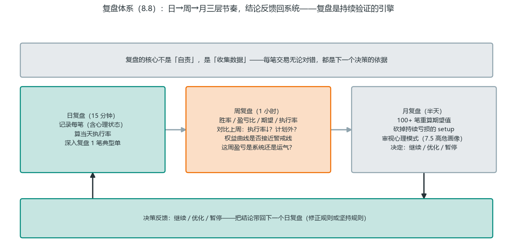

*图 8-7 复盘体系流水线：日复盘（15 分钟）→ 周复盘（1 小时）→ 月复盘（半天）→ 决策反馈（继续/优化/暂停）回到日复盘——复盘是持续验证的引擎*

图 8-7 把三层节奏画成一条流水线，**每层各干各的，不要越权**：

- **日复盘 = 执行层**（15 分钟）：记录、算执行率、只深挖一笔典型单；
- **周复盘 = 统计层**（1 小时）：胜率/盈亏比/期望值 + 问“盈亏是系统还是运气”；
- **月复盘 = 决策层**（半天）：重算期望、砍 setup、审视心理模式。

**为什么不能越权**：日复盘不做月复盘的决定——单笔或单日结果不足以砍掉一个系统；月复盘也不替代日复盘的记录——没有逐笔数据，月复盘就无米下锅。

**流水线的关键是底部的反馈回路**：月复盘的结论（继续/优化/暂停）必须变成下一个月日复盘的规则，否则复盘就只是“事后感想”，不是“持续验证”。

### 8.9 SQN：用 R 分布给系统打分 【核心】

Van Tharp 的 SQN（System Quality Number，系统质量指数）把第 6 章的 R 倍数分布压缩成一个分数：

```
SQN = √N × 平均 R ÷ R 的标准差
```

N = 交易笔数，平均 R = 期望值（以 R 计），标准差衡量 R 分布的离散度。解读（Tharp 的等级）：

| SQN | 含义 |
| --- | --- |
| < 1.6 | 差，需要大量优化 |
| 1.6 - 1.9 | 边缘 |
| 2.0 - 2.4 | 好 |
| 2.5 - 2.9 | 优秀 |
| 3.0 - 5.0 | 卓越 |
| > 5.0 | 极好（也要警惕过拟合） |

**两个注意**：① √N 让 SQN 对样本量敏感——50 笔和 500 笔的同样平均 R，SQN 差 √10 倍，所以回测至少 100 笔；② 与第 6 章的 Z 分数配合看：Z 分数验证“不是运气”，SQN 量化“系统有多好”——一个高 SQN 但低 Z 的结果，多半是样本太少。

**算例**：以图 8-1R 那 82 笔为例——平均 R = −0.095、R 标准差 ≈ 0.60，则 SQN = √82 × (−0.095 ÷ 0.60) ≈ −1.42，落入“差”档；6.4 的 Z ≈ −2.0 说明负优势统计显著。两个指标一起看，结论就是：这个系统不是“样本不够”，是确实不行。

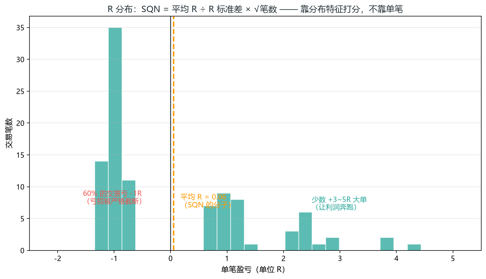

*图 8-8 R 倍数分布：大多数交易亏 -1R，少数大 R 撑起整体期望（SQN 的输入）*

图 8-8 是示意，真实数据的 R 分布长什么样？把图 8-1R 那 82 笔真实逐笔按 R 值画出来（每笔风险 0.5%）：


*图 8-4R 真实数据：真实回测的 R 分布——亏单被止损锁死在 −1R 内（纪律的指纹），赢靠少数大 R 撑起（数据源：同图 8-1R 的 82 笔真实记录）*

**这张图读出三件事**（图 8-8 的真实数据版）：

1. **止损纪律的指纹：49 笔亏损全部封顶在 −1R 内**。直方图左半边像一堵墙——没有一根“扛单巨亏”，最亏也就 −1.00R；实际亏损分布在 −0.02 到 −1.00 之间，均值 −0.44R（很多小亏单在前提失效时提前离场，6.3 对过账）。这就是“入场即挂止损”的物理证据：系统级风险是可控的，亏损分布是“闭眼可预期”的（呼应 6.4 止损与图 8-1R 的 −1R 锁死）。合成图 8-8 画的“大多数亏 -1R”不是夸张，是纪律系统的真实形态。
2. **赢在尾部：前 5 大赢单 = +7.79R = 赢单总利润的 57%**。中位 R −0.12、P75 才 +0.19R——超过一半交易不赚钱，赢单里也只有少数显著为正；但就是这 5 笔，把 82 笔从 −15.6R 拉回到 −7.83R（去掉它们，系统更惨一倍）。利润是少数大 R 给的（呼应 7.1 的 80/20 与图 8-9 的 setup 归因；同源数据与图 7-1R“前 3 大赢单 45%”一致）。
3. **SQN −1.4 的视觉化：期望为负 + 分布很宽**。直方图 σ=0.60、均值 −0.10R 只比 0 低一点——单看一两笔你根本分不出好坏，这就是“期望值要 100+ 笔才能看清”（8.2 样本量幻觉）的分布学解释；排序累计线则告诉你 82 笔累计稳定在 −7.83R。**验证的意义就是把“分布”压缩成一个可决策的结论：这系统不合格，别上模拟盘**。

**SQN 的正确用法是“对比”**：Ali 的突破系统（第 3.11）加入筛选器后 SQN 从 6.3 升到 8.9、胜率 76%→86%——一次优化有效无效，用 SQN 说话。**月复盘时算一次 SQN**：提升说明筛选器有效；SQN 提升但样本量大幅缩水，则可能是过拟合。

**绩效归因与资金曲线：验证从“系统行不行”深化到“钱是从哪赚的”（进阶）**：SQN 回答“系统整体好不好”，归因回答“钱具体从哪来”——两者的关系像体检报告和病历：SQN 是总评分，归因是分项检查。

- **按 setup 归因（最有价值）**：把交易日志（8.3 的 R 数据）按 setup 类型分组（趋势回调/区间边界/假突破反向…），分别算笔数、胜率、总 R、SQN。你会惊讶地发现：某类 setup 贡献了 80% 的利润，另一类只是“看起来活跃”（呼应 7.1 的 80/20）。**砍掉贡献为负或 SQN<1.6 的 setup，系统质量立刻上一个台阶**——这比任何指标优化都快。
- **按时段/品种归因**：同一系统在不同时段（开盘/午盘/尾盘）或不同品种上的表现分层，找出“时间套利”——只做贡献时段/品种，是 8.9 “对比”思维的延伸。
- **资金曲线四指标**：
  - **最大回撤**（从峰值到谷底的跌幅）与回撤恢复时间——回撤 20% 后需要 +25% 才回本（6.1 的数学），恢复时间决定你能不能活到回本；
  - **盈利因子（PF）** = 总盈利 ÷ 总亏损，> 1.5 是健康线；
  - **夏普比率的简化版** = 平均月收益 ÷ 月收益标准差，衡量“收益的稳定度”而不是“收益大小”；
  - **连续亏损分布**——与 6.3 的连亏预期对照，实盘连亏超过理论值，先查执行（8.8 复盘），再查系统。
- **归因的纪律**：归因只用已执行的真实 R 数据（含滑点、含情绪交易），回测归因只用于发现、不用于决策；按月归因，季度看趋势——单月波动是噪声。**一句话：如果说不清“上个月的钱是哪三个 setup 赚的”，你的验证还没闭环。**

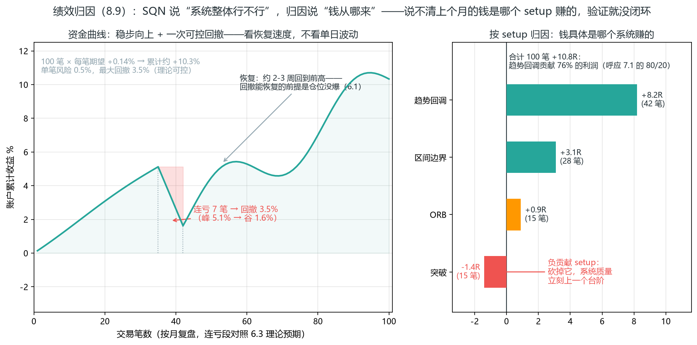

*图 8-9 绩效归因：左=资金曲线 100 笔累计约 +10%（一次连亏回撤后 2-3 周恢复）；右=setup 归因——趋势回调贡献 76% 利润，负贡献的突破该砍*

左右对着读：

- **左图回答“整体稳不稳”**——100 笔单笔风险 0.5%，第 36-42 笔七连亏回撤 3.5%，但 2-3 周就收复失地——这正是 6.3 说的“连亏是必然，只要不放大”；
- **右图回答“钱从哪来”**——趋势回调 42 笔贡献 +8.2R（占全部利润 76%，呼应 7.1 的 80/20），突破 15 笔反而是 -1.4R 的净拖累。

**下一步动作**：不是“优化突破信号”，而是把突破从系统中砍掉、把风险预算让给主力 setup（呼应 6.13）——归因的价值就在这里：它告诉你该改哪里，而不是“系统再调调”。

### 8.10 拍卖理论：把“平衡-失衡”读成循环（威科夫 2.0） 【核心】

威科夫 2.0（Rubén Villahermosa《威科夫 2.0》）用拍卖理论把市场运行概括为一个反复循环：**市场是一台拍卖机，价格+时间+成交量三要素共同确定“价值”，价格在“平衡”与“失衡”之间来回摆**。

- **平衡（市场有效）**：买卖双方对价格估值接近，价格横盘——这是市场大部分时间所处的状态，也是“价值”所在。区间交易（第 4.4 系统二）赚的就是平衡的钱。
- **失衡（市场无效）**：新信息让参与者对价值重新评估、产生分歧，主导一方把价格推出平衡区——趋势由此启动。趋势交易（第 4.3 系统一）赚的就是失衡的钱。

**三要素各自扮演的角色**：价格=拍卖过程的“测试棒”（上下试探，看参与者反应）；时间=“停留时长”的证明（平衡区消耗时间长，失衡区消耗时间短——价格在趋势里跑得快、在区间里磨得久）；成交量=“兴趣投票”（成交量越大的价位，参与者认为越有价值）。

**市场运动的四个环节**（施泰德·迈尔，与威科夫五阶段 A-E 对应）：

1. **趋势阶段**（垂直发展）：价格失衡、单向运动；
2. **停止阶段**（A. 趋势停止）：大量反向交易出现，趋势停滞；
3. **震荡阶段**（B. 原因构建，含 C. Spring / SOS）：横向发展，在新平衡区间交易，累积/派发发生在这里（对应第 5.10 的 Wyckoff 吸筹/派发步骤）；C 是最后的测试与确认——Spring（向下插破后收回）或 SOS（放量强势信号）出现，才说明平衡即将被打破；
4. **转换阶段**（D/E. 趋势展开与方向确认）：价格离开区间再次失衡——可能反转也可能延续。

循环结束后重新开始。**任何时间级别都观察得到这个循环**——这正是第 4.7 状态机的理论依据：你每根 K 线判断“趋势/区间”，本质就是在定位“当前处于四环节的哪一环”。

**威科夫“反转三步骤”（四环节的内部过程）**：上面的“停止 → 转换”不是一步到位，内部按三步递进——**① 衰竭**：原趋势动能耗尽；**② 吸收**：大额头寸持有者不主动追价，而是被动吸收反向流动性；**③ 主动**：一方主动出手，价格离开区间。高潮/衰竭只是第 1 步，等“吸收 + 主动”确认后才算反转证据。

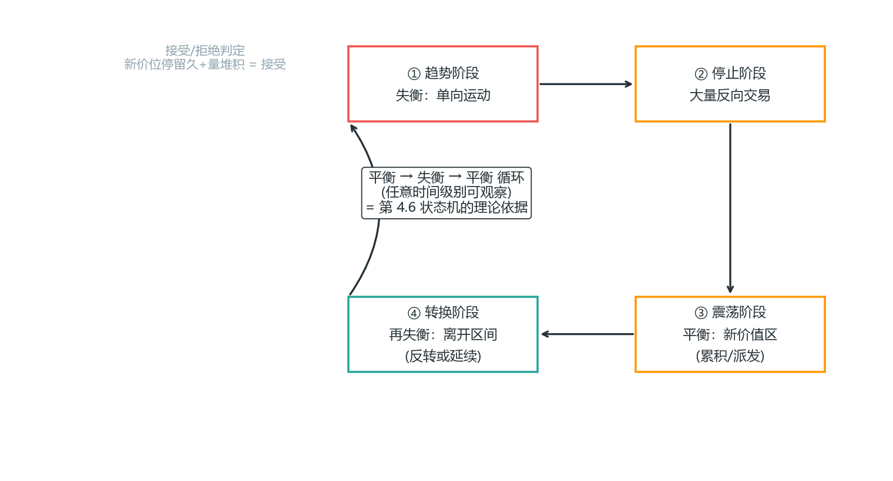

*图 8-10 拍卖四环节：趋势→停止→震荡→转换，平衡与失衡循环往复*

上面的循环图是抽象的，真实行情里这个循环长什么样？用 2026-07-01 的 BTC 5 分钟线把四个环节加“接受”一次走完（数据源：Binance BTCUSDT 5m，08:00 ~ 22:10）：


*图 8-5R 真实数据：拍卖理论的真实循环——平衡区横盘（时间换空间）→ 巨量失衡 → 回踩接受 → 放量转换；“接受”=收盘确认+放量，与图 4-2R 的“拒绝”（插破收回）成镜像*

这张真实图把 8.10 的概念全落到了 K 线上，三件事：

- **（①）平衡区是“时间换空间”**：16:40-20:50 近 4 小时里价格在 58350-58990 之间磨，下沿被测试了 3 次都没破——量能全程温和（30-80，是失衡时的 1/8~1/16）。这就是 8.10 说的“时间=停留时长的证明”：平衡区消耗时间长、量能小；价格不是没方向，是**参与者在达成一致**（威科夫 2.0 的“接受”正在形成）。
- **（②）失衡是“谁先动手”**：21:00 一根 V=635 的巨量把价格从下沿推离（常态 ~40 的 16 倍）——这就是“兴趣投票”：成交量越大的价位，参与者认为越有价值，主动方（市价单）出手了。注意失衡不是突破上沿，而是**先把平衡区内部打破**（呼应 8.10“主导一方把价格推出平衡区”）。
- **（③）接受 vs 拒绝是转换的分水岭**：21:15-21:40 价格回踩 58602，收盘守住不回下沿 = 接受（参与者接受新价位，新价值区成立）；对比图 4-2R 的区间假突破——插破上沿又收回来 = 拒绝。同一个“离开平衡区”的动作，接受 → 趋势展开（21:40 后放量突破上沿 58990 → 59410 新高），拒绝 → 反向破位。**接受/拒绝的判定 = 突破真假判断的理论版**（3.2 收盘确认 + 放量）。

**接受 vs 拒绝（判定失衡真假的标尺）**：价格离开价值区后——

- **接受**：新价位停留足够久（时间累积）+ 成交量堆积（成交量累积）= 参与者在此达成一致，新价值区成立，趋势有效；
- **拒绝**：价格迅速回到旧价值区（甚至急转弯）= 参与者对新价位缺乏兴趣，失衡失败。

实战对应：“接受”= 第 3.2 的收盘确认 + 放量（真突破）；“拒绝”= 假突破（插破收回）。**拍卖理论的“接受/拒绝”就是突破真假判断的理论版**。

**两个常见概念错误（威科夫 2.0 专门澄清）**：

1. “价格上涨因为买家多于卖家”——错：买卖数量永远相等（有人买必有人卖），关键在**主动/被动**：主动方（市价单）推动价格，被动方（限价单）承接；
2. “需求=主动买入+被动买入”——错：供应/需求特指**挂在委买/委卖区的限价单（流动性）**，主动单是“吃流动性”的一方。区分这两类，是理解第 1.6 买卖盘和第 4.22 限价单逻辑的前提。

**扩散理论：谁在什么时候进场（威科夫 2.0 / Rogers 创新扩散）**：把拍卖循环的“谁在推”讲透的是创新扩散模型——每个完整周期里，参与者按消息灵通程度分批进场，占比大致固定：**创新者 2.5%（内部人士，累积/派发阶段）→ 早期参与者 13.5%（消息灵通者，趋势启动早期）→ 早期参与人群 34% → 晚期参与人群 34%（趋势末段，量最大处）→ 迟缓者 16%（趋势末端，提供最后流动性）**。完整图与文字见第 1.1 的图 1-1。

与拍卖四环节对照：**创新者+早期参与者 = 停止/震荡阶段（第 5.10 的累积/派发）**；**晚期参与人群 = 转换阶段的最大成交量处**；**迟缓者 = 趋势末端的高潮时刻**。实战价值不是预测人群，而是**用人群分布反推你现在站在周期的哪个位置**：如果你发现自己和“迟缓者”同步进场（趋势末端 FOMO、放量追高），你就是最后 16% 的流动性提供者——该考虑出场而不是加仓。这条与第 2.11 的高潮互相印证：**高潮 = 迟缓者进场时刻 = 聪明钱出货时刻**。

### 8.11 足迹图（订单流图表）：看见逐价成交 【核心】

足迹图把每根 K 线的成交量按“价格档位”拆开（每档显示买入/卖出量），是比成交量分布更细一层的工具（成交量分布见 5.12 的 POC/VA/HVN/LVN）。威科夫 2.0 的足迹图解读四要素：

- **失衡（Imbalance）**：某档位成交量远大于相邻档位（买/卖严重一边倒）——代表快速通过区，价格倾向回填（与第 5.6 FVG 同源：都是“失衡”的另一种度量）。
- **变盘模式**：趋势中出现“大量成交但价格不继续”（努力无结果）——趋势可能反转，对应威科夫“努力与结果”定律（第 5.10）。
- **延续模式**：价格快速通过时成交清淡、回踩时成交放大——趋势健康，继续。
- **分形**：大小周期的足迹图结构自相似——大周期失衡会在小周期上重复出现，用于多周期对齐入场（呼应第 4.7 MTF）。

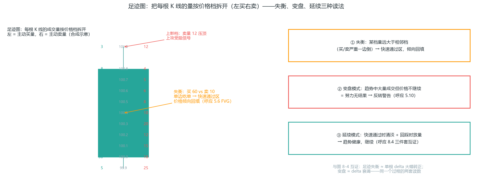

*图 8-11 足迹图：把每根 K 线的量按价格档拆开（左买右卖），失衡档高亮；三种读法——失衡/变盘/延续*

（左）一根大阳 K 线的逐档拆解：每一档标出“主动买量/主动卖量”——100.4 档买 60 卖 10 是失衡（橙色高亮）：单边吃单、价格快速通过，之后倾向回填；101.0 上影档卖量 12 压顶是上攻受阻信号。（右）三种读法：失衡 → 快速通过区；变盘 → 努力无结果（反转警告）；延续 → 趋势健康。**与图 8-12 互证**：足迹失衡 ≈ 单根 delta 大幅转正，变盘 ≈ delta 衰竭——同一个过程的两套读数。

**工具**：TradingView 无足迹图，需用专业订单流软件（如 Sierra Chart + DOM、ATAS、Exocharts）；期货有真实量，外汇只有 tick 量（第 1.2）——足迹图在外汇上仅供参考。**入门建议**：先用 5.12 的 Volume Profile（TradingView 免费版够用），足迹图是它的进阶——等到你的系统验证完毕（本章验证闭环）再考虑，工具从来不是先决条件。

**成交量极端柱（VX）与动态开盘区间（Ali）**：足迹图家族里还有一种"只看成交量极值"的简化法——**VX 柱 = 成交量极端柱**（如 3 分钟图上成交量超过 2.5 万的柱体；阈值按品种校准，ES 可用 5 分钟图 4 万+/3 万+ 两级）。为什么 VX 柱的极值点会成为磁吸位？因为**大量成交 = 大量参与者的成本参考点**，价格倾向回测这些位置——**VX 柱的极值点（高点/低点/中点）因此构成支撑/阻力位**；当日成交量最大的巨型趋势棒通常决定后续价格波动的范围。两级用法：**第一级 VX 柱定主要目标位，第二级 VX 柱定日内支撑/阻力位**（柱的高/低/中点三档）；**控制柱（CB）** = 相对前后柱体成交量显著但未达 VX 值的柱体，常常影响并限制后续多根柱体的走势（在交易区间 TR 中尤为重要）。**动态开盘区间**：用 3/5 分钟图前几根 K 线的成交量确定开盘区——成交量超过阈值（如 25K）的 K 线范围即开盘区间，**基于开盘区间的突破通常能达到测量移动目标**（呼应 4.26 ORB：开盘区间突破量度）。注意：这里的“动态开盘区间”按成交量阈值定义，与 4.26 的时间口径 ORB（开盘 N 分钟）不是同一件事——两者都描述开盘区，但一个看量、一个看时间，别混用。**失败处理**：若市场在触及 VX 目标前反转，说明这个磁吸位被否定，价格常测试反向目标、且常触及 2 倍反向目标（趋势交易日更常见）——VX 方向未达 = 反向信号（呼应 8.13 的 TX-D 失效后反向）。

**低量日适配**：换月/转仓后首个交易日等低量日，VX 法则仍有效；波动率低于 VX 阈值时，改用“与当日已出现波动幅度比较”的相对大小判断。小实体柱 + 大成交量时，突破方向将测试上方或下方目标位——低量日不要因为绝对量没到阈值就忽略 VX 结构。

**诚实的评价**：足迹图把“量价”的分辨率提高了，但它回答的问题（供需失衡、努力无结果、真假突破）本书前八章用 K 线+结构已经能回答——足迹图是**锦上添花的确认工具**，不是独立系统。别让工具复杂度超过你的系统复杂度。

### 8.12 订单流三件套：DOM、逐笔、Delta 体系化（进阶）

8.11 的足迹图是订单流家族的“结果图”。完整体系还有三件工具，配合起来才能回答“价格行为为什么这么走”：

| 工具 | 看什么 | 回答的问题 | 典型陷阱 |
| --- | --- | --- | --- |
| DOM（深度图/盘口） | 当前挂单分布（买墙/卖墙） | 现在谁在挂单（静态） | 幌骗（spoofing）：大墙瞬间撤掉 |
| 逐笔（Time & Sales） | 每笔成交的大小与主动性 | 现在谁在成交（动态） | 大单可能是拆单（冰山单） |
| Delta（买卖差） | 主动买量 − 主动卖量的累积曲线 | 净方向压力（累积） | 单根 K 线噪音大，看趋势段 |

**三件套的分工逻辑**：DOM 是“静态地图”（挂单），tape 是“动态新闻”（成交），delta 是“记分牌”（净压力）。三者回答的是同一个问题的三个侧面：**这个方向是真金白银推出来的，还是只是挂出来的**。

**订单流传递与多周期订单流**：三件套能回答“真假”，底层原因是订单流在做一件事——**流动性如何把价格从一个区间搬到另一个区间**：区间内积累流动性（挂单/止损变密）→ 消耗流动性（主动单吃掉对手盘）→ 价格进入下一个区间。多周期订单流对齐：**HTF 回调阶段，看 LTF 摆动趋势是否转跌/转涨**；若 HTF 回调 + LTF 订单流转跌，最终目标常是 HTF 折价区/溢价区。内部摆动订单流关注“区间内部的小摆动”，用来判断当前腿是否还有燃料。

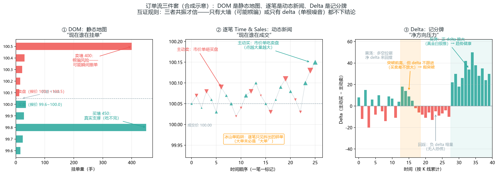

*图 8-12 订单流三件套：DOM 静态地图 / 逐笔动态新闻 / Delta 记分牌（合成示意）*

（左）DOM 把当前挂单摊开：买墙是价格下方的量，卖墙是价格上方的量——但大墙可能是幌骗，瞬间撤掉；（中）逐笔按时间展开每一笔成交的大小与主动性：上三角是主动买（市价吃卖盘），下三角是主动卖（市价砸买盘）——大单可能是拆单的冰山单；（右）Delta 把买卖差按 K 线累计：**突破段 delta 不跟进 → 假突破，回踩缩量 + 反弹放量 → 趋势健康**。

**互证规则（共振才信）**：

- 做多确认 = DOM 大买墙 + tape 大单密集 + delta 转正——三者共振才可信；只有 DOM 大墙（可能是幌骗）或只有 delta 转正（单根噪音）都不下结论。
- 假突破识别（订单流版）：价格突破结构位，但 delta 没跟进（突破段买卖差不放大）→ 假突破确认，反向信号更可靠（呼应第 3 章假突破与 Ali 陷阱清单）。
- 趋势延续确认：回踩时 delta 缩量（无人恐慌）+ 反弹时 delta 放量（有人抢筹）→ 趋势健康（呼应 8.10 拍卖理论的“接受”）。

**与价格行为的关系——一句话**：K 线是结果，订单流是过程。订单流不替代价格行为（第 2-4 章），它只回答“为什么”——当你对一笔信号的质量不确定时，订单流给第二意见；当信号与订单流矛盾时，以价格行为为主、降低仓位或放弃（呼应 3.1 信号质量 = 背景×位置×形态，4.2 讲系统六要素）。

**工具与入门顺序**：Sierra Chart + DOM、ATAS、Exocharts（呼应 8.11）；期货量真实、外汇只有 tick 量（第 1.2），三件套在外汇上仅供参考。**入门顺序：5.12 Volume Profile → 8.11 足迹图 → 本节三件套**——每一步都等到上一步用熟，工具从来不是先决条件。

**诚实的评价**：三件套是“确认工具”，不是“独立系统”——它不能告诉你入场信号，只能帮你确认/否决价格行为信号。新手阶段别碰（工具复杂度超过系统复杂度 = 亏损的另一种来源）；系统验证通过、想提高执行质量时再引入。

### 8.13 Tick 图跳动指标（TX-Tick / CCTK / TX-D）：把成交的“心跳”系统化（Ali 体系 · 进阶）

8.11-8.12 讲的是“成交在哪里、谁在成交”。Tick 图换一个切法：**按固定成交笔数切 K 线（如每 500/1000 笔一根），与时间无关**——时间图上的“无聊横盘”在 Tick 图上可能是几十根活跃 K 线，时间图上的“大阳线”在 Tick 图上可能只有几笔大单。Tick 图把市场的“心跳频率”摊开：**成交量大的时候 Tick 图走得快、K 线多，成交量小的时候走得慢、K 线少**。Ali 体系在 Tick 图上做了一整套事：TX 水平（极值参考位）、CCTK（连续同向 K 线）、TX-D（定向交易信号），以及按跳动读数触发的两级信号——IK Tick Hit（首千次点击命中）与 TX 1200（千次跳动刻度极值）。它们回答同一个问题：**失衡有多持续？**

| 概念 | 定义 | 交易含义 |
| --- | --- | --- |
| TX（Tick 极值水平） | Tick 图上预先画出的关键价位（基于 Tick 走势的极值/磁吸位），类似支撑阻力但来自跳动数据 | 价格触及 TX 时的反应决定信号方向 |
| CCTK（连续同向 K 线） | Tick 图上连续同向的 K 线（如连续 3 根看涨 Tick K 线） | 连续同向 = 持续失衡（买方连续压过卖方），顺势信号 |
| TX-D（定向交易信号） | Tick 柱触及 TX 水平且收盘方向一致时形成 | 定向信号对后续沿信号方向持续运动有高概率指向性 |
| CCTK-EB（提前入场） | CCTK 信号作为“入场柱”（EB）而非首个信号柱时，用限价单提前入场 | 在波动小的市场中及时介入，或在新趋势未完全确立时用紧密止损布局 |
| IK Tick Hit（首千次命中） | 跳动读数首次冲到千次级别的信号（低动量 700 / 高动量 1200） | 首次触发先顺势；仅在 LL/HH + Tick 读数低时才反转 |
| TX 1200（千次跳动刻度） | 跳动读数 1200 的极值水平 | 突破初期=中段信号（回调后顺势）；趋势末期=最后一冲（反向短线） |

**怎么串起来读**：上面这些不是并列的卡片，而是一条递进链——**先用 TX 定“极值位在哪里”，再用 CCTK 看“失衡有没有持续证据”，再用 TX-D 判断“极值是否被站稳”，最后用 IK/TX1200 区分“这是中段还是末段”**。后面每个小节都是这条链上的一环。

**串读示例**：强趋势日里，先画出 TX 极值位；Tick 图上连续出现 CCTK（持续失衡），随后一根 Tick 柱 TX-D 收盘站稳极值（极值被接受）；接着 IK/TX1200 触发，判断这是突破中段而不是末段；等价格回踩 PB（突破后回调）入场——每一步都在回答“失衡有没有持续、有没有被市场接受”。

**TX-D 的两种类型（以多头 TX-D 为例，空头镜像）**：

- **TX-D 触及**：TX-D 柱线高点突破 TX 水平但收盘低于该水平——只是“碰到”极值，没站稳；
- **TX-D 收盘**：TX-D 柱线不仅突破 TX 水平且收盘也高于该水平——**最强的 TX/TX-D 信号**，在通常立即开始的回调后具有最高的趋势跟随概率。**收盘接近 TX 极值且短尾或无尾的信号更可靠；长尾会降低可靠性**；同一根柱线不可能同时是 TX-D 信号和 CCTK 信号。

**TX-D 六状态**：TX-D 之所以能扩展成六种状态，是因为“触及方向、收盘强度、是否二次测试”三个维度组合起来，回答的是同一个问题：**这波极值试探到底有没有被市场接受**。收盘站稳 + 二次测试确认 = 最强；长尾触及 + 反向 CCTK = 最弱。完整规则书建议把这六种状态写死；简化版可先记住最强与最弱两端。

**TX 腿 / Tick 基座**：TX 腿是 Tick 图上从基座到 TX 极值的推进段。基座的本质是“**这段推动的起点成本区**”——趋势日取最近趋势腿起点、突破取突破前横盘低点、TTR 取紧区间边界、MC 取最后一段回撤低点，都是在回答“这波推动从哪里开始算”。基座越清晰，TX 极值被测试后的反应越可交易，因为参与者能一致识别“从哪来到哪去”。

**TXPB / ITKPB**：TXPB 和 ITKPB 不是新信号，而是**把“突破后回调（PB）”放到 Tick 级别执行**。TXPB 按市场周期交易 PB——突破后单根小回撤、两段回撤分别对应不同入场；ITKPB 用 3-4 根 Tick 微趋势顺势，适合小级别快速段。配合 TX 腿使用：先定基座和 TX 极值，再等 PB 触发，不在 TX 极值直接追——因为极值处往往是磁吸位，直接追容易被扫。

**Tick 与价格柱的关系（Ali 卡片）**：可靠的 Tick 形态通常由**一系列小型 Tick 柱**构成，同时价格柱以趋势方向极端点位收盘的大型趋势柱——这种“小 Tick 蓄力 + 大价格柱突破”的配合说明失衡在 Tick 级别持续、在价格级别兑现。只要这种关联保持，信号可靠；若 Tick 与价格开始背离（Tick 柱很大但价格柱没有极值收盘，或价格柱强但 Tick 柱不配合），应反向操作或放弃信号。ITKPB 入场细节：TK 先形成 3-4 根或更多的小趋势柱，且 TK 趋势必须与价格行为方向一致；通常价格趋势线突破之前，先有 TK 趋势线突破，价格在形成 PB 或反转之前会先走高/走低——所以在 TK 趋势线突破后的 PB 入场，比直接追价格突破更早、止损更近。

**CCTK + 2LT 联动**：TRD/TTRD 第一回合即将结束时出现新的 CCTK 买入信号，标志第二边开始，约 70% 时间构成 2LT 设置；平静低波动日该信号可靠性下降。看到“CCTK 出现在回合边界”时，把它当 2LT 陷阱的反向机会，而不是单纯顺势信号。

**TX-D 的交易规则（Ali）**：首次信号通常引发波段行情（最好参与部分波段）；第二次 TX-D 信号反向操作回调行情；第三或后续信号仅在条件仍支持时入场（紧凑通道/强劲趋势/动能持续增强——新信号强度需超越前次）；**反转通常出现在 5-6 根连续 TX-D 柱之后，该柱就是获利了结时机**。

**CCTK-EB 提前入场的核心思想**：CCTK 信号柱之后，若持续的同向卖压/买压触发了新的入场柱（EB），这种持续性本身就是失衡状态——**价格回调测试触发位时，通常会发现力量超过对面**（测试失败后反转趋势延续）。所以 CCTK-EB 不必等完整 PA 形态（如等回调 K 线收盘 + 确认 K 线），而是在信号柱趋势极值处挂限价单提前入场：做空挂信号柱最低点、做多挂最高点，分批建仓，止损放分批位外 1 个最小价位。**拒绝条件**：信号是第 3 根或更晚的柱线、CCTK 柱是十字星/陀螺线、SB 与 EB 重叠太多（TTR 中形成的信号）、信号在磁吸位附近没有足够空间容纳头皮、入场柱吞没信号柱（此时按正常第 1 信号处理）。

**CCTK-EB 准入细节（Ali 卡片）**：入场柱必须本身是 CCTK 柱；入场柱的 IBS 需满足 >50（多头）或 <50（空头）；柱体大小不重要，但异常巨大的高潮柱不可取，实体极小或无实体的柱也不可取——前者说明动能已耗尽，后者说明失衡还没开始。注意：这里的 IBS 50 是“Tick 柱方向过滤”口径，与 8.2 的 75/25、69/31、51/49 是不同信号类型的阈值，不要混用。

**CCTK-EB 管理（Ali 卡片）**：获利了结至少 1 个风险单位（具体看市场条件）；尝试减半并让剩余仓位奔跑；强劲趋势中跟踪交易；在低波动/横盘市（LOM）中按头皮大小对所有仓位做头皮处理。止损退出单放在减仓订单上方 1 个头皮大小——给剩余仓位留出被扫后仍能保本的空间。

**TX-D 失效时的应对（Ali）**：约 2/3 的情况失效后市场先横盘震荡数根 K 线（允许交易管理）；约 1/3 的情况剧烈反转（第二腿陷阱 2LT 信号中更常见，此时无法实施管理）。**TX-D 失效通常由真空效应导致**（趋势区间测试阻力位附近时）；**带过滤器的 TX-D 信号失败后，反而是反向交易的更可靠信号**。

**TX-D 的疲弱市场确认（Ali 卡片）**：正常情况下，价格行为必须确认 Tick 动能行为；若 Tick 动能背离（分时价格走势疲弱、难以脱离零轴，或存在明确的分时支撑/阻力），则要么价格行为信号失效，要么 Tick 动能信号失效——此时不要硬做 TX-D，先等两个维度重新同步。

**首个千次点击命中（IK Tick Hit，Ali）**：当跳动读数首次冲到"千次"级别（Tick 计数达到 700/1200 量级）时，市场通常已经运行了一段距离——**IK Tick Hit 标记"卖出反弹（BR，Bear Rally 空头反弹）"或"买入回调（PB，Pullback 回撤）"机会：寻找 Tick 读数较低的二次测试（2Test），价格行为确认成立后做反转交易**。规则：**首次 IK 刻度触发突破后先跟随趋势（BO，Breakout 突破）**——**仅在出现更低低点（BR 侧）/更高高点（BL 侧）且 Tick 读数较低时，才考虑反转**。Tick 在这里是过滤器：**用于筛选"弱势 PA 形态"或"看似良好时机但过早的形态"**——Tick 读数高说明失衡还在持续（别急着反手），Tick 读数低说明失衡开始耗尽（反转条件成熟）。级别选择：**低动量市场用 700 Tick 级别，高动量市场用 1200 Tick 级别**——规则相同，只是放大的尺度不同（呼应 4.6 微通道：趋势越强，可容忍的反向脉冲越大）。

**TX 1200：千次跳动刻度的"最后一冲还是中段"（Ali）**：跳动读数冲到 1200 时，有时是 BL（Breakout Leg，突破腿）阶段的**最后一冲**，有时只是**中段**——判断靠价格行为背景，不靠读数本身：

- **中段移动（BO/BL 中段）**：TX 1200 出现在突破阶段初期时，通常提供即时入场机会——逆势操作随后的小幅回调再顺势进场。条件：触及 1200 价位前没有或仅有轻微反向压力、价格柱是强势突破柱或合理的延续柱（**不是反转柱**）、当前推进是突破后的**第一次或第二次推升**。市场通常先小幅回调，然后测试 1200 柱的高点/低点。
- **趋势末期/最终冲刺**：TX 1200 出现在趋势末端且 K 线形态符合入场条件时，做反向短线——这是"最后一冲"的信号，不是趋势延续（呼应 4.5 突破生命周期：末段突破=高潮）。
- **基底测试**：市场通常先测试最终腿的 TX/Tick 基底，然后要么反转、要么横盘、偶尔向下突破——**别在测试基底前抢方向**。
- **注意**：形态出现在交易日最初或最后几根 K 线时可靠性降低（盘前活动/收盘调仓影响 Tick 行为）；新闻事件日（如 FOMC）突破阶段可能连续出现多个 TX 1200 形态——规则相同，但按"多个形态"处理（不合并为一个信号）。

**HTK/LTK：当日最高/最低成交价的磁吸作用**：HTK（Highest Traded Price）与 LTK（Lowest Traded Price）是当日盘中**实际成交过**的最高/最低价位——注意与当日最高点/最低点（HOD/LOD）区分：HTK 很少恰好成为当日最高点，LTK 很少恰好成为当日最低点（极值常常以"无人接单"的瞬间刺破形式闪过）。三个交易应用：① **至少会再测试**——市场通常会回头测试出现极端 Tick 的价位水平，但多数情况下会**突破**该价位继续走；② **TTRD 中的磁吸**——趋势性交易区间日里，趋势推动当日极端价格与 Ticks 同步创新高（新交易区间会暂时逆转极端 Tick 的走势，但随后会尝试再次测试该点位），因此 HTK/LTK 是 TTRD 日里的天然磁吸位，可以直接当目标位用；③ **与 TX 的分工**——TX 是 Tick 图上"画出来的"极值水平，HTK/LTK 是"实际成交出来的"极值价位，两者互相印证时信号更强（呼应 8.11 足迹图的逐价成交：成交分布最密的价位才是市场认可的价位）。

**实战注意**：8.13 的整套 Tick 规则有两个使用前提——① 你拿得到干净的 Tick 数据；② 你已经把 8.11 成交量、8.12 订单流用熟了。新手阶段不要直接上 Tick 图；即使要用，本节所有阈值（700/1200、IBS 50、2.5 万量等）都是 Ali 在 E-mini 特定品种上校准的，换到 BTC/外汇/其他品种必须先重新验证，不能照搬。

**与手册的关系（怎么用）**：这是订单流/成交量体系在“跳动维度”的延伸（呼应 8.11 足迹图、8.12 三件套）。对普通交易者（拿不到 Tick 数据源）不必照搬，重点吸收三个思想：① **连续同向 K 线 = 失衡证据**——对应 4.6 微通道的 tick 缺口概念（相邻 K 线不重叠、买方不回头）；② **触及极值 ≠ 站稳极值**——TX-D 触及 vs 收盘的区分就是 4.5 突破系统的“插破 vs 收盘确认”在跳动维度的版本；③ **持续的失衡会自我修正**——CCTK-EB 等价格回调测试触发位再进，呼应 3.2 假突破的二次交易。工具复杂度和系统复杂度要匹配（呼应 8.12 诚实评价）：新手阶段把“连续同向 K 线”当作观察视角即可，不必上 Tick 图。

### 本章自测（答案在本节末尾）

1. 上真钱的门槛（验证闭环）是什么？
2. SQN 衡量什么？得分高低分别意味着什么？
3. 为什么回测期望值要打八折再当真实预期？
4. 订单流三件套（DOM/逐笔/Delta）各回答什么问题？为什么必须三者共振才信？
5. 绩效归因怎么做？归因发现某类 setup 长期总 R 为负，该怎么办？
6. 资金曲线四指标里，哪个衡量“收益的稳定度”？
7. Tick 图为什么按成交笔数切 K 线？TX-D 触及与 TX-D 收盘的区别是什么？
8. 交易日志为什么要分“计划”和“结果”两阶段？执行率怎么从日志里算？

**答案**：

1. **上真钱门槛**：样本量 100+ 笔、期望值为正（扣成本）、SQN > 2、执行率 > 80%、最大回撤可控、规则书写死（8.7），缺一不上真钱；
2. **SQN**：用 R 分布给系统打分（8.9）——得分越高系统越稳；得分低的系统不是“再忍忍”，是回去改规则；
3. **回测打八折**：回测有前视偏差、滑点未计入等乐观因素（8.6）——回测是上限，实盘要打折预期；
4. **订单流三件套**：DOM = 现在谁在挂单（静态地图）、逐笔 = 现在谁在成交（动态新闻）、Delta = 净方向压力（累积记分牌）（8.12）——单看大墙可能是幌骗，单看 delta 是单根噪音，三者共振才是真金白银推出来的方向；信号与订单流矛盾时以价格行为为主、降仓或放弃；
5. **绩效归因**：把交易日志的 R 数据按 setup/时段/品种分组，分别算笔数、胜率、总 R、SQN（8.9）——说不清钱从哪来 = 验证没闭环；总 R 为负或 SQN < 1.6 的 setup 直接砍掉，系统质量立刻上一个台阶（比优化信号快）；
6. **收益稳定度**：简化夏普（平均月收益 ÷ 月收益标准差）——衡量每单位波动换多少收益，收益稳定度比收益大小更值得盯。
7. **Tick 图**：按固定成交笔数切 K 线（与时间无关）——成交量大的时段 Tick 图 K 线多、走的快，把市场的“心跳频率”摊开，连续同向 K 线（CCTK）就是失衡证据（8.13）；**TX-D 触及 = 碰到极值没站稳（收盘低于 TX 水平），TX-D 收盘 = 突破且收盘站稳（最强信号，回调后延续概率最高）**——区分“插破”和“收盘确认”在跳动维度的版本。
8. **日志两阶段**：完整模板 14 列——前 10 列在入场前填（计划：日期/品种/方向/背景/信号/入场价/止损价/目标价/仓位/截图链接），后 4 列在平仓后填（结果与反思：结果R/是否按计划/心理状态/复盘备注）（8.3）；先计划后结果，入场判断和截图被固定下来，复盘才能客观对照——**执行率 = “是否按计划 = 是”的行数比例（= 1 − 否行占比）**，每周筛一次：执行率 < 80% 说明问题不在系统、在执行（第 7 章），先解决执行再谈优化。

### 核心方法论收口

回到前言的五个观点，现在它们都有了落点：

1. 交易是概率游戏 → 第 6 章期望值、第 7 章概率思维。
2. 活得久比赚得快重要 → 第 6 章仓位与回撤。
3. 信号质量=背景×位置×形态 → 3.1/2.4。
4. SMC 是价格行为的换皮 → 第 5 章。
5. 验证高于信仰 → 本章。

**这套框架不预测涨跌，也不保证盈利**。它做的是：让盈利在数学上可能（正期望值），让亏损在可控范围内（仓位+止损），让执行不变形（流程化+军规）。能不能赚到钱，取决于你是否一致地执行，并用数据持续验证。全书的正式结语见附录末。

*本手册为学习笔记性质，不构成投资建议。所有规则请在模拟账户验证 100+ 笔、确认期望值为正后再实战。*
