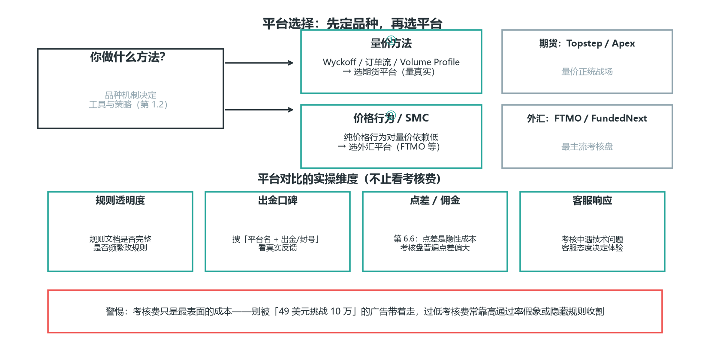
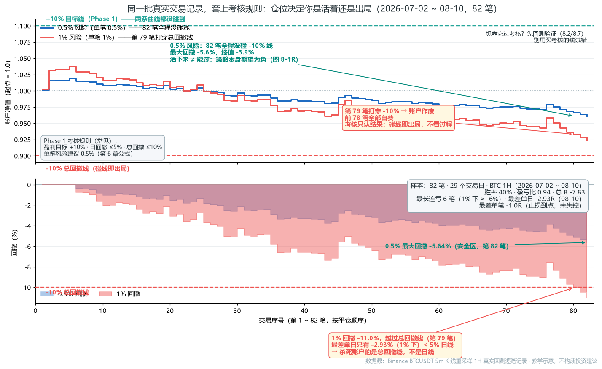
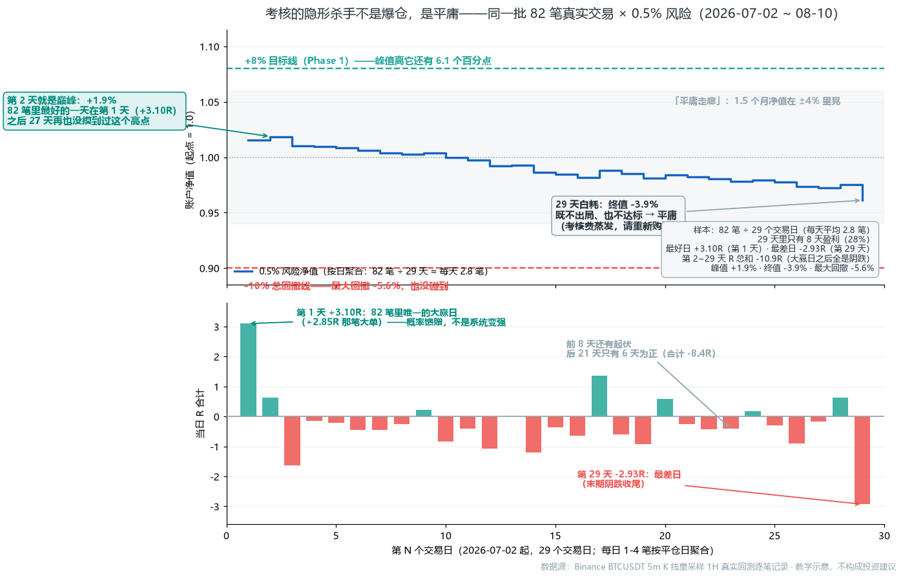
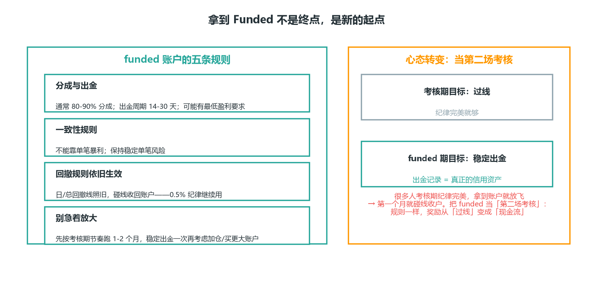
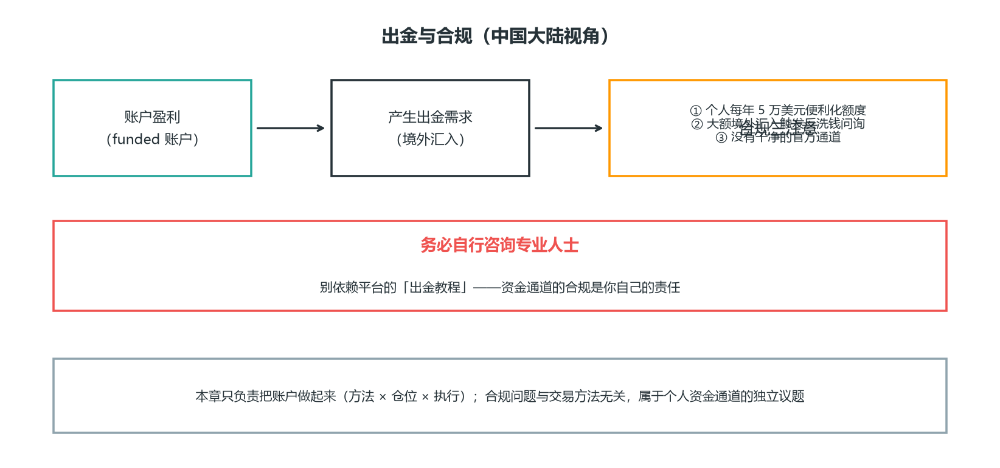
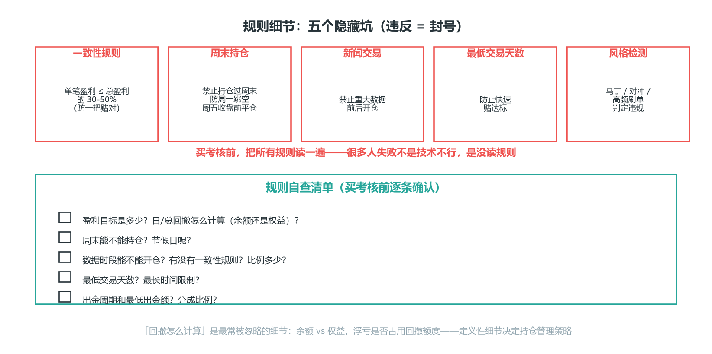
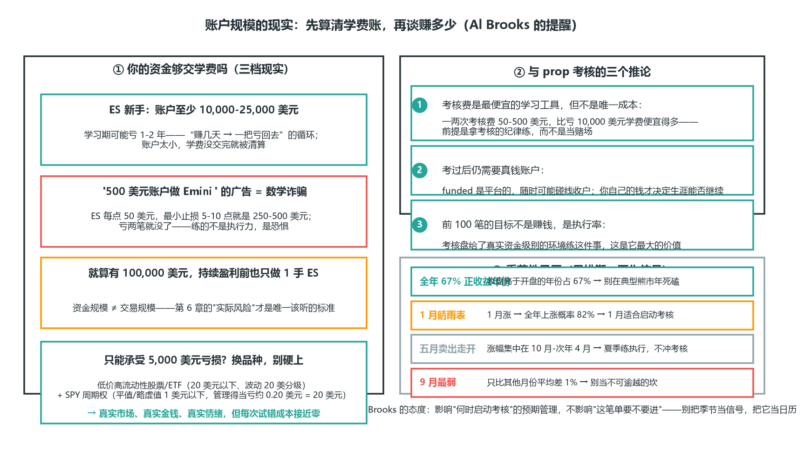

# 第 9 章 Prop Firm 考核实战

> **阅读提示**：本章把前 8 章装进 Prop 考核框架——先看 9.1 规则清单（盈利目标/回撤/期限），再读资金曲线管理、失败归因与考核进度阶梯；考核不是新系统，是同一套方法在不同约束下的应用。


本章解决一个问题：怎么通过 Prop Firm 考核、拿到并守住 funded 账户。前面所有的方法、仓位、出场，在这里都要服务于一个约束——考核规则。

### 9.1 考核的结构

主流零售 prop 考核是三段式：

```
Phase 1（挑战）──→ Phase 2（验证）──→ Funded（实盘分成）
 盈利目标 8-10%      盈利目标 5%        分成 80-90%
 日回撤 ≤5%          日回撤 ≤5%         遵守平台规则
 总回撤 ≤8-10%       总回撤 ≤8-10%
```

- **Phase 1**：盈利目标最高（8-10%），是主要淘汰关。
- **Phase 2**：目标减半（约 5%），规则相同，验证你不是运气。
- **Funded**：通过后获得资金账户，盈利分成 80-90%。多数仍是模拟盘对赌，少数真盘。

**记住约束的本质（呼应第 6 章）**：日回撤 5% 意味着你一天最多错 10 次（单笔 0.5% 风险时）。考核考的不是“你能赚多快”，是“你能不能稳定地不碰线”。

**考核设计的商业逻辑（看懂它，你就不焦虑了）**：平台卖的不是“让你赚钱”，是“考核费 + 对赌亏损”。大多数参与者亏掉考核费离场——平台的商业模式建立在“多数人过不了”上。所以考核的设计天然倾向：目标定得比散户的耐心长（1.5-2 个月），回撤定得比散户的纪律紧（碰线出局）。你的优势恰恰是多数人的反面：耐心 + 纪律。第 9.3 的数学会证明：**在系统期望值为正的前提下**（先回测验证，8.2/8.7），稳定执行的人通过是概率上的必然——注意这个前提，9.3 后半段的真实数据会展示没有它时的结局。


*图 9-1 考核三段式：Phase 1（8-10%）→ Phase 2（5%）→ Funded（80-90% 分成）*

### 9.2 平台选择

| 平台 | 类型 | 特点 |
| --- | --- | --- |
| FTMO | 外汇/CFD | 最老牌，规则清晰，口碑稳，分两阶段 |
| Topstep | 期货 | 期货量价真实，适合 Wyckoff/订单流方法 |
| Apex Trader Funding | 期货 | 考核费低，规则相对宽松 |
| FundedNext | 外汇 | 考核期即给部分分成 |

**选择要点**：

1. **先定品种再选平台**——做量价方法选期货平台（量真实），做价格行为/SMC 选外汇平台。
2. **读全规则**：周末持仓、新闻交易、一致性规则（consistency）、最低交易天数——违规直接封号，前面努力清零。
3. **警惕过低的考核费**——有些靠“高通过率假象”或隐藏规则收割。

**平台对比的实操维度**（不止看考核费）：① 规则透明度（规则文档是否完整、是否频繁改规则）；② 出金口碑（搜索“平台名 + 出金/封号”看真实反馈）；③ 点差/佣金水平（第 6.6 讲过，点差是隐性成本，考核盘普遍点差偏大）；④ 客服响应（考核中遇到技术问题，客服态度决定你的体验）。考核费只是最表面的成本，别被“$49 挑战 $100k”的广告带着走。



*图 9-2 平台选择：先定品种再选平台——量价方法选期货、价格行为选外汇；四维度对比，警惕过低考核费*

### 9.3 达标节奏的数学（本章核心）

用第 6 章的期望值算一笔账。假设：单笔风险 0.5%，RR=2，胜率 40%。

```
每笔期望值 = 0.4×2R − 0.6×1R = 0.2R
每笔期望收益率 = 0.2 × 0.5% = 0.1%
Phase 1 目标 8% → 理论需 80 笔
每天 2-3 笔 → 约 27-40 个交易日 ≈ 1.5-2 个月
```

**对比：重仓（单笔风险 2%）**

```
每笔期望收益率 = 0.2 × 2% = 0.4%
8% → 理论只需 20 笔 ≈ 1-2 周
但：连亏 3 笔累计 ≈ −5.9%（0.98³），直接打穿 5% 日回撤线
连亏 3 笔的概率 = 0.6³ ≈ 21.6%（任取连续 3 笔，约五分之一全是亏）
长期重仓，必然撞上 → 淘汰
```

**结论**：重仓把“1.5 个月”压缩成“1-2 周”，代价是把淘汰概率从低拉到接近必然。**考核的正确节奏是“慢就是快”**——用 0.5% 风险稳定推进，让概率站在你这边。


*图 9-3 轻仓 vs 重仓：0.5% 风险 80 笔稳步达标，2% 风险 20 笔左右撞线出局*

**两个实操推论**：

- 别盯“还差几个点达标”，盯“今天的风险预算用了多少”。盯目标会诱导重仓，盯风险不会。
- 达标时间 1.5-2 个月是正常的。任何承诺“一周过考核”的方法，本质都是重仓赌博。

**上面是合成示意，下面用真实数据把同一个道理跑一遍**。还是图 8-1R 那 82 笔真实逐笔记录（EMA20/50 在 BTC 1H，期望为负的策略），套上考核规则：目标 +10%、日回撤 ≤5%、总回撤 ≤10%（本图按 10% 目标；后面图 9-2R/9-3R 改用 8% 目标——Phase 1 目标区间 8-10% 的下限，口径更严，结论不变）。唯一变量是单笔风险——0.5% 还是 1%：


*图 9-1R 真实数据：同一批真实交易记录，0.5% vs 1% 单笔风险在考核规则下的结局（数据源：Binance BTCUSDT 5m K 线重采样 1H 逐笔回测记录）*

**这张图要读出的三件事**（这比图 9-3 的合成示意更扎心，因为是真实数据）：

1. **同样的交易、不同的仓位 → 完全不同的结局**。0.5%：82 笔全程在 -10% 线之上，最大回撤 -5.6%，安全区；1%：第 80 笔打穿总回撤线，前 79 笔全部白费——**考核只认结果，碰线即出局，不看过程**。前 79 笔你做得再“对”，第 80 笔一样清零。
2. **杀死账户的是总回撤线，不是日线**。最差单日只有 -2.93%（1% 下），离 5% 日线很远——但累计回撤悄悄越过 -10%。日线看得见（一天亏 5% 你会立刻警觉），总回撤线是“温水煮青蛙”——等你发现时已经出局。**盯回撤曲线，别只盯今天的盈亏**。
3. **0.5% 活下来了，但也没达标**——因为它背后的策略期望为负（图 8-1R：SQN -1.4）。这补上了合成示意没讲的另一半：轻仓只是“不出局”的必要条件，不是“能达标”的充分条件。**先回测验证（8.2/8.7），再买考核**——别用考核费的钱试错，回测在模拟盘之前就告诉你答案。

**和 9.3 的数学对上了**：图 9-3 说的是“重仓把 1.5 个月压缩成 1-2 周，代价是淘汰概率拉到必然”；这张真实图就是那个“必然”的实证——1% 都嫌重（连 0.5% 的目标都过不了，何况翻倍）。“慢就是快”不是口号，是数学：**仓位不是“想赚多少”的旋钮，是“能不能活到概率兑现”的开关**。

**数学的进一步展开（为什么是 80 笔而不是“赚够就走”）**：0.2R 期望值是“每笔平均”，但实际分布是大多数笔在 −1R 到 +1R 之间摆动。80 笔的意义在于让大数定律生效——**大数定律说的是：笔数越多，样本平均收益越收敛到期望值，运气的影响被摊薄**。但它只承诺“方向”，不承诺“80 笔一定够”：按真实样本的波动（σ≈0.6R）估算，80 笔总收益落在期望一半以下（< +8R ≈ +4%）的概率仍有约 7%——收敛不等于稳过，只是把“纯运气失败”压到很小。20 笔就撞线的重仓者，赌的是“前 20 笔运气好”——那不是交易，是掷硬币。

**再从“天数”的角度看一遍同一个事实**。9-1R 比的是“两个仓位”，这一张只看 0.5% 风险这一条线，但把横轴从“第几笔”换成“第几天”——考核考的是时间，不是笔数。同样是那 82 笔真实交易（2026-07-02 ~ 08-10，29 个交易日，每天平均 2.8 笔），按交易日聚合：


*图 9-2R 真实数据：考核的隐形杀手不是爆仓，是平庸——82 笔真实交易 × 0.5% 风险按日聚合（数据源：Binance BTCUSDT 5m K 线重采样 1H 逐笔回测记录）*

**这张图要读出三件事**：

1. **第 2 天就是巅峰**。82 笔里最好的一天出现在开头——第 1 天 2 笔合计 +3.10R（含图 8-1R 里那笔 +2.85R 大单），净值到 +1.6%；第 2 天（累计第 5 笔）累计 R 冲到 +3.72R 峰值，净值 +1.9%，就是图 9-5R 标注的那个峰。之后 27 天再也没摸到过这个高点。**前两天的“好”是概率馈赠，不是系统变强了**（呼应 7.3 近因偏差：别用最近几天判断系统）。注意：开头的大赢不是“方法对”，是 82 笔分布里恰好排在前面的运气——如果考核在第 2 天结束，你会以为自己很行；考核在第 29 天结束，你看到真相。
2. **1.5 个月里你哪条线都没碰到**。峰值 +1.9%，离 +8% 目标线差 6.1 个百分点；最大回撤 −5.6%，离 −10% 出局线也远。**考核里最难受的不是爆仓，是平庸**——0.5% 纪律保护你不死，但系统期望为负时，“活着”只是让你无限期地不上不下。29 天里只有 8 天盈利（27.6%），大赢日之后的 28 天合计 −10.9R，大多数日子是小亏、小亏、小亏。
3. **平台赚的就是“平庸重考”的钱**。9.1 说过平台的商业模式建立在“多数人过不了”上——这句话有两层：一层是重仓者撞线出局（图 9-1R 的 1%），另一层是**轻仓者永远不达标、考核费无限续费**。0.5% 纪律能保你不死，但救不了一个不合格的系统——**先回测验证（8.2/8.7），再买考核；不然你每多活一天，就多烧一天考核费**。

**最后一个问题：既然轻仓平庸，那把风险调高，是不是就能“搏”到达标？** 9-1R 比了两个仓位、9-2R 看了时间维度——这一张把单笔风险从 0.25% 到 3% 完整扫一遍，并让蒙特卡洛回答“概率”：还是那 82 笔真实交易（总 R −7.83，期望为负），考核规则不变（+8% 达标、−10% 总回撤出局，与图 9-2R 同口径），但每一档风险都把 82 笔随机重排 20000 次，统计三种结局（达标/出局/平庸）的比例：


*图 9-3R 真实数据：考核通过率 Monte Carlo——同一批 82 笔真实交易 × 7 档风险 × 重排 20000 次的达标/出局/平庸概率（数据源：Binance BTCUSDT 5m K 线重采样 1H 逐笔回测记录）*

**这张图要读出三件事**：

1. **真实顺序只有一次，它可能骗你**。把 82 笔按真实出场顺序只跑一遍：0.25%~1.0% 全平庸、1.5%/2.0% 出局——但 3.0% 那次第 2 笔就达标了：+2.85R 那笔大单 × 3% 风险 = +8.55%，净值直接冲过 +8% 线。**如果你在考核第 2 天看到 +9.4%，你会以为“重仓就是快”**——但蒙特卡洛重排 20000 次告诉你：3.0% 档的达标率只有 14.1%，出局率 85.9%。单次达标是运气不是方法（呼应 8.2 样本量幻觉 / 7.3 近因偏差：别拿一次结果给方法定性）。
2. **概率的全貌是“风险越高出局越快”**。低风险 0.25%/0.5%：平庸 100%，0% 达标、0% 出局（就是图 9-2R 的平庸重考）；1.0%：出局 38.7% 开始出现，但平庸仍 61.3%、达标 0%——两头不讨好；1.5% 起：出局 85.9%~99.1%，平庸归零。**调高风险不是在“搏达标”，是在“送出局”**——达标率曲线全档最高只有 14.1%，出局率曲线 1.5% 起就压在 86% 以上、3% 档高达 99.1%。
3. **三张真实图合起来就是一句话：不合格的系统，买考核 = 烧钱**。9-1R 告诉你 1% 会撞线（真实顺序里 1.0% 恰好在第 80 笔出局，和 9-1R 画的同一次、同一笔）、9-2R 告诉你 0.5% 会平庸、这一张告诉你整条风险谱上没有任何一档能让你“大概率达标”——**因为问题不在仓位，在系统期望为负（图 8-1R）**。先回测验证（8.2/8.7）再买考核，别用考核费替回测交学费。

### 9.4 常见失败原因

按频率排序：

1. **重仓冲刺**——想快点达标，单笔 2%+，连亏即爆（见 9.3 的数学）。
2. **报复交易**——连亏后情绪化加仓，一天亏穿日回撤（第 7 章军规第 2、3 条就是防这个）。
3. **违规**——周末持仓、新闻时段交易、对冲锁仓，被平台判定违规封号。
4. **过度交易**——一天 10 笔，点差成本吃掉利润，还放大情绪风险。
5. **忽视一致性规则**——部分平台要求单笔盈利不超过总盈利的某比例，靠一笔重仓大赚达标反而不给过。

**这五条的共同点**：没有一条是“技术不行”。它们全是纪律问题——方法（第 2-5 章）和仓位（第 6 章）都教过了，失败发生在执行层。这也是第 7 章放在第 9 章前面的原因：考核期 = 方法 × 仓位 × 执行，三者缺一不可。


*图 9-4 考核为什么失败：左=五类失败原因按频率排序（示意值），重仓冲刺最高、忽视一致性规则最低，全是纪律问题；右=方法 × 仓位 × 执行三角——三者缺一不可，考核通过是三者都满足的结果*

左图的排序说明一件事：**排在前面的是“想快点达标”的冲动，不是“不懂技术”**——重仓冲刺和报复交易本质上都是情绪驱动的仓位失控（第 6 章就是给仓位装刹车）。右图的三角把第 2-9 章的结构压成一句话：方法教你怎么看市场，仓位教你怎么活下来，执行教你怎么把前两者变成每一笔一致的动作。9.8 的案例里 72 笔全部按计划执行，就是在给这个三角补全最后一条边。

**"一天亏穿日回撤"不是市场给的，是自己加的**：失败原因第 2 条（报复交易）里最常出现的场景是"今天已经亏了，必须赚回来"——然后一天打穿日回撤线出局。下面用那 82 笔真实交易把"最危险的一天"单独拎出来看：82 笔按交易日聚合后，最差的是 08-10——5 笔全亏（总 R −2.93），但正常 0.5% 风险下这一天只亏 −1.47%，5% 日回撤线根本没碰到；同一天如果连亏加码，结局完全不同：


*图 9-4R 真实数据：考核中最危险的一天——最差日 08-10 五连亏：纪律只亏 1.5%，报复 ×2 一天打穿 5% 日回撤线（数据源：Binance BTCUSDT 5m K 线重采样 1H 逐笔回测记录）*

这张图要读出三件事：

- **（①）单日最差也打不死纪律者**。82 笔 29 天里，最差的一天是 08-10（5 笔全亏），正常 0.5% 风险日亏只有 −1.47%——5% 日回撤线、10% 总回撤线都离得很远。上方的柱子告诉你负期望系统的常态：**29 天里只有 8 天是正的，中位日 R −0.35**——考核不是"天天赢"，是"熬过大多数亏的日子，别在少数极端的日子里自我了断"。
- **（②）同一天，报复 ×2 一天打穿**。下方的三条线是 08-10 同一批 5 笔交易（全是亏损）在三种资金管理下的当日累计亏损：固定 0.5% 只走到 −1.47%；连亏 ×1.5 走到 −3.64%（逼近 5%）；连亏 ×2 到第 5 笔走到 −8.47%——**5% 日回撤线被打穿，当天出局**。这就是失败原因第 2 条的完整机制："一天亏穿日回撤"不是市场给的，是自己一笔一笔加出来的。
- **（③）最差日全是亏单不是偶然，日回撤线就是逼你收手**。08-10 的 5 笔全是亏损——40% 胜率下连亏必现（图 7-3R：P≥6=80.5%），考核期你**一定会**遇到这样的日子。平台设 5% 日回撤线的目的就在这：**它把"今天必须赚回来"的冲动变成物理上的不可能**——一旦当日亏到 5%，你连继续报复的机会都没有，只能收工（呼应军规第 3 条"日回撤 3% 停手"：3% 停手 = 在 5% 出局线前留 2% 缓冲）。正确的动作永远是：确认系统没坏（7.4）+ 按原风险继续或降预算，而不是加码。

### 9.5 拿到 Funded 之后

通过考核不是终点，是新的起点——funded 账户有自己的规则：

- **分成与出金**：通常 80-90% 分成，出金周期 14-30 天，可能有最低盈利要求。
- **一致性规则**：很多平台要求不能靠单笔暴利（防重仓赌一把），保持稳定的单笔风险。
- **回撤规则依旧生效**：funded 账户同样有日/总回撤线，碰线收回账户。考核期养成的 0.5% 纪律，funded 期继续用。
- **别急着放大**：拿到账户后先按考核期的节奏跑 1-2 个月，稳定出金一次，再考虑加仓或买更大账户。

**funded 期的心态转变**：考核期的目标是“过线”，funded 期的目标是“稳定出金”——出金记录才是你真正的信用资产。很多人在考核期纪律完美，拿到账户就放飞（“反正考核过了”）——结果第一个月就碰线收户。把 funded 当“第二场考核”：规则一样，只是奖励从“过线”变成了“现金流”。



*图 9-5 拿到 Funded 之后：funded 不是终点——把 funded 当第二场考核，规则一样，奖励从“过线”变成“现金流”*

### 9.6 出金与合规（简要）

如果你在中国大陆，funded 出金涉及外汇合规的灰色地带——个人每年 5 万美元便利化额度、大额境外汇入的反洗钱问询。这部分没有干净的官方通道，务必自行咨询专业人士，别依赖平台的“出金教程”。

本章只负责把账户做起来，资金通道的合规是你自己的责任。



*图 9-6 出金与合规：没有干净的官方通道，资金通道的合规是你自己的责任——务必自行咨询专业人士*

### 9.7 规则细节（容易踩的坑）

除了盈利目标和回撤，各平台还有隐藏规则，违反=封号：

- **一致性规则（consistency）**：部分平台要求单笔盈利不超过总盈利的某个比例（如 30-50%），防止“一把重仓赌对”。所以不能靠一笔大单达标，要分散盈利。
- **周末持仓**：很多平台禁止持仓过周末（防周一跳空）。周五收盘前平仓。
- **新闻交易**：部分平台禁止重大数据前后开仓。
- **最低交易天数**：有的要求最少交易天数，防止快速赌达标。
- **风格检测**：检测马丁、对冲、高频刷单等，判定违规。

**买考核前，把所有规则读一遍**。很多人失败不是技术不行，是没读规则。

**规则自查清单（买考核前逐条确认）**：

- [ ] 盈利目标是多少？日回撤/总回撤怎么计算（用余额还是权益）？
- [ ] 周末能不能持仓？节假日呢？
- [ ] 数据时段能不能开仓？
- [ ] 有没有一致性规则？比例多少？
- [ ] 最低交易天数？最长时间限制？
- [ ] 出金周期和最低出金额？分成比例？

“回撤怎么计算”是新手最常忽略的细节：有的平台用“账户余额”（已实现盈亏），有的用“账户权益”（含浮动盈亏）——用权益算的，浮亏就会占用回撤额度，持仓管理策略完全不同。读规则时把这类定义性细节抠清楚，写进你的考核计划。



*图 9-7 规则细节：五坑五防——买考核前把所有规则读一遍，很多人失败不是技术不行，是没读规则*

### 9.8 案例：一次完整考核过程

用数字走一遍标准考核（FTMO 式，$100k 账户）：

**规则**：Phase 1 目标 10%，日回撤 ≤5%，总回撤 ≤10%，单笔风险 0.5%。

- 第 1-2 周：18 笔，胜率 40%，盈亏比 2.2，盈利 +2.5%。（中间连亏 2 笔，休息一天）
- 第 3-4 周：18 笔，盈利 +2.5%。累计 +5.0%。
- 第 5-6 周：18 笔，盈利 +2.5%。累计 +7.5%。
- 第 7-8 周：18 笔，盈利 +2.5%。累计 +10.0%，通过 Phase 1。共 72 笔，约 2 个月。
- Phase 2：目标 5%，同样方法，约 1 个月通过。
- Funded：保持 0.5% 风险，首月盈利 +4%，出金 80% 分成。

**关键**：全程无重仓、无报复、无违规——慢，但每一步都稳。这就是“慢就是快”，下面用数学拆开看。

**案例的解读（数学版）**：胜率只有 40%、盈亏比 2.2，数学怎么兑现成 10%？分两步：

1. **每笔期望（以 R 计）** = 0.4×2.2 − 0.6×1 = 0.28R；
2. **折成收益率**：0.28 × 0.5%（单笔风险）= 0.14%/笔 → 72 笔 × 0.14% ≈ 10.1% ≈ 10%。

**关键认识**：达标不是靠某笔爆发，而是“小优势 × 大样本”的确定性累积——全程无回撤浪费（连亏 2 笔后休息，没有放大亏损段）。盈亏比 2.2 略优于 9.3 的基准假设（RR=2，期望 0.1%/笔、需 80 笔），所以 72 笔就够——这就是“略高的盈亏比 + 稳定执行”带来的时间差。


*图 9-8 一次完整考核的进度阶梯：8 周 72 笔稳稳 +10%（红线一次不碰）；Phase 2 与 Funded 摘要（编者按 9.8 数字绘制）*

阶梯的每个台阶都是“18 笔 × 0.14% ≈ 2.5%”的稳定累积；上方 10% 目标线、下方 -5% 日回撤线与 -10% 总回撤线始终没被碰到——考核的本质不是“冲得高”，是**在两条红线之间稳稳爬到目标**。Phase 2 与 Funded 期纪律不变（单笔 ≤0.5%、总敞口 ≤1.5%），奖励从“过线”变成“现金流”。

### 9.9 账户规模的现实（Al Brooks 的提醒）

prop 考核看起来很香——花几十到几百美元就能“管”十万账户。但请先算清另一笔账：**你自己的资金够不够支撑学习期**。Al Brooks 给过一个直白到刺耳的估算：

- **新手交易 Emini（ES），账户至少需要 10,000-25,000 美元**。原因是学习期可能要亏 1-2 年——不是天天亏，而是“连续几天盈利然后一把亏回去”的循环。账户太小，学费还没交完就被清算了。
- 那些“$500 账户做 Emini”的广告是数学诈骗：ES 每点 $50，最小止损 5-10 点就是 $250-500——亏两笔就没了，你根本没机会练“执行力”，练的是“恐惧”。
- 即使你有 $100,000，在持续盈利之前也应该**只做 1 手 ES**。资金规模不等于交易规模，第 6 章“实际风险”才是唯一该听的标准。
- 如果只能承受 $5,000 的亏损，别碰 ES：选低价高流动性的股票/ETF（$20 以下、日内波动 20 美分级），或者**SPY 周期权**——平值/略虚值的 SPY 期权通常 $1 以下（常低于 $0.50），管理得当亏损常控制在 $0.20（即 $20）以内。这是把“学费”降到最低的合法途径：真实市场、真实金钱、真实情绪，但每次试错的成本接近零。

**这跟 prop 考核有什么关系？** 三个推论：

1. **考核费是最便宜的学习工具，但不是唯一的成本**：一两次考核费（$50-500）比亏掉 $10,000 学费便宜得多——但前提是你在考核里用考核的纪律练，而不是把它当赌场。
2. **考过之后你仍然需要真钱账户**：funded 账户是平台的，你随时可能碰线收户。真正属于你的钱——哪怕只有 $5,000——决定你的交易生涯能否继续。别把全部积蓄都花在买考核上。
3. **学习期用最小风险标定执行**：无论考核盘还是自己的小账户，前 100 笔交易的目标都不是赚钱，是“执行率”（第 8.7）。考核盘给了你一个真实资金级别的环境（虽然多数是模拟盘对赌）来练这件事，这是它最大的价值。

**一个补充：季节性（日历观察，仅供参考）**：Brooks 提到过几个有统计依据的日历规律，表格化如下：

| 规律 | 统计数字 | 对考核的用法 |
|---|---|---|
| 全年正收益年份 | 收盘价高于开盘价的年份占 67% | 别在典型熊市年死磕 |
| 1 月晴雨表 | 1 月涨 → 全年上涨概率 82%、2-12 月平均涨幅 8.5%；1 月跌 → 全年 58% 概率下跌、平均涨幅仅 1.7% | 1 月是启动考核的好月份 |
| 五月卖出走开 | 美股大部分涨幅集中在 10 月到次年 4 月 | 夏季适合练执行，不适合冲考核 |
| 9 月最弱 | 标普平均只比其他月份差 1%（且这一天随时可能来） | 别把 9 月当不可逾越的坎 |

**Brooks 自己的态度**：这些统计有效，但对构建单笔交易没有帮助——它们影响的是“什么时候启动考核、什么时候给自己放假的预期管理”，不是“这笔单要不要进”。**别把季节当信号，把它当日历。**

**周内与节假日效应（同样仅供参考）**：

- **周效应**：美股历史统计中，周一（尤其月初第一个周一）负收益频率略高，周五/月末买入频率更高——但这些效应幅度小、分布宽，对日内系统基本无意义；对考核有意义的只有一条：**周一开盘常消化周末消息，跳空多（呼应 1.6），开盘头 15 分钟的假突破率偏高**——周一用 4.26 ORB 时等二次确认，别抢开盘第一笔。
- **节假日效应**：长假（感恩节/圣诞/春节）前成交缩量、趋势减弱（机构提前放假），假前假后常出现“方向缺失日”——状态机（4.7）会判定为区间/铁丝网，正确动作是不做；节后第一个交易日波动恢复，但跳空消化需要时间。A 股春节/国庆长假尤其明显：长假后首日大幅跳空常见，日内系统直接跳过首日或按 1.6 跳空规则处理。
- **与考核节奏的落地**：日历效应唯一合理的用法是**排期**——1 月适合启动考核（全年大概率偏多），9 月/长假前后不是休息的理由，但适合用周效应错开“周一大行情日”的考核冲刺。统计只能改你的节奏，不改你的入场。

"学费"不是感觉，是数学。用我们一直在用的那套真实回测（EMA20/50，82 笔逐笔 R，BTC 1H，2026-07-02 ~ 08-10）把"$500 做 Emini"这句话算成数字（数据源：Binance BTCUSDT 5m）：


*图 9-5R 真实数据：账户规模的现实——负期望系统就是一台学费榨汁机；最小止损 5 点是市场给的，账户太小连一档都扛不住*

这张真实图把"账户太小会被淘汰"落到了逐笔账本上，三件事：

- **（①）学费是"笔数 × 单笔风险 × 总 R"的硬账**：82 笔累计 R 终值 -7.83R——系统本身输得很稳定（峰在第 5 笔 +3.72R，之后几乎一路向下）。换算成美元：ES 5 点止损（$250/笔）→ $1,958；8 点（$400/笔）→ $3,132；10 点（$500/笔）→ $3,915。**同一个系统，止损越宽学费越贵**——这就是 Brooks 说"学习期可能要亏 1-2 年"的算术版本：不是每天亏，是赚几把再一把亏回去（呼应 9.4 最差日 08-10）。
- **（②）最小止损是市场给的，不是你能选的**：ES 每点 $50，最小止损 5-10 点就是 $250-500/笔。0.5% 单笔风险规则反推回去：账户至少要有 $50,000 才扛得住 5 点止损；$25K 只能 2.5 点、$5K 只能 0.5 点、**$500 只能 0.05 点——一个报价跳动都扛不住**。所谓"小止损练小账户"在 ES 上不存在：止损小到一定程度就不是止损，是噪声。
- **（③）$500 账户的死法是"第 35 笔归零"**：1 手 ES、5 点止损（$250/笔）按真实 82 笔顺序滚动——第 5 笔冲到 $1,430（+186%，先让你尝到甜头），第 35 笔资金归零。**不是"慢慢亏光"，是练执行力之前就出局了**；之后若平台还让负数硬撑，账面终值 -$1,458。这就是 9.9 说"练的不是执行力，是恐惧"的实证：账户太小，你练的是扛单和绝望，不是交易。

把 9.9 的三层内容（学费预算三档现实 → 与 prop 的三个推论 → 季节性日历）压成一张速查图：



*图 9-9 账户规模的现实：先算清学费账再谈赚多少——学费三档 × 考核三推论 × 季节性日历（只排期不作信号）*

### 本章自测（答案在本节末尾）

1. 考核期单笔风险多少？用 9.3 的数学解释为什么不能重仓？
2. 考核失败原因排前二的是什么？它们的共同点是什么？
3. 拿到 Funded 之后应该用什么节奏？为什么？
4. 一致性规则（consistency）是什么？平台为什么要设它？
5. 9.8 案例里 72 笔是怎么凑出 10% 的？

**答案**：① 0.5%——重仓把达标时间从 1.5 个月压缩到 1-2 周，但连亏 3 笔概率 21.6%，长期重仓必然撞线（9.3）；② 重仓冲刺、报复交易——没有一条是技术问题，全是执行层纪律问题（9.4），这就是第 7 章放在第 9 章前面的原因；③ 先按考核期节奏跑 1-2 个月、稳定出金一次再放大（9.5）——把 Funded 当第二场考核，出金记录才是真正的信用资产；④ 单笔盈利不能超过总盈利的某个比例（如 30-50%），防止“一把重仓赌对”——平台靠它防风格漂移，你也靠它守住纪律（9.7）；⑤ 每笔期望 0.28R（0.4×2.2−0.6×1）× 0.5% 风险 = 0.14%/笔 × 72 笔 ≈ 10.1%——不是靠某笔爆发，是小优势 × 大样本的累积（9.8）。

### 本章小结：速查卡

**① 考核结构**

- 考核是三段式：Phase 1（8-10%）→ Phase 2（5%）→ Funded。
- 先定品种再选平台，读全规则（周末/新闻/一致性）。

**② 达标数学**

- 0.5% 风险 + RR2 + 40% 胜率 → 每笔 +0.1%，8% 约需 80 笔、1.5-2 个月。重仓提速 = 把淘汰变成必然。
- 慢就是快：盯风险预算，不盯达标点数。

**③ 失败原因与纪律**

- 五大失败原因：重仓、报复、违规、过度交易、忽视一致性。
- Funded 后规则依旧，纪律不变，别急着放大。
- 账户规模决定学习期存活：Emini 新手至少 10-25K 美元；小账户用低价 ETF 或 SPY 周期权交学费。

至此方法论闭环完成。最后的附录提供术语速查和学习资源。
