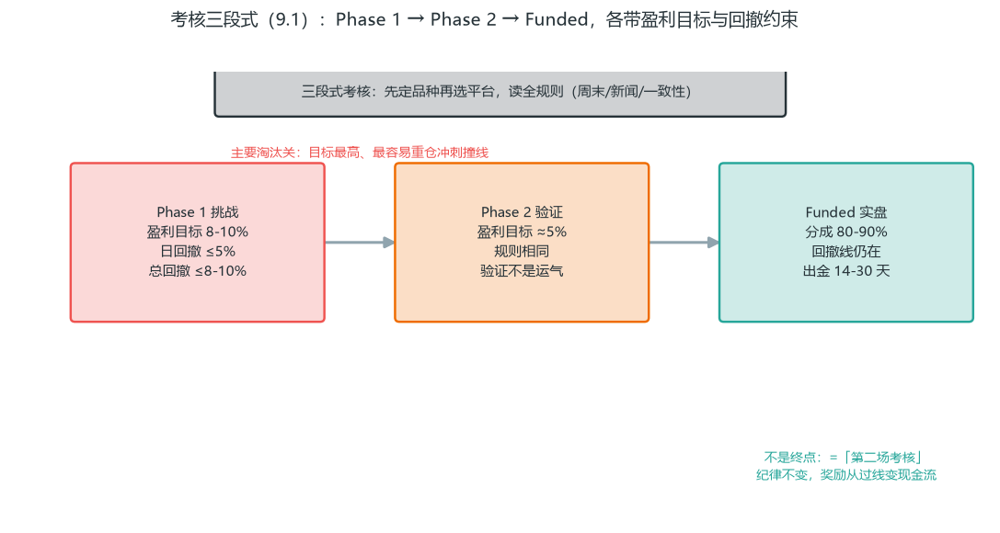
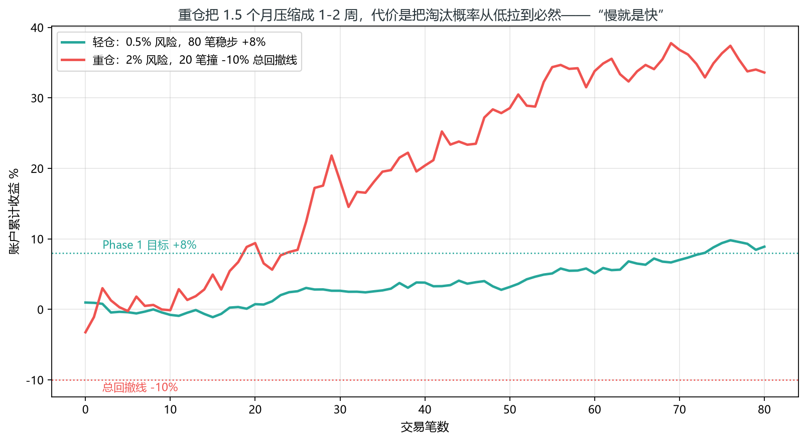
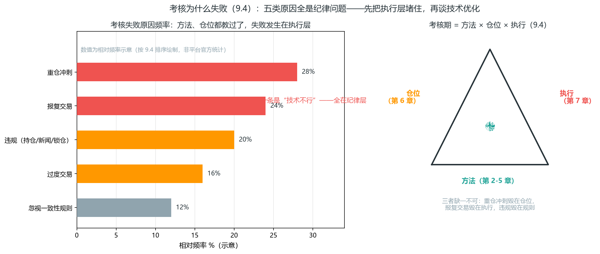
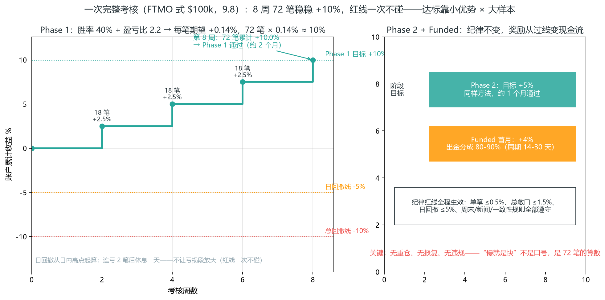

# 第 9 章 Prop Firm 考核实战

> **阅读提示**：本章把前 8 章装进 Prop 考核框架——先看 9.1 规则清单（盈利目标/回撤/期限），再读资金曲线管理、失败归因与考核进度阶梯；考核不是新系统，是同一套方法在不同约束下的应用。


本章解决一个问题：怎么通过 Prop Firm 考核、拿到并守住 funded 账户。前面所有的方法、仓位、出场，在这里都要服务于一个约束——考核规则。

### 9.1 考核的结构

主流零售 prop 考核是三段式：

```
Phase 1（挑战）──→ Phase 2（验证）──→ Funded（实盘分成）
 盈利目标 8-10%      盈利目标 5%        分成 80-90%
 日回撤 ≤5%          日回撤 ≤5%         遵守平台规则
 总回撤 ≤8-10%       总回撤 ≤8-10%
```

- **Phase 1**：盈利目标最高（8-10%），是主要淘汰关。
- **Phase 2**：目标减半（约 5%），规则相同，验证你不是运气。
- **Funded**：通过后获得资金账户，盈利分成 80-90%。多数仍是模拟盘对赌，少数真盘。

**记住约束的本质（呼应第 6 章）**：日回撤 5% 意味着你一天最多错 10 次（单笔 0.5% 风险时）。考核考的不是"你能赚多快"，是"你能不能稳定地不碰线"。

**考核设计的商业逻辑（看懂它，你就不焦虑了）**：平台卖的不是"让你赚钱"，是"考核费 + 对赌亏损"。大多数参与者亏掉考核费离场——平台的商业模式建立在"多数人过不了"上。所以考核的设计天然倾向：目标定得比散户的耐心长（1.5-2 个月），回撤定得比散户的纪律紧（碰线出局）。你的优势恰恰是多数人的反面：耐心 + 纪律。第 9.3 的数学会证明，稳定执行的人通过是概率上的必然。



### 9.2 平台选择

| 平台 | 类型 | 特点 |
| --- | --- | --- |
| FTMO | 外汇/CFD | 最老牌，规则清晰，口碑稳，分两阶段 |
| Topstep | 期货 | 期货量价真实，适合 Wyckoff/订单流方法 |
| Apex Trader Funding | 期货 | 考核费低，规则相对宽松 |
| FundedNext | 外汇 | 考核期即给部分分成 |

**选择要点**：

1. **先定品种再选平台**——做量价方法选期货平台（量真实），做价格行为/SMC 选外汇平台。
2. **读全规则**：周末持仓、新闻交易、一致性规则（consistency）、最低交易天数——违规直接封号，前面努力清零。
3. **警惕过低的考核费**——有些靠"高通过率假象"或隐藏规则收割。

**平台对比的实操维度**（不止看考核费）：① 规则透明度（规则文档是否完整、是否频繁改规则）；② 出金口碑（搜索"平台名 + 出金/封号"看真实反馈）；③ 点差/佣金水平（第 6.6 讲过，点差是隐性成本，考核盘普遍点差偏大）；④ 客服响应（考核中遇到技术问题，客服态度决定你的体验）。考核费只是最表面的成本，别被"$49 挑战 $100k"的广告带着走。

### 9.3 达标节奏的数学（本章核心）

用第 6 章的期望值算一笔账。假设：单笔风险 0.5%，RR=2，胜率 40%。

```
每笔期望值 = 0.4×2R − 0.6×1R = 0.2R
每笔期望收益率 = 0.2 × 0.5% = 0.1%
Phase 1 目标 8% → 理论需 80 笔
每天 2-3 笔 → 约 27-40 个交易日 ≈ 1.5-2 个月
```

**对比：重仓（单笔风险 2%）**

```
每笔期望收益率 = 0.2 × 2% = 0.4%
8% → 理论只需 20 笔 ≈ 1-2 周
但：连亏 3 笔 = -6%，叠加日内波动逼近 5% 日线
连亏 3 笔的概率 = 0.6³ ≈ 21.6%（每 5 个连亏段就有 1 个）
长期重仓，必然撞上 → 淘汰
```

**结论**：重仓把"1.5 个月"压缩成"1-2 周"，代价是把淘汰概率从低拉到接近必然。**考核的正确节奏是"慢就是快"**——用 0.5% 风险稳定推进，让概率站在你这边。



**两个实操推论**：

- 别盯"还差几个点达标"，盯"今天的风险预算用了多少"。盯目标会诱导重仓，盯风险不会。
- 达标时间 1.5-2 个月是正常的。任何承诺"一周过考核"的方法，本质都是重仓赌博。

**数学的进一步展开（为什么是 80 笔而不是"赚够就走"）**：0.2R 期望值是"每笔平均"，但实际分布是大多数笔在 −1R 到 +1R 之间摆动。80 笔的意义在于让大数定律生效——40% 胜率 + RR2 的系统，80 笔之后收益收敛到正态分布的中心（期望值附近），运气的影响被摊薄。20 笔就撞线的重仓者，赌的是"前 20 笔运气好"——那不是交易，是掷硬币。

### 9.4 常见失败原因

按频率排序：

1. **重仓冲刺**——想快点达标，单笔 2%+，连亏即爆（见 9.3 的数学）。
2. **报复交易**——连亏后情绪化加仓，一天亏穿日回撤（第 7 章军规第 2、3 条就是防这个）。
3. **违规**——周末持仓、新闻时段交易、对冲锁仓，被平台判定违规封号。
4. **过度交易**——一天 10 笔，点差成本吃掉利润，还放大情绪风险。
5. **忽视一致性规则**——部分平台要求单笔盈利不超过总盈利的某比例，靠一笔重仓大赚达标反而不给过。

**这五条的共同点**：没有一条是"技术不行"。它们全是纪律问题——方法（第 2-5 章）和仓位（第 6 章）都教过了，失败发生在执行层。这也是第 7 章放在第 9 章前面的原因：考核期 = 方法 × 仓位 × 执行，三者缺一不可。



左图的排序说明一件事：**排在前面的是"想快点达标"的冲动，不是"不懂技术"**——重仓冲刺和报复交易本质上都是情绪驱动的仓位失控（第 6 章就是给仓位装刹车）。右图的三角把第 2-9 章的结构压成一句话：方法教你怎么看市场，仓位教你怎么活下来，执行教你怎么把前两者变成每一笔一致的动作。9.8 的案例里 72 笔全部按计划执行，就是在给这个三角补全最后一条边。

### 9.5 拿到 Funded 之后

通过考核不是终点，是新的起点——funded 账户有自己的规则：

- **分成与出金**：通常 80-90% 分成，出金周期 14-30 天，可能有最低盈利要求。
- **一致性规则**：很多平台要求不能靠单笔暴利（防重仓赌一把），保持稳定的单笔风险。
- **回撤规则依旧生效**：funded 账户同样有日/总回撤线，碰线收回账户。考核期养成的 0.5% 纪律，funded 期继续用。
- **别急着放大**：拿到账户后先按考核期的节奏跑 1-2 个月，稳定出金一次，再考虑加仓或买更大账户。

**funded 期的心态转变**：考核期的目标是"过线"，funded 期的目标是"稳定出金"——出金记录才是你真正的信用资产。很多人在考核期纪律完美，拿到账户就放飞（"反正考核过了"）——结果第一个月就碰线收户。把 funded 当"第二场考核"：规则一样，只是奖励从"过线"变成了"现金流"。

### 9.6 出金与合规（简要）

如果你在中国大陆，funded 出金涉及外汇合规的灰色地带——个人每年 5 万美元便利化额度、大额境外汇入的反洗钱问询。这部分没有干净的官方通道，务必自行咨询专业人士，别依赖平台的"出金教程"。

本章只负责把账户做起来，资金通道的合规是你自己的责任。

### 9.7 规则细节（容易踩的坑）

除了盈利目标和回撤，各平台还有隐藏规则，违反=封号：

- **一致性规则（consistency）**：部分平台要求单笔盈利不超过总盈利的某个比例（如 30-50%），防止"一把重仓赌对"。所以不能靠一笔大单达标，要分散盈利。
- **周末持仓**：很多平台禁止持仓过周末（防周一跳空）。周五收盘前平仓。
- **新闻交易**：部分平台禁止重大数据前后开仓。
- **最低交易天数**：有的要求最少交易天数，防止快速赌达标。
- **风格检测**：检测马丁、对冲、高频刷单等，判定违规。

**买考核前，把所有规则读一遍**。很多人失败不是技术不行，是没读规则。

**规则自查清单（买考核前逐条确认）**：

- [ ] 盈利目标是多少？日回撤/总回撤怎么计算（用余额还是权益）？
- [ ] 周末能不能持仓？节假日呢？
- [ ] 数据时段能不能开仓？
- [ ] 有没有一致性规则？比例多少？
- [ ] 最低交易天数？最长时间限制？
- [ ] 出金周期和最低出金额？分成比例？

"回撤怎么计算"是新手最常忽略的细节：有的平台用"账户余额"（已实现盈亏），有的用"账户权益"（含浮动盈亏）——用权益算的，浮亏就会占用回撤额度，持仓管理策略完全不同。读规则时把这类定义性细节抠清楚，写进你的考核计划。

### 9.8 案例：一次完整考核过程

用数字走一遍标准考核（FTMO 式，$100k 账户）：

**规则**：Phase 1 目标 10%，日回撤 ≤5%，总回撤 ≤10%，单笔风险 0.5%。

- 第 1-2 周：18 笔，胜率 40%，盈亏比 2.2，盈利 +2.5%。（中间连亏 2 笔，休息一天）
- 第 3-4 周：18 笔，盈利 +2.5%。累计 +5.0%。
- 第 5-6 周：18 笔，盈利 +2.5%。累计 +7.5%。
- 第 7-8 周：18 笔，盈利 +2.5%。累计 +10.0%，通过 Phase 1。共 72 笔，约 2 个月。
- Phase 2：目标 5%，同样方法，约 1 个月通过。
- Funded：保持 0.5% 风险，首月盈利 +4%，出金 80% 分成。

**关键**：全程无重仓、无报复、无违规——慢，但每一步都稳。这就是"慢就是快"，下面用数学拆开看。

**案例的解读（数学版）**：胜率只有 40%、盈亏比 2.2，数学怎么兑现成 10%？分两步：

1. **每笔期望（以 R 计）** = 0.4×2.2 − 0.6×1 = 0.28R；
2. **折成收益率**：0.28 × 0.5%（单笔风险）= 0.14%/笔 → 72 笔 × 0.14% ≈ 10.1% ≈ 10%。

**关键认识**：达标不是靠某笔爆发，而是"小优势 × 大样本"的确定性累积——全程无回撤浪费（连亏 2 笔后休息，没有放大亏损段）。盈亏比 2.2 略优于 9.3 的基准假设（RR=2，期望 0.1%/笔、需 80 笔），所以 72 笔就够——这就是"略高的盈亏比 + 稳定执行"带来的时间差。



阶梯的每个台阶都是“18 笔 × 0.14% ≈ 2.5%”的稳定累积；上方 10% 目标线、下方 -5% 日回撤线与 -10% 总回撤线始终没被碰到——考核的本质不是“冲得高”，是**在两条红线之间稳稳爬到目标**。Phase 2 与 Funded 期纪律不变（单笔 ≤0.5%、总敞口 ≤1.5%），奖励从“过线”变成“现金流”。

### 9.9 账户规模的现实（Al Brooks 的提醒）

prop 考核看起来很香——花几十到几百美元就能"管"十万账户。但请先算清另一笔账：**你自己的资金够不够支撑学习期**。Al Brooks 给过一个直白到刺耳的估算：

- **新手交易 Emini（ES），账户至少需要 10,000-25,000 美元**。原因是学习期可能要亏 1-2 年——不是天天亏，而是"连续几天盈利然后一把亏回去"的循环。账户太小，学费还没交完就被清算了。
- 那些"$500 账户做 Emini"的广告是数学诈骗：ES 每点 $50，最小止损 5-10 点就是 $250-500——亏两笔就没了，你根本没机会练"执行力"，练的是"恐惧"。
- 即使你有 $100,000，在持续盈利之前也应该**只做 1 手 ES**。资金规模不等于交易规模，第 6 章"实际风险"才是唯一该听的标准。
- 如果只能承受 $5,000 的亏损，别碰 ES：选低价高流动性的股票/ETF（$20 以下、日内波动 20 美分级），或者**SPY 周期权**——平值/略虚值的 SPY 期权通常 $1 以下（常低于 $0.50），管理得当亏损常控制在 $0.20（即 $20）以内。这是把"学费"降到最低的合法途径：真实市场、真实金钱、真实情绪，但每次试错的成本接近零。

**这跟 prop 考核有什么关系？** 三个推论：

1. **考核费是最便宜的学习工具，但不是唯一的成本**：一两次考核费（$50-500）比亏掉 $10,000 学费便宜得多——但前提是你在考核里用考核的纪律练，而不是把它当赌场。
2. **考过之后你仍然需要真钱账户**：funded 账户是平台的，你随时可能碰线收户。真正属于你的钱——哪怕只有 $5,000——决定你的交易生涯能否继续。别把全部积蓄都花在买考核上。
3. **学习期用最小风险标定执行**：无论考核盘还是自己的小账户，前 100 笔交易的目标都不是赚钱，是"执行率"（第 8.7）。考核盘给了你一个真实资金级别的环境（虽然多数是模拟盘对赌）来练这件事，这是它最大的价值。

**一个补充：季节性（日历观察，仅供参考）**：Brooks 提到过几个有统计依据的日历规律，表格化如下：

| 规律 | 统计数字 | 对考核的用法 |
|---|---|---|
| 全年正收益年份 | 收盘价高于开盘价的年份占 67% | 别在典型熊市年死磕 |
| 1 月晴雨表 | 1 月涨 → 全年上涨概率 82%、2-12 月平均涨幅 8.5%；1 月跌 → 全年 58% 概率下跌、平均涨幅仅 1.7% | 1 月是启动考核的好月份 |
| 五月卖出走开 | 美股大部分涨幅集中在 10 月到次年 4 月 | 夏季适合练执行，不适合冲考核 |
| 9 月最弱 | 标普平均只比其他月份差 1%（且这一天随时可能来） | 别把 9 月当不可逾越的坎 |

**Brooks 自己的态度**：这些统计有效，但对构建单笔交易没有帮助——它们影响的是"什么时候启动考核、什么时候给自己放假的预期管理"，不是"这笔单要不要进"。**别把季节当信号，把它当日历。**

**周内与节假日效应（同样仅供参考）**：

- **周效应**：美股历史统计中，周一（尤其月初第一个周一）负收益频率略高，周五/月末买入频率更高——但这些效应幅度小、分布宽，对日内系统基本无意义；对考核有意义的只有一条：**周一开盘常消化周末消息，跳空多（呼应 1.6），开盘头 15 分钟的假突破率偏高**——周一用 4.26 ORB 时等二次确认，别抢开盘第一笔。
- **节假日效应**：长假（感恩节/圣诞/春节）前成交缩量、趋势减弱（机构提前放假），假前假后常出现"方向缺失日"——状态机（4.7）会判定为区间/铁丝网，正确动作是不做；节后第一个交易日波动恢复，但跳空消化需要时间。A 股春节/国庆长假尤其明显：长假后首日大幅跳空常见，日内系统直接跳过首日或按 1.6 跳空规则处理。
- **与考核节奏的落地**：日历效应唯一合理的用法是**排期**——1 月适合启动考核（全年大概率偏多），9 月/长假前后不是休息的理由，但适合用周效应错开"周一大行情日"的考核冲刺。统计只能改你的节奏，不改你的入场。

### 本章自测（答案在本节末尾）

1. 考核期单笔风险多少？用 9.3 的数学解释为什么不能重仓？
2. 考核失败原因排前二的是什么？它们的共同点是什么？
3. 拿到 Funded 之后应该用什么节奏？为什么？

**答案**：① 0.5%——重仓把达标时间从 1.5 个月压缩到 1-2 周，但连亏 3 笔概率 21.6%，长期重仓必然撞线（9.3）；② 重仓冲刺、报复交易——没有一条是技术问题，全是执行层纪律问题（9.4），这就是第 7 章放在第 9 章前面的原因；③ 先按考核期节奏跑 1-2 个月、稳定出金一次再放大（9.5）——把 Funded 当第二场考核，出金记录才是真正的信用资产。

### 本章小结

考核是三段式：Phase 1（8-10%）→ Phase 2（5%）→ Funded。

先定品种再选平台，读全规则（周末/新闻/一致性）。

达标数学：0.5% 风险 + RR2 + 40% 胜率 → 每笔 +0.1%，8% 约需 80 笔、1.5-2 个月。重仓提速=把淘汰变成必然。

慢就是快：盯风险预算，不盯达标点数。

五大失败原因：重仓、报复、违规、过度交易、忽视一致性。

Funded 后规则依旧，纪律不变，别急着放大。

账户规模决定学习期存活：Emini 新手至少 10-25K 美元；小账户用低价 ETF 或 SPY 周期权交学费。

至此方法论闭环完成。最后的附录提供术语速查和学习资源。
