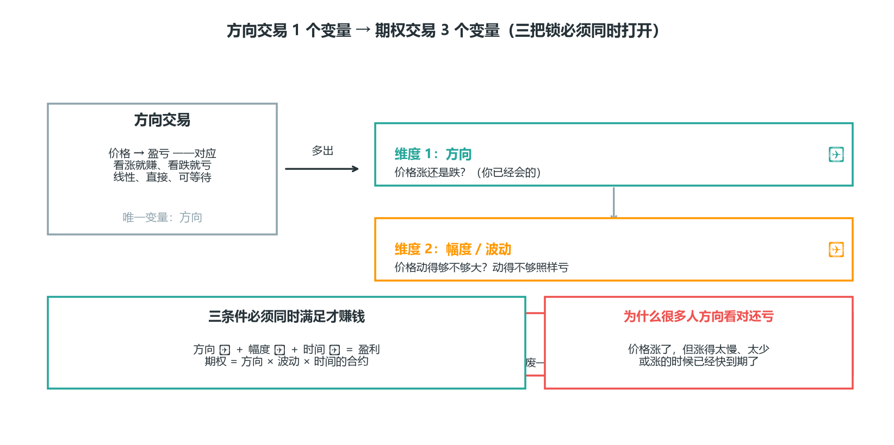
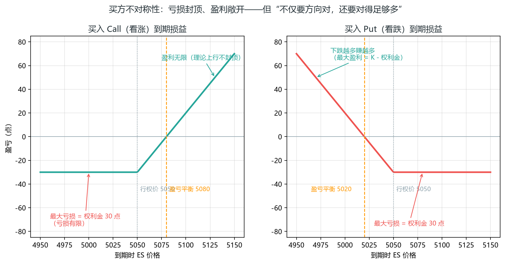
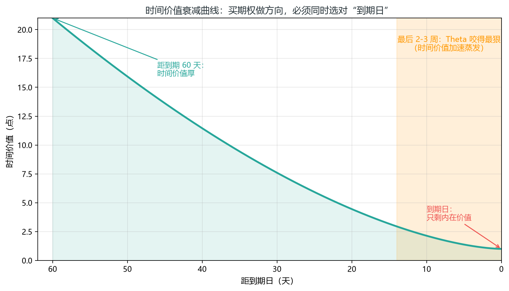
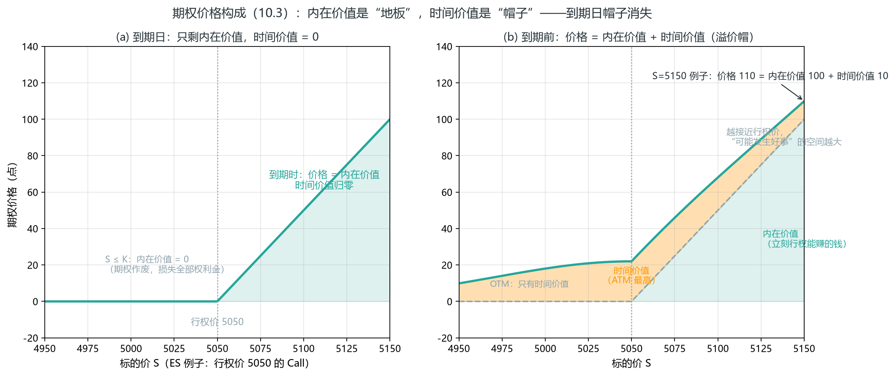
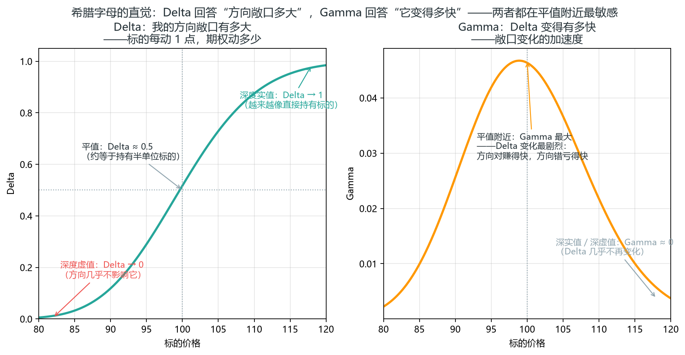
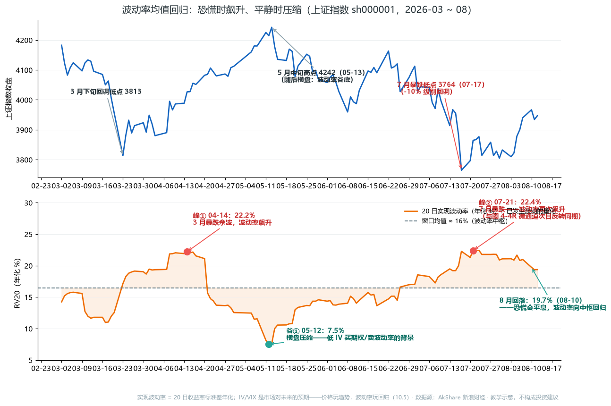
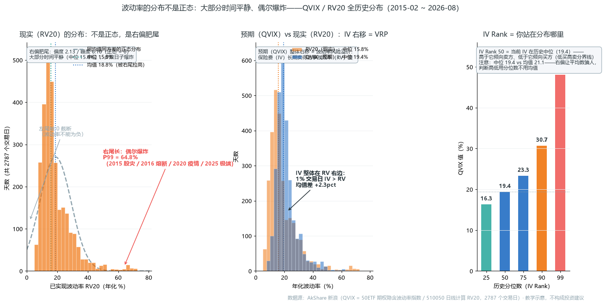
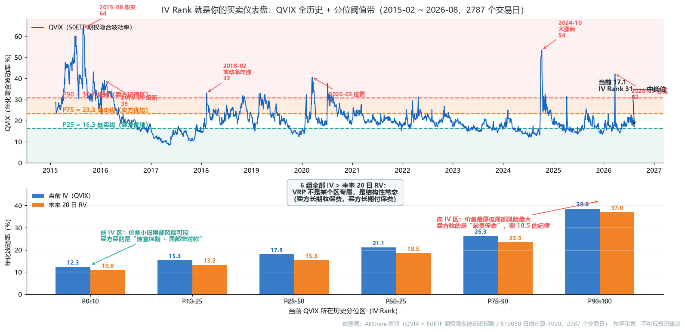
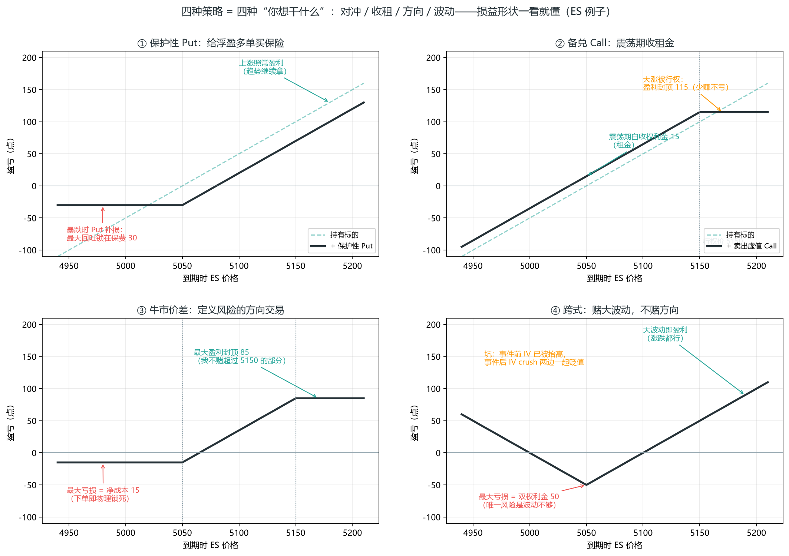
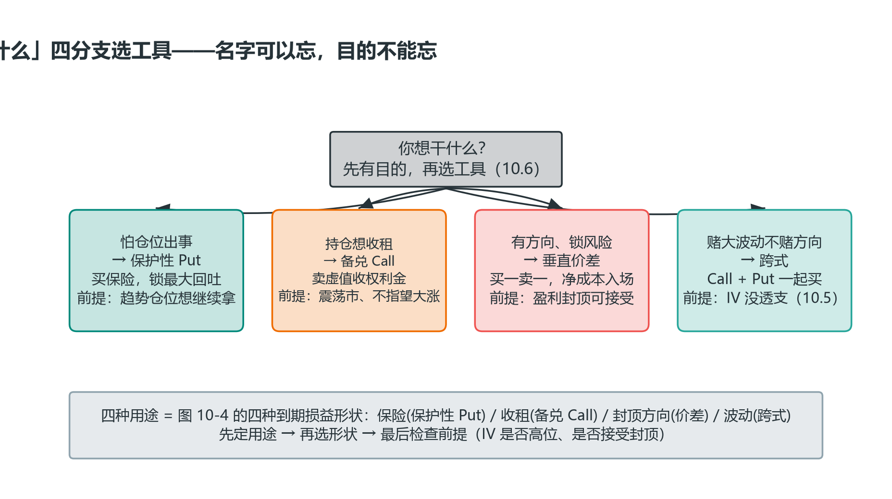

# 第 10 章 期权：交易的另一个维度

> **阅读提示**：本章把你从“方向交易”带到三维——价格、时间、波动率。先读 10.1-10.3（期权在交易什么、一个具体例子、价格构成：内在价值 + 时间价值），再按需查阅策略表；10.5 讲波动率（含波动率风险溢价）与已有工具的衔接，想进阶可重点看。

本章解决一个问题：你之前做的都是方向交易——判断涨跌，然后用仓位和止损管理风险。期权在这个基础上多出了两个你从没处理过的维度：波动率和时间。这一章不打算把你培养成期权做市商，而是要让你真正理解期权是怎么回事、它和你已经会的东西怎么接上、什么时候它对你有用、什么时候你该离它远点。

### 10.1 先建立一个直觉：期权到底在交易什么

做方向交易时，你的盈亏只取决于一件事：价格往哪走、走多少。你买多，涨了就赚，跌了就亏，关系是线性的、直接的——这也是前面九章所有内容共同的前提。

期权把这件事变复杂了，因为它让你同时押注三件事：

1. **方向**：价格涨还是跌？（这个你已经会了）
2. **幅度/波动**：价格动得大不大？
3. **时间**：这个变动，什么时候发生？

为什么多出后两个？因为期权是有期限的权利。你买的不是“股票会涨”，而是“股票会在某个日期之前涨足够多”。这三个条件——方向对、动得够、在期限内——必须同时满足你才赚钱。这就是为什么很多人方向看对了，买期权还是亏：价格确实涨了，但涨得太慢、太少，或者涨的时候已经快到期了。

| 维度 | 方向交易 | 期权交易 |
| --- | --- | --- |
| 方向 | 唯一变量 | 变量之一 |
| 波动幅度 | 影响盈亏大小，但不改变方向性 | 独立变量：动得不够大照样亏 |
| 时间 | 无所谓（你可以等） | 硬约束：到期作废 |
| 最大亏损 | 由止损单决定（可能被扫） | 由权利金锁定（物理上限） |

> **核心洞察**：期权不是更便宜的股票，它是一个同时关于方向、波动、时间的合约。后面所有概念都是这句话的展开。



*图 10-1 期权三维度：方向 × 波动 × 时间——三条件必须同时满足才赚钱，方向看对还亏就是输在幅度和时间*

### 10.2 期权是什么：从一个具体例子讲起

抛开定义，先看一个真实场景。

假设 ES（标普500期货）现在在 5000 点。你认为接下来一个月它会涨。最直接的做法是做多 ES，但你想用更少的钱、并且把最大亏损锁死。于是你买入一张看涨期权（Call）：

> 这张合约给你**权利（不是义务）**：在到期日之前，以 5050 点的价格买入 ES。为了获得这个权利，你付了 30 点的权利金。

我们把这个例子里的每个词拆开：

- **Call（看涨期权）**：给你“买入”的权利。你预期涨，所以买 Call。对应的，**Put（看跌期权）**给你“卖出”的权利，你预期跌就买 Put。
- **行权价 5050（Strike）**：合约约定你能买入的价格。注意它比现价 5000 高——这种“行权价高于现价”的 Call 叫**虚值**（out-of-the-money），意思是现在立刻行权是亏的，你赌的是未来涨过 5050。
- **到期日（Expiration）**：这份权利的有效期限。过了这天，合约作废。
- **权利金 30 点（Premium）**：你为这份权利付的价格。这就是你的**全部最大亏损**——最坏情况，ES 没涨，期权作废，你亏掉这 30 点，不会更多。
- **美式 / 欧式（American / European）**：美式期权在到期日之前**任意时间**都能行权；欧式期权只能在到期日行权。交易所交易的股票/期货期权多为美式，部分指数期权为欧式。对普通买方，“能不能提前行权”影响不大（多数时候直接卖出期权比行权更划算）；但**卖方要警惕提前指派**——尤其深实值、临近分红/到期时，对手可能提前行权，别把“不会提前行权”当默认。

先记一个三分类，后面到处用：

| 状态 | Call（行权价 vs 现价） | 含义 |
| --- | --- | --- |
| 实值 ITM | 行权价 < 现价 | 现在立刻行权就有赚 |
| 平值 ATM | 行权价 ≈ 现价 | 可上可下，波动最大 |
| 虚值 OTM | 行权价 > 现价 | 现在行权是亏的，纯赌未来 |

现在看两种结局，你会立刻理解期权的“不对称性”：

- **结局 A：到期时 ES 涨到 5150。** 你有权以 5050 买入，而市价是 5150，所以这份权利值 5150−5050 = 100 点。你当初付了 30 点，净赚 70 点。
- **结局 B：到期时 ES 停在 5020。** 5020 低于行权价 5050，“以 5050 买入”这个权利毫无价值（你不如直接市价买），期权归零。你亏掉全部 30 点权利金。

从这两个结局能读出期权的两个根本特性：

1. **亏损有限**：买方最多亏掉权利金（这里是 30 点），无论价格跌多惨。这叫**定义风险**。
2. **盈利需要“越过盈亏平衡点”**：你的盈亏平衡点是行权价 + 权利金 = 5050 + 30 = 5080。ES 必须涨过 5080 你才真正赚钱。涨到 5050~5080 之间，你“行权有价值”但还不够覆盖权利金，仍是亏的。

> 这个“盈亏平衡点要往前跑一段”就是期权买方的天然劣势——你不仅要对，还要对得足够多。这是后面讲 Theta（时间衰减）和 IV（波动率）时反复出现的主题。

再补一个角色区分，因为后面策略要用：**买方付权利金、风险封顶、靠方向/波动赚钱；卖方收权利金、赚时间/波动率回落、但风险不对等（裸卖理论无限）**。新手天然倾向买方（因为“亏损有限”听起来安全），但买方要同时赢三个维度才赚钱，其实很难；卖方刚好相反——胜率高、但一次黑天鹅就可能亏掉一年的收成。第 10.8 会展开这个坑。



*图 10-2 期权买方到期损益：最大亏损 = 权利金，盈亏平衡点 = 行权价 ± 权利金*

### 10.3 期权的价格由什么构成

上面例子里那个 30 点权利金，到底是怎么定的？它由两部分组成：

```
期权价格 = 内在价值 + 时间价值
```

**内在价值**：如果现在立刻行权，能赚多少。对行权价 5050 的 Call：

- ES 在 5150 → 内在价值 = 100（立刻行权赚 100）
- ES 在 5020 → 内在价值 = 0（行权是亏的，内在价值不能为负，最低是 0）

**时间价值**：期权价格里超出内在价值的部分，是你为“到期前还可能发生好事”付的溢价。

回到例子：假设 ES 现在 5150，你那张行权价 5050 的 Call 市价是 110。那么内在价值是 100，剩下的 10 就是时间价值——有人愿意多付 10 点，赌它在到期前还能涨更多。

关键洞察：**时间价值会随到期临近而蒸发**。离到期越远，“还可能发生好事”的空间越大，时间价值越高；越接近到期，这个空间越小，时间价值越薄，直到到期那天归零（到期时期权只剩内在价值）。

**定价模型只是参考，不是真值（Natenberg）**：Black-Scholes 这类理论定价模型给出的是“在假设下期权应该值多少”，但真实期权价格由市场供需、波动率预期和做市商行为共同决定。交易者容易犯的错是把模型价当“正确答案”——更实用的态度是：**用模型价作比较基准，用市场价观察谁在贵/谁在便宜**。

直观地看，时间价值衰减不是匀速的（见图 10-3）。

> **要点**：最后两三周 Theta 咬得最狠——同样的方向判断，同样涨了 10 点，离到期远的时候期权还能涨不少，离到期近的时候可能纹丝不动。这就是为什么“买期权做方向”必须同时选对“到期日”。



*图 10-3 时间价值衰减：越接近到期蒸发越快，最后 2-3 周加速——同样的判断、同样涨 10 点，临近到期可能纹丝不动*



*图 10-4 期权价格构成：左=到期日只剩内在价值；右=到期前价格=内在价值（地板）+时间价值（溢价帽，ATM 最高）*

图 10-4 把“期权价格 = 内在价值 + 时间价值”画成同一张图的两个时刻：

- **左图（到期日）**：价格线就是内在价值线——时间价值归零，期权只剩“行权价值”；
- **右图（到期前）**：价格线从内在价值线上“长”出一顶帽子——帽子在平值（ATM）处最高、往实值/虚值两侧变薄。右侧标注的 S=5150 就是 10.3 的例子：100 点内在价值 + 10 点时间价值 = 110 点价格。

**看这张图记住两件事**：

1. **时间价值永远非负**——期权价格永远不会低于内在价值（买 Call 最坏到期作废、损失权利金，不会欠钱）；
2. **帽子越薄，Theta 咬得越狠**——帽子最厚的 ATM 期权，时间衰减的绝对值也最大（对应 10.4 的 Gamma 敏感区）。

这就引出了期权买方最大的敌人——Theta。它属于下面要讲的“希腊字母”家族。

### 10.4 希腊字母：别背公式，理解它们在回答什么问题

“希腊字母”听起来吓人，但它们其实各自只回答一个朴素的问题。我们逐个用直觉理解，重点是每个在回答什么、对你意味着什么，不是背公式。

**Delta（Δ）——“我的方向敞口有多大？”**

Delta 回答：标的每动 1 点，我的期权动多少？

你买了一张 Delta = 0.5 的 Call。ES 涨 1 点，这张期权大约涨 0.5 点；ES 涨 10 点，它大约涨 5 点。所以 Delta 实际上告诉你“等效仓位”——持有这张 Delta 0.5 的 Call，方向上的暴露大约相当于持有半单位的 ES。

这对你意义重大：它把期权接回了你熟悉的方向交易。你不用把期权当全新物种，Delta 就是它和你已有框架的翻译器。

但有个容易忽略的点：**Delta 不是固定的**。ES 涨得越多，你这张 Call 越“实值”，Delta 会越接近 1（越来越像直接持有 ES）；ES 跌，Delta 趋近 0。这种“Delta 会加速变化”的特性，就是下一个希腊字母 Gamma 在描述的。

**Gamma（Γ）——“Delta 变得有多快？”**

Gamma 回答：标的动 1 点，Delta 变多少？

它是“加速度”。平值附近、临近到期时 Gamma 最大——意思是这时候你的方向敞口变化最剧烈：方向对，Delta 快速放大，赚得飞快；方向错，Delta 也快速变化，亏得飞快。这就是为什么“买临近到期的平值期权”像赌博——Gamma 让你的盈亏剧烈摆动。



*图 10-5 Delta 的 S 曲线与 Gamma 的钟形：两者都在平值附近最敏感（合成示意）*

把前两个希腊字母的直觉钉死：**Delta 是 S 曲线**（左）——实值越深越接近 1（像直接持有标的）、虚值越深越接近 0、平值处约 0.5（略高于 0.5 的偏差来自利率与对数正态分布，教学上取 0.5），而**曲线最陡的地方就在平值附近**；**Gamma 是钟形**（右）——平值处最大、两侧迅速归零。两者讲的是同一件事的两种说法：**平值附近，你的方向敞口变化最快（Gamma 最大），但不是方向敞口最大——方向敞口最大的是深实值期权（Delta 接近 1）**——这就是平值期权（尤其是临近到期的）为什么像赌博的原因：方向敞口中等，但敞口变化最剧烈。

**Theta（Θ）——“我每天被收多少'时间租金'？”**

Theta 回答：什么都不发生，过一天，我的期权损失多少价值？

回忆 10.3：时间价值会蒸发。Theta 就是这个蒸发的速度。对期权买方，Theta 是持续的逆风——你买的每一天，期权都在悄悄贬值，除非价格朝有利方向动得够快来抵消。对期权卖方则相反：Theta 是收入，时间流逝对卖方有利。

这解释了一个新手常犯的错：买太近到期的期权。临近到期 Theta 咬得最狠，你可能方向都对，就因为涨得不够快，眼睁睁看着期权价值被时间吃掉。

**Vega（ν）——“波动率变化对我影响多大？”**

Vega 回答：隐含波动率（IV）每变 1%，期权变多少价值？

这是最容易被方向交易者忽略、却最坑人的一个维度。你买期权时，一半在赌方向，一半在赌波动率别跌。如果你买入时 IV 很高（期权贵），之后就算方向对，只要 IV 回落，期权价格也会被砸下来——这就是著名的 **IV crush（波动率坍塌）**，尤其爱发生在重大事件之后。Vega 就是衡量你对这种风险有多敏感。

把四个串起来记：

| 希腊字母 | 回答的问题 | 买方视角 | 卖方视角 |
| --- | --- | --- | --- |
| Delta | 方向敞口多大 | 方向对了就赚 | 方向反了就亏 |
| Gamma | 敞口变化多快 | 平值临近到期最刺激 | 平值临近到期最危险 |
| Theta | 时间每天吃多少 | 每天被收租（逆风） | 每天收租（顺风） |
| Vega | 波动率变 1% 影响多少 | IV 跌就亏（怕 crush） | IV 涨就亏（怕突刺） |

> 做任何一笔期权前，问自己：**我在这四个维度上各押了什么？** 大多数新手只想了方向（Delta），完全没意识到自己在 Theta 和 Vega 上也下了注。

### 10.5 波动率（IV）：期权的灵魂，也是和你已有知识的连接点

如果说只能懂一个期权概念，那应该是隐含波动率（IV）。它是期权定价的核心，也是期权和你已有知识体系最自然的接口。

**IV 是什么**：市场对未来波动的预期，从期权当前价格反推出来的。IV 高，说明市场预期接下来波动大（期权被买得贵）；IV 低，说明预期波动小（期权便宜）。

现在看一个关键的连接——“波动率”这件事，你在书里其实已经见过三个不同的度量：

| 度量 | 它看的是 | 在哪见过 |
| --- | --- | --- |
| ATR | 已经发生的实际波动 | 第 6.5 节，用来定止损宽度 |
| IV | 市场预期的未来波动 | 本章，从期权价格反推 |
| VIX | 整个标普500 的 IV | 第 8.5 节，“恐慌温度计” |

这三个不是三个东西，是同一个“波动率”的三个侧面：ATR 看过去发生了什么，IV 看市场预期未来会怎样，VIX 是大盘整体的 IV。一旦你把这个统一图景建立起来，期权就不再是孤岛——它和你用来定止损的 ATR、你盯的 VIX，是同一套语言。

**期权交易的一条核心原则：低 IV 买，高 IV 卖。**

道理很朴素：IV 低时期权便宜（时间价值和 Vega 都便宜），这时候买期权划算——你用低成本获得了方向+波动的暴露。IV 高时期权贵，这时候买就吃亏（你买在了波动率的“高点”，容易被 IV crush 砸），反而卖期权（收高额权利金，赚 Theta 和 IV 回落）更合理。

怎么判断 IV 高低？看 **IV Rank / IV Percentile**——本书统一按“当前 IV 在自己历史分布中的百分位”口径使用（严格区分：IV Rank 有时指 (现 IV−低)/(高−低) 的区间位置，IV Percentile 指历史百分位；两者数值接近但不等价，规则书里写死一种）。IV Rank/Percentile > 50 说明高于历史中位、波动率偏高（倾向卖方策略），< 50 说明偏低（倾向买方策略）。

举个具体的数字例子：

- ES 的 IV Rank 现在是 80（处于历史高位）——你看到财报/大选这类事件临近，期权被抢贵。此时买跨式/裸买 Call 就是买在波动率山顶：事件落地，无论涨跌，IV 大概率跳水，期权两边一起贬值。
- 反过来，IV Rank 20（低位），市场一片平静——这时候想表达方向，买 Call/Put 的成本便宜，同样的观点，用期权比直接做期货更划算（杠杆 + 风险封顶），即使方向暂时没动，你付的时间成本也小。

> 对方向交易者的直接启示：你用价格行为判断了方向（这是你的强项），但入场那一刻的 IV 高低，决定了期权是不是表达这个观点的划算工具。**方向对 + IV 太高 = 买 Call 照样亏。** 这是方向交易者初学期权最常见的死法，务必记住。

**IV 与 RV 的价差：波动率风险溢价（为什么卖方长期有优势）**

“低 IV 买、高 IV 卖”是一条经验法则，它背后的机制是期权里最值得理解的一个对比——**IV 是“预期”，RV 是“事实”，两者之差就是期权的风险溢价**：

| | IV（隐含波动率） | RV（已实现波动率） |
| --- | --- | --- |
| 是什么 | 市场对**未来**波动的预期 | **已经发生**的实际波动 |
| 从哪来 | 从期权当前价格反推 | 历史收益的标准差（年化） |
| 本质 | 一种“定价” | 一种“事实” |

RV 与 ATR（第 6.5）同族——都是“已发生的实际波动”的量化，RV 是更标准的统计口径（用收益率标准差，ATR 用平均真实波幅）。关键在两者的**差**：IV 通常系统性高于 RV——市场为未来波动付的价，几乎总高于波动最终实际发生的大小。这个常态差值叫**波动率风险溢价（Volatility Risk Premium, VRP）**，是期权卖方（和所有“收租”策略）的长期利润来源。

**为什么 IV 会系统性高于 RV（机制）**：波动率的买家是“保险需求方”——用 Put 对冲的机构、恐慌时抢保护的人，他们买的是“万一出事的保障”，天然愿意付溢价（就像买火灾险的人不会因为没起火就把保费要回去）。波动率的卖家（做市商、卖方策略）承担的是尾部风险——黑天鹅真的来了一次性大亏，所以他们要求补偿。供需上，保险买家是持续的净买方，溢价就长期存在。这是订单流的视角（呼应 8.10 拍卖理论与 1.1 扩散理论）：**波动率市场里，恐慌者持续买入，专业者持续卖出，两者之间的价差就是那个“买贵了”的部分**。所以“卖波动率长期正期望”不是玄学，是“市场为担心付的价，几乎总高于担心最终实现的成本”。

**实战含义**：

- **IV − RV 的价差越大，买期权越亏、卖期权越划算**——你买期权不仅赌方向，还赌“实际波动会超过市场预期”，这是双重条件，很难同时满足；而卖方的条件只有“实际波动别超预期太多”，天然占优；
- **IV crush 的精确机制 = IV 向 RV 回归**——事件前 IV 定价的是“不确定性”（明天的波动分布很宽，所以期权贵），事件落地后不确定性被消除，市场不再需要为“未知”付费，IV 直接从 30 跌向 RV 的 15——“事件前买期权 = 买在波动率山顶”不是比喻，是预期被现实纠正的必然过程；
- **卖方的纪律**：溢价是常态，但不代表无脑卖——尾部风险会一次性吞掉几十个月的溢价（呼应 6.3 连亏与 7.1 概率思维），所以卖波动率的仓位必须按第 6 章严格控制，且只在 IV 处于历史高位区间（IV Rank > 50）时卖，把“常态溢价”升级成“高位溢价”。

**一句话总结**：价格市场里你赚的是“方向”，波动率市场里你赚的是“预期与现实的价差”——卖方的优势不是预测准，是市场结构让“担心”这件事长期被高估。

**波动率偏斜（Volatility Skew）：顺势在期权市场里更贵**。一个反直觉、但对方向交易者极其重要的现象：**市场会把“概率更高的那一侧”定价得更贵**——趋势明确时，顺势方向的期权/价差比逆势方向的贵（期权交易员的原话：*"Mkt is pricing the higher prob trade higher, so it is more expensive to go with the trend than to fade it. This is due to options volatility skew"*）。两个推论：① 你的方向判断越“明显”，期权市场越已把它的概率算进价格——你的优势在价格行为判断（第 2-4 章），而期权定价已经把趋势概率打包收费，方向对 + 溢价高照样难赚；② 顺势价差贵 → 想表达顺势观点时，要么接受更高的权利金，要么等回调再进场（回调时顺势期权变便宜、逆势期权变贵，偏斜暂时收窄）——这正好呼应第 4 章“回调入场优于追高”：期权市场也在为“回调后再上车”奖励耐心。

**Natenberg 的提醒：波动率倾斜是“相对价值”工具，不是固定曲线**。倾斜曲线没有唯一正确形状，会随市场条件、到期时间、标的合约价格变化；做市商、投机者、套保者使用它的方式也不同。对普通交易者，实用做法不是“背一条标准倾斜”，而是**把倾斜当作同一到期日不同行权价之间的相对贵贱**：当你认为某一行权价相对整条曲线被高估/低估时，才用它做价差（卖高估腿、买低估腿）。

**波动率本身也是交易对象**：你不必只把 IV 当“期权贵不贵”的标签——波动率是一个可以独立交易的市场：

- **VIX = “波动率股票”**：VIX 期货/期权直接交易恐慌指数本身。VIX 高 = 市场恐慌、波动率贵；低 = 平静、便宜（呼应 8.5 把它当恐慌温度计）。
- **波动率均值回归**：与价格不同（价格可以长期单边），波动率**长期均值回归**——VIX 常态区间约 15-20，暴涨后必然回落（恐慌会平息）。这给了一个和价格行为正交的交易逻辑：**价格玩趋势，波动率玩回归**。
- **事件前后策略**：重大事件（财报/利率决议/CPI，以及每月第三个周五的期权到期日调仓潮）前 IV 被推高，事件落地瞬间 IV 暴跌（IV crush）——事件前买期权 = 买在波动率山顶（10.5 的例子里已算过）；事件后卖波动率（卖跨式）或做空 VIX，赚的是“波动率回归”的钱。注意：事件后方向波动也大，这是“收租+扛波动”的游戏，仓位纪律照第 6 章。这里和 10.6 用途四并不矛盾，是同一枚硬币的两面：**事件前 IV 还没被抬起来（IV Rank 低）时买跨式，事件后 IV 已在高位时卖跨式——站哪边永远由 IV 高低决定，不是由“事件前还是事件后”决定**（卖跨式属卖方领域，新手先别碰，见用途四）。
- **与本书主线的连接（两个过滤器）**：① VIX 飙升（>30）时降仓位——市场在恐慌中，信号质量整体下降（第 8.5 已提）；② VIX 极低时警惕“平静中的爆发”——波动率压缩到极端后必然扩张（呼应第 1 章均衡价位：越平静越接近突破），此时第 4 章状态机判定“区间”的可靠性反而最高。



*图 10-3R 真实数据：波动率均值回归（数据源：AkShare 新浪财经指数日线）*

**“波动率玩回归”用真实数据看**：上图是 2026 年 3-8 月上证指数，下图是它的 20 日实现波动率（年化 %）——“已发生波动”的量化（上文表格里 ATR 的同族度量）。半年里两轮完整的峰谷循环：

- **峰①（04-14，22.2%）**：3 月暴跌余波，波动率飙升；**谷①（05-12，7.5%）**：5 月横盘，波动率压缩到约三分之一（从 22.2% 压到 7.5%）——暴跌必然抬高波动率、平静必然压缩波动率。
- **峰②（07-21，22.4%）**：7 月再次暴跌（与图 4-5R 微通道次日反转同期）→ **8 月回落**（08-10 已 19.7%）——恐慌会平息。
- **中枢 ≈ 16%**：两轮峰谷都围绕同一中枢——波动率不像价格可以长期单边，**它必然回归**。这就是“低 IV 买、高 IV 卖”和“事件后卖波动率”的统计基础：波动率压缩到谷底（如 05-12 的 7.5%）是买期权的便宜时机，飙升到峰值（如 07-21 的 22.4%）是卖波动率/回避买期权的时机。

**10-3R 只回答了“现实”这一半——那“预期”呢？** 上图的 RV 是“已经发生的事实”，而 10.5 反复强调的 IV 是“市场对未来的预期”。两者都真实存在、都能量化：**QVIX** 就是把 50ETF 期权价格反推的隐含波动率加权成的指数（中国版 VIX，2015 年起全历史可查）。把 IV 和 RV 画在一起，“预期 vs 现实”的关系立刻显形：


*图 10-4R 真实数据：IV 与 RV 的真实关系——预期领先、现实滞后（数据源：AkShare 新浪 50ETF 期权 QVIX 与 510050 日线，2026-03 ~ 08）*

**这张图要读出三件事**（都是 10.5 机制的真实样子）：

1. **IV 先动、RV 后动——期权是预期定价**。3 月暴跌当天（03-23），QVIX 单日从 19.9 飙到 42.2（+112%），而 RV20 才 14%——恐慌瞬间全部打进期权价格，因为期权交易的是“接下来会怎样”；RV20 是 20 天移动平均，天然滞后，10-3R 里那个“滞后出现的峰”就是这么来的。**别在恐慌当天追买期权**：你买的不是便宜货，是已经翻倍的 IV。

2. **IV crush 不是理论，是两天发生的事**。42.2 只维持了一天，03-25 就跌回 17——事件落地、不确定性被消除，市场不再为“未知”付费，IV 直接崩向 RV。这就是 10.5“事件前买期权 = 买在波动率山顶”的山顶长什么样。

3. **VRP 是长期常态，但恐慌期会反转**。全历史 78.1% 的交易日 IV>RV（平均 +2.25pct）——“担心”长期被高估，卖方长期收保险费；但本窗口仅 58% 为正，7 月 RV 连续 3 周反超（最深 −8.6pct）。**卖方别忘了尾部风险**（呼应 6.3 / 7.1）：收常态溢价，亏恐慌期一次性反超。

10-3R 看均值回归、10-4R 看预期 vs 现实——这一张回答最后一个问题：**波动率本身长什么分布？** 它是 IV Rank 判断“低买高卖”的统计基础。



*图 10-5R 真实数据：波动率的分布不是正态——RV20 右偏肥尾（偏度 2.13/峰度 6.10）、QVIX 整体右移（78.1% IV>RV = VRP）、IV Rank 就是分位数（数据源：AkShare 新浪 50ETF 期权 QVIX 与 510050 日线，2015-02 ~ 2026-08）*

**这张图要读出三件事**（都是 10.5 统计基础的真实样子）：

1. **波动率不是正态，是右偏肥尾**——偏度 2.13、峰度 6.10：大部分时间平静（中位 15.8%）、偶尔爆炸（P99 64.8%）。图 10-3R 的“均值回归”是“长时间低位 + 短冲高回落”，不是围绕均值小幅波动；正态假设会低估极端波动频率（肥尾 = 尾部风险，呼应 10.5 / 6.3）。
2. **IV 的分布整体在 RV 右边 = VRP 的分布形态**——78.1% 的交易日 IV>RV、均值差 +2.25pct：保险费长期比事故贵，是“分布整体右移”而非偶发——卖方长期正期望的统计基础（呼应 10.5 / 10-4R）。
3. **IV Rank = 你站在分布哪个位置**——Rank 50 = 中位 19.4；3 月恐慌 QVIX 42.2 ≈ P97——高卖低买的边界就是分位数；右偏让平均数骗人（中位 19.4 vs 均值 21.1），判断高低用 Rank。

**波动率圆锥与均值回复（Natenberg）**：波动率与价格不同——价格可以长期不回到原水平，**波动率却几乎总是向一个均衡区间回复**。Natenberg 用“波动率圆锥”展示：估计区间拉得越长，百分位线越向均值聚拢、均值越稳定。这对交易的含义是：**高 IV 不是“这次不一样”，而是均值回复的起点；低 IV 也不是“永远低波动”，而是买期权相对便宜的时候**。本书 10-3R/10-6R 的恐慌尖峰全部回落，就是波动率圆锥在真实数据上的样子。预测波动率时，Natenberg 还建议给近期数据更高权重——对短期期权尤其如此，因为短期波动率更由“最近发生了什么”决定。

10-5R 告诉你“分位数在哪”，这一张把“低买高卖”画在历史上：



*图 10-6R 真实数据：IV Rank 就是你的买卖仪表盘——QVIX 全历史 + 分位阈值带 + 恐慌尖峰 + VRP 分组实证（数据源：AkShare 新浪 50ETF 期权 QVIX 与 510050 日线，2015-02 ~ 2026-08）*

**这张图要读出三件事**（IV Rank 的使用手册）：

1. **IV Rank 是把 11 年历史压成一把 0-100 的尺**。P25=16.3、P75=23.3、P90=30.7 把图分成四区：<P25 淡青=便宜（买方优势）、>P75 淡橙=贵（卖方优势）、>P90 淡红=极端（卖方纪律区，见 10.5）。看图只看“QVIX 站在哪条线哪边”——2026-08-11 QVIX 17.2=Rank 31 中低位，别硬做。**平均数骗人（右偏让均值 21.1 > 中位 19.4），只有分位数靠谱**。
2. **恐慌尖峰都有日期，而且全部均值回归**。2015-08 股灾 63.8、2016-01 熔断 39.0、2020-03 疫情 40.6、2024-10 大涨后 53.5、2026-03 恐慌 42.2——每次冲上 P90 都是**卖出波动率的收费窗口**（呼应 10.5 卖方纪律 / 10-3R 均值回归），对买方那是“保险费最贵的时刻”，不是追波动的时候。
3. **VRP 无处不在：不管 IV 站哪，未来 20 日 RV 平均都低于当前 IV**。下面板 6 个分位区每组“当前 IV”都站在“未来 20 日 RV”上面——保险费长期卖得比事故成本贵，是结构性常态（呼应 10-4R 的 78.1%）。但风险不对称：低 IV 区价差小、尾部风险可控，买方买的是“便宜保险 + 尾部非对称”；高 IV 区价差最厚但极端尾部风险最大——**IV Rank 是仪表盘不是水晶球：告诉你站在分布哪里，不保证接下来一定怎样**（呼应 10.5 卖方纪律）。

### 10.6 常用策略：按“你想干什么”来学，而不是按名字背

策略名字一大堆，但按用途归类就只有四种。每种我用“你想干什么”来引出，这样你以后是“先有目的，再选工具”，而不是背了一堆名字不知道何时用。

**用途一：给现有仓位买保险（对冲）**

你持有一个浮盈的趋势多单（第 4 章那种让利润奔跑的仓位），担心黑天鹅，但又不想离场丢掉趋势。怎么办？

**保护性 Put（Protective Put）**：在持有多的同时，买一张 Put。如果价格暴跌，Put 大涨，对冲掉你多单的损失——相当于给你的仓位买了份保险，权利金就是保费。

这是第 6 章风险管理在期权上的自然延伸：你依然在管理“最坏情况亏多少”，只是工具从“止损单”升级成了“保险单”。区别在于：止损单会在震荡里被扫掉，而 Put 保险只要你不行权，仓位还能继续拿着。

**怎么用**：买一张行权价在你“能接受的离场点”附近的 Put（比如浮盈 20% 后，买行权价 ≈ 当前价 − 5% 的 Put）。注意最坏情况的账要算全：**最大回吐 = 现价到行权价的距离（这个例子里 5%）+ 你付的权利金**，两者加起来才是这份保险的完整成本，之后跌得再深也与你无关。记住保费是你为“不被打断的趋势”付的代价——趋势如果真的继续走，这保费很值；趋势结束，Put 补上亏损。

**用途二：持仓不动，收点租金（增强收益）**

你持有股票/多头，判断接下来是震荡、不会大涨（第 4 章的区间思维）。持仓干放着没有收益，能不能做点什么？

**备兑 Call（Covered Call）**：持有标的的同时，卖出一张虚值 Call，收权利金。震荡期价格涨不到行权价，Call 作废，你白赚权利金——像收了笔“租金”。

代价要想清楚：如果价格真的大涨突破行权价，你的标的会被行权卖掉，你就错过了大涨。所以备兑 Call 的前提是你“不指望大涨”——这正好和区间市的判断匹配。

**怎么用**：卖出虚值 Call，行权价选在你“愿意离场的价格”（比如现价上方 5-8%）。收的权利金就是震荡期你的“工资”。如果判断错了、价格大涨，你只是提前在行权价离场——不亏钱，只是少赚。

**用途三：用小风险表达方向观点（定义风险的方向交易）**

你有明确的方向观点，但想把最大亏损锁死、同时降低成本。

**垂直价差（Vertical Spread）**：买一个期权 + 卖一个期权（同到期、不同行权价）。比如牛市看涨价差：买低行权价的 Call + 卖高行权价的 Call。卖出的那张收回部分成本，也把盈亏都封了顶。

这个思路和第 6 章“单笔风险固定”的精神完全一致——你只是用价差结构，把“最大亏损”在下单那一刻就物理锁死了。对想用小资金做方向交易的人，价差比裸买期权更理性（裸买受 Theta 侵蚀更狠）。

**怎么用**：还是那个 ES 例子，方向看涨、目标 5150。裸买 Call 花 30 点；改成“买 5050 Call + 卖 5150 Call”，卖出的那腿可能收回 10-15 点，净成本降到 15-20 点——代价是最大盈利也被封在 5150。你实际上是在说：“我不赌超过 5150 的部分”。

**价差结构的三个工程规则（期权交易员卡片）**：价差结构是否值得做，由三个数学事实决定——① **最大盈利 = 价差距离 − 净成本，最大亏损 = 净成本**，所以价差距离 ≥ 成本 2 倍、最好 3 倍，才能让盈亏比站得住（只付价差距离的一半以内、最好只付三分之一）；必要时买一点虚值期权来凑出 3:1 比例。② **限价单买，不市价追**——因为价差是“两个腿同时成交”的结构，市价追单容易吃进过宽的买卖价差，把本来的盈亏比破坏掉；如果报价高到价差的一半，说明市场波动太大、这个价差对当前市场太紧，放弃或放宽。③ **入场时机决定工具**——行情刚开始时 IV 低、裸买便宜且爆发力足，适合买期权；行情已经启动、入场较晚时期权价格已高，用价差的卖出腿对冲掉一部分成本，比裸买更划算。

**用途四：赌“会有大波动”，但不赌方向（波动率交易）**

重大数据/事件前（第 1 章的黑天鹅），你预期会有大行情，但不确定往哪边。

**跨式（Straddle）**：同时买同行权价的 Call + Put。只要价格大幅波动（无论涨跌），总有一边大赚。

但这里有个大坑，正好用上 10.5 的知识：事件前 IV 通常已经被抬得很高（大家都想赌事件），你买跨式等于买在了波动率高点；事件一过，不管价格动没动，IV 都会回落（IV crush），可能两边期权一起贬值，方向赌对了都亏。所以跨式不是“事件前无脑买”，你得先判断“当前 IV 是否已经透支了这次事件的波动”。

**怎么用**：先查 IV Rank。事件前 IV Rank > 70，跨式大概率是送钱（你付了过高的“波动保险”）；IV Rank 低、但事件确实可能炸出大行情时，跨式才有性价比。更稳的变体是**铁鹰（Iron Condor）/卖出跨式**——在 IV 高的时候收权利金赌波动回落——但这属于卖方领域，新手先别碰。

四种用途总结：

| 用途 | 你想干什么 | 策略 | 前提判断 | 代价 |
| --- | --- | --- | --- | --- |
| 对冲 | 保护已有仓位 | 保护性 Put | 趋势还想拿 | 付保费 |
| 收租 | 震荡期赚收益 | 备兑 Call | 不指望大涨 | 封顶盈利 |
| 方向 | 定义风险做方向 | 垂直价差 | 有明确目标位 | 封顶盈利 |
| 波动 | 赌大波动不赌方向 | 跨式 | IV 未被透支 | IV crush 风险 |



*图 10-6 期权四策略到期损益：保护性 Put / 备兑 Call / 牛市价差 / 跨式——损益形状一看就懂（ES 例子）*

四张损益图对照着读：① 保护性 Put = 多单下方加保险（最大回吐 = 现价到行权价的距离 + 权利金，上涨不封顶）；② 备兑 Call = 多单上方卖租金（震荡期白收权利金，大涨封顶但少赚不亏）；③ 牛市价差 = 下单即锁死最大亏损（净成本 15），代价是盈利封顶 85；④ 跨式 = 盈亏像 V 形（唯一风险是波动不够），但事件前 IV 已被抬高时买跨式是送钱（IV crush 风险）。

**进阶：波动率价差（Natenberg 思路）**：当你的关注点从“方向”变成“波动率”后，还可以做波动率价差——不赌 IV 的绝对值，而赌不同行权价、不同到期日之间的 IV 相对关系（比如做多某一行权价的 IV、同时做空另一行权价的 IV）。这超出本书主线，只提示存在：如果你发现自己开始关心“哪条腿 IV 被高估/低估”，说明你已进入 Natenberg 的领域，可回 10.9 的进阶参考继续深入。



*图 10-7 期权策略决策树：先问“你想干什么”，再对号入座——怕仓位出事→保护性 Put；持仓收租→备兑 Call；有方向锁风险→垂直价差；赌大波动不赌方向→跨式*

图 10-7 就是 10.6 那张总结表的图形化：**先问“你想干什么”，再对号入座选策略**。四个分支的箭头都从同一个根出发——因为期权策略不是“哪个更好”，而是“哪个匹配你现在的问题”。读这张图的正确顺序是从上往下：先定用途（根节点），再选形状（中间框），最后检查前提（每框最后一行）——前提不满足就回到根重新选，而不是硬用。**用这张图替代记忆**：背不下四个策略的名字没关系，记得四个问题（怕出事？想收租？有方向？赌波动？）就够了，打开图 10-7 对号入座。

### 10.7 把期权放回全书坐标

学完细节，退一步看期权在你整个体系里的位置——**它是补充工具，不是新主线**：

1. **方向判断（第 2-5 章）**：期权完全不改变这一点。你还是靠价格行为判方向，期权只是表达方向的另一种载体。别指望期权让你“不用会看盘”。
2. **风险管理（第 6 章）**：保护性 Put 是对冲工具，价差把最大亏损物理锁死——期权给了你新的风控手段，但“先想最坏亏多少”的原则不变。
3. **波动率（本章）**：ATR/IV/VIX 三位一体。懂了这条，你就知道“什么时候用期权划算”。
4. **概率思维（第 7 章）**：Delta 近似“到期实值的概率”，期权定价本质就是概率定价。做期权，是概率思维最直接的具象化。
5. **prop 考核（第 9 章）**：考核期不要用期权。考核要的是稳定的方向执行，期权的 Theta/IV 维度会引入你还没掌握的变量，让结果无法归因。

> **一句话定位**：期权解决的是“表达观点时的成本、风险和收益形状”，不解决“观点本身”。观点依然来自价格行为——这是全书不变的顺序。

### 10.8 期权的陷阱，以及什么时候该碰、什么时候别碰

期权表面诱人——“杠杆高、亏损有限”——但对新手处处是坑。把坑讲明白，你才知道何时该远离：

| 陷阱 | 机制 | 后果 | 规避 |
| --- | --- | --- | --- |
| Theta 侵蚀 | 买方每天流失时间价值 | 方向对、走得慢照样亏（“看对方向还亏钱”头号原因） | 别买太近到期的；观点要有时间冗余 |
| IV crush | 买在高 IV，事件后 IV 暴跌 | 方向对也亏（“财报前买期权”通常是坏主意） | 查 IV Rank，高 IV 不买 |
| 归因困难 | 盈亏同时受方向/波动/时间影响 | 亏了说不清哪一维错了，复盘失效（第 8 章的验证就失效了） | 考核期/新手期别碰 |
| 裸卖尾部风险 | 不配对冲地卖 Call/Put | 风险远超本金（裸卖 Call 理论无限风险） | 新手绝对不裸卖 |

那么，**什么时候别碰期权**：考核期/新手期；说不清某个希腊字母在做什么的时候；想用它“赌一把暴富”的时候——那是赌博，不是交易。

**什么时候可以考虑**：方向交易已经稳定盈利，想给仓位加对冲；真正理解了 IV，想在低 IV 表达方向、高 IV 收租；需要定义风险的小资金方向交易（用价差，不裸买裸卖）。

前面讲的是“定价”（期权贵不贵），期权市场还有一个独立的“情绪”信号——**PCR（认沽/认购比）**：每天期权市场里认沽成交量 ÷ 认购成交量，认沽占上风（>100）说明防御/看跌交易更活跃。用 2026 年上半年 50ETF 期权的真实每日统计看它的样子（数据源：上交所每日统计 + 新浪 QVIX/510050）：


*图 10-7R 真实数据：期权的两个情绪温度计——PCR 回答"谁在买保险"，QVIX 回答"保险多贵"，恐慌日成交放量、平静期双低*

这张真实图把 10.6/10.8 的"什么时候该碰"落到期权市场自己的行为上，三件事：

- **（①）恐慌日三个信号同步出现**：3 月 23 日 510050 大跌 -3.01% 收 2.868（年内低点），当天 QVIX 飙到 42.2（全年最高，+112%），期权总成交 218 万手放量——**恐慌不是纸面数字，是价格 + IV + 成交量一起动的**。这与 10.5 说的"恐慌瞬间打进期权价格"完全一致：你在恐慌日买期权，买的是已经翻倍的 IV，不是便宜货。
- **（②）PCR 和 QVIX 是两个不同的温度计，各说各话**：全年 PCR 最高（3 月 3 日 121）发生在 QVIX 低位（18）——认沽活跃（防御交易多）但波动预期并不高，PCR 高 ≠ 期权贵；反过来 3 月 23 日 QVIX 尖峰那天 PCR 只有 84——恐慌日买卖双方都放量，PCR 反而被摊平。**判断"期权贵不贵"看 QVIX/IV Rank（图 10-6R），判断"情绪偏防御还是偏激进"才看 PCR**——别用错温度计（呼应 10.8 的归因困难陷阱：说不清自己在赌哪个维度，复盘就失效）。
- **（③）平静期"双低"= 买方相对友好的窗口**：8 月 QVIX 17.2 低位（图 10-6R 的 2026-08-11 读数）、成交萎缩到 63 万手（恐慌日的 1/3）、PCR 70 附近——没人讨论的时候期权最便宜。这正是 10.5/10.6 说的"低 IV 买"：QVIX 低位 + 成交清淡时买方期权的性价比最高（时间价值和 Vega 都便宜），而恐慌日/高 IV 时反而是卖方收租的窗口（呼应 10.6 用途四跨式的时机判断：IV Rank > 70 事件前别买跨式）。

**到期日效应：不买期权的人也要知道的日历陷阱**：期权到期对**标的价格行为**本身有真实影响，你不交易期权也可能被波及（呼应第 1.8 的期权到期日一行）：

- **Gamma 效应（到期周的“磁吸+放大”）**：临近到期，大量期权集中在某一行权价（如 0DTE——Zero Days To Expiration，当天到期——的整数关口），做市商的对冲（买标的压 delta）会把价格“吸”向高持仓量行权价、并在到期时放大波动——这就是为什么**到期日当天价格行为失真、假突破频发**；
- **三巫日/四巫日**（每季度第三个周五，即 3/6/9/12 月；股指期权+期货+个股期权同到期；普通月度期权是每月第三个周五到期，但只有季度第三个周五才算三巫/四巫日）：成交与波动放大数倍，技术信号可信度下降，纪律与数据日相同（第 1.8 的“期权到期日例外”）；
- **实操**：到期日（尤其三巫日）当天不开新仓或仅用半仓；已有持仓提前收紧止损。0DTE（Zero Days To Expiration，当天到期）期权的日内波动是另一套游戏，新手别碰。

一个实用的判断顺序，遇到任何“要不要用期权”的场景都走一遍：

```
1. 我的观点是什么？（方向，来自价格行为）
2. 我的时间框架是什么？（这笔观点多久兑现）
3. 现在的 IV 高不高？（查 IV Rank）
4. 期权 vs 直接做标的，哪个更划算？（算成本与风险形状）
5. 我能给盈亏归因吗？（说不清就退出）
```

### 10.9 一个极简主义的参照：Al Brooks 怎么用期权

前面教了希腊字母、IV、四种策略——这是“理解层”。但你可能会问：实战里到底需要多复杂？Al Brooks 的答案是：**极简**。他分享过自己多年的做法：

- **持仓过夜时，几乎总是用期权**，而不是期货或股票。原因很朴素：隔夜有跳空风险（第 1.6），期权把最大亏损锁死在权利金，比裸持仓过夜干净。
- **他只用最简单的工具：买入看跌/看涨期权，或者买入看跌/看涨期权价差**（第 10.6 的“用途三”）。看涨就买 Call 或 Call 价差，看跌就买 Put 或 Put 价差——仅此而已。他认为一个好的期权交易者不需要更复杂的策略来赚钱，初学者更应避开复杂结构。
- **他明确说：交易期权不需要懂希腊字母和复杂策略**——两者都会分散你对最重要事情的注意力：图表上正在发生什么。
- **价格行为是所有交易的基础，期权也不例外**。他做期权的入场判断，完全来自价格行为（本书第 2-3 章），基本面和新闻一律不看——因为“它们已经包含在价格里”（呼应第 1.8）。
- **一个具体的场景**：Emini 一天跌了 20 点，他认为连续卖出高潮后可能反弹（卖出高潮 SC，第 2.11），这时买入 SPY 的每周看涨期权——用有限权利金表达“可能反弹”的观点，即使错了也只是小亏。

**这和本章前面的内容矛盾吗？** 不矛盾，是视角分工：

| 层面 | 本书（第 10.3-10.8） | Brooks（第 10.9） |
| --- | --- | --- |
| 为什么期权会这样定价 | 内在价值+时间价值、IV、希腊字母 | 不需要知道也能用 |
| 实战需要什么 | 按用途选策略（第 10.6） | 只要 Call/Put/价差 |
| 入场依据 | 价格行为（第 2-5 章） | 价格行为 |
| 新手建议 | 别裸卖、别赌 IV | 别碰复杂结构 |

**结论**：先理解（希腊字母、IV）再极简（Call/Put/价差）——理解是为了不被名字唬住、不踩 IV crush 的坑；极简是为了把注意力还给图表。**如果哪天你发现自己为了“表达一个方向观点”而需要解释三腿以上结构，先停下来想想 Brooks 的话**：他几十年只用最简单的工具赚钱，你未必需要更复杂的东西。

**进阶参考**：若想系统补期权定价与波动率理论，Natenberg《期权波动率与定价》（Option Volatility & Pricing）是经典入门+进阶参考；本书只取其中与价格行为交易者最相关的一小部分（10.3 定价、10.5 波动率、10.8 陷阱）。想继续深入，可优先看该书第 4 章波动率、第 8 章波动率价差、第 14 章再论波动率、第 16 章市场间价差（16.2 波动率关系）、第 18 章模型与真实世界（波动率倾斜）。

**期权的量化执行规则（Ali）**：Brooks 给的是“理解层”——先搞懂 IV、只用简单工具；Ali 给的是“执行层”——在简单工具里如何量化管理。两者不矛盾，理解层决定你敢不敢用，执行层决定你能不能用好。四条规则的共同点是：**把“时间、价差、波动”三个维度变成可检查的数字**：

- **保护性看跌期权的有效期约为其期限的 20%**：长期看跌期权作为下行对冲，真正有效的时间大约只有期限的 20%（到期日临近后，时间价值衰减开始对你不利）——达到 20% 时间点：平仓看跌头寸，或向上/向外展期至更远期限；若到 20% 时已开始大跌，则不机械平仓，先看保护是否仍被需要。
- **价差距离 ≥ 交易成本的 2-3 倍**：价差宽度至少是交易成本的 2 倍、最好 3 倍（最多支付价差距离的一半、最好约三分之一）——具体推导见 10.6“价差结构的三个工程规则”，这里不再重复；
- **ATM 行权价 = 最宽的价格区间**：ATM 期权在更宽范围内跟随标的的价格行为，比 OTM 更容易获利——日内用期权尤其重要；买入略价外（OTM）只是为了凑 3:1 价差比时偶尔为之；
- **波动性缩小，利润缩小**：期权快速达到目标后横盘，随着波动性缩小期权价格会更快缩水——退出以标的资产的价格为指导，不要等期权本身的价格；标的触及止损时亏损出场，头寸达到风险两倍时部分获利，期权价值翻倍时部分或全部了结。

这四条不是新策略，而是把 10.6 里已有策略的执行细节量化——它们共同回答“什么时候该动、什么时候该等、什么时候该走”。

### 本章自测（答案在本节末尾）

1. 期权和方向交易最大的区别是什么？
2. 期权买方的最大亏损是多少？卖方呢？
3. IV 低时买还是卖？为什么？
4. 保护性 Put、备兑 Call、垂直价差、跨式分别是什么用途？

**答案**：① 方向交易只有一个变量（方向），期权同时押注方向、幅度、时间三件事，三者必须同时对你才赚（10.1）；② 买方最多亏权利金（物理上限，10.2），卖方亏损理论无上限——这就是“买方风险有限、卖方风险无限”的铁律；③ 低 IV 买（便宜）、高 IV 卖（贵）——IV 是期权的灵魂，方向交易者用它评估“波动率贵不贵”（呼应 10.5 IV 与 VIX）；④ 对冲（保护性 Put）、收租（备兑 Call）、定义风险方向（垂直价差）、赌波动（跨式）——按用途记策略，别按名字背（10.6）。

### 本章小结：速查卡

**① 期权的本质**

- 期权让你同时押注方向、波动、时间三件事，三者必须同时对你才赚——这是它和方向交易的根本区别。
- 买方亏损有限（最多权利金）但盈亏平衡点要往前跑一段，且受 Theta 侵蚀。
- 期权价格 = 内在价值 + 时间价值；时间价值随到期蒸发，最后两三周加速。

**② 希腊字母速查**

- 希腊字母各回答一个问题：Delta 管方向、Gamma 管方向的加速度、Theta 管时间、Vega 管波动率。

**③ 波动率是灵魂**

- IV 是期权的灵魂：低 IV 买、高 IV 卖；ATR/IV/VIX 是波动率的三个侧面——这是期权和你已有知识的连接点。
- 波动率风险溢价（VRP）：IV 通常系统性高于 RV（预期 > 事实）——卖方长期优势的来源；IV crush = IV 向 RV 回归。

**④ 策略按用途记**

- 策略按用途记：对冲（保护性 Put）、收租（备兑 Call）、定义风险方向（价差）、赌波动（跨式）。

**⑤ 边界与极简**

- 期权是补充工具不是主线：考核期别碰，方向交易稳定后再用对冲和价差。
- 实战可以极简（Brooks 式）：Call/Put/价差就够，价格行为是唯一入场依据；理解层（希腊字母、IV）是为了不踩坑，不是为了堆复杂度。

**⑥ 全书收尾：交易与投资的双轨**

- 交易账户（第 1-9 章）负责进攻——小资金、高纪律、正期望值；配置账户（第 1.17）负责防守——指数基金 + 再平衡，不盯盘也能长期增值。两条腿缺一不可：只配置不交易，你的系统能力无处验证；只交易不配置，你的生活被行情绑架。
- 第 1.17 的边界（交易账户 ≤ 总资产 10-20%）是全书所有技术的前提：**先保证输得起，再谈赢**。

下一章是附录——术语速查表、学习资源和网络大 V 系统的参考用法，忘了概念时随手翻。
